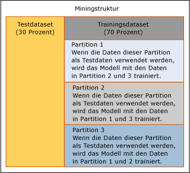

# Kreuzvalidierung (Analysis Services - Data Mining)
  Die*Kreuzvalidierung* ist ein Standardtool in der Analyse und eine wichtige Funktion, die Sie bei der Entwicklung und Feinabstimmung von Data Mining-Modellen unterstützt. Sie verwenden die übergreifende Überprüfung, nachdem Sie eine Miningstruktur und zugehörige Miningmodelle erstellt haben, um die Gültigkeit des Modells sicherzustellen.  Die übergreifende Überprüfung verfügt über die folgenden Anwendungen:  
  
-   Überprüfen der Stabilität eines bestimmten Miningmodells  
  
-   Auswerten von mehreren Modellen von einer einzelnen Anweisung  
  
-   Erstellen von mehreren Modellen und Ermitteln des besten Modells auf Grundlage der Statistik  
  
 In diesem Abschnitt wird beschrieben, wie die für Data Mining bereitgestellten Kreuzvalidierungsfunktionen verwendet werden und wie die Ergebnisse der Kreuzvalidierung auf Grundlage eines einzelnen Datasets entweder für ein einzelnes Modell oder mehrere Modelle interpretiert werden.  
  
## Übersicht über den Prozess der Kreuzvalidierung  
 Die Kreuzvalidierung besteht aus zwei Phasen: Training und Ergebnisgenerierung. Diese Phasen umfassen die folgenden Schritte:  
  
-   Sie wählen eine Zielminingstruktur aus.  
  
-   Sie legen die zu testenden Modelle fest. Dieser Schritt ist optional; Sie können auch nur die Miningstruktur testen.  
  
-   Sie geben die Parameter zum Testen der trainierten Modelle an.  
  
    -   Das vorhersagbare Attribut, der vorhergesagte Wert und der Genauigkeitsschwellenwert.  
  
    -   Die Anzahl von Aufteilungen, in die die Struktur- oder Modelldaten partitioniert werden sollen.  
  
-   [!INCLUDE[ssASnoversion](../../includes/ssasnoversion-md.md)] erstellt und trainiert so viele Modelle, wie Aufteilungen vorhanden sind.  
  
-   [!INCLUDE[ssASnoversion](../../includes/ssasnoversion-md.md)] gibt einen Satz von Genauigkeitsmetriken für jede Aufteilung in jedem Modell zurück oder für das Dataset als Ganzes.  
  
## Konfigurieren der Kreuzvalidierung  
 Sie können anpassen, wie die Kreuzvalidierung arbeitet, die die Anzahl der Querschnitte sowie die getesteten Modelle und die Genauigkeitsleiste für Vorhersagen steuert. Wenn Sie die gespeicherten Prozeduren für die Kreuzvalidierung verwenden, können Sie auch das Dataset festlegen, das für die Überprüfung der Modelle verwendet wird. Diese Vielzahl der Auswahlmöglichkeiten bedeutet, dass Sie einfach zahlreiche Sätze von unterschiedlichen Ergebnissen erstellen können, die anschließend verglichen und analysiert werden müssen.  
  
 Dieser Abschnitt enthält Informationen zur entsprechenden Konfiguration der übergreifenden Überprüfung.  
  
### Festlegen der Anzahl der Partitionen  
 Wenn Sie die Anzahl von Partitionen festlegen, bestimmen Sie, wie viele temporäre Modelle erstellt werden. Für jede Partition wird ein Querschnitt der Daten für die Verwendung als Testsatz gekennzeichnet, und ein neues Modell wird durch Training der restlichen Daten außerhalb der Partition erstellt. Dieser Prozess wird wiederholt, bis [!INCLUDE[ssASnoversion](../../includes/ssasnoversion-md.md)] die festgelegte Anzahl von Modellen erstellt und getestet hat. Die Daten, die Sie als verfügbar für die Kreuzvalidierung festgelegt haben, werden gleichmäßig über alle Partitionen verteilt.  
  
 Das Beispiel im Diagramm veranschaulicht die Verwendung der Daten, wenn drei Aufteilungen angegeben werden.  
  
   
  
 In dem Szenario in dem Diagramm enthält die Miningstruktur ein Zurückhaltungsdataset, das zu Testzwecken verwendet wird, das Testdataset wurde jedoch noch nicht für die Kreuzvalidierung hinzugefügt. Als Ergebnis werden alle Daten in dem Trainingsdataset, d. h. 70 Prozent der Daten in der Miningstruktur, für die Kreuzvalidierung verwendet. Der Bericht für die Kreuzvalidierung zeigt die Gesamtzahl der in jeder Partition verwendeten Fälle an.  
  
 Sie können auch die Anzahl der Daten festlegen, die während der Kreuzvalidierung verwendet werden, indem Sie die Anzahl der insgesamt zu verwendenden Fälle angeben. Die Fälle werden gleichmäßig über alle Aufteilungen verteilt.  
  
 Wenn Miningstrukturen in einer Instanz von SQL Server [!INCLUDE[ssASnoversion](../../includes/ssasnoversion-md.md)]gespeichert sind, ist der maximale Wert, den Sie für die Anzahl der Aufteilungen festlegen können, 256, oder die Anzahl der Fälle, je nachdem, welcher Wert der niedrigere ist. Wenn Sie eine Sitzungsminingstruktur verwenden, ist die maximale Anzahl der Aufteilungen 10.  
  
> [!NOTE]  
>  Wenn Sie die Anzahl der Aufteilungen erhöhen, verlängert sich auch die für die Ausführung der Kreuzvalidierung erforderliche Zeit entsprechend, da für jede Aufteilung ein Modell erzeugt und getestet werden muss. Wenn die Anzahl der Aufteilungen zu hoch ist, stellen Sie möglicherweise Leistungsprobleme fest.  
  
### Festlegen des Genauigkeitsschwellenwerts  
 Mithilfe des Statusschwellenwerts können Sie die Genauigkeitsleiste für Vorhersagen festlegen. Für jeden Fall berechnet das Modell die *Wahrscheinlichkeitsvorhersage*, d. h. die Wahrscheinlichkeit, dass der vorhergesagte Status korrekt ist. Wenn die Wahrscheinlichkeitsvorhersage die Genauigkeitsleiste überschreitet, wird die Vorhersage als korrekt gewertet, andernfalls wird die Vorhersage als inkorrekt gewertet. Sie steuern diesen Wert, indem Sie für **Statusschwellenwert** eine Zahl zwischen 0,0 und 1,0 festlegen. Dabei kennzeichnen Zahlen näher bei 1 ein stärkeres Vertrauen in die Vorhersage, und Zahlen näher bei 0 geben an, dass die Vorhersage eher nicht wahr ist. Der Standardwert für den Statusschwellenwert ist NULL, was bedeutet, dass der vorhergesagte Status mit der höchsten Wahrscheinlichkeit als Zielwert betrachtet wird.  
  
 Sie sollten beachten, dass die Einstellung für den Statusschwellenwert auf Measures der Modellgenauigkeit auswirkt. Angenommen, Sie haben drei Modelle, die Sie testen möchten. Alle basieren auf der gleichen Miningstruktur, und alle sagen die Spalte vorher [Bike Buyer]. Sie möchten darüberhinaus den einzelnen Wert 1 vorhersagen, was "ja, kaufen" bedeutet. Die drei Modelle geben Vorhersagen mit den Vorhersagewahrscheinlichkeiten von 0,05, 0,15 und 0,8 zurück. Wenn Sie für den Statusschwellenwert 0,10 festgelegt haben, werden zwei der Vorhersagen als korrekt gewertet. Wenn Sie für den Statusschwellenwert 0,5 festgelegt haben, wird nur ein Modell als korrekte Vorhersage gewertet. Wenn Sie den Standardwert NULL verwenden, wird die wahrscheinlichste Vorhersage als richtig gewertet. In diesem Fall würden alle drei Vorhersagen als korrekt gewertet werden.  
  
> [!NOTE]  
>  Sie können einen Wert von 0,0 für den Schwellenwert festlegen, doch ist dieser bedeutungslos, da jede Vorhersage als korrekt gewertet wird, selbst solche mit einer Wahrscheinlichkeit von NULL. Achten Sie darauf, dass Sie für **Statusschwellenwert** nicht versehentlich 0,0 festlegen.  
  
### Auswählen von Modellen und Spalten zur Überprüfung  
 Wenn Sie die Registerkarte **Kreuzvalidierung** im Data Mining-Designer verwenden, müssen Sie zunächst aus einer Liste eine vorhersagbare Spalte auswählen. Eine einzelne Miningstruktur kann in der Regel mehrere Miningmodelle unterstützen, von denen nicht alle die gleiche vorhersagbare Spalte verwenden. Wenn Sie die Kreuzvalidierung ausführen, können nur die Modelle in den Bericht aufgenommen werden, die die gleiche vorhersagbare Spalte verwenden.  
  
 Um ein vorhersagbares Attribut auszuwählen, klicken Sie auf **Zielattribut** , und wählen Sie die Spalte aus der Liste aus. Wenn das Zielattribut eine geschachtelte Spalte oder eine Spalte in einer geschachtelten Tabelle ist, geben Sie den Namen der geschachtelten Spalte im Format \<Name der geschachtelten Tabelle > (Schlüssel).\< Geschachtelte Spalte >. Wenn die Spalte der geschachtelten Tabelle die Schlüsselspalte ist, können Sie \<Name der geschachtelten Tabelle > (Schlüssel).  
  
 Nachdem Sie das vorhersagbare Attribut ausgewählt haben, testet [!INCLUDE[ssASnoversion](../../includes/ssasnoversion-md.md)] automatisch alle Modelle, die das gleiche vorhersagbare Attribut verwenden. Enthält das Zielattribut nach der Auswahl der vorhersagbaren Spalte diskrete Werte, können Sie optional einen vorhergesagten Status eingeben, wenn es einen bestimmten Wert gibt, den Sie vorhersagen möchten.  
  
 Die Auswahl des vorhergesagten Status beeinflusst die Measures, die zurückgegeben werden. Wenn Sie ein Zielattribut &ndash; also einen Spaltenamen &ndash; angeben und keinen Wert auswählen, den das Modell vorhersagen soll, wird das Model standardmäßig mit seiner Vorhersage des wahrscheinlichsten Status überprüft.  
  
 Wenn Sie die Kreuzvalidierung mit Clustermodellen verwenden, gibt es keine vorhersagbare Spalte. Stattdessen wählen Sie im Listenfeld **Zielattribut** den Eintrag **#Cluster** aus der Liste aus. Nachdem Sie diese Option ausgewählt haben, werden andere Optionen, die für Clusteringmodelle nicht relevant sind, z. B. **Zielstatus**, deaktiviert. [!INCLUDE[ssASnoversion](../../includes/ssasnoversion-md.md)] testet dann alle Clusteringmodelle, die der Miningstruktur zugeordnet sind.  
  
## Tools für die Kreuzvalidierung  
 Sie können die Kreuzvalidierung im Data Mining-Designer verwenden, oder Sie können die Kreuzvalidierung ausführen, indem Sie gespeicherte Prozeduren ausführen.  
  
 Wenn Sie die Data Mining-Designer-Tools verwenden, um die Kreuzvalidierung auszuführen, können Sie das Training und die Parameter der Genauigkeitsergebnisse in einem einzelnen Dialogfeld konfigurieren. Dies erleichtert die Einrichtung und Anzeige der Ergebnisse. Sie können die Genauigkeit aller Miningmodelle mit Bezug zu einer einzigen Miningstruktur messen und anschließend sofort die Ergebnisse in einem HTML-Bericht anzeigen. Die gespeicherten Prozeduren bieten jedoch einige Vorteile, z. B. hinzugefügte Anpassungen und die Fähigkeit, ein Skript für den Prozess zu erstellen.  
  
### Kreuzvalidierung in Data Mining-Designer  
 Sie können die Kreuzvalidierung mit der Registerkarte **Kreuzvalidierung** der Sicht „Mininggenauigkeitsdiagramm“ entweder in [!INCLUDE[ssManStudioFull](../../includes/ssmanstudiofull-md.md)] oder in SQL Server Development Studio ausführen.  
  
 Ein Beispiel zum Erstellen eines Kreuzvalidierungsberichts mithilfe der Benutzeroberfläche finden Sie unter [Erstellen von Berichten für Kreuzvalidierung](../../analysis-services/data-mining/create-a-cross-validation-report.md).  
  
### Gespeicherten Prozeduren für die Kreuzvalidierung  
 Für erfahrene Benutzer ist die Kreuzvalidierung auch in der Form vollständig parametrisierter gespeicherter Systemprozeduren verfügbar. Sie können die gespeicherten Prozeduren ausführen, indem Sie eine Verbindung mit einer Instanz von [!INCLUDE[ssManStudioFull](../../includes/ssmanstudiofull-md.md)], oder eine Anwendung mit verwaltetem Code.  
  
 Die gespeicherten Prozeduren werden nach Miningmodelltyp gruppiert. Ein Satz mit gespeicherten Prozeduren funktioniert nur mit Clustermodellen. Der andere Satz mit gespeicherten Prozeduren funktioniert mit anderen Miningmodellen.  
  
 Für jeden Typ des Miningmodells (gruppiert oder nicht gruppiert) führen die gespeicherten Prozeduren eine Kreuzvalidierung in zwei separaten Phasen aus.  
  
 **Partitionieren von Daten und Generieren von Metriken für Partitionen**  
  
 Für die erste Phase rufen Sie eine gespeicherte Systemprozedur auf, die so viele Partitionen erstellt, wie Sie im Dataset festgelegt haben, und gibt Genauigkeitsergebnisse für jede Partition zurück. Für jede Metrik berechnet Analysis Services anschließend die mittlere und die Standardabweichung für die Partitionen.  
  
-   [SystemGetCrossValidationResults &#40;Analysis Services – Data Mining&#41;](../../analysis-services/data-mining/systemgetcrossvalidationresults-analysis-services-data-mining.md)  
  
-   [SystemGetClusterCrossValidationResults &#40;Analysis Services – Data Mining&#41;](../../analysis-services/data-mining/systemgetclustercrossvalidationresults-analysis-services-data-mining.md)  
  
 **Generieren von Metriken für gesamtes Dataset**  
  
 In der zweiten Phase rufen Sie einen anderen Satz mit gespeicherten Prozeduren auf. Diese gespeicherten Prozeduren partitionieren nicht das Dataset, sondern generieren Genauigkeitsergebnisse für das festgelegte Dataset als Ganzes. Wenn Sie eine Miningstruktur bereits partitioniert und verarbeitet haben, können Sie diesen zweiten Satz mit gespeicherten Prozeduren aufrufen, um nur die Ergebnisse abzurufen.  
  
-   [SystemGetAccuracyResults &#40;Analysis Services – Data Mining&#41;](../../analysis-services/data-mining/systemgetaccuracyresults-analysis-services-data-mining.md)  
  
-   [SystemGetClusterAccuracyResults &#40;Analysis Services – Data Mining&#41;](../../analysis-services/data-mining/systemgetclusteraccuracyresults-analysis-services-data-mining.md)  
  
#### Definieren der Testdaten  
 Wenn Sie die gespeicherten Prozeduren für die Kreuzvalidierung ausführen, die die Genauigkeit berechnen (SystemGetAccuracyResults oder SystemGetClusterAccuracyResults), können Sie die Quelle der Daten festlegen, die während der Kreuzvalidierung für den Test verwendet werden. Diese Option ist in der Benutzeroberfläche nicht verfügbar.  
  
 Sie können eine der folgenden Optionen als Testdatenquelle angeben:  
  
-   Nur die Trainingsdaten verwenden  
  
-   Ein vorhandenes Testdataset einschließen  
  
-   Nur das Testdataset verwenden  
  
-   Vorhandene Filter auf jedes Modell anwenden  
  
-   Alle Kombination des Trainingssatzes, Testsatzes und der Modellfilter  
  
 Um eine Testdatenquelle anzugeben, legen Sie einen ganzzahligen Wert für den **DataSet** -Parameter der gespeicherten Prozedur fest. Eine Liste mit Argumentwerten finden Sie im Abschnitt "Anmerkungen" des relevanten Referenzthemas zur gespeicherten Prozedur.  
  
 Wenn Sie die Kreuzvalidierung mithilfe des Berichts **Kreuzvalidierung** im Data Mining-Designer ausführen, können Sie das verwendete Dataset nicht ändern. Standardmäßig werden die Trainingsfälle für jedes Modell verwendet. Wenn einem Modell ein Filter zugeordnet ist, wird der Filter angewendet.  
  
## Ergebnisse der Kreuzvalidierung  
 Wenn Sie den Data Mining-Designer verwenden, werden diese Ergebnisse in einem rasterähnlichen Web-Viewer angezeigt. Wenn Sie die gespeicherten Prozeduren für die Kreuzvalidierung verwenden, werden diese gleichen Ergebnisse als Tabelle zurückgegeben.  
  
 Der Bericht enthält zwei Typen von Measures: Aggregate, die die Variabilität des Datasets angeben, wenn Aufteilungen vorhanden sind, und modellspezifische Measures der Genauigkeit für jede Aufteilung. Die folgenden Themen stellen weitere Informationen zu diesen Metriken bereit:  
  
 [Kreuzvalidierungsformeln](../../analysis-services/data-mining/cross-validation-formulas.md)  
  
 Führt alle Measures nach Testtyp auf. Beschreibt im Allgemeinen, wie die Measures interpretiert werden können.  
  
 [Measures im Kreuzvalidierungsbericht](../../analysis-services/data-mining/measures-in-the-cross-validation-report.md)  
  
 Beschreibt die Formeln zum Berechnen jedes Measures und listet den Attributtyp auf, der für jedes Measure übernommen werden kann.  
  
## Einschränkungen in Bezug auf die Kreuzvalidierung  
 Wenn Sie die Kreuzvalidierung mithilfe des Kreuzvalidierungsberichts in SQL Server Development Studio ausführen, gelten für die Modelle, die Sie testen können, sowie für die festzulegenden Parameter einige Einschränkungen.  
  
-   Standardmäßig werden alle mit der ausgewählten Miningstruktur verbundenen Modelle per Kreuzvalidierung überprüft. Sie können weder das Modell noch eine Liste von Modellen angeben.  
  
-   Die Kreuzvalidierung wird bei Modellen nicht unterstützt, die auf dem Microsoft Time Series-Algorithmus oder dem Microsoft Sequence Clustering-Algorithmus basieren.  
  
-   Der Bericht kann nicht erstellt werden, wenn Ihre Miningstruktur keine Modelle enthält, die per Kreuzvalidierung überprüft werden können.  
  
-   Wenn die Miningstruktur sowohl Cluster- als auch Nicht-Clustermodelle enthält, und Sie die Option **#Cluster** nicht ausgewählt haben, werden die Ergebnisse für beide Modelltypen im gleichen Bericht angezeigt, auch wenn die Attribut-, Status- und Schwellenwerteinstellungen für die Clustermodelle möglicherweise nicht passen.  
  
-   Für die Werte einiger Parameter gelten Einschränkungen. Beispielsweise wird eine Warnung angezeigt, wenn die Anzahl der Aufteilungen den Wert 10 überschreitet, denn die Generierung so vieler Modelle könnte dazu führen, dass der Bericht sehr langsam angezeigt wird.  
  
 Wenn Sie mehrere Miningmodelle testen und die Modelle Filter enthalten, wird jedes Modell getrennt gefiltert. Sie können während der übergreifenden Überprüfung einem Modell keinen Filter hinzufügen oder den Filter für ein Modell ändern.  
  
 Da die Kreuzvalidierung standardmäßig alle einer Struktur zugeordneten Miningmodelle testet, erhalten Sie möglicherweise inkonsistente Ergebnisse, wenn einige Modelle einen Filter enthalten und andere nicht. Um sicherzustellen, dass Sie nur solche Modelle vergleichen, die den gleichen Filter enthalten, sollten Sie die gespeicherten Prozeduren verwenden und eine Liste von Miningmodellen festlegen. Oder verwenden Sie nur den Miningstrukturtestsatz ohne Filter, um sicherzustellen, dass für alle Modelle ein konsistenter Satz von Daten verwendet wird.  
  
 Wenn Sie die Kreuzvalidierung mit den gespeicherten Prozeduren ausführen, haben Sie zusätzlich die Option, die Quelle zum Testen von Daten auszuwählen. Wenn Sie die Kreuzvalidierung mit dem Data Mining-Designer ausführen, müssen Sie das Testdataset verwenden, das dem Modell oder der Struktur zugeordnet ist. Wenn Sie erweiterte Einstellungen angeben möchten, sollten Sie die gespeicherten Prozeduren für die Kreuzvalidierung verwenden.  
  
 Die Kreuzvalidierung kann nicht mit Zeitreihen- oder Sequenzclustermodellen verwendet werden. Insbesondere gilt, dass kein Modell, das eine KEY TIME- oder KEY SEQUENCE-Spalte enthält, in der Kreuzvalidierung vorhanden sein kann.  
  
## Verwandte Inhalte  
 Weitere Informationen zur Kreuzvalidierung oder zu verwandten Methoden für das Testen von Miningmodellen, z. B. Genauigkeitsdiagramme, finden Sie in den folgenden Themen.  
  
|Themen|Links|  
|------------|-----------|  
|Beschreibt, wie Kreuzvalidierungsparameter in SQL Server Development Studio festgelegt werden.|[Übergreifende Überprüfung &#40;Registerkarte, Mininggenauigkeitsdiagramm-Sicht&#41;](http://msdn.microsoft.com/library/bd215a68-1ad7-4046-9c44-ec8e2be13a64)|  
|Beschreibt die Metriken, die von der Kreuzvalidierung bereitgestellt werden.|[Kreuzvalidierungsformeln](../../analysis-services/data-mining/cross-validation-formulas.md)|  
|Erklärt das Kreuzvalidierungsberichtsformat und definiert die statistischen für jeden Modelltyp bereitgestellten Measures.|[Measures im Kreuzvalidierungsbericht](../../analysis-services/data-mining/measures-in-the-cross-validation-report.md)|  
|Listet die gespeicherten Prozeduren zum Berechnen von Kreuzvalidierungsstatistiken auf.|[Data Mining-gespeicherte Prozeduren &#40;Analysis Services – Data Mining&#41;](../../analysis-services/data-mining/data-mining-stored-procedures-analysis-services-data-mining.md)|  
|||  
|Beschreibt, wie ein Testdataset für Miningstrukturen und verwandte Modelle erstellt wird.|[Trainings- und Testdatasets](../../analysis-services/data-mining/training-and-testing-data-sets.md)|  
|Siehe Beispiele für weitere Genauigkeitsdiagrammtypen.|[Klassifikationsmatrix &#40;Analysis Services – Data Mining&#41;](../../analysis-services/data-mining/classification-matrix-analysis-services-data-mining.md)   [Prognosegütediagramm &#40;Analysis Services – Data Mining&#41;](../../analysis-services/data-mining/lift-chart-analysis-services-data-mining.md)   [Gewinndiagramm &#40;Analysis Services – Data Mining&#41;](../../analysis-services/data-mining/profit-chart-analysis-services-data-mining.md)   [Punktdiagramm &#40;Analysis Services – Data Mining&#41;](../../analysis-services/data-mining/scatter-plot-analysis-services-data-mining.md)|  
|Beschreibt die Schritte zum Erstellen von verschiedenen Genauigkeitsdiagrammen.|[Tasks und Anweisungen für Test und Überprüfung &#40;Data Mining&#41;](../../analysis-services/data-mining/testing-and-validation-tasks-and-how-tos-data-mining.md)|  
  
## Siehe auch  
 [Tests und Überprüfung &#40;Data Mining&#41;](../../analysis-services/data-mining/testing-and-validation-data-mining.md)  
  
  
