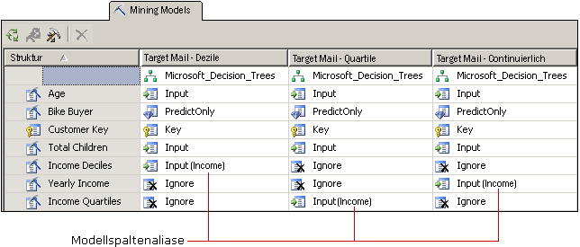

# Anpassen von Miningmodellen und -strukturen
  Nachdem Sie einen Algorithmus ausgewählt haben, der Ihren Geschäftsanforderungen entspricht, können Sie das Miningmodell mit den folgenden Verfahren anpassen, um die Ergebnisse potenziell zu verbessern.  
  
-   Verwenden Sie verschiedene Spalten mit Daten im Modell, oder ändern Sie die Nutzung, den Inhaltstyp oder Diskretisierungsmethode der Spalten.  
  
-   Erstellen Sie Filter für das Miningmodell, um die Daten einzuschränken, die beim Trainieren des Modells verwendet werden.  
  
-   Ändern Sie den Algorithmus, der zum Analysieren der Daten verwendet wurde.  
  
-   Legen Sie Algorithmusparameter fest, um Schwellenwerte, Strukturteilungen und andere wichtige Bedingungen zu steuern.  
  
 In diesem Thema werden diese Möglichkeiten beschrieben.  
  
## Ändern der vom Modell verwendeten Daten  
 Die Auswahl der im Modell zu verwendenden Datenspalten sowie die Art und Weise, wie diese Daten verwendet und verarbeitet werden, beeinflussen die Ergebnisse der Analyse. Die folgenden Themen enthalten Informationen zu diesen Optionen.  
  
### Verwenden der Funktionsauswahl  
 Die meisten Data Mining-Algorithmen in [!INCLUDE[ssASnoversion](../../includes/ssasnoversion-md.md)] verwenden einen Prozess namens *Funktionsauswahl* , um nur die nützlichsten Attribute zum Hinzufügen zu einem Modell auszuwählen. Wenn Sie die Anzahl von Spalten und Attributen reduzieren, kann die Leistung und die Qualität des Modells verbessert werden. Die verfügbaren Funktionsauswahlmethoden unterscheiden sich je nach ausgewähltem Algorithmus.  
  
 [Funktionsauswahl &#40;Data Mining&#41;](../../analysis-services/data-mining/feature-selection-data-mining.md).  
  
### Ändern von Verwendung  
 Sie können ändern, welche Spalten in einem Miningmodell enthalten sind und wie jede Spalte verwendet wird. Wenn Sie nicht die gewünschten Ergebnisse erhalten, sollten Sie die als Eingabe verwendeten Spalten überprüfen und ermitteln, ob es sich bei den Spalten um eine gute Auswahl handelt und ob Sie die Datenverarbeitung irgendwie verbessern können, z. B. durch folgende Maßnahmen:  
  
-   Identifizieren von Kategorievariablen, das fälschlicherweise als Zahlen beschriftet sind.  
  
-   Hinzufügen von Kategorien, um die Anzahl der Attribute zu reduzieren und die Suche nach Korrelationen zu vereinfachen.  
  
-   Ändern der Methode, mit der Zahlen klassifiziert oder diskretisiert werden.  
  
-   Entfernen von Spalten mit vielen eindeutigen Werten oder Spalten, die Referenzdaten enthalten und für die Analyse nicht sinnvoll sind (z. B. Adressen oder zweite Vornamen).  
  
 Sie müssen die Spalten nicht physisch aus der Miningstruktur entfernen, sondern können die Spalte als **Ignorieren**kennzeichnen. Die Spalte wird aus dem Miningmodell entfernt, kann jedoch nach wie vor für andere Miningmodelle in der Struktur verwendet oder in einer Drillthrough-Abfrage referenziert werden.  
  
### Erstellen von Aliasen für Modellspalten  
 Wenn [!INCLUDE[ssASnoversion](../../includes/ssasnoversion-md.md)] ein Miningmodell erstellt, werden die gleichen Spaltennamen verwendet, die sich in der Miningstruktur befinden. Sie können jeder Spalte im Miningmodell ein Alias hinzufügen. Auf diese Weise sind die Spalteninhalte oder deren Verwendung möglicherweise leichter zu erkennen, und der Name ist bei der Erstellung von Abfragen kürzer und damit einfacher zu handhaben. Aliase sind außerdem hilfreich, als Sie eine Kopie einer Spalte erstellen und dieser einen aussagekräftigen Namen zuweisen möchten.  
  
 Sie erstellen einen Alias, indem Sie die **Name** -Eigenschaft der Miningmodellspalte bearbeiten. [!INCLUDE[ssASnoversion](../../includes/ssasnoversion-md.md)] verwendet weiterhin den ursprünglichen Namen als ID der Spalte. Der neue Wert, den Sie unter **Name** eingegeben haben, ist der Spaltenalias. Dieser wird im Raster neben der Spaltenverwendung in Klammern angezeigt.  
  
   
  
 In der Abbildung werden verwandte Modelle dargestellt, die mehrere Kopien einer Miningstrukturspalte enthalten, die sich alle auf das Einkommen beziehen. Jede Kopie der Strukturspalte wurde auf eine andere Weise diskretisiert. Die Modelle im Diagramm verwenden alle eine andere Spalte aus der Miningstruktur, um die Spalten im Modell jedoch einfacher vergleichen zu können, wurden die Spalten in allen Modellen zu [**Einkommen**] umbenannt.  
  
### Hinzufügen von Filtern  
 Sie können einem Miningmodell einen Filter hinzufügen. Ein Filter ist ein Satz von WHERE-Bedingungen, der die Daten in den Modellfällen auf eine bestimmte Teilmenge beschränkt. Der Filter wird beim Trainieren des Modells verwendet und kann optional verwendet werden, wenn Sie das Modell testen oder Genauigkeitsdiagramme erstellen.  
  
 Durch das Hinzufügen von Filtern können Sie Miningstrukturen wiederverwenden, aber Modelle auf Grundlage anderer Datenteilmengen erstellen. Sie können Filter auch einfach dazu verwenden, bestimmte Zeilen auszuschließen und die Qualität der Analyse zu verbessern.  
  
 Weitere Informationen finden Sie unter [Filter für Miningmodelle &#40;Analysis Services – Data Mining&#41;](../../analysis-services/data-mining/filters-for-mining-models-analysis-services-data-mining.md).  
  
## Ändern des Algorithmus  
 Obwohl Modelle, die Sie der Miningstruktur neu hinzufügen, das gleiche Dataset verwenden, können Sie abweichende Ergebnisse erzielen, indem Sie einen anderen Algorithmus nutzen (wenn die Daten dies unterstützen) oder indem Sie die Parameter für den Algorithmus ändern. Sie können darüber hinaus Modellierungsflags festlegen.  
  
 Die Algorithmusauswahl bestimmt, welche Ergebnisse Sie erhalten. Allgemeine Informationen darüber, wie ein bestimmter Algorithmus funktioniert, oder die Geschäftsszenarien, in denen Sie von einem bestimmten Algorithmus profitieren, finden Sie unter [Data Mining-Algorithmen &#40;Analysis Services – Data Mining&#41;](../../analysis-services/data-mining/data-mining-algorithms-analysis-services-data-mining.md).  
  
 Eine Beschreibung der Anforderungen und Einschränkungen sowie ausführliche Informationen zu den Anpassungen, die jeder Algorithmus unterstützt, finden Sie in der technischen Referenz im Abschnitt zu dem jeweiligen Algorithmus.  
  
|||  
|-|-|  
|[Microsoft Decision Trees-Algorithmus](../../analysis-services/data-mining/microsoft-decision-trees-algorithm.md)|[Microsoft Time Series-Algorithmus](../../analysis-services/data-mining/microsoft-time-series-algorithm.md)|  
|[Microsoft Clustering-Algorithmus](../../analysis-services/data-mining/microsoft-clustering-algorithm.md)|[Microsoft Neural Network-Algorithmus](../../analysis-services/data-mining/microsoft-neural-network-algorithm.md)|  
|[Microsoft Naive Bayes-Algorithmus](../../analysis-services/data-mining/microsoft-naive-bayes-algorithm.md)|[Microsoft Logistic Regression-Algorithmus](../../analysis-services/data-mining/microsoft-logistic-regression-algorithm.md)|  
|[Microsoft Association-Algorithmus](../../analysis-services/data-mining/microsoft-association-algorithm.md)|[Microsoft Linear Regression-Algorithmus](../../analysis-services/data-mining/microsoft-linear-regression-algorithm.md)|  
|[Microsoft Sequence Clustering-Algorithmus](../../analysis-services/data-mining/microsoft-sequence-clustering-algorithm.md)||  
  
## Anpassen von Algorithmusparametern  
 Jeder Algorithmus unterstützt Parameter, die Sie zum Anpassen des Algorithmusverhaltens und zum Optimieren der Ergebnisse des Modells verwenden können. Eine Beschreibung, wie die einzelnen Parameter verwendet werden, finden Sie in den folgenden Themen:  
  
 Das Thema für jeden Algorithmustyp umfasst auch die Vorhersagefunktionen, die mit Modellen, die auf diesem Algorithmus basieren, verwendet werden können.  
  
|Eigenschaftsname|Gilt für|  
|-------------------|----------------|  
|AUTO_DETECT_PERIODICITY|[Technische Referenz für den Microsoft Time Series-Algorithmus](../../analysis-services/data-mining/microsoft-time-series-algorithm-technical-reference.md)|  
|CLUSTER_COUNT|[Technische Referenz für den Microsoft Clustering-Algorithmus](../../analysis-services/data-mining/microsoft-clustering-algorithm-technical-reference.md)   [Technische Referenz für den Microsoft Sequence Clustering-Algorithmus](../../analysis-services/data-mining/microsoft-sequence-clustering-algorithm-technical-reference.md)|  
|CLUSTER_SEED|[Technische Referenz für den Microsoft Clustering-Algorithmus](../../analysis-services/data-mining/microsoft-clustering-algorithm-technical-reference.md)|  
|CLUSTERING_METHOD|[Technische Referenz für den Microsoft Clustering-Algorithmus](../../analysis-services/data-mining/microsoft-clustering-algorithm-technical-reference.md)|  
|COMPLEXITY_PENALTY|[Technische Referenz für den Microsoft Decision Trees-Algorithmus](../../analysis-services/data-mining/microsoft-decision-trees-algorithm-technical-reference.md)   [Technische Referenz für den Microsoft Time Series-Algorithmus](../../analysis-services/data-mining/microsoft-time-series-algorithm-technical-reference.md)|  
|FORCE_REGRESSOR|[Technische Referenz für den Microsoft Decision Trees-Algorithmus](../../analysis-services/data-mining/microsoft-decision-trees-algorithm-technical-reference.md)   [Technische Referenz für den Microsoft Linear Regression-Algorithmus](../../analysis-services/data-mining/microsoft-linear-regression-algorithm-technical-reference.md)   [Modellierungsflags &#40;Data Mining&#41;](../../analysis-services/data-mining/modeling-flags-data-mining.md)|  
|FORECAST_METHOD|[Technische Referenz für den Microsoft Time Series-Algorithmus](../../analysis-services/data-mining/microsoft-time-series-algorithm-technical-reference.md)|  
|HIDDEN_NODE_RATIO|[Technische Referenz für den Microsoft Neural Network-Algorithmus](../../analysis-services/data-mining/microsoft-neural-network-algorithm-technical-reference.md)|  
|HISTORIC_MODEL_COUNT|[Technische Referenz für den Microsoft Time Series-Algorithmus](../../analysis-services/data-mining/microsoft-time-series-algorithm-technical-reference.md)|  
|HISTORICAL_MODEL_GAP|[Technische Referenz für den Microsoft Time Series-Algorithmus](../../analysis-services/data-mining/microsoft-time-series-algorithm-technical-reference.md)|  
|HOLDOUT_PERCENTAGE|[Technische Referenz für den Microsoft Logistic Regression-Algorithmus](../../analysis-services/data-mining/microsoft-logistic-regression-algorithm-technical-reference.md)   [Technische Referenz für den Microsoft Neural Network-Algorithmus](../../analysis-services/data-mining/microsoft-neural-network-algorithm-technical-reference.md)   Hinweis: Dieser Parameter unterscheidet sich vom Prozentsatz für zurückgehaltene Daten, der für Miningstrukturen gilt.|  
|HOLDOUT_SEED|[Technische Referenz für den Microsoft Logistic Regression-Algorithmus](../../analysis-services/data-mining/microsoft-logistic-regression-algorithm-technical-reference.md)   [Technische Referenz für den Microsoft Neural Network-Algorithmus](../../analysis-services/data-mining/microsoft-neural-network-algorithm-technical-reference.md)   Hinweis: Dieser Parameter unterscheidet sich vom Ausgangswert für zurückgehaltene Daten, der für Miningstrukturen gilt.|  
|INSTABILITY_SENSITIVITY|[Technische Referenz für den Microsoft Time Series-Algorithmus](../../analysis-services/data-mining/microsoft-time-series-algorithm-technical-reference.md)|  
|MAXIMUM_INPUT_ATTRIBUTES|[Technische Referenz für den Microsoft Clustering-Algorithmus](../../analysis-services/data-mining/microsoft-clustering-algorithm-technical-reference.md)   [Technische Referenz für den Microsoft Decision Trees-Algorithmus](../../analysis-services/data-mining/microsoft-decision-trees-algorithm-technical-reference.md)   [Technische Referenz für den Microsoft Linear Regression-Algorithmus](../../analysis-services/data-mining/microsoft-linear-regression-algorithm-technical-reference.md)   [Technische Referenz für den Microsoft Naive Bayes-Algorithmus](../../analysis-services/data-mining/microsoft-naive-bayes-algorithm-technical-reference.md)   [Technische Referenz für den Microsoft Neural Network-Algorithmus](../../analysis-services/data-mining/microsoft-neural-network-algorithm-technical-reference.md)   [Technische Referenz für den Microsoft Logistic Regression-Algorithmus](../../analysis-services/data-mining/microsoft-logistic-regression-algorithm-technical-reference.md)|  
|MAXIMUM_ITEMSET_COUNT|[Technische Referenz für den Microsoft Association-Algorithmus](../../analysis-services/data-mining/microsoft-association-algorithm-technical-reference.md)|  
|MAXIMUM_ITEMSET_SIZE|[Technische Referenz für den Microsoft Association-Algorithmus](../../analysis-services/data-mining/microsoft-association-algorithm-technical-reference.md)|  
|MAXIMUM_OUTPUT_ATTRIBUTES|[Technische Referenz für den Microsoft Decision Trees-Algorithmus](../../analysis-services/data-mining/microsoft-decision-trees-algorithm-technical-reference.md)   [Technische Referenz für den Microsoft Linear Regression-Algorithmus](../../analysis-services/data-mining/microsoft-linear-regression-algorithm-technical-reference.md)   [Technische Referenz für den Microsoft Logistic Regression-Algorithmus](../../analysis-services/data-mining/microsoft-logistic-regression-algorithm-technical-reference.md)   [Technische Referenz für den Microsoft Naive Bayes-Algorithmus](../../analysis-services/data-mining/microsoft-naive-bayes-algorithm-technical-reference.md)   [Technische Referenz für den Microsoft Neural Network-Algorithmus](../../analysis-services/data-mining/microsoft-neural-network-algorithm-technical-reference.md)|  
|MAXIMUM_SEQUENCE_STATES|[Technische Referenz für den Microsoft Sequence Clustering-Algorithmus](../../analysis-services/data-mining/microsoft-sequence-clustering-algorithm-technical-reference.md)|  
|MAXIMUM_SERIES_VALUE|[Technische Referenz für den Microsoft Time Series-Algorithmus](../../analysis-services/data-mining/microsoft-time-series-algorithm-technical-reference.md)|  
|MAXIMUM_STATES|[Technische Referenz für den Microsoft Clustering-Algorithmus](../../analysis-services/data-mining/microsoft-clustering-algorithm-technical-reference.md)   [Technische Referenz für den Microsoft Neural Network-Algorithmus](../../analysis-services/data-mining/microsoft-neural-network-algorithm-technical-reference.md)   [Technische Referenz für den Microsoft Sequence Clustering-Algorithmus](../../analysis-services/data-mining/microsoft-sequence-clustering-algorithm-technical-reference.md)|  
|MAXIMUM_SUPPORT|[Technische Referenz für den Microsoft Association-Algorithmus](../../analysis-services/data-mining/microsoft-association-algorithm-technical-reference.md)|  
|MINIMUM_IMPORTANCE|[Technische Referenz für den Microsoft Association-Algorithmus](../../analysis-services/data-mining/microsoft-association-algorithm-technical-reference.md)|  
|MINIMUM_ITEMSET_SIZE|[Technische Referenz für den Microsoft Association-Algorithmus](../../analysis-services/data-mining/microsoft-association-algorithm-technical-reference.md)|  
|MINIMUM_DEPENDENCY_PROBABILITY|[Technische Referenz für den Microsoft Naive Bayes-Algorithmus](../../analysis-services/data-mining/microsoft-naive-bayes-algorithm-technical-reference.md)|  
|MINIMUM_PROBABILITY|[Technische Referenz für den Microsoft Association-Algorithmus](../../analysis-services/data-mining/microsoft-association-algorithm-technical-reference.md)|  
|MINIMUM_SERIES_VALUE|[Technische Referenz für den Microsoft Time Series-Algorithmus](../../analysis-services/data-mining/microsoft-time-series-algorithm-technical-reference.md)|  
|MINIMUM_SUPPORT|[Technische Referenz für den Microsoft Association-Algorithmus](../../analysis-services/data-mining/microsoft-association-algorithm-technical-reference.md)   [Technische Referenz für den Microsoft Clustering-Algorithmus](../../analysis-services/data-mining/microsoft-clustering-algorithm-technical-reference.md)   [Technische Referenz für den Microsoft Decision Trees-Algorithmus](../../analysis-services/data-mining/microsoft-decision-trees-algorithm-technical-reference.md)   [Technische Referenz für den Microsoft Sequence Clustering-Algorithmus](../../analysis-services/data-mining/microsoft-sequence-clustering-algorithm-technical-reference.md)   [Technische Referenz für den Microsoft Time Series-Algorithmus](../../analysis-services/data-mining/microsoft-time-series-algorithm-technical-reference.md)|  
|MISSING_VALUE_SUBSTITUTION|[Technische Referenz für den Microsoft Time Series-Algorithmus](../../analysis-services/data-mining/microsoft-time-series-algorithm-technical-reference.md)|  
|MODELLING_CARDINALITY|[Technische Referenz für den Microsoft Clustering-Algorithmus](../../analysis-services/data-mining/microsoft-clustering-algorithm-technical-reference.md)|  
|PERIODICITY_HINT|[Technische Referenz für den Microsoft Time Series-Algorithmus](../../analysis-services/data-mining/microsoft-time-series-algorithm-technical-reference.md)|  
|PREDICTION_SMOOTHING|[Technische Referenz für den Microsoft Time Series-Algorithmus](../../analysis-services/data-mining/microsoft-time-series-algorithm-technical-reference.md)|  
|SAMPLE_SIZE|[Technische Referenz für den Microsoft Clustering-Algorithmus](../../analysis-services/data-mining/microsoft-clustering-algorithm-technical-reference.md)   [Technische Referenz für den Microsoft Logistic Regression-Algorithmus](../../analysis-services/data-mining/microsoft-logistic-regression-algorithm-technical-reference.md)   [Technische Referenz für den Microsoft Neural Network-Algorithmus](../../analysis-services/data-mining/microsoft-neural-network-algorithm-technical-reference.md)|  
|SCORE_METHOD|[Technische Referenz für den Microsoft Decision Trees-Algorithmus](../../analysis-services/data-mining/microsoft-decision-trees-algorithm-technical-reference.md)|  
|SPLIT_METHOD|[Technische Referenz für den Microsoft Decision Trees-Algorithmus](../../analysis-services/data-mining/microsoft-decision-trees-algorithm-technical-reference.md)|  
|STOPPING_TOLERANCE|[Technische Referenz für den Microsoft Clustering-Algorithmus](../../analysis-services/data-mining/microsoft-clustering-algorithm-technical-reference.md)|  
  
## Siehe auch  
 [Data Mining-Algorithmen &#40;Analysis Services – Data Mining&#41;](../../analysis-services/data-mining/data-mining-algorithms-analysis-services-data-mining.md)   
 [Physische Architektur &#40;Analysis Services – Data Mining&#41;](../../analysis-services/data-mining/physical-architecture-analysis-services-data-mining.md)  
  
  

