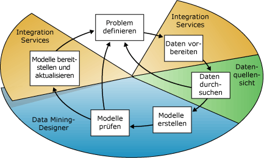
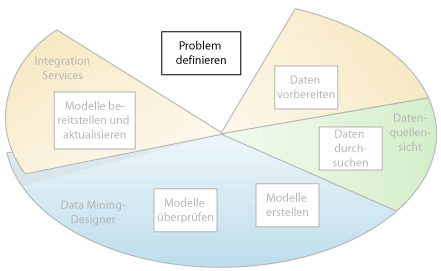
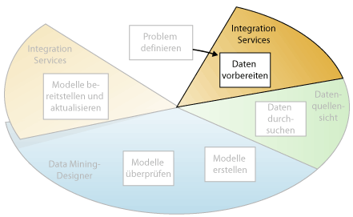
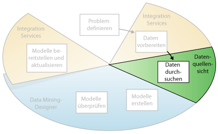
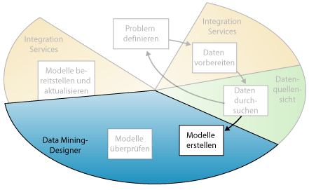
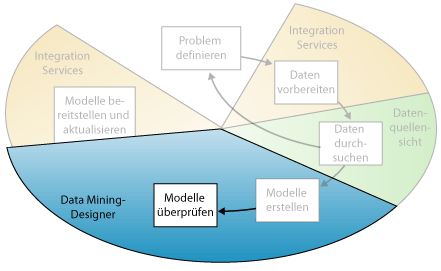
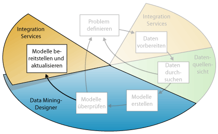

# Data Mining-Konzepte
  Data Mining ist der Prozess der Ermittlung aussagefähiger Informationen aus großen Datensätzen. Data Mining nutzt die mathematische Analyse zur Aufdeckung von Mustern und Trends in Daten. Üblicherweise können diese Muster nicht durch das traditionelle Durchsuchen von Daten ermittelt werden, da die Beziehungen zu komplex sind oder zu viele Daten bestehen.  
  
 Diese Muster und Trends können gesammelt und als *Data Mining-Modell*definiert werden. Miningmodelle können auf spezifische Szenarien angewendet werden, beispielsweise:  
  
-   **Planungserstellung**: Schätzen des Absatzes, Vorhersagen der Serverlast oder Serverausfallzeiten  
  
-   **Risiko und Wahrscheinlichkeit**: Auswählen der besten Kunden für Targeted Mailings, Bestimmen der wahrscheinlichen Gewinnschwelle für Risikoszenarios, Zuweisen von Wahrscheinlichkeiten zu Diagnosen oder anderen Ergebnissen  
  
-   **Empfehlungen**: Ermitteln von Produkten mit Cross-Selling-Potenzial und Generieren von Empfehlungen  
  
-   **Ermitteln von Reihenfolgen**: Analysieren der Kundenauswahl in einem Einkaufswagen, Vorhersagen der nächsten wahrscheinlichen Ereignisse  
  
-   **Gruppieren**: Unterteilen von Kunden oder Ereignissen in Cluster verwandter Elemente, Analysieren und Vorhersagen von Affinitäten  
  
 Die Erstellung eines Miningmodells muss als Teil eines größeren Prozesses verstanden werden, der sich von der Fragestellung im Hinblick auf die Daten und die Erstellung eines Modells zur Beantwortung dieser Fragen bis hin zur Implementierung des Modells in einer Arbeitsumgebung erstreckt. Ein Data Mining-Prozess besteht im Wesentlichen aus sechs Schritten:  
  
1.  [Definieren der Problemstellung](#DefiningTheProblem)  
  
2.  [Vorbereiten der Daten](#PreparingData)  
  
3.  [Durchsuchen von Daten](#ExploringData)  
  
4.  [Erstellen von Modellen](#BuildingModels)  
  
5.  [Durchsuchen und Validieren von Modellen](#ValidatingModels)  
  
6.  [Bereitstellen und Aktualisieren von Modellen](#DeployingandUpdatingModels)  
  
 Das folgende Diagramm beschreibt das Beziehungsgefüge dieser Schritte und die Technologien in [!INCLUDE[msCoName](../../includes/msconame-md.md)] [!INCLUDE[ssNoVersion](../../includes/ssnoversion-md.md)] , mit denen Sie den jeweiligen Schritt ausführen können.  
  
   
  
 Der im Diagramm veranschaulichte Prozess ist zyklisch, d. h., dass ein Data Mining-Modell in einem dynamischen, sich wiederholenden Prozess erstellt wird. Nachdem Sie die Daten durchsucht haben, kommen Sie u. U. zu dem Ergebnis, dass Ihr Datenmaterial nicht ausreicht, um die geeigneten Miningmodelle zu erstellen, und dass Sie deshalb nach weiteren Daten suchen müssen. Vielleicht erstellen Sie auch mehrere Modelle und stellen dann fest, dass diese nicht in geeigneter Weise das von Ihnen definierte Problem lösen und dass Sie deshalb das Problem neu definieren müssen. Möglicherweise müssen die Modelle nach ihrer Implementierung angepasst werden, da mehr Daten zur Verfügung stehen. Jeder Schritt des Prozesses kann so oft wiederholt werden, wie es für die Erstellung eines qualifizierten Modells notwendig ist.  
  
 Microsoft SQL Server Data Mining stellt eine integrierte Umgebung für die Erstellung und Verwendung von Data Mining-Modellen zur Verfügung. Diese Umgebung umfasst SQL Server Development Studio mit Data Mining-Algorithmen und Abfragetools, die das Erstellen einer umfassenden Projektmappe für unterschiedlichste Projekte erleichtern, sowie [!INCLUDE[ssManStudioFull](../../includes/ssmanstudiofull-md.md)]mit Tools zum Durchsuchen von Modellen und Verwalten von Data Mining-Objekten. Weitere Informationen finden Sie unter [Erstellen mehrdimensionaler Modelle mit SQL Server Data Tools &#40;SSDT&#41;](../../analysis-services/multidimensional-models/creating-multidimensional-models-using-sql-server-data-tools-ssdt.md).  
  
 Ein Beispiel dafür, wie die [!INCLUDE[ssNoVersion](../../includes/ssnoversion-md.md)] -Tools auf ein Geschäftsszenario angewandt werden können, finden Sie unter [Tutorial zu Data Mining-Grundlagen](http://msdn.microsoft.com/library/6602edb6-d160-43fb-83c8-9df5dddfeb9c).  
  
##   Definieren der Problemstellung  
 Wie das folgende Diagramm verdeutlicht, besteht der erste Schritt des Data Mining-Prozesses darin, die Problemstellung exakt zu definieren und Möglichkeiten aufzuzeigen, wie das Problem anhand der richtigen Daten gelöst werden kann.  
  
   
  
 Dieser Schritt schließt das Analysieren der Geschäftsanforderungen, das Festlegen des Problemumfangs, das Definieren der Erfolgsfaktoren für die Modellbewertung und das Formulieren der spezifischen Zielsetzung des Data Mining-Projekts ein. Diese Tasks lassen sich u. a. in folgende Fragen übersetzen:  
  
-   Wonach suchen Sie? Welche Art von Beziehung versuchen Sie ausfindig zu machen?  
  
-   Spiegelt das Problem, das Sie lösen möchten, die Richtlinien oder Prozesse des Unternehmens wider?  
  
-   Möchten Sie mit dem Data Mining-Modell Vorhersagen treffen oder nur interessante Muster oder Zusammenhänge aufdecken?  
  
-   Welche Ergebnisse oder Attribute sollen vorhergesagt werden?  
  
-   Welche Art von Daten liegen vor, und welche Informationstypen sind in den einzelnen Spalten enthalten? Wie stehen die Tabellen miteinander in Beziehung, wenn mehrere Tabellen vorhanden sein sollten? Müssen Bereinigungen, Aggregationen oder Verarbeitungsschritte ausgeführt werden, damit die Daten nutzbar werden?  
  
-   Wie sind die Daten gestreut? Sind die Daten saisonbedingt? Spiegeln die Daten die Prozesse des Unternehmens in geeigneter Weise wider?  
  
 Um diese Fragen zu beantworten, müssen Sie u. U. im Rahmen einer Datenverfügbarkeitsstudie den Bedarf von Geschäftsanwendern im Hinblick auf die verfügbaren Daten ermitteln. Wenn die Daten den Bedarf der Benutzer nicht unterstützen, müssen Sie das Projekt evtl. neu definieren.  
  
 Darüber hinaus müssen Sie die Art und Weise berücksichtigen, in der die Ergebnisse des Modells in die zur Messung des Geschäftserfolgs verwendeten Key Performance Indicators (KPI) eingebunden werden können.  
  
##   Vorbereiten der Daten  
 Wie das folgende Diagramm verdeutlicht, besteht der zweite Schritt des Data Mining-Prozesses im Konsolidieren und Bereinigen der im Schritt [Definieren der Problemstellung](#DefiningTheProblem) identifizierten Daten.  
  
   
  
 Daten können im gesamten Unternehmen verstreut und in unterschiedlichen Formaten gespeichert sein. Mitunter weisen sie Inkonsistenzen wie falsche oder fehlende Einträge auf. Es kann beispielsweise vorkommen, dass den Daten zufolge ein Produkt gekauft wurde, das auf dem Markt zu diesem Zeitpunkt noch nicht erhältlich war, oder die Daten zeigen, dass ein Kunde regelmäßig in einem Geschäft 2.000 Meilen von seinem Wohnsitz entfernt Einkäufe tätigt.  
  
 Beim Data Cleaning geht es nicht nur um das Löschen fehlerhafter Daten oder Interpolieren fehlender Werte, sondern auch um das Auffinden versteckter Beziehungen in den Daten, die Identifikation der genauesten Datenquellen und die Festlegung der Spalten, die für die Analyse am besten geeignet sind. Zum Beispiel: Sollte das Versanddatum oder das Bestelldatum verwendet werden? Ist der beste Verkaufseinflussfaktor die Menge, der Gesamtpreis oder ein diskontierter Preis? Unvollständige Daten, falsche Daten und Eingaben, die separat erscheinen, aber tatsächlich stark korrelieren, können die Ergebnisse des Modells in unerwarteter Weise beeinflussen.  
  
 Daher sollten Sie diese Probleme bestimmen, bevor Sie mit der Erstellung der Miningmodelle beginnen, und festlegen, wie Sie sie beheben wollen. Beim Data Mining verwenden Sie in der Regel ein sehr umfangreiches Dataset und können nicht jede Transaktion auf Datenqualität überprüfen. Aus diesem Grund benötigen Sie u. U. Tools für die Erstellung von Datenprofilen sowie die automatische Datenbereinigung und -filterung. Mithilfe der in [!INCLUDE[ssISnoversion](../../includes/ssisnoversion-md.md)], [!INCLUDE[ssMDSlong](../../includes/ssmdslong-md.md)]oder [!INCLUDE[ssDQSnoversionLong](../../includes/ssdqsnoversionlong-md.md)] bereitgestellten Tools lassen sich Daten durchsuchen und Inkonsistenzen aufdecken. Weitere Informationen finden Sie in den folgenden Ressourcen:  
  
-   [Integration Services in Business Intelligence Development Studio](https://technet.microsoft.com/library/ms174181\(v=sql.110\).aspx)  
  
-   [Übersicht über Master Data Services &#40;MDS&#41;](../../master-data-services/master-data-services-overview-mds.md)  
  
-   [Data Quality Services](../../data-quality-services/data-quality-services.md)  
  
 Wichtig zu erwähnen ist, dass die für das Data Mining verwendeten Daten nicht in einem OLAP-Cube (Online Analytical Processing, Analytische Onlineverarbeitung) oder in einer relationalen Datenbank gespeichert werden müssen, auch wenn beide als Datenquellen verwendet werden können. Das Data Mining kann mit jeder Datenquelle durchgeführt werden, die als [!INCLUDE[ssASnoversion](../../includes/ssasnoversion-md.md)] -Datenquelle definiert wurde. Hierzu können Textdateien, Excel-Arbeitsmappen oder Daten von anderen externen Anbietern gehören. Weitere Informationen finden Sie unter [Unterstützte Datenquellen &#40;SSAS – Mehrdimensional&#41;](../../analysis-services/multidimensional-models/supported-data-sources-ssas-multidimensional.md).  
  
##   Durchsuchen von Daten  
 Wie das nachstehende Diagramm verdeutlicht, besteht der dritte Schritt des Data Mining-Prozesses im Durchsuchen der vorbereiteten Daten.  
  
   
  
 Nur wenn Sie Ihre Datensituation verstanden haben, können Sie beim Erstellen der Miningmodelle sinnvolle Entscheidungen treffen. Zu den Durchsuchungstechniken gehören das Berechnen von Mindest- und Maximalwerten, das Ermitteln von mittleren Abweichungen und Standardabweichungen und das Analysieren der Datenstreuung. Beispielsweise können Sie gegebenenfalls durch Prüfung der Maximal-, Mindest- und Mittelwerte ermitteln, dass die Daten nicht repräsentativ für Ihre Kunden oder Geschäftsprozesse sind und dass Sie daher ausgewogenere Daten benötigen oder die Annahmen prüfen müssen, die Grundlage Ihrer Erwartungen sind. Standardabweichungen und andere Streuungswerte können nützliche Informationen über die Stabilität und Genauigkeit der Ergebnisse bieten. Eine große Standardabweichung kann darauf hinweisen, dass ein weiteres Hinzufügen von Daten bei der Verbesserung des Modells hilfreich sein kann. Daten, die stark von einer Standardverteilung abweichen, können verfälscht sein oder ein genaues Abbild eines realen Problems darstellen. In jedem Fall erschweren Sie die Anpassung eines Modells auf die Daten.  
  
 Durch das Durchsuchen der Daten angesichts Ihres eigenen Verständnisses des Geschäftsproblems können Sie entscheiden, ob das Dataset verfälschte Daten enthält. Daraufhin können Sie eine Strategie für die Behebung des Problems ausarbeiten oder ein tieferes Verständnis über die Verhaltensweisen erlangen, die für Ihr Unternehmen typisch sind.  
  
 Mithilfe von Tools wie [!INCLUDE[ssMDSshort](../../includes/ssmdsshort-md.md)] können Sie verfügbare Datenquellen überprüfen und deren Verfügbarkeit für das Data Mining bestimmen. Um die Verteilung der Daten zu analysieren und Probleme aufgrund falscher oder fehlender Daten zu beheben, können Sie Tools wie [!INCLUDE[ssDQSnoversionLong](../../includes/ssdqsnoversionlong-md.md)]oder den Datenprofiler in Integration Services verwenden.  
  
 Nachdem Sie die Quellen definiert haben, kombinieren Sie sie mit dem Datenquellensicht-Designer in [!INCLUDE[ssBIDevStudio](../../includes/ssbidevstudio-md.md)]in einer Datenquellensicht. Weitere Informationen finden Sie unter [Datenquellsichten in mehrdimensionalen Modellen](../../analysis-services/multidimensional-models/data-source-views-in-multidimensional-models.md). Dieser Designer bietet zusätzlich einige Tools, mit denen Daten durchsucht und sichergestellt werden kann, dass die Daten für die Modellerstellung geeignet sind. Weitere Informationen finden Sie unter [Durchsuchen von Daten in einer Datenquellensicht &#40;Analysis Services&#41;](../../analysis-services/multidimensional-models/explore-data-in-a-data-source-view-analysis-services.md).  
  
 Wenn Sie ein Modell erstellen, erzeugt [!INCLUDE[ssASnoversion](../../includes/ssasnoversion-md.md)] automatisch statistische Zusammenfassungen der im Modell enthaltenen Daten, auf die Sie zur Verwendung in Berichten oder weiteren Analysen zurückgreifen können. Weitere Informationen finden Sie unter [Data Mining-Abfragen](../../analysis-services/data-mining/data-mining-queries.md).  
  
##   Erstellen von Modellen  
 Wie das nachstehende Diagramm verdeutlicht, besteht der vierte Prozessschritt des Data Mining-Prozesses im Generieren eines oder mehrerer Miningmodelle. Sie werden die im Schritt [Durchsuchen von Daten](#ExploringData) gewonnenen Erkenntnisse verwenden, um die Modelle zu definieren und zu erstellen.  
  
   
  
 Sie definieren die zu verwendenden Datenspalten, indem Sie eine Miningstruktur erstellen. Die Miningstruktur ist zwar mit der Datenquelle verknüpft, enthält bis zu ihrer Verarbeitung jedoch keine Daten. Wenn Sie die Miningstruktur verarbeiten, erzeugt [!INCLUDE[ssASnoversion](../../includes/ssasnoversion-md.md)] Aggregate und andere statistische Informationen, die zu Analysezwecken verwendet werden können. Diese Informationen können von allen Miningmodellen verwendet werden, die auf der Struktur basieren. Weitere Informationen dazu, wie Miningstrukturen mit Miningmodellen in Beziehung stehen, finden Sie unter [Logische Architektur &#40;Analysis Services – Data Mining&#41;](../../analysis-services/data-mining/logical-architecture-analysis-services-data-mining.md).  
  
 Bevor die Struktur und das Modell verarbeitet werden, fungiert auch ein Miningmodell lediglich als Container, in dem die Spalten angegeben sind, die für die Eingabe verwendet werden, die Attribute, die Sie vorhersagen, und die Parameter, die den Algorithmus anweisen, wie die Daten verarbeitet werden. Die Modellverarbeitung wird häufig als *Training*bezeichnet. Training bezieht sich auf den Vorgang der Anwendung eines spezifischen mathematischen Algorithmus auf die Daten in der Struktur, um Muster zu extrahieren. Die im Trainingsprozess gefundenen Muster hängen von der Auswahl der Trainingsdaten, dem ausgewählten Algorithmus und dessen Konfiguration ab. [!INCLUDE[ssCurrent](../../includes/sscurrent-md.md)] enthält viele verschiedene Algorithmen, die für unterschiedliche Tasks ausgelegt sind und zur Erstellung unterschiedlicher Modelltypen dienen. Eine Liste der in [!INCLUDE[ssCurrent](../../includes/sscurrent-md.md)] bereitgestellten Algorithmen finden Sie unter [Data Mining-Algorithmen &#40;Analysis Services – Data Mining&#41;](../../analysis-services/data-mining/data-mining-algorithms-analysis-services-data-mining.md).  
  
 Darüber hinaus können Sie Parameter einsetzen, um jeden Algorithmus anzupassen, und Sie können Filter auf die Trainingsdaten anwenden, um nur eine Teilmenge der Daten zu verwenden, wodurch unterschiedliche Ergebnisse erreicht werden. Nachdem Daten durch das Modell gelaufen sind, enthält das Miningmodellobjekt Zusammenfassungen und Muster, die abgefragt oder für Vorhersagen verwendet werden können.  
  
 Ein neues Modell können Sie mithilfe des Data Mining-Assistenten in [!INCLUDE[ssBIDevStudio](../../includes/ssbidevstudio-md.md)] oder über die Abfragesprache Data Mining-Erweiterungen (Data Mining Extensions, DMX) definieren. Weitere Informationen zur Verwendung des Data Mining-Assistenten finden Sie unter [Data Mining-Assistent &#40;Analysis Services – Data Mining&#41;](../../analysis-services/data-mining/data-mining-wizard-analysis-services-data-mining.md). Weitere Informationen zum Verwenden von DMX finden Sie unter [Data Mining-Erweiterungen &#40;DMX&#41; – Referenz](../../dmx/data-mining-extensions-dmx-reference.md).  
  
 Es ist zu beachten, dass bei jeder Datenänderung sowohl die Miningstruktur als auch das Miningmodell aktualisiert werden müssen. Wenn Sie eine Miningstruktur durch eine erneute Verarbeitung aktualisieren, ruft [!INCLUDE[ssASnoversion](../../includes/ssasnoversion-md.md)] Daten von der Quelle ab, einschließlich aller neuen Daten, wenn die Quelle dynamisch aktualisiert wird, und füllt die Miningstruktur neu. Wenn Sie Modelle haben, die auf der Struktur basieren, können Sie auswählen, ob die Modelle, die auf der Struktur basieren, aktualisiert werden sollen, d. h. sie werden mit den neuen Daten erneut trainiert, oder Sie können die Modelle so belassen, wie sie sind. Weitere Informationen finden Sie unter [Anforderungen und Überlegungen zur Verarbeitung &#40;Data Mining&#41;](../../analysis-services/data-mining/processing-requirements-and-considerations-data-mining.md).  
  
##   Durchsuchen und Validieren von Modellen  
 Wie das folgende Diagramm verdeutlicht, besteht der fünfte Schritt des Data Mining-Prozesses im Durchsuchen der von Ihnen generierten Miningmodelle und im Testen ihrer Wirksamkeit.  
  
   
  
 Bevor Sie ein Modell in einer Produktionsumgebung einsetzen, möchten Sie wahrscheinlich testen, wie gut das Modell ist. Ferner erstellt man üblicherweise beim Aufbau eines Modells mehrere Modelle mit unterschiedlichen Konfigurationen und testet alle Modelle, um herauszufinden, welches die besten Ergebnisse für das Problem und die Daten erzielt.  
  
 [!INCLUDE[ssASnoversion](../../includes/ssasnoversion-md.md)] bietet Tools, die hilfreich bei der Trennung Ihrer Daten in Trainings- und Testdatasets sind. So können Sie die Leistungsfähigkeit aller Modelle an den gleichen Daten genau bewerten. Mit dem Trainings-Dataset wird das Modell generiert, während das Test-Dataset mithilfe von Vorhersageabfragen die Genauigkeit des Modells testet. Diese Partitionierung ist möglich, während der Erstellung des Miningmodells automatisch. Weitere Informationen finden Sie unter [Tests und Überprüfung &#40;Data Mining&#41;](../../analysis-services/data-mining/testing-and-validation-data-mining.md).  
  
 Die von den Algorithmen ermittelten Trends und Muster können mit den Viewern im Data Mining-Designer in [!INCLUDE[ssBIDevStudio](../../includes/ssbidevstudio-md.md)]analysiert werden. Weitere Informationen finden Sie unter [Data Mining-Modell-Viewer](../../analysis-services/data-mining/data-mining-model-viewers.md). Darüber hinaus können Sie testen, wie gut die Modelle Vorhersagen erstellen. Für diese Tasks stehen im Designer Tools wie das Prognosegütediagramm und die Klassifikationsmatrix zur Verfügung. Sie können eine statistische Technik mit dem Namen *Kreuzvalidierung* nutzen, um automatisch Teilmengen der Daten zu erstellen und das Modell gegen jede Teilmenge zu testen, um zu bestimmen, ob das Modell spezifisch für Ihre Daten ist oder verwendet werden kann, um Rückschlüsse auf die allgemeine Population zu ziehen. Weitere Informationen finden Sie unter [Tests und Überprüfung &#40;Data Mining&#41;](../../analysis-services/data-mining/testing-and-validation-data-mining.md).  
  
 Wenn die Leistung bei keinem der Modelle, die Sie im Schritt [Erstellen von Modellen](#BuildingModels) erstellt haben, befriedigend ist, müssen Sie möglicherweise zu einem vorhergehenden Prozessschritt zurückkehren und das Problem neu definieren oder die Daten im ursprünglichen Dataset neu analysieren.  
  
##   Bereitstellen und Aktualisieren von Modellen  
 Wie das folgende Diagramm verdeutlicht, besteht der letzte Schritt des Data Mining-Prozesses darin, in einer Produktionsumgebung diejenigen Modelle bereitzustellen, die die besten Ergebnisse erzielen.  
  
   
  
 Sobald die Miningmodelle in eine Produktionsumgebung integriert wurden, stehen sie je nach Bedarf für zahlreiche Tasks zur Verfügung. Sie können u. a. folgende Tasks ausführen:  
  
-   Verwenden Sie die Modelle zum Erstellen von Vorhersagen, mit deren Hilfe Geschäftsentscheidungen getroffen werden können. [!INCLUDE[ssNoVersion](../../includes/ssnoversion-md.md)] stellt die DMX-Sprache zur Verfügung, die Sie zum Erstellen von Vorhersageabfragen verwenden können. Darüber hinaus unterstützt Sie der Generator für Vorhersageabfragen beim Erstellen der Abfragen. Weitere Informationen finden Sie unter [Data Mining-Erweiterungen &#40;DMX&#41; – Referenz](../../dmx/data-mining-extensions-dmx-reference.md).  
  
-   Erstellen von Inhaltsabfragen, um Statistik, Regeln oder Formeln für das Modell abzurufen. Weitere Informationen finden Sie unter [Data Mining-Abfragen](../../analysis-services/data-mining/data-mining-queries.md).  
  
-   Data Mining-Funktionen in eine Anwendung integrieren. Sie können Analysis Management Objects (AMO) hinzufügen, das mehrere Objekte enthält, mit denen Ihre Anwendung Miningstrukturen und -modelle erstellen, ändern, verarbeiten und löschen. Alternativ können Sie XMLA-Nachrichten (XML for Analysis) direkt an eine Instanz von [!INCLUDE[ssASnoversion](../../includes/ssasnoversion-md.md)]senden. Weitere Informationen finden Sie unter [Bereitstellung (Analysis Services – Data Mining)](https://technet.microsoft.com/library/bb522473\(v=sql.110\).aspx).  
  
-   Mit [!INCLUDE[ssISnoversion](../../includes/ssisnoversion-md.md)] ein Paket erstellen, in dem mithilfe eines Miningmodells eingehende Daten eigenständig aufgeteilt und mehreren Tabellen zugeordnet werden. Wenn eine Datenbank beispielsweise fortlaufend mit potenziellen Neukunden aktualisiert wird, können Sie ein Miningmodell zusammen mit [!INCLUDE[ssISnoversion](../../includes/ssisnoversion-md.md)] dazu verwenden, die eingehenden Daten zwei verschiedenen Kundengruppen zuzuordnen: einer Gruppe, deren Kunden wahrscheinlich ein Produkt kaufen, und einer anderen, deren Kunden wahrscheinlich kein Produkt kaufen. Weitere Informationen finden Sie unter [Typische Verwendungen von SQL Server Integration Services](http://msdn.microsoft.com/en-us/3b97897a-d418-4ef4-b5a4-5aabf4fa6bca).  
  
-   Einen Bericht erstellen, mit dem Abfragen direkt für ein vorhandenes Miningmodell ausgeführt werden können. Weitere Informationen finden Sie unter [Reporting Services in SQL Server Data Tools &#40;SSDT&#41;](../../reporting-services/tools/reporting-services-in-sql-server-data-tools-ssdt.md).  
  
-   Nach Überprüfung und Analyse die Modelle aktualisieren. Jedes Update erfordert, dass Sie die Modelle erneut verarbeiten. Weitere Informationen finden Sie unter [Processing Data Mining Objects](../../analysis-services/data-mining/processing-data-mining-objects.md).  
  
-   Ein dynamischea Update der Modelle, während neue Daten in das Unternehmen kommen, und die konstante Vornahme von Änderungen zur Verbesserung der Effizienz der Lösung sollten Teil der Bereitstellungsstrategie sein. Weitere Informationen finden Sie unter [Verwaltung von Data Mining-Lösungen und -Objekten](../../analysis-services/data-mining/management-of-data-mining-solutions-and-objects.md)  
  
## Siehe auch  
 [Data Mining-Projektmappen](../../analysis-services/data-mining/data-mining-solutions.md)   
 [Data Mining-Tools](../../analysis-services/data-mining/data-mining-tools.md)  
  
  

