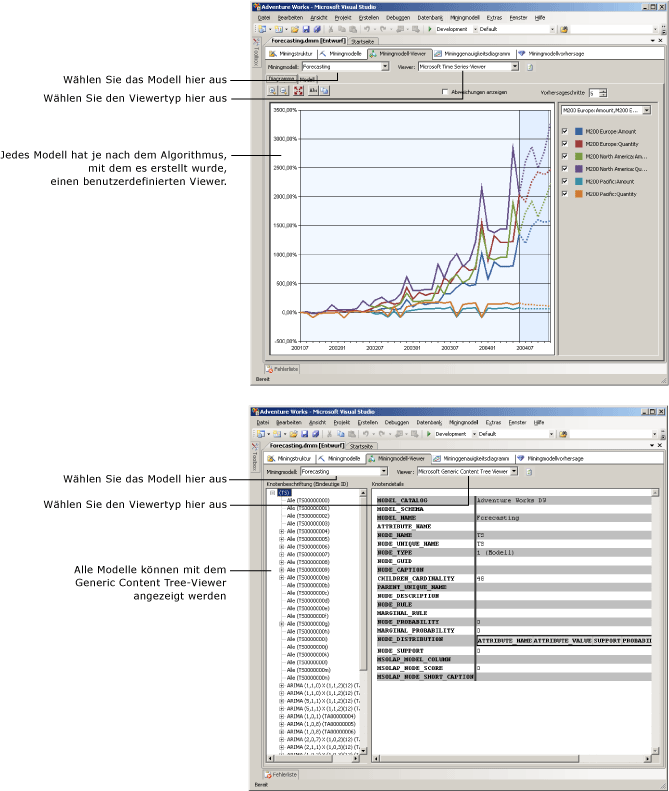

# Data Mining-Modell-Viewer
[!INCLUDE[ssas-appliesto-sqlas](../../includes/ssas-appliesto-sqlas.md)]Nachdem Sie ein Datamining-Modell in trainieren [!INCLUDE[msCoName](../../includes/msconame-md.md)] [!INCLUDE[ssNoVersion](../../includes/ssnoversion-md.md)] [!INCLUDE[ssASnoversion](../../includes/ssasnoversion-md.md)], untersuchen Sie das Modell nach interessanten Trends durchsuchen. Da die Ergebnisse der Miningmodelle komplex sind und es schwierig sein kann, sie im Rohzustand zu verstehen, ist eine visuelle Untersuchung der Daten häufig der einfachste Weg, die Regeln und Beziehungen zu verstehen, die Algorithmen in den Daten entdecken.  
  
 Jeder Algorithmus, den Sie zum Erstellen eines Modells verwenden, liefert jeweils einen anderen Ergebnistyp. Deshalb wird in [!INCLUDE[ssASnoversion](../../includes/ssasnoversion-md.md)] für jeden Algorithmus ein separater Viewer bereitgestellt. Wenn Sie in [!INCLUDE[ssBIDevStudioFull](../../includes/ssbidevstudiofull-md.md)]ein Miningmodell durchsuchen, wird das Modell im Data Mining-Designer auf der Registerkarte **Miningmodell-Viewer** des jeweils für das Modell geeigneten Viewers angezeigt.  
  
## So verwenden Sie die Modell-Viewer  
 Wählen Sie erst das Miningmodell und anschließend einen Viewer aus. Für jedes Modell stehen stets zwei Viewer zur Verfügung: ein benutzerdefinierter Viewer, der mehrere Registerkarten umfassen kann, und der generische Viewer.  
  
 Abhängig vom Typ des Modells, das Sie ausgewählt haben, werden Ihnen sehr unterschiedliche Optionen zum Untersuchen des Modells angezeigt. Die jedem Modelltyp zugeordneten benutzerdefinierten Viewer sind auf den Algorithmus zugeschnitten, den Sie beim Erstellen des ausgewählten Data Mining-Modells verwendet haben. Jeder benutzerdefinierte Viewer verfügt über eine Vielzahl von Tools und Dialogfeldern, die Ihnen helfen, die Statistiken und Muster im Modell zu durchsuchen, Diagramme anzuzeigen, interaktiv mit Wahrscheinlichkeitsschwellenwerten zu arbeiten oder Elemente nach Namen herauszufiltern.  
  
 Das folgende Diagramm veranschaulicht den Unterschied zwischen der Auswahl eines benutzerdefinierten Viewers und des generischen Viewers für dasselbe Modell.  
  
1.  Zunächst ist der benutzerdefinierte Viewer dargestellt, der dann angezeigt wird, wenn Sie ein auf dem Microsoft Time Series-Algorithmus beruhendes Miningmodell auswählen.  
  
     Dieser spezielle benutzerdefinierte Viewer erstellt automatisch ein Diagramm der Zeitreihe und stellt fünf Vorhersagen zur Verfügung.  
  
2.  Danach sehen Sie das gleiche Modell, das mit dem **Microsoft Generic Content Tree Viewer**angezeigt wird.  
  
     Auf der linken Seite zeigt der generische Viewer eine Liste der Knoten im Modell an. Sie können auf einen Knoten klicken, um seinen Inhalt im rechten Bereich anzuzeigen.  
  
   
  
## Weitere Informationen zum Microsoft Generic Content Tree Viewer  
 Jedes Modell kann auch mithilfe des [Microsoft Generic Content Tree Viewer &#40;Data Mining&#41;](http://msdn.microsoft.com/library/751b4393-f6fd-48c1-bcef-bdca589ce34c) angezeigt werden. Dieser Viewer präsentiert den Inhalt des Miningmodells nach einem Standard-HTML-Tabellenformat. Die Anordnung der Knoten und der Inhalt jedes Knotens hängen jedoch sehr vom Algorithmus ab, der verwendet wird, um die Ergebnisse zu generieren.  
  
 Während die benutzerdefinierten Viewer zum Durchsuchen und Verstehen des Modells entwickelt wurden, ist der generische Viewer nützlicher, wenn Sie das Modell bereits verstehen und Statistiken oder Regeln aus einem bestimmten Knoten extrahieren möchten. Sie verwenden z. B. den generischen Viewer, wenn Sie ausführliche Informationen zu den Mustern und den Statistiken anzeigen möchten, die [!INCLUDE[ssASnoversion](../../includes/ssasnoversion-md.md)] während der Analyse aufzeichnet, wie z. B. die Wahrscheinlichkeit eines Knotens oder eine Regressionsformel.  
  
 Sie können auch *Inhaltsabfragen* mit DMX schreiben, um sämtliche Informationen abzurufen, die in diesem Viewer präsentiert werden. Weitere Informationen finden Sie unter [Inhaltsabfragen &#40;Data Mining&#41;](../../analysis-services/data-mining/content-queries-data-mining.md).  
  
## In diesem Abschnitt  
 In den folgenden Themen werden alle Viewer und auch die Vorgehensweise bei der Interpretation der in ihnen enthaltenen Informationen detailliert beschrieben.  
  
 [Durchsuchen eines Modells mit dem Microsoft Struktur-Viewer](../../analysis-services/data-mining/browse-a-model-using-the-microsoft-tree-viewer.md)  
 Beschreibt den [!INCLUDE[msCoName](../../includes/msconame-md.md)] Struktur-Viewer. Dieser Viewer zeigt Miningmodelle an, die mit dem [!INCLUDE[msCoName](../../includes/msconame-md.md)] Decision Trees-Algorithmus und dem [!INCLUDE[msCoName](../../includes/msconame-md.md)] Linear Regression-Algorithmus erstellt wurden.  
  
 [Durchsuchen eines Modells mit dem Microsoft Cluster-Viewer](../../analysis-services/data-mining/browse-a-model-using-the-microsoft-cluster-viewer.md)  
 Beschreibt den [!INCLUDE[msCoName](../../includes/msconame-md.md)] Cluster-Viewer. Dieser Viewer zeigt die Miningmodelle an, die mithilfe des [!INCLUDE[msCoName](../../includes/msconame-md.md)] Clustering-Algorithmus erstellt werden.  
  
 [Durchsuchen eines Modells mit Microsoft Time Series-Viewer](../../analysis-services/data-mining/browse-a-model-using-the-microsoft-time-series-viewer.md)  
 Beschreibt den [!INCLUDE[msCoName](../../includes/msconame-md.md)] Time Series-Viewer Dieser Viewer zeigt die Miningmodelle an, die mithilfe des [!INCLUDE[msCoName](../../includes/msconame-md.md)] Time Series-Algorithmus erstellt werden.  
  
 [Durchsuchen eines Modells mit dem Microsoft Naive Bayes-Viewer](../../analysis-services/data-mining/browse-a-model-using-the-microsoft-naive-bayes-viewer.md)  
 Beschreibt den [!INCLUDE[msCoName](../../includes/msconame-md.md)] Naive Bayes-Viewer. Dieser Viewer zeigt die Miningmodelle an, die mithilfe des [!INCLUDE[msCoName](../../includes/msconame-md.md)] Naive Bayes-Algorithmus erstellt werden.  
  
 [Durchsuchen eines Modells mit dem Microsoft Sequenzcluster-Viewer](../../analysis-services/data-mining/browse-a-model-using-the-microsoft-sequence-cluster-viewer.md)  
 Beschreibt den [!INCLUDE[msCoName](../../includes/msconame-md.md)] Sequenzcluster-Viewer. Dieser Viewer zeigt die Miningmodelle an, die mithilfe des [!INCLUDE[msCoName](../../includes/msconame-md.md)] Sequence Clustering-Algorithmus erstellt werden.  
  
 [Modell mit dem Microsoft-Viewer für Zuordnungsregeln durchsuchen](../../analysis-services/data-mining/browse-a-model-using-the-microsoft-association-rules-viewer.md)  
 Beschreibt den [!INCLUDE[msCoName](../../includes/msconame-md.md)] Viewer für Zuordnungsregeln. Dieser Viewer zeigt die Miningmodelle an, die mithilfe des [!INCLUDE[msCoName](../../includes/msconame-md.md)] Association-Algorithmus erstellt werden.  
  
 [Modell mit dem Microsoft-Viewer für neuronale Netzwerke durchsuchen](../../analysis-services/data-mining/browse-a-model-using-the-microsoft-neural-network-viewer.md)  
 Beschreibt den [!INCLUDE[msCoName](../../includes/msconame-md.md)] -Viewer für neuronale Netzwerke. Dieser Viewer zeigt Miningmodelle an, die mit dem [!INCLUDE[msCoName](../../includes/msconame-md.md)] Neural Network-Algorithmus erstellt wurden, einschließlich der Modelle, die den [!INCLUDE[msCoName](../../includes/msconame-md.md)] Logistic Regression-Algorithmus verwenden.  
  
 [Durchsuchen eines Modells mit dem Microsoft Generic Content Tree Viewer](../../analysis-services/data-mining/browse-a-model-using-the-microsoft-generic-content-tree-viewer.md)  
 Beschreibt die detaillierten Informationen, die im generischen Viewer für alle Data Mining-Modelle verfügbar sind, und bietet Beispiele für die Interpretation der Informationen für jeden Algorithmus.  
  
## Siehe auch  
 [Data Mining-Algorithmen &#40;Analysis Services – Data Mining&#41;](../../analysis-services/data-mining/data-mining-algorithms-analysis-services-data-mining.md)   
 [Data Mining-Designer](../../analysis-services/data-mining/data-mining-designer.md)  
  
  
