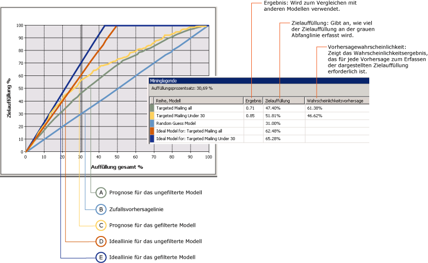
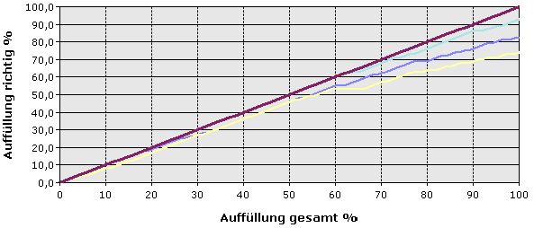

# Prognosegütediagramm (Analysis Services – Data Mining)
  A *Liftergebnisses chart* wird grafisch dargestellt, welche Verbesserung mit einem Miningmodell gegenüber einer Zufallsvorhersage erzielt werden kann. Darüber hinaus wird die Änderung in Form eines *Liftergebnisses* gemessen. Durch Vergleichen der Prognosegüteergebnisse für verschiedene Modelle können Sie herausfinden, welches Modell sich am besten eignet. Sie können auch den Punkt ermitteln, an dem die Vorhersagen des Modells weniger nützlich werden. Sie können durch Überprüfen des Prognosegütediagramms z.B. feststellen, dass eine Werbekampagne wahrscheinlich nur bei 30% Ihrer Kunden ankommen wird. Anhand dieser Zahl können Sie den Umfang der Kampagne entsprechend begrenzen.  
  
 In [!INCLUDE[ssNoVersion](../../includes/ssnoversion-md.md)] Data Mining können Sie mit einem Prognosegütediagramm Genauigkeit mehrerer Modelle vergleichen, die über das gleiche vorhersagbare Attribut verfügen. Sie können auch die Genauigkeit einer Vorhersage entweder für ein einzelnes Ergebnis (ein einzelner Wert des vorhersagbaren Attributs) oder für alle Ergebnisse (alle Werte des angegebenen Attributs) bewerten.  
  
 Ein Gewinndiagramm ist ein verwandter Diagrammtyp, der die gleichen Informationen enthält wie ein Prognosegütediagramm, jedoch außerdem die projizierte Gewinnsteigerung anzeigt, die mit einem Modell verbunden ist.  
  
##   Grundlegendes zu Prognosegütediagrammen  
 In der Theorie ist ein Prognosegütediagramm schwer vorstellbar. Daher wird zur Veranschaulichung der Tools für Prognosegütediagramme und der im Diagramm enthaltenen Informationen in diesem Abschnitt ein Szenario mit einem Prognosegütediagramm verwendet, mit dessen Hilfe die Reaktion auf eine Targeted Mailing-Kampagne geschätzt wird.  
  
 Der Marketingabteilung in diesem Szenario ist bekannt, dass bei Mailing-Kampagnen typischerweise mit einer Antwortquote von 10 Prozent zu rechnen ist. Eine Liste mit 10.000 potenziellen Kunden ist in einer Tabelle in der Datenbank gespeichert. Ausgehend von der typischen Antwortquote ist normalerweise zu erwarten, dass nur ca. 1.000 potenzielle Kunden antworten. Jedoch reicht das für das Projekt angesetzte Budget nicht aus, um alle 10.000 in der Datenbank gespeicherten Kunden anzuschreiben. Zusätzlich soll die Antwortquote verbessert werden. In diesem Szenario wird angenommen, dass das Budget nur für Werbeschreiben an 5.000 Kunden ausreicht. Der Marketingabteilung bieten sich zwei Möglichkeiten:  
  
-   5.000 Kunden nach dem Zufallsprinzip als Empfänger auswählen  
  
-   Mithilfe eines Miningmodells die 5.000 Kunden auswählen, bei denen die Wahrscheinlichkeit einer Antwort am höchsten ist  
  
 Mit einem Prognosegütediagramm können die erwarteten Ergebnisse beider Optionen verglichen werden. Bei einer willkürlichen Auswahl von 5.000 Kunden kann das Unternehmen basierend auf der typischen Antwortquote beispielsweise nur mit 500 Antworten rechnen. Dieses Szenario wird von der *Zufallslinie* im Prognosegütediagramm dargestellt. Wenn die Marketingabteilung jedoch die Zielgruppe ihres Mailings mithilfe eines Miningmodells auswählt, ist eine bessere Antwortquote zu erwarten, da durch das Modell gezielt die Kunden identifiziert werden, bei denen am wahrscheinlichsten mit einer Antwort zu rechnen ist. Wäre das Modell perfekt, würde es Vorhersagen generieren, die nie falsch liegen, und das Unternehmen könnte davon ausgehen, dass sich 1.000 Antworten durch das Anschreiben der nur 1.000 potenziellen Kunden erreichen ließen, die vom Modell empfohlen werden. Dieses Szenario wird von der *Ideallinie* im Prognosegütediagramm dargestellt.  
  
 In der Wirklichkeit liegt das Miningmodell sehr wahrscheinlich irgendwo zwischen diesen beiden Extremen einer Zufallsvorhersage und einer idealen oder perfekten Vorhersage. Jede Verbesserung der Antwortquote gegenüber der Zufallsvorhersage wird als Lift betrachtet.  
  
 Sie können sich beim Erstellen eines Prognosegütediagramms auf einen spezifischen Wert konzentrieren und den Lift nur für dieses Ergebnis messen oder eine allgemeine Bewertung generieren lassen, bei der Lifts für alle möglichen Ergebnisse im Modell gemessen werden. Der Einfluss dieser Optionen auf das endgültige Diagramm wird in den folgenden Abschnitten beschrieben.  
  
 [Zurück zum Anfang](#bkmk_Top)  
  
### Prognosegütediagramm mit Zielwert  
 Das folgende Diagramm zeigt ein Prognosegütediagramm für das **Targeted Mailing** -Modell an, das Sie im [Basic Data Mining Tutorial](http://msdn.microsoft.com/library/6602edb6-d160-43fb-83c8-9df5dddfeb9c)erstellen. In diesem Diagramm lautet das Zielattribut [Bike Buyer] und der Zielwert 1. Dies bedeutet, dass der Kunde voraussichtlich ein Fahrrad kaufen wird. Das Prognosegütediagramm zeigt daher die Verbesserung an, die das Modell beim Identifizieren dieser potenziellen Kunden bietet.  
  
 Das Diagramm enthält mehrere Modelle, die auf den gleichen Daten basieren. Eines dieser Modelle wurde an bestimmte Zielkunden angepasst. Sie können ein Modell anpassen, indem Sie Filter für die Daten hinzufügen, mit denen der Modus trainiert wurde. Dieser Filter schränkt die Fälle ein, die sowohl für das Training als auch die Evaluierung für Kunden unter 30 Jahre verwendet werden. Ein Effekt der Filterung besteht darin, dass das grundlegende und das gefilterte Modell unterschiedliche Datasets verwenden. Daher unterscheidet sich auch die Anzahl der Fälle, die im Prognosegütediagramm zur Auswertung verwendet wurden. Dieser Punkt muss bei der Interpretation der Vorhersageergebnisse und anderer statistischer Daten berücksichtigt werden.  
  
   
  
 Die X-Achse des Diagramms stellt den Prozentsatz des Testdatasets dar, das zum Vergleichen der Vorhersagen verwendet wird. Die Y-Achse des Diagramms stellt den Prozentsatz vorhergesagter Werte dar.  
  
 Die diagonale gerade Linie, hier in Blau dargestellt, erscheint in jedem Diagramm. Sie stellt die Ergebnisse von Zufallsvorhersagen dar und ist die Baseline, für die die Prognosegüte ausgewertet wird. Für jedes zu einem Prognosegütediagramm hinzugefügte Modell erhalten Sie zwei zusätzliche Linien: Eine Linie zeigt die idealen Ergebnisse für das Trainingsdataset an, wenn Sie ein Modell erstellen konnten, das immer perfekte Vorhersagen geliefert hat. Die zweite Linie zeigt die tatsächliche Prognosegüte, d. h. die Verbesserung der Ergebnisse, für das Modell.  
  
 In diesem Beispiel wird die Ideallinie für das gefilterte Modell in Dunkelblau und die Linie für die tatsächliche Prognosegüte in Gelb angezeigt. Aus dem Diagramm ist ersichtlich, dass die Spitze der Ideallinie etwa bei 40 Prozent liegt. Das bedeutet, dass mit einem perfekten Modell 100 Prozent der Zielkunden erreicht werden könnten, wenn ein Mailing an nur 40 Prozent der Gesamtpopulation gesendet wird. Die tatsächliche Prognosegüte für das gefilterte Modell bei Ausrichtung auf 40 Prozent der Population liegt zwischen 60 und 70 Prozent. Das bedeutet, dass Sie 60 bis 70 Prozent der Zielkunden erreichen könnten, wenn Sie das Mailing an 40 Prozent der Gesamtpopulation der Kunden senden.  
  
 Die **Mininglegende** enthält die Istwerte an einem beliebigen Punkt der Kurven. Sie können die Position, die gemessen wird, ändern, indem Sie auf den vertikalen grauen Balken klicken und ihn verschieben. Im Diagramm wurde die graue Linie auf 30 Prozent verschoben, da dies der Punkt ist, an dem sowohl das gefilterte als auch das ungefilterte Modell am effektivsten zu sein scheint. Nach diesem Punkt geht die Prognosegüte zurück.  
  
 Die **Mininglegende** enthält auch Ergebnisse und statistische Daten, mit deren Hilfe Sie das Diagramm interpretieren können. Diese Ergebnisse stellen die Genauigkeit des Modells an der grauen Linie dar, die in diesem Szenario so positioniert ist, dass sie 30 Prozent der gesamten Testfälle umfasst.  
  
|Reihe und Modell|Ergebnis|Zielauffüllung|Wahrscheinlichkeitsvorhersage|  
|-----------------------|-----------|-----------------------|-------------------------|  
|Targeted Mailing alle|0.71|47.40%|61.38%|  
|Targeted Mailing unter 30|0.85|51.81%|46.62%|  
|Zufallsvorhersagemodell||31.00%||  
|Idealmodell für: Targeted Mailing alle||62.48%||  
|Idealmodell für: Targeted Mailing unter 30||65.28%||  
  
 [Zurück zum Anfang](#bkmk_Top)  
  
#### Interpretieren der Ergebnisse  
 Aus diesen Ergebnissen ergibt sich, dass das allgemeine Modell [Targeted Mailing alle] bei einer Messung von 30 Prozent aller Fälle das Fahrradkaufverhalten von 47,40 Prozent der Zielpopulation vorhersagen kann. Mit anderen Worten, wenn Sie ein Targeted Mailing an nur 30 Prozent der Kunden in Ihrer Datenbank senden, können Sie etwas weniger als die Hälfte Ihrer Zielgruppe erreichen. Bei Verwendung des gefilterten Modells könnte sich das Ergebnis geringfügig verbessern und ungefähr 51 Prozent der Kundenzielgruppe erreicht werden.  
  
 Der Wert für **Wahrscheinlichkeitsvorhersage** stellt den Schwellenwert dar, der erforderlich ist, um einen Kunden in die Fälle einzubeziehen, die wahrscheinlich kaufen werden. Für jeden Fall schätzt das Modell die Genauigkeit der einzelnen Vorhersage und speichert diesen Wert, mit dem Sie Kunden filtern oder gezielt ansprechen können. Um die Kunden aus dem grundlegenden Modell zu identifizieren, die potenzielle Käufer sind, können Sie eine Abfrage verwenden, um Fälle mit einer Wahrscheinlichkeitsvorhersage von mindestens 61 Prozent abzurufen. Zum Abrufen der Kunden, auf die das gefilterte Modell abzielt, erstellen Sie eine Abfrage zum Abrufen von Fällen, die alle folgenden Kriterien erfüllen: Alter und einen **PredictProbability** -Wert von mindestens 46 Prozent.  
  
 Es ist interessant, die Modelle zu vergleichen. Das gefilterte Modell erfasst anscheinend mehr potenzielle Kunden. Doch wenn Sie als Zielgruppe Kunden mit einer Wahrscheinlichkeitsvorhersage von 46 Prozent wählen, besteht eine 53-prozentige Chance, dass Sie ein Mailing an einen Empfänger senden, der kein Fahrrad kaufen wird. Bei der Entscheidung, welches Modell das bessere ist, wägen Sie daher die größere Genauigkeit und kleinere Zielgruppe des gefilterten Modells gegen die Selektivität des grundlegenden Modells ab.  
  
 Der Wert für **Ergebnis** hilft Ihnen, Modelle zu vergleichen, indem die Wirksamkeit des Modells über eine normalisierte Population hinweg berechnet wird. Ein höheres Ergebnis ist besser. Daher liegt in diesem Fall die Entscheidung nahe, dass die zielgerichtete Ausrichtung auf Kunden unter 30 trotz der niedrigeren Wahrscheinlichkeitsvorhersage die effektivste Strategie ist.  
  
#### Wie wird das Ergebnis berechnet?  
 Das Ergebnis wird als geometrisches Mittel aller Punkte berechnet, die ein Punktdiagramm bilden, in dem die x-Achse die tatsächlichen Werte enthält, die y-Achse den vorhergesagten Wert enthält und jedem Punkt eine Wahrscheinlichkeit zugeordnet ist.  
  
 Die statistische Bedeutung jedes einzelnen Punktergebnisses ist die Prognosegüte für das gemessene Modell an diesem Punkt. Der Durchschnitt aller Punkte stellt das Ergebnis für das Modell dar.  
  
 [Zurück zum Anfang](#bkmk_Top)  
  
### Prognosegütediagramm für Modelle ohne Zielwert  
 Wenn Sie den Zustand der vorhersagbaren Spalten nicht angeben, wird ein Diagramm wie das im Folgenden abgebildete erstellt. Dieses Diagramm zeigt, wie sich das Modell für alle Status des vorhersagbaren Attributs verhält. Dieses Diagramm gibt beispielsweise Aufschluss darüber, wie gut das Modell sowohl Kunden, die wahrscheinlich ein Fahrrad kaufen werden, als auch Kunden, die wahrscheinlich kein Fahrrad kaufen werden, vorhersagt.  
  
 Die X-Achse ist die gleiche wie im Diagramm, bei dem die vorhersagbare Spalte angegeben wurde, doch die Y-Achse stellt nun den Prozentsatz der richtigen Vorhersagen dar. Daher ist die Ideallinie die diagonale Linie, die zeigt, dass das Modell bei 50 Prozent der Daten 50 Prozent der Fälle richtig vorhersagt, was das erwartbare Maximum darstellt.  
  
   
  
 Sie können in das Diagramm klicken, um den vertikalen, grauen Balken zu verschieben. Die **Mininglegende** zeigt den Prozentsatz der Fälle insgesamt an sowie den Prozentsatz der Fälle, die richtig vorhergesagt wurden. Wenn Sie den grauen Schieberegler beispielsweise auf die 50-Prozent-Marke ziehen, zeigt die **Mininglegende** die folgenden Genauigkeitsergebnisse an. Diese Abbildungen basieren auf dem TM_Decision Tree-Modell, das im Data Mining-Grundlagen-Lernprogramm erstellt wird.  
  
|Reihen, Modell|Ergebnis|Zielauffüllung|Wahrscheinlichkeitsvorhersage|  
|-------------------|-----------|-----------------------|-------------------------|  
|TM_Decision Tree|0.77|40.50%|72.91%|  
|Idealmodell||50.00%||  
  
 Diese Tabelle zeigt außerdem, dass das erstellte Modell bei 50 Prozent der Population 40 Prozent der Fälle richtig vorhersagt. Dieses Modell könnte daher als ziemlich genau gelten. Bedenken Sie aber, dass dieses bestimmte Modell alle Werte des vorhersagbaren Attributs vorhersagt. Daher könnte das Modell bei der Vorhersage, dass 90 Prozent der Kunden kein Fahrrad kaufen, genau sein.  
  
 [Zurück zum Anfang](#bkmk_Top)  
  
### Einschränkungen bei Prognosegütediagrammen  
 Bei Prognosegütediagrammen muss das vorhersagbare Attribut ein diskreter Wert sein. Anders ausgedrückt können Prognosegütediagramme nicht verwendet werden, um die Genauigkeit von Modellen zu messen, die kontinuierliche numerische Werte vorhersagen.  
  
 Die Vorhersagegenauigkeit für alle diskreten Werte des vorhersagbaren Attributs wird in einer einzelnen Linie angezeigt. Wenn Sie Vorhersagegenauigkeitslinien für einen einzelnen Wert des vorhersagbaren Attributs anzeigen möchten, erstellen Sie ein separates Prognosegütediagramm für jeden Zielwert.  
  
 Sie können mehrere Modelle zu einem Prognosegütediagramm hinzufügen, vorausgesetzt die Modelle verfügen über dasselbe vorhersagbare Attribut. Modelle, die nicht über dasselbe Attribut verfügen, können auf der Registerkarte **Eingabe** nicht ausgewählt werden.  
  
 In einem Prognosegütediagramm oder Gewinndiagramm können keine Zeitreihenmodelle angezeigt werden. Zum Messen der Genauigkeit von Zeitreihenvorhersagen wird normalerweise ein Teil der Vergangenheitsdaten mit den Vorhersagen verglichen. Weitere Informationen finden Sie unter [Microsoft Time Series Algorithm](../../analysis-services/data-mining/microsoft-time-series-algorithm.md).  
  
### Verwandte Inhalte  
 [Zurück zum Anfang](#bkmk_Top)  
  
## Siehe auch  
 [Tests und Überprüfung &#40;Data Mining&#41;](../../analysis-services/data-mining/testing-and-validation-data-mining.md)  
  
  

