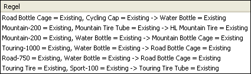

# Microsoft Association-Algorithmus
  Der [!INCLUDE[msCoName](../../includes/msconame-md.md)] Association-Algorithmus ist ein Algorithmus, der häufig für Recommendation Engines verwendet wird. Eine Recommendation Engine empfiehlt Kunden Artikel auf der Basis von Produkten, die diese Kunden bereits gekauft oder an denen sie Interesse gezeigt haben. Der [!INCLUDE[msCoName](../../includes/msconame-md.md)] Association-Algorithmus ist auch ein nützliches Market Basket Analysis-Instrument.   
  
 Association-Modelle basieren auf Datasets, die Bezeichner enthalten, die sich sowohl auf einzelne Fälle als auch auf die Elemente beziehen, die in dem Fall enthalten sind. Eine Gruppe von Elementen in einem Fall wird als *Itemset*bezeichnet. Ein Association-Modell besteht aus einer Reihe von Itemsets und Regeln, die beschreiben, wie diese Elemente in den Fällen gruppiert sind. Mit den Regeln, die der Algorithmus identifiziert, lassen sich wahrscheinliche Kaufentscheidungen von Kunden vorhersagen. Grundlage für diese Prognose sind die Artikel, die sich bereits im Einkaufswagen des Kunden befinden. Die folgende Abbildung zeigt eine Reihe von Regeln in einem Itemset.  
  
   
  
 Wie die Abbildung verdeutlicht, kann der [!INCLUDE[msCoName](../../includes/msconame-md.md)] Association-Algorithmus potenziell eine große Anzahl von Regeln innerhalb eines Datasets ausfindig machen. Der Algorithmus arbeitet mit zwei Parametern, Unterstützung und Wahrscheinlichkeit, um die Itemsets und Regeln zu beschreiben, die von ihm generiert werden. Beispiel: Wenn X und Y zwei Elemente darstellen, die sich in einem Einkaufswagen befinden, entspricht der Unterstützungsparameter der Anzahl von Fällen im Dataset, die die Elementkombination X und Y enthalten. Mithilfe des Unterstützungsparameters in Kombination mit den benutzerdefinierten Parametern *MINIMUM_SUPPORT* und *MAXIMUM_SUPPORT,* steuert der Algorithmus die Anzahl von generierten Itemsets. Der auch *Vertrauen*genannte Wahrscheinlichkeitsparameter stellt den Anteil der Fälle im Dataset dar, die sowohl X als auch Y enthalten. Mithilfe des Wahrscheinlichkeitsparameters in Kombination mit dem *MINIMUM_PROBABILITY* -Parameter steuert der Algorithmus, wie viele Regeln generiert werden.  
  
## Beispiel  
 Die Firma [!INCLUDE[ssSampleDBCoShort](../../includes/sssampledbcoshort-md.md)] Cycle ist dabei, die Funktionalität ihrer Website umzugestalten. Das Ziel dieses Neuentwurfs ist es, den Produkt-Sell-Through zu verbessern. Da die Firma jeden Verkauf in einer transaktionalen Datenbank aufzeichnet, ist sie mithilfe des [!INCLUDE[msCoName](../../includes/msconame-md.md)] Association-Algorithmus in der Lage, Produktgruppen zu identifizieren, die von den Kunden tendenziell als Kombinationskäufe erworben werden. Auf der Grundlage der Artikel, die sich bereits im Einkaufswagen eines Kunden befinden, lässt sich dann vorhersagen, für welche weiteren Artikel sich dieser Kunden möglicherweise interessiert.  
  
## Funktionsweise des Algorithmus  
 Der [!INCLUDE[msCoName](../../includes/msconame-md.md)] Association-Algorithmus durchsucht ein Dataset auf Elemente, die zusammen in einem Fall angezeigt werden. Der Algorithmus fasst dann alle verknüpften Elemente, die generiert werden, zu Itemsets zusammen, und zwar für die Mindestanzahl von Fällen, die im *MINIMUM_SUPPORT* -Parameter angegeben wurde. Beispiel: Ein mögliches Itemset lautet "Mountain 200=Existing, Sport 100=Existing", der zugehörige Unterstützungswert ist 710. Der Algorithmus generiert dann Regeln aus den Itemsets. Die Regeln werden verwendet, um die Präsenz eines Elements in der Datenbank, basierend auf der Präsenz anderer konkreter Elemente, die vom Algorithmus als wichtig identifiziert wurden, vorherzusagen. Eine Regel könnte z.B. "if Touring 1000=existing and Road bottle cage=existing, then Water bottle=existing" lauten, und als Wahrscheinlichkeit für diese Regel könnte 0.812 gelten. In diesem Beispiel identifiziert der Algorithmus, dass die Präsenz im Korb Touring 1000 tire und im Korb water bottle vorhersagt, dass davon ausgegangen werden kann, dass sich auch eine Wasserflasche in diesem Korb befinden würde.  
  
 Eine ausführlichere Erläuterung des Algorithmus sowie eine Liste der Parameter, mit denen sich das Verhalten des Algorithmus anpassen und die Ergebnisse des Miningmodells steuern lassen, finden Sie unter [Technische Referenz für den Microsoft Association-Algorithmus](../../analysis-services/data-mining/microsoft-association-algorithm-technical-reference.md).  
  
## Anforderungen für Zuordnungsmodelle  
 Wenn Sie Daten für das Training von Zuordnungsmodellen aufbereiten, müssen Sie sich mit den Anforderungen des jeweiligen Algorithmus, dessen Anforderungen an die Daten und der Verwendung der Daten vertraut machen.  
  
 Für Zuordnungsmodelle gelten folgende Anforderungen:  
  
-   **Nur eine Schlüsselspalte:** Jedes Modell muss eine numerische Spalte oder Textspalte enthalten, die jeden Datensatz eindeutig identifiziert. Verbundschlüssel sind nicht zulässig.  
  
-   **Eine einzelne vorhersagbare Spalte** Zuordnungsmodelle können jeweils nur eine vorhersagbare Spalte enthalten. In der Regel handelt es sich hierbei um die Schlüsselspalte der geschachtelten Tabelle, beispielsweise das Feld, in dem die gekauften Produkte verzeichnet werden. Die Werte müssen diskret sein oder diskretisiert werden.  
  
-   **Eingabespalten** Die Eingabespalten müssen diskret sein. Die Eingabedaten für ein Association-Modell sind häufig auf zwei Tabellen verteilt. Eine Tabelle kann beispielsweise Kundendaten enthalten, während in einer anderen Tabelle die Einkäufe der Kunden verzeichnet werden. Diese Daten können mithilfe einer geschachtelten Tabelle in das Modell eingegeben werden. Weitere Informationen zu geschachtelten Tabellen finden Sie unter [Geschachtelte Tabellen &#40;Analysis Services – Data Mining&#41;](../../analysis-services/data-mining/nested-tables-analysis-services-data-mining.md).  
  
 Ausführliche Informationen zu den in Assoziationsmodellen unterstützten Inhaltstypen und Datentypen finden Sie im Abschnitt „Anforderungen“ unter [Technische Referenz für den Microsoft Association-Algorithmus](../../analysis-services/data-mining/microsoft-association-algorithm-technical-reference.md).  
  
## Anzeigen eines Zuordnungsmodells  
 Zum Durchsuchen des Modells können Sie den **Microsoft Zuordnungsregeln-Viewer**verwenden. In der Anzeige eines Zuordnungsmodells stellt [!INCLUDE[ssASnoversion](../../includes/ssasnoversion-md.md)] die Korrelationen aus verschiedenen Blickwinkeln dar, sodass Sie die in den Daten festgestellten Beziehungen und Regeln besser verstehen können. Der Bereich **Itemset** des Viewers enthält eine detaillierte Analyse der am häufigsten vorkommenden Kombinationen oder Itemsets. Im Bereich **Regeln** wird eine Liste der aus den Daten abgeleiteten allgemeinen Regeln zusammen mit Berechnungen von deren Wahrscheinlichkeit dargestellt und die Rangfolge der Regeln nach ihrer relativen Wichtigkeit bestimmt. Im Abhängigkeitsnetzwerk-Viewer können Sie die Verbindungen zwischen den einzelnen Elementen untersuchen. Weitere Informationen finden Sie unter [Durchsuchen eines Modells mit dem Microsoft Cluster-Viewer](../../analysis-services/data-mining/browse-a-model-using-the-microsoft-cluster-viewer.md).  
  
 Wenn Sie Näheres über die Itemsets und Regeln in Erfahrung bringen möchten, können Sie das Modell im [Microsoft Generic Content Tree Viewer](../../analysis-services/data-mining/browse-a-model-using-the-microsoft-generic-content-tree-viewer.md)durchsuchen. Der für das Modell gespeicherte Inhalt umfasst Unterstützungswerte für jedes Itemset, ein Ergebnis für jede Regel und andere statistischen Daten. Weitere Informationen finden Sie unter [Miningmodellinhalt von Zuordnungsmodellen &#40;Analysis Services – Data Mining&#41;](../../analysis-services/data-mining/mining-model-content-for-association-models-analysis-services-data-mining.md)bezeichnet.  
  
## Erstellen von Vorhersagen  
 Nachdem das Modell verarbeitet wurde, können Sie die Regeln und die Itemsets zum Erstellen von Vorlagen verwenden. In einem Zuordnungsmodell geht aus einer Vorhersage hervor, welches Element wahrscheinlich auftritt, wenn das angegebene Element vorhanden ist, und die Vorhersage kann Angaben wie Wahrscheinlichkeit, Unterstützung oder Wichtigkeit enthalten. Beispiele dazu, wie Abfragen für ein Zuordnungsmodell erstellt werden, finden Sie unter [Beispiele für Zuordnungsmodellabfragen](../../analysis-services/data-mining/association-model-query-examples.md).  
  
 Allgemeine Informationen zur Erstellung von Abfragen für ein Data Mining-Modell finden Sie unter [Data Mining-Abfragen](../../analysis-services/data-mining/data-mining-queries.md).  
  
## Leistung  
 Der Prozess, Itemsets zu erstellen und Korrelationen zu zählen, kann zeitaufwendig sein. Obwohl der [!INCLUDE[msCoName](../../includes/msconame-md.md)] Association Rules-Algorithmus Optimierungstechniken nutzt, um Speicherplatz zu sparen und die Verarbeitung zu beschleunigen, sollte Ihnen bewusst sein, dass unter Bedingungen wie den folgenden Leistungsprobleme auftreten können:  
  
-   Das Dataset ist groß und umfasst viele einzelne Elemente.  
  
-   Die minimale Itemsetgröße ist zu niedrig festgelegt.  
  
 Um die Verarbeitungszeit zu minimieren und die Komplexität der Itemsets zu reduzieren, können Sie verwandte Elemente nach Kategorien gruppieren, bevor Sie die Daten analysieren.  
  
## Hinweise  
  
-   Unterstützt nicht die Verwendung von PMML (Predictive Model Markup Language) zum Erstellen von Miningmodellen.  
  
-   Unterstützt Drillthrough.  
  
-   Unterstützt die Verwendung von OLAP-Miningmodellen.  
  
-   Unterstützt die Erstellung von Data Mining-Dimensionen.  
  
## Siehe auch  
 [Data Mining-Algorithmen &#40;Analysis Services – Data Mining&#41;](../../analysis-services/data-mining/data-mining-algorithms-analysis-services-data-mining.md)   
 [Durchsuchen eines Modells mit dem Microsoft Association Rules-Viewer](../../analysis-services/data-mining/browse-a-model-using-the-microsoft-association-rules-viewer.md)   
 [Miningmodellinhalt von Zuordnungsmodellen &#40; Analysis Services – Datamining &#41;](../../analysis-services/data-mining/mining-model-content-for-association-models-analysis-services-data-mining.md)   
 [Technische Referenz für die Microsoft Association-Algorithmus](../../analysis-services/data-mining/microsoft-association-algorithm-technical-reference.md)   
 [Beispiele für Zuordnungsmodellabfragen](../../analysis-services/data-mining/association-model-query-examples.md)  
  
  

