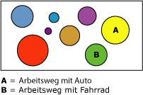

# Microsoft Clustering-Algorithmus
  Der [!INCLUDE[msCoName](../../includes/msconame-md.md)] -Clusteringalgorithmus ist ein *Segmentierungs-* oder *Clustering* -Algorithmus, der Fälle in einem Dataset durchläuft, um diese in Cluster mit ähnlichen Merkmalen zu gruppieren. Diese Gruppierungen eignen sich zum Durchsuchen von Daten, Identifizieren von Datenanomalien und Erstellen von Vorhersagen.  
  
 Clustermodelle identifizieren Beziehungen in einem Dataset, die bei einer einfachen Betrachtung der Daten nicht unbedingt zu erkennen sind. Sie können z.B. einfach davon ausgehen, dass Personen, die mit dem Fahrrad zur Arbeit fahren, für gewöhnlich nicht weit von ihren Arbeitsplätzen entfernt wohnen. Der Algorithmus kann jedoch nach anderen Merkmalen von Fahrradpendlern suchen, die nicht so klar auf der Hand liegen. In dem folgenden Diagramm zeigt Cluster A Daten zu Personen, die dazu tendieren, mit dem Auto zur Arbeit fahren, während Cluster B Daten zu Personen zeigt, die dazu tendieren, mit dem Fahrrad zur Arbeit zu fahren.  
  
   
  
 Der Clustering-Algorithmus unterscheidet sich von anderen Data Mining-Algorithmen, z. B. dem [!INCLUDE[msCoName](../../includes/msconame-md.md)] Decision Trees-Algorithmus, dadurch, dass Sie keine vorhersagbare Spalte bestimmen müssen, um in der Lage zu sein, ein Clustermodell aufzubauen. Der Clustering-Algorithmus trainiert das Modell systematisch anhand der Beziehungen, die in den Daten bestehen, und anhand der Cluster, die der Algorithmus identifiziert.  
  
## Beispiel  
 Stellen Sie sich eine Gruppe von Personen vor, die ähnliche demografische Daten aufweisen und ähnliche Produkte der Firma [!INCLUDE[ssSampleDBCoShort](../../includes/sssampledbcoshort-md.md)] kaufen. Diese Gruppe entspricht einem Datencluster. In einer Datenbank gibt es u. U. viele von diesen Clustern. Durch genaues Betrachten der Spalten, die einen Cluster darstellen, lässt sich klarer erkennen, wie die Datensätze eines Datasets miteinander verknüpft sind.  
  
## Funktionsweise des Algorithmus  
 Der [!INCLUDE[msCoName](../../includes/msconame-md.md)] Clustering-Algorithmus identifiziert zuerst die Beziehungen in einem Dataset und generiert dann auf der Basis dieser Beziehungen eine Reihe von Clustern. Wie das folgende Diagramm verdeutlicht, ist ein Punktdiagramm eine nützliche Methode, um darzustellen, wie der Algorithmus Daten gruppiert. Das Punktdiagramm stellt alle Fälle im Dataset dar, und jeder Fall entspricht einem Punkt auf dem Diagramm. Die Cluster gruppieren Punkte auf dem Diagramm und verdeutlichen die Beziehungen, die der Algorithmus identifiziert.  
  
   
  
 Nachdem Sie zuerst die Cluster definiert haben, berechnet der Algorithmus, wie gut die Cluster Punktegruppierungen darstellen. Anschließend versucht der Algorithmus, die Gruppierungen neu zu definieren, um Cluster zu erstellen, die den Daten besser entsprechen. Der Algorithmus wiederholt diesen Prozess so lange, bis sich die Ergebnisse durch Neudefinieren der Cluster nicht mehr verbessern lassen.  
  
 Sie können die Arbeitsweise des Algorithmus anpassen, indem Sie eine Clusteringtechnik auswählen, die maximale Anzahl von Clustern beschränken oder die Menge der zur Erstellung eines Clusters erforderlichen Unterstützungswerte ändern. Weitere Informationen zu diesem Algorithmus finden Sie unter [Technische Referenz für den Microsoft Clustering-Algorithmus](../../analysis-services/data-mining/microsoft-clustering-algorithm-technical-reference.md). Dieser Algorithmus umfasst zwei gängige Clustermethoden: K-Means-Clustering und die Expectation Maximization-Methode.  
  
## Anforderungen für Clusteringmodelle  
 Wenn Sie Daten für das Training von Clusteringmodellen aufbereiten, müssen Sie sich mit den Anforderungen des jeweiligen Algorithmus, dessen Anforderungen an die Daten und der Verwendung der Daten vertraut machen.  
  
 Für Clusteringmodelle gelten folgende Anforderungen:  
  
-   **Nur eine Schlüsselspalte:** Jedes Modell muss eine numerische Spalte oder Textspalte enthalten, die jeden Datensatz eindeutig identifiziert. Verbundschlüssel sind nicht zulässig.  
  
-   **Eingabespalten** Jedes Modell muss mindestens eine Eingabespalte enthalten, welche die zur Bildung der Cluster verwendeten Werte enthält. Sie können beliebig viele Eingabespalten verwenden. Abhängig von der Anzahl von Werten in jeder Spalte, kann sich der zum Trainieren des Modells erforderliche Zeitaufwand durch das Hinzufügen zusätzlicher Spalten jedoch erhöhen.  
  
-   **Optionale vorhersagbare Spalte** Der Algorithmus benötigt keine vorhersagbare Spalte zur Erstellung des Modells. Sie können aber eine vorhersagbare Spalte fast jeden Datentyps hinzufügen. Die Werte der vorhersagbaren Spalte können als Eingabe für das Clusteringmodell behandelt werden. Sie können auch angeben, dass diese Werte nur für Vorhersagen verwendet werden sollen. Wenn Sie beispielsweise das Einkommen der Kunden vorhersagen möchten, indem Sie Cluster auf der Grundlage demografischer Daten wie Region oder Alter bilden, würden Sie die Einkommensspalte als **PredictOnly** festlegen und alle übrigen Spalten, wie z. B. Region oder Alter, als Eingabespalten hinzufügen.  
  
 Ausführliche Informationen zu den in Clustermodellen unterstützten Inhaltstypen und Datentypen finden Sie im Abschnitt „Anforderungen“ unter [Technische Referenz für den Microsoft Clustering-Algorithmus](../../analysis-services/data-mining/microsoft-clustering-algorithm-technical-reference.md).  
  
## Anzeigen eines Clusteringmodells  
 Zum Durchsuchen des Modells können Sie den **Microsoft Cluster-Viewer**verwenden. Wenn Sie ein Clusteringmodell anzeigen, stellt [!INCLUDE[ssASnoversion](../../includes/ssasnoversion-md.md)] die Cluster in einem Diagramm dar, das die Beziehungen zwischen den Clustern veranschaulicht, und stellt zudem ein detailliertes Profil für jedes Cluster, eine Liste der Attribute, durch die sich die einzelnen Cluster von anderen Clustern unterscheiden, und die Eigenschaften des gesamten Trainingsdatasets bereit. Weitere Informationen finden Sie unter [Durchsuchen eines Modells mit dem Microsoft Cluster-Viewer](../../analysis-services/data-mining/browse-a-model-using-the-microsoft-cluster-viewer.md).  
  
 Wenn Sie detailliertere Informationen möchten, können Sie das Modell im [Microsoft Generic Content Tree Viewer](../../analysis-services/data-mining/browse-a-model-using-the-microsoft-generic-content-tree-viewer.md)durchsuchen. Der für das Modell gespeicherte Inhalt umfasst die Verteilung der Werte an jedem Knoten, die Wahrscheinlichkeit jedes Clusters und andere Informationen. Weitere Informationen zu diesem Algorithmus finden Sie unter [Mingingmodellinhalt von Clustermodellen &#40;Analysis Services – Data Mining&#41;](../../analysis-services/data-mining/mining-model-content-for-clustering-models-analysis-services-data-mining.md).  
  
## Erstellen von Vorhersagen  
 Nachdem das Modell trainiert wurde, werden die Ergebnisse als Mustersatz gespeichert, den Sie durchsuchen oder zum Erstellen von Vorhersagen verwenden können.  
  
 Sie können Abfragen erstellen, um Vorhersagen darüber auszugeben, ob neue Daten in die erkannten Cluster passen, oder um aussagekräftige Statistiken über die Cluster zu erhalten.  
  
 Informationen zum Erstellen von Abfragen für ein Data Mining-Modell finden Sie unter [Data Mining-Abfragen](../../analysis-services/data-mining/data-mining-queries.md). Beispiele zur Verwendung von Abfragen in Verbindung mit einem Clustermodell finden Sie unter [Beispiele für Clustermodellabfragen](../../analysis-services/data-mining/clustering-model-query-examples.md).  
  
## Hinweise  
  
-   Unterstützt die Verwendung von PMML (Predictive Model Markup Language) zum Erstellen von Miningmodellen.  
  
-   Unterstützt Drillthrough.  
  
-   Unterstützt die Verwendung von OLAP-Miningmodellen und die Erstellung von Data Mining-Dimensionen.  
  
## Siehe auch  
 [Data Mining-Algorithmen &#40;Analysis Services – Data Mining&#41;](../../analysis-services/data-mining/data-mining-algorithms-analysis-services-data-mining.md)   
 [Microsoft Clustering Algorithm Technical Reference](../../analysis-services/data-mining/microsoft-clustering-algorithm-technical-reference.md)   
 [Miningmodellinhalt, für das Clustering-Modelle &#40; Analysis Services – Datamining &#41;](../../analysis-services/data-mining/mining-model-content-for-clustering-models-analysis-services-data-mining.md)   
 [Beispiele für Clusteringmodellabfragen](../../analysis-services/data-mining/clustering-model-query-examples.md)  
  
  

