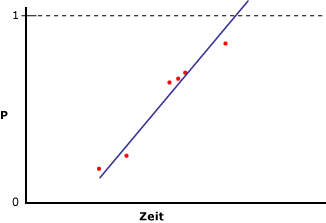
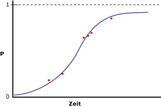

# <a name="microsoft-logistic-regression-algorithm-technical-reference"></a>Technische Referenz für den Microsoft Logistic Regression-Algorithmus
[!INCLUDE[ssas-appliesto-sqlas](../../includes/ssas-appliesto-sqlas.md)]Die [!INCLUDE[msCoName](../../includes/msconame-md.md)] Logistic Regression-Algorithmus ist eine Variation des der [!INCLUDE[msCoName](../../includes/msconame-md.md)] Neural Network-Algorithmus, in dem die *HIDDEN_NODE_RATIO* Parameter auf 0 festgelegt ist. Bei dieser Einstellung wird ein neuronales Netzwerkmodell erstellt, in dem keine verborgene Ebene enthalten ist; daher ist diese Einstellung ein Äquivalent für die logistische Regression.  
  
## <a name="implementation-of-the-microsoft-logistic-regression-algorithm"></a>Implementierung des Microsoft Logistic Regression-Algorithmus  
 Angenommen, die vorhersagbare Spalte enthält nur zwei Status, und Sie möchten dennoch eine Regressionsanalyse durchführen, indem Sie Eingabespalten mit der Wahrscheinlichkeit, dass die vorhersagbare Spalte einen bestimmten Status haben wird, in Beziehung setzen. Im folgenden Diagramm werden die resultierenden Ergebnisse dargestellt, wenn Sie die Werte 1 und 0 den Status der vorhersagbaren Spalte zuweisen, die Wahrscheinlichkeit berechnen, dass die Spalte einen bestimmten Status haben wird, und eine lineare Regression für eine Eingabevariable durchführen.  
  
   
  
 Die X-Achse enthält die Werte einer Eingabespalte. Die Y-Achse enthält die Wahrscheinlichkeiten, dass die vorhersagbare Spalte den einen oder anderen Status haben wird. Das Problem dabei ist, dass die lineare Regression die Spalte nicht auf einen Wert zwischen 0 und 1 einschränkt, obwohl dies die maximalen und minimalen Werte der Spalte sind. Um dieses Problem zu lösen, kann die logistische Regression ausgeführt werden. Anstatt eine gerade Linie zu erstellen, erstellt die logistische Regressionsanalyse eine Kurve in Form eines "S", die die maximalen und minimalen Einschränkungen enthält. Das folgende Diagramm stellt z. B. die resultierenden Ergebnisse dar, wenn Sie eine logistische Regression für die im vorigen Beispiel verwendeten Daten durchführen.  
  
   
  
 Beachten Sie, dass die Kurve nicht über den Wert 1 bzw. nicht unter den Wert 0 geht. Sie können die logistische Regression verwenden, um zu beschreiben, welche Eingabespalten zur Statusbestimmung der vorhersagbaren Spalte wichtig sind.  
  
### <a name="feature-selection"></a>Funktionsauswahl  
 Die Funktionsauswahl wird automatisch von allen Analysis Services Data Mining-Algorithmen zur Verbesserung der Analyse und zur Reduzierung der Verarbeitungslast verwendet. Die für die Funktionsauswahl in logistischen Regressionsmodellen verwendete Methode hängt vom Datentyp des Attributs ab. Da die logistische Regression auf dem Microsoft Neural Network-Algorithmus basiert, verwendet sie eine Teilmenge der Funktionsauswahlmethoden, die für neuronale Netzwerke gelten. Weitere Informationen finden Sie unter [Funktionsauswahl &#40;Data Mining&#41;](../../analysis-services/data-mining/feature-selection-data-mining.md).  
  
### <a name="scoring-inputs"></a>Bewerten von Eingaben  
 *Bewertung* bezeichnet im Kontext eines neuronalen Netzwerkmodells oder eines logistischen Regressionsmodells den Prozess der Konvertierung der in den Daten vorhandenen Werte in einen Satz von Werten, die die gleiche Skala verwenden und daher miteinander verglichen werden können. Angenommen, die Eingaben für Income bewegen sich zwischen 0 und 100.000, während die Eingaben für [Number of Children] zwischen 0 und 5 liegen. Mit diesem Konvertierungsprozess können Sie die Wichtigkeit der einzelnen Eingaben unabhängig von der Unterschiedlichkeit der Werte vergleichen.  
  
 Für jeden Status, der im Trainingssatz angezeigt wird, generiert das Modell eine Eingabe. Für diskrete oder diskretisierte Eingaben wird eine zusätzliche Eingabe erstellt, um den Status Missing darzustellen, wenn der Status Missing mindestens einmal im Trainingssatz erscheint. Für kontinuierliche Eingaben werden höchstens zwei Eingabeknoten erstellt: ein Knoten für fehlende Werte, sofern in den Trainingsdaten vorhanden, und ein Knoten für alle vorhandenen Werte oder Werte ungleich NULL. Jede Eingabe wird mit der z-Ergebnis-Normalisierungsmethode ( `(x – μ)\StdDev`) zu einem numerischen Format skaliert.  
  
 Während der z-Ergebnis-Normalisierung werden die mittlere (µ) und die Standardabweichung über den gesamten Trainingssatz abgerufen.  
  
 **Kontinuierliche Werte**  
  
 Wert vorhanden:   `(X – μ)/σ ` (X ist der tatsächlich codierte Wert)  
  
 Wert fehlt:    `-   μ/σ `  (Negatives Mu geteilt durch Sigma)  
  
 **Diskrete Werte**  
  
 `μ = p`  (die vorherige Wahrscheinlichkeit eines Status)  
  
 StdDev  `= sqrt(p\(1-p))`  
  
 Wert vorhanden:     `\(1 – μ)/σ` (Eins minus Mu geteilt durch Sigma)  
  
 Wert fehlt:     `(– μ)/σ` (Negatives Mu geteilt durch Sigma)  
  
### <a name="understanding-logistic-regression-coefficients"></a>Grundlegendes zu logistischen Regressionskoeffizienten  
 In der statistischen Literatur sind verschiedene Methoden zur Durchführung einer logistischen Regression vorhanden. Ein wichtiger Bestandteil aller Methoden besteht darin, die Güte des Modells zu bewerten. Eine Vielzahl von statistischen Daten zur Prüfung der Modellgüte sind vorgeschlagen worden, darunter Quotenverhältnisse (Odds Ratios) und Kovariaten-Muster. Eine Beschreibung, wie die Güte eines Modells gemessen wird, würde den Rahmen dieses Themas sprengen. Sie können jedoch den Wert der Koeffizienten im Modell abrufen und sie zur Entwicklung eigener Gütekennzahlen verwenden.  
  
> [!NOTE]  
>  Die Koeffizienten, die im Rahmen eines logistischen Regressionsmodells erstellt werden, repräsentieren keine Quotenverhältnisse und sollten nicht als solche interpretiert werden.  
  
 Die Koeffizienten für jeden Knoten im Modelldiagramm repräsentieren eine gewichtete Summe der Eingaben für diesen Knoten. In einem logistischen Regressionsmodell ist die verborgene Ebene leer. Daher gibt es nur einen Satz Koeffizienten, der in den Ausgabeknoten gespeichert ist. Sie können die Werte der Koeffizienten mit der folgenden Abfrage abrufen:  
  
```  
SELECT FLATTENED [NODE_UNIQUE NAME],  
(SELECT ATTRIBUTE_NAME< ATTRIBUTE_VALUE  
FROM NODE_DISTRIBUTION) AS t  
FROM <model name>.CONTENT  
WHERE NODE_TYPE = 23  
```  
  
 Für jeden Ausgabewert gibt diese Abfrage die Koeffizienten und eine ID zurück, die zurück auf den verknüpften Eingabeknoten verweisen. Die Abfrage gibt außerdem eine Zeile zurück, die den Wert der Ausgabe und das konstante Glied enthält. Jede Eingabe X hat einen eigenen Koeffizienten (Ci). Die geschachtelte Tabelle enthält außerdem einen „freien“ Koeffizienten (Co), der gemäß der folgenden Formel berechnet wird:  
  
 `F(X) = X1*C1 + X2*C2 + … +Xn*Cn + X0`  
  
 Aktivierung: `exp(F(X)) / (1 + exp(F(X)) )`  
  
 Weitere Informationen finden Sie unter [Beispiele für logistische Regressionsmodellabfrage](../../analysis-services/data-mining/logistic-regression-model-query-examples.md).  
  
## <a name="customizing-the-logistic-regression-algorithm"></a>Anpassen des Logistic Regression-Algorithmus  
 Der [!INCLUDE[msCoName](../../includes/msconame-md.md)] Logistic Regression-Algorithmus unterstützt mehrere Parameter, die Auswirkungen auf das Verhalten, die Leistung und die Genauigkeit des resultierenden Miningmodells haben. Sie können auch das Verhalten des Modells ändern, indem Sie Modellierungsflags für die als Eingabe verwendeten Spalten festlegen.  
  
### <a name="setting-algorithm-parameters"></a>Festlegen von Algorithmusparametern  
 In der folgenden Tabelle werden die Parameter beschrieben, die mit dem Microsoft Logistic Regression-Algorithmus verwendet werden können.  
  
 HOLDOUT_PERCENTAGE  
 Gibt den Prozentsatz von Trainingsfällen an, die zum Berechnen des Fehlers für zurückgehaltene Daten verwendet werden. HOLDOUT_PERCENTAGE dient als Teil des Beendigungskriteriums beim Trainieren des Miningmodells.  
  
 Der Standardwert ist 30.  
  
 HOLDOUT_SEED  
 Gibt eine Zahl an, die als Ausgangswert für den Pseudozufallszahlen-Generator verwendet wird, um die auszunehmenden Daten zufällig zu bestimmen. Wenn HOLDOUT_SEED auf 0 festgelegt ist, generiert der Algorithmus den Ausgangswert basierend auf dem Modellnamen; so wird sichergestellt, dass der Inhalt bei erneuter Verarbeitung des Modells gleich bleibt.  
  
 Die Standardeinstellung ist 0.  
  
 MAXIMUM_INPUT_ATTRIBUTES  
 Definiert die Anzahl von Eingabeattributen, die der Algorithmus verarbeiten kann, bevor die Funktionsauswahl aufgerufen wird. Legen Sie diesen Wert auf 0 fest, um die Funktionsauswahl zu deaktivieren.  
  
 Der Standardwert lautet 255.  
  
 MAXIMUM_OUTPUT_ATTRIBUTES  
 Definiert die Anzahl von Ausgabeattributen, die der Algorithmus verarbeiten kann, bevor die Funktionsauswahl aufgerufen wird. Legen Sie diesen Wert auf 0 fest, um die Funktionsauswahl zu deaktivieren.  
  
 Der Standardwert lautet 255.  
  
 MAXIMUM_STATES  
 Gibt die maximale Anzahl der vom Algorithmus unterstützten Attributstatus an. Wenn die Anzahl der Status eines Attributs größer als die maximale Anzahl der Status ist, verwendet der Algorithmus die gebräuchlichsten Status und ignoriert die restlichen Status.  
  
 Der Standardwert ist 100.  
  
 SAMPLE_SIZE  
 Gibt die Anzahl von Fällen an, die zum Trainieren des Modells verwendet werden. Der Algorithmusanbieter verwendet entweder diese Anzahl oder den Prozentsatz aller Fälle, die laut HOLDOUT_PERCENTAGE-Parameter nicht im Prozentsatz für zurückgehaltene Daten enthalten sind, je nachdem, welcher Wert kleiner ist.  
  
 Wenn also HOLDOUT_PERCENTAGE auf 30 festgelegt ist, verwendet der Algorithmus entweder den Wert dieses Parameters oder einen Wert, der 70 % der Gesamtanzahl der Fälle entspricht, je nachdem, welcher Wert kleiner ist.  
  
 Der Standardwert ist 10.000.  
  
### <a name="modeling-flags"></a>Modellierungsflags  
 Die folgenden Modellierungsflags werden zur Verwendung mit dem [!INCLUDE[msCoName](../../includes/msconame-md.md)] Logistic Regression-Algorithmus unterstützt.  
  
 NOT NULL  
 Gibt an, dass die Spalte keinen NULL-Wert enthalten kann. Ein Fehler tritt auf, wenn Analysis Services während des Modelltrainings einen NULL-Wert erkennt.  
  
 Gilt für die Miningstrukturspalten.  
  
 MODEL_EXISTENCE_ONLY  
 Dies bedeutet, dass die Spalte zwei mögliche Statuswerte haben kann: **Missing** und **Existing**. Ein NULL-Wert ist ein fehlender Wert.  
  
 Gilt für die Miningmodellspalte.  
  
## <a name="requirements"></a>Anforderungen  
 Ein logistisches Regressionsmodell muss eine Schlüsselspalte, Eingabespalten und mindestens eine vorhersagbare Spalte enthalten.  
  
### <a name="input-and-predictable-columns"></a>Eingabespalten und vorhersagbare Spalten  
 Der [!INCLUDE[msCoName](../../includes/msconame-md.md)] Logistic Regression-Algorithmus unterstützt bestimmte Inhaltstypen für Eingabespalten und für vorhersagbare Spalten sowie Modellierungsflags, die in der folgenden Tabelle aufgelistet sind. Weitere Informationen zur Bedeutung der Inhaltstypen in einem Miningmodell finden Sie unter [Inhaltstypen &#40;Data Mining&#41;](../../analysis-services/data-mining/content-types-data-mining.md).  
  
|Column|Inhaltstypen|  
|------------|-------------------|  
|Eingabeattribut|Continuous, Discrete, Discretized, Key, Table|  
|Vorhersagbares Attribut|Continuous, Discrete, Discretized|  
  
## <a name="see-also"></a>Siehe auch  
 [Microsoft Logistic Regression-Algorithmus](../../analysis-services/data-mining/microsoft-logistic-regression-algorithm.md)   
 [Lineare Regressionsmodell-Abfragebeispiele](../../analysis-services/data-mining/linear-regression-model-query-examples.md)   
 [Miningmodellinhalt von logistischen Regressionsmodellen &#40;Analysis Services – Data Mining&#41;](../../analysis-services/data-mining/mining-model-content-for-logistic-regression-models.md)   
 [Microsoft Neural Network-Algorithmus](../../analysis-services/data-mining/microsoft-neural-network-algorithm.md)  
  
  
