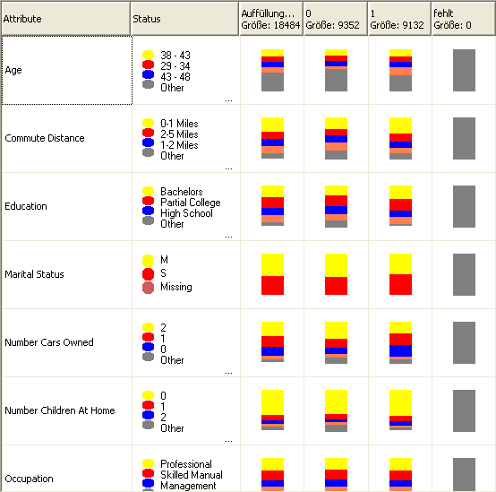

# Microsoft Naive Bayes-Algorithmus
  Der [!INCLUDE[msCoName](../../includes/msconame-md.md)] Naive Bayes-Algorithmus ist ein auf Bayes Theoremen basierender Klassifikationsalgorithmus, der sowohl bei der Vorhersagemodellierung als auch in der explorativen Modellierung eingesetzt werden kann. Die Angabe "naiv" im Namen "Naïve Bayes" rührt daher, dass der Algorithmus Bayes Techniken verwendet, aber keine Abhängigkeiten berücksichtigt, die möglicherweise vorhanden sind.  
  
 Der Rechenaufwand für diesen Algorithmus ist geringer als der der anderen [!INCLUDE[msCoName](../../includes/msconame-md.md)] -Algorithmen und ist daher hilfreich für das schnelle Generieren von Miningmodellen, um Beziehungen zwischen Eingabespalten und vorhersagbaren Spalten zu ermitteln. Sie können diesen Algorithmus für eine erste Untersuchung der Daten verwenden. Später können Sie dann die Ergebnisse anwenden, um zusätzliche Miningmodelle mit anderen Algorithmen zu erstellen, deren Rechenaufwand größer ist und die präziser sind.  
  
## Beispiel  
 Als fortlaufende Werbestrategie hat die Marketingabteilung der Firma Adventure Works Cycle beschlossen, potenzielle Kunden durch den E-Mail-Versand von Flyern anzuwerben. Zur Reduzierung von Kosten sollen die Flyer nur an jene Kunden gesendet werden, die mit höherer Wahrscheinlichkeit auf diese Flyer reagieren. Das Unternehmen speichert die Informationen in einer Datenbank mit demographischen Daten und Reaktionen auf vorherige Mailingaktionen. Anhand dieser demographischen Daten, wie z. B. über das Alter und den Standort, möchten sie die Reaktion auf eine Werbekampagne vorhersagen, indem sie potenzielle Kunden mit Kunden vergleichen, die ähnliche Merkmale aufweisen und die bereits in der Vergangenheit Produkte des Unternehmens gekauft haben. Insbesondere sollen die Unterschiede zwischen jenen Kunden gezeigt werden, die ein Fahrrad gekauft haben, und jenen, die keins gekauft haben.  
  
 Mithilfe des [!INCLUDE[msCoName](../../includes/msconame-md.md)] Naive Bayes-Algorithmus kann die Marketingabteilung die Ausgabe eines Kundenprofils schnell vorhersagen und kann daher bestimmen, welche Kunden mit größerer Wahrscheinlichkeit auf die Flyer reagieren. Mit dem [!INCLUDE[msCoName](../../includes/msconame-md.md)] Naive Bayes-Viewer in [!INCLUDE[ssBIDevStudioFull](../../includes/ssbidevstudiofull-md.md)]können Sie auch insbesondere visuell untersuchen, welche Eingabespalten zu positiven Reaktionen beitragen.  
  
## Funktionsweise des Algorithmus  
 Der [!INCLUDE[msCoName](../../includes/msconame-md.md)] Naive Bayes-Algorithmus berechnet die Wahrscheinlichkeit für jeden Status jeder einzelnen Eingabespalte bei jedem möglichen Status der vorhersagbaren Spalte.  
  
 Um die Arbeitsweise besser zu verstehen, verwenden Sie den [!INCLUDE[msCoName](../../includes/msconame-md.md)] Naive Bayes-Viewer in [!INCLUDE[ssBIDevStudioFull](../../includes/ssbidevstudiofull-md.md)] (siehe folgende Abbildung), um eine visuelle Darstellung der Statusverteilung durch den Algorithmus zu erhalten.  
  
   
  
 Hier werden im [!INCLUDE[msCoName](../../includes/msconame-md.md)] Naive Bayes-Viewer alle Eingabespalten im Dataset aufgelistet und die Verteilung der Status der einzelnen Spalten für jeden Status der vorhersagbaren Spalte angezeigt.  
  
 Sie können diese Anzeige des Modells zur Identifizierung der Eingabespalten verwenden, die zur Unterscheidung zwischen den verschiedenen Status der vorhersagbaren Spalte wichtig sind.  
  
 Zum Beispiel sind hier, in der Verteilung der Eingabewerte in der Zeile für Commute Distance, eindeutig Unterschiede bei Käufern und Nichtkäufern zu sehen. Daraus wird ersichtlich, dass die Eingabe "Commute Distance = 0-1 miles" ein potenzieller Vorhersagefaktor ist.  
  
 Der Viewer stellt auch Werte für die Verteilungen bereit. Diese zeigen an, dass bei Kunden mit einem Arbeitsweg zwischen 1 und 2 Meilen die Wahrscheinlichkeit für einen Fahrradkauf bei 0,387 liegt. Die Wahrscheinlichkeit, dass Sie kein Fahrrad kaufen, liegt bei 0,287. In diesem Beispiel verwendet der Algorithmus numerische Informationen, die von den Kundenmerkmalen (wie z. B. der Pendelstrecke) abgeleitet werden, um vorherzusagen, ob ein Kunde ein Fahrrad kauft.  
  
 Weitere Informationen zur Verwendung des [!INCLUDE[msCoName](../../includes/msconame-md.md)] Naive Bayes-Viewers finden Sie unter [Durchsuchen eines Modells mit dem Microsoft Naive Bayes-Viewer](../../analysis-services/data-mining/browse-a-model-using-the-microsoft-naive-bayes-viewer.md).  
  
## Erforderliche Daten für Naive Bayes-Modelle  
 Wenn Sie Daten für die Verwendung beim Training eines Naive Bayes-Modells aufbereiten, müssen Sie sich mit den Anforderungen des Algorithmus, dessen Anforderungen an die Daten und der Verwendung der Daten vertraut machen.  
  
 Für ein Naive Bayes-Modell gelten die folgenden Anforderungen:  
  
-   **Nur eine Schlüsselspalte:** Jedes Modell muss eine numerische Spalte oder Textspalte enthalten, die jeden Datensatz eindeutig identifiziert. Verbundschlüssel sind nicht zulässig.  
  
-   **Eingabespalten** In einem Naive Bayes-Modell müssen entweder alle Spalten diskret oder die Werte diskretisiert sein. Informationen zur Diskretisierung von Spalten finden Sie unter [ Diskretisierungsmethoden &#40;Data Mining&#41;](../../analysis-services/data-mining/discretization-methods-data-mining.md).  
  
-   **Variablen müssen unabhängig sein.** Bei einem Naive Bayes-Modell ist es außerdem wichtig sicherzustellen, dass die Eingabeattribute unabhängig voneinander sind. Dies ist besonders wichtig, wenn Sie das Modell für Vorhersagen verwenden. Wenn Sie dies nicht beachten und zwei Datenspalten verwenden, die bereits in einer engen Beziehung zueinander stehen, würde der Einfluss dieser beiden Spalten multipliziert, sodass unter Umständen andere Faktoren, die das Ergebnis beeinflussen, nicht mehr erkennbar sind.  
  
     Wenn Sie im umgekehrten Verwendungsfall ein Modell oder Dataset untersuchen, ist die Fähigkeit des Algorithmus, Korrelationen zwischen Variablen zu identifizieren, hingegen hilfreich, da hierdurch Beziehungen zwischen den Eingaben identifiziert werden können.  
  
-   **Mindestens eine vorhersagbare Spalte:** Das vorhersagbare Attribut muss diskrete oder diskretisierte Werte enthalten.  
  
     Die Werte der vorhersagbaren Spalte können als Eingaben behandelt werden. Wenn Sie ein neues Dataset untersuchen, um Beziehungen zwischen den Spalten zu ermitteln, kann dieses Vorgehen nützlich sein.  
  
## Anzeigen des Modells  
 Zum Durchsuchen des Modells können Sie den **Microsoft-Viewer für naives Bayes-Verfahren**verwenden. Der Viewer zeigt an, wie die Eingabeattribute mit dem vorhersagbaren Attribut in Beziehung stehen. Der Viewer stellt ein detailliertes Profil für jedes Cluster, eine Liste der Attribute, um die sich die einzelnen Cluster von anderen Clustern unterscheiden, und die Eigenschaften des gesamten Trainingsdatasets bereit. Weitere Informationen finden Sie unter [Durchsuchen eines Modells mit dem Microsoft Naive Bayes-Viewer](../../analysis-services/data-mining/browse-a-model-using-the-microsoft-naive-bayes-viewer.md).  
  
 Wenn Sie detailliertere Informationen möchten, können Sie das Modell im [Microsoft Generic Content Tree Viewer &#40;Data Mining&#41;](http://msdn.microsoft.com/library/751b4393-f6fd-48c1-bcef-bdca589ce34c)durchsuchen. Weitere Informationen über den Typ der im Modell gespeicherten Informationen finden Sie unter [Miningmodellinhalt von Naive Bayes-Modellen &#40; Analysis Services – Data Mining&#41;](../../analysis-services/data-mining/mining-model-content-for-naive-bayes-models-analysis-services-data-mining.md).  
  
## Erstellen von Vorhersagen  
 Nachdem das Modell trainiert wurde, werden die Ergebnisse als Mustersatz gespeichert, den Sie durchsuchen oder zum Erstellen von Vorhersagen verwenden können.  
  
 Sie können Abfragen erstellen, um Vorhersagen dazu zurückzugeben, wie neue Daten mit dem vorhersagbaren Attribut in Beziehung stehen, oder Sie können Statistiken abrufen, die die vom Modell gefundenen Korrelationen beschreiben.  
  
 Informationen zum Erstellen von Abfragen für ein Data Mining-Modell finden Sie unter [Data Mining-Abfrage](../../analysis-services/data-mining/data-mining-queries.md). Beispiele zur Verwendung von Abfragen in Verbindung mit einem Naive Bayes-Modell finden Sie unter [Beispiele für Naive Bayes-Modellabfrage](../../analysis-services/data-mining/naive-bayes-model-query-examples.md).  
  
## Hinweise  
  
-   Unterstützt die Verwendung von PMML (Predictive Model Markup Language) zum Erstellen von Miningmodellen.  
  
-   Unterstützt Drillthrough.  
  
-   Unterstützt nicht die Erstellung von Data Mining-Dimensionen.  
  
-   Unterstützt die Verwendung von OLAP-Miningmodellen.  
  
## Siehe auch  
 [Data Mining-Algorithmen &#40;Analysis Services – Data Mining&#41;](../../analysis-services/data-mining/data-mining-algorithms-analysis-services-data-mining.md)   
 [Funktionsauswahl &#40; Datamining &#41;](../../analysis-services/data-mining/feature-selection-data-mining.md)   
 [Beispiele für Naive Bayes-Modell](../../analysis-services/data-mining/naive-bayes-model-query-examples.md)   
 [Miningmodellinhalt von Naive Bayes-Modelle &#40; Analysis Services – Datamining &#41;](../../analysis-services/data-mining/mining-model-content-for-naive-bayes-models-analysis-services-data-mining.md)   
 [Technische Referenz für den Microsoft Naive Bayes-Algorithmus](../../analysis-services/data-mining/microsoft-naive-bayes-algorithm-technical-reference.md)  
  
  

