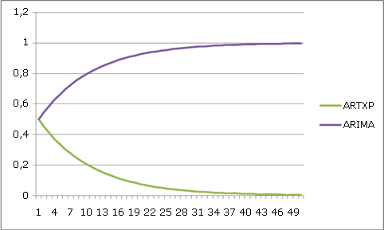
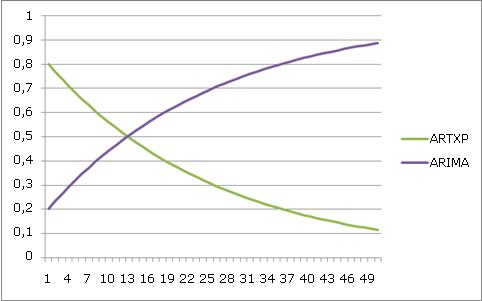

# Technische Referenz für den Microsoft Time Series-Algorithmus
  Der [!INCLUDE[msCoName](../../includes/msconame-md.md)] Time Series-Algorithmus umfasst zwei separate Algorithmen zum Analysieren einer Zeitreihe:  
  
-   Der ARTXP-Algorithmus, der seit [!INCLUDE[ssVersion2005](../../includes/ssversion2005-md.md)]im Produktumfang enthalten ist, wurde zur Vorhersage des nächsten wahrscheinlichen Werts in einer Reihe optimiert.  
  
-   Der ARIMA-Algorithmus wurde in [!INCLUDE[ssKatmai](../../includes/sskatmai-md.md)] hinzugefügt, um die Genauigkeit bei langfristigen Vorhersagen zu verbessern.  
  
 Standardmäßig verwendet [!INCLUDE[ssASnoversion](../../includes/ssasnoversion-md.md)] jeden Algorithmus separat, um das Modell zu trainieren, und mischt dann die Ergebnisse, um die beste Vorhersage für eine variable Anzahl an Vorhersagen zu erzielen. Je nach Daten und Vorhersageanforderungen können Sie sich auch dazu entschließen, nur einen der Algorithmen zu verwenden. In [!INCLUDE[ssEnterpriseEd10](../../includes/ssenterpriseed10-md.md)]können Sie auch den Grenzwert anpassen, mit dem die Mischung der Algorithmen während der Vorhersage gesteuert wird.  
  
 Dieses Thema enthält zusätzliche Informationen darüber, wie Sie die einzelnen Algorithmen implementieren und den Algorithmus durch Festlegen der Parameter anpassen können, um die Analyse und Vorhersageergebnisse zu optimieren.  
  
## Implementierung des Microsoft Time Series-Algorithmus  
 [!INCLUDE[msCoName](../../includes/msconame-md.md)] Research entwickelte den ursprünglichen ARTXP-Algorithmus, der in SQL Server 2005 verwendet wurde. Die Implementierung basierte hierbei auf dem [!INCLUDE[msCoName](../../includes/msconame-md.md)] Decision Trees-Algorithmus. Daher kann der ARTXP-Algorithmus als autoregressives Strukturmodell zur Darstellung von periodischen Zeitreihendaten beschrieben werden. Dieser Algorithmus setzt eine variable Anzahl von Vergangenheitselementen mit jedem aktuellen Element, das vorhergesagt wird, in Beziehung. Der Name ARTXP leitet sich von der Tatsache ab, dass die autoregressive Strukturmethode (ein ART-Algorithmus) auf mehrere unbekannte frühere Zustände angewendet wird. Eine ausführliche Erklärung des ARTXP-Algorithmus finden Sie unter [Autoregressive Strukturmodelle zum Analysieren einer Zeitreihe](http://go.microsoft.com/fwlink/?LinkId=45966).  
  
 Der ARIMA-Algorithmus wurde dem Microsoft Time Series-Algorithmus in SQL Server 2008 hinzugefügt, um die Genauigkeit bei langfristigen Vorhersagen zu verbessern. Es handelt sich um eine Implementierung des Prozesses zur Berechnung von autoregressiven integrierten gleitenden Durchschnitten, der von Box und Jenkins beschrieben wurde. Die ARIMA-Methode ermöglicht die Bestimmung von Abhängigkeiten bei Beobachtungen in einer Zeitreihe. Zufällige Schocks können als Teil des Modells eingebunden werden. Die ARIMA-Methode unterstützt auch multiplizierende Saisonabhängigkeit. Benutzern, die an weiteren Informationen zum ARIMA-Algorithmus interessiert sind, wird empfohlen, die grundlegenden Ausführungen zu diesem Thema von Box und Jenkins zu lesen. Dieser Abschnitt bietet spezielle Details zur Implementierung der ARIMA-Methode im Microsoft Time Series-Algorithmus.  
  
 Standardmäßig verwendet der Microsoft Time Series-Algorithmus beide Methoden (ARTXP und ARIMA), und die Ergebnisse werden kombiniert, um die Genauigkeit von Prognosen zu verbessern. Wenn Sie nur eine bestimmte Methode verwenden möchten, können Sie die Algorithmusparameter so konfigurieren, dass entweder nur ARTXP oder nur ARIMA verwendet wird, bzw. Sie können die Art und Weise der Kombination der Ergebnisse von Algorithmen steuern. Der ARTXP-Algorithmus unterstützt Kreuzvorhersagen, der ARIMA-Algorithmus hingegen nicht. Daher ist die Kreuzvorhersage nur möglich, wenn Sie eine Mischung verschiedener Algorithmen verwenden oder das Modell so konfigurieren, dass nur ARTXP verwendet wird.  
  
## Grundlegendes zur ARIMA-Differenzreihenfolge  
 In diesem Abschnitt lernen Sie Terminologie kennen, die Sie zum Verständnis des ARIMA-Modells benötigen. Außerdem wird die spezielle Implementierung der *Differenzierung* im Microsoft Time Series-Algorithmus erörtert. Eine vollständige Erläuterung dieser Begriffe und Konzepte finden Sie in den Abhandlungen von Box und Jenkins.  
  
-   Ein Term ist eine Komponente einer mathematischen Gleichung. Beispielsweise kann ein Term in einer Polynomgleichung eine Kombination von Variablen und Konstanten enthalten.  
  
-   In der ARIMA-Formel, die im Microsoft Time Series-Algorithmus enthalten ist, werden sowohl Terme vom Typ " *autoregressiv* " als auch vom Typ " *gleitender Durchschnitt* " verwendet.  
  
-   Zeitreihenmodelle können *stationär* oder *nicht stationär*sein. Bei*stationären Modellen* handelt es sich um Modelle, für die ein Mittelwert berechnet wird, obwohl sie möglicherweise Zyklen umfassen, wohingegen das Augenmerk bei *nicht stationären* Modellen nicht auf Ausgeglichenheit liegt und daher größere Abweichungen oder Veränderungen auftreten können, die durch *Schocks*oder externe Variablen verursacht werden.  
  
-   Ziel der *Differenzierung* ist die Stabilisierung von Zeitreihen und das Erreichen eines stationären Zustands.  
  
-   Die  *Differenzreihenfolge* stellt die Häufigkeit dar, mit der die Differenz zwischen Werten für eine Zeitreihe verwendet wird.  
  
 Die Funktionsweise des Microsoft Time Series-Algorithmus sieht folgendermaßen aus: Es werden Werte in einer Datenreihe herangezogen, und anschließend wird versucht, die Daten an ein Muster anzupassen. Wenn die Datenreihe nicht bereits stationär ist, wendet der Algorithmus eine Differenzreihenfolge an. Durch jede Zunahme in der Differenzreihenfolge verstärkt sich in der Regel der stationäre Charakter von Zeitreihen.  
  
 Beispiel: Wenn die Zeitreihe (z1, z2, …, zn) lautet und Berechnungen mithilfe einer Differenzreihenfolge ausgeführt werden, erhalten Sie eine neue Reihe (y1, y2,…., yn-1), wobei `yi = zi+1-zi`ist. Wenn die Differenzreihenfolge 2 ist, generiert der Algorithmus eine weitere Reihe \`(x1, x2, …, xn-2)`, die auf der y-Reihe basiert, die von der ersten Reihenfolgengleichung abgeleitet wurde. Die korrekte Höhe der Differenzierung ist von den Daten abhängig. Eine einzelne Differenzierungsreihenfolge ist am häufigsten in Modellen anzutreffen, die einen konstanten Trend widerspiegeln, wohingegen eine zweite Differenzierungsreihenfolge einen sich im Laufe der Zeit ändernden Trend anzeigen kann.  
  
 Standardmäßig ist die im Microsoft Time Series-Algorithmus verwendete Differenzreihenfolge -1, d. h., dass der Algorithmus automatisch den besten Wert für die Differenzreihenfolge erkennt. Normalerweise ist der beste Wert 1 (wenn eine Differenzierung erforderlich ist), doch unter bestimmten Umständen erhöht der Algorithmus diesen Wert auf maximal 2.  
  
 Der Microsoft Time Series-Algorithmus bestimmt die optimale ARIMA-Differenzreihenfolge mithilfe der Autoregressionswerte. Der Algorithmus überprüft die AR-Werte und legt einen ausgeblendeten Parameter fest (ARIMA_AR_ORDER), der die Reihenfolge der AR-Terme darstellt. Der Wertebereich dieses ausgeblendeten Parameters (ARIMA_AR_ORDER) reicht von -1 bis 8. Beim Standardwert -1 wählt der Algorithmus automatisch die entsprechende Differenzreihenfolge aus.  
  
 Wenn der Wert von ARIMA_AR_ORDER größer als 1 ist, multipliziert der Algorithmus die Zeitreihe mit einem Polynomterm. Wenn ein Term der Polynomformel in einen Stamm von 1 oder einen Wert aufgelöst wird, der nahe bei 1 liegt, versucht der Algorithmus, die Stabilität des Modells durch Entfernen des Terms und Vergrößern der Differenzreihenfolge um 1 beizubehalten. Wenn die Differenzreihenfolge bereits ihren Höchstwert erreicht hat, wird der Term entfernt, und die Differenzreihenfolge ändert sich nicht.  
  
 Beispiel: Falls der Wert von AR = 2 ist, sieht der daraus resultierende AR-Polynomterm in etwa folgendermaßen aus: `1 – 1.4B + .45B^2 = (1- .9B) (1- 0.5B)`. Der Term `(1- .9B)` besitzt einen Stammwert von etwa 0,9. Der Algorithmus entfernt diesen Term aus der Polynomformel, kann jedoch die Differenzreihenfolge nicht um eins erhöhen, da bereits der zulässige Höchstwert von 2 erreicht wurde.  
  
 Wichtiger Hinweis: Die einzige Möglichkeit, eine Änderung der Differenzreihenfolge zu **erzwingen** , besteht in der Verwendung des nicht unterstützten Parameters ARIMA_DIFFERENCE_ORDER. Dieser ausgeblendete Parameter steuert, wie oft der Algorithmus eine Differenzierung der Zeitreihe ausführt. Er kann durch Eingabe eines benutzerdefinierten Algorithmusparameters festgelegt werden. Allerdings wird eine Änderung dieses Werts nicht empfohlen, sofern Sie nicht experimentieren möchten und mit den entsprechenden Berechnungen nicht vertraut sind. Zudem steht derzeit kein Mechanismus zur Verfügung, einschließlich ausgeblendeter Parameter, mit dem der Schwellenwert gesteuert werden kann, ab dem die Erhöhung der Differenzreihenfolge ausgelöst wird.  
  
 Abschließend möchten wir darauf hinweisen, dass die oben beschriebene Formel das vereinfachte Szenario ohne Saisonabhängigkeitshinweise ist. Wenn Saisonabhängigkeitshinweise angegeben werden, wird in der Gleichung für jeden Saisonabhängigkeitshinweis links neben dem Gleichheitszeichen ein separater AR-Polynomterm hinzugefügt. Gleichermaßen wird beim Entfernen von Termen verfahren, die sich möglicherweise nachteilig auf die Stabilität der Differenzreihe auswirken.  
  
## Anpassen des Microsoft Time Series-Algorithmus  
 Der [!INCLUDE[msCoName](../../includes/msconame-md.md)] Time Series-Algorithmus unterstützt die folgenden Parameter, die sich auf das Verhalten, die Leistung und die Genauigkeit des resultierenden Miningmodells auswirken.  
  
> [!NOTE]  
>  Der Microsoft Time Series-Algorithmus ist in allen Editionen von [!INCLUDE[ssNoVersion](../../includes/ssnoversion-md.md)]verfügbar. Einige erweiterte Funktionen, einschließlich Parameter zum Anpassen der Zeitreihenanalyse, werden jedoch nur in bestimmten Editionen von [!INCLUDE[ssNoVersion](../../includes/ssnoversion-md.md)]unterstützt. Eine Liste der Funktionen, die von den [!INCLUDE[ssNoVersion](../../includes/ssnoversion-md.md)]-Editionen unterstützt werden, finden Sie unter [Von den SQL Server-Editionen unterstützte Funktionen](../../analysis-services/analysis-services-features-supported-by-the-editions-of-sql-server-2016.md).  
  
### Erkennen der Saisonabhängigkeit  
 Sowohl der ARIMA- als auch der ARTXP-Algorithmus unterstützen die Erkennung der Saisonabhängigkeit oder Periodizität. [!INCLUDE[ssASnoversion](../../includes/ssasnoversion-md.md)] verwendet die schnelle Fourier-Transformation, um die Saisonabhängigkeit vor dem Training zu ermitteln. Sie können die Erkennung der Saisonabhängigkeit und die Ergebnisse der Analyse einer Zeitreihe jedoch beeinflussen, indem Sie Algorithmusparameter festlegen.  
  
-   Indem Sie den Wert von *AUTODETECT_SEASONALITY*ändern, können Sie die mögliche Anzahl an erstellten Zeitsegmenten beeinflussen.  
  
-   Wenn Sie einen Wert oder mehrere Werte für *PERIODICITY_HINT*festlegen, können Sie für den Algorithmus Informationen zu erwarteten Datenzyklen bereitstellen und u.U. die Erkennungsgenauigkeit verbessern.  
  
> [!NOTE]  
>  Sowohl der ARTXP- als auch der ARIMA-Algorithmus sind sehr empfindlich gegenüber Saisonabhängigkeitshinweisen. Die Bereitstellung des falschen Hinweises kann die Ergebnisse negativ beeinflussen.  
  
### Auswählen eines Algorithmus und Festlegen der Mischung von Algorithmen  
 In der Standardeinstellung, oder wenn Sie die MIXED-Option auswählen, kombiniert [!INCLUDE[ssASnoversion](../../includes/ssasnoversion-md.md)] die Algorithmen und weist ihnen die gleiche Gewichtung zu. In Enterprise Edition können Sie jedoch einen bestimmten Algorithmus angeben, oder Sie können den Anteil von jedem Algorithmus in den Ergebnissen anpassen, indem Sie einen Parameter festlegen, der die Ergebnisse für die kurzfristige oder langfristige Vorhersage gewichtet. Standardmäßig ist der *FORECAST_METHOD* -Parameter auf MIXED festgelegt, und [!INCLUDE[ssASnoversion](../../includes/ssasnoversion-md.md)] verwendet beide Algorithmen und gewichtet dann ihre Werte, um die Stärken der einzelnen Algorithmen zu maximieren.  
  
-   Um die Auswahl der Algorithmen zu steuern, müssen Sie den *FORECAST_METHOD* -Parameter festlegen.  
  
-   Wenn Sie eine Kreuzvorhersage verwenden möchten, müssen Sie die Option ARTXP oder MIXED verwenden, da ARIMA keine Kreuzvorhersagen unterstützt.  
  
-   Legen Sie *FORECAST_METHOD* auf ARTXP fest, wenn Sie eher kurzfristige Vorhersagen wünschen.  
  
-   Legen Sie *FORECAST_METHOD* auf ARIMA fest, wenn Sie die langfristige Vorhersage verbessern möchten.  
  
 In Enterprise Edition können Sie auch anpassen, wie [!INCLUDE[ssASnoversion](../../includes/ssasnoversion-md.md)] die ARIMA- und ARTXP-Algorithmen kombiniert. Sie können sowohl den Anfangspunkt der Mischung als auch die Änderungsrate steuern, indem Sie den *PREDICTION_SMOOTHING* -Parameter festlegen:  
  
-   Wenn Sie *PREDICTION_SMOOTHING* auf 0 festlegen, verwendet das Modell nur ARTXP.  
  
-   Wenn Sie *PREDICTION_SMOOTHING* auf 1 festlegen, verwendet das Modell nur ARIMA.  
  
-   Wenn *PREDICTION_SMOOTHING* auf einen Wert zwischen 0 und 1 festgelegt wird, gewichtet das Modell den ARTXP-Algorithmus als eine exponentiell absteigende Funktion der Vorhersageschritte. Das Modell gewichtet den ARIMA-Algorithmus zugleich als das 1-Komplement der ARTXP-Gewichtung. Das Modell verwendet Normalisierung und eine Stabilisierungskonstante, um die Kurven zu glätten.  
  
 Wenn Sie bis zu 5 Zeitscheiben vorhersagen, ist ARTXP grundsätzlich fast immer die bessere Option. Wenn Sie jedoch die Anzahl der vorherzusagenden Zeitscheiben erhöhen, bietet ARIMA in der Regel eine bessere Leistung.  
  
 Das folgende Diagramm veranschaulicht, wie das Modell die Algorithmen kombiniert, wenn *PREDICTION_SMOOTHING* auf den Standardwert 0,5 festgelegt wird. ARIMA und ARTXP werden zuerst gleichmäßig gewichtet, mit zunehmender Anzahl an Vorhersageschritten wird ARIMA jedoch stärker gewichtet.  
  
   
  
 Das folgende Diagramm veranschaulicht hingegen die Mischung der Algorithmen, wenn *PREDICTION_SMOOTHING* auf 0,2 festgelegt wird. Für Schritt [!INCLUDE[tabValue](../../includes/tabvalue-md.md)]gewichtet das Modell ARIMA als 0,2 und ARTXP als 0,8. Danach nimmt die Gewichtung von ARIMA exponentiell zu, und die Gewichtung von ARTXP nimmt exponentiell ab.  
  
   
  
### Festlegen von Algorithmusparametern  
 Die folgende Tabelle beschreibt die Parameter, die mit dem [!INCLUDE[msCoName](../../includes/msconame-md.md)] Time Series-Algorithmus verwendet werden können.  
  
|Parameter|Description|  
|---------------|-----------------|  
|*AUTO_DETECT_PERIODICITY*|Gibt einen numerischen Wert zwischen [!INCLUDE[tabValue](../../includes/tabvalue-md.md)] und 1 an, der Periodizität erkennt. Der Standardwert ist 0,6.   Wenn der Wert näher bei [!INCLUDE[tabValue](../../includes/tabvalue-md.md)]liegt, wird Periodizität nur bei stark periodischen Daten erkannt.   Das Festlegen dieses Werts näher bei 1 begünstigt die Ermittlung vieler fast periodischer Muster und die automatische Generierung von Periodizitätshinweisen.   Hinweis: Der Umgang mit einer großen Anzahl von Periodizitätshinweisen führt häufig zu erheblich längeren Modelltrainingszeiten, gleichzeitig jedoch auch zu genaueren Modellen.|  
|*COMPLEXITY_PENALTY*|Steuert das Anwachsen der Entscheidungsstruktur. Der Standardwert ist 0,1.   Das Verringern des Werts erhöht die Wahrscheinlichkeit einer Teilung. Das Erhöhen des Werts senkt die Wahrscheinlichkeit einer Teilung.   Hinweis: Dieser Parameter ist nur in einigen Editionen von [!INCLUDE[ssNoVersion](../../includes/ssnoversion-md.md)]verfügbar.|  
|*FORECAST_METHOD*|Gibt an, welcher Algorithmus für die Analyse und Vorhersage verwendet werden soll. Mögliche Werte sind ARTXP, ARIMA oder MIXED. Der Standard lautet MIXED.|  
|*HISTORIC_MODEL_COUNT*|Gibt die Anzahl von Vergangenheitsmodellen an, die erstellt werden. Der Standardwert lautet 1.   Hinweis: Dieser Parameter ist nur in einigen Editionen von [!INCLUDE[ssNoVersion](../../includes/ssnoversion-md.md)]verfügbar.|  
|*HISTORICAL_MODEL_GAP*|Gibt die Zeitverzögerung zwischen zwei aufeinander folgenden Vergangenheitsmodellen an. Der Standardwert lautet 10. Der Wert stellt eine Anzahl von Zeiteinheiten dar, wobei die Einheit vom Modell definiert wird.   Wenn Sie diesen Wert beispielsweise auf g festlegen, werden Vergangenheitsmodelle für Daten erstellt, die mit Intervallen von g, 2*g, 3\*g in Zeitscheiben aufgeteilt werden.   Hinweis: Dieser Parameter ist nur in einigen Editionen von [!INCLUDE[ssNoVersion](../../includes/ssnoversion-md.md)]verfügbar.|  
|*INSTABILITY_SENSITIVITY*|Steuert den Punkt, bei dem die Vorhersagevarianz einen bestimmten Schwellenwert übersteigt, ab dem der ARTXP-Algorithmus die Vorhersagen unterdrückt. Der Standardwert ist 1.   Hinweis: Dieser Parameter gilt nicht für Modelle, die nur ARIMA verwenden.   Der Standardwert 1 bietet das gleiche Verhalten wie in [!INCLUDE[ssVersion2005](../../includes/ssversion2005-md.md)]. [!INCLUDE[ssASnoversion](../../includes/ssasnoversion-md.md)] überwacht die normalisierte Standardabweichung für jede Vorhersage. Sobald dieser Wert den Schwellenwert für eine Vorhersage überschreitet, gibt der Time Series-Algorithmus eine NULL zurück und beendet den Vorhersageprozess.   Ein Wert von [!INCLUDE[tabValue](../../includes/tabvalue-md.md)] beendet die Instabilitätserkennung. Dies bedeutet, dass Sie eine unendliche Anzahl von Vorhersagen erstellen können, unabhängig von der Varianz.   Hinweis: Dieser Parameter kann nur in [!INCLUDE[ssNoVersion](../../includes/ssnoversion-md.md)] Enterprise geändert werden. In [!INCLUDE[ssNoVersion](../../includes/ssnoversion-md.md)] Standard verwendet [!INCLUDE[ssASnoversion](../../includes/ssasnoversion-md.md)] nur den Standardwert 1.|  
|*MAXIMUM_SERIES_VALUE*|Gibt den maximalen Wert an, der für Vorhersagen verwendet werden soll. Dieser Parameter wird zusammen mit *MINIMUM_SERIES_VALUE*verwendet, um die Vorhersagen auf einen bestimmten Bereich einzuschränken. Sie können beispielsweise festlegen, dass die vorhergesagte Verkaufsmenge an einem Tag niemals die Anzahl der Produkte im Lager überschreiten darf.   Hinweis: Dieser Parameter ist nur in einigen Editionen von [!INCLUDE[ssNoVersion](../../includes/ssnoversion-md.md)]verfügbar.|  
|*MINIMUM_SERIES_VALUE*|Gibt den minimalen Wert an, der vorhergesagt werden kann. Dieser Parameter wird zusammen mit *MAXIMUM_SERIES_VALUE*verwendet, um die Vorhersagen auf einen bestimmten Bereich einzuschränken. Zum Beispiel können Sie angeben, dass die vorhergesagte Verkaufsmenge nie eine negative Zahl sein darf.   Hinweis: Dieser Parameter ist nur in einigen Editionen von [!INCLUDE[ssNoVersion](../../includes/ssnoversion-md.md)]verfügbar.|  
|*MINIMUM_SUPPORT*|Gibt die Mindestanzahl von Zeitscheiben an, die erforderlich sind, um eine Teilung in jeder Zeitreihenstruktur zu generieren. Der Standardwert lautet 10.|  
|*MISSING_VALUE_SUBSTITUTION*|Gibt an, wie Lücken in Vergangenheitsdaten gefüllt werden. Standardmäßig sind Lücken in Daten nicht zulässig. Die folgende Tabelle enthält die möglichen Werte für diesen Parameter:   **Previous:**wiederholt den Wert aus der vorherigen Zeitscheibe   **Mean:**verwendet einen gleitenden Durchschnitt von im Training verwendeten Zeitscheiben   Numeric constant: Verwendet die festgelegte Anzahl, um alle fehlenden Werte zu ersetzen.   **None:**Standard. Ersetzt fehlende Werte mit Werten, die entlang der Kurve des trainierten Modells grafisch dargestellt werden.      Hinweis: Wenn die Daten mehrere Reihen enthalten, dürfen die Reihen keine unregelmäßigen Ränder haben. Das heißt, alle Reihen sollten die gleichen Anfangs- und Endpunkte haben.                      [!INCLUDE[ssASnoversion](../../includes/ssasnoversion-md.md)] verwendet ebenfalls den Wert dieses Parameters, um die Lücken in den neuen Daten zu füllen, wenn Sie **PREDICTION JOIN** für ein Zeitreihenmodell ausführen.|  
|*PERIODICITY_HINT*|Stellt für den Algorithmus einen Periodizitätshinweis der Daten bereit. Beispiel: Wenn die Verkaufszahlen jahresabhängig variieren und als Maßeinheit für die Reihe Monate gewählt wurden, ist die Periodizität 12. Dieser Parameter weist das Format {n [, n]} auf, wobei n eine beliebige positive Zahl ist.   Das n innerhalb der eckigen Klammern [] ist optional und kann so oft wie nötig wiederholt werden. Um beispielsweise mehrere Periodizitätshinweise für monatlich bereitgestellte Daten anzugeben, könnten Sie {12, 3, 1} eingeben, um für das Jahr, Quartal und den Monat Muster zu ermitteln. Die Periodizität hat jedoch starke Auswirkungen auf die Modellqualität. Wenn der von Ihnen gegebene Hinweis von der tatsächlichen Periodizität abweicht, können die Ergebnisse beeinträchtigt werden.   Der Standardwert lautet \{1\}.   Hinweis: Die Klammern sind erforderlich. Dieser Parameter verfügt zudem über einen String-Datentyp. Wenn Sie daher diesen Parameter als Teil einer Data Mining Extensions (DMX)-Anweisung eingeben, müssen Sie die Nummer und Klammern in Anführungszeichen einschließen.|  
|*PREDICTION_SMOOTHING*|Gibt an, wie das Modell kombiniert werden sollte, um die Vorhersage zu optimieren. Sie können einen beliebigen Wert zwischen [!INCLUDE[tabValue](../../includes/tabvalue-md.md)] und 1 eingeben oder die folgenden Werte verwenden:   [!INCLUDE[tabValue](../../includes/tabvalue-md.md)]:                           Gibt an, dass diese Vorhersage nur ARTXP verwendet. Das Forecasting ist für weniger Vorhersagen optimiert.   1: Gibt an, dass diese Vorhersage nur ARIMA verwendet. Das Forecasting ist für viele Vorhersagen optimiert.   0,5: Standard Gibt an, dass für die Vorhersage beide Algorithmen verwendet und die Ergebnisse gemischt werden sollen.      Verwenden Sie bei der Vorhersageglättung den *FORECAST_METHOD* -Parameter, um das Training zu steuern.   Hinweis: Dieser Parameter ist nur in einigen Editionen von [!INCLUDE[ssNoVersion](../../includes/ssnoversion-md.md)]verfügbar.|  
  
### Modellierungsflags  
 Der [!INCLUDE[msCoName](../../includes/msconame-md.md)] Time Series-Algorithmus unterstützt folgende Modellierungsflags. Wenn Sie die Miningstruktur oder das Miningmodell erstellen, definieren Sie Modellierungsflags, die angeben, wie die Werte in den einzelnen Spalten während der Analyse behandelt werden. Weitere Informationen finden Sie unter [Modellierungsflags &#40;Data Mining&#41;](../../analysis-services/data-mining/modeling-flags-data-mining.md).  
  
|Modellierungsflag|Description|  
|-------------------|-----------------|  
|NOT NULL|Gibt an, dass die Spalte keinen NULL-Wert enthalten kann. Ein Fehler tritt auf, wenn Analysis Services während des Modelltrainings einen NULL-Wert erkennt.   Gilt für die Miningstrukturspalten.|  
|MODEL_EXISTENCE_ONLY|Dies bedeutet, dass die Spalte zwei mögliche Statuswerte haben kann: Missing und Existing. Ein NULL-Wert ist ein fehlender Wert.   Gilt für die Miningmodellspalten.|  
  
## Anforderungen  
 Ein Zeitreihenmodell muss eine Schlüsselzeitspalte enthalten, die eindeutige Werte, Eingabespalten und mindestens eine vorhersagbare Spalte umfasst.  
  
### Eingabespalten und vorhersagbare Spalten  
 Der [!INCLUDE[msCoName](../../includes/msconame-md.md)] Time Series-Algorithmus unterstützt Eingabespalten und vorhersagbare Eingabespalten eines bestimmten Inhaltstyps und Modellierungsflags. Diese Elemente sind in der folgenden Tabelle aufgeführt.  
  
|Spalte|Inhaltstypen|  
|------------|-------------------|  
|Eingabeattribut|Kontinuierlich, Schlüssel, Schlüsselzeit und Tabelle|  
|Vorhersagbares Attribut|Kontinuierlich, Tabelle|  
  
> [!NOTE]  
>  Zyklische und sortierte Inhaltstypen werden unterstützt, der Algorithmus behandelt sie jedoch als diskrete Werte und führt keine spezielle Verarbeitung durch.  
  
## Siehe auch  
 [Microsoft Time Series-Algorithmus](../../analysis-services/data-mining/microsoft-time-series-algorithm.md)   
 [Time Series Model Query Examples](../../analysis-services/data-mining/time-series-model-query-examples.md)   
 [Miningmodellinhalt von Zeitreihenmodellen &#40;Analysis Services – Data Mining&#41;](../../analysis-services/data-mining/mining-model-content-for-time-series-models-analysis-services-data-mining.md)  
  
  

