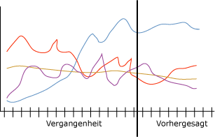

# Microsoft Time Series-Algorithmus
  Der [!INCLUDE[msCoName](../../includes/msconame-md.md)] Time Series-Algorithmus bietet mehrere Algorithmen, die für die Prognose kontinuierlicher Werte wie den Produktverkauf über einen bestimmten Zeitraum optimiert sind. Während andere [!INCLUDE[msCoName](../../includes/msconame-md.md)] -Algorithmen wie z. B. Entscheidungsstrukturen für die Vorhersage eines Trends zusätzliche Spalten mit neuen Informationen als Eingabe benötigen, ist dies bei einem Zeitreihenmodell nicht der Fall. Ein Zeitreihenmodell kann Trends schon auf Grundlage des ursprünglichen Datasets vorhersagen, das zum Erstellen des Modells verwendet wird. Sie können dem Modell auch neue Daten hinzufügen, wenn Sie eine Vorhersage treffen, und die neuen Daten automatisch in die Trendanalyse einbeziehen.  
  
 Das folgende Diagramm zeigt ein typisches Modell für die Umsatzvorhersage zu einem Produkt in vier verschiedenen Verkaufsregionen über einen bestimmten Zeitraum. Das Modell im Diagramm stellt die Verkaufszahlen für die einzelnen Regionen in Form roter, gelber, violetter und blauer Linien dar. Die Linie für jeden Region besteht aus zwei Teilen:  
  
-   Links von der vertikalen Linie stehen die Vergangenheitsdaten. Dies sind die Daten, auf deren Grundlage das Modell vom Algorithmus erstellt wird.  
  
-   Rechts von der vertikalen Linie stehen die Prognosedaten. Diese stellen die vom Modell aufgestellte Prognose dar.  
  
 Die Kombination der Quelldaten und der Vorhersagedaten wird als *Reihe*bezeichnet.  
  
   
  
 Eine wichtige Funktion des [!INCLUDE[msCoName](../../includes/msconame-md.md)] Time Series-Algorithmus besteht in der Möglichkeit, Kreuzvorhersagen zu erstellen. Wenn Sie den Algorithmus mit zwei separaten, jedoch miteinander verknüpften Reihen trainieren, können Sie das daraus resultierende Modell dazu verwenden, das Ergebnis einer Reihe basierend auf dem Verhalten der anderen Reihe vorherzusagen. Beispiel: Die Verkaufsbeobachtungen zu einem Produkt können die Verkaufsprognosen für ein anderes Produkt beeinflussen.  Eine Kreuzvorhersage dient auch zum Erstellen eines allgemeinen Modells, das auf mehrere Reihen angewendet werden kann. Zum Beispiel sind die Vorhersagen für eine bestimmte Region instabil, da der Reihe Daten guter Qualität fehlen.  Sie könnten aber ein allgemeines Modell mit einem Durchschnittswert für alle vier Regionen trainieren und das Modell anschließend auf die einzelne Reihe anwenden, um für jede Region stabilere Prognosen zu erstellen.  
  
## Beispiel  
 Das Management von [!INCLUDE[ssSampleDBCoFull](../../includes/sssampledbcofull-md.md)] möchte die monatlichen Umsatzzahlen im Fahrradsegment für das kommende Jahr vorhersagen. Insbesondere interessiert sich die Firma für die Frage, ob sich mit den Verkaufszahlen für ein bestimmtes Fahrradmodell die Verkaufszahlen für ein anderes Modell vorhersagen lassen. Durch die Anwendung des [!INCLUDE[msCoName](../../includes/msconame-md.md)] Times Series-Algorithmus auf Vergangenheitsdaten aus den letzten drei Jahren kann die Firma ein Data Mining-Modell für die Vorhersage künftiger Fahrradumsätze erstellen. Darüber hinaus kann die Firma mithilfe von Kreuzvorhersagen feststellen, ob die Verkaufstrends individueller Fahrradmodelle miteinander in Beziehung stehen.  
  
 In jedem Quartal möchte die Firma das Modell mit den letzten Verkaufsdaten und die Vorhersagen aktualisieren, um Trends aus der jüngsten Vergangenheit zu modellieren. Um Werte von Geschäften zu korrigieren, die ihre Verkaufszahlen nicht sorgfältig oder konsequent aktualisieren, wird ein allgemeines Prognosemodell erstellt, anhand dessen Prognosen für alle Regionen getroffen werden.  
  
## Funktionsweise des Algorithmus  
 Der [!INCLUDE[ssVersion2005](../../includes/ssversion2005-md.md)]Time Series-Algorithmus in [!INCLUDE[msCoName](../../includes/msconame-md.md)] verwendet eine einzelne autoregressive Zeitreihenmethode namens ARTXP. Der ARTXP-Algorithmus wurde für kurzfristige Vorhersagen optimiert und prognostizierte daher mit hoher Sicherheit den wahrscheinlich nächsten Wert in einer Serie. In [!INCLUDE[ssKatmai](../../includes/sskatmai-md.md)]wurde dem [!INCLUDE[msCoName](../../includes/msconame-md.md)] Time Series-Algorithmus ein zweiter Algorithmus (ARIMA) hinzugefügt, der für langfristige Vorhersagen optimiert wurde. Eine ausführliche Erklärung der Implementierung der Algorithmen ARTXP und ARIMA finden Sie unter [Microsoft Time Series Algorithm Technical Reference](../../analysis-services/data-mining/microsoft-time-series-algorithm-technical-reference.md).  
  
 Standardmäßig mischt der [!INCLUDE[msCoName](../../includes/msconame-md.md)] Time Series-Algorithmus die beiden Algorithmen, wenn Muster analysiert und Vorhersagen getroffen werden. Der Algorithmus trainiert zwei separate Modelle mit den gleichen Daten: Ein Modell verwendet den ARTXP-Algorithmus, das andere den ARIMA-Algorithmus. Der Algorithmus kombiniert dann die Ergebnisse der beiden Modelle, um die beste Vorhersage für eine variable Anzahl von Zeitscheiben zu erhalten. Da sich der ARTXP-Algorithmus am besten für kurzfristige Vorhersagen eignet, wird er am Anfang einer Folge von Vorhersagen stärker gewichtet. Bei den Vorhersagen für Zeitscheiben, die weiter in der Zukunft liegen, wird dagegen der ARIMA-Algorithmus immer stärker gewichtet.  
  
 Sie können das Mischen der Algorithmen beeinflussen, wenn Sie eher kurz- oder eher langfristige Vorhersagen in der Zeitreihe wünschen. Ab [!INCLUDE[ssKatmai](../../includes/sskatmai-md.md)] Standard können Sie angeben, welcher Algorithmus verwendet werden soll:  
  
-   Für kurzfristige Vorhersage nur ARTXP verwenden.  
  
-   Für langfristige Vorhersage nur ARIMA verwenden.  
  
-   Standardmischung der beiden Algorithmen verwenden.  
  
 Ab [!INCLUDE[ssEnterpriseEd10](../../includes/ssenterpriseed10-md.md)]können Sie ebenso bestimmen, wie der [!INCLUDE[msCoName](../../includes/msconame-md.md)] Time Series-Algorithmus die Modelle für die Vorhersage mischt. Wenn Sie ein gemischtes Modell verwenden, werden die beiden Algorithmen vom [!INCLUDE[msCoName](../../includes/msconame-md.md)] Time Series-Algorithmus wie folgt gemischt:  
  
-   Für die ersten Vorhersagen wird stets nur ARTXP verwendet.  
  
-   Nach den ersten Vorhersagen wird eine Kombination von ARIMA und ARTXP verwendet.  
  
-   Mit zunehmender Anzahl von Vorhersagestufen beruhen die Vorhersagen immer mehr auf ARIMA, bis ARTXP nicht mehr verwendet wird.  
  
-   Mit dem Parameter PREDICTION_SMOOTHING steuern Sie den Mischungsgrad, die Geschwindigkeit, mit der das Gewicht von ARTXP abnimmt und das Gewicht von ARIMA zunimmt.  
  
 Beide Algorithmen können die Saisonabhängigkeit von Daten auf mehreren Ebenen erkennen. Zum Beispiel können die Daten innerhalb jährlicher Zyklen geschachtelte Monatszyklen enthalten. Zum Erkennen dieser saisonalen Zyklen können Sie entweder einen Periodizitätshinweis geben oder festlegen, dass der Algorithmus Periodizität automatisch erkennen soll.  
  
 Darüber hinaus lässt sich das Verhalten des [!INCLUDE[msCoName](../../includes/msconame-md.md)] Time Series-Algorithmus beim Erkennen von Periodizität, beim Erstellen von Vorhersagen oder bei Fallanalysen mithilfe weiterer Parameter steuern. Weitere Informationen zum Festlegen von Algorithmusparametern finden Sie unter [Microsoft Time Series Algorithm Technical Reference](../../analysis-services/data-mining/microsoft-time-series-algorithm-technical-reference.md).  
  
## Anforderungen für Zeitreihenmodelle  
 Wenn Sie Daten für das Training von Data Mining-Modellen aufbereiten, machen Sie sich mit den Anforderungen des jeweiligen Modells und mit der Verwendungsweise der Daten vertraut.  
  
 Jedes Vorhersagemodell muss eine Fallreihe enthalten. Damit ist die Spalte gemeint, welche die Zeitscheiben oder -reihen angibt, in denen Änderungen auftreten. Die Daten im vorherigen Diagramm zeigen z. B. die Reihen für Fahrradverkäufe in der Vergangenheit und in Zukunft über einen Zeitraum von mehreren Monaten. In diesem Modell stellt jede Region eine Reihe dar, und die Datumsspalte enthält die Zeitreihe, die zugleich die Fallreihe ist. In anderen Modellen kann es sich bei der Fallreihe um ein Textfeld oder um eine ID, etwa eine Kunden- oder Transaktions-ID, handeln. In einem Zeitreihenmodell muss jedoch stets ein Datum, eine Uhrzeit oder ein anderer eindeutiger numerischer Wert für die Fallserie verwendet werden.  
  
 Für Zeitreihenmodelle gelten folgende Anforderungen:  
  
-   **Eine einzelne Schlüsselzeitspalte** Jedes Modell muss eine numerische oder Datumsspalte enthalten, die als Fallserie verwendet wird. Diese definiert die Zeitscheiben, die das Modell verwendet. Beim Datentyp der Schlüsselzeitspalte kann es sich entweder um einen datetime-Datentyp oder um einen numerischen Datentyp handeln. Die Spalte muss jedoch fortlaufende Werte enthalten, und die Werte müssen für jede Reihe eindeutig sein. Die Fallreihe für ein Zeitreihenmodell kann nicht in zwei Spalten gespeichert sein, beispielsweise in einer Jahres- und in einer Monatsspalte.  
  
-   **Eine vorhersagbare Spalte** Jedes Modell muss mindestens eine vorhersagbare Spalte enthalten, auf deren Grundlage der Algorithmus das Zeitreihenmodell erstellt. Der Datentyp der vorhersagbaren Spalte muss fortlaufende Werte enthalten. Sie können beispielsweise vorhersagen, wie sich numerische Attribute, z. B. Einkommen, Verkäufe oder Temperatur, im Laufe der Zeit ändern. Sie können als vorhersagbare Spalte jedoch keine Spalte mit diskreten Werten wie Kaufstatus oder Bildungsgrad verwenden.  
  
-   **Eine optionale Reihenschlüsselspalte** Jedes Modell kann eine zusätzliche Schlüsselspalte mit eindeutigen Werten aufweisen, die eine Reihe identifizieren. Die optionale Reihenschlüsselspalte muss eindeutige Werte enthalten. Ein einzelnes Modell kann z. B. Verkaufszahlen für viele Produktmodelle enthalten, solange für jeden Produktnamen in jeder Zeitscheibe nur ein Datensatz vorhanden ist.  
  
 Es gibt verschiedene Methoden, Eingabedaten für das [!INCLUDE[msCoName](../../includes/msconame-md.md)] Time Series-Modell zu definieren. Da das Format der Eingabefälle jedoch die Definition des Miningmodells beeinflusst, müssen Sie die Anforderungen Ihres Unternehmens berücksichtigen und die Daten entsprechend aufbereiten. Die beiden folgenden Beispiele zeigen, wie die Eingabedaten das Modell beeinflussen. In beiden Beispielen enthält das vollständige Miningmodell Muster für vier unterschiedliche Reihen:  
  
-   Verkäufe für Produkt A  
  
-   Verkäufe für Produkt B  
  
-   Menge für Produkt A  
  
-   Menge für Produkt B  
  
 In beiden Beispielen können Sie neue künftige Verkäufe und Mengen für jedes Produkt vorhersagen. Neue Werte für Produkt oder Zeit können nicht vorhergesagt werden.  
  
### Beispiel 1: Zeitreihendataset, dessen Reihen als Spaltenwerte dargestellt sind  
 In diesem Beispiel wird die folgende Tabelle von Eingabefällen verwendet:  
  
|TimeID|Product|Sales|Menge|  
|------------|-------------|-----------|------------|  
|1/2001|A|1000|600|  
|2/2001|A|1100|500|  
|1/2001|B|500|900|  
|2/2001|B|300|890|  
  
 Die TimeID-Spalte in der Tabelle enthält einen Zeitbezeichner und weist für jeden Tag zwei Einträge auf. Die Spalte TimeID wird zur Fallreihe. Deshalb legen Sie diese Spalte als Schlüsselzeitspalte für das Zeitreihenmodell fest.  
  
 Die Produkt-Spalte definiert ein Produkt in der Datenbank. Diese Spalte enthält die Produktreihe. Daher legen Sie diese Spalte als einen zweiten Schlüssel für das Zeitreihenmodell fest.  
  
 Die Verkauf-Spalte beschreibt den für das Produkt erzielten Bruttogewinn pro Tag. Die Menge-Spalte beschreibt, in welcher Stückzahl das angegebene Produkt im Lager  vorrätig ist. Diese beiden Spalten enthalten die Daten, die zum Trainieren des Modells verwendet werden. Sowohl „Verkauf“ als auch „Menge“ können vorhersagbare Attribute für jede Reihe in der Spalte „Produkt“ sein.  
  
### Beispiel 2: Zeitreihendataset mit jeder Reihe in einer separaten Spalte  
 Zwar werden in diesem Beispiel im Wesentlichen die gleichen Eingabedaten verwendet wie im ersten Beispiel, allerdings sind die Eingabedaten anders strukturiert, wie die folgende Tabelle zeigt:  
  
|TimeID|A_Verkauf|A_Menge|B_Verkauf|B_Menge|  
|------------|--------------|---------------|--------------|---------------|  
|1/2001|1000|600|500|900|  
|2/2001|1100|500|300|890|  
  
 In dieser Tabelle enthält die TimeID-Spalte weiterhin die Fallreihe für das Zeitreihenmodell, und diese Spalte wird als Schlüsselzeitspalte festgelegt. Die Spalten Verkauf und Menge der vorherigen Tabelle sind hier in jeweils zwei Spalten geteilt, denen der Produktname vorangestellt wurde. Dadurch enthält die TimeID-Spalte für jeden Tag nur einen Eintrag. So entsteht ein Zeitreihenmodell, das vier Vorhersagespalten enthält: A_Verkauf, A_Menge, B_Verkauf und B_Menge.  
  
 Da Sie die Produkte außerdem auf verschiedene Spalten verteilt haben, müssen Sie keine zusätzliche Reihenschlüsselspalte angeben. Alle Spalten im Modell sind entweder eine Fallreihenspalte oder eine vorhersagbare Spalte.  
  
## Anzeigen eines Zeitreihenmodells  
 Nachdem das Modell trainiert wurde, werden die Ergebnisse als Mustersatz gespeichert, den Sie durchsuchen oder zum Erstellen von Vorhersagen verwenden können.  
  
 Um das Modell zu durchsuchen, können Sie den [Time Series-Viewer](../../analysis-services/data-mining/browse-a-model-using-the-microsoft-time-series-viewer.md)verwenden. Der Viewer enthält ein Diagramm, in dem künftige Vorhersagen angezeigt werden, und eine Strukturansicht der periodischen Strukturen in den Daten.  
  
 Wenn Sie mehr darüber wissen möchten, wie die Vorhersagen berechnet werden, können Sie das Modell im [Microsoft Generic Content Tree Viewer](../../analysis-services/data-mining/browse-a-model-using-the-microsoft-generic-content-tree-viewer.md)durchsuchen. Die für das Modell gespeicherten Inhalte umfassen Details wie die von den Algorithmen ARIMA und ARTXP erkannten periodischen Strukturen, die zum Mischen der Algorithmen verwendete Gleichung sowie weitere Statistiken.  
  
## Erstellen von Zeitreihenvorhersagen  
 Wenn Sie ein Zeitreihenmodell anzeigen lassen, erstellt [!INCLUDE[ssASnoversion](../../includes/ssasnoversion-md.md)] standardmäßig fünf Vorhersagen für die Reihe. Sie können jedoch Abfragen erstellen, um eine variable Anzahl von Vorhersagen zu erhalten, und Sie können den Vorhersagen zusätzliche Spalten hinzufügen, um aussagekräftige Statistiken zu erzeugen. Informationen zum Erstellen von Abfragen eines Zeitreihenmodells finden Sie unter [Abfragebeispiel Zeitreihenmodell](../../analysis-services/data-mining/time-series-model-query-examples.md). Beispiele zur Verwendung von Data Mining Extensions (DMX) für Zeitreihenvorhersagen finden Sie unter [PredictTimeSeries &#40;DMX&#41;](../../dmx/predicttimeseries-dmx.md).  
  
 Beim Einsatz des [!INCLUDE[msCoName](../../includes/msconame-md.md)] Time Series-Algorithmus für Vorhersagen sind die folgenden zusätzlichen Einschränkungen und Anforderungen zu beachten:  
  
-   Eine Kreuzvorhersage ist nur verfügbar, wenn Sie ein gemischtes oder ein ausschließlich auf dem ARTXP-Algorithmus basierendes Modell verwenden. Bei Modellen, die nur auf dem ARIMA-Algorithmus beruhen, sind Kreuzvorhersagen nicht möglich.  
  
-   Ein Zeitreihenmodell kann gelegentlich auch stark abweichende Vorhersagen erstellen; dies hängt vom 64-Bit-Betriebssystem des Servers ab. Grund für diese Abweichungen ist die unterschiedliche Darstellung und Verarbeitung von Gleitkommazahlen in einem [!INCLUDE[vcpritanium](../../includes/vcpritanium-md.md)]-basierten System, die sich von der Berechnung durch ein [!INCLUDE[vcprx64](../../includes/vcprx64-md.md)]-basiertes System unterscheiden. Da die Vorhersageergebnisse für das Betriebssystem spezifisch sein können, empfiehlt es sich, Modelle auf dem gleichen Betriebssystem auszuwerten, das Sie in der Produktion verwenden.  
  
## Hinweise  
  
-   Unterstützt nicht die Verwendung von PMML (Predictive Model Markup Language) zum Erstellen von Miningmodellen.  
  
-   Unterstützt die Verwendung von OLAP-Miningmodellen.  
  
-   Unterstützt nicht die Erstellung von Data Mining-Dimensionen.  
  
-   Unterstützt Drillthrough.  
  
## Siehe auch  
 [Data Mining-Algorithmen &#40;Analysis Services – Data Mining&#41;](../../analysis-services/data-mining/data-mining-algorithms-analysis-services-data-mining.md)   
 [Durchsuchen eines Modells mit dem Microsoft Time Series-Viewer](../../analysis-services/data-mining/browse-a-model-using-the-microsoft-time-series-viewer.md)   
 [Technische Referenz für Microsoft Time Series-Algorithmus](../../analysis-services/data-mining/microsoft-time-series-algorithm-technical-reference.md)   
 [Time Series Model Query Examples](../../analysis-services/data-mining/time-series-model-query-examples.md)   
 [Miningmodellinhalt von Zeitreihenmodellen &#40;Analysis Services – Data Mining&#41;](../../analysis-services/data-mining/mining-model-content-for-time-series-models-analysis-services-data-mining.md)  
  
  
