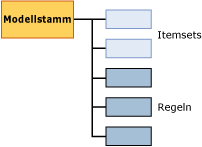

# Miningmodellinhalt von Zuordnungsmodellen (Analysis Services – Data Mining)
  In diesem Thema wird der Miningmodellinhalt beschrieben, der Modellen eigen ist, die den [!INCLUDE[msCoName](../../includes/msconame-md.md)] Association Rules-Algorithmus verwenden. Eine Erläuterung der allgemeinen Miningmodellinhalte, die für alle Modelltypen gelten, und Statistikterminologie finden Sie unter [Miningmodellinhalt &#40;Analysis Services – Data Mining&#41;](../../analysis-services/data-mining/mining-model-content-analysis-services-data-mining.md).  
  
## Grundlegendes zur Struktur von Zuordnungsmodellen  
 Ein Zuordnungsmodell besitzt eine einfache Struktur. Jedes Modell verfügt über einen einzigen übergeordneten Knoten, der das Modell und seine Metadaten darstellt, und jeder übergeordnete Knoten enthält eine einfache Liste der Itemsets und Regeln. Die Itemsets und Regeln werden nicht in Baumstrukturen dargestellt, sie werden, wie im folgenden Diagramm gezeigt, zuerst nach Itemsets und anschließend nach Regeln geordnet.  
  
   
  
 Jedes Itemset ist in seinem eigenen Knoten (NODE_TYPE = 7) enthalten. Der *Knoten* enthält die Definition des Itemsets, die Anzahl der Fälle, die dieses Itemset enthalten, sowie weitere Informationen.  
  
 Auch jede Regel ist in ihrem eigenen Knoten (NODE_TYPE = 8) enthalten. Eine *Regel* beschreibt ein allgemeines Muster dafür, wie Elemente zugeordnet werden. Eine Regel ist wie eine IF-THEN-Anweisung. Die linke Seite der Regel enthält eine vorhandene Bedingung oder einen Satz von Bedingungen. Die rechte Seite der Regel enthält das Element des Datasets, das normalerweise den Bedingungen auf der linken Seite zugeordnet ist.  
  
 **Hinweis** Wenn Sie die Regeln oder die Itemsets extrahieren möchten, können Sie eine Abfrage einsetzen, die nur den gewünschten Knotentyp zurückgibt. Weitere Informationen finden Sie unter [Beispiele für Zuordnungsmodellabfragen](../../analysis-services/data-mining/association-model-query-examples.md).  
  
## Modellinhalt eines Zuordnungsmodells  
 In diesem Abschnitt werden nur diejenigen Spalten des Miningmodellinhalts detaillierter und anhand von Beispielen erläutert, die für Zuordnungsmodelle relevant sind.  
  
 Informationen zu den allgemeinen Spalten im Schemarowset, z.B. MODEL_CATALOG und MODEL_NAME, finden Sie unter [Miningmodellinhalt &#40;Analysis Services – Data Mining&#41;](../../analysis-services/data-mining/mining-model-content-analysis-services-data-mining.md).  
  
 MODEL_CATALOG  
 Name der Datenbank, in der das Modell gespeichert wird.  
  
 MODEL_NAME  
 Name des Modells.  
  
 ATTRIBUTE_NAME  
 Die Namen der Attribute, die diesem Knoten entsprechen.  
  
 NODE_NAME  
 Der Name des Knotens. Bei einem Zuordnungsmodell enthält diese Spalte den gleichen Wert wie NODE_UNIQUE_NAME.  
  
 NODE_UNIQUE_NAME  
 Der eindeutige Name des Knotens.  
  
 NODE_TYPE  
 Ein Zuordnungsmodell gibt nur die folgenden Knotentypen aus:  
  
|Knotentyp-ID|Typ|  
|------------------|----------|  
|1 (Model)|Stammknoten oder übergeordneter Knoten|  
|7 (Itemset)|Ein Itemset oder Auflistung von Attribut/Wert-Paaren. Beispiele:   `Product 1 = Existing, Product 2 = Existing`   oder   `Gender = Male`.|  
|8 (Regel)|Eine Regel, die definiert, in welcher Beziehung Elemente zueinander stehen.   Beispiel:   `Product 1 = Existing, Product 2 = Existing -> Product 3 = Existing`.|  
  
 NODE_CAPTION  
 Eine Bezeichnung oder Beschriftung, die dem Knoten zugeordnet ist.  
  
 **Itemsetknoten** Eine durch Trennzeichen getrennte Liste von Elementen.  
  
 **Regelknoten** Enthält die linke und die rechte Seite der Regel.  
  
 CHILDREN_CARDINALITY  
 Gibt die Anzahl von untergeordneten Elementen des aktuellen Knotens an.  
  
 **Übergeordneter Knoten** Gibt die Gesamtzahl von Itemsets plus Regeln an.  
  
> [!NOTE]  
>  Eine Aufschlüsselung der Anzahl von Itemsets und Regeln finden Sie unter NODE_DESCRIPTION für den Stammknoten des Modells.  
  
 **Itemset- oder Regelknoten** Stets 0.  
  
 PARENT_UNIQUE_NAME  
 Der eindeutige Name des dem Knoten übergeordneten Elements.  
  
 **Übergeordneter Knoten** Stets NULL.  
  
 **Itemset- oder Regelknoten** Stets 0.  
  
 NODE_DESCRIPTION  
 Eine benutzerfreundliche Beschreibung des Knoteninhalts.  
  
 **Übergeordneter Knoten** Enthält eine durch Trennzeichen getrennte Liste der folgenden Informationen über das Modell:  
  
|Element|Beschreibung|  
|----------|-----------------|  
|ITEMSET_COUNT|Anzahl aller Itemsets im Modell.|  
|RULE_COUNT|Anzahl aller Regeln im Modell.|  
|MIN_SUPPORT|Die minimale Unterstützung für jedes einzelnes Itemset.   **Hinweis** Dieser Wert kann sich von dem Wert unterscheiden, den Sie für den *MINIMUM_SUPPORT* -Parameter festgelegt haben.|  
|MAX_SUPPORT|Die maximale Unterstützung für jedes einzelne Itemset.   **Hinweis** Dieser Wert kann sich von dem Wert unterscheiden, den Sie für den *MAXIMUM_SUPPORT* -Parameter festgelegt haben.|  
|MIN_ITEMSET_SIZE|Die Größe des kleinsten Itemsets, die als Anzahl von Elementen dargestellt wird.   Ein Wert von 0 gibt an, dass der **Missing** -Status als unabhängiges Element behandelt wurde.   **Hinweis** Der Standardwert des *MINIMUM_ITEMSET_SIZE* -Parameters ist 1.|  
|MAX_ITEMSET_SIZE|Gibt die Größe des größten Itemsets an, das gefunden wurde.   **Hinweis** Dieser Wert wird durch den Wert beschränkt, den Sie bei der Erstellung des Modells für den *MAX_ITEMSET_SIZE* -Parameter festgelegt haben. Der erste Wert kann den anderen Wert nie übersteigen, aber er kann kleiner sein. Der Standardwert ist 3.|  
|MIN_PROBABILITY|Die minimale Wahrscheinlichkeit, die für jedes einzelne Itemset oder eine Regel im Modell erkannt wurde.   Beispiel: 0,400390625   **Hinweis** Bei Itemsets ist dieser Wert immer größer als der Wert, den Sie bei der Erstellung des Modells für den *MINIMUM_PROBABILITY* -Parameter festgelegt haben.|  
|MAX_PROBABILITY|Die maximale Wahrscheinlichkeit, die für jedes einzelnes Itemset oder eine Regel im Modell erkannt wurde.   Beispiel: 1   **Hinweis** Es gibt keinen Parameter, der die maximale Wahrscheinlichkeit von Itemsets einschränkt. Wenn Sie Elemente ausschließen möchten, die zu häufig vorkommen, verwenden Sie stattdessen den *MAXIMUM_SUPPORT* -Parameter.|  
|MIN_LIFT|Die Mindestmenge an Lift, die vom Modell für ein beliebiges Itemset bereitgestellt wird.   Beispiel: 0,4309369632511   Hinweis: Wenn Sie den minimalen Lift kennen, können Sie leichter bestimmen, ob der Lift für irgendein einzelnes Itemset signifikant ist.|  
|MAX_LIFT|Die Höchstmenge an Lift, die vom Modell für ein beliebiges Itemset bereitgestellt wird.   Beispiel: 1,95758227647523 **Hinweis** Wenn Sie den maximalen Lift kennen, können Sie leichter bestimmen, ob der Lift für irgendein einzelnes Itemset signifikant ist.|  
  
 **Itemsetknoten** Diese Knoten enthalten eine Liste der Elemente, die als durch Trennzeichen getrennte Textzeichenfolge angezeigt wird.  
  
 Beispiel:  
  
 `Touring Tire = Existing, Water Bottle = Existing`  
  
 Dies bedeutet, Trekkingreifen und Wasserflasche wurden zusammen gekauft.  
  
 **Regelknoten** Diese Knoten enthalten die linke und die rechte Seite der Regel, die durch einen Pfeil voneinander getrennt sind.  
  
 Beispiel: `Touring Tire = Existing, Water Bottle = Existing -> Cycling cap = Existing`  
  
 Das bedeutet, dass jemand, der die Artikel Trekkingreifen und Wasserflasche kauft, wahrscheinlich auch den Artikel Fahrradkappe kauft.  
  
 NODE_RULE  
 Ein XML-Fragment, das die Regel oder das Itemset beschreibt, die bzw. das im Knoten eingebettet ist.  
  
 **Übergeordneter Knoten** Leer.  
  
 **Itemsetknoten** Leer.  
  
 **Regelknoten** Das XML-Fragment enthält zusätzliche nützliche Informationen über die Regel, beispielsweise Unterstützung, Vertrauen und die Anzahl der Elemente und die ID des Knotens, der die linke Seite der Regel darstellt.  
  
 MARGINAL_RULE  
 Leer.  
  
 NODE_PROBABILITY  
 Ein Wahrscheinlichkeits- oder ein Vertrauenswert, der dem Itemset oder der Regel zugeordnet ist.  
  
 **Übergeordneter Knoten** Stets 0.  
  
 **Itemsetknoten** Wahrscheinlichkeit des Itemsets.  
  
 **Regelknoten** Vertrauenswert für die Regel.  
  
 MARGINAL_PROBABILITY  
 Identisch mit NODE_PROBABILITY.  
  
 NODE_DISTRIBUTION  
 Die Tabelle enthält sehr unterschiedliche Informationen, je nachdem, ob der Knoten ein Itemset oder eine Regel ist.  
  
 **Übergeordneter Knoten** Leer.  
  
 **Itemsetknoten** Listet jedes Element im Itemset zusammen mit einem Wahrscheinlichkeits- und Unterstützungswert auf. Wenn das Itemset beispielsweise zwei Itemset enthält, wird der Name jedes Produkts zusammen mit der Anzahl der Fälle aufgeführt, die jedes Produkt enthalten.  
  
 **Regelknoten** Enthält zwei Zeilen. Die erste Zeile enthält das Attribut von der rechten Seite der Regel, d. das vorhergesagte Element zusammen mit einem Vertrauenswert.  
  
 Die zweite Zeile ist Zuordnungsmodellen eigen. Sie enthält einen Zeiger auf das Itemset auf der rechten Seite der Regel. Der Zeiger wird in der ATTRIBUTE_VALUE-Spalte als ID des Itemset dargestellt, das nur das Element von der rechten Seite enthält.  
  
 Wenn die Regel beispielsweise `If {A,B} Then {C}`lautet, enthält die Tabelle den Namen des Elements `{C}`und die ID des Knotens, der das Itemset für Element C enthält.  
  
 Dieser Zeiger ist nützlich, weil Sie anhand des Itemsetknotens bestimmen können, wie viele Fälle insgesamt das Produkt von der rechten Seite beinhalten. Die Fälle, für welche die Regel `If {A,B} Then {C}` gilt, stellen eine Teilmenge der Fälle dar, die im Itemset für `{C}`aufgeführt sind.  
  
 NODE_SUPPORT  
 Die Anzahl der Fälle, die diesen Knoten unterstützen.  
  
 **Übergeordneter Knoten** Die Anzahl der Fälle im Modell.  
  
 **Itemsetknoten** Anzahl der Fälle, die alle im Itemset befindlichen Elemente enthalten.  
  
 **Regelknoten** Die Anzahl der Fälle, die alle in der Regel enthaltenen Elemente umfassen.  
  
 MSOLAP_MODEL_COLUMN  
 Enthält unterschiedliche Informationen, je nachdem, ob der Knoten ein Itemset oder eine Regel ist.  
  
 **Übergeordneter Knoten** Leer.  
  
 **Itemsetknoten** Leer.  
  
 **Regelknoten** Die ID des Itemset, das die Elemente von der linken Seite der Regel enthält. Wenn die Regel beispielsweise `If {A,B} Then {C}`lautet, enthält diese Spalte die ID des Itemsets, das nur `{A,B}`enthält.  
  
 MSOLAP_NODE_SCORE  
 **Übergeordneter Knoten** Leer.  
  
 **Itemsetknoten** Wichtigkeitsbewertung für das Itemset.  
  
 **Regelknoten** Wichtigkeitsbewertung für das Itemset.  
  
> [!NOTE]  
>  Die Wichtigkeit wird für Itemsets und Regeln auf unterschiedliche Weise berechnet. Weitere Informationen finden Sie unter [Technische Referenz für den Microsoft Association-Algorithmus](../../analysis-services/data-mining/microsoft-association-algorithm-technical-reference.md).  
  
 MSOLAP_NODE_SHORT_CAPTION  
 Leer.  
  
## Siehe auch  
 [Miningmodellinhalt &#40;Analysis Services – Data Mining&#41;](../../analysis-services/data-mining/mining-model-content-analysis-services-data-mining.md)   
 [Microsoft Association-Algorithmus](../../analysis-services/data-mining/microsoft-association-algorithm.md)   
 [Beispiele für Zuordnungsmodellabfragen](../../analysis-services/data-mining/association-model-query-examples.md)  
  
  

