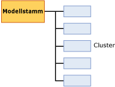

# Mingingmodellinhalt von Clustermodellen (Analysis Services - Data Mining)
  In diesem Thema wird der Miningmodellinhalt beschrieben, der Modellen eigen ist, die den Microsoft Clustering-Algorithmus verwenden. Eine allgemeine Erläuterung der Miningmodellinhalte für alle Modelltypen finden Sie unter [Miningmodellinhalt &#40;Analysis Services – Data Mining&#41;](../../analysis-services/data-mining/mining-model-content-analysis-services-data-mining.md).  
  
## Grundlegendes zur Struktur von Clusteringmodellen  
 Ein Clusteringmodell besitzt eine einfache Struktur. Jedes Modell verfügt über einen einzigen übergeordneten Knoten, der das Modell und seine Metadaten darstellt, und jeder übergeordnete Knoten enthält eine einfache Liste der Cluster (NODE_TYPE = 5). Dieser Aufbau wird in der folgenden Abbildung dargestellt.  
  
   
  
 Jeder untergeordnete Knoten stellt ein einzelnes Cluster dar und enthält detaillierte Statistiken zu den Attributen der in diesem Cluster enthaltenen Fälle. Hierzu zählen die Anzahl der zum Cluster gehörigen Fälle und die Verteilung der Werte, durch die sich das betreffende Cluster von anderen Clustern unterscheidet.  
  
> [!NOTE]  
>  Sie müssen nicht alle Knoten durchsuchen, um die Anzahl der Cluster zu ermitteln und deren Beschreibung zu erhalten. Im übergeordneten Knoten des Modells wird auch die Anzahl und eine Auflistung der Knoten verzeichnet.  
  
 Der übergeordnete Knoten enthält nützliche statistische Daten, die die tatsächliche Verteilung aller Trainingsfälle beschreiben. Diese statistischen Daten befinden sich in der geschachtelten Tabellenspalte NODE_DISTRIBUTION. Beispielsweise enthält die folgende Tabelle einige Zeilen der Tabelle NODE_DISTRIBUTION, die die Verteilung der demografischen Kundendaten aus dem Clustermodell `TM_Clustering`beschreibt, das Sie im [Tutorial zu Data Mining-Grundlagen](http://msdn.microsoft.com/library/6602edb6-d160-43fb-83c8-9df5dddfeb9c)erstellen:  
  
|ATTRIBUTE_NAME|ATTRIBUTE_VALUE|Alias|PROBABILITY|VARIANCE|VALUE_TYPE|  
|---------------------|---------------------|-------------|-----------------|--------------|-----------------|  
|Age|Nicht vorhanden|0|0|0|1 (Missing)|  
|Age|44.9016152716593|12939|1|125.663453102554|3 (Continuous)|  
|Geschlecht|Nicht vorhanden|0|0|0|1 (Missing)|  
|Geschlecht|V|6350|0.490764355823479|0|4 (Discrete)|  
|Geschlecht|M|6589|0.509235644176521|0|4 (Discrete)|  
  
 Aus diesen Ergebnissen geht hervor, dass 12.939 Fälle zur Erstellung des Modells verwendet wurden, dass das Verhältnis zwischen männlichen und weiblichen Kunden etwa 50:50 war und dass das durchschnittliche Alter 44 Jahre betrug. Die beschreibenden Statistikdaten unterscheiden sich, je nachdem, ob das berechnete Attribut einen kontinuierlichen numerischen Datentyp oder einen diskreten Werttyp aufweist, wie beispielsweise Geschlecht. Die statistischen Measures *Mittelwert* und *Varianz* werden für kontinuierliche Datentypen berechnet, während *Wahrscheinlichkeit* und *Unterstützung* für diskrete Datentypen berechnet werden.  
  
> [!NOTE]  
>  Die Varianz repräsentiert die Gesamtvarianz des Clusters. Wenn der Varianzwert klein ist, bedeutet dies, dass die meisten Werte der Spalte relativ nah am Mittelwert liegen. Um die Standardabweichung zu erhalten, berechnen Sie die Quadratwurzel der Varianz.  
  
 Beachten Sie, dass jedes Attribut den Werttyp **Missing** enthält, der anzeigt, in wie vielen Fällen kein Wert für das Attribut gegeben war. Fehlende Daten können signifikant sein und die Berechnungen je nach Datentyp auf verschiedene Weise beeinflussen. Weitere Informationen finden Sie unter [Fehlende Werte &#40;Analysis Services – Data Mining&#41;](../../analysis-services/data-mining/missing-values-analysis-services-data-mining.md).  
  
## Modellinhalt eines Clusteringmodells  
 In diesem Abschnitt werden nur diejenigen Spalten des Miningmodellinhalts detaillierter und anhand von Beispielen erläutert, die für Clusteringmodelle relevant sind.  
  
 Informationen zu den allgemeinen Spalten im Schemarowset, z.B. MODEL_CATALOG und MODEL_NAME, finden Sie unter [Miningmodellinhalt &#40;Analysis Services – Data Mining&#41;](../../analysis-services/data-mining/mining-model-content-analysis-services-data-mining.md).  
  
 MODEL_CATALOG  
 Name der Datenbank, in der das Modell gespeichert wird.  
  
 MODEL_NAME  
 Name des Modells.  
  
 ATTRIBUTE_NAME  
 Ist in Clusteringmodellen immer leer, da es in diesem Modell kein vorhersagbares Attribut gibt.  
  
 NODE_NAME  
 Entspricht immer NODE_UNIQUE_NAME.  
  
 NODE_UNIQUE_NAME  
 Ein innerhalb des Modells eindeutiger Bezeichner für den Knoten. Dieser Wert kann nicht geändert werden.  
  
 NODE_TYPE  
 Ein Clusteringmodell gibt die folgenden Knotentypen aus:  
  
|Knoten-ID und Name|Description|  
|----------------------|-----------------|  
|1 (Model)|Stammknoten des Modells|  
|5 (Cluster)|Enthält die Anzahl der im Cluster enthaltenen Fälle, die Merkmale der im Cluster enthaltenen Fälle und Statistiken, welche die Werte des Clusters beschreiben.|  
  
 NODE_CAPTION  
 Ein beschreibender Name, der angezeigt wird. Wenn Sie ein Modell erstellen, wird der Wert von NODE_UNIQUE_NAME automatisch als Beschriftung verwendet. Sie können den Wert von NODE_CAPTION jedoch im Programmcode oder im Viewer ändern, um den Anzeigenamen des Clusters zu aktualisieren.  
  
> [!NOTE]  
>  Wenn Sie das Modell erneut verarbeiten, werden alle Namensänderungen durch die neuen Werte überschrieben. Die Namen können nicht im Modell persistent gespeichert werden, und Sie können Änderungen in der Clustermitgliedschaft nicht über verschiedene Versionen eines Modells hinweg verfolgen.  
  
 CHILDREN_CARDINALITY  
 Eine Schätzung der Anzahl untergeordneter Elemente des Knotens.  
  
 **Übergeordneter Knoten** Gibt die Anzahl von Clustern im Modell an.  
  
 **Clusterknoten** Stets 0.  
  
 PARENT_UNIQUE_NAME  
 Der eindeutige Name des dem Knoten übergeordneten Elements.  
  
 **Übergeordneter Knoten** Stets NULL.  
  
 **Clusterknoten** In der Regel 000.  
  
 NODE_DESCRIPTION  
 Eine Beschreibung des Knotens.  
  
 **Übergeordneter Knoten** Stets **(Alle)**.  
  
 **Clusterknoten** Eine durch Trennzeichen getrennte Liste der primären Attribute, durch die sich der Cluster von anderen Clustern unterscheidet.  
  
 NODE_RULE  
 Wird für Clusteringmodelle nicht verwendet.  
  
 MARGINAL_RULE  
 Wird für Clusteringmodelle nicht verwendet.  
  
 NODE_PROBABILITY  
 Die diesem Knoten zugeordnete Wahrscheinlichkeit. **Übergeordneter Knoten** Stets 1.  
  
 **Clusterknoten** Die Wahrscheinlichkeit repräsentiert die zusammengesetzte Wahrscheinlichkeit der Attribute, wobei einige Anpassungen vorgenommen werden, die von dem zur Erstellung des Clusteringmodells verwendeten Algorithmus abhängen.  
  
 MARGINAL_PROBABILITY  
 Die Wahrscheinlichkeit für das Erreichen des Knotens vom übergeordneten Knoten aus. In einem Clusteringmodell entspricht die marginale Wahrscheinlichkeit immer der Knotenwahrscheinlichkeit.  
  
 NODE_DISTRIBUTION  
 Eine Tabelle, die das Wahrscheinlichkeitshistogramm des Knotens enthält.  
  
 **Übergeordneter Knoten** Siehe die Einführung zu diesem Thema.  
  
 **Clusterknoten** Stellt die Verteilung der Attribute und Werte für die Fälle dar, die zu diesem Cluster gehören.  
  
 NODE_SUPPORT  
 Die Anzahl der Fälle, die diesen Knoten unterstützen. **Übergeordneter Knoten** Gibt die Anzahl der Trainingsfälle für das gesamte Modell an.  
  
 **Clusterknoten** Gibt die Größe des Clusters als Anzahl von Fällen an.  
  
 **Hinweis** Wenn das Modell die K-Means-Clusteringmethode verwendet, kann jeder Fall nur zu einem Cluster gehören. Verwendet das Modell dagegen die EM-Clusteringmethode, kann jeder Fall zu verschiedenen Clustern gehören, und jedem Fall wird für jedes Cluster, zu dem er gehört, ein gewichteter Abstand zugewiesen. Daher ist bei EM-Modellen die Summe der Unterstützungswerte für ein einzelnes Cluster größer als der Unterstützungswert für das Gesamtmodell.  
  
 MSOLAP_MODEL_COLUMN  
 Wird für Clusteringmodelle nicht verwendet.  
  
 MSOLAP_NODE_SCORE  
 Zeigt die dem Knoten zugeordnete Bewertung an.  
  
 **Übergeordneter Knoten** Der BIC-Wert (Bayesian Information Criterion) des Clustermodells.  
  
 **Clusterknoten** Stets 0.  
  
 MSOLAP_NODE_SHORT_CAPTION  
 Eine zu Anzeigezwecken verwendete Beschriftung. Diese Beschriftung kann nicht geändert werden.  
  
 **Übergeordneter Knoten** Der Typ des Modells: Clusteringmodell.  
  
 **Clusterknoten** Der Name des Clusters. Beispiel: Cluster 1.  
  
## Hinweise  
 [!INCLUDE[ssASnoversion](../../includes/ssasnoversion-md.md)] stellt mehrere Methoden zum Erstellen eines Clusteringmodells bereit. Wenn Sie nicht wissen, mithilfe welcher Methode das Modell, mit dem Sie arbeiten, erstellt wurde, können Sie die Modellmetadaten entweder programmgesteuert über einen ADOMD-Client oder über AMO oder durch Abfragen des Data Mining-Schemarowsets abrufen. Weitere Informationen finden Sie unter [Abfragen der Parameter, mit denen ein Miningmodell erstellt wird](../../analysis-services/data-mining/query-the-parameters-used-to-create-a-mining-model.md).  
  
> [!NOTE]  
>  Struktur und Inhalt des Modells werden weder durch die verwendete Clusteringmethode noch die Parameter beeinflusst.  
  
## Siehe auch  
 [Miningmodellinhalt &#40;Analysis Services – Data Mining&#41;](../../analysis-services/data-mining/mining-model-content-analysis-services-data-mining.md)   
 [Data Mining-Modell-Viewer](../../analysis-services/data-mining/data-mining-model-viewers.md)   
 [Microsoft Clustering-Algorithmus](../../analysis-services/data-mining/microsoft-clustering-algorithm.md)   
 [Data Mining-Abfrage](../../analysis-services/data-mining/data-mining-queries.md)  
  
  

