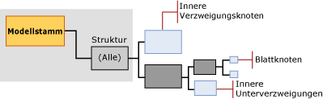

# Miningmodellinhalt von Entscheidungsstrukturmodellen (Analysis Services – Data Mining)
  In diesem Thema wird der Miningmodellinhalt beschrieben, der Modellen eigen ist, die den [!INCLUDE[msCoName](../../includes/msconame-md.md)] Decision Trees-Algorithmus verwenden. Eine allgemeine Erläuterung der Miningmodellinhalte für alle Modelltypen finden Sie unter [Miningmodellinhalt &#40;Analysis Services – Data Mining&#41;](../../analysis-services/data-mining/mining-model-content-analysis-services-data-mining.md). Sie sollten stets bedenken, dass der Microsoft Decision Trees-Algorithmus ein hybrider Algorithmus ist, der Modelle mit sehr unterschiedlichen Funktionen erstellen kann: Eine Entscheidungsstruktur kann Zuordnungen, Regeln oder gar lineare Regression darstellen. Der Aufbau der Struktur ist grundsätzlich gleich. Allerdings hängt die Art und Weise, in der Sie die Informationen interpretieren, vom Zweck ab, für den Sie das Modell erstellen.  
  
##   Grundlegendes zur Struktur von Entscheidungsstrukturmodellen  
 Ein Entscheidungsstrukturmodell verfügt über einen einzelnen übergeordneten Knoten, der das Modell und die zugehörigen Metadaten darstellt. Unterhalb des übergeordneten Knotens befinden sich unabhängige Strukturen, die die vorhersagbaren Attribute darstellen, die Sie auswählen. Wenn Sie beispielsweise Ihr Entscheidungsstrukturmodell darauf einrichten, vorherzusagen, welche Kunden etwas kaufen werden, und Angaben zu Geschlecht und Einkommen eingeben, würde das Modell eine einzelne Struktur für das Einkaufsattribut erstellen, wobei viele Zweige in Bedingungen hinsichtlich Geschlecht und Einkommen unterteilt wären.  
  
 Wenn Sie allerdings ein separates, vorhersagbares Attribut für die Teilnahme in einem Kundenprämienprogramm hinzufügen, wird der Algorithmus zwei separate Strukturen unterhalb des übergeordneten Knotens erstellen. Eine Struktur enthält die Analyse für den Einkauf, und die andere Struktur enthält die Analyse für das Kundenprämienprogramm.  Wenn Sie den Decision Trees-Algorithmus für die Erstellung eines Zuordnungsmodells verwenden, erstellt der Algorithmus eine separate Struktur für jedes Produkt, das vorhergesagt wird, und die Struktur enthält alle Produktkombinationen, die zur Auswahl des Zielattributs beitragen.  
  
> [!NOTE]  
>  Wenn Ihr Modell mehrere Strukturen enthält, können Sie über den **Microsoft Struktur-Viewer**jeweils nur eine Struktur gleichzeitig einsehen. Im **Generic Content Tree-Viewer** dagegen werden alle Strukturen des gleichen Modells gleichzeitig angezeigt.  
  
   
  
 Die Struktur für jedes vorhersagbare Attribut enthält Informationen, die beschreiben, welche Auswirkungen die Eingabespalten, die Sie auswählen, auf das Ergebnis dieses vorhersagbaren Attributs haben. Jeder Struktur geht ein Knoten (NODE_TYPE = 9) voran, der das vorhersagbare Attribut enthält, gefolgt von einer Reihe von Knoten (NODE_TYPE = 10), die die Eingabeattribute darstellen. Ein Attribut entspricht entweder einer Spalte auf Fallebene oder Werten aus Spalten einer geschachtelten Tabelle. Hierbei handelt es sich in der Regel um Werte in der **Schlüssel** -Spalte der geschachtelten Tabelle.  
  
 Innere Knoten und Blattknoten stellen Teilungsbedingungen dar. Eine Struktur kann mehrmals auf dem gleichen Attribut teilen. Beispielsweise kann das Modell **TM_DecisionTree** auf [Yearly Income] und [Number of Children] und dann, weiter unten in der Struktur, erneut auf [Yearly Income] teilen.  
  
 Der Microsoft Decision Trees-Algorithmus kann des Weiteren lineare Regressionen in der gesamten Struktur oder in Teilen davon enthalten. Wenn es sich beim Attribut, das Sie modellieren, um einen kontinuierlichen, numerischen Datentyp handelt, kann das Modell immer dort einen Regressionsknoten (NODE_TYPE = 25) erstellen, wo die Beziehung zwischen den Attributen linear modelliert werden kann. In diesem Fall enthält der Knoten eine Regressionsformel.  
  
 Allerdings erstellt das Modell immer eine Klassifizierungsstruktur (NODE_TYPE =2), wenn das vorhersagbare Attribut diskrete Werte hat oder wenn numerische Werte Buckets zugeordnet sind oder diskretisiert wurden. Ein Klassifizierungsknoten kann über mehrere Zweige oder innere Strukturknoten (NODE_TYPE =3) für jeden Wert des Attributs verfügen. Aber die Teilung liegt nicht notwendigerweise auf jedem Wert des Attributs.  
  
 Der Microsoft Decision Trees-Algorithmus lässt keine kontinuierlichen Datentypen als Eingaben zu. Daher werden die Werte diskretisiert, wenn Spalten über einen kontinuierlichen, numerischen Datentyp verfügen. Am Punkt einer Teilung führt der Algorithmus seine eigene Diskretisierung für alle kontinuierlichen Attribute aus.  
  
> [!NOTE]  
>  [!INCLUDE[ssASnoversion](../../includes/ssasnoversion-md.md)]Wählt automatisch eine Methode für Zuordnung von Buckets zu kontinuierlichen Attributen; Allerdings können Sie steuern, wie kontinuierliche Werte in den Eingaben diskretisiert werden, durch Festlegen den Inhaltstyp der Miningstrukturspalte auf **Discretized** festlegen und anschließend die <xref:Microsoft.AnalysisServices.ScalarMiningStructureColumn.DiscretizationBucketCount%2A> oder <xref:Microsoft.AnalysisServices.ScalarMiningStructureColumn.DiscretizationMethod%2A> Eigenschaft.  
  
 [top](#bkmk_Top)  
  
##   Modellinhalt für ein Entscheidungsstrukturmodell  
 In diesem Abschnitt werden nur diejenigen Spalten des Miningmodellinhalts detaillierter und anhand von Beispielen erläutert, die für Entscheidungsstrukturmodelle relevant sind. Informationen zu den allgemeinen Spalten im Schemarowset und weitere Erläuterungen zur Miningmodell-Terminologie finden Sie unter [Miningmodellinhalt &#40;Analysis Services – Data Mining&#41;](../../analysis-services/data-mining/mining-model-content-analysis-services-data-mining.md).  
  
 MODEL_CATALOG  
 Name der Datenbank, in der das Modell gespeichert wird.  
  
 MODEL_NAME  
 Name des Modells.  
  
 ATTRIBUTE_NAME  
 Name des Attributs, das diesem Knoten entspricht.  
  
 NODE_NAME  
 Entspricht immer NODE_UNIQUE_NAME.  
  
 NODE_UNIQUE_NAME  
 Ein innerhalb des Modells eindeutiger Bezeichner für den Knoten. Dieser Wert kann nicht geändert werden.  
  
 Bei Entscheidungsstrukturmodellen halten eindeutige Namen die folgenden Konventionen ein. Diese gelten nicht für alle Algorithmen:  
  
 Die untergeordneten Knoten eines jeden Knotens haben alle das gleiche hexadezimale Präfix, das von einer weiteren hexadezimalen Zahl gefolgt wird, die die Sequenz des untergeordneten Knotens innerhalb des übergeordneten Elements darstellt. Sie können die Präfixe verwenden, um einen Pfad abzuleiten.  
  
 NODE_TYPE  
 In Entscheidungsstrukturmodellen werden die folgenden Knotentypen erstellt:  
  
|Knotentyp|Description|  
|---------------|-----------------|  
|1 (Model)|Stammknoten des Modells|  
|2 (Struktur)|Übergeordneter Knoten für Klassifizierungsstrukturen im Modell. Gekennzeichnet mit **"Alle"**.|  
|3 (Innen)|Head des inneren Zweigs innerhalb einer Klassifizierungs- oder Regressionsstruktur.|  
|4 (Verteilung)|Blattknoten innerhalb einer Klassifzierungs- oder Regressionsstruktur.|  
|25 (Regressionsstruktur)|Übergeordneter Knoten für Regressionsstruktur innerhalb des Modells. Gekennzeichnet mit **"Alle"**.|  
  
 NODE_CAPTION  
 Ein beschreibender Name, der angezeigt wird.  
  
 Wenn Sie ein Modell erstellen, wird der Wert von NODE_UNIQUE_NAME automatisch als Beschriftung verwendet. Sie können den Wert von NODE_CAPTION jedoch im Programmcode oder im Viewer ändern, um den Anzeigenamen des Clusters zu aktualisieren. Die Beschriftung wird automatisch vom Modell generiert. Der Inhalt der Beschriftung hängt vom Modell- und Knotentyp ab.  
  
 In einem Entscheidungsstrukturmodell verfügen NODE_CAPTION und NODE_DESCRIPTION je nach Ebene in der Struktur über unterschiedliche Informationen. Weitere Informationen und Beispiele finden Sie unter [Knotenbeschriftung und Knotenbeschreibung](#NodeCaption).  
  
 CHILDREN_CARDINALITY  
 Eine Schätzung der Anzahl untergeordneter Elemente des Knotens.  
  
 **Übergeordneter Knoten** Gibt die Anzahl vorhersagbarer Attribute an, die modelliert wurden. Eine Struktur wird für jedes vorhersagbare Attribut erstellt.  
  
 **Strukturknoten** Der Knoten **Alle** für jede Struktur gibt an, wie viele Werte für das Zielattribut verwendet wurden.  
  
-   Wenn das Zielattribut diskret ist, entspricht der Wert der Anzahl der unterschiedlichen Werte plus 1 für den Status **Missing** .  
  
-   Wenn das vorhersagbare Attribut kontinuierlich ist, gibt der Wert an, wie viele Buckets verwendet wurden, um das kontinuierliche Attribut zu modellieren.  
  
 **Blattknoten** Immer 0.  
  
 PARENT_UNIQUE_NAME  
 Der eindeutige Name des dem Knoten übergeordneten Elements. Für Knoten auf der Stammebene wird NULL zurückgegeben.  
  
 NODE_DESCRIPTION  
 Eine Beschreibung des Knotens.  
  
 In einem Entscheidungsstrukturmodell verfügen NODE_CAPTION und NODE_DESCRIPTION je nach Ebene in der Struktur über unterschiedliche Informationen.  
  
 Weitere Informationen und Beispiele finden Sie unter [Knotenbeschriftung und Knotenbeschreibung](#NodeCaption).  
  
 NODE_RULE  
 Eine XML-Beschreibung der Regel, die den Pfad zum aktuellen Knoten von seinem unmittelbar übergeordneten Knoten beschreibt.  
  
 Weitere Informationen und Beispiele finden Sie unter [Knotenregel und marginale Regel](#NodeRule).  
  
 MARGINAL_RULE  
 Eine XML-Beschreibung der Regel, die den Pfad vom übergeordneten Knoten des Modells zum aktuellen Knoten beschreibt.  
  
 Weitere Informationen finden Sie unter [Knotenregel und marginale Regel](#NodeRule).  
  
 NODE_PROBABILITY  
 Die diesem Knoten zugeordnete Wahrscheinlichkeit.  
  
 Weitere Informationen finden Sie unter [Wahrscheinlichkeit](#bkmk_NodeDist_Discrete).  
  
 MARGINAL_PROBABILITY  
 Die Wahrscheinlichkeit für das Erreichen des Knotens vom übergeordneten Knoten aus.  
  
 Weitere Informationen finden Sie unter [Wahrscheinlichkeit](#bkmk_NodeDist_Discrete).  
  
 NODE_DISTRIBUTION  
 Eine Tabelle, die das Wahrscheinlichkeitshistogramm des Knotens enthält. Die Informationen in dieser Tabelle unterscheiden sich abhängig davon, ob das vorhersagbare Attribut eine kontinuierliche oder diskrete Variable ist.  
  
 **Modellstammknoten** Diese Tabelle ist leer.  
  
 **(Alle) Knoten** Enthält eine Zusammenfassung für das Modell als Ganzes.  
  
 **Innerer Knoten** Enthält aggregierte Statistiken für seine Blattknoten.  
  
 **Blattknoten** Enthält Unterstützung und Wahrscheinlichkeit für die vorhergesagten Ergebnisse, vorausgesetzt alle Bedingungen im Pfad führen zum aktuellen Blattknoten.  
  
 **Regressionsknoten** Enthält die Regressionsformel, die die Beziehung zwischen den Eingaben und dem vorhersagbaren Attribut darstellt.  
  
 Weitere Informationen finden Sie unter [Knotenverteilung für diskrete Attribute](#bkmk_NodeDist_Discrete) und [Knotenverteilung für kontinuierliche Attribute](#bkmk_RegressionNodes).  
  
 NODE_SUPPORT  
 Die Anzahl der Fälle, die diesen Knoten unterstützen.  
  
 MSOLAP_MODEL_COLUMN  
 Gibt die Spalte an, die das vorhersagbare Attribut enthält.  
  
 MSOLAP_NODE_SCORE  
 Zeigt die dem Knoten zugeordnete Bewertung an. Weitere Informationen finden Sie unter [Knotenbewertung](#NodeScore).  
  
 MSOLAP_NODE_SHORT_CAPTION  
 Eine zu Anzeigezwecken verwendete Beschriftung.  
  
## Hinweise  
 Im Gegensatz zum Knoten für Randstatistik, der in einem Naive Bayes- oder neuronalen Netzwerkmodell zu finden ist, verfügt ein Entscheidungsstrukturmodell nicht über einen separaten Knoten, der Statistiken für das gesamte Modell speichert. Stattdessen erstellt das Modell eine separate Struktur für jedes vorhersagbare Attribut, wobei sich ein Knoten (Alle) auf der oberen Ebene der Struktur befindet. Jede Struktur ist unabhängig von den anderen. Wenn Ihr Modell nur ein vorhersagbares Attribut enthält, gibt es nur eine Struktur und damit nur einen Knoten (Alle).  
  
 Jede Struktur, die ein Ausgabeattribut darstellt, wird weiter in innere Zweige (NODE_TYPE = 3) unterteilt, die Teilungen darstellen. Jede dieser Strukturen enthält Statistiken über die Verteilung des Zielattributs. Zusätzlich enthält ein Blattknoten (NODE_TYPE = 4) Statistiken, die sowohl Eingabeattribute als auch ihre Werte mit der Anzahl von Fällen im Unterstützungswert dieses Attribut-Werte-Paars beschreiben. Daher können Sie in jedem Zweig einer Entscheidungsstruktur die Wahrscheinlichkeiten oder die Verteilung der Daten leicht einsehen, ohne die Quelldaten abfragen zu müssen. Jede Ebene der Struktur stellt zwangsläufig die Summe seiner unmittelbar untergeordneten Knoten dar.  
  
 Beispiele zum Abrufen dieser Statistiken finden Sie unter [Beispiele für Entscheidungsstruktur-Modellabfragen](../../analysis-services/data-mining/decision-trees-model-query-examples.md).  
  
 [top](#bkmk_Top)  
  
## Beispiel für den Aufbau der Entscheidungsstruktur  
 Um zu verstehen, wie eine Entscheidungsstruktur funktioniert, betrachten Sie ein Beispiel, z. B. das Bike Buyer-Szenario von AdventureWorks. Unter der Annahme, dass es sich bei dem vorhersagbaren Attribut um die Kundeneinkäufe handelt, versucht der Decision Trees-Algorithmus, unter allen Eingaben, die Sie bereitstellen, eine Spalte mit Daten zu finden, die am effektivsten die Kunden herausstellt, die wahrscheinlich ein Fahrrad kaufen könnten oder die eher kein Fahrrad kaufen. Beispielsweise nimmt das Modell an, dass es sich beim Alter um den besten Indikator für Kaufverhalten handelt. Speziell, dass Kunden über 30 Jahren sehr wahrscheinlich ein Fahrrad kaufen könnten und alle anderen Kunden eher nicht. In diesem Szenario erstellt das Modell auf dem Age-Attribut eine *Teilung* . Dies bedeutet, dass sich die Struktur in zwei Zweige unterteilt. Ein Zweig enthält die Kunden über 30 und der andere diejenigen unter 30. Die neuen Verzweigungen werden in der Modellstruktur als zwei neue innere Strukturen (NODE_TYPE = 3) dargestellt.  
  
 Für jede Verzweigung sucht das Modell weiterhin nach zusätzlichen Attributen, die bei der Unterscheidung von Kunden verwendet werden sollen. Wenn die Hinweise in den Daten nicht ausreichen, um eine weitere Erstellung von Untergruppen von Kunden vorzunehmen, beendet das Modell den Strukturaufbau. Das Modell beendet darüber hinaus den Aufbau der Struktur, wenn die Anzahl der Fälle im Knoten zu klein ist, um fortzufahren, unabhängig davon, wie gut die Teilung ist oder ob der Wert null ist oder fehlt. Durch eine frühe Beendigung des weiteren Strukturwachstums verhindern Sie, dass das Modell ein zu enges Training auf ein bestimmtes Dataset durchführt.  
  
 Jeder innere Strukturknoten enthält Blattknoten, die eine Aufteilung der Ergebnisse anhand der aktuellen Klassifizierungsergebnisse bereitstellen. Beispielsweise könnten Sie einen inneren Knoten verwenden, der für Age >= 30 und Gender = Male steht. Der Knoten für diese Gruppe zeigt Ihnen, wie viele Kunden in dieser Kategroie etwas gekauft haben oder nichts gekauft haben. Beispielsweise könnte die Klassifizierung die folgenden Strukturteilungen enthalten:  
  
|Innere Struktur|Teilung|  
|-------------------|-----------|  
|Age >= 30|Age >= 30 und Gender = Male|  
||Age >= 30 und Gender = Female|  
|Age < 30|Age < 30 und Gender = Male|  
||Age < 30 und Gender = Female|  
  
 Wenn Sie ein Entscheidungsstrukturmodell für Vorhersagen verwenden, übernimmt das Modell die Attribute, die Sie bereitstellen, als Argumente und folgt dem Pfad der Attribute in der Struktur nach unten. Im Allgemeinen wechseln alle Vorhersagen zu einem Blattknoten, und die inneren Knoten werden nur für Klassifizierung verwendet.  
  
 Ein Blattknoten verfügt immer über einen NODE_TYPE von 4 (Verteilung) und enthält ein Histogramm, das anhand der von Ihnen bereitgestellten Attribute Aufschluss über die Wahrscheinlichkeit eines jeden Ergebnisses (Einkauf oder kein Einkauf) gibt. Wenn Sie beispielsweise eine Vorhersage für einen neuen Kunden erstellen möchten, der männlich und über 60 Jahre alt ist, untersucht das Modell den entsprechenden Knoten (Age > 30 und Gender = Male) und gibt dann die Wahrscheinlichkeit für das angegebene Ergebnis zurück. Diese Wahrscheinlichkeiten werden in der [NODE_DISTRIBUTION](#bkmk_NodeDist_Discrete) -Tabelle für den Knoten gespeichert.  
  
 Handelt es sich beim vorhersagbaren Attribut um eine fortlaufende Nummer, versucht der Algorithmus, eine Regressionsformel aufzustellen, die die Beziehung zwischen dem vorhersagbaren Attribut und den Eingaben modelliert.  
  
 [top](#bkmk_Top)  
  
###   Knotenbeschriftung und Knotenbeschreibung  
 In einem Entscheidungsstrukturmodell enthalten die Knotenbeschriftung und die Knotenbeschreibung ähnliche Informationen. Allerdings ist die Knotenbeschreibung vollständiger, und sie enthält in Richtung Blattknoten immer mehr Informationen. Sowohl bei der Knotenbeschriftung als auch bei der Knotenbeschreibung handelt es sich um lokalisierte Zeichenfolgen.  
  
|||  
|-|-|  
|**NODE_CAPTION**|Zeigt das Attribut an, das diesen bestimmten Knoten relativ zum übergeordneten Knoten unterscheidet. Die Knotenbeschriftung definiert basierend auf der Teilungsbedingung ein Untersegment der Auffüllung. Angenommen, die Teilung erfolgt bei [Age] mittels eines 3-Wege-Verfahrens. Die drei untergeordneten Knoten könnten in diesem Fall mit "[Age] < 40", "40 <= [Age] < 50" und "[Age] >= 50" beschriftet werden.|  
|**NODE_DESCRIPTION**|Enthält eine vollständige Liste der Attribute, die diesen Knoten von anderen unterscheiden, beginnend mit dem übergeordneten Knoten des Modells. Beispiel: Product name = Apple und Color = Red.|  
  
 [top](#bkmk_Top)  
  
###   Knotenregel und marginale Regel  
 Die Spalten NODE_RULE und MARGINAL_RULE enthalten die gleichen Informationen wie die Spalten NODE_CAPTION und NODE_DESCRIPTION, aber stellen die Informationen als XML-Fragmente dar. Die Knotenregel ist eine XML-Version des vollständigen Pfads, während die marginale Regel die letzte Teilung angibt.  
  
 Das vom XML-Fragment dargestellte Attribut kann entweder einfach oder komplex sein. Ein einfaches Attribut enthält den Namen der Modellspalte und den Wert des Attributs. Enthält die Modellspalte eine geschachtelte Tabelle, wird das Attribut der geschachtelten Tabelle als Verkettung aus Tabellenname, Schlüsselwert und Attribut dargestellt.  
  
> [!NOTE]  
>  [!INCLUDE[ssNoVersion](../../includes/ssnoversion-md.md)][!INCLUDE[ssASnoversion](../../includes/ssasnoversion-md.md)] unterstützt Version 2.0 des PMML-Standards mit Erweiterungen zur Unterstützung von geschachtelten Tabellen. Wenn Ihre Daten geschachtelte Tabellen enthalten und Sie eine PMML-Version des Modells erstellen, werden alle Elemente im Modell, die die Prädikate enthalten, als eine Erweiterung markiert.  
  
 [top](#bkmk_Top)  
  
###   Knotenverteilung für diskrete Attribute  
 In einem Entscheidungsstrukturmodell enthält die NODE_DISTRIBUTION-Tabelle nützliche Statistiken. Allerdings hängt der Typ der Statistik davon ab, ob die Struktur ein diskretes oder kontinuierliches Attribut vorhersagt. In diesem Abschnitt wird die Bedeutung der Knotenverteilungsstatistik für diskrete Attribute beschrieben.  
  
#### Attributname und Attributwert  
 In einer Klassifizierungsstruktur enthält der Attributname immer den Namen der vorhersagbaren Spalte. Dieser Wert gibt Aufschluss darüber, was die Struktur vorhersagt. Da eine einzelne Struktur immer ein einzelnes vorhersagbares Attribut darstellt, wird dieser Wert überall in der Struktur wiederholt.  
  
 Für einen diskreten Datentyp listet das Feld für den Attributwert die möglichen Werte der vorhersagbaren Spalte plus dem **Missing** -Wert auf.  
  
#### Support  
 Der Unterstützungswert für jeden Knoten gibt Aufschluss darüber, wie viele Fälle in diesem Knoten enthalten sind. Auf der Ebene (Alle) sollten Sie die Gesamtanzahl der Fälle sehen können, die für das Training des Modells verwendet wurden. Für jede Teilung in der Struktur ist der Unterstützungswert die Anzahl der Fälle, die im Knoten der Struktur gruppiert wurden. Die Summe der Fälle in den Blattknoten entspricht zwangsläufig der Anzahl der Fälle im übergeordneten Knoten der Struktur.  
  
 Für Knoten, die kontinuierliche Attribute darstellen, kann das Vorhandensein von null in den Daten zu nicht intuitiven Ergebnissen führen. Bei „m“ Fällen würde der Mittelwert beispielsweise mit „sum(all cases)/n“ berechnet, wobei „n“ einer Zahl kleiner als „m“ entspricht und „m-n“ die Anzahl der Fälle mit fehlenden Werten angibt. Die Unterstützung wird auch mit „n“ angegeben.  
  
#### Wahrscheinlichkeit  
 Die jedem Knoten zugeordnete Wahrscheinlichkeit gibt Aufschluss über die Wahrscheinlichkeit, über die jeder Fall im gesamten Dataset in diesem bestimmten Knoten verfügen wird. Wahrscheinlichkeitsergebnisse werden sowohl für die Struktur als ganzes als auch für die unmittelbare Teilung berechnet.  
  
 Die folgende Tabelle zeigt beispielsweise ein sehr einfaches Modell mit 100 Fällen.  
  
|Innere Struktur|Fälle|Blattknoten|Fälle|Zu übergeordnetem Knoten relative Wahrscheinlichkeit|Zu oberstem Knoten relative Wahrscheinlichkeit|  
|-------------------|-----------|---------------|-----------|-----------------------------------------|--------------------------------------|  
|Age >= 30|60|Age >= 30 und Gender = Male|50|50/60 = .83|50/100 = .5|  
|||Age >= 30 und Gender = Female|10|10/60 = .16|10/100 = .10|  
|Age < 30|40|Age < 30 und Gender = Male|30|30/40 = .75|30/100 = .30|  
|||Age < 30 und Gender = Female|10|10/40 = .25|10/100 = .10|  
  
 Um mögliche fehlende Werte zu berücksichtigen, wird in allen Modellen eine geringfügige Anpassung vorgenommen. Bei kontinuierlichen Attributen wird jeder Wert oder Wertebereich als Status dargestellt wird (z. B. Alter \<30, Age = 30, "und" Age > 30) und die Wahrscheinlichkeiten werden wie folgt berechnet: Status vorhanden (Wert = 1), anderer Status vorhanden (Wert = 0), Zustand ist  **Fehlende**. Weitere Informationen über die Anpassung von Wahrscheinlichkeiten zur Darstellung fehlender Werte finden Sie unter [Fehlende Werte &#40;Analysis Services – Data Mining&#41;](../../analysis-services/data-mining/missing-values-analysis-services-data-mining.md).  
  
 Die Wahrscheinlichkeiten für jeden Knoten werden fast direkt aus der Verteilung berechnet. Dies geschieht wie folgt:  
  
 Wahrscheinlichkeit = (Unterstützung für Status + Unterstützung für vorherigen Status)/(Knotenunterstützung plus Unterstützung des vorherigen Knotens)  
  
 [!INCLUDE[ssASnoversion](../../includes/ssasnoversion-md.md)] verwendet Wahrscheinlichkeiten für jeden Knoten, um die gespeicherte Wahrscheinlichkeit mit der vorherigen Wahrscheinlichkeit zu vergleichen und so zu bestimmen, ob der Pfad vom übergeordneten zum untergeordneten Knoten eine starke Inferenz darstellt.  
  
 Beim Treffen von Vorhersagen muss die Wahrscheinlichkeit der Verteilung durch die Wahrscheinlichkeit des Knotens ausgeglichen werden, um die Wahrscheinlichkeiten zu glätten. Trennt zum Beispiel eine Teilung in der Struktur die Fälle in einem Verhältnis von 9000/1000, so ist die Struktur extrem unausgeglichen. Hieraus folgt, dass eine Vorhersage aus einem kleinen Zweig nicht die gleiche Gewichtung hat wie eine Vorhersage aus einem Zweig mit vielen Fällen.  
  
#### Variance  
 Varianz ist ein Maß dafür, wie zerstreut die Werte angesichts einer erwarteten Verteilung sind. Für diskrete Werte ist die Varianz definitionsgemäß 0.  
  
 Weitere Informationen zur Berechnung der Varianz für kontinuierliche Werte finden Sie unter [Miningmodellinhalt von linearen Regressionsmodellen &#40;Analysis Services – Data Mining&#41;](../../analysis-services/data-mining/mining-model-content-for-linear-regression-models-analysis-services-data-mining.md).  
  
#### Werttyp  
 Die Spalte für den Werttyp stellt Informationen über die Bedeutung des numerischen Werts dar, der in den anderen Spalten der NODE_DISTRIBUTION-Tabelle bereitgestellt wird. Sie können den Werttyp in Abfragen verwenden, um bestimmte Zeilen aus den geschachtelten Tabellen abzurufen. Beispiele finden Sie unter [Beispiele für Entscheidungsstruktur-Modellabfragen](../../analysis-services/data-mining/decision-trees-model-query-examples.md).  
  
 Die folgenden Typen der <xref:Microsoft.AnalysisServices.AdomdClient.MiningValueType> -Enumeration werden in Klassifizierungsstrukturen verwendet.  
  
|Werttyp|Description|  
|----------------|-----------------|  
|1 (Missing)|Gibt eine Anzahl, Wahrscheinlichkeit oder andere Statistiken in Bezug auf fehlende Werte an.|  
|4 (Discrete)|Gibt eine Anzahl, Wahrscheinlichkeit oder andere Statistiken in Bezug auf einen diskreten oder diskretisierten Wert an.|  
  
 Wenn das Modell ein kontinuierliches, vorhersagbares Attribut enthält, kann die Struktur darüber hinaus Werttypen enthalten, die für die Regressionsformeln eindeutig sind. Eine Liste der Werttypen, die in Regressionsstrukturen verwendet werden, finden Sie unter [Miningmodellinhalt von linearen Regressionsmodellen &#40;Analysis Services – Data Mining&#41;](../../analysis-services/data-mining/mining-model-content-for-linear-regression-models-analysis-services-data-mining.md).  
  
###   Knotenbewertung  
 Das Knotenergebnis stellt auf jeder Strukturebene leicht unterschiedliche Informationen dar. In der Regel handelt es sich beim Ergebnis um einen numerischen Wert, der Aufschluss darüber gibt, wie gut eine Teilung durch die Teilung auf der Bedingung erreicht wurde. Der Wert wird als doppelt dargestellt, wenn ein höherer Wert besser ist.  
  
 Definitionsgemäß haben der Modellknoten und alle Blattknoten ein Knotenergebnis von 0.  
  
 Für den Knoten (Alle), der die obere Ebene einer jeden Struktur darstellt, enthält die Spalte MSOLAP_NODE_SCORE das beste Teilungsergebnis der gesamten Struktur.  
  
 Für alle anderen Knoten in der Struktur (ausgenommen der Blattknoten) stellt das Ergebnis eines jeden Knotens das beste Teilungsergebnis für den aktuellen Knoten minus dem Teilungsergebnis für den übergeordneten Knoten dar. Üblicherweise sollte das Teilungsergebnis für einen übergeordneten Knoten immer besser sein als das Teilungsergebnis auf seinen untergeordneten Knoten. Grund hierfür ist, dass ein Entscheidungsstrukturmodell idealerweise zuerst auf den wichtigsten Attributen teilt.  
  
 Je nach gewähltem Algorithmusparameter gibt es viele Möglichkeiten, ein Ergebnis für eine Teilung zu berechnen. Eine Erläuterung dazu, wie Ergebnisse für jede Bewertungsmethode berechnet werden, würde den Rahmen dieses Themas sprengen. Weitere Informationen finden Sie unter "[Learning Bayesian Networks: The Combination of Knowledge and Statistical Data](http://research.microsoft.com/en-us/um/people/heckerman/hgc94uai.pdf)" auf der [!INCLUDE[msCoName](../../includes/msconame-md.md)] Research-Website.  
  
> [!NOTE]  
>  Wenn Sie ein Entscheidungsstrukturmodell erstellen, das sowohl über kontinuierliche als auch diskrete vorhersagbare Attribute verfügt, erhalten Sie völlig unterschiedliche Ergebnisse auf den Knoten (Alle), die jeden Strukturknoten darstellen. Jedes Modell sollte unabhängig voneinander berücksichtigt werden, und die für die Bewertungsregression verwendeten Methoden unterscheiden sich vollständig von denen, die für die Bewertungsklassifzierung verwendet werden. Die Knotenergebniswerte können nicht verglichen werden.  
  
 [top](#bkmk_Top)  
  
##   Regressionsknoten innerhalb eines Entscheidungsstrukturmodells  
 Wenn ein Entscheidungsstrukturmodell ein vorhersagbares Attribut mit kontinuierlichen, numerischen Daten enthält, versucht der Microsoft Decision Trees-Algorithmus, Bereiche in den Daten zu finden, wo die Beziehung zwischen dem vorhergesagten Status und den Eingabevariablen linear ist. Findet der Algorithmus eine lineare Beziehung, erstellt er eine spezielle Struktur (NODE_TYPE = 25), die eine lineare Regression darstellt. Diese Regressionsstrukturknoten sind komplexer als Knoten, die diskrete Werte darstellen.  
  
 Im Allgemeinen ordnet eine Regression die Änderungen in der kontinuierlichen, abhängigen (vorhersagbaren) Variablen als eine Funktion der Änderungen in den Eingaben zu. Wenn die abhängige Variable über kontinuierliche Eingaben verfügt und die Beziehung zwischen Eingabe und vorhergesagtem Wert stabil genug ist, um als Liniendiagramm berechnet zu werden, enthält der Knoten für die Regression eine Formel.  
  
 Ist allerdings die Beziehung zwischen der Eingabe und dem vorhergesagten Wert *nicht linear*, wird stattdessen wie bei einer standardmäßigen Entscheidungsstruktur eine Teilung erstellt. Nehmen wir beispielsweise an, dass A das vorhersagbare Attribut und B und C die Eingaben sind, wobei C ein kontinuierlicher Werttyp ist. Wenn die Beziehung zwischen A und C in Teilen der Daten verhältnismäßig stabil, in anderen instabil ist, wird der Algorithmus Teilungen erstellen, um die unterschiedlichen Bereiche der Daten darzustellen.  
  
|Teilungsbedingung|Ergebnis im Knoten|  
|---------------------|--------------------|  
|wenn n < 5|Beziehung kann als Gleichung 1 ausgedrückt werden|  
|wenn n zwischen 5 und 10|Keine Gleichung|  
|wenn n > 10|Beziehung kann als Gleichung 2 ausgedrückt werden|  
  
 Weitere Informationen zu Regressionsknoten finden Sie unter [Miningmodellinhalt von linearen Regressionsmodellen &#40;Analysis Services – Data Mining&#41;](../../analysis-services/data-mining/mining-model-content-for-linear-regression-models-analysis-services-data-mining.md).  
  
## Siehe auch  
 [Miningmodellinhalt &#40;Analysis Services – Data Mining&#41;](../../analysis-services/data-mining/mining-model-content-analysis-services-data-mining.md)   
 [Data Mining-Modell-Viewer](../../analysis-services/data-mining/data-mining-model-viewers.md)   
 [Data Mining-Abfrage](../../analysis-services/data-mining/data-mining-queries.md)   
 [Microsoft Decision Trees-Algorithmus](../../analysis-services/data-mining/microsoft-decision-trees-algorithm.md)  
  
  

