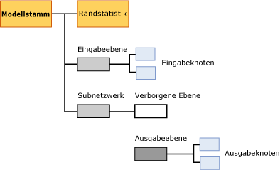

# Miningmodellinhalt von logistischen Regressionsmodellen
  In diesem Thema wird der Miningmodellinhalt beschrieben, der Modellen eigen ist, die den Microsoft Logistic Regression-Algorithmus verwenden. Eine Erklärung zur Interpretation von Statistiken und Strukturen, die allen Modelltypen gemein sind, und die allgemeinen Definitionen von Begriffen in Bezug auf den Miningmodellinhalt finden Sie unter [Miningmodellinhalt &#40;Analysis Services – Data Mining&#41;](../../analysis-services/data-mining/mining-model-content-analysis-services-data-mining.md).  
  
## Grundlegendes zur Struktur von logistischen Regressionsmodellen  
 Ein logistisches Regressionsmodell wird mithilfe des Microsoft Neural Network-Algorithmus mit Parametern erstellt, die das Modell darauf beschränken, den verborgenen Knoten zu entfernen. Daher ist die Gesamtstruktur eines logistischen Regressionsmodells fast identisch mit dem eines neuronalen Netzwerks: Jedes Modell verfügt sowohl über einen einzelnen übergeordneten Knoten, der das Modell und dessen Metadaten darstellt, als auch über einen besonderen Knoten für Randstatistik (NODE_TYPE = 24), der beschreibende Statistiken über die im Modell verwendeten Eingaben liefert.  
  
 Zusätzlich enthält das Modell ein Subnetzwerk (NODE_TYPE = 17) für jedes vorhersagbare Attribut. Wie auch bei einem neuronalen Netzwerkmodell enthält jedes Subnetzwerk zwei Zweige: einen für die Eingabeebene und einen weiteren Zweig, der die verborgene Ebene (NODE_TYPE = 19) und die Ausgabeebene (NODE_TYPE = 20) für das Netzwerk enthält. Das gleiche Subnetzwerk kann für mehrere Attribute verwendet werden, wenn sie nur auf die Vorhersage festgelegt sind. Vorhersagbare Attribute, die auch Eingaben sind, erscheinen möglicherweise nicht im gleichen Subnetzwerk.  
  
 Allerdings ist bei einem logistischen Regressionsmodell der Knoten, der die verborgene Ebene darstellt, leer und verfügt über keine untergeordneten Elemente. Daher enthält das Modell Knoten, die einzelne Ausgaben (NODE_TYPE = 23) und einzelne Eingaben (NODE_TYPE = 21), aber keine einzelnen, verborgenen Knoten darstellen.  
  
   
  
 Standardmäßig wird ein logistisches Regressionsmodell im **Microsoft-Viewer für neuronale Netzwerke**angezeigt. Über diesen benutzerdefinierten Viewer können Sie Eingabeattribute und deren Werte filtern und Diagramme einsehen, die darstellen, welche Auswirkungen diese auf die Ausgaben haben. Die QuickInfos im Viewer zeigen Ihnen die Wahrscheinlichkeit und Prognose für jedes Paar an Eingaben und Ausgabewerten an. Weitere Informationen finden Sie unter [Modell mit dem Microsoft-Viewer für neuronale Netzwerke durchsuchen](../../analysis-services/data-mining/browse-a-model-using-the-microsoft-neural-network-viewer.md).  
  
 Um die Struktur der Eingaben und Subnetzwerke zu durchsuchen und detaillierte Statistiken einzusehen, können Sie den Microsoft Generic Content Tree-Viewer verwenden. Sie können auf jeden Knoten klicken, um diesen zu erweitern und die untergeordneten Knoten einzusehen. Des Weiteren können Sie die Gewichtungen und andere Statistiken einsehen, die im Knoten enthalten sind.  
  
## Modellinhalt eines logistischen Regressionsmodells  
 In diesem Abschnitt werden nur diejenigen Spalten des Miningmodellinhalts detaillierter und anhand von Beispielen erläutert, die für die logistische Regression relevant sind. Der Modellinhalt ist fast identisch mit dem eines neuronalen Netzwerkmodells. Allerdings können Beschreibungen, die für neuronale Netzwerkmodelle gelten, in dieser Tabelle wiederholt werden.  
  
 Informationen zu den allgemeinen Spalten im Schemarowset, z.B. MODEL_CATALOG und MODEL_NAME, die hier nicht beschrieben werden, sowie weitere Erläuterungen zur Miningmodell-Terminologie finden Sie unter [Miningmodellinhalt &#40;Analysis Services – Data Mining&#41;](../../analysis-services/data-mining/mining-model-content-analysis-services-data-mining.md).  
  
 MODEL_CATALOG  
 Name der Datenbank, in der das Modell gespeichert wird.  
  
 MODEL_NAME  
 Name des Modells.  
  
 ATTRIBUTE_NAME  
 Die Namen des Attributs, das diesem Knoten entspricht.  
  
|Node|Inhalt|  
|----------|-------------|  
|Modellstamm|Leer|  
|Randstatistik|Leer|  
|Eingabeebene|Leer|  
|Eingabeknoten|Name des Eingabeattributs|  
|Verborgene Ebene|Leer|  
|Ausgabeebene|Leer|  
|Ausgabeknoten|Name des Ausgabeattributs|  
  
 NODE_NAME  
 Der Name des Knotens. Derzeit enthält diese Spalte den gleichen Wert wie NODE_UNIQUE_NAME. Dies ändert sich möglicherweise in zukünftigen Versionen.  
  
 NODE_UNIQUE_NAME  
 Der eindeutige Name des Knotens.  
  
 Weitere Informationen darüber, wie die Namen und IDs Strukturinformationen über Modelle bieten, finden Sie unter [Verwenden von Knotennamen und IDs](#bkmk_NodeIDs).  
  
 NODE_TYPE  
 Ein logistisches Regressionsmodell gibt die folgenden Knotentypen aus:  
  
|Knotentyp-ID|Description|  
|------------------|-----------------|  
|1|Modell.|  
|17|Planerknoten für das Subnetzwerk.|  
|18|Planerknoten für die Eingabeebene.|  
|19|Planerknoten für die verborgene Ebene. Die verborgene Ebene ist leer.|  
|20|Planerknoten für die Ausgabeebene.|  
|21|Eingabeattributknoten.|  
|23|Ausgabeattributknoten.|  
|24|Knoten für Randstatistik.|  
  
 NODE_CAPTION  
 Eine Bezeichnung oder Beschriftung, die dem Knoten zugeordnet ist. In logistischen Regressionsmodellen immer Leerzeichen.  
  
 CHILDREN_CARDINALITY  
 Eine Schätzung der Anzahl untergeordneter Elemente des Knotens.  
  
|Node|Inhalt|  
|----------|-------------|  
|Modellstamm|Gibt die Anzahl der untergeordneten Knoten an; enthält mindestens 1 Netzwerk, 1 erforderlichen Knoten für Randstatistik und 1 erforderliche Eingabeebene. Beispiel: Bei einem Wert von 5 sind 3 Subnetzwerke vorhanden.|  
|Randstatistik|Immer 0.|  
|Eingabeebene|Gibt die Anzahl der Eingabeattribut-Wert-Paare an, die vom Modell verwendet wurden.|  
|Eingabeknoten|Immer 0.|  
|Verborgene Ebene|In einem logistischen Regressionsmodell immer 0.|  
|Ausgabeebene|Gibt die Anzahl der Ausgabewerte an.|  
|Ausgabeknoten|Immer 0.|  
  
 PARENT_UNIQUE_NAME  
 Der eindeutige Name des dem Knoten übergeordneten Elements. Für Knoten auf der Stammebene wird NULL zurückgegeben.  
  
 Weitere Informationen darüber, wie die Namen und IDs Strukturinformationen über Modelle bieten, finden Sie unter [Verwenden von Knotennamen und IDs](#bkmk_NodeIDs).  
  
 NODE_DESCRIPTION  
 Eine benutzerfreundliche Beschreibung des Knotens.  
  
|Node|Inhalt|  
|----------|-------------|  
|Modellstamm|Leer|  
|Randstatistik|Leer|  
|Eingabeebene|Leer|  
|Eingabeknoten|Name des Eingabeattributs|  
|Verborgene Ebene|Leer|  
|Ausgabeebene|Leer|  
|Ausgabeknoten|Enthält den Namen des Ausgabeattributs, wenn das Ausgabeattribut kontinuierlich ist.   Enthält den Namen des Attributs und den Wert, wenn das Ausgabeattribut diskret oder diskretisiert ist.|  
  
 NODE_RULE  
 Eine XML-Beschreibung der Regel, die in den Knoten eingebettet ist.  
  
|Node|Inhalt|  
|----------|-------------|  
|Modellstamm|Leer|  
|Randstatistik|Leer|  
|Eingabeebene|Leer|  
|Eingabeknoten|Ein XML-Fragment, das die gleichen Informationen wie die Spalte NODE_DESCRIPTION enthält.|  
|Verborgene Ebene|Leer|  
|Ausgabeebene|Leer|  
|Ausgabeknoten|Ein XML-Fragment, das die gleichen Informationen wie die Spalte NODE_DESCRIPTION enthält.|  
  
 MARGINAL_RULE  
 Für logistische Regressionsmodelle immer Leerzeichen.  
  
 NODE_PROBABILITY  
 Die diesem Knoten zugeordnete Wahrscheinlichkeit. Für logistische Regressionsmodelle immer 0.  
  
 MARGINAL_PROBABILITY  
 Die Wahrscheinlichkeit für das Erreichen des Knotens vom übergeordneten Knoten aus. Für logistische Regressionsmodelle immer 0.  
  
 NODE_DISTRIBUTION  
 Eine geschachtelte Tabelle, die statistische Informationen für den Knoten enthält. Detaillierte Informationen über die Inhalte dieser Tabelle für jeden Knotentyp finden Sie im Abschnitt „Grundlegendes zur NODE_DISTRIBUTION-Tabelle“ unter [Miningmodellinhalt von neuronalen Netzwerkmodellen &#40;Analysis Services – Data Mining&#41;](../../analysis-services/data-mining/mining-model-content-for-neural-network-models-analysis-services-data-mining.md).  
  
 NODE_SUPPORT  
 Für logistische Regressionsmodelle immer 0.  
  
> [!NOTE]  
>  Unterstützungswahrscheinlichkeiten sind immer 0, da die Ausgabe dieses Modellstyps nicht probabilistisch ist. Nur die Gewichtungen sind für den Algorithmus von Bedeutung. Daher erfolgt keine Verarbeitung von Wahrscheinlichkeit, Unterstützung oder Varianz durch den Algorithmus.  
  
 Informationen über die Unterstützung in Trainingsfällen für spezifische Werte finden Sie über den Knoten für Randstatistik.  
  
 MSOLAP_MODEL_COLUMN  
 |Node|Inhalt|  
|----------|-------------|  
|Modellstamm|Leer|  
|Randstatistik|Leer|  
|Eingabeebene|Leer|  
|Eingabeknoten|Name des Eingabeattributs.|  
|Verborgene Ebene|Leer|  
|Ausgabeebene|Leer|  
|Ausgabeknoten|Name des Eingabeattributs.|  
  
 MSOLAP_NODE_SCORE  
 In logistischen Regressionsmodellen immer 0.  
  
 MSOLAP_NODE_SHORT_CAPTION  
 In logistischen Regressionsmodellen immer Leerzeichen.  
  
##   Verwenden von Knotennamen und IDs  
 Die Benennung der Knoten in einem logistischen Regressionsmodell bietet zusätzliche Informationen über die Beziehungen zwischen den Knoten im Modell. In der folgenden Tabelle werden die Konventionen für die IDs dargestellt, die den Knoten in jeder Ebene zugewiesen werden.  
  
|Knotentyp|Konvention für Knoten-ID|  
|---------------|----------------------------|  
|Modellstamm (1)|00000000000000000.|  
|Knoten für Randstatistik (24)|10000000000000000|  
|Eingabeebene (18)|30000000000000000|  
|Eingabeknoten (21)|Beginnt bei 60000000000000000|  
|Subnetzwerk (17)|20000000000000000|  
|Verborgene Ebene (19)|40000000000000000|  
|Ausgabeebene (20)|50000000000000000|  
|Ausgabeknoten (23)|Beginnt bei 80000000000000000|  
  
 Sie können diese IDs verwenden, um zu bestimmen, in welcher Beziehung Ausgabeattribute zu spezifischen Attributen der Eingabeebene stehen, indem Sie die Tabelle NODE_DISTRIBUTION des Ausgabeknotens einsehen. Jede Zeile in dieser Tabelle enthält eine ID, die auf einen bestimmten Eingabeattributknoten zurückzeigt. Die NODE_DISTRIBUTION-Tabelle enthält auch den Koeffizienten für dieses Eingabe-Ausgabe-Paar.  
  
## Siehe auch  
 [Microsoft Logistic Regression-Algorithmus](../../analysis-services/data-mining/microsoft-logistic-regression-algorithm.md)   
 [Miningmodellinhalt, neuronale Netzwerkmodelle &#40; Analysis Services – Datamining &#41;](../../analysis-services/data-mining/mining-model-content-for-neural-network-models-analysis-services-data-mining.md)   
 [Logistische Regressionsmodell-Abfragebeispiele](../../analysis-services/data-mining/logistic-regression-model-query-examples.md)   
 [Technische Referenz für den Microsoft Logistic Regression-Algorithmus](../../analysis-services/data-mining/microsoft-logistic-regression-algorithm-technical-reference.md)  
  
  
