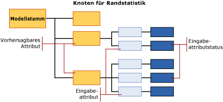

# <a name="mining-model-content-for-naive-bayes-models-analysis-services---data-mining"></a>Miningmodellinhalt von Naive Bayes-Modellen (Analysis Services - Data Mining)
  In diesem Thema wird der Miningmodellinhalt beschrieben, der Modellen eigen ist, die den [!INCLUDE[msCoName](../../includes/msconame-md.md)] Naive Bayes-Algorithmus verwenden. Eine Erklärung zur Interpretation von Statistiken und Strukturen, die allen Modelltypen gemein sind, und die allgemeinen Definitionen von Begriffen in Bezug auf den Miningmodellinhalt finden Sie unter [Miningmodellinhalt &#40;Analysis Services – Data Mining&#41;](../../analysis-services/data-mining/mining-model-content-analysis-services-data-mining.md).  
  
## <a name="understanding-the-structure-of-a-naive-bayes-model"></a>Grundlegendes zur Struktur von Naive Bayes-Modellen  
 Ein Naive Bayes-Modell verfügt über einen einzigen übergeordneten Knoten, der das Modell und seine Metadaten darstellt. Unterhalb eines jeden übergeordneten Knotens befinden sich die unabhängigen Strukturen, die die von Ihnen ausgewählten vorhersagbaren Attribute darstellen. Zusätzlich zu den Strukturen für die Attribute enthält jedes Modell einen Knoten für Randstatistik (NODE_TYPE = 26), der beschreibende Statistiken über die Sätze der Trainingsfälle bietet. Weitere Informationen finden Sie unter [Informationen im Knoten für Randstatistik](#bkmk_margstats).  
  
 Für jedes vorhersagbare Attribut und jeden Wert gibt das Modell eine Struktur aus, die beschreibende Informationen darüber enthält, welche Auswirkungen die verschiedenen Eingabespalten auf das Ergebnis des entsprechenden vorhersagbaren Attributs haben. Jede Struktur enthält das vorhersagbare Attribut und seinen Wert (NODE_TYPE = 9) und weiterhin eine Reihe von Knoten, die die Eingabeattribute (NODE_TYPE = 10) darstellen. Da die Eingabeattribute in der Regel über mehrere Werte verfügen, kann jedes Eingabeattribut (NODE_TYPE = 10) mehrere untergeordnete Knoten (NODE_TYPE = 11) besitzen; jeweils einen für einen bestimmten Status des Attributs.  
  
> [!NOTE]  
>  Da ein Naive Bayes-Modell keine kontinuierlichen Datentypen zulässt, werden alle Werte der Eingabespalten diskret oder diskretisiert behandelt. Sie können festlegen, wie ein Wert diskretisiert wird. Weitere Informationen finden Sie unter [Ändern der Diskretisierung von Spalten in Miningmodellen](../../analysis-services/data-mining/change-the-discretization-of-a-column-in-a-mining-model.md).  
  
   
  
## <a name="model-content-for-a-naive-bayes-model"></a>Modellinhalt eines Naive Bayes-Modells  
 In diesem Abschnitt werden nur diejenigen Spalten des Miningmodellinhalts detaillierter und anhand von Beispielen erläutert, die für Naive Bayes-Modelle relevant sind.  
  
 Informationen zu den allgemeinen Spalten im Schemarowset, z.B. MODEL_CATALOG und MODEL_NAME, die hier nicht beschrieben werden, sowie weitere Erläuterungen zur Miningmodell-Terminologie finden Sie unter [Miningmodellinhalt &#40;Analysis Services – Data Mining&#41;](../../analysis-services/data-mining/mining-model-content-analysis-services-data-mining.md).  
  
 MODEL_CATALOG  
 Name der Datenbank, in der das Modell gespeichert wird.  
  
 MODEL_NAME  
 Name des Modells.  
  
 ATTRIBUTE_NAME  
 Die Namen der Attribute, die diesem Knoten entsprechen.  
  
 **Modellstamm** Der Name des vorhersagbaren Attributs.  
  
 **Randstatistik** Nicht verfügbar  
  
 **Vorhersagbares Attribut** Name des vorhersagbaren Attributs.  
  
 **Eingabeattribut** Name des Eingabeattributs.  
  
 **Eingabeattributstatus** Nur der Name des Eingabeattributs. Um den Status abzufragen, verwenden Sie MSOLAP_NODE_SHORT_CAPTION.  
  
 NODE_NAME  
 Der Name des Knotens.  
  
 Diese Spalte enthält den gleichen Wert wie NODE_UNIQUE_NAME.  
  
 Weitere Informationen über die Benennungskonventionen für Knoten finden Sie unter [Verwenden von Knotennamen und IDs](#bkmk_nodenames).  
  
 NODE_UNIQUE_NAME  
 Der eindeutige Name des Knotens. Die eindeutigen Namen werden gemäß einer Konvention zugewiesen, die Informationen über die Beziehungen zwischen den Knoten bietet. Weitere Informationen über die Benennungskonventionen für Knoten finden Sie unter [Verwenden von Knotennamen und IDs](#bkmk_nodenames).  
  
 NODE_TYPE  
 Ein Naive Bayes-Modell gibt die folgenden Knotentypen aus:  
  
|Knotentyp-ID|Description|  
|------------------|-----------------|  
|26 (NaiveBayesMarginalStatNode)|Enthält Statistiken, die den ganzen Satz von Trainingsfällen für das Modell beschreiben.|  
|9 (vorhersagbares Attribut)|Enthält den Namen des vorhersagbaren Attributs.|  
|10 (Eingabeattribut)|Enthält den Namen der Eingabeattributspalte und untergeordnete Knoten, die die Werte für das Attribut enthalten.|  
|11 (Eingabeattributstatus)|Enthält die Werte oder diskretisierten Werte aller Eingabeattribute, die einem bestimmten Ausgabeattribut zugewiesen wurden.|  
  
 NODE_CAPTION  
 Die Bezeichnung oder Beschriftung, die dem Knoten zugeordnet ist. Diese Eigenschaft dient hauptsächlich zu Anzeigezwecken.  
  
 **Modellstamm** leer  
  
 **Randstatistik** leer  
  
 **Vorhersagbares Attribut** Name des vorhersagbaren Attributs.  
  
 **Eingabeattribut** Der Name des vorhersagbaren Attributs und des aktuellen Eingabeattributs. Beispiel:  
  
 Bike Buyer -> Age  
  
 **Eingabeattributstatus** Der Name des vorhersagbaren Attributs und des aktuellen Eingabeattributs und der Wert der Eingabe. Beispiel:  
  
 Bike Buyer -> Age = Fehlt  
  
 CHILDREN_CARDINALITY  
 Die Anzahl der untergeordneten Elemente des Knotens.  
  
 **Modellstamm** Anzahl der vorhersagbaren Attribute im Modell plus 1 für den Knoten für Randstatistik.  
  
 **Randstatistik** Hat definitionsgemäß keine untergeordneten Elemente.  
  
 **Vorhersagbares Attribut**  Anzahl der Eingabeattribute, die dem aktuellen vorhersagbaren Attribut zugewiesen wurden.  
  
 **Eingabeattribut** Anzahl der diskreten oder diskretisierten Werte für das aktuellen Eingabeattribut.  
  
 **Eingabeattributstatus** Immer 0.  
  
 PARENT_UNIQUE_NAME  
 Der eindeutige Name des übergeordneten Knotens. Weitere Informationen über die Zuordnung von über- und untergeordneten Knoten finden Sie unter [Verwenden von Knotennamen und IDs](#bkmk_nodenames).  
  
 NODE_DESCRIPTION  
 Entspricht der Knotenbeschriftung.  
  
 NODE_RULE  
 Eine XML-Darstellung der Knotenbeschriftung.  
  
 MARGINAL_RULE  
 Entspricht der Knotenregel.  
  
 NODE_PROBABILITY  
 Die diesem Knoten zugeordnete Wahrscheinlichkeit.  
  
 **Modellstamm** Immer 0.  
  
 **Randstatistik** Immer 0.  
  
 **Predictable-Attribut**  Immer 1.  
  
 **Eingabeattribut** Immer 1.  
  
 **Eingabeattributstatus** Eine Dezimalzahl, die die Wahrscheinlichkeit des aktuellen Werts darstellt. Die Werte für alle Eingabeattributstatus unter dem übergeordneten Eingabeattributknoten ergeben die Summe 1.  
  
 MARGINAL_PROBABILITY  
 Entspricht der Knotenwahrscheinlichkeit.  
  
 NODE_DISTRIBUTION  
 Eine Tabelle, die das Wahrscheinlichkeitshistogramm für den Knoten enthält. Weitere Informationen finden Sie unter [NODE_DISTRIBUTION-Tabelle](#bkmk_nodedist).  
  
 NODE_SUPPORT  
 Die Anzahl der Fälle, die diesen Knoten unterstützen.  
  
 **Modellstamm** Anzahl aller Fälle in den Trainingsdaten.  
  
 **Randstatistik** Immer 0.  
  
 **Vorhersagbares Attribut** Anzahl aller Fälle in den Trainingsdaten.  
  
 **Eingabeattribut** Anzahl aller Fälle in den Trainingsdaten.  
  
 **Eingabeattributstatus** Anzahl aller Fälle in den Trainingsdaten, die nur diesen bestimmten Wert enthalten.  
  
 MSOLAP_MODEL_COLUMN  
 Eine zu Anzeigezwecken verwendete Beschriftung. Normalerweise identisch mit ATTRIBUTE_NAME.  
  
 MSOLAP_NODE_SCORE  
 Stellt die Wichtigkeit des Attributs oder Werts innerhalb des Modells dar.  
  
 **Modellstamm** Immer 0.  
  
 **Randstatistik** Immer 0.  
  
 **Vorhersagbares Attribut**  Immer 0.  
  
 **Eingabeattribut** Interessantheitsgrad für das aktuelle Eingabeattribut relativ zum aktuellen vorhersagbaren Attribut.  
  
 **Eingabeattributstatus** Immer 0.  
  
 MSOLAP_NODE_SHORT_CAPTION  
 Eine Textzeichenfolge, die den Namen oder den Wert einer Spalte darstellt.  
  
 **Modellstamm** Leer  
  
 **Randstatistik** Leer  
  
 **Vorhersagbares Attribut**  Name des vorhersagbaren Attributs.  
  
 **Eingabeattribut** Name des Eingabeattributs.  
  
 **Eingabeattributstatus** Der Wert oder diskretisierte Wert des Eingabeattributs.  
  
##  <a name="bkmk_nodenames"></a> Verwenden von Knotennamen und IDs  
 Die Benennung der Knoten in einem Naive Bayes-Modell bietet zusätzliche Informationen über den Knotentyp. So werden die Beziehungen zwischen den Informationen im Modell deutlicher. In der folgenden Tabelle wird die Konvention für die IDs dargestellt, die anderen Knotentypen zugewiesen werden.  
  
|Knotentyp|Konvention für Knoten-ID|  
|---------------|----------------------------|  
|Modellstamm (1)|Immer 0.|  
|Knoten für Randstatistik (26)|Ein beliebiger ID-Wert.|  
|Vorhersagbares Attribut (9)|Hexadezimalzahl beginnend mit 10000000<br /><br /> Beispiel: 100000001, 10000000b|  
|Eingabeattribut (10)|Eine zweiteilige Hexadezimalzahl, wobei der erste Teil immer 20000000 ist und der zweite Teil mit dem Hexadezimalbezeichner für das verknüpfte vorhersagbare Attribut beginnt.<br /><br /> Beispiel: 20000000b00000000<br /><br /> In diesem Fall ist das verknüpfte vorhersagbare Attribut 10000000b.|  
|Eingabeattributstatus (11)|Eine dreiteilige Hexadezimalzahl, wobei der erste Teil immer 30000000 ist, der zweite Teil mit dem Hexadezimalbezeichner des verknüpften vorhersagbaren Attributs beginnt und der dritte Teil den Bezeichner des Werts darstellt.<br /><br /> Beispiel: 30000000b00000000200000000<br /><br /> In diesem Fall ist das verknüpfte vorhersagbare Attribut 10000000b.|  
  
 Sie können die IDs verwenden, um Eingabeattribute und -status mit einem vorhersagbaren Attribut zu verknüpfen. Beispielsweise gibt die folgende Abfrage den Namen und die Beschriftungen für die Knoten aus, die die möglichen Kombinationen aus Eingabe und vorhersagbaren Attributen für das Modell `TM_NaiveBayes`darstellen.  
  
```  
SELECT NODE_NAME, NODE_CAPTION  
FROM TM_NaiveBayes.CONTENT  
WHERE NODE_TYPE = 10  
```  
  
 Erwartete Ergebnisse:  
  
|NODE_NAME|NODE_CAPTION|  
|----------------|-------------------|  
|20000000000000001|Bike Buyer -> Commute Distance|  
|20000000000000002|Bike Buyer -> English Education|  
|20000000000000003|Bike Buyer -> English Occupation|  
|20000000000000009|Bike Buyer -> Marital Status|  
|2000000000000000a|Bike Buyer -> Number Children At Home|  
|2000000000000000b|Bike Buyer -> Region|  
|2000000000000000c|Bike Buyer -> Total Children|  
  
 Sie können die IDs der übergeordneten Knoten verwenden, um die untergeordneten Knoten abzurufen. Die folgende Abfrage ruft die Knoten ab, die Werte für das `Marital Status` -Attribut und die Wahrscheinlichkeit eines jeden Knotens enthalten.  
  
```  
SELECT NODE_NAME, NODE_CAPTION, NODE_PROBABILITY  
FROM TM_NaiveBayes.CONTENT  
WHERE NODE_TYPE = 11  
AND [PARENT_UNIQUE_NAME] = '20000000000000009'  
```  
  
> [!NOTE]  
>  Beachten Sie, dass der Name der Spalte PARENT_UNIQUE_NAME in Klammern eingeschlossen werden muss, um ihn von dem reservierten Schlüsselwort mit demselben Namen zu unterscheiden.  
  
 Erwartete Ergebnisse:  
  
|NODE_NAME|NODE_CAPTION|NODE_PROBABILITY|  
|----------------|-------------------|-----------------------|  
|3000000000000000900000000|Bike Buyer -> Marital Status = Fehlt|0|  
|3000000000000000900000001|Bike Buyer -> Marital Status = S|0.457504004|  
|3000000000000000900000002|Bike Buyer -> Marital Status = M|0.542495996|  
  
##  <a name="bkmk_nodedist"></a> NODE_DISTRIBUTION-Tabelle  
 Die verschachtelte Tabellenspalte NODE_DISTRIBUTION enthält in der Regel Statistiken über die Verteilung der Werte im Knoten. In einem Naive Bayes-Modell wird diese Tabelle nur für die folgenden Knoten aufgefüllt:  
  
|Knotentyp|Inhalt der geschachtelten Tabelle|  
|---------------|-----------------------------|  
|Modellstamm (1)|Leer.|  
|Knoten für Randstatistik (24)|Enthält zusammenfassende Informationen für alle vorhersagbaren Attribute und Eingabeattribute für den gesamten Satz an Trainingsdaten.|  
|Vorhersagbares Attribut (9)|Leer.|  
|Eingabeattribut (10)|Leer.|  
|Eingabeattributstatus (11)|Enthält Statistiken, die die Verteilung der Werte in den Trainingsdaten für diese bestimmte Kombination aus vorhersagbarem Wert und Eingabeattributwert beschreiben.|  
  
 Sie können die Knoten-IDs oder Knotenbeschriftungen verwenden, um mehr Detailebenen abzurufen. Beispielsweise ruft die folgende Abfrage spezifische Spalten aus der NODE_DISTRIBUTION-Tabelle nur für die Eingabeattributknoten ab, die mit dem Wert `'Marital Status = S'`in Beziehung stehen.  
  
```  
SELECT FLATTENED NODE_CAPTION,  
(SELECT ATTRIBUTE_NAME, ATTRIBUTE_VALUE, [SUPPORT], [PROBABILITY], VALUETYPE  
FROM NODE_DISTRIBUTION) as t  
FROM TM_NaiveBayes.content  
WHERE NODE_TYPE = 11  
AND NODE_CAPTION = 'Bike Buyer -> Marital Status = S'  
```  
  
 Erwartete Ergebnisse:  
  
|NODE_CAPTION|t.ATTRIBUTE_NAME|t.ATTRIBUTE_VALUE|t.SUPPORT|t.PROBABILITY|t.VALUETYPE|  
|-------------------|-----------------------|------------------------|---------------|-------------------|-----------------|  
|Bike Buyer -> Marital Status = S|Bike Buyer|Nicht vorhanden|0|0|1|  
|Bike Buyer -> Marital Status = S|Bike Buyer|0|3783|0.472934117|4|  
|Bike Buyer -> Marital Status = S|Bike Buyer|1|4216|0.527065883|4|  
  
 Bei diesen Ergebnissen gibt der Wert der SUPPORT-Spalte Aufschluss über die Anzahl der Kunden mit dem festgelegten Familienstand, die ein Fahrrad gekauft haben. Die Spalte PROBABILITY enthält die ausschließlich für diesen Knoten berechnete Wahrscheinlichkeit eines jeden Attributwerts. Allgemeine Definitionen von Begriffen, die in der NODE_DISTRIBUTION-Tabelle verwendet werden, finden Sie unter [Miningmodellinhalt &#40;Analysis Services – Data Mining&#41;](../../analysis-services/data-mining/mining-model-content-analysis-services-data-mining.md).  
  
###  <a name="bkmk_margstats"></a> Informationen im Knoten für Randstatistik  
 In einem Naive Bayes-Modell enthält die geschachtelte Tabelle für den Knoten für die Randstatistik die Verteilung der Werte für den gesamten Satz an Trainingsdaten. Beispielsweise enthält die folgende Tabelle eine Teilliste der Statistiken in der geschachtelten NODE_DISTRIBUTION-Tabelle für das Modell `TM_NaiveBayes`:  
  
|ATTRIBUTE_NAME|ATTRIBUTE_VALUE|SUPPORT|PROBABILITY|VARIANCE|VALUETYPE|  
|---------------------|----------------------|-------------|-----------------|--------------|---------------|  
|Bike Buyer|Nicht vorhanden|0|0|0|1|  
|Bike Buyer|0|8869|0.507263784|0|4|  
|Bike Buyer|1|8615|0.492736216|0|4|  
|Marital Status|Nicht vorhanden|0|0|0|1|  
|Marital Status|S|7999|0.457504004|0|4|  
|Marital Status|M|9485|0.542495996|0|4|  
|Total Children|Nicht vorhanden|0|0|0|1|  
|Total Children|0|4865|0.278254404|0|4|  
|Total Children|3|2093|0.119709449|0|4|  
|Total Children|1|3406|0.19480668|0|4|  
  
 Die [Bike Buyer]-Spalte ist enthalten, da der Knoten für Randstatistik immer eine Beschreibung des vorhersagbaren Attributs und seiner möglichen Werte enthält. Alle weiteren Spalten, die aufgelistet sind, stellen Eingabeattribute zusammen mit den Werten dar, die im Modell verwendet wurden. Die Werte können nur "fehlend", "diskret" oder "diskretisiert" lauten.  
  
 In einem Naive Bayes-Modell kann es keine kontinuierlichen Attribute geben. Daher werden alle numerischen Daten entweder als diskret (VALUE_TYPE = 4) oder diskretisiert (VALUE_TYPE = 5) dargestellt.  
  
 Der Wert **Missing** (VALUE_TYPE = 1) wird jedem Eingabe- und Ausgabeattribut hinzugefügt, um potenzielle Werte darzustellen, die in den Trainingsdaten nicht vorhanden waren. Es ist zwischen der Zeichenfolge "Missing" und dem Standardwert **Missing** zu unterscheiden. Weitere Informationen finden Sie unter [Fehlende Werte &#40;Analysis Services – Data Mining&#41;](../../analysis-services/data-mining/missing-values-analysis-services-data-mining.md).  
  
## <a name="see-also"></a>Siehe auch  
 [Miningmodellinhalt &#40;Analysis Services – Data Mining&#41;](../../analysis-services/data-mining/mining-model-content-analysis-services-data-mining.md)   
 [Data Mining-Modell-Viewer](../../analysis-services/data-mining/data-mining-model-viewers.md)   
 [Data Mining-Abfrage](../../analysis-services/data-mining/data-mining-queries.md)   
 [Microsoft Naive Bayes-Algorithmus](../../analysis-services/data-mining/microsoft-naive-bayes-algorithm.md)  
  
  
