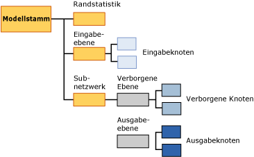

# Miningmodellinhalt von neuronalen Netzwerkmodellen (Analysis Services - Data Mining)
  In diesem Thema wird der Miningmodellinhalt beschrieben, der Modellen eigen ist, die den Microsoft Neural Network-Algorithmus verwenden. Eine Erklärung dazu, wie Statistiken und Strukturen, die allen Modelltypen eigen sind, interpretiert werden, und die allgemeinen Definitionen von Begriffen in Bezug auf den Miningmodellinhalt finden Sie unter [Miningmodellinhalt &#40;Analysis Services – Data Mining&#41;](../../analysis-services/data-mining/mining-model-content-analysis-services-data-mining.md).  
  
## Grundlegendes zur Struktur von neuronalen Netzwerkmodellen  
 Jedes neuronale Netzwerkmodell verfügt sowohl über einen einzelnen, übergeordneten Knoten, der das Modell und seine Metadaten darstellt, als auch über einen Knoten für Randstatistik (NODE_TYPE = 24), der beschreibende Statistiken über die Eingabeattribute bietet. Der Knoten für Randstatistik ist hilfreich, da er Informationen über Eingaben zusammenfasst, sodass Sie keine Daten von den einzelnen Knoten abfragen müssen.  
  
 Unterhalb dieser beiden Knoten befinden sich mindestens zwei weitere Knoten. Abhängig davon, über wie viele vorhersagbare Attribute das Modell verfügt, können dies auch viel mehr sein.  
  
-   Der erste Knoten (NODE_TYPE = 18) stellt immer den obersten Knoten der Eingabeebene dar. Unterhalb dieses obersten Knotens befinden sich Eingabeknoten (NODE_TYPE = 21), die die tatsächlichen Eingabeattribute und ihre Werte enthalten.  
  
-   Darauf folgende Knoten enthalten jeweils ein anderes *Subnetzwerk* (NODE_TYPE = 17). Jedes Subnetzwerk enthält eine verborgene Ebene (NODE_TYPE = 19) und eine Ausgabeebene (NODE_TYPE = 20) für dieses Subnetzwerk.  
  
   
  
 Die Informationen auf der Eingabeebene sind unkompliziert: der oberste Knoten einer jeden Eingabeebene (NODE_TYPE = 18) dient als Planer für eine Auflistung von Eingabeknoten (NODE_TYPE = 21). Der Inhalt der Eingabeknoten wird in der folgenden Tabelle beschrieben.  
  
 Jedes Subnetzwerk (NODE_TYPE = 17) stellt die Analyse der Auswirkung der Eingabeebene auf ein bestimmtes vorhersagbares Attribut dar. Wenn mehrere vorhersagbare Ausgaben vorliegen, gibt es mehrere Subnetzwerke. Die verborgene Ebene eines jeden Subnetzwerks enthält mehrere verborgene Knoten (NODE_TYPE = 22), die Details über die Gewichtungen für jeden Übergang enthalten, der in diesem verborgenen Knoten endet.  
  
 Die Ausgabeebene (NODE_TYPE = 20) enthält Ausgabeknoten (NODE_TYPE = 23), die jeweils unterschiedliche Werte des vorhersagbaren Attributs enthalten. Wenn das vorhersagbare Attribut vom kontinuierlichen, numerischen Datentyp ist, gibt es nur einen Ausgabeknoten für das Attribut.  
  
> [!NOTE]  
>  Der Logistic Regression-Algorithmus verwendet einen besonderen Fall eines neuronalen Netzwerks, der nur über ein vorhersagbares Ergebnis und potenzielle viele Eingaben verfügt. Die logistische Regression verwendet keine verborgene Ebene.  
  
 Die einfachste Art und Weise, die Struktur der Eingaben und Subnetzwerke zu durchsuchen, erfolgt über den **Microsoft Generic Content Tree-Viewer**. Sie können auf jeden Knoten klicken, um diesen zu erweitern und die untergeordneten Knoten einzusehen. Des Weiteren können Sie die Gewichtungen und andere Statistiken einsehen, die im Knoten enthalten sind.  
  
 Um mit den Daten zu arbeiten und zu sehen, wie das Modell Eingaben mit Ausgaben korreliert, verwenden Sie den **Microsoft-Viewer für neuronale Netzwerke**. Durch die Verwendung dieses benutzerdefinierten Viewers können Sie Eingabeattribute und deren Werte filtern und Diagramme einsehen, die darstellen, welche Auswirkungen diese auf die Ausgaben haben. Die QuickInfos im Viewer zeigen Ihnen die Wahrscheinlichkeit und Prognose für jedes Paar an Eingaben und Ausgabewerten an. Weitere Informationen finden Sie unter [Modell mit dem Microsoft-Viewer für neuronale Netzwerke durchsuchen](../../analysis-services/data-mining/browse-a-model-using-the-microsoft-neural-network-viewer.md).  
  
## Modellinhalt eines neuronalen Netzwerkmodells  
 In diesem Abschnitt werden nur diejenigen Spalten des Miningmodellinhalts detaillierter und anhand von Beispielen erläutert, die für neuronale Netzwerke relevant sind. Informationen zu den allgemeinen Spalten im Schemarowset, z.B. MODEL_CATALOG und MODEL_NAME, die hier nicht beschrieben werden, sowie weitere Erläuterungen zur Miningmodell-Terminologie finden Sie unter [Miningmodellinhalt &#40;Analysis Services – Data Mining&#41;](../../analysis-services/data-mining/mining-model-content-analysis-services-data-mining.md).  
  
 MODEL_CATALOG  
 Name der Datenbank, in der das Modell gespeichert wird.  
  
 MODEL_NAME  
 Name des Modells.  
  
 ATTRIBUTE_NAME  
 Die Namen der Attribute, die diesem Knoten entsprechen.  
  
|Node|Inhalt|  
|----------|-------------|  
|Modellstamm|Leer|  
|Randstatistik|Leer|  
|Eingabeebene|Leer|  
|Eingabeknoten|Name des Eingabeattributs|  
|Verborgene Ebene|Leer|  
|Verborgener Knoten|Leer|  
|Ausgabeebene|Leer|  
|Ausgabeknoten|Name des Ausgabeattributs|  
  
 NODE_NAME  
 Der Name des Knotens. Diese Spalte enthält den gleichen Wert wie NODE_UNIQUE_NAME.  
  
 NODE_UNIQUE_NAME  
 Der eindeutige Name des Knotens.  
  
 Weitere Informationen darüber, wie die Namen und IDs Strukturinformationen über Modelle bieten, finden Sie unter [Verwenden von Knotennamen und IDs](#bkmk_NodeIDs).  
  
 NODE_TYPE  
 Ein neuronales Netzwerkmodell gibt die folgenden Knotentypen aus:  
  
|Knotentyp-ID|Description|  
|------------------|-----------------|  
|1|Modell.|  
|17|Planerknoten für das Subnetzwerk.|  
|18|Planerknoten für die Eingabeebene.|  
|19|Planerknoten für die verborgene Ebene.|  
|20|Planerknoten für die Ausgabeebene.|  
|21|Eingabeattributknoten.|  
|22|Knoten der verborgenen Ebene|  
|23|Ausgabeattributknoten.|  
|24|Knoten für Randstatistik.|  
  
 NODE_CAPTION  
 Eine Bezeichnung oder Beschriftung, die dem Knoten zugeordnet ist. In neuronalen Netzwerkmodellen immer leer.  
  
 CHILDREN_CARDINALITY  
 Eine Schätzung der Anzahl untergeordneter Elemente des Knotens.  
  
|Node|Inhalt|  
|----------|-------------|  
|Modellstamm|Gibt die Anzahl der untergeordneten Knoten an; enthält mindestens 1 Netzwerk, 1 erforderlichen Knoten für Randstatistik und 1 erforderliche Eingabeebene. Beispiel: Bei einem Wert von 5 sind 3 Subnetzwerke vorhanden.|  
|Randstatistik|Immer 0.|  
|Eingabeebene|Gibt die Anzahl der Eingabeattribut-Wert-Paare an, die vom Modell verwendet wurden.|  
|Eingabeknoten|Immer 0.|  
|Verborgene Ebene|Gibt die Anzahl der verborgenen Knoten an, die vom Modell erstellt wurden.|  
|Verborgener Knoten|Immer 0.|  
|Ausgabeebene|Gibt die Anzahl der Ausgabewerte an.|  
|Ausgabeknoten|Immer 0.|  
  
 PARENT_UNIQUE_NAME  
 Der eindeutige Name des dem Knoten übergeordneten Elements. Für Knoten auf der Stammebene wird NULL zurückgegeben.  
  
 Weitere Informationen darüber, wie die Namen und IDs Strukturinformationen über Modelle bieten, finden Sie unter [Verwenden von Knotennamen und IDs](#bkmk_NodeIDs).  
  
 NODE_DESCRIPTION  
 Eine benutzerfreundliche Beschreibung des Knotens.  
  
|Node|Inhalt|  
|----------|-------------|  
|Modellstamm|Leer|  
|Randstatistik|Leer|  
|Eingabeebene|Leer|  
|Eingabeknoten|Name des Eingabeattributs|  
|Verborgene Ebene|Leer|  
|Verborgener Knoten|Ganze Zahl, die die Sequenz des verborgenen Knotens in der Liste verborgener Knoten angibt.|  
|Ausgabeebene|Leer|  
|Ausgabeknoten|Enthält den Namen des Ausgabeattributs, wenn das Ausgabeattribut kontinuierlich ist.   Enthält den Namen des Attributs und den Wert, wenn das Ausgabeattribut diskret oder diskretisiert ist.|  
  
 NODE_RULE  
 Eine XML-Beschreibung der Regel, die in den Knoten eingebettet ist.  
  
|Node|Inhalt|  
|----------|-------------|  
|Modellstamm|Leer|  
|Randstatistik|Leer|  
|Eingabeebene|Leer|  
|Eingabeknoten|Ein XML-Fragment, das die gleichen Informationen wie die Spalte NODE_DESCRIPTION enthält.|  
|Verborgene Ebene|Leer|  
|Verborgener Knoten|Ganze Zahl, die die Sequenz des verborgenen Knotens in der Liste verborgener Knoten angibt.|  
|Ausgabeebene|Leer|  
|Ausgabeknoten|Ein XML-Fragment, das die gleichen Informationen wie die Spalte NODE_DESCRIPTION enthält.|  
  
 MARGINAL_RULE  
 Für neuronale Netzwerkmodelle immer leer.  
  
 NODE_PROBABILITY  
 Die diesem Knoten zugeordnete Wahrscheinlichkeit. Für neuronale Netzwerkmodelle immer 0.  
  
 MARGINAL_PROBABILITY  
 Die Wahrscheinlichkeit für das Erreichen des Knotens vom übergeordneten Knoten aus. Für neuronale Netzwerkmodelle immer 0.  
  
 NODE_DISTRIBUTION  
 Eine geschachtelte Tabelle, die statistische Informationen für den Knoten enthält. Detaillierte Informationen über die Inhalte dieser Tabelle für jeden Knotentyp finden Sie im Abschnitt [Grundlegendes zur NODE_DISTRIBUTION-Tabelle](#bkmk_NodeDistTable).  
  
 NODE_SUPPORT  
 Für neuronale Netzwerkmodelle immer 0.  
  
> [!NOTE]  
>  Unterstützungswahrscheinlichkeiten sind immer 0, da die Ausgabe dieses Modellstyps nicht probabilistisch ist. Nur die Gewichtungen sind für den Algorithmus von Bedeutung. Daher erfolgt keine Verarbeitung von Wahrscheinlichkeit, Unterstützung oder Varianz durch den Algorithmus.  
  
 Informationen über die Unterstützung in Trainingsfällen für spezifische Werte finden Sie über den Knoten für Randstatistik.  
  
 MSOLAP_MODEL_COLUMN  
 |Node|Inhalt|  
|----------|-------------|  
|Modellstamm|Leer|  
|Randstatistik|Leer|  
|Eingabeebene|Leer|  
|Eingabeknoten|Name des Eingabeattributs.|  
|Verborgene Ebene|Leer|  
|Verborgener Knoten|Leer|  
|Ausgabeebene|Leer|  
|Ausgabeknoten|Name des Eingabeattributs.|  
  
 MSOLAP_NODE_SCORE  
 Für ein neuronales Netzwerkmodell immer 0.  
  
 MSOLAP_NODE_SHORT_CAPTION  
 Für neuronale Netzwerkmodelle immer leer.  
  
## Hinweise  
 Zweck des Trainings eines neuronalen Netzwerkmodells ist die Bestimmung der Gewichtungen, die jedem Übergang von einer Eingabe zu einem Mittelpunkt und von einem Mittelpunkt zu einem Endpunkt zugeordnet sind. Daher existiert die Eingabeebene des Modells prinzipiell, um die Istwerte zu speichern, die verwendet wurden, um das Modell zu erstellen. Die verborgene Ebene speichert die Gewichtungen, die berechnet wurden, und stellt Zeiger bereit, die auf die Eingabeattribute zurückverweisen. Die Ausgabeebene speichert die vorhersagbaren Werte und stellt Zeiger bereit, die auf die Mittelpunkte in der verborgenen Eben zurückverweisen.  
  
##   Verwenden von Knotennamen und IDs  
 Die Benennung der Knoten in einem neuronalen Netzwerkmodell bietet zusätzliche Informationen über den Knotentyp, um die Beziehung zwischen der verborgenen Ebene und der Eingabeebene und zwischen der Ausgabeebene und der verborgenen Ebene leichter bestimmen zu können. In der folgenden Tabelle wird die Konvention für die IDs dargestellt, die den Knoten in jeder Ebene zugewiesen wird.  
  
|Knotentyp|Konvention für Knoten-ID|  
|---------------|----------------------------|  
|Modellstamm (1)|00000000000000000.|  
|Knoten für Randstatistik (24)|10000000000000000|  
|Eingabeebene (18)|30000000000000000|  
|Eingabeknoten (21)|Beginnt bei 60000000000000000|  
|Subnetzwerk (17)|20000000000000000|  
|Verborgene Ebene (19)|40000000000000000|  
|Verborgener Knoten (22)|Beginnt bei 70000000000000000|  
|Ausgabeebene (20)|50000000000000000|  
|Ausgabeknoten (23)|Beginnt bei 80000000000000000|  
  
 Sie können bestimmen, welche Eingabeattribute mit einem spezifischen Knoten der verborgenen Ebene in Beziehung stehen, indem Sie die Tabelle NODE_DISTRIBUTION im verborgenen Knoten (NODE_TYPE = 22) einsehen. Jede Zeile der Tabelle NODE_DISTRIBUTION enthält die ID eines Eingabeattributknotens.  
  
 Auf ähnliche Weise können Sie bestimmen, welche verborgenen Ebenen mit einem Ausgabeattribut in Beziehung stehen, indem Sie die Tabelle NODE_DISTRIBUTION im Ausgabeknoten (NODE_TYPE = 23) einsehen. Jede Zeile der Tabelle NODE_DISTRIBUTION enthält die ID eines Knotens der verborgenen Ebene mit dem verknüpften Koeffizienten.  
  
##   Interpretieren der Informationen in der NODE_DISTRIBUTION-Tabelle  
 Die NODE_DISTRIBUTION-Tabelle kann in einigen Knoten leer sein. Allerdings speichert die NODE_DISTRIBUTION-Tabelle für Eingabeknoten, Knoten der verborgenen Ebene und Ausgabeknoten wichtige und interessante Informationen über das Modell. Um Sie bei der Interpretation dieser Informationen zu unterstützen, enthält die NODE_DISTRIBUTION-Tabelle eine Spalte VALUETYPE für jede Zeile, die darüber Aufschluss gibt, ob der Wert in der Spalte ATTRIBUTE_VALUE diskret (4), diskretisiert (5) oder kontinuierlich (3) ist.  
  
### Eingabeknoten  
 Die Eingabeebene enthält einen Knoten für jeden im Modell verwendeten Wert des Attributs.  
  
 **Diskretes Attribut** : Der Eingabeknoten speichert nur den Namen des Attributs und dessen Wert in den Spalten ATTRIBUTE_NAME und ATTRIBUTE_VALUE. Ist zum Beispiel [Work Shift] die Spalte, wird ein separater Knoten für jeden im Modell verwendeten Wert der Spalte erstellt, zum Beispiel AM und PM. Die NODE_DISTRIBUTION-Tabelle für jeden Knoten listet nur den aktuellen Wert des Attributs auf.  
  
 **Diskretisiertes numerisches Attribut:** Der Eingabeknoten speichert den Namen des Attributs und den Wert, bei dem es sich um einen Bereich oder einen spezifischen Wert handeln kann. Alle Werte werden durch Ausdrücke dargestellt. Beispiel: '77.4 - 87.4' oder ' < 64.0' für den Wert von [Time Per Issue]. Die NODE_DISTRIBUTION-Tabelle für jeden Knoten listet nur den aktuellen Wert des Attributs auf.  
  
 **Kontinuierliches Attribut:** Der Eingabeknoten speichert den Mittelwert des Attributs. Die NODE_DISTRIBUTION-Tabelle für jeden Knoten listet nur den aktuellen Wert des Attributs auf.  
  
### Knoten der verborgenen Ebene  
 Die verborgene Ebene enthält eine variable Anzahl von Knoten. In jedem Knoten enthält die NODE_DISTRIBUTION-Tabelle Zuordnungen von der verborgenen Ebene zu den Knoten in der Eingabeeben. Die Spalte ATTRIBUTE_NAME enthält eine Knoten-ID, die einem Knoten in der Eingabeebene entspricht. Die Spalte ATTRIBUTE_VALUE enthält die Gewichtung, die dieser Kombination aus Eingabeknoten und Knoten verborgener Ebene zugewiesen ist. Die letzte Zeile in der Tabelle enthält einen Koeffizienten, der die Gewichtung dieses verborgenen Knotens in der verborgenen Ebene darstellt.  
  
### Ausgabeknoten  
 Die Ausgabeebene enthält einen Ausgabeknoten für jeden im Modell verwendeten Ausgabewert. In jedem Knoten enthält die NODE_DISTRIBUTION-Tabelle Zuordnungen von der Ausgabeebene zu den Knoten in der verborgenen Ebene. Die Spalte ATTRIBUTE_NAME enthält eine Knoten-ID, die einem Knoten in der verborgenen Ebene entspricht. Die Spalte ATTRIBUTE_VALUE enthält die Gewichtung, die dieser Kombination aus Ausgabeknoten und Knoten verborgener Ebene zugewiesen ist.  
  
 Die NODE_DISTRIBUTION-Tabelle weist die folgenden weiteren Informationen auf, abhängig vom Typ des Attributs:  
  
 **Diskretes Attribut** : Die letzten beiden Zeilen der NODE_DISTRIBUTION-Tabelle enthalten einen Koeffizienten für den Knoten als ganzes und den aktuellen Wert des Attributs.  
  
 **Diskretisiertes numerisches Attribut:** Wie bei den diskreten Attributen, ausgenommen, dass es sich beim Wert des Attributs um einen Wertebereich handelt.  
  
 **Kontinuierliches Attribut** : Die letzten beiden Zeilen der NODE_DISTRIBUTION-Tabelle enthalten den Mittelwert des Attributs, den Koeffizienten für den Knoten als ganzes und die Varianz des Koeffizienten.  
  
## Siehe auch  
 [Microsoft Neural Network-Algorithmus](../../analysis-services/data-mining/microsoft-neural-network-algorithm.md)   
 [Technische Referenz für den Microsoft Neural Network-Algorithmus](../../analysis-services/data-mining/microsoft-neural-network-algorithm-technical-reference.md)   
 [Beispiele für Abfragen von neuronalen Netzwerkmodellen](../../analysis-services/data-mining/neural-network-model-query-examples.md)  
  
  
