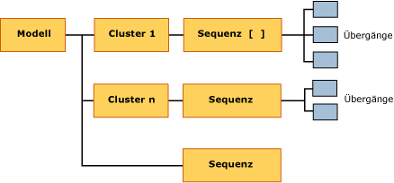

# <a name="mining-model-content-for-sequence-clustering-models"></a>Miningmodellinhalt von Sequence Clustering-Modellen
  In diesem Thema wird der Miningmodellinhalt beschrieben, der Modellen eigen ist, die den Microsoft Sequence Clustering-Algorithmus verwenden. Eine Erklärung der auf die Miningmodellinhalte bezogenen allgemeinen und statistischen Terminologie, die für alle Modelltypen gilt, finden Sie unter [Miningmodellinhalt &#40;Analysis Services – Data Mining&#41;](../../analysis-services/data-mining/mining-model-content-analysis-services-data-mining.md).  
  
## <a name="understanding-the-structure-of-a-sequence-clustering-model"></a>Grundlegendes zur Struktur von Sequence Clustering-Modellen  
 Ein Sequence Clustering-Modell verfügt über einen einzigen übergeordneten Knoten (NOTE_TYPE = 1), der das Modell und die zugehörigen Metadaten darstellt. Der übergeordnete Knoten mit der Bezeichnung **(Alle)**verfügt über einen verknüpften Sequenzknoten (NODE_TYPE = 13), der alle Übergänge auflistet, die in den Trainingsdaten erkannt wurden.  
  
   
  
 Der Algorithmus erstellt darüber hinaus diverse Cluster. Dies basiert auf den Übergängen, die in den Daten und allen anderen Eingabeattributen gefunden wurden, die bei der Erstellung des Modells enthalten waren. Ein Beispiel hierfür sind die demografischen Kundendaten usw. Jeder Cluster (NODE_TYPE = 5) enthält seinen eigenen Sequenzknoten (NODE_TYPE = 13), der nur die Übergänge auflistet, die verwendet wurden, um diesen spezifischen Cluster zu erstellen. Vom Sequenzknoten aus können Sie ein Drilldown zu den Details über die einzelnen Statusübergänge vornehmen (NODE_TYPE = 14).  
  
 Eine Erklärung zu Sequenz- und Statusübergängen finden Sie unter [Microsoft Sequence Clustering Algorithm](../../analysis-services/data-mining/microsoft-sequence-clustering-algorithm.md).  
  
## <a name="model-content-for-a-sequence-clustering-model"></a>Modellinhalt eines Sequence Clustering-Modells  
 In diesem Abschnitt werden zusätzliche Informationen über diejenigen Spalten des Miningmodellinhalts erläutert, die für das Sequence Clustering relevant sind.  
  
 MODEL_CATALOG  
 Name der Datenbank, in der das Modell gespeichert wird.  
  
 MODEL_NAME  
 Name des Modells.  
  
 ATTRIBUTE_NAME  
 Immer leer.  
  
 NODE_NAME  
 Der Name des Knotens. Aktuell der gleiche Wert wie NODE_UNIQUE_NAME.  
  
 NODE_UNIQUE_NAME  
 Der eindeutige Name des Knotens.  
  
 NODE_TYPE  
 Ein Sequence Clustering-Modell gibt die folgenden Knotentypen aus:  
  
|Knotentyp-ID|Description|  
|------------------|-----------------|  
|1 (Model)|Stammknoten für das Modell|  
|5 (Cluster)|Enthält die Anzahl der im Cluster enthaltenen Übergänge, eine Liste der Attribute und die Statistik, die die Werte im Cluster beschreibt.|  
|13 (Sequenz)|Enthält eine Liste von im Cluster enthaltenen Übergängen.|  
|14 (Übergang)|Beschreibt eine Ereignissequenz in einer Tabelle, in der die erste Reihe den Startzustand enthält und alle anderen aufeinanderfolgende Zustände zusammen mit der Unterstützungs- und Wahrscheinlichkeitsstatistik enthalten.|  
  
 NODE_GUID  
 Leer.  
  
 NODE_CAPTION  
 Eine Bezeichnung oder Beschriftung, die dem Knoten zu Anzeigezwecken zugeordnet ist.  
  
 Sie können während der Verwendung des Modells die Clusterbeschriftungen umbenennen. Allerdings wird der neue Name nicht persistent gespeichert, wenn das Modell geschlossen wird.  
  
 CHILDREN_CARDINALITY  
 Eine Schätzung der Anzahl untergeordneter Elemente des Knotens.  
  
 **Modellstamm** Kardinalitätswert, der der Anzahl der Cluster plus 1 entspricht. Weitere Informationen finden Sie unter [Kardinalität](#bkmk_cardinality).  
  
 **Clusterknoten** Kardinalität beträgt immer 1, da jeder Cluster über einen einzelnen untergeordneten Knoten verfügt, der die Liste der Sequenzen im Cluster enthält.  
  
 **Sequenzknoten** Kardinalität gibt die Anzahl von Übergängen an, die in diesem Cluster enthalten sind. Beispielsweise gibt die Kardinalität des Sequenzknotens für den Modellstamm Aufschluss darüber, wie viele Übergänge im gesamten Modell gefunden wurden.  
  
 PARENT_UNIQUE_NAME  
 Der eindeutige Name des dem Knoten übergeordneten Elements.  
  
 Für Knoten auf der Stammebene wird NULL zurückgegeben.  
  
 NODE_DESCRIPTION  
 Wie Knotenbeschriftung.  
  
 NODE_RULE  
 Immer leer.  
  
 MARGINAL_RULE  
 Immer leer.  
  
 NODE_PROBABILITY  
 **Modellstamm** Immer 0.  
  
 **Clusterknoten** Die angepasste Wahrscheinlichkeit des Clusters im Modell. Die angepassten Wahrscheinlichkeiten ergeben als Summe nicht 1, da die beim Sequence Clustering verwendete Clustermethode die partielle Mitgliedschaft in mehreren Clustern erlaubt.  
  
 **Sequenzknoten** Immer 0.  
  
 **Übergangsknoten** Immer 0.  
  
 MARGINAL_PROBABILITY  
 **Modellstamm** Immer 0.  
  
 **Clusterknoten** Der gleiche Wert wie NODE_PROBABILITY.  
  
 **Sequenzknoten** Immer 0.  
  
 **Übergangsknoten** Immer 0.  
  
 NODE_DISTRIBUTION  
 Eine Tabelle, die Wahrscheinlichkeiten und andere Informationen enthält. Weitere Informationen finden Sie unter [NODE_DISTRIBUTION-Tabelle](#bkmk_NODEDIST).  
  
 NODE_SUPPORT  
 Die Anzahl der Übergänge, die diesen Knoten unterstützen. Sind daher 30 Beispiele der Sequenz "Produkt A gefolgt von Produkt B" in den Trainingsdaten vorhanden, ist die Gesamtunterstützung 30.  
  
 **Modellstamm** Gesamtanzahl der Übergänge im Modell.  
  
 **Clusterknoten** Rohunterstützung für den Cluster, d. h. Anzahl der Trainingsfälle, die Fälle zu diesem Cluster beitragen.  
  
 **Sequenzknoten** Immer 0.  
  
 **Übergangsknoten** Prozentzahl der Fälle im Cluster, die einen spezifischen Übergang darstellen. Kann 0 sein oder einen positiven Wert haben. Wird berechnet durch die Rohunterstützung für den Clusterknoten multipliziert mit der Wahrscheinlichkeit des Clusters.  
  
 Dieser Wert gibt Aufschluss darüber, wie viele Trainingsfälle zum Übergang beigetragen haben.  
  
 MSOLAP_MODEL_COLUMN  
 Nicht verfügbar.  
  
 MSOLAP_NODE_SCORE  
 Nicht verfügbar.  
  
 MSOLAP_NODE_SHORT_CAPTION  
 Identisch mit NODE_DESCRIPTION.  
  
## <a name="understanding-sequences-states-and-transitions"></a>Grundlegendes zu Sequenzen, Status und Übergängen  
 Ein Sequence Clustering-Modell verfügt über eine eindeutige Struktur, bei der zwei Arten von Objekten mit sehr unterschiedlichen Typen von Informationen definiert werden: die ersten sind Cluster und die zweiten sind Statusübergänge.  
  
 Die durch das Sequence Clustering erstellten Cluster entsprechen den Clustern, die vom Microsoft Clustering-Algorithmus erstellt werden. Jeder Cluster hat ein Profil und Eigenschaften. Allerdings enthält beim Sequence Clustering jeder Cluster zusätzlich einen einzelnen untergeordneten Knoten, der die Sequenzen in diesem Cluster auflistet. Jeder Sequenzknoten enthält mehrere untergeordnete Knoten, die die Statusübergänge mit den Wahrscheinlichkeiten im Detail beschreiben.  
  
 Es gibt fast immer mehr Sequenzen im Modell als man in einem einzelnen Fall findet, da die Sequenzen miteinander verkettet werden können. Microsoft Analysis Services speichert Zeiger von einem Status zu einem anderen, sodass Sie zählen können, wie oft jeder Übergang auftritt. Darüber hinaus findet man Informationen darüber, wie oft die Sequenz auftritt. Des Weiteren kann man die Wahrscheinlichkeit des Auftretens im Vergleich zum gesamten Satz an beobachteten Status berechnen.  
  
 Die folgende Tabelle fasst zusammen, wie Informationen im Modell gespeichert werden, und wie die Knoten in Beziehung stehen.  
  
|Node|Verfügt über untergeordneten Knoten|NODE_DISTRIBUTION-Tabelle|  
|----------|--------------------|------------------------------|  
|Modellstamm|Mehrere Clusterknoten<br /><br /> Knoten mit Sequenzen für gesamtes Modell|Listet alle Produkte im Modell auf, mit Unterstützung und Wahrscheinlichkeit.<br /><br /> Da die Clustermethode die partielle Mitgliedschaft in mehreren Clustern erlaubt, können Unterstützung und Wahrscheinlichkeit über Bruchzahlen verfügen. Dies bedeutet, dass nicht ein einzelner Fall einmal gezählt wird, sondern jeder Fall potenziell zu mehreren Clustern gehören kann. Daher wird bei der Bestimmung der endgültigen Clustermitgliedschaft der Wert durch die Wahrscheinlichkeit des Clusters angepasst.|  
|Sequenzknoten für Modell|Mehrere Übergangsknoten|Listet alle Produkte im Modell auf, mit Unterstützung und Wahrscheinlichkeit.<br /><br /> Da die Anzahl der Sequenzen für das Modell auf dieser Ebene bekannt ist, sind die Berechnungen für Unterstützung und Wahrscheinlichkeit unkompliziert:<br /><br /> <br /><br /> Unterstützung = Anzahl von Fällen<br /><br /> Wahrscheinlichkeit = interne Wahrscheinlichkeit jeder Sequenz im Modell. Alle Wahrscheinlichkeiten sollten eine Summe von 1 ergeben.|  
|Einzelne Clusterknoten|Knoten mit Sequenzen nur für diesen Cluster|Listet alle Produkte in einem Cluster auf, aber stellt die Unterstützungs- und Wahrscheinlichkeitswerte nur für Produkte bereit, die für den Cluster charakteristisch sind.<br /><br /> Die Unterstützung stellt den angepassten Unterstützungswert für jeden Fall in diesem Cluster dar. Bei den Wahrscheinlichkeitswerten handelt es sich um die angepasste Wahrscheinlichkeit.|  
|Sequenzknoten für einzelne Cluster|Mehrere Knoten mit Übergängen für Sequenzen nur in diesem Cluster|Genau die gleichen Informationen wie in einzelnen Clusterknoten.|  
|Übergange|Keine untergeordneten Elemente|Listet Übergänge für den verwandten ersten Status auf.<br /><br /> Die Unterstützung ist ein angepasster Unterstützungswert, der die Fälle angibt, die an jedem Übergang teilnehmen. Bei der Wahrscheinlichkeit handelt es sich um eine angepasste Wahrscheinlichkeit, die als Prozentzahl angegeben wird.|  
  
###  <a name="bkmk_NODEDIST"></a> NODE_DISTRIBUTION-Tabelle  
 Die NODE_DISTRIBUTION-Tabelle bietet detaillierte Informationen über Wahrscheinlichkeit und Unterstützung für die Übergänge und Sequenzen eines spezifischen Clusters.  
  
 Der Übergangstabelle wird immer eine Zeile hinzugefügt, um mögliche **Missing** -Werte darzustellen. Informationen über die Bedeutung des Werts **Missing** und dessen Auswirkungen auf Berechnungen finden Sie unter [Fehlende Werte &#40;Analysis Services – Data Mining&#41;](../../analysis-services/data-mining/missing-values-analysis-services-data-mining.md).  
  
 Die Berechnungen für Unterstützung und Wahrscheinlichkeit unterscheiden sich in Abhängigkeit davon, ob die Berechnung für die Trainingsfälle oder das fertige Modell gilt. Grund hierfür ist, dass die Standard-Clusteringmethode, Expectation Maximization (EM), davon ausgeht, dass jeder Fall zu mehr als einem Cluster gehören kann. Bei der Berechnung der Unterstützung für Fälle im Modell können unformatierte Zähler und interne Wahrscheinlichkeiten verwendet werden. Allerdings müssen die Wahrscheinlichkeiten für jede Sequenz in einem Cluster durch die Summe aller möglichen Sequenz- und Clusterkombinationen gewichtet werden.  
  
###  <a name="bkmk_cardinality"></a> Kardinalität  
 In einem Clustering-Modell sagt die Kardinalität des übergeordneten Knotens üblicherweise aus, wie viele Cluster im Modell vorhanden sind. Allerdings verfügt ein Sequence Clustering-Modell über zwei Arten von Knoten auf der Clusterebene: die eine Art Knoten enthält Cluster, die andere Art Knoten enthält eine Liste der Sequenzen für das Modell insgesamt.  
  
 Um also die Anzahl der Cluster im Modell zu bestimmen, nehmen Sie den Wert von NODE_CARDINALITY für den Knoten (Alle) und ziehen 1 ab. Wenn das Modell zum Beispiel 9 Cluster erstellt hat, ist die Kardinalität des Modellstamms 10. Dies liegt daran, dass das Modell 9 Clusterknoten enthält, die jeweils über einen eigenen Sequenzknoten verfügen. Hinzu kommt ein Sequenzknoten mit der Beschriftung 10, der die Sequenzen für das Modell darstellt.  
  
## <a name="walkthrough-of-structure"></a>Exemplarische Vorgehensweise für die Struktur  
 Ein Beispiel kann verdeutlichen, wie die Informationen gespeichert und wie diese interpretiert werden können. Beispielsweise können Sie die längste Auftragsnummer, d. h. die längste beobachtete Kette in den zugrunde liegenden [!INCLUDE[ssSampleDBDWobject](../../includes/sssampledbdwobject-md.md)] -Daten, über die folgende Abfrage ausfindig machen:  
  
```  
USE AdventureWorksDW2012  
SELECT DISTINCT OrderNumber, Count(*)  
FROM vAssocSeqLineItems  
GROUP BY OrderNumber  
ORDER BY Count(*) DESC  
```  
  
 Aus diesen Ergebnissen ergibt sich, dass die Auftragsnummern "SO72656", "SO58845" und "SO70714" mit jeweils acht die längsten Sequenzen enthalten. Mithilfe von Bestellungs-IDs können Sie die Details einer bestimmten Bestellung einsehen, um festzustellen, welche Artikel in welcher Bestellung gekauft wurden.  
  
|OrderNumber|LineNumber|Model|  
|-----------------|----------------|-----------|  
|SO58845|1|Mountain-500|  
|SO58845|2|LL Mountain Tire|  
|SO58845|3|Mountain Tire Tube|  
|SO58845|4|Fender Set – Mountain|  
|SO58845|5|Mountain Bottle Cage|  
|SO58845|6|Water Bottle|  
|SO58845|7|Sport-100|  
|SO58845|8|Long-Sleeve Logo Jersey|  
  
 Aber einige Kunden, die den Mountain-500 kaufen, könnten andere Produkte kaufen. Sie können alle Produkte, die dem Mountain-500 folgen, einsehen, indem Sie auf die Liste der Sequenzen im Modell zugreifen. Die folgenden Prozeduren führen Sie schrittweise durch die Vorgehensweise beim Ansehen dieser Sequenzen über die beiden Viewer, die in [!INCLUDE[ssASnoversion](../../includes/ssasnoversion-md.md)]bereitgestellt werden:  
  
#### <a name="to-view-related-sequences-by-using-the-sequence-clustering-viewer"></a>So zeigen Sie verwandte Sequenzen mit dem Sequence Clustering-Viewer an  
  
1.  Klicken Sie im Object Explorer mit der rechten Maustaste auf das [Sequence Clustering]-Modell, und wählen Sie "Durchsuchen" aus.  
  
2.  Klicken Sie im Sequence Clustering-Viewer auf die Registerkarte **Statusübergänge** .  
  
3.  Stellen Sie in der Dropdownliste **Cluster** sicher, dass **Auffüllung (Alle)** ausgewählt ist.  
  
4.  Bewegen Sie den Schieberegler im linken Bereich ganz nach oben, um alle Links anzeigen zu lassen.  
  
5.  Suchen Sie im Diagramm **Mountain-500**, und klicken Sie im Diagramm auf den Knoten.  
  
6.  Die hervorgehobenen Zeilen weisen auf den nächsten Status (die Produkte, die nach dem Mountain-500 erworben wurden) und die Zahlen auf die Wahrscheinlichkeit hin. Vergleichen Sie diese im Viewer für generische Modellinhalte mit den Ergebnissen.  
  
#### <a name="to-view-related-sequences-by-using-the-generic-model-content-viewer"></a>So zeigen Sie verwandte Sequenzen mit dem Viewer für generische Modellinhalte an  
  
1.  Klicken Sie im Object Explorer mit der rechten Maustaste auf das [Sequence Clustering]-Modell, und wählen Sie "Durchsuchen" aus.  
  
2.  Wählen Sie **Microsoft Generic Content Tree-Viewer**aus der Dropdownliste der Viewer aus.  
  
3.  Klicken Sie im Bereich **Knotenbeschriftung** auf den Knoten mit dem Namen **Sequenzebene für Cluster 16**.  
  
4.  Suchen Sie im Bereich Knotendetails die Zeile NODE_DISTRIBUTION, und klicken Sie in der geschachtelten Tabelle auf eine beliebige Stelle.  
  
     Die obere Zeile ist immer für den Missing-Wert reserviert. Diese Zeile ist der Sequenzstatus 0.  
  
5.  Drücken Sie auf die NACH-UNTEN-TASTE, oder verwenden Sie die Bildlaufleisten, um in der geschachtelten Tabelle einen Bildlauf nach unten durchzuführen, bis die Zeile "Mountain-500" angezeigt wird.  
  
     Diese Zeile ist der Sequenzstatus 20.  
  
    > [!NOTE]  
    >  Die Zeilennummer für einen bestimmten Sequenzstatus kann programmgesteuert abgerufen werden. Wenn Sie lediglich durchsuchen möchten, kann es einfacher sein, die geschachtelte Tabelle in eine Excel-Arbeitsmappe zu kopieren.  
  
6.  Kehren Sie zum Bereich Knotenbeschriftung zurück, und erweitern Sie den Knoten **Sequenzebene für Cluster 16**, wenn dieser nicht bereits erweitert ist.  
  
7.  Suchen Sie unter seinen untergeordneten Knoten nach **Übergangszeile für Sequenzstatus 20**. Klicken Sie auf den Übergangsknoten.  
  
8.  Die geschachtelte NODE_DISTRIBUTION-Tabelle enthält die folgenden Produkte und Wahrscheinlichkeiten. Vergleichen Sie diese mit den Ergebnissen auf der Registerkarte **Statusübergang** des Sequence Clustering-Viewers.  
  
 Die folgende Tabelle zeigt die Ergebnisse aus der NODE_DISTRIBUTION-Tabelle und die gerundeten Wahrscheinlichkeitswerte, die im grafischen Viewer angezeigt werden.  
  
|Product|Unterstützung (NODE_DISTRIBUTION-Tabelle)|Wahrscheinlichkeit (NODE_DISTRIBUTION-Tabelle)|Wahrscheinlichkeit (aus Diagramm)|  
|-------------|------------------------------------------|------------------------------------------------|--------------------------------|  
|Missing|48.447887|0.138028169|(nicht angezeigt)|  
|Cycling Cap|10.876056|0.030985915|0.03|  
|Fender Set – Mountain|80.087324|0.228169014|0.23|  
|Half-Finger Gloves|0.9887324|0.002816901|0.00|  
|Hydration Pack|0.9887324|0.002816901|0.00|  
|LL Mountain Tire|51.414085|0.146478873|0.15|  
|Long-Sleeve Logo Jersey|2.9661972|0.008450704|0.01|  
|Mountain Bottle Cage|87.997183|0.250704225|0.25|  
|Mountain Tire Tube|16.808451|0.047887324|0.05|  
|Short-Sleeve Classic Jersey|10.876056|0.030985915|0.03|  
|Sport-100|20.76338|0.05915493|0.06|  
|Water Bottle|18.785915|0.053521127|0.25|  
  
 Obwohl der Fall, den wir anfangs aus den Trainingsdaten ausgewählt hatten, das Produkt "Mountain-500" gefolgt von "LL Mountain Tire" enthielt, sieht man, dass es viele weitere mögliche Sequenzen gibt. Um detaillierte Informationen über jeden Cluster zu finden, müssen Sie den Vorgang des Drilldowns aus der Liste der Sequenzen im Cluster auf die tatsächlichen Übergänge für jeden Status oder jedes Produkt wiederholen.  
  
 Sie können von der in einem bestimmten Cluster aufgelisteten Sequenz zur Übergangszeile springen. Von dieser Übergangszeile aus können Sie bestimmen, welches Produkt danach folgt, und zu diesem Produkt in der Liste der Sequenzen zurückkehren. Durch die Wiederholung dieses Prozesses für jeden ersten und zweiten Status können Sie sich durch lange Statusketten arbeiten.  
  
## <a name="using-sequence-information"></a>Verwenden von Sequenzinformationen  
 Ein übliches Szenario für Sequence Clustering ist die Nachverfolgung von Benutzeraufrufen einer Website. Rühren die Daten beispielsweise aus Datensätzen über Kundenkäufe auf der E-Commerce-Website von Adventure Works her, könnte das resultierende Sequence Clustering-Modell genutzt werden, um Benutzerverhalten abzuleiten, die E-Commerce-Website zur Lösung von Navigationsproblemen neu zu gestalten oder Produkte zu bewerben.  
  
 Beispielsweise könnte die Analyse aufzeigen, dass Benutzer unabhängig von den demografischen Daten immer eine bestimmte Produktreihe verfolgen. Darüber hinaus könnten Sie herausfinden, dass die Benutzer häufig die Website verlassen, nachdem sie auf ein bestimmtes Produkt geklickt haben. Anhand dieser Ergebnisse könnten Sie über zusätzliche Maßnahmen nachdenken, mit denen Benutzer auf Ihrer Website gehalten werden.  
  
 Wenn Sie über keine zusätzlichen Informationen verfügen, die zur Klassifizierung Ihrer Benutzer herangezogen werden könnten, können Sie die Sequenzinformationen nutzen, um Daten über die Navigation zu sammeln und so ein besseres Verständnis über das Gesamtverhalten zu erhalten. Wenn Sie allerdings Informationen über Kunden sammeln und diese Informationen mit Ihrer Kundendatenbank abgleichen können, sind Sie in der Lage, das Clustering mit der Vorhersage über Sequenzen zu kombinieren, um Empfehlungen zu erstellen, die auf den Benutzer zugeschnitten sind oder auf dem Navigationspfad zur aktuellen Seite basieren.  
  
 Eine weitere Verwendungsmöglichkeit der umfangreichen Status- und Übergangsinformationen, die von einem Sequence Clustering-Modell zusammengestellt werden, ist es, herauszufinden, welche möglichen Pfade nie genutzt werden. Wenn die Seiten 1–4 beispielsweise sehr viele Besucher aufweisen, die allerdings nicht auf Seite 5 gelangen, könnten Sie prüfen, ob Probleme vorliegen, die eine Navigation auf die Seite 5 verhindern. Dies können Sie über die Abfrage des Modellinhalts und dessen Vergleich mit einer Liste der möglichen Pfade erreichen.  Diagramme, die Aufschluss über alle Navigationspfade auf einer Website geben, können programmgesteuert oder mithilfe diverser Website-Analysetools erstellt werden.  
  
 Informationen darüber, wie Sie eine Liste der beobachteten Pfade durch die Abfrage des Modellinhalts erhalten, und weitere Beispiele für Abfragen eines Sequence Clustering-Modells finden Sie unter [Abfragebeispiele für Sequenzclusteringmodelle](../../analysis-services/data-mining/sequence-clustering-model-query-examples.md).  
  
## <a name="see-also"></a>Siehe auch  
 [Miningmodellinhalt &#40;Analysis Services – Data Mining&#41;](../../analysis-services/data-mining/mining-model-content-analysis-services-data-mining.md)   
 [Microsoft Sequence Clustering Algorithm](../../analysis-services/data-mining/microsoft-sequence-clustering-algorithm.md)   
 [Sequenzclusteringmodellabfragebeispiele](../../analysis-services/data-mining/sequence-clustering-model-query-examples.md)  
  
  

