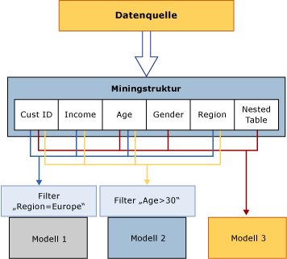

# Miningstrukturen (Analysis Services - Data Mining)
[!INCLUDE[ssas-appliesto-sqlas](../../includes/ssas-appliesto-sqlas.md)]
  In der Miningstruktur werden die Daten definiert, aus denen Miningmodelle erstellt werden. Es werden die Quelldatensicht, die Anzahl und der Typ von Spalten sowie eine optionale Partitionierung in Trainings- und Testsätze angegeben. Eine einzelne Miningstruktur kann mehrere Miningmodelle unterstützen, die die gleiche Domäne verwenden. In der folgenden Abbildung ist die Beziehung der Data Mining-Struktur zur Datenquelle und zu den dazugehörigen Data Mining-Modellen dargestellt.  
  
   
  
 Die Miningstruktur in der Abbildung basiert auf einer Datenquelle, die mehrere Tabellen oder Sichten enthält, die über das Feld CustomerID verknüpft sind. Eine Tabelle enthält Informationen zu Kunden, wie geografische Region, Alter, Einkommen und Geschlecht, während die dazugehörige geschachtelte Tabelle mehrere Zeilen mit Zusatzinformationen zu den einzelnen Kunden enthält, z. B. vom Kunden gekaufte Produkte. Die Abbildung zeigt, dass mehrere Modelle für eine Miningstruktur erstellt werden können und dass die Modelle unterschiedliche Spalten der Struktur verwenden können.  
  
 **Modell 1** Verwendet CustomerID, Einkommen, Alter, Region und filtert die Daten nach der Region.  
  
 **Modell 2** Verwendet CustomerID, Einkommen, Alter, Region und filtert die Daten nach dem Alter.  
  
 **Model 3** Verwendet CustomerID, Alter, Geschlecht und die geschachtelte Tabelle ohne Filter.  
  
 Da die Modelle unterschiedliche Spalten als Eingabe verwenden und zwei Modelle die im Modell verwendeten Daten mithilfe von Filtern zusätzlich beschränken, können die Modelle stark unterschiedliche Ergebnisse aufweisen, obwohl sie auf denselben Daten basieren. Beachten Sie, dass die Spalte CustomerID in allen Modellen erforderlich ist, da es sich um die einzige Spalte handelt, die als Fallschlüssel verwendet werden kann.  
  
 In diesem Abschnitt wird die grundlegende Architektur der Data Mining-Strukturen erläutert, z. B., wie Sie eine Miningstruktur definieren, die Struktur mit Daten auffüllen und diese für die Modellerstellung einsetzen. Weitere Informationen zum Verwalten oder Exportieren vorhandener Data Mining-Strukturen finden Sie unter [Verwaltung von Data Mining-Lösungen und -Objekten](../../analysis-services/data-mining/management-of-data-mining-solutions-and-objects.md).  
  
## Definieren einer Miningstruktur  
 Zum Einrichten einer Data Mining-Struktur müssen folgende Schritte ausgeführt werden:  
  
-   Definieren Sie eine Datenquelle.  
  
-   Wählen Sie Datenspalten aus, die in die Struktur aufgenommen werden sollen (nicht alle Spalten müssen dem Modell hinzugefügt werden), und definieren Sie einen Schlüssel.  
  
-   Definieren Sie einen Schlüssel für die Struktur, einschließlich des Schlüssels für die geschachtelte Tabelle (sofern vorhanden).  
  
-   Geben Sie an, ob die Quelldaten in einen Trainings- und einen Testsatz unterteilt werden sollen. Dies ist ein optionaler Schritt.  
  
-   Verarbeiten Sie die Struktur.  
  
 Diese Schritte werden in den folgenden Abschnitten ausführlicher beschrieben.  
  
### Datenquellen für Miningstrukturen  
 Beim Definieren einer Miningstruktur können Sie Spalten verwenden, die in einer vorhandenen Datenquellensicht verfügbar sind. Eine Datenquellensicht ist ein freigegebenes Objekt, mit dem Sie mehrere Datenquellen kombinieren und als einzelne Quelle verwenden können. Die ursprünglichen Datenquellen sind für Clientanwendungen nicht sichtbar, und Sie können die Eigenschaften der Datenquellensicht verwenden, um Datentypen zu ändern und um Aggregationen oder Aliase für Spalten zu erstellen.  
  
 Wenn Sie mehrere Miningmodelle aus derselben Miningstruktur erstellen, können in den Modellen unterschiedliche Spalten aus der Struktur verwendet werden. Sie können z. B. eine einzelne Struktur erstellen und dann auf deren Grundlage separate Entscheidungsstruktur- und Clusteringmodelle erstellen, wobei in jedem Modell unterschiedliche Spalten verwendet und verschiedene Attribute vorhergesagt werden.  
  
 Darüber hinaus kann jedes Modell die Spalten der Struktur auf unterschiedliche Weise verwenden. Die Datenquellensicht könnte z. B. eine Spalte "Einkommen"enthalten, die Sie je nach Modell auf unterschiedliche Weise speichern können.  
  
 Die Data Mining-Struktur speichert die Definition der Datenquelle und die darin enthaltenen Spalten in Form von *Bindungen* mit der Datenquelle. Weitere Informationen zu Datenquellenbindungen finden Sie unter [Datenquellen und Bindungen &#40;SSAS – mehrdimensional&#41;](../../analysis-services/multidimensional-models/data-sources-and-bindings-ssas-multidimensional.md). Sie können eine Data Mining-Struktur auch erstellen, ohne diese an eine bestimmte Datenquelle zu binden, indem Sie die DMX-Anweisung [CREATE MINING STRUCTURE &#40;DMX&#41;](../../dmx/create-mining-structure-dmx.md) verwenden.  
  
### Miningstrukturspalten  
 Die Grundbausteine der Miningstruktur sind die Miningstrukturspalten, die die in der Datenquelle enthaltenen Daten beschreiben. Diese Spalten enthalten Informationen, z. B. über den Datentyp, den Inhaltstyp und die Verteilung der Daten. In der Miningstruktur sind keine Informationen über die Verwendung der Spalten für bestimmte Miningmodelle enthalten, und auch keine Informationen über den Algorithmustyp, der zum Erstellen eines Modells verwendet wird. Diese Informationen werden im Miningmodell selbst definiert.  
  
 Eine Miningstruktur kann auch geschachtelte Tabellen enthalten. Eine geschachtelte Tabelle stellt eine 1:n-Beziehung zwischen der Entität eines Falls und der damit verknüpften Attribute dar. Bei Informationen beispielsweise, die beschreiben, dass sich ein Kunde in einer Tabelle und die Einkäufe des Kunden in einer anderen Tabelle befinden, können Sie geschachtelte Tabellen verwenden, um die Informationen in einem einzelnen Fall zu kombinieren. Der Kundenbezeichner ist die Entität, und die Einkäufe sind die verknüpften Attribute. Weitere Informationen dazu, wann die Verwendung geschachtelter Tabellen empfehlenswert ist, finden Sie unter [Geschachtelte Tabellen &#40;Analysis Services – Data Mining&#41;](../../analysis-services/data-mining/nested-tables-analysis-services-data-mining.md).  
  
 Um in [!INCLUDE[ssBIDevStudioFull](../../includes/ssbidevstudiofull-md.md)]ein Data Mining-Modell zu erstellen, müssen Sie zuerst eine Data Mining-Struktur erstellen. Der Data Mining-Assistent führt Sie durch die Erstellung einer Data Mining-Struktur, die Datenauswahl und das Hinzufügen eines Miningmodells.  
  
 Wenn Sie mithilfe der Data Mining-Erweiterungen (DMX) ein Miningmodell erstellen, können Sie das Modell und die darin enthaltenen Spalten angeben. DMX erstellt dann automatisch die erforderliche Data Mining-Struktur. Weitere Informationen finden Sie unter [CREATE MINING MODEL &#40;DMX&#41;](../../dmx/create-mining-model-dmx.md).  
  
 Weitere Informationen finden Sie unter [Mining Structure Columns](../../analysis-services/data-mining/mining-structure-columns.md).  
  
### Unterteilen der Daten in einen Trainings- und Testsatz  
 Wenn Sie die Daten für die Miningstruktur definieren, können Sie auch angeben, dass einige Daten für Trainings- und andere für Testzwecke verwendet werden sollen. Daher ist es nicht mehr erforderlich, die Daten vor der Erstellung einer Data Mining-Struktur zu unterteilen. Während Sie das Modell erstellen, können Sie stattdessen angeben, dass ein bestimmter Prozentsatz der Daten für Testzwecke zurückgehalten und der Rest zum Training verwendet werden soll, oder Sie können eine bestimmte Anzahl von Fällen als Testdataset angeben. Die Informationen zu den Trainings- und Testdatasets werden mit der Miningstruktur zwischengespeichert. Folglich kann derselbe Testsatz für alle Modelle verwendet werden, die auf dieser Struktur basieren.  
  
 Weitere Informationen finden Sie unter [Training and Testing Data Sets](../../analysis-services/data-mining/training-and-testing-data-sets.md).  
  
### Aktivieren von Drillthrough  
 Sie können der Miningstruktur Spalten hinzufügen, auch wenn Sie nicht beabsichtigen, die betreffenden Spalten in einem bestimmten Miningmodell zu verwenden. Dies ist beispielsweise hilfreich, wenn Sie die E-Mail-Adressen von Kunden in einem Clustermodell abrufen möchten, ohne die E-Mail-Adresse in der Analyse zu verwenden. Um eine Spalte während der Analyse- und Vorhersagephase zu ignorieren, fügen Sie sie der Struktur hinzu, ohne jedoch das Verwendungsflag für die Spalte anzugeben. Alternativ können Sie das Verwendungsflag auf Ignorieren festlegen. Auf diese Weise gekennzeichnete Daten können weiterhin in Abfragen verwendet werden, wenn Drillthroughs für das Miningmodell aktiviert wurden und wenn Sie über die entsprechenden Berechtigungen verfügen. Beispielsweise können Sie die Cluster überprüfen, die sich aus der Analyse aller Kunden ergeben, und dann eine Drillthroughabfrage ausführen, um die Namen und E-Mail-Adressen der in einem bestimmten Cluster enthaltenen Kunden abzurufen. Dies ist möglich, obwohl diese Datenspalten nicht für die Modellerstellung verwendet wurden.  
  
 Weitere Informationen finden Sie unter [Drillthroughabfragen &#40;Data Mining&#41;](../../analysis-services/data-mining/drillthrough-queries-data-mining.md).  
  
### Verarbeiten von Miningstrukturen  
 Eine Miningstruktur ist bis zu ihrer Verarbeitung lediglich ein Metadatencontainer. Beim Verarbeiten einer Miningstruktur erstellt [!INCLUDE[ssASnoversion](../../includes/ssasnoversion-md.md)] einen Cache, in dem statistische Informationen zu den Daten, Informationen zur Diskretisierung kontinuierlicher Attribute sowie weitere Informationen gespeichert werden, die später von Miningmodellen verwendet werden. Diese Zusammenfassungsinformationen werden im Miningmodell selbst nicht gespeichert, stattdessen verweist es auf die Informationen, die bei der Verarbeitung der Miningstruktur zwischengespeichert wurden. Sie müssen die Struktur folglich nicht jedes Mal neu verarbeiten, wenn Sie einer vorhandenen Struktur ein neues Modell hinzufügen; stattdessen können Sie einfach das Modell verarbeiten.  
  
 Sie können sich dazu entschließen, den Inhalt dieses Caches nach der Verarbeitung zu verwerfen, wenn der Cache sehr groß ist oder Sie detaillierte Daten entfernen möchten. Wenn keine Daten zwischengespeichert werden sollen, können Sie die **CacheMode** -Eigenschaft der Miningstruktur in **ClearAfterProcessing**ändern. Der Cache wird dann gelöscht, nachdem alle Modelle verarbeitet wurden. Wenn Sie die **CacheMode** -Eigenschaft auf **ClearAfterProcessing** setzen, wird der Drillthrough des Miningmodells deaktiviert.  
  
 Nachdem Sie den Cache gelöscht haben, können Sie der Miningstruktur jedoch keine neuen Modelle mehr hinzuzufügen. Wenn Sie der Struktur ein neues Miningmodell hinzufügen oder die Eigenschaften vorhandener Modelle ändern, müsste die Miningstruktur zuerst erneut verarbeitet werden. Weitere Informationen finden Sie unter [Anforderungen und Überlegungen zur Verarbeitung &#40;Data Mining&#41;](../../analysis-services/data-mining/processing-requirements-and-considerations-data-mining.md).  
  
### Anzeigen von Miningstrukturen  
 Sie können keine Viewer verwenden, um die Daten in einer Miningstruktur zu durchsuchen. In [!INCLUDE[ssBIDevStudioFull](../../includes/ssbidevstudiofull-md.md)]können Sie allerdings die Registerkarte **Miningstruktur** im Data Mining-Designer verwenden, um die Strukturspalten und deren Definitionen anzuzeigen. Weitere Informationen finden Sie unter [Data Mining Designer](../../analysis-services/data-mining/data-mining-designer.md).  
  
 Wenn Sie die Daten in der Miningstruktur überprüfen möchten, können Sie mithilfe der Data Mining-Erweiterungen (DMX) Abfragen erstellen. So gibt zum Beispiel die Anweisung `SELECT * FROM <structure>.CASES` alle Daten in der Miningstruktur zurück. Zum Abrufen dieser Informationen muss die Miningstruktur verarbeitet und die Ergebnisse der Verarbeitung müssen zwischengespeichert worden sein.  
  
 Die Anweisung `SELECT * FROM <model>.CASES` gibt die gleichen Spalten zurück, aber nur für die Fälle in dem betreffenden Modell. Weitere Informationen finden Sie unter [SELECT FROM &#60;structure&#62;.CASES](../../dmx/select-from-structure-cases.md) und [SELECT FROM &#60;model&#62;.CASES &#40;DMX&#41;](../../dmx/select-from-model-cases-dmx.md).  
  
## Verwenden von Data Mining-Modellen mit Miningstrukturen  
 Ein Data Mining-Modell wendet einen Miningmodellalgorithmus für die Daten an, welcher durch eine Miningstruktur dargestellt wird. Ein Miningmodell ist ein Objekt, das einer bestimmten Miningstruktur angehört. Es erbt alle Werte der durch die Miningstruktur definierten Eigenschaften. Das Modell kann alle Spalten aus der Miningstruktur oder nur eine Teilmenge der Spalten verwenden. Sie können einer Struktur mehrere Kopien einer Strukturspalte hinzufügen. Außerdem können Sie einem Modell mehrere Kopien einer Strukturspalte hinzufügen und dann den einzelnen Strukturspalten im Modell verschiedene Namen, so genannte *Aliase*, zuweisen. Weitere Informationen zu Alias von Strukturspalten finden Sie unter [Erstellen eines Alias für eine Modellspalte](../../analysis-services/data-mining/create-an-alias-for-a-model-column.md) und [Miningmodelleigenschaften](../../analysis-services/data-mining/mining-model-properties.md).  
  
 Weitere Informationen zur Architektur von Data Mining-Modellen finden Sie unter [Miningmodelle &#40;Analysis Services – Data Mining&#41;](../../analysis-services/data-mining/mining-models-analysis-services-data-mining.md).  
  
## Verwandte Aufgaben  
 Verwenden Sie die im Folgenden angegebenen Links, um weitere Informationen zum Definieren, Verwalten und Verwenden von Miningstrukturen zu erhalten.  
  
|Aufgaben|Links|  
|-----------|-----------|  
|Arbeiten mit relationalen Miningstrukturen|[Erstellen einer neuen relationalen Miningstruktur](../../analysis-services/data-mining/create-a-new-relational-mining-structure.md)   [Hinzufügen einer geschachtelten Tabelle zu einer Miningstruktur](../../analysis-services/data-mining/add-a-nested-table-to-a-mining-structure.md)|  
|Arbeiten mit Miningstrukturen, die auf Cubes basieren|[Erstellen einer neuen OLAP-Miningstruktur](../../analysis-services/data-mining/create-a-new-olap-mining-structure.md)|  
|Arbeiten mit Spalten in einer Miningstruktur|[Hinzufügen von Spalten zu einer Miningstruktur](../../analysis-services/data-mining/add-columns-to-a-mining-structure.md)   [Entfernen von Spalten aus einer Miningstruktur](../../analysis-services/data-mining/remove-columns-from-a-mining-structure.md)|  
|Ändern oder Abfragen von Eigenschaften und Daten einer Miningstruktur|[Ändern der Eigenschaften einer Miningstruktur](../../analysis-services/data-mining/change-the-properties-of-a-mining-structure.md)|  
|Arbeiten mit den zugrunde liegenden Datenquellen und Aktualisieren von Quelldaten|[Bearbeiten Sie die für eine Miningstruktur verwendeten Datenquellensicht](../../analysis-services/data-mining/edit-the-data-source-view-used-for-a-mining-structure.md)   [Verarbeiten einer Miningstruktur](../../analysis-services/data-mining/process-a-mining-structure.md)|  
  
## Siehe auch  
 [Datenbankobjekte &#40;Analysis Services – Mehrdimensionale Daten&#41;](../../analysis-services/multidimensional-models/olap-logical/database-objects-analysis-services-multidimensional-data.md)   
 [Miningmodelle & #40; Analysis Services – Datamining & #41;](../../analysis-services/data-mining/mining-models-analysis-services-data-mining.md)  
  
  
