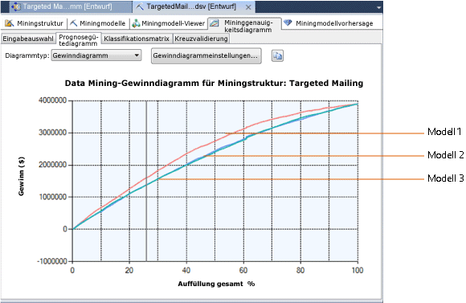

# Gewinndiagramm (Analysis Services – Data Mining)
  Ein Gewinndiagramm zeigt die geschätzte Gewinnsteigerung an, die sich aus der Verwendung eines Miningmodells ergibt. Beispielsweise kann mit dem Modell vorhergesagt werden, welche Kunden ein Unternehmen in einem bestimmten Geschäftsszenario gezielt ansprechen sollte. In diesem Fall würden Sie dem Gewinndiagramm Informationen hinzufügen, wie hoch die Kosten einer solchen zielgerichteten Mailingkampagne sind. Das fertige Diagramm enthält die geschätzte Gewinnsteigerung, die darauf basiert, dass die Kunden gezielt und nicht nach dem Zufallsprinzip angesprochen werden.  
  
## Erstellen eines Gewinndiagramms  
 Ein Gewinndiagramm ist mit einem Prognosegütediagramm vergleichbar. Zunächst erstellen Sie ein Prognosegütediagramm und fügen dann die Kosten- und Gewinninformationen hinzu.  
  
 Um ein Gewinndiagramm erstellen zu können, müssen Sie bereits über ein vorhandenes Modell verfügen.  
  
 In diesem Beispiel verwenden wir das Entscheidungsstrukturmodell für zielgerichtete Mailings ("Targeted Mailing"). Das Modell ermittelt die Kunden, die mit höherer Wahrscheinlichkeit ein Fahrrad kaufen werden. Sie können das **Gewinndiagramm** verwenden, um die Anzahl der Kunden zu ermitteln, die mit dem Ziel der Gewinnmaximierung selektiv angesprochen werden sollten.  
  
 Wenn Sie noch kein Beispielmodell haben, können Sie es mithilfe von [Basic Data Mining Tutorial](http://msdn.microsoft.com/library/6602edb6-d160-43fb-83c8-9df5dddfeb9c)erstellen.  
  
1.  Öffnen Sie den Generator für Mininggenauigkeitsdiagramme.  
  
    -   Klicken Sie in SQL Server Management Studio mit der rechten Maustaste auf das Modell, und wählen Sie **Prognosegütediagramm anzeigen**aus.  
  
    -   Öffnen Sie in SQL Server Data Tools das Projekt, in dem Sie das Modell erstellt haben, und klicken Sie auf die Registerkarte **Mininggenauigkeitsdiagramm** .  
  
2.  Wählen Sie auf der Registerkarte **Eingabeauswahl** erst das Modell und dann den vorhersagbaren Attributwert aus.  
  
     In diesem Szenario interessieren Sie sich ausschließlich für die Gewinnsteigerung, die sich aus einem präzise vorhergesagten Wert ergibt, und zwar [Bike Buyer] =1.  
  
     In anderen Szenarien könnte es aber auch interessant sein, falsche Werte (negative Kosten) präzise vorherzusagen. Falsch-positive Werte bei einem medizinischen Diagnosetest können beispielsweise erhebliche Kosten verursachen. Diese müssen bei der Schätzung der Gewinnsteigerung genauso wie die Kosten falsch-negativer Ergebnisse berücksichtigt werden. In einem solchen Szenario würden Sie keinen bestimmten Wert angeben, sondern sämtliche Ergebnisse messen.  
  
3.  Wählen Sie ein Dataset für Testzwecke aus. In diesem Beispiel wählen Sie das Testdataset ("Testing") aus.  
  
4.  Klicken Sie dann auf die Registerkarte **Prognosegütediagramm** .  
  
     Ein Prognosegütediagramm wird automatisch generiert.  
  
5.  Um dieses Diagramm in ein Gewinndiagramm zu ändern, wählen Sie aus der Liste **Diagrammtyp** die Option **Gewinndiagramm** aus.  
  
6.  Sobald Sie ein Gewinndiagramm als Diagrammtyp auswählen, wird automatisch das Dialogfeld **Gewinndiagrammeinstellungen** geöffnet.  
  
     In diesem Dialogfeld können Sie Kosten und Nutzen einer Targeted Mailing-Kampagne angeben. Für das in diesen Beispielen gezeigte Diagramm wurden die folgenden Werte verwendet:  
  
    |Einstellung|Wert|Kommentare|  
    |-------------|-----------|--------------|  
    |**Auffüllung**|20,000|Festlegen des Werts für die gesamte Zielpopulation   Die Datenbank kann zahlreiche Kunden umfassen. Da Sie die Versandkosten jedoch eindämmen möchten, sprechen Sie gezielt die 20.000 Kunden an, bei denen am wahrscheinlichsten mit einer Antwort zu rechnen ist. Sie können diese Liste abrufen, indem Sie eine Vorhersageabfrage ausführen und diese nach den Wahrscheinlichkeitsangaben des Vorhersagemodells sortieren.|  
    |**Feste Kosten**|500|Geben Sie die einmaligen Kosten ein, die mit einer zielgerichteten Mailingkampagne für 20.000 Kunden verbunden sind. Darunter fallen beispielsweise Druckkosten oder der Kostenaufwand für die Vorbereitung der E-Mail-Kampagne.|  
    |**Einzelkosten**|3|Geben Sie die Kosten für die Targeted Mailing-Kampagne pro Einheit ein.   Dieser Betrag wird mit einer Zahl kleiner oder gleich 20.000 multipliziert, je nachdem, wie viele Kunden vom Modell als potenzielle Kunden vorhergesagt werden.|  
    |**Einzelumsatz**|400|Geben Sie einen Wert für die bei einem erfolgreichen Ergebnis zu erwartenden Gewinne oder Einkünfte ein. In diesem Fall wird davon ausgegangen, dass bei Zusendung eines Katalogs Umsätze von durchschnittlich 400 US-Dollar aus dem Kauf von Zubehörteilen und Fahrrädern zu erwarten sind.   Dieser Betrag wird zum Projizieren des Gesamtgewinns bei Fällen mit einer hohen Wahrscheinlichkeit verwendet.|  
  
7.  Nachdem Sie die erforderlichen Parameter festgelegt haben, klicken Sie auf **OK**.  
  
8.  Das Diagramm wird aktualisiert, um die Gewinnkurve anzuzeigen.  
  
## Grundlegendes zum Gewinndiagramm  
 Im Folgenden ist ein auf diesen Parametern basierendes Diagramm dargestellt. Auf der Y-Achse des Diagramms ist der Gewinn dargestellt, während auf der X-Achse der prozentuale Anteil der Kunden dargestellt wird, die im Rahmen der Mailingkampagne gezielt angesprochen wurden.  
  
 Wie hier ersichtlich, kann ein Gewinndiagramm zum Vergleichen mehrerer Modelle verwendet werden, solange alle das gleiche diskrete Attribut vorhersagen.  
  
   
  
 Beachten Sie die graue vertikale Linie im Diagramm. Wenn Sie auf die Linie klicken und sie ziehen, wird in der QuickInfo der Prozentsatz der Zielpopulation angezeigt, der der Kurve an diesem Punkt zugrunde liegt.  
  
 Während Sie die Linie ziehen, wird die **Mininglegende** ebenfalls aktualisiert, um den Prozentwert, eine Gewinnauswertung und die Vorhersagewahrscheinlichkeit für den Populationsprozentsatz an der vertikalen grauen Linie anzuzeigen.  
  
 Wenn Sie anhand dieses Modells beispielsweise ermitteln möchten, an welche Kunden Sie gezielt Werbematerialien schicken sollten, können Sie sich auf 25 % der Population festlegen. Diese 25 % werden nach der Vorhersagewahrscheinlichkeit ausgewählt. Der Bereich unter der Gewinnkurve des Diagramms ist jedoch zwischen 40 und 70 Prozent am größten. Das deutet darauf hin, dass Sie den Gewinn maximieren können, wenn Sie mehr Kunden gezielt ansprechen. Das trifft auch dann zu, wenn insgesamt nur ein kleinerer Gesamtprozentsatz antwortet.  
  
## Speichern von Diagrammen  
 Beim Erstellen eines Genauigkeits- oder Gewinndiagramms werden keine Objekte auf dem Server erstellt. Stattdessen werden Abfragen für ein vorhandenes Modell ausgeführt und die Ergebnisse im Viewer gerendert. Um die Ergebnisse zu speichern, müssen Sie entweder das Diagramm oder die Ergebnisse in Excel bzw. ein anderes Dateiformat kopieren.  
  
## Verwandte Inhalte  
 Die folgenden Themen enthalten weitere Informationen zum Erstellen und Verwenden von Genauigkeitsdiagrammen.  
  
|Thema|Links|  
|------------|-----------|  
|Bietet eine exemplarische Vorgehensweise zum Erstellen eines Prognosegütediagramms für das Targeted Mailing-Modell.|[Lernprogramm zu Data Mining-Grundlagen](http://msdn.microsoft.com/library/6602edb6-d160-43fb-83c8-9df5dddfeb9c)   [Überprüfen der Genauigkeit mit Prognosegütediagrammen &#40;Lernprogramm zu Data Mining-Grundlagen&#41;](http://msdn.microsoft.com/library/822d414b-4a39-473f-80c3-53476e30655a)|  
|Erläutert verwandte Diagrammtypen.|[Prognosegütediagramm &#40;Analysis Services – Data Mining&#41;](../../analysis-services/data-mining/lift-chart-analysis-services-data-mining.md)   [Klassifikationsmatrix &#40;Analysis Services - Data Mining&#41;](../../analysis-services/data-mining/classification-matrix-analysis-services-data-mining.md)   [Punktdiagramm &#40;Analysis Services – Data Mining&#41;](../../analysis-services/data-mining/scatter-plot-analysis-services-data-mining.md)|  
|Beschreibt die Kreuzvalidierung für Miningmodelle und Miningstrukturen.|[Kreuzvalidierung &#40;Analysis Services – Data Mining&#41;](../../analysis-services/data-mining/cross-validation-analysis-services-data-mining.md)|  
|Beschreibt Schritte zum Erstellen von Prognosegütediagrammen und anderen Genauigkeitsdiagrammen.|[Tasks und Anweisungen für Test und Überprüfung &#40;Data Mining&#41;](../../analysis-services/data-mining/testing-and-validation-tasks-and-how-tos-data-mining.md)|  
  
## Siehe auch  
 [Tests und Überprüfung &#40;Data Mining&#41;](../../analysis-services/data-mining/testing-and-validation-data-mining.md)   
 [Überprüfen der Genauigkeit mit Prognosegütediagrammen &#40;Lernprogramm zu Data Mining-Grundlagen&#41;](http://msdn.microsoft.com/library/822d414b-4a39-473f-80c3-53476e30655a)  
  
  

