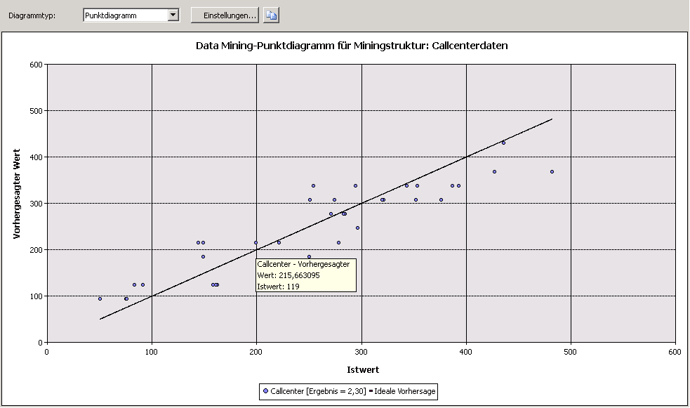

# Punktdiagramm (Analysis Services &amp;ndash; Data Mining)
  Ein *Punktdiagramm* stellt die Istwerte in den Daten im Vergleich zu den vom Modell vorhergesagten Werten grafisch dar. Das Punktdiagramm zeigt die Istwerte auf der X-Achse und die vorhergesagten Werte auf der Y-Achse an. Es wird auch eine Linie dargestellt, die die perfekte Vorhersage darstellt, bei der der vorhergesagte Wert exakt mit dem Istwert übereinstimmt. Der Abstand eines Punkts von dieser Ideallinie (die in einem 45°-Winkel verläuft) gibt an, wie gut oder schlecht die Vorhersage war.  
  
## Grundlegendes zum Punktdiagramm  
 Betrachten Sie beispielsweise ein Modell, in dem die Marketingabteilung den Tagesumsatz anhand der Anzahl von Klicks auf einen Link, der in einer Werbe-E-Mail gesendet wird, vorhersagt. Da die Anzahl der Klicks und die Verkaufsmenge kontinuierliche numerische Werte sind, können Sie die Anzahl der Klicks als unabhängige Variable und die Verkaufsmenge als abhängige Variable grafisch darstellen. Dabei kennzeichnet die gerade Linie die erwartete lineare Beziehung, und die Punkte um diese Linie zeigen, inwieweit die tatsächlichen Daten vom Erwartungswert abweichen. Mit dieser Analyse können Sie unmittelbar erkennen, wie stark ein Ergebnissatz mit einer bestimmten Eingabe korreliert und wie groß die Abweichung vom Idealmodell ist.  
  
## Interpretieren der Ergebnisse  
 Das folgende Diagramm zeigt ein Beispiel für ein Punktdiagramm, das für das zuvor beschriebene Szenario erstellt wurde.  
  
   
  
 Sie können mit der Maus auf jeden Punkt um die Linie zeigen, um die vorhergesagten Werte und die Istwerte als QuickInfo anzuzeigen. Es gibt keine **Mininglegende** für ein Punktdiagramm, das Diagramm selbst enthält jedoch eine Legende, in der die mit dem Modell verbundenen Ergebnisse angezeigt werden. Weitere Informationen zur Interpretation des Ergebnisses finden Sie unter [Miningmodellinhalt von linearen Regressionsmodellen &#40;Analysis Services – Data Mining&#41;](../../analysis-services/data-mining/mining-model-content-for-linear-regression-models-analysis-services-data-mining.md).  
  
 Sie können die visuelle Darstellung des Diagramms in die Zwischenablage kopieren, wobei jedoch nicht die zugrunde liegenden Daten oder die Formel kopiert werden. Wenn Sie die Regressionsformel für die Linie anzeigen möchten, können Sie für das Modell eine Inhaltsabfrage durchführen. Weitere Informationen finden Sie unter [Beispiele für lineare Regressionsmodellabfrage](../../analysis-services/data-mining/linear-regression-model-query-examples.md).  
  
## Einschränkungen bei Punktdiagrammen  
 Ein Punktdiagramm kann nur erstellt werden, wenn das Modell, das Sie auf der Registerkarte **Eingabeauswahl** auswählen, ein kontinuierliches vorhersagbares Attribut enthält. Sie müssen keine zusätzliche Auswahl treffen. Der Diagrammtyp des Punktdiagramms wird automatisch auf der Registerkarte **Prognosegütediagramm** auf Grundlage des Modells und Attributtyps angezeigt.  
  
 Zeitreihenmodelle sagen zwar fortlaufende Nummern vorher, Sie können die Genauigkeit eines Zeitreihenmodells jedoch nicht mit einem Punktdiagramm messen. Sie können hierfür aber andere Methoden verwenden, z. B. das Reservieren eines Teiles der Vergangenheitsdaten. Weitere Informationen finden Sie unter [Abfragebeispiel Zeitreihenmodell](../../analysis-services/data-mining/time-series-model-query-examples.md).  
  
## Verwandte Inhalte  
 Die folgenden Themen enthalten weitere Informationen zum Erstellen und Verwenden von Punktdiagrammen und zugehörigen Genauigkeitsdiagrammen.  
  
|Thema|Links|  
|------------|-----------|  
|Bietet eine exemplarische Vorgehensweise zum Erstellen eines Prognosegütediagramms für das Targeted Mailing-Modell.|[Lernprogramm zu Data Mining-Grundlagen](../Topic/Basic%20Data%20Mining%20Tutorial.md)   [Überprüfen der Genauigkeit mit Prognosegütediagrammen &#40;Lernprogramm zu Data Mining-Grundlagen&#41;](../Topic/Testing%20Accuracy%20with%20Lift%20Charts%20\(Basic%20Data%20Mining%20Tutorial\).md)|  
|Erläutert verwandte Diagrammtypen.|[Prognosegütediagramm &#40;Analysis Services – Data Mining&#41;](../../analysis-services/data-mining/lift-chart-analysis-services-data-mining.md)   [Gewinndiagramm &#40;Analysis Services – Data Mining&#41;](../../analysis-services/data-mining/profit-chart-analysis-services-data-mining.md)   [Klassifikationsmatrix &#40;Analysis Services – Data Mining&#41;](../../analysis-services/data-mining/classification-matrix-analysis-services-data-mining.md)|  
|Beschreibt die Verwendungsmöglichkeiten für die Kreuzvalidierung bei Miningmodellen und Miningstrukturen.|[Kreuzvalidierung &#40;Analysis Services – Data Mining&#41;](../../analysis-services/data-mining/cross-validation-analysis-services-data-mining.md)|  
|Beschreibt Schritte zum Erstellen von Prognosegütediagrammen und anderen Genauigkeitsdiagrammen.|[Tasks und Anweisungen für Test und Überprüfung &#40;Data Mining&#41;](../../analysis-services/data-mining/testing-and-validation-tasks-and-how-tos-data-mining.md)|  
  
## Siehe auch  
 [Tests und Überprüfung &#40;Data Mining&#41;](../../analysis-services/data-mining/testing-and-validation-data-mining.md)  
  
  