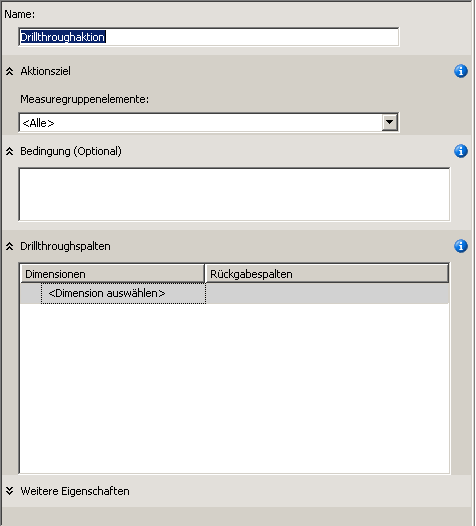
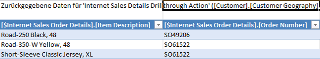
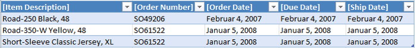

# Definieren und Verwenden einer Drillthroughaktion
Das Dimensionieren von Faktendaten mit einer Faktendimension, ohne die von der Abfrage zurückgegebenen Daten richtig zu filtern, kann bei Abfragen zu einer verminderten Leistung führen. Um dies zu vermeiden, können Sie eine Drillthroughaktion definieren, mit der die Gesamtanzahl der Zeilen, die zurückgegeben werden, reduziert wird. Dadurch wird die Abfrageleistung erheblich verbessert.  
  
Im Rahmen der Tasks in diesem Thema definieren Sie eine Drillthroughaktion, die Bestelldetailinformationen für Verkäufe an Kunden über das Internet zurückgibt.  
  
## Definieren der Eigenschaften einer Drillthroughaktion  
  
1.  Klicken Sie im Cube-Designer für den [!INCLUDE[ssASnoversion](../includes/ssasnoversion-md.md)] Tutorial-Cube auf die Registerkarte **Aktionen**.  
  
    Die Registerkarte **Aktionen** umfasst mehrere Bereiche. Auf der linken Seite der Registerkarte werden die Bereiche **Aktionsplaner** und **Berechnungstools** angezeigt. Rechts neben diesen beiden Bereichen befindet sich der **Anzeigebereich**, der die Details der im Bereich **Aktionsplaner** ausgewählten Aktion enthält.  
  
    In der folgenden Abbildung ist die Registerkarte **Aktionen** des Cube-Designers dargestellt.  
  
     des Cube-Designers")  
  
2.  Klicken Sie auf der Symbolleiste der Registerkarte **Aktionen** auf **Neue Drillthroughaktion**.  
  
    Es wird eine leere Aktionsvorlage im Anzeigebereich angezeigt.  
  
      
  
3.  Ändern Sie im Feld **Name** den Namen der Aktion zu **Internet Sales Details Drillthrough Action**.  
  
4.  Wählen Sie in der Liste **Measuregruppenelemente** die Option **Internet Sales** aus.  
  
5.  Wählen Sie im Feld **Drillthroughspalten** in der Liste **Dimensionen** die Option **Internet Sales Order Details** aus.  
  
6.  Aktivieren Sie in der Liste **Rückgabespalten** die Kontrollkästchen für **Elementbeschreibung** und **Bestellnummer**, und klicken Sie anschließend auf **OK**. In der folgenden Abbildung ist die Aktionsvorlage zu sehen, wie sie zum jetzigen Zeitpunkt in dieser Prozedur aussehen sollte.  
  
    ")  
  
7.  Erweitern Sie das Feld **Weitere Eigenschaften**, wie in der folgenden Abbildung dargestellt.  
  
    ")  
  
8.  Geben Sie in das Feld **Maximale Zeilenanzahl** die Ziffer **10** ein.  
  
9. Geben Sie in das Feld **Beschriftung** die Beschreibung **Drillthrough to Order Details…** ein.  
  
    Durch diese Einstellungen wird die Anzahl der zurückgegebenen Zeilen beschränkt und die Beschriftung angegeben, die im Clientanwendungsmenü angezeigt wird. In der folgenden Abbildung werden diese Einstellungen im Feld **Weitere Eigenschaften** dargestellt.  
  
    ")  
  
## Verwenden der Drillthroughaktion  
  
1.  Klicken Sie im Menü **Erstellen** auf **Analysis Services Tutorial bereitstellen**.  
  
2.  Klicken Sie nach erfolgreichem Abschluss der Bereitstellung im Cube-Designer für den [!INCLUDE[ssASnoversion](../includes/ssasnoversion-md.md)] Tutorial-Cube auf die Registerkarte **Browser** und anschließend auf die Schaltfläche **Verbindung wiederherstellen**.  
  
3.  Starten Sie Excel.  
  
4.  Fügen Sie dem Bereich „Werte“ das **Internet Sales-Sales Amount**-Measure hinzu.  
  
5.  Fügen Sie dem Bereich **Berichtsfilter** die benutzerdefinierte **Customer Geography**-Hierarchie aus dem Ordner **Location** in der **Customer**-Dimension hinzu.  
  
6.  Fügen Sie in der PivotTable in **Customer Geography** einen Filter hinzu, durch den ein einzelner Kunde ausgewählt wird. Erweitern Sie die Optionen **All Customers**, **Australia**, **Queensland**, **Brisbane**, **4000**, aktivieren Sie das Kontrollkästchen für **Adam Powell**, und klicken Sie anschließend auf **OK**.  
  
    Im Bereich Daten werden die gesamten Produktverkäufe von [!INCLUDE[ssSampleDBCoFull](../includes/sssampledbcofull-md.md)] an Adam Powell angezeigt.  
  
7.  Klicken Sie mit der rechten Maustaste auf den Umsatz, zeigen Sie auf **Zusätzliche Aktionen**, und klicken Sie anschließend auf **Drillthrough to Order Details**.  
  
    Die Details der an Adam Powell gelieferten Bestellungen werden im **Datenstichproben-Viewer** angezeigt, wie in der folgenden Abbildung zu sehen ist. Einige zusätzliche Details wären jedoch hilfreich, wie z. B. Bestelldatum, Fälligkeitsdatum und Lieferdatum. Sie fügen diese zusätzlichen Details in der nächsten Prozedur hinzu.  
  
      
  
8.  Schließen von Excel/  
  
## Ändern der Drillthroughaktion  
  
1.  Öffnen Sie den Dimensions-Designer für die **Internet Sales Order Details**-Dimension.  
  
    Für diese Dimension wurden nur drei Attribute definiert.  
  
2.  Klicken Sie im Bereich **Datenquellensicht** mit der rechten Maustaste auf einen leeren Bereich und anschließend auf **Alle Tabellen anzeigen**.  
  
3.  Zeigen Sie im Menü **Format** auf **AutoLayout**, und klicken Sie anschließend auf **Diagramm**.  
  
4.  Suchen Sie die Tabelle **InternetSales (dbo.FactInternetSales)**, indem Sie mit der rechten Maustaste in einem offenen Bereich des Bereichs **Datenquellensicht** klicken. Klicken Sie auf **Tabelle suchen** und auf **InternetSales,** und anschließend auf **OK**.  
  
5.  Erstellen Sie neue Attribute anhand der folgenden Spalten:  
  
    -   OrderDateKey  
  
    -   DueDateKey  
  
    -   ShipDateKey  
  
6.  Ändern Sie die **Name**-Eigenschaft für das **Order Date Key**-Attribut auf **Order Date**. Klicken Sie anschließend für die **Name Column**-Eigenschaft auf die Schaltfläche zum Durchsuchen. Wählen Sie im Dialogfeld **Namensspalte** **Date** als Quelltabelle und SimpleDate als Quellspalte aus. [!INCLUDE[clickOK](../includes/clickok-md.md)]  
  
7.  Ändern Sie die **Name**-Eigenschaft für das **Due Date Key**-Attribut in **Due Date** und anschließend mithilfe derselben Methode wie das **Order Date Key**-Attribut die **Name Column**-Eigenschaft für dieses Attribut in **Date.SimpleDate (WChar)**.  
  
8.  Ändern Sie die **Name**-Eigenschaft für das **Ship Date Key**-Attribut in **Ship Date** und anschließend die **Name Column**-Eigenschaft für dieses Attribut in **Date.SimpleDate (WChar)**.  
  
9. Wechseln Sie zur Registerkarte **Aktionen** des Cube-Designers für den [!INCLUDE[ssASnoversion](../includes/ssasnoversion-md.md)] Tutorial-Cube.  
  
10. Fügen Sie im Feld **Drillthroughspalten** der Liste **Rückgabespalten** die folgenden Spalten durch Aktivieren der entsprechenden Kontrollkästchen hinzu, und klicken Sie anschließend auf **OK**:  
  
    -   Order Date  
  
    -   Due Date  
  
    -   Ship Date  
  
    In der folgenden Abbildung sind diese Spalten markiert.  
  
    ")  
  
## Überprüfen der geänderten Drillthroughaktion  
  
1.  Klicken Sie im Menü **Erstellen** auf **Analysis Services Tutorial bereitstellen**.  
  
2.  Wechseln Sie nach erfolgreichem Abschluss der Bereitstellung im Cube-Designer für den [!INCLUDE[ssASnoversion](../includes/ssasnoversion-md.md)] Tutorial-Cube zur Registerkarte **Browser**, und klicken Sie anschließend auf die Schaltfläche **Verbindung wiederherstellen**.  
  
3.  Starten Sie Excel.  
  
4.  Erstellen Sie die PivotTable mit **Internet Sales-Sales Amount** im Bereich „Werte“ und **Customer Geography** im Berichtsfilter neu.  
  
    Fügen Sie einen Filter hinzu, durch den **Adam Powell** aus **All Customers**, **Australia**, **Queensland**, **Brisbane**, **4000**, ausgewählt wird.  
  
5.  Klicken Sie auf die Datenzelle **Internet Sales-Sales Amount**, zeigen Sie auf **Zusätzliche Aktionen**, und klicken Sie anschließend auf **Drillthrough to Order Details**.  
  
    Die Details dieser an Adam Powell gelieferten Bestellungen werden in einem temporären Arbeitsblatt angezeigt. Dies umfasst Artikelbeschreibung, Bestellnummer, Bestelldatum, Fälligkeitsdatum und Versanddatum, wie in der folgenden Abbildung dargestellt.  
  
      
  
## Nächste Lektion  
[Lektion 9: Definieren von Perspektiven und Übersetzungen](../analysis-services/lesson-9-defining-perspectives-and-translations.md)  
  
## Siehe auch  
[Aktionen &#40;Analysis Services – mehrdimensionale Daten&#41;](../analysis-services/multidimensional-models/actions-analysis-services-multidimensional-data.md)  
[Aktionen in mehrdimensionalen Modellen](../analysis-services/multidimensional-models/actions-in-multidimensional-models.md)  
[Dimensionsbeziehungen](../analysis-services/multidimensional-models-olap-logical-cube-objects/dimension-relationships.md)  
[Definieren einer Faktenbeziehung](../analysis-services/defining-a-fact-relationship.md)  
[Definieren von Faktenbeziehungen und Faktenbeziehungseigenschaften](../analysis-services/multidimensional-models/define-a-fact-relationship-and-fact-relationship-properties.md)  
  
  
  
