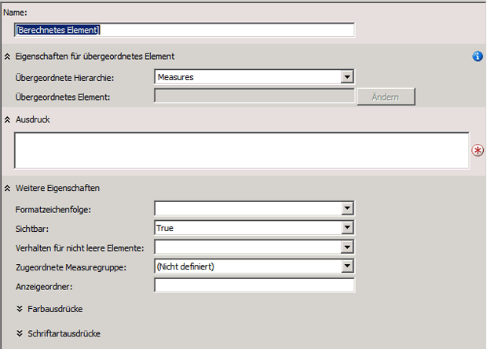
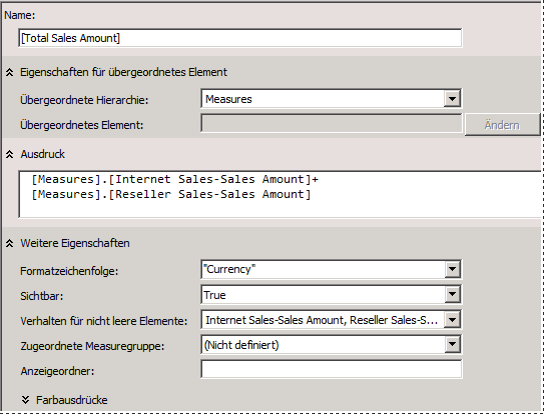
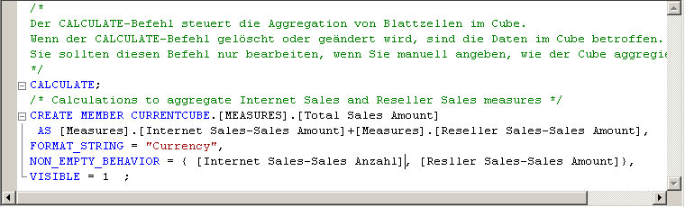
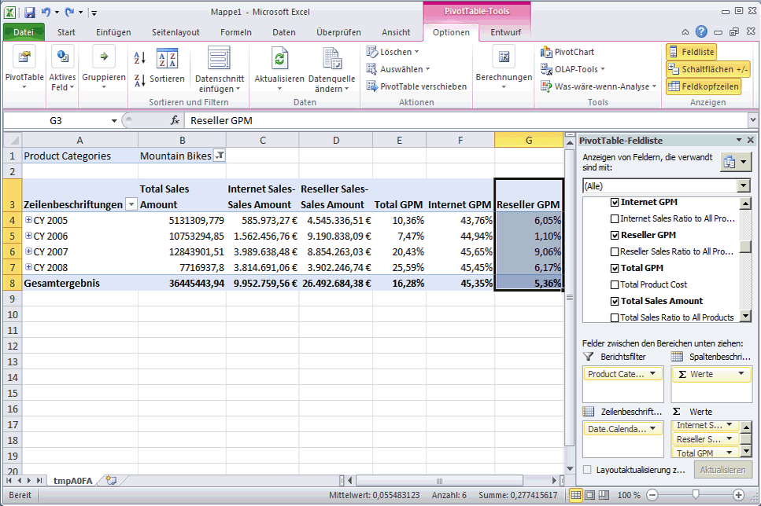

# Definieren berechneter Elemente
Berechnete Elemente sind Elemente einer Dimension oder Measuregruppe, die auf Basis einer Kombination aus Cubedaten, arithmetischen Operatoren, Zahlen und Funktionen definiert werden. Sie können beispielsweise ein berechnetes Element erstellen, das die Summe zweier physischer Measures im Cube berechnet. Die Definitionen berechneter Elemente werden in Cubes gespeichert, ihre Werte werden jedoch erst zum Zeitpunkt der Abfrage berechnet.  
  
Mithilfe des Befehls **Neues berechnetes Element** auf der Registerkarte **Berechnungen** des Cube-Designers können Sie ein berechnetes Element erstellen. Sie können ein berechnetes Element in jeder beliebigen Dimension erstellen, einschließlich der Measuredimension. Sie können ein berechnetes Element auch innerhalb eines Anzeigeordners im Dialogfeld **Berechnungseigenschaften** platzieren. Weitere Informationen finden Sie unter [Berechnungen](../analysis-services/multidimensional-models-olap-logical-cube-objects/calculations.md), [Berechnungen in mehrdimensionalen Modellen](../analysis-services/multidimensional-models/calculations-in-multidimensional-models.md) und [Erstellen von berechneten Elementen](../analysis-services/multidimensional-models/create-calculated-members.md).  
  
Im Rahmen der Tasks in diesem Thema definieren Sie berechnete Measures, damit Benutzer den Prozentsatz der Bruttorendite und die Verkaufsverhältnisse für Internetverkäufe, Verkäufe des Wiederverkäufers und alle Verkäufe anzeigen können.  
  
## Definieren von Berechnungen zum Aggregieren physischer Measures  
  
1.  Wechseln Sie zum Cube-Designer für den [!INCLUDE[ssASnoversion](../includes/ssasnoversion-md.md)] Tutorial-Cube, und klicken Sie anschließend auf die Registerkarte **Berechnungen**.  
  
    In den Bereichen **Berechnungsausdrücke** und **Skriptplaner** wird standardmäßig der CALCULATE-Befehl angezeigt. Dieser Befehl gibt an, dass die Measures im Cube gemäß dem durch die AggregateFunction-Eigenschaften angegebenen Wert aggregiert werden sollten. Measurewerte werden im Allgemeinen summiert, können jedoch auch auf andere Weise gezählt oder aggregiert werden.  
  
    In der folgenden Abbildung ist die Registerkarte **Berechnungen** des Cube-Designers dargestellt.  
  
     des Cube-Designers")  
  
2.  Klicken Sie auf der Symbolleiste der Registerkarte **Berechnungen** auf **Neues berechnetes Element**.  
  
    Im Bereich **Berechnungsausdrücke** wird ein neues Formular angezeigt, in dem Sie die Eigenschaften des neuen berechneten Elements definieren können. Das neue Element wird auch im Bereich **Skriptplaner** angezeigt.  
  
    In der folgenden Abbildung ist das Formular dargestellt, das im Bereich **Berechnungsausdrücke** angezeigt wird, wenn Sie auf **Neues berechnetes Element** klicken.  
  
      
  
3.  Ändern Sie im Feld **Name** den Namen des berechneten Measures zu **[Total Sales Amount]**.  
  
    Enthält der Name eines berechneten Elements ein Leerzeichen, muss er in eckige Klammern eingeschlossen werden.  
  
    In der Liste **Übergeordnete Hierarchie** wird standardmäßig ein neues berechnetes Element in der **Measures**-Dimension erstellt. Ein berechnetes Element in der Measures-Dimension wird auch häufig als berechnetes Measure bezeichnet.  
  
4.  Erweitern Sie auf der Registerkarte **Metadaten** im Bereich **Berechnungstools** der Registerkarte **Berechnungen** zuerst die Option **Measures** und anschließend **Internet Sales**, um die Metadaten für die **Internet Sales**-Measuregruppe anzuzeigen.  
  
    Metadatenelemente können aus dem Bereich **Berechnungstools** in das Feld **Ausdruck** gezogen und anschließend können ihnen Operatoren sowie andere Elemente hinzugefügt werden, um MDX-Ausdrücke (Multidimensional Expressions) zu erstellen. Alternativ können Sie den MDX-Ausdruck direkt in das Feld **Ausdruck** eingeben.  
  
    > [!NOTE]  
    > Wenn Sie keine Metadaten im Bereich **Berechnungstools** anzeigen können, klicken Sie auf der Symbolleiste auf **Verbindung wiederherstellen**. Funktioniert dies nicht, müssen Sie möglicherweise den Cube verarbeiten oder die Instanz von [!INCLUDE[ssASnoversion](../includes/ssasnoversion-md.md)] starten.  
  
5.  Ziehen Sie **Internet Sales-Sales Amount** von der Registerkarte **Metadaten** im Bereich **Berechnungstools** in das Feld **Ausdruck** im Bereich **Berechnungsausdrücke**.  
  
6.  Geben Sie im Feld **Ausdruck** ein Pluszeichen (**+**) nach **[Measures].[Internet Sales-Sales Amount]** ein.  
  
7.  Erweitern Sie auf der Registerkarte **Metadaten** im Bereich **Berechnungstools** die Option **Reseller Sales**, und ziehen Sie anschließend **Reseller Sales-Sales Amount** in das Feld **Ausdruck** im Bereich **Berechnungsausdrücke** hinter das Pluszeichen (+).  
  
8.  Wählen Sie in der Liste **Formatzeichenfolge** die Option **"Currency"** aus.  
  
9. Aktivieren Sie in der Liste **Verhalten für nicht leere Elemente** die Kontrollkästchen für **Internet Sales-Sales Amount** und **Reseller Sales-Sales Amount**, und klicken Sie anschließend auf **OK**.  
  
    Die in der Liste **Verhalten für nicht leere Elemente** angegebenen Measures werden zum Auflösen von NON EMPTY-Abfragen in MDX verwendet. Wenn Sie ein oder mehrere Measures in der Liste **Verhalten für nicht leere Elemente** angeben, behandelt [!INCLUDE[ssASnoversion](../includes/ssasnoversion-md.md)] das berechnete Element als leer, wenn alle angegebenen Measures leer sind. Wenn die **Non-empty behavior**-Eigenschaft leer ist, muss [!INCLUDE[ssASnoversion](../includes/ssasnoversion-md.md)] das berechnete Element selbst auswerten, um zu ermitteln, ob das Element leer ist.  
  
    Die folgende Abbildung stellt den Bereich **Berechnungsausdrücke** dar, der mit den in den vorhergehenden Schritten angegebenen Einstellungen aufgefüllt wurde.  
  
      
  
10. Klicken Sie auf der Symbolleiste der Registerkarte **Berechnungen** auf **Skriptansicht**, und überprüfen Sie anschließend das Berechnungsskript im Bereich **Berechnungsausdrücke**.  
  
    Die neue Berechnung wird dem CALCULATE-Ausgangsausdruck hinzugefügt; die einzelnen Berechnungen werden durch ein Semikolon voneinander getrennt. Am Anfang des Berechnungsskripts wird ein Kommentar angezeigt. Das Berechnungsskript durch Kommentare für Berechnungsgruppen zu ergänzen, ist sinnvoll, um Ihnen und anderen Entwicklern das Verständnis komplexer Berechnungsskripts zu erleichtern.  
  
11. Fügen Sie dem Berechnungsskript nach dem Befehl **Calculate;** und vor dem neu hinzugefügten Berechnungsskript eine neue Zeile hinzu, und geben Sie anschließend im Skript den folgenden Text in die gesonderte Zeile ein:  
  
    ```  
    /* Calculations to aggregate Internet Sales and Reseller Sales measures */  
    ```  
  
    Die folgende Abbildung stellt die Berechnungsskripts dar, wie sie im Bereich **Berechnungsausdrücke** zum jetzigen Zeitpunkt im Tutorial aussehen sollten.  
  
      
  
12. Klicken Sie auf der Symbolleiste der Registerkarte **Berechnungen** auf **Formularansicht**, überprüfen Sie, ob **[Total Sales Amount]** im Bereich **Skriptplaner** ausgewählt ist, und klicken Sie anschließend auf **Neues berechnetes Element**.  
  
13. Ändern Sie den Namen des neuen berechneten Elements zu **[Total Product Cost]**, und erstellen Sie anschließend den folgenden Ausdruck im Feld **Ausdruck**:  
  
    ```  
    [Measures].[Internet Sales-Total Product Cost] + [Measures].[Reseller Sales-Total Product Cost]  
    ```  
  
14. Wählen Sie in der Liste **Formatzeichenfolge** die Option **"Currency"** aus.  
  
15. Aktivieren Sie in der Liste **Verhalten für nicht leere Elemente** die Kontrollkästchen für **Internet Sales-Total Product Cost** und **Reseller Sales-Total Product Cost**, und klicken Sie anschließend auf **OK**.  
  
    Sie haben somit zwei berechnete Elemente definiert, die beide im Bereich **Skriptplaner** angezeigt werden. Diese berechneten Elemente können von anderen Berechnungen verwendet werden, die Sie nachfolgend im Berechnungsskript definieren. Die Definition aller berechneten Elemente kann durch Auswählen des berechneten Elements im Bereich **Skriptplaner** angezeigt werden. Die Definition des berechneten Elements wird im Bereich **Berechnungsausdrücke** in der Formularansicht angezeigt. Neu definierte berechnete Elemente werden erst nach dem Bereitstellen der Objekte im Bereich **Berechnungstools** angezeigt. Berechnungen müssen nicht verarbeitet werden.  
  
## Definieren von Berechnungen zur Bruttorendite  
  
1.  Überprüfen Sie, ob **[Total Product Cost]** im Bereich **Skriptplaner** ausgewählt ist, und klicken Sie auf der Symbolleiste der Registerkarte **Berechnungen** auf **Neues berechnetes Element**.  
  
2.  Ändern Sie im Feld **Name** den Namen des neuen berechneten Measures zu **[Internet GPM]**.  
  
3.  Erstellen Sie im Feld **Ausdruck** den folgenden MDX-Ausdruck:  
  
    ```  
    ([Measures].[Internet Sales-Sales Amount] -   
    [Measures].[Internet Sales-Total Product Cost]) /  
    [Measures].[Internet Sales-Sales Amount]  
    ```  
  
4.  Wählen Sie in der Liste **Formatzeichenfolge** die Option **"Percent"** aus.  
  
5.  Aktivieren Sie in der Liste **Verhalten für nicht leere Elemente** das Kontrollkästchen für **Internet Sales-Sales Amount**, und klicken Sie anschließend auf **OK**.  
  
6.  Klicken Sie auf der Symbolleiste der Registerkarte **Berechnungen** auf **Neues berechnetes Element**.  
  
7.  Ändern Sie im Feld **Name** den Namen des neuen berechneten Measures zu **[Reseller GPM]**.  
  
8.  Erstellen Sie im Feld **Ausdruck** den folgenden MDX-Ausdruck:  
  
    ```  
    ([Measures].[Reseller Sales-Sales Amount] -   
    [Measures].[Reseller Sales-Total Product Cost]) /  
    [Measures].[Reseller Sales-Sales Amount]  
    ```  
  
9. Wählen Sie in der Liste **Formatzeichenfolge** die Option **"Percent"** aus.  
  
10. Aktivieren Sie in der Liste **Verhalten für nicht leere Elemente** das Kontrollkästchen für **Reseller Sales-Sales Amount**, und klicken Sie anschließend auf **OK**.  
  
11. Klicken Sie auf der Symbolleiste der Registerkarte **Berechnungen** auf **Neues berechnetes Element**.  
  
12. Ändern Sie im Feld **Name** den Namen des neuen berechneten Measures zu **[Total GPM]**.  
  
13. Erstellen Sie im Feld **Ausdruck** den folgenden MDX-Ausdruck:  
  
    ```  
    ([Measures].[Total Sales Amount] -   
    [Measures].[Total Product Cost]) /  
    [Measures].[Total Sales Amount]  
    ```  
  
    Dieses berechnete Element verweist auf andere berechnete Elemente. Da dieses berechnete Element erst nach den berechneten Elementen berechnet wird, auf die es verweist, ist dies ein gültiges berechnetes Element.  
  
14. Wählen Sie in der Liste **Formatzeichenfolge** die Option **"Percent"** aus.  
  
15. Aktivieren Sie in der Liste **Verhalten für nicht leere Elemente** die Kontrollkästchen für **Internet Sales-Sales Amount** und **Reseller Sales-Sales Amount**, und klicken Sie anschließend auf **OK**.  
  
16. Klicken Sie auf der Symbolleiste der Registerkarte **Berechnungen** auf **Skriptansicht**, und überprüfen Sie die drei Berechnungen, die gerade dem Berechnungsskript hinzugefügt wurden.  
  
17. Fügen Sie dem Berechnungsskript direkt vor der Berechnung von **[Internet GPM]** eine neue Zeile hinzu, und geben Sie den folgenden Text in der gesonderten Zeile in das Skript ein:  
  
    ```  
    /* Calculations to calculate gross profit margin */  
    ```  
  
    Die folgende Abbildung stellt den Bereich **Ausdrücke** mit den drei neuen Berechnungen dar.  
  
      
  
## Definieren der Berechnungen zum Prozentsatz der Summe  
  
1.  Klicken Sie auf der Symbolleiste der Registerkarte **Berechnungen** auf **Formularansicht**.  
  
2.  Wählen Sie im Bereich **Skriptplaner** die Option **[Total GPM]** aus, und klicken Sie anschließend auf der Symbolleiste der Registerkarte **Berechnungen** auf **Neues berechnetes Element**.  
  
    Wenn Sie zuerst auf das letzte berechnete Element im Bereich **Skriptplaner** klicken, ehe Sie auf **Neues berechnetes Element** klicken, wird sichergestellt, dass das neue berechnete Element am Ende des Skripts eingegeben wird. Skripts werden in der Reihenfolge ausgeführt, in der sie im Bereich **Skriptplaner** angezeigt werden.  
  
3.  Ändern Sie den Namen des neuen berechneten Elements zu **[Internet Sales Ratio to All Products]**.  
  
4.  Geben Sie den folgenden Ausdruck in das Feld **Ausdruck** ein:  
  
    ```  
    Case  
        When IsEmpty( [Measures].[Internet Sales-Sales Amount] )   
        Then 0  
        Else ( [Product].[Product Categories].CurrentMember,  
               [Measures].[Internet Sales-Sales Amount]) /  
             ( [Product].[Product Categories].[(All)].[All],   
               [Measures].[Internet Sales-Sales Amount] )  
        End  
    ```  
  
    Dieser MDX-Ausdruck berechnet den Anteil an den gesamten Internetverkäufen der einzelnen Produkte. Durch die Case-Anweisung in Kombination mit der IS EMPTY-Funktion wird sichergestellt, dass kein Fehler aufgrund einer Division durch Null auftritt, wenn ein Produkt keine Verkäufe aufweist.  
  
5.  Wählen Sie in der Liste **Formatzeichenfolge** die Option **"Percent"** aus.  
  
6.  Aktivieren Sie in der Liste **Verhalten für nicht leere Elemente** das Kontrollkästchen für **Internet Sales-Sales Amount**, und klicken Sie anschließend auf **OK**.  
  
7.  Klicken Sie auf der Symbolleiste der Registerkarte **Berechnungen** auf **Neues berechnetes Element**.  
  
8.  Ändern Sie den Namen des neuen berechneten Elements zu **[Reseller Sales Ratio to All Products]**.  
  
9. Geben Sie den folgenden Ausdruck in das Feld **Ausdruck** ein:  
  
    ```  
    Case  
        When IsEmpty( [Measures].[Reseller Sales-Sales Amount] )   
        Then 0  
        Else ( [Product].[Product Categories].CurrentMember,  
               [Measures].[Reseller Sales-Sales Amount]) /  
             ( [Product].[Product Categories].[(All)].[All],   
               [Measures].[Reseller Sales-Sales Amount] )  
        End  
    ```  
  
10. Wählen Sie in der Liste **Formatzeichenfolge** die Option **"Percent"** aus.  
  
11. Aktivieren Sie in der Liste **Verhalten für nicht leere Elemente** das Kontrollkästchen für **Reseller Sales-Sales Amount**, und klicken Sie anschließend auf **OK**.  
  
12. Klicken Sie auf der Symbolleiste der Registerkarte **Berechnungen** auf **Neues berechnetes Element**.  
  
13. Ändern Sie den Namen des neuen berechneten Elements zu **[Total Sales Ratio to All Products]**.  
  
14. Geben Sie den folgenden Ausdruck in das Feld **Ausdruck** ein:  
  
    ```  
    Case  
        When IsEmpty( [Measures].[Total Sales Amount] )   
        Then 0  
        Else ( [Product].[Product Categories].CurrentMember,  
               [Measures].[Total Sales Amount]) /  
             ( [Product].[Product Categories].[(All)].[All],   
               [Measures].[Total Sales Amount] )  
        End  
    ```  
  
15. Wählen Sie in der Liste **Formatzeichenfolge** die Option **"Percent"** aus.  
  
16. Aktivieren Sie in der Liste **Verhalten für nicht leere Elemente** die Kontrollkästchen für **Internet Sales-Sales Amount** und **Reseller Sales-Sales Amount**, und klicken Sie anschließend auf **OK**.  
  
17. Klicken Sie auf der Symbolleiste der Registerkarte **Berechnungen** auf **Skriptansicht**, und überprüfen Sie anschließend die drei Berechnungen, die gerade dem Berechnungsskript hinzugefügt wurden.  
  
18. Fügen Sie dem Berechnungsskript direkt vor der Berechnung von **[Internet Sales Ratio to All Products]** eine neue Zeile hinzu, und geben Sie den folgenden Text in der gesonderten Zeile in das Skript ein:  
  
    ```  
    /* Calculations to calculate percentage of product to total product sales */  
    ```  
  
    Sie haben nun insgesamt acht berechnete Elemente definiert, die im Bereich **Skriptplaner** angezeigt werden, falls Sie sich in der Formularansicht befinden.  
  
## Durchsuchen der neuen berechneten Elemente  
  
1.  Klicken Sie im Menü **Erstellen** von [!INCLUDE[ssBIDevStudioFull](../includes/ssbidevstudiofull-md.md)] auf **Analysis Services Tutorial bereitstellen**.  
  
2.  Wechseln Sie nach erfolgreichem Abschluss der Bereitstellung zur Registerkarte **Browser**, und klicken Sie auf **Verbindung wiederherstellen**.  
  
3.  Klicken Sie auf das Excel-Symbol und anschließend auf **Aktivieren**.  
  
4.  Erweitern Sie im Bereich **PivotTable-Feldliste** den Ordner **Werte**, um die neuen berechneten Elemente in der Measures-Dimension anzuzeigen.  
  
5.  Ziehen Sie **Total Sales Amount** in den Bereich Werte, und überprüfen Sie anschließend die Ergebnisse.  
  
    Ziehen Sie das **Internet Sales-Sales Amount**-Measure und das **Reseller Sales-Sales Amount**-Measure aus der **Internet Sales**-Measuregruppe und der **Reseller Sales**-Measuregruppe in den Bereich Werte.  
  
    Das **Total Sales Amount**-Measure ist die Summe aus dem **Internet Sales-Sales Amount**-Measure und dem **Reseller Sales-Sales Amount**-Measure.  
  
6.  Fügen Sie dem Filterbereich des Bereichs **Berichtsfilter** die benutzerdefinierte Hierarchie **Product Categories** hinzu, und filtern Sie die Daten anschließend nach **Mountain Bikes**.  
  
    Das **Total Sales Amount**-Measure wird für die **Mountain Bikes**-Kategorie der Produktverkäufe auf der Grundlage der Measures **Internet Sales-Sales Amount** und **Reseller Sales-Sales Amount** für **Mountain Bikes** berechnet.  
  
7.  Fügen Sie dem Bereich **Zeilenbezeichnungen** die benutzerdefinierte Hierarchie „Date.Calendar Date“ hinzu, und überprüfen Sie anschließend die Ergebnisse.  
  
    Das **Total Sales Amount**-Measure für jedes Kalenderjahr wird für die **Mountain Bikes**-Kategorie der Produktverkäufe auf der Grundlage der Measures **Internet Sales-Sales Amount** und **Reseller Sales-Sales Amount** für **Mountain Bikes** berechnet.  
  
8.  Fügen Sie dem Bereich „Werte“ die Measures **Total GPM** die Measures **Internet GPM**, **Reseller GPM** hinzu, und überprüfen Sie anschließend die Ergebnisse.  
  
    Die Bruttorendite für Verkäufe des Wiederverkäufers ist deutlich niedriger als für Verkäufe über das Internet, wie in der folgenden Abbildung dargestellt.  
  
      
  
9. Fügen Sie dem Bereich „Werte“ die Measures **Total Sales Ratio to All Products**, **Internet Sales Ratio to All Products** und **Reseller Sales Ratio to All Products** hinzu.  
  
    Das Verhältnis zwischen den Verkäufen von Mountainbikes und allen Produkten ist bei den Internetverkäufen im Laufe der Zeit gestiegen, bei den Verkäufen durch Wiederverkäufer jedoch gesunken.  Darüber hinaus ist das Verhältnis zwischen den Verkäufen von Mountainbikes und allen Produkten bei Verkäufen über Wiederverkäufer niedriger als bei Verkäufen über das Internet.  
  
10. Wechseln Sie den Filter von **Mountain Bikes** zu **Bikes**, und überprüfen Sie die Ergebnisse.  
  
    Die Bruttorendite für alle durch Wiederverkäufer verkauften Fahrräder ist negativ, da Tourenräder und Straßenräder mit Verlust verkauft werden.  
  
11. Wechseln Sie den Filter zu **Accessories**, und überprüfen Sie die Ergebnisse.  
  
    Die Verkaufszahlen für das Zubehör steigen im Laufe der Zeit, doch machen diese Verkäufe nur einen Bruchteil der Gesamtverkäufe aus. Die Bruttorendite beim Verkauf von Zubehör ist jedoch höher als beim Verkauf von Fahrrädern.  
  
## Nächste Aufgabe in der Lektion  
[Definieren von benannten Mengen](../analysis-services/defining-named-sets.md)  
  
## Siehe auch  
[Berechnungen](../analysis-services/multidimensional-models-olap-logical-cube-objects/calculations.md)  
[Berechnungen in mehrdimensionalen Modellen](../analysis-services/multidimensional-models/calculations-in-multidimensional-models.md)  
[Erstellen von berechneten Elementen](../analysis-services/multidimensional-models/create-calculated-members.md)  
  
  
  
