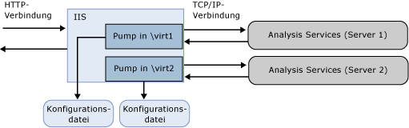

# <a name="configure-http-access-to-analysis-services-on-iis-80"></a>Konfigurieren von HTTP-Zugriff auf Analysis Services auf IIS 8.0
[!INCLUDE[ssas-appliesto-sqlas](../../includes/ssas-appliesto-sqlas.md)]In diesem Artikel wird erläutert, wie Sie einen HTTP-Endpunkt für den Zugriff auf Analysis Services-Instanz einrichten. Sie können den HTTP-Zugriff aktivieren, indem Sie MSMDPUMP.dll konfigurieren, eine ISAPI-Erweiterung, die in Internetinformationsdienste (IIS) ausgeführt wird und Datapump zu und von Clientanwendungen und einem Analysis Services-Server ausführt. Dieser Ansatz bietet eine Alternative zum Herstellen einer Verbindung mit Analysis Services, wenn die BI-Lösung die folgenden Funktionen erfordert:  
  
-   Der Clientzugriff erfolgt über Internet- oder Extranetverbindungen, mit Einschränkungen dazu, welche Ports aktiviert werden können,  
  
-   Clientverbindungen stammen von nicht vertrauenswürdigen Domänen im selben Netzwerk.  
  
-   Die Clientanwendung wird in einer Netzwerkumgebung ausgeführt, die HTTP-, jedoch keine TCP/IP-Verbindungen unterstützt.  
  
-   Die Analysis Services-Clientbibliotheken können von Clientanwendungen nicht verwendet werden (z. B. eine Java-Anwendung, die auf einem UNIX-Server ausgeführt wird). Wenn es nicht möglich ist, die Analysis Services-Clientbibliotheken für den Datenzugriff zu verwenden, können Sie SOAP und XML/A über eine direkte HTTP-Verbindung zu einer Analysis Services-Instanz verwenden.  
  
-   Andere Authentifizierungsmethoden als die integrierte Sicherheit von Windows sind erforderlich. Sie können insbesondere anonyme Verbindungen und die Standardauthentifizierung verwenden, wenn Sie Analysis Services für den HTTP-Zugriff konfigurieren. Die Digest-, Formular- und ASP.NET-Authentifizierung werden nicht unterstützt. Die Erfordernis der Standardauthentifizierung ist einer der Hauptgründe für die Aktivierung des HTTP-Zugriffs. Weitere Informationen finden Sie unter [Microsoft BI-Authentifizierung und Identitätsdelegierung](http://go.microsoft.com/fwlink/?LinkId=286576).  
  
 Sie können den HTTP-Zugriff für alle unterstützten Versionen oder Editionen von Analysis Services konfigurieren, die den tabellarischen oder mehrdimensionalen Modus ausführen. Lokale Cubes sind eine Ausnahme. Sie können keine Verbindung zu einem lokalen Cube über einen HTTP-Endpunkt herstellen.  
  
 Das Einrichten des HTTP-Zugriffs ist eine Aufgabe nach der Installation. Analysis Services muss bereits installiert sein, damit Sie es für den HTTP-Zugriff konfigurieren können. Als Analysis Services-Administrator müssen Sie Windows-Konten Berechtigungen erteilen, bevor HTTP-Zugriff möglich ist. Darüber hinaus ist es eine bewährte Methode, zuerst zu überprüfen, ob Ihre Installation voll funktionsfähig ist, bevor Sie den Server weiter konfigurieren. Nachdem der HTTP-Zugriff konfiguriert wurde, können Sie den HTTP-Endpunkt und den regulären Netzwerknamen des Servers über TCP/IP verwenden. Durch Einrichten des HTTP-Zugriffs werden andere Methoden für den Datenzugriff nicht ungültig.  
  
 Denken Sie bei der MSMDPUMP-Konfiguration daran, dass zwei Verbindungen zu berücksichtigen sind: Client-zu-IIS, IIS-zu-SSAS. Die Anweisungen in diesem Artikel beziehen sich auf IIS-zu-SSAS. Ihre Clientanwendung erfordert möglicherweise zusätzliche Konfigurationen, bevor sie eine Verbindung mit IIS herstellen kann. Entscheidungen wie die, ob SSL verwendet wird oder wie Bindungen zu konfigurieren sind, sind nicht Gegenstand dieses Artikels. Weitere Informationen zu IIS finden Sie unter [Webserver (IIS)](http://technet.microsoft.com/library/hh831725.aspx) .  
  
 Dieses Thema enthält folgende Abschnitte:  
  
-   [Übersicht](#bkmk_overview)  
  
-   [Erforderliche Komponenten](#bkmk_prereq)  
  
-   [Kopieren der MSMDPUMP.dll in einen Ordner auf dem Webserver](#bkmk_copy)  
  
-   [Erstellen eines Anwendungspools und eines virtuellen Verzeichnisses in IIS](#bkmk_appPool)  
  
-   [Konfigurieren der IIS-Authentifizierung und Hinzufügen der Erweiterung](#bkmk_auth)  
  
-   [Bearbeiten der Datei MSMDPUMP.INI zum Festlegen des Zielservers](#bkmk_edit)  
  
-   [Testen der Konfiguration](#bkmk_test)  
  
##  <a name="bkmk_overview"></a> Übersicht  
 MSMDPUMP ist eine ISAPI-Erweiterung, die in IIS geladen wird und die Umleitung zu einer lokalen oder Remote-Analysis-Services-Instanz bereitstellt. Durch die Konfiguration dieser ISAPI-Erweiterung erstellen Sie einen HTTP-Endpunkt für eine Analysis Services-Instanz.  
  
 Sie müssen ein virtuelles Verzeichnis für jeden HTTP-Endpunkt erstellen und konfigurieren. Jeder Endpunkt erfordert für jede Analysis Services-Instanz, mit der Sie eine Verbindung herstellen möchten, eine eigene MSMDPUMP-Dateigruppe. In einer Konfigurationsdatei innerhalb der Dateigruppe ist der Name der für die einzelnen HTTP-Endpunkte verwendeten Analysis Services-Instanz angegeben.  
  
 In IIS stellt MSMDPUMP mithilfe des Analysis Services OLE DB-Anbieters über TCP/IP eine Verbindung mit Analysis Services her. Obwohl Clientanforderungen von außerhalb von Domänenvertrauensstellungen stammen können, müssen sich Analysis Services und IIS in der gleichen Domäne oder in vertrauenswürdigen Domänen befinden, damit die systemeigene Verbindung hergestellt werden kann.  
  
 Die Verbindung von MSMDPUMP zu Analysis Services wird mit einer Windows-Benutzeridentität hergestellt. Dabei kann es sich um das anonyme Konto handeln, wenn Sie das virtuelle Verzeichnis für anonyme Verbindungen konfiguriert haben, oder um ein Windows-Benutzerkonto. Das Konto muss über die entsprechenden Datenzugriffsberechtigungen für Analysis Services-Server und -Datenbank verfügen.  
  
   
  
 In der folgenden Tabelle sind zusätzliche Überlegungen für das Aktivieren des HTTP-Zugriffs in verschiedenen Szenarien aufgeführt.  
  
|Szenario|Konfiguration|  
|--------------|-------------------|  
|IIS und Analysis Services auf demselben Computer|Dies ist die einfachste Konfiguration, da dadurch die Standardkonfiguration (mit dem Servernamen "localhost"), der lokale Analysis Services OLE DB-Anbieter sowie die integrierte Sicherheit von Windows mit NTLM verwendet werden können. Vorausgesetzt, der Client befindet sich ebenfalls in derselben Domäne, ist die Authentifizierung für den Benutzer transparent, ohne zusätzliche Arbeit Ihrerseits.|  
|IIS und Analysis Services auf verschiedenen Computern|Bei dieser Topologie muss der OLE DB-Anbieter für Analysis Services auf dem Webserver installiert werden. Außerdem muss die Datei msmdpump.ini so bearbeitet werden, dass der Speicherort der Analysis Services-Instanz auf dem Remotecomputer angegeben wird.<br /><br /> Diese Topologie fügt einen Doppelhop-Authentifizierungsschritt hinzu, bei dem Anmeldeinformationen vom Client an den Webserver und dann an den Analysis Services-Back-End-Server geleitet werden müssen. Wenn Sie Windows-Anmeldeinformationen und NTLM verwenden, wird ein Fehler ausgegeben, da NTLM keine Delegierung von Clientanmeldeinformationen an einen zweiten Server zulässt. Die gebräuchlichste Lösung ist die Verwendung der Standardauthentifizierung mit SSL (Secure Sockets Layer). Dabei müssen die Benutzer jedoch einen Benutzernamen und ein Kennwort eingeben, wenn Sie auf das virtuelle Verzeichnis MSMDPUMP zugreifen. Ein einfacherer Ansatz wäre, Kerberos zu aktivieren und die eingeschränkte Delegierung von Analysis Services zu konfigurieren, sodass Benutzer auf Analysis Services in transparenter Weise zugreifen können. Einzelheiten finden Sie unter [Konfigurieren von Analysis Services für die eingeschränkte Kerberos-Delegierung](../../analysis-services/instances/configure-analysis-services-for-kerberos-constrained-delegation.md) .<br /><br /> Bestimmen Sie, für welche Ports die Blockierung in der Windows-Firewall aufgehoben werden muss. Sie müssen die Blockierung von Ports auf beiden Servern aufheben, um Zugriff auf die Webanwendung in IIS und auf Analysis Services auf einem Remoteserver zu gewähren.|  
|Clientverbindungen stammen von einer nicht vertrauenswürdigen Domäne oder einer Extranetverbindung|Clientverbindungen von einer nicht vertrauenswürdigen Domäne führen zu weiteren Einschränkungen bei der Authentifizierung. In der Standardeinstellung verwendet Analysis Services die integrierte Windows-Authentifizierung, bei der sich Benutzer in derselben Domäne wie der Server befinden müssen. Extranetbenutzer, die von außerhalb der Domäne eine Verbindung zu IIS herstellen, erhalten einen Verbindungsfehler, wenn der Server für die Verwendung der Standardeinstellungen konfiguriert ist.<br /><br /> Als Problemumgehung können Extranetbenutzer eine Verbindung über ein VPN mit Domänenanmeldeinformationen herstellen. Ein besserer Ansatz könnte jedoch sein, die Standardauthentifizierung und SSL auf der IIS-Website zu aktivieren.|  
  
##  <a name="bkmk_prereq"></a> Erforderliche Komponenten  
 Bei den Anweisungen in diesem Artikel wird davon ausgegangen, dass IIS bereits konfiguriert und Analysis Services bereits installiert ist. Windows Server 2012 wird mit IIS 8.x als Serverrolle geliefert, die Sie auf dem System aktivieren können.  
  
 **Zusätzliche Konfiguration in IIS 8.0**  
  
 In der Standardkonfiguration von IIS 8.0 fehlen Komponenten, die für den HTTP-Zugriff auf Analysis Services erforderlich sind. Diese Komponenten finden Sie in den Featurebereichen **Sicherheit** und **Anwendungsentwicklung** der Rolle **Webserver (IIS)** . Sie umfassen Folgendes:  
  
-   **Sicherheit** | **Windows-Authentifizierung**oder **Standardauthentifizierung**und alle anderen erforderlichen Sicherheitsfeatures für Ihr Datenzugriffsszenario.  
  
-   **Anwendungsentwicklung** | **CGI**  
  
-   **Anwendungsentwicklung** | **ISAPI-Erweiterungen**  
  
 Verwenden Sie zum Überprüfen oder Hinzufügen dieser Komponenten **Server-Manager** | **Verwalten** | **Rollen und Features hinzufügen**. Durchlaufen Sie den Assistenten, bis Sie zu **Serverrollen**gelangen. Scrollen Sie nach unten zur Option **Webserver (IIS)**.  
  
1.  Öffnen Sie **Webserver** | **Sicherheit** , und wählen Sie die Authentifizierungsmethoden aus.  
  
2.  Öffnen Sie **Webserver** | **Anwendungsentwicklung** , und wählen Sie **CGI** und **ISAPI-Erweiterungen**.  
  
       
  
 **Wenn IIS auf einem Remoteserver ausgeführt wird**  
  
 Für eine Remoteverbindung zwischen IIS und Analysis Services müssen Sie den Analysis Services-OLE DB-Anbieter (MSOLAP) auf dem Windows-Server mit IIS installieren.  
  
1.  Wechseln Sie zur Downloadseite für [SQL Server 2014 Feature Pack](http://www.microsoft.com/download/details.aspx?id=42295).  
  
2.  Klicken Sie auf die Download-Schaltfläche.  
  
3.  Blättern Sie nach unten zu ENU\x64\SQL_AS_OLEDB.msi  
  
4.  Befolgen Sie die Anweisungen des Assistenten, um die Installation abzuschließen.  
  
> [!NOTE]  
>  Achten Sie darauf, die Blockierung der Ports in der Windows-Firewall aufzuheben, um Clientverbindungen zu einem Analysis Services-Remoteserver zuzulassen. Weitere Informationen finden Sie unter [Configure the Windows Firewall to Allow Analysis Services Access](../../analysis-services/instances/configure-the-windows-firewall-to-allow-analysis-services-access.md).  
  
##  <a name="bkmk_copy"></a> Schritt 1: Kopieren der MSMDPUMP-Dateien in einen Ordner auf dem Webserver  
 Jeder erstellte HTTP-Endpunkt muss über eine eigene MSMDPUMP-Dateigruppe verfügen. In diesem Schritt kopieren Sie die ausführbare MSMDPUMP-Datei, die Konfigurationsdatei und den Ressourcenordner aus den Analysis Services-Programmordnern in einen neuen virtuellen Verzeichnisordner, den Sie im Dateisystem des Computers erstellen, auf dem IIS ausgeführt wird.  
  
 Das Laufwerk muss für das NTFS-Dateisystem formatiert sein. Der Pfad zum Ordner, den Sie erstellen, darf keine Leerzeichen enthalten.  
  
1.  Kopieren Sie die folgenden Dateien, finden Sie unter \<Laufwerk >: \Programme\Microsoft SQL Server\\< Instanz\>\OLAP\bin\isapi: MSMDPUMP. MSMDPUMP-DLL. INI und einen Ressourcenordner.  
  
       
  
2.  Erstellen Sie einen neuen Ordner auf dem Webserver: \<Laufwerk >: \inetpub\wwwroot\\**OLAP**  
  
3.  Fügen Sie die zuvor kopierten Dateien in diesen neuen Ordner ein.  
  
4.  Stellen Sie sicher, dass der Ordner \inetpub\wwwroot\OLAP auf dem Webserver Folgendes enthält: MSMDPUMP.DLL, MSMDPUMP.INI sowie einen Ordner Resources. Die Ordnerstruktur sollte wie folgt aussehen:  
  
    -   \<Laufwerk >: \inetpub\wwwroot\OLAP\MSMDPUMP.dll  
  
    -   \<Laufwerk >: \inetpub\wwwroot\OLAP\MSMDPUMP.ini  
  
    -   \<Laufwerk >: \inetpub\wwwroot\OLAP\Resources  
  
##  <a name="bkmk_appPool"></a> Schritt 2: Erstellen eines Anwendungspools und eines virtuellen Verzeichnisses in IIS  
 Als Nächstes erstellen Sie einen Anwendungspool und einen Endpunkt für die Datapump.  
  
#### <a name="create-an-application-pool"></a>Erstellen eines Anwendungspools  
  
1.  Starten Sie den IIS-Manager.  
  
2.  Öffnen Sie den Serverordner, klicken Sie mit der rechten Maustaste auf **Anwendungspools** , und klicken Sie dann auf **Anwendungspool hinzufügen**. Erstellen Sie einen Anwendungspool namens **OLAP**mithilfe von .NET Framework, wobei der verwaltete Pipelinemodus auf **Klassisch**festgelegt ist.  
  
       
  
3.  Standardmäßig erstellt IIS Anwendungspools mit der Sicherheitsidentität **ApplicationPoolIdentity** , was eine gültige Auswahl für den HTTP-Zugriff auf Analysis Services ist. Wenn Sie besondere Gründe für das Ändern der Identität haben, klicken Sie mit der rechten Maustaste auf **OLAP**, und wählen Sie dann **Erweiterte Einstellungen**aus. Wählen Sie **ApplicationPoolIdentity**aus. Klicken Sie auf die Schaltfläche **Ändern** für diese Eigenschaft, um das integrierte Konto durch das benutzerdefinierte Konto zu ersetzen, das Sie verwenden möchten.  
  
       
  
4.  In der Standardeinstellung wird auf einem 64-Bit-Betriebssystem die Eigenschaft **32-Bit-Anwendungen aktivieren** von IIS auf **false**festgelegt. Wenn Sie msmdpump.dll von einer 64-Bit-Installation von Analysis Services kopiert haben, ist dies die richtige Einstellung für die MSMDPUMP-Erweiterung auf einem 64-Bit-IIS-Server. Wenn Sie die MSMDPUMP-Binärdateien von einer 32-Bit-Installation kopiert haben, setzen Sie die Eigenschaft auf **true**. Überprüfen Sie nun unter **Erweiterte Einstellungen** , ob die Eigenschaft richtig festgelegt wurde.  
  
#### <a name="create-an-application"></a>Erstellen einer Anwendung  
  
1.  Öffnen Sie im IIS-Manager zuerst **Sites**und dann **Standardwebsite**. Ein Ordner namens **Olap**sollte angezeigt werden. Dies ist ein Verweis auf den OLAP-Ordner, den Sie unter \inetpub\wwwroot erstellt haben.  
  
       
  
2.  Klicken Sie mit der rechten Maustaste auf den Ordner, und wählen Sie **In Anwendung konvertieren**.  
  
3.  Geben Sie in "Anwendung hinzufügen" **OLAP** für den Alias ein. Klicken Sie auf **Auswählen** , um den OLAP-Anwendungspool auszuwählen. Der physische Pfad sollte auf C:\inetpub\wwwroot\OLAP festgelegt werden.  
  
       
  
4.  Klicken Sie auf **OK**. Aktualisieren Sie die Website, und beachten Sie, dass der OLAP-Ordner jetzt eine Anwendung unter der Standardwebsite darstellt. Der virtuelle Pfad zur Datei MSMDPUMP ist nun hergestellt.  
  
       
  
> [!NOTE]  
>  Frühere Versionen dieser Anweisungen enthalten Schritte zum Erstellen eines virtuellen Verzeichnisses. Dieser Schritt ist nicht mehr erforderlich.  
  
##  <a name="bkmk_auth"></a> Schritt 3: Konfigurieren der IIS-Authentifizierung und Hinzufügen der Erweiterung  
 In diesem Schritt führen Sie die Konfiguration des soeben erstellten virtuellen SSAS-Verzeichnisses fort. Sie geben eine Authentifizierungsmethode an und fügen dann eine Skriptzuordnung hinzu. Folgende Authentifizierungsmethoden werden für Analysis Services über HTTP unterstützt:  
  
-   Windows-Authentifizierung (Kerberos oder NTLM)  
  
-   Standardauthentifizierung  
  
-   Anonyme Authentifizierung  
  
 Die**Windows-Authentifizierung** wird als sicherste Authentifizierung angesehen und nutzt vorhandene Infrastrukturen für Netzwerke, die Active Directory verwenden. Damit die Windows-Authentifizierung optimal genutzt werden kann, muss sie von allen Browsern, Client- und Serveranwendungen unterstützt werden. Dies ist der sicherste und empfohlene Modus. Allerdings erfordert er, dass IIS auf einen Windows-Domänencontroller zugreifen kann, der die Identität des Benutzers authentifizieren kann, der eine Verbindung anfordert.  
  
 In Topologien, in denen sich Analysis Services und IIS auf verschiedenen Computern befinden, müssen Sie Vorkehrungen zur Behandlung von Doppelhopproblemen treffen, die auftreten, wenn eine Benutzeridentität an einen zweiten Dienst auf einem Remotecomputer delegiert werden muss. Dazu aktivieren Sie normalerweise Analysis Services für die eingeschränkte Kerberos-Delegierung. Weitere Informationen finden Sie unter [Configure Analysis Services for Kerberos constrained delegation](../../analysis-services/instances/configure-analysis-services-for-kerberos-constrained-delegation.md).  
  
 Die**Standardauthentifizierung** wird verwendet, wenn Windows-Identitäten vorhanden sind, die Benutzerverbindungen aber von nicht vertrauenswürdigen Domänen hergestellt werden, wodurch keine delegierten Verbindungen bzw. Verbindungen mit angenommener Identität verwendet werden können. Bei der Standardauthentifizierung können Benutzeridentität und Kennwort in einer Verbindungszeichenfolge angegeben werden. Um eine Verbindung mit Analysis Services herzustellen, werden anstelle des Sicherheitskontexts des aktuellen Benutzers die Anmeldeinformationen in der Verbindungszeichenfolge verwendet. Da Analysis Services nur die Windows-Authentifizierung unterstützt, müssen alle übergebenen Anmeldeinformationen Windows-Benutzern oder -Benutzergruppen entsprechen, die der Domäne angehören, von der Analysis Services gehostet wird.  
  
 Die**anonyme Authentifizierung** wird häufig in anfänglichen Testverfahren verwendet, weil sie einfach zu konfigurieren ist und hilft, die HTTP-Verbindung mit Analysis Services schnell zu überprüfen. In wenigen Schritten können Sie ein eindeutiges Benutzerkonto als Identität zuweisen, die Kontoberechtigungen in Analysis Services erteilen, über das Konto den Datenzugriff in einer Clientanwendung überprüfen und die anonyme Authentifizierung wieder deaktivieren, wenn die Tests abgeschlossen sind.  
  
 Sie können die anonyme Authentifizierung auch in einer Produktionsumgebung verwenden, wenn die Benutzer keine Windows-Benutzerkonten besitzen. Dabei sollten Sie jedoch die im folgenden Artikel beschriebenen bewährten Methoden befolgen und die Berechtigungen für das Hostsystem sperren: [Aktivieren der anonymen Authentifizierung (IIS 7)](http://technet.microsoft.com/library/cc731244\(v=ws.10\).aspx). Achten Sie darauf, die Authentifizierung für das virtuelle Verzeichnis und nicht für die übergeordnete Website festzulegen, um die Kontozugriffsebene weiter einzuschränken.  
  
 Falls die anonyme Authentifizierung aktiviert ist, kann jeder Benutzer als anonymer Benutzer eine Verbindung mit dem HTTP-Endpunkt herstellen. Sie sind nicht in der Lage, einzelne Benutzerverbindungen zu überwachen oder die Benutzeridentität zum Auswählen von Daten aus einem Modell zu verwenden. Folglich wirkt sich die Verwendung eines anonymen Kontos nicht nur auf den Modellentwurf, sondern auch auf die Datenaktualisierung und den Datenzugriff aus. Wenn Benutzer anfänglich jedoch keine Windows-Benutzeranmeldung besitzen, besteht in der Verwendung des anonymen Kontos u. U. Ihre einzige Alternative.  
  
#### <a name="set-the-authentication-type-and-add-a-script-map"></a>Festlegen des Authentifizierungstyps und hinzufügen einer Skriptzuordnung  
  
1.  Öffnen Sie im IIS-Manager **Websites**, öffnen Sie **Standardwebsite**, und wählen Sie dann das virtuelle Verzeichnis **OLAP** aus.  
  
2.  Doppelklicken Sie im IIS-Abschnitt der Hauptseite auf **Authentifizierung** .  
  
       
  
3.  Aktivieren Sie **Windows-Authentifizierung** , wenn Sie die integrierte Sicherheit von Windows verwenden.  
  
       
  
4.  Aktivieren Sie alternativ **Standardauthentifizierung** , wenn sich Client- und Serveranwendung in verschiedenen Domänen befinden. Dieser Modus erfordert, dass der Benutzer einen Benutzernamen und ein Kennwort eingibt. Der Benutzername und das Kennwort werden über die HTTP-Verbindung an IIS übertragen. Beim Verbinden mit MSMDPUMP versucht IIS, unter Verwendung der bereitgestellten Anmeldeinformationen die Identität des Benutzers anzunehmen, die Anmeldeinformationen werden jedoch nicht an Analysis Services delegiert. Stattdessen müssen Sie einen gültigen Benutzernamen und ein Kennwort in einer Verbindung übergeben, wie in Schritt 6 in diesem Dokument beschrieben.  
  
    > [!IMPORTANT]  
    >  Beachten Sie, dass für jede Person, die ein System erstellt, in dem das Kennwort übertragen wird, Methoden zur Sicherung des Kommunikationskanals obligatorisch sind. IIS stellt eine Reihe von Tools bereit, mit denen Sie den Kanal sichern können. Weitere Informationen finden Sie unter [Einrichtung von SSL auf IIS 7](http://go.microsoft.com/fwlink/?LinkId=207562).  
  
5.  Deaktivieren Sie **Anonyme Authentifizierung** , wenn Sie die Windows- oder Standardauthentifizierung verwenden. Wenn die anonyme Authentifizierung aktiviert ist, wird sie von IIS selbst dann zuerst verwendet, wenn andere Authentifizierungsmethoden aktiviert sind.  
  
     Bei der anonymen Authentifizierung wird die Datapump (msmdpump.dll) als Benutzerkonto ausgeführt, das Sie für den anonymen Benutzer eingerichtet haben. Zwischen dem Benutzer, der eine Verbindung mit IIS herstellt, und dem Benutzer, der eine Verbindung mit Analysis Services herstellt, besteht kein Unterschied. IIS verwendet standardmäßig das IUSR-Konto, Sie können es jedoch in ein Domänenbenutzerkonto ändern, das über Netzwerkberechtigungen verfügt. Dies ist erforderlich, wenn sich IIS und Analysis Services auf verschiedenen Computern befinden.  
  
     Anweisungen dazu, wie Anmeldeinformationen für die anonyme Authentifizierung konfiguriert werden, finden Sie unter [Anonyme Authentifizierung](http://www.iis.net/configreference/system.webserver/security/authentication/anonymousauthentication).  
  
    > [!IMPORTANT]  
    >  Die anonyme Authentifizierung wird am häufigsten in einer stark kontrollierten Umgebung verwendet, in der Benutzern der Zugriff anhand von Zugriffssteuerungslisten im Dateisystem gewährt oder verweigert wird. Bewährte Methoden finden Sie unter [Aktivieren der anonymen Authentifizierung (IIS 7)](http://technet.microsoft.com/library/cc731244\(v=ws.10\).aspx).  
  
6.  Klicken Sie auf das virtuelle Verzeichnis **OLAP** , um die Hauptseite zu öffnen. Doppelklicken Sie auf **Handlerzuordnungen**.  
  
       
  
7.  Klicken Sie mit der rechten Maustaste an einer beliebigen Stelle auf die Seite, und wählen Sie dann **Skriptzuordnung hinzufügen**aus. Geben Sie im Dialogfeld „Skriptzuordnung hinzufügen“ **\*.dll** als Anforderungspfad und „c:\inetpub\wwwroot\olap\msmdpump.dll“ als ausführbare Datei an, und geben Sie **OLAP** als Namen ein. Übernehmen Sie alle Standardeinschränkungen, die dieser Skriptzuordnung zugeordnet sind.  
  
     ")  
  
8.  Klicken Sie bei der Aufforderung zum Zulassen der ISAPI-Erweiterung auf **Ja**.  
  
       
  
##  <a name="bkmk_edit"></a> Schritt 4: Bearbeiten der Datei "MSMDPUMP.INI" zum Festlegen des Zielservers  
 In der Datei MSMDPUMP.INI ist die Analysis Services-Instanz angegeben, mit der MSMDPUMP.DLL eine Verbindung herstellt. Diese Instanz kann lokal oder remote als Standard- oder benannte Instanz installiert sein.  
  
 Öffnen Sie die Datei msmdpump.ini im Ordner C:\inetpub\wwwroot\OLAP, und überprüfen Sie den Inhalt der Datei. Dieser sollte wie folgt aussehen:  
  
```  
<ConfigurationSettings>  
<ServerName>localhost</ServerName>  
<SessionTimeout>3600</SessionTimeout>  
<ConnectionPoolSize>100</ConnectionPoolSize>  
</ConfigurationSettings>  
  
```  
  
 Wenn sich die Analysis Services-Instanz, für die Sie den HTTP-Zugriff konfigurieren, auf dem lokalen Computer befindet und als Standardinstanz installiert ist, gibt es keinen Grund, diese Einstellung zu ändern. Andernfalls müssen Sie den Namen des Servers angeben (z. B. \<ServerName > ADWRKS-SRV01 \< /Servername >). Für einen Server, der als benannte Instanz installiert ist, achten Sie darauf, den Namen der Instanz angefügt werden soll (z. B. \<ServerName > ADWRKS-SRV01\Tabular \< /Servername >).  
  
 In der Standardeinstellung lauscht Analysis Services an TCP/IP-Port 2383. Wenn Sie Analysis Services als Standardinstanz installiert haben, müssen Sie nicht keinen Port angeben \<ServerName > Da Analysis Services an automatisch an Port 2383 lauscht. Sie müssen jedoch eingehende Verbindungen zu diesem Port in der Windows-Firewall zulassen. Weitere Informationen finden Sie unter [Configure the Windows Firewall to Allow Analysis Services Access](../../analysis-services/instances/configure-the-windows-firewall-to-allow-analysis-services-access.md).  
  
 Wenn Sie eine benannte konfiguriert oder Standardinstanz von Analysis Services auf einem festen Port überwacht, müssen Sie den Servernamen die Portnummer hinzufügen (z. B. \<ServerName > AW-Srv01: 55555 \< /Servername >) und Sie müssen zulassen eingehenden Verbindungen in Windows-Firewall auf diesen Port.  
  
## <a name="step-5-grant-data-access-permissions"></a>Schritt 5: Erteilen von Datenzugriffsberechtigungen  
 Wie bereits erwähnt, müssen Sie in der Analysis Services-Instanz Berechtigungen erteilen. Jedes Datenbankobjekt verfügt über Rollen, die eine bestimmte Berechtigungsstufe (Lese- oder Lese-/Schreibzugriff) gewähren, und jede Rolle verfügt über Mitglieder in Form von Windows-Benutzeridentitäten.  
  
 Sie können Berechtigungen mithilfe von SQL Server Management Studio festlegen. Unter dem Ordner **Datenbank** | **Rollen** können Sie Rollen erstellen, Datenbankberechtigungen angeben, Mitgliedschaften zu Windows-Benutzer- oder -Gruppenkonten zuweisen und anschließend Lese- oder Schreibberechtigungen für bestimmte Objekte erteilen. Bei Clientverbindungen, über die Modelldaten verwendet, aber nicht aktualisiert werden, sind normalerweise **Leseberechtigungen** für einen Cube ausreichend.  
  
 Die Rollenzuweisung hängt davon ab, wie die Authentifizierung konfiguriert wurde.  
  
|||  
|-|-|  
|Anonym|Fügen Sie der Liste „Mitgliedschaft“ das unter **Anmeldeinformationen für anonyme Authentifizierung bearbeiten** in IIS angegebene Konto hinzu. Weitere Informationen finden Sie unter [Anonyme Authentifizierung](http://www.iis.net/configreference/system.webserver/security/authentication/anonymousauthentication),|  
|Windows-Authentifizierung|Fügen Sie der Liste Mitgliedschaft die Windows-Benutzer- oder -Gruppenkonten hinzu, über die Analysis Services-Daten per Identitätswechsel oder Delegierung angefordert werden.<br /><br /> Falls eingeschränkte Kerberos-Delegierung verwendet wird, benötigen nur die Windows-Benutzer- und -Gruppenkonten, die Zugriff anfordern, Berechtigungen. Für die Anwendungspoolidentität sind keine Berechtigungen erforderlich.|  
|Standardauthentifizierung|Fügen Sie der Liste Mitgliedschaft die Windows-Benutzer- oder -Gruppenkonten hinzu, die in der Verbindungszeichenfolge übergeben werden.<br /><br /> Falls Sie Anmeldeinformationen über **EffectiveUserName** in der Verbindungszeichenfolge übergeben, muss die Anwendungspoolidentität außerdem über Administratorrechte in der Analysis Services-Instanz verfügen. In SSMS mit der rechten Maustaste die Instanz &#124; **Eigenschaften** &#124; **Sicherheit** &#124; **Hinzufügen**. Geben Sie die Anwendungspoolidentität ein. Wenn Sie die integrierte Standardidentität verwendet haben, wird das Konto angegeben, als **IIS AppPool\DefaultAppPool**.<br /><br /> |  
  
 Weitere Informationen finden Sie unter [Autorisieren des Zugriffs auf Objekte und Vorgänge &#40;Analysis Services&#41;](../../analysis-services/multidimensional-models/authorizing-access-to-objects-and-operations-analysis-services.md).  
  
##  <a name="bkmk_test"></a> Schritt 6: Testen der Konfiguration  
 Die Verbindungszeichenfolgensyntax für MSMDPUMP entspricht der URL zur Datei MSMDPUMP.dll.  
  
 Wenn die Webanwendung auf einem festen Port lauscht, hängen Sie die Portnummer an den Servernamen oder die IP-Adresse (z. B. `http://my-web-srv01:8080/OLAP/msmdpump.dll` oder `http://123.456.789.012:8080/OLAP/msmdpump.dll`.  
  
 Eine schnelle Methode zum Testen der Verbindung ist das Öffnen einer Verbindung mit Internet Explorer, Microsoft Excel oder SQL Server Management Studio.  
  
 **Problembehandlung bei Verbindungen mit Internet Explorer**  
  
 Eine verbindungsanforderung, die mit diesem Fehler beendet bietet Ihnen möglicherweise nicht viele Anhaltspunkte: "kann entweder eine Verbindung mit hergestellt werden"\<Servername >', oder Analysis Services wird nicht ausgeführt, auf dem Server ".  
  
 Um eine ausführlichere Fehlermeldung zu erhalten, führen Sie folgende Schritte aus:  
  
1.  Deaktivieren Sie in **Internet Explorer** > **Internetoptionen** > **Erweitert**das Kontrollkästchen für **Kurze HTTP-Fehlermeldungen anzeigen**.  
  
2.  Wiederholen Sie die Verbindung (z. B. `http://my-web-srv01:8080/OLAP/msmdpump.dll`)  
  
 Wenn im Browserfenster "ERROR XML" angezeigt wird, können Sie MSMDPUMP als mögliche Ursache ausschließen und den Fokus auf das Zertifikat richten.  
  
 **Testen von Verbindungen mit SQL Server Management Studio**  
  
1.  Wählen Sie in Management Studio im Dialogfeld „Verbindung mit Server herstellen“ als Servertyp **Analysis Services** aus. Geben Sie als Servernamen die HTTP-Adresse der Erweiterung "msmdpump" ein: `http://my-web-srv01/OLAP/msmdpump.dll`.  
  
     Im Objekt-Explorer wird die HTTP-Verbindung angezeigt:  
  
       
  
2.  Als Authentifizierung muss die Windows-Authentifizierung verwendet werden, und die Person, die Management Studio verwendet, muss ein Analysis Services-Administrator sein. Ein Administrator kann weitere Berechtigungen erteilen, um anderen Benutzern Zugriff zu gewähren.  
  
 **Testen von Verbindungen mit Excel**  
  
1.  Klicken Sie auf der Registerkarte „Daten“ in Excel unter „Externe Daten abrufen“ auf **Aus anderen Quellen**, und wählen Sie dann **Von Analysis Services** , um den Datenverbindungs-Assistenten zu starten.  
  
2.  Geben Sie als Servernamen die HTTP-Adresse der Erweiterung "msmdpump" ein: `http://my-web-srv01/OLAP/msmdpump.dll`.  
  
3.  Wenn Sie die integrierte Sicherheit von Windows, NTLM oder ein anonymes Konto verwenden, wählen Sie unter Anmeldeinformationen die Option **Windows-Authentifizierung verwenden** aus.  
  
     Wählen Sie für die Standardauthentifizierung **Folgenden Benutzernamen und folgendes Kennwort verwenden**aus, und geben Sie die erforderlichen Anmeldeinformationen an. Die angegebenen Anmeldeinformationen werden in der Verbindungszeichenfolge an Analysis Services übergeben.  
  
 **Testen von Verbindungen mit AMO**  
  
 Sie können den HTTP-Zugriff programmgesteuert mithilfe von AMO testen, indem Sie die URL des Endpunkts durch den Servernamen ersetzen. Ausführliche Informationen finden Sie im [Forumsbeitrag (Synchronisieren von SSAS 2008 R2-Datenbanken mittels HTTPS über Domänen-/Gesamtstruktur- und Firewallgrenzen hinweg)](http://social.msdn.microsoft.com/Forums/en/sqlanalysisservices/thread/c4249d55-914d-4c81-9980-44d0b8df9c3e).  
  
 Hier eine Beispielverbindungszeichenfolge, die die Syntax für den HTTP(S)-Zugriff unter Verwendung der Standardauthentifizierung veranschaulicht:  
  
 `Data Source=https://<servername>/olap/msmdpump.dll; Initial Catalog=AdventureWorksDW2012; Integrated Security=Basic; User ID=XXXX; Password=XXXXX;`  
  
 Weitere Informationen zum programmgesteuerten Herstellen einer Verbindung finden Sie unter [Aufbauen von sicheren Verbindungen in ADOMD.NET](../../analysis-services/multidimensional-models-adomd-net-client/connections-in-adomd-net-establishing-secure-connections.md).  
  
 Führen Sie abschließend gründlichere Tests durch, indem Sie einen Clientcomputer verwenden, der in der Netzwerkumgebung ausgeführt wird, aus der die Verbindungen hergestellt werden.  
  
## <a name="see-also"></a>Siehe auch  
 [Forumsbeitrag (HTTP-Zugriff mit MSMDPUMP und Standardauthentifizierung)](http://social.msdn.microsoft.com/Forums/en/sqlanalysisservices/thread/79d2f225-df35-46da-aa22-d06e98f7d658)   
 [Konfigurieren der Windows-Firewall für den Analysis Services-Zugriff](../../analysis-services/instances/configure-the-windows-firewall-to-allow-analysis-services-access.md)   
 [Autorisieren des Zugriffs auf Objekte und Vorgänge &#40;Analysis Services&#41;](../../analysis-services/multidimensional-models/authorizing-access-to-objects-and-operations-analysis-services.md)   
 [IIS-Authentifizierungsmethoden](http://go.microsoft.com/fwlink/?LinkdID=208461)   
 [Gewusst wie: Einrichten von SSL in IIS 7](http://go.microsoft.com/fwlink/?LinkId=207562)  
  
  
