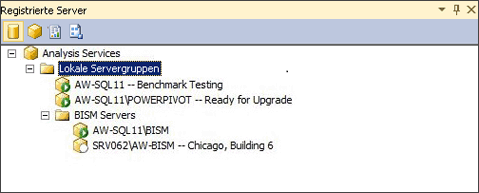

# Registrieren einer Analysis Services-Instanz in einer Servergruppe
[!INCLUDE[ssas-appliesto-sqlas](../../includes/ssas-appliesto-sqlas.md)]Wenn Sie eine große Anzahl von Instanzen von Analysis Services-Server verfügen, können Sie Servergruppen erstellen, in Management Studio, um die serververwaltung zu vereinfachen. Der Zweck einer Servergruppe besteht darin, eine Gruppe verwandter Server innerhalb des Administrationsbereichs zu verknüpfen. Angenommen, Sie sind mit der Verwaltung von zehn separaten Instanzen von Analysis Services betraut worden. Wenn Sie diese Elemente nach Servermodus, Anforderungen an die Betriebszeit oder Abteilung oder Region gruppieren, können Sie Instanzen, die die gleichen Merkmale aufweisen, einfacher anzeigen und eine Verbindung damit herstellen. Sie können auch beschreibende Informationen hinzufügen, mit denen die Nutzung des Servers erläutert wird.  
  
   
  
 Servergruppen können in einer hierarchischen Struktur erstellt werden. Die lokale Servergruppe ist der Stammknoten. Darin sind immer Instanzen von Analysis Services enthalten, die auf dem lokalen Computer ausgeführt werden. Sie können Remoteserver jeder Gruppe hinzufügen, einschließlich der lokalen Gruppe.  
  
 Nachdem Sie eine Servergruppe erstellt haben, müssen Sie den Bereich Registrierte Server verwenden, um die Mitgliedsserver anzuzeigen und eine Verbindung damit herzustellen. In diesem Bereich werden die SQL Server-Instanzen nach Servertyp gefiltert (Datenbankmodul, Analysis Services, Reporting Services und Integration Services). Sie klicken auf einen Servertyp, um die dafür erstellten Servergruppen anzuzeigen. Sie können in der Gruppe auf einen Server doppelklicken, um eine Verbindung mit einem bestimmten Server innerhalb der Gruppe herzustellen.  
  
 Die für den Server definierten Verbindungsinformationen, einschließlich des Servernamens, werden bei der Serverregistrierung gespeichert. Beim Herstellen einer Verbindung zum Server mit anderen Tools können Sie die Verbindungsinformationen nicht ändern und den registrierten Namen nicht verwenden.  
  
## Erstellen einer Servergruppe und Hinzufügen registrierter Server  
  
1.  Klicken Sie in Management Studio im Menü Ansicht auf Registrierte Server, um den Bereich Registrierte Server im Arbeitsbereich zu öffnen. Standardmäßig wird bereits eine lokale Servergruppe erstellt. Alle Instanzen von Analysis Services, die auf dem lokalen Server ausgeführt werden, sind Mitglieder dieser Gruppe.  
  
2.  Klicken Sie mit der rechten Maustaste auf Lokale Servergruppen, wählen Sie Neue Servergruppe aus, und geben Sie der Gruppe einen Namen.  
  
3.  Klicken Sie mit der rechten Maustaste auf die Servergruppe, und wählen Sie Neue Serverregistrierung. Geben Sie den Netzwerknamen eines lokalen Servers oder Remoteservers ein, einschließlich des Instanznamens, wenn der Server als benannte Instanz installiert wurde. Optional können Sie einen registrierten Servernamen angeben, der unter Registrierte Server angezeigt wird. Dieser Name wird nur unter Registrierte Server verwendet. Sie können einen Server damit nicht umbenennen, und Sie können den Namen auch nicht in einer Verbindungszeichenfolge verwenden. Der Name eines registrierten Servers kann beschreibender als der tatsächliche Servername sein oder andere identifizierende Merkmale enthalten, mit denen Sie den Server besser von anderen Servern unterscheiden können.  
  
  
