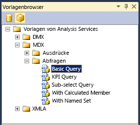

# <a name="use-analysis-services-templates-in-sql-server-management-studio"></a>Verwenden von Analysis Services-Vorlagen in SQL Server Management Studio
  [!INCLUDE[ssManStudioFull](../../includes/ssmanstudiofull-md.md)] stellt einen Satz von Vorlagen bereit, mit deren Hilfe Sie schnell XMLA-Skripts oder DMX/MDX-Abfragen erstellen, KPIs in einem Cube oder einem tabellarischen Modell erstellen, Skripts für Sicherungs- und Wiederherstellungsvorgänge schreiben und viele andere Tasks ausführen können. Die Vorlagen befinden sich im **Vorlagen-Explorer** von [!INCLUDE[ssManStudio](../../includes/ssmanstudio-md.md)].  
  
 Dieses Thema enthält eine Liste der Vorlagen für mehrdimensionale Modelle und tabellarische Modelle sowie Beispiele für die Erstellung einer MDX-Abfrage und XMLA-Anweisung mit dem Metadaten-Explorer und dem Vorlagen-Explorer.  
  
 Dieses Thema enthält folgende Abschnitte:  
  
 [Öffnen einer Analysis Services-Vorlage](#bkmk_usingTE)  
  
 [Erstellen und Ausführen einer MDX-Abfrage für ein tabellarisches Modell mit einer Vorlage](#BKMK_Building_Queries)  
  
 [Erstellen von XMLA-Skript aus einer Vorlage](#bkmk_backup)  
  
 [Generieren einer Schemarowsetabfrage mithilfe einer XMLA-Vorlage](#bkmk_schemarowset)  
  
 [Referenz zu Analysis Services-Vorlagen](#bkmk_Ref)  
  
 In diesem Thema werden DMX-Vorlagen nicht behandelt. Beispiele zum Erstellen von Data Mining-Abfragen mithilfe von Vorlagen finden Sie unter [Erstellen einer DMX-Abfrage in SQL Server Management Studio](../../analysis-services/data-mining/create-a-dmx-query-in-sql-server-management-studio.md) oder [Erstellen einer Singleton-Vorhersageabfrage aus einer Vorlage](../../analysis-services/data-mining/create-a-singleton-prediction-query-from-a-template.md).  
  
##  <a name="bkmk_usingTE"></a> Öffnen einer Analysis Services-Vorlage  
 Alle Vorlagen für Datenbankmodulabfragen und Analysis Services-Abfragen und -Befehle sind im Vorlagen-Explorer verfügbar.  
  
 Wählen Sie zum Öffnen des **Vorlagen-Explorers**im Menü **Ansicht** die entsprechende Option. Klicken Sie auf das Cubesymbol, um eine Liste der Vorlagen anzuzeigen, die für [!INCLUDE[ssASnoversion](../../includes/ssasnoversion-md.md)]verfügbar sind.  
  
   
  
 Klicken Sie zum Öffnen einer Vorlage mit der rechten Maustaste auf den Vorlagennamen, und wählen Sie **Öffnen**aus, oder ziehen Sie die Vorlage in ein bereits geöffnetes Abfragefenster. Nachdem das Abfragefenster geöffnet wurde, können Sie die Befehle der Symbolleiste oder im Menü Abfrage verwenden, um Anweisungen zu erstellen:  
  
-   Klicken Sie auf **Analysieren**, um die Syntax einer Abfrage zu überprüfen.  
  
-   Klicken Sie auf **Ausführen**, um eine Abfrage auszuführen.  
  
     Klicken Sie auf **Ausführung der Abfrage abbrechen**, um eine Abfrage, die ausgeführt wird, zu beenden.  
  
-   Die Ergebnisse einer Abfrage werden auf der Registerkarte **Ergebnisse** im unterem Bereich des Bildschirms angezeigt.  
  
     Wechseln Sie auf die Registerkarte **Meldungen** , um die Anzahl der zurückgegebenen Datensätze, Fehler, Abfrageanweisungen und andere beliebige Meldungen anzuzeigen, die mit der Ausführung der Abfrage verbunden sind. Wenn Sie z. B. eine DAX-Anweisung für ein Modell ausführen, das im Direct Query-Modus ausgeführt wird, wird die vom xVelocity-Modul für Datenanalyse im Arbeitsspeicher (VertiPaq) generierte Transact-SQL-Anweisung angezeigt.  
  
##  <a name="BKMK_Building_Queries"></a> Erstellen und Ausführen einer MDX-Abfrage für ein tabellarisches Modell mit einer Vorlage  
 In diesem Beispiel wird verdeutlicht, wie Sie in SQL Server Management Studio eine MDX-Abfrage erstellen, indem Sie eine tabellarische Modelldatenbank als Datenquelle verwenden. Um dieses Beispiel auf Ihrem Computer zu wiederholen, können Sie das [Adventureworks-Beispielprojekt mit einem tabellarischen Modell herunterladen](http://go.microsoft.com/fwlink/?LinkId=231183).  
  
> [!WARNING]  
>  Es ist nicht möglich, MDX-Abfragen für tabellarische Modelle zu verwenden, die im DirectQuery-Modus bereitgestellt werden. Sie können jedoch äquivalente Abfragen senden, indem Sie die DAX-Tabellenabfragen in Verbindung mit dem EVALUATE-Befehl verwenden. Weitere Informationen finden Sie unter [DAX-Abfrageparameter](http://msdn.microsoft.com/en-us/c5841b4e-3395-4237-815b-9822a691e544).  
  
#### <a name="create-an-mdx-query-from-a-template"></a>Erstellen einer MDX-Abfrage aus einer Vorlage  
  
1.  Öffnen Sie in [!INCLUDE[ssManStudioFull](../../includes/ssmanstudiofull-md.md)]die Instanz, die das abzufragende tabellarische Modell enthält. Klicken Sie mit der rechten Maustaste auf das Datenbanksymbol, und wählen Sie **Neue Abfrage**und anschließend **MDX**aus.  
  
2.  Öffnen Sie im Vorlagenbrowser unter den Analysis Services-Vorlagen die Option **MDX**und dann **Abfragen**. Ziehen Sie **Grundlegende Abfrage** in das Abfragefenster.  
  
3.  Ziehen Sie mithilfe von **Metadaten-Explorer**die folgenden Felder und Measures in die Abfragevorlage:  
  
    1.  Ersetzen Sie \<Row_axis, Mdx_set > mit **[Product Category]. [ Product Category Name]**.  
  
    2.  Ersetzen Sie \<Column_axis, Mdx_set > mit **[Date]. [ Calendar Year]. [Kalenderjahr]** .  
  
    3.  Ersetzen Sie \<From_clause, Mdx_name > mit **[Internet Sales]**.  
  
    4.  Ersetzen Sie \<Where_clause, Mdx_set > mit **[Measures]. [ Internet Total Sales]**.  
  
4.  Sie können die Abfrage unverändert ausführen, aber in den meisten Fällen sind ggf. einige Änderungen erforderlich, z. B. das Hinzufügen einer Funktion zum Zurückgeben bestimmter Elemente. Geben Sie z.B. **.members** nach **[Product Category].[Product Category Name]**ein. Weitere Informationen finden Sie unter [Using Member Expressions](../../mdx/using-member-expressions.md).  
  
##  <a name="bkmk_backup"></a> Erstellen von XMLA-Skript aus einer Vorlage  
 Die XMLA-Befehlsvorlagen, die im Vorlagen-Explorer bereitgestellt werden, können zum Erstellen von Skripts für die Überwachung und Aktualisierung von [!INCLUDE[ssASnoversion](../../includes/ssasnoversion-md.md)] -Objekten verwendet werden. Dies gilt unabhängig davon, ob sich die Instanz im mehrdimensionalen und Data Mining-Modus oder im tabellarischen Modus befindet. Die **XMLA** -Vorlagen enthalten Beispiele für die folgenden Arten von Skripts:  
  
-   Sicherungs-, Wiederherstellungs- und Synchronisierungsvorgänge  
  
-   Abbrechen eines angegebenen Prozesses oder Befehls  
  
-   Verarbeiten eines Objekts  
  
-   Ermitteln von Schemarowsets  
  
-   Überwachen des Serverstatus, z. B. Aufträge, Verbindungen, Transaktionen, Arbeitsspeicher und Leistungsindikatoren  
  
#### <a name="create-a-backup-command-script-from-a-template"></a>Erstellen eines Sicherungsbefehlsskripts aus einer Vorlage  
  
1.  Öffnen Sie in [!INCLUDE[ssManStudioFull](../../includes/ssmanstudiofull-md.md)]die Instanz, auf der die abzufragende Datenbank enthalten ist. Klicken Sie mit der rechten Maustaste auf das Datenbanksymbol, und wählen Sie dann **Neue Abfrage**und **XMLA**aus.  
  
    > [!WARNING]  
    >  Sie können den Kontext einer XMLA-Abfrage nicht festlegen, indem Sie die Einschränkungsliste ändern oder im Verbindungsdialogfeld eine Datenbank angeben. Sie müssen das XMLA-Abfragefenster über die Datenbank öffnen, die Sie abfragen möchten.  
  
2.  Ziehen Sie die Vorlage **Sicherung** in das leere Abfragefenster.  
  
3.  Doppelklicken Sie auf den Text innerhalb der \<DatabaseID > Element.  
  
4.  Wählen Sie im Objekt-Explorer die Datenbank aus, die Sie sichern möchten, und ziehen Sie die Datenbank zwischen die Klammern des DatabaseID-Elements.  
  
5.  Doppelklicken Sie auf den Text innerhalb der \<Datei > Element. Geben Sie den Namen der Sicherungsdatei einschließlich der Dateierweiterung ABF ein. Geben Sie den vollständigen Dateipfad an, falls Sie nicht den Standardspeicherort für Sicherungen verwenden. Weitere Informationen finden Sie unter [Sichern, Wiederherstellen und Synchronisieren von Datenbanken &#40;XMLA&#41;](../../analysis-services/multidimensional-models-scripting-language-assl-xmla/backing-up-restoring-and-synchronizing-databases-xmla.md).  
  
##  <a name="bkmk_schemarowset"></a> Generieren einer Schemarowsetabfrage mithilfe einer XMLA-Vorlage  
 Der **Vorlagen-Explorer** enthält nur eine Vorlage für Schemarowset-Abfragen. Zum Verwenden dieser Vorlage müssen Sie mit den Anforderungen der einzelnen Schemarowsets (und allen erforderlichen Elementen) vertraut sein, die Sie verwenden möchten, sowie mit den Spalten, die als Einschränkungen verwendet werden können. Weitere Informationen finden Sie unter [Analysis Services-Schemarowsets](../../analysis-services/schema-rowsets/analysis-services-schema-rowsets.md).  
  
 Beachten Sie, dass viele Schemarowsets der Einfachheit halber auch als Dynamische Verwaltungssichten (DMVs) verfügbar gemacht wurden. Indem Sie die entsprechende DMV verwenden, können Sie das Schemarowset mit Syntax abfragen, die der Transact-SQL-Syntax gleicht. Die folgenden Abfragen geben z. B. die gleichen Ergebnisse zurück, jedoch einmal im XML-Format und einmal in einem tabellarischen Format. Weitere Informationen zu DMVs finden Sie unter [Verwenden von dynamischen Verwaltungssichten &#40;DMVs&#41; zum Überwachen von Analysis Services](../../analysis-services/instances/use-dynamic-management-views-dmvs-to-monitor-analysis-services.md).  
  
 DMV, die eine Liste aller Schemarowsets zurückgibt, die als DMVs verfügbar sind:  
  
```  
SELECT * FROM $system.DISCOVER_SCHEMA_ROWSETS  
```  
  
 XMLA-Befehl, der eine Liste mit den verfügbaren Schemarowsets zurückgibt:  
  
```  
<Discover xmlns="urn:schemas-microsoft-com:xml-analysis">  
<RequestType>DISCOVER_SCHEMA_ROWSETS</RequestType>  
    <Restrictions>  
<RestrictionList>  
</RestrictionList>  
</Restrictions>  
    <Properties>  
<PropertyList>  
   </PropertyList>  
</Properties>  
</Discover>  
```  
  
#### <a name="get-a-list-of-data-sources-for-a-tabular-model-using-a-schema-rowset-query"></a>Abrufen einer Liste der Datenquellen für ein tabellarisches Modell mithilfe einer Schemarowsetabfrage  
  
1.  Öffnen Sie in [!INCLUDE[ssManStudioFull](../../includes/ssmanstudiofull-md.md)]die Instanz, auf der die abzufragende Datenbank enthalten ist. Klicken Sie mit der rechten Maustaste auf das Datenbanksymbol, und wählen Sie dann **Neue Abfrage**und **XMLA**aus.  
  
    > [!WARNING]  
    >  Sie können den Kontext einer XMLA-Abfrage nicht festlegen, indem Sie die Einschränkungsliste ändern oder im Verbindungsdialogfeld eine Datenbank angeben. Sie müssen das XMLA-Abfragefenster über die Datenbank öffnen, die Sie abfragen möchten.  
  
2.  Öffnen Sie den **Vorlagen-Explorer**, und ziehen Sie die Vorlage **Discover Schema Rowsets**in das leere Abfragefenster.  
  
3.  Ersetzen Sie in der Vorlage der [RequestType-Element &#40; XMLA &#41; ](../../analysis-services/xmla/xml-elements-properties/requesttype-element-xmla.md) Element mit dem folgenden Text:`<RequestType>MDSCHEMA_INPUT_DATASOURCES</RequestType>`  
  
4.  Klicken Sie auf **Ausführen**.  
  
     Erwartete Ergebnisse:  
  
    ```  
    <CATALOG_NAME>AW Internet Sales Tabular Model_ 24715b71-ea74-4828-aefc-d4c12c15db64</CATALOG_NAME>   
    <DATASOURCE_NAME>SqlServer localhost AdventureWorksDW2012</DATASOURCE_NAME>   
    <DATASOURCE_TYPE>Relational</DATASOURCE_TYPE>   
    <CREATED_ON>2011-10-12T20:27:05.196667</CREATED_ON>   
    <LAST_SCHEMA_UPDATE>2011-10-12T20:27:05.196667</LAST_SCHEMA_UPDATE>   
    <DESCRIPTION />   
    <TIMEOUT>0</TIMEOUT>   
    <DBMS_NAME>Microsoft SQL Server</DBMS_NAME>   
    <DBMS_VERSION>11.00.1724</DBMS_VERSION>  
  
    ```  
  
##  <a name="bkmk_Ref"></a> Referenz zu Analysis Services-Vorlagen  
 Die folgenden Vorlagen werden zum Verwenden von Analysis Services-Datenbanken und den Objekten innerhalb der Datenbank bereitgestellt, einschließlich Miningstrukturen und -modellen, Cubes und tabellarischer Modelle:  
  
|Kategorie|Elementvorlage|Description|  
|--------------|-------------------|-----------------|  
|DMX\Modellinhalt|Content Query|Veranschaulicht, wie der DMX SELECT FROM  *\<Modell >*. CONTENT-für-Schritt-Anweisung für das Schemarowsets Miningmodellinhalt für ein bestimmtes Miningmodell abrufen.|  
||Continuous Column Values|Veranschaulicht, wie der DMX SELECT DISTINCT FROM  *\<Modell >* -Anweisung mit der DMX **RangeMin** und **RangeMax** abzurufenden einen Satz von Funktionen Werten innerhalb eines angegebenen Bereichs aus kontinuierlichen Spalten in einem angegebenen Miningmodell.|  
||Discrete Column Values|Veranschaulicht, wie der DMX SELECT DISTINCT FROM  *\<Modell >* Anweisung einen vollständigen Satz von Werten aus diskreten Spalten in einem angegebenen Miningmodell abrufen.|  
||Drillthrough Query|Zeigt, wie Sie mithilfe der DMX-Anweisung SELECT * FROM Modell.CASES in Verbindung mit der DMX-Funktion IsInNode eine Drillthroughabfrage ausführen können.|  
||Modellattribute|Zeigt, wie Sie mithilfe der DMX-Funktion System.GetModelAttributes eine Liste der von einem Modell verwendeten Attribute zurückgeben können.|  
||PMML Content|Veranschaulicht, wie der DMX SELECT \* FROM  *\<Modell >*. PMML-Anweisung zum Abrufen von der Predictive Model Markup Language (PMML) Darstellung des Miningmodells für Algorithmen, die diese Funktionalität unterstützen.|  
|DMX\Modellverwaltung|Add Model|Zeigt, wie Sie mithilfe der DMX-Anweisung ALTER MINING MODEL STRUCTURE ein Miningmodell hinzufügen können.|  
||Clear Model|Zeigt, wie Sie mithilfe der DMX-Anweisung DELETE * FROM MINING MODEL den Inhalt eines angegebenen Miningmodells löschen können.|  
||Clear Structure Cases|Zeigt, wie Sie mithilfe der DMX-Anweisung DELETE FROM MINING STRUCTURE Miningmodell-Strukturfälle löschen können.|  
||Clear Structure|Zeigt, wie Sie mithilfe der DMX-Anweisung DELETE FROM MINING STRUCTURE eine Miningmodellstruktur löschen können.|  
||Create from PMML|Zeigt, wie Sie mithilfe der DMX CREATE MINING MODEL-Anweisung in Verbindung mit der FROM PMML-Klausel ein Miningmodell aus einer PMML-Darstellung erstellen.|  
||Create Structure Nested|Zeigt, wie Sie mithilfe der DMX-Anweisung CREATE MINING STRUCTURE in Verbindung mit einer Definitionsliste für geschachtelte Spalten ein Miningmodell mit geschachtelten Spalten erstellen können.|  
||Create Structure|Zeigt, wie Sie mithilfe der DMX-Anweisung CREATE MINING STRUCTURE ein Miningmodell erstellen können.|  
||Drop Model|Zeigt, wie Sie mithilfe der DMX DROP MINING MODEL-Anweisung ein vorhandenes Miningmodell löschen.|  
||Drop Structure|Zeigt, wie Sie mithilfe der DMX-Anweisung DROP MINING STRUCTURE eine vorhandene Miningstruktur löschen können.|  
||Export Model|Zeigt, wie Sie mithilfe der DMX-Anweisung EXPORT MINING MODEL in Verbindung mit den Klauseln WITH DEPENDENCIES und PASSWORD ein Miningmodell, einschließlich der Datenquelle und der Datenquellensicht, von denen das Miningmodell abhängt, in eine Datei exportieren können.|  
||Export Structure|Zeigt, wie Sie mithilfe der DMX-Anweisung EXPORT MINING STRUCTURE in Verbindung mit der WITH DEPENDENCIES-Klausel eine Miningstruktur, einschließlich sämtlicher in der Miningstruktur enthaltenen Miningmodelle sowie der Datenquelle und der Datenquellensicht, von denen die Miningstruktur abhängt, in eine Datei exportieren können.|  
||Importieren|Zeigt, wie Sie mithilfe der DMX-Anweisung IMPORT FROM in Verbindung mit der WITH PASSWORD-Klausel einen Importvorgang ausführen können.|  
||Rename Model|Zeigt, wie Sie mithilfe der DMX-Anweisung RENAME MINING MODEL ein vorhandenes Miningmodell umbenennen können.|  
||Rename Structure|Zeigt, wie Sie mithilfe der DMX-Anweisung RENAME MINING STRUCTURE eine vorhandene Miningstruktur umbenennen können.|  
||Train Model|Zeigt, wie Sie mithilfe der DMX-Anweisung INSERT INTO MINING MODEL ein Miningmodell innerhalb einer zuvor trainierten Struktur trainieren können.|  
||Train Nested Structure|Zeigt, wie Sie die DMX-Anweisung INSERT INTO MINING STRUCTURE mit der SHAPE-Quelldatenabfrage kombinieren können, um ein Miningmodell, das geschachtelte Spalten enthält, mit Daten zu trainieren, die geschachtelte Tabellen enthalten. Dabei werden die Tabellen mithilfe einer Abfrage aus einer vorhandenen Datenquelle abgerufen.|  
||Train Structure|Zeigt, wie Sie die DMX-Anweisung INSERT INTO MINING STRUCTURE mit der OPENQUERY-Quelldatenabfrage kombinieren können, um eine Miningstruktur zu trainieren.|  
|DMX\Vorhersageabfragen|Base Prediction|Veranschaulicht, wie DMX SELECT FROM kombinieren  *\<Modell >* PREDICTION JOIN-Anweisung mit der OPENQUERY-quelldatenabfrage zum Ausführen einer Vorhersageabfrage für ein Miningmodell mit Rohdaten abgerufen, mithilfe einer Abfrage aus einem vorhandene Datenquelle.|  
||Nested Prediction|Veranschaulicht, wie DMX SELECT FROM kombinieren  *\<Modell >* PREDICTION JOIN-Anweisung mit den Datenquellen Daten Quelldatenabfragen SHAPE und OPENQUERY zum Ausführen einer Vorhersageabfrage für ein Miningmodell mit enthaltenen Daten geschachtelt Tabellen, mithilfe einer Abfrage aus einer vorhandenen Datenquelle abgerufen.|  
||Nested Singleton Prediction|Veranschaulicht, wie DMX SELECT FROM  *\<Modell >* NATURAL PREDICTION JOIN-Klausel, um eine Vorhersageabfrage für ein Miningmodell, das über einen einzelnen Wert, der in der Vorhersageabfrage in einer Spalte explizit angegebener auszuführen dessen Name mit eine Spalte im Miningmodell übereinstimmt, und enthält eine Gruppe von Werten in einer geschachtelten Tabelle erstellt, mit einer UNION-Anweisung, deren Namen ebenfalls mit geschachtelten Spalten im Miningmodell entsprechen.|  
||Singleton Prediction|Veranschaulicht, wie DMX SELECT FROM \<Modell > NATURAL PREDICTION JOIN-Anweisung zum Ausführen einer Vorhersageabfrage für ein Miningmodell, das einen einzelnen Wert, der in in einer Spalte, deren Name eine Spalte in entspricht, der Vorhersageabfrage explizit angegebener Das Miningmodell.|  
||Stored Procedure Call|Zeigt, wie Sie mithilfe der DMX-Anweisung CALL eine gespeicherte Prozedur aufrufen können.|  
|MDX\Ausdrücke|Moving Average-Fixed|Zeigt, wie Sie mit MDX **ParallelPeriod** - und **CurrentMember** -Funktionen bei einer natürlich geordneten Menge ein berechnetes Measure erstellen, das den gleitenden Durchschnitt eines Measures über eine feste Anzahl von Zeiträumen bereitstellt, die in der Hierarchie einer Zeitdimension enthalten sind.|  
||Moving Average-Variable|Zeigt, wie Sie mithilfe der MDX **CASE** -Anweisung innerhalb der **Avg** -Funktion ein berechnetes Measure erstellen, das den gleitenden Durchschnitt eines Measures über eine variable Anzahl von Zeiträumen bereitstellt, die in der Hierarchie einer Zeitdimension enthalten sind.|  
||Periods to Date|Zeigt, wie Sie die MDX **PeriodsToDate** -Funktion in einem berechneten Element verwenden.|  
||Ratio to Parent|Zeigt, wie Sie mithilfe der MDX **Parent** -Funktion ein berechnetes Measure erstellen, das den Verhältnisprozentsatz eines Measures zu jedem untergeordneten Element eines übergeordneten Elements in einer angegebenen Hierarchie darstellt.|  
||Ratio to Total|Zeigt, wie Sie mithilfe des Alle-Elements ein berechnetes Measure erstellen, das den Verhältnisprozentsatz eines Measures zu jedem Element in einer angegebenen Hierarchie darstellt.|  
|MDX\Abfragen|Grundlegende Abfrage|Zeigt eine einfache MDX SELECT-Anweisung, aus der Sie eine MDX-Abfrage erstellen können.|  
||KPI Query|Zeigt, wie Sie mithilfe der Funktionen MDX **KPIValue** und **KPIGoal** KPI-Informationen (Key Performance Indicator) in einer MDX-Abfrage abrufen.|  
||Sub-select Query|Zeigt, wie Sie eine MDX SELECT-Anweisung erstellen, die Informationen aus einem Teilcube, der in einer anderen SELECT-Anweisung definiert ist, abruft.|  
||With Calculated Member|Zeigt, wie Sie mithilfe einer MDX WITH-Klausel in einer SELECT-Anweisung ein berechnetes Mitglied für eine MDX-Abfrage definieren.|  
||With Named Set|Zeigt, wie Sie mithilfe einer MDX WITH-Klausel in einer SELECT-Anweisung eine benannte Menge für eine MDX-Abfrage definieren.|  
|XMLA\Verwaltung|Sicherung|Zeigt, wie Sie mithilfe des Befehls XMLA **Sicherung** eine [!INCLUDE[ssASnoversion](../../includes/ssasnoversion-md.md)] -Datenbank in einer Datei sichern.|  
||Abbrechen|Zeigt, wie Sie mithilfe des XMLA **Cancel** -Befehls alle laufenden Operationen der aktuellen Sitzung (für alle Benutzer außer Administratoren oder Serveradministratoren), Datenbank (für Administratoren) oder Instanz (für Serveradministratoren) abbrechen.|  
||Create Remote Partition Database|Zeigt, wie Sie mithilfe des XMLA **Create** -Befehls in Verbindung mit dem [!INCLUDE[ssASnoversion](../../includes/ssasnoversion-md.md)] Scripting Language-Datenbankelement (ASSL) eine [!INCLUDE[ssASnoversion](../../includes/ssasnoversion-md.md)] -Datenbank und eine Datenquelle zum Speichern von Remotepartitionen erstellen.|  
||Delete|Zeigt, wie Sie mithilfe des Befehls XMLA **Löschen** -Befehls eine vorhandene [!INCLUDE[ssASnoversion](../../includes/ssasnoversion-md.md)] -Datenbank löschen.|  
||Process Dimension|Zeigt, wie Sie mithilfe des XMLA **Batch** -Befehls in Verbindung mit dem **Parallel** -Element und dem **Process** -Befehl die Attribute einer Dimension durch eine parallele Stapeloperation aktualisieren.|  
||Process Partition|Zeigt, wie Sie mithilfe des XMLA **Batch** -Befehls in Verbindung mit dem **Parallel** -Element und dem **Process** -Befehl eine Partition durch eine parallele Stapeloperation vollständig verarbeiten.|  
||Restore|Zeigt, wie Sie mithilfe des Befehls XMLA **Wiederherstellung** -Befehls eine [!INCLUDE[ssASnoversion](../../includes/ssasnoversion-md.md)] -Datenbank aus einer vorhandenen Sicherungsdatei wiederherstellen.|  
||Synchronisieren|Zeigt, wie Sie mithilfe des Befehls XMLA **Synchronisieren** verwenden können, um eine andere [!INCLUDE[ssASnoversion](../../includes/ssasnoversion-md.md)] -Datenbank mit der aktuellen [!INCLUDE[ssASnoversion](../../includes/ssasnoversion-md.md)] database using the SkipMembership option for the SynchronisierenSecurity tag.|  
|XMLA\Schemarowsets|Ermitteln von Schemarowsets|Zeigt, wie Sie mithilfe der XMLA **Discover** -Methode den Inhalt eines DISCOVER_SCHEMA_ROWSETS-Schemarowsets abrufen.|  
|XMLA\Serverstatus|Verbindungen|Zeigt, wie Sie mithilfe der XMLA **Discover** -Methode den Inhalt eines DISCOVER_CONNECTIONS-Schemarowsets abrufen.|  
||Aufträge|Zeigt, wie Sie mithilfe der XMLA **Discover** -Methode den Inhalt eines DISCOVER_JOBS-Schemarowsets abrufen.|  
||Speicherorte|Zeigt, wie Sie mithilfe der XMLA **Discover** -Methode den Inhalt des DISCOVER_LOCATIONS-Schemarowsets unter Angabe des Pfads zum Standort der Sicherungsdateien abrufen.|  
||Locks|Zeigt, wie Sie mithilfe der XMLA **Discover** -Methode den Inhalt eines DISCOVER_LOCKS-Schemarowsets abrufen.|  
||Memory Grant|Zeigt, wie Sie mithilfe der XMLA **Discover** -Methode den Inhalt eines DISCOVER_MEMORYGRANT-Schemarowsets abrufen.|  
||Performance Counters|Zeigt, wie Sie mithilfe der XMLA **Discover** -Methode den Inhalt eines DISCOVER_PERFORMANCE_COUNTERS-Schemarowsets abrufen.|  
||Sitzungen|Zeigt, wie Sie mithilfe der XMLA **Discover** -Methode den Inhalt eines DISCOVER_SESSIONS-Schemarowsets abrufen.|  
||Traces|Zeigt, wie Sie mithilfe der XMLA **Discover** -Methode den Inhalt eines DISCOVER_TRACES-Schemarowsets abrufen.|  
||Transaktionen|Zeigt, wie Sie mithilfe der XMLA **Discover** -Methode den Inhalt eines DISCOVER_TRANSACTIONS-Schemarowsets abrufen.|  
  
## <a name="see-also"></a>Siehe auch  
 [Multidimensional Expressions &#40;MDX&#41; – Referenz](../../mdx/multidimensional-expressions-mdx-reference.md)   
 [Data Mining-Erweiterungen &#40;DMX&#41; – Referenz](../../dmx/data-mining-extensions-dmx-reference.md)   
 [Analysis Services Scripting Language &#40;ASSL für XMLA&#41;](../../analysis-services/scripting/analysis-services-scripting-language-assl-for-xmla.md)   
 [Analysis Services Scripting Language &#40; ASSL XMLA &#41;](../../analysis-services/scripting/analysis-services-scripting-language-assl-for-xmla.md)  
  
  

