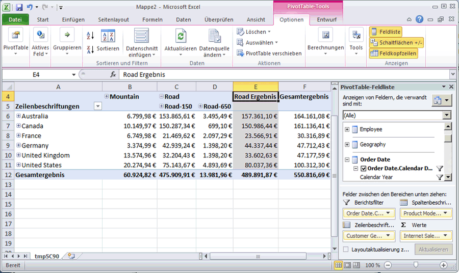

# Lektion 3 bis 5 – Durchsuchen des bereitgestellten Cubes
In der folgenden Aufgabe durchsuchen Sie den [!INCLUDE[ssASnoversion](../includes/ssasnoversion-md.md)] Tutorial-Cube. Da Measures in der Analyse dimensionsübergreifend verglichen werden, verwenden Sie zum Durchsuchen von Daten eine Excel-PivotTable. Mithilfe einer PivotTable lassen sich Kunden-, Datums- und Produktinformationen auf verschiedenen Achsen platzieren. So können Sie verfolgen, wie sich die Internetverkäufe ändern, wenn sie für bestimmte Zeiträume, Kundendemografien und Produktlinien angezeigt werden.  
  
### So durchsuchen Sie den bereitgestellten Cube  
  
1.  Doppelklicken Sie auf den Cube [!INCLUDE[ssBIDevStudio](../includes/ssbidevstudio-md.md)]-Tutorial **[!INCLUDE[ssASnoversion](../includes/ssasnoversion-md.md)] , der sich im Ordner** Cubes **des Projektmappen-Explorers befindet, um zum Cube-Designer in** zu wechseln.  
  
2.  Öffnen Sie die Registerkarte **Browser** , und klicken Sie dann auf der Symbolleiste des Designers auf die Schaltfläche **Verbindung wiederherstellen** .  
  
3.  Klicken Sie auf das Excel-Symbol, um Excel zu starten, wobei die Arbeitsbereichsdatenbank als Datenquelle verwendet wird. Sobald Sie aufgefordert werden, Verbindungen zu aktivieren, klicken Sie auf **Aktivieren**.  
  
4.  Erweitern Sie in der PivotTable-Feldliste **Internet Sales**, und ziehen Sie dann das **Sales Amount** -Measure in den Bereich **Werte** .  
  
5.  Erweitern Sie in der PivotTable-Feldliste den Eintrag **Product**.  
  
6.  Ziehen Sie die **Product Model Lines** -Benutzerhierarchie in den Bereich **Spalten** .  
  
7.  Erweitern Sie in der PivotTable-Feldliste die Option **Customer**, erweitern Sie **Location**, und ziehen Sie die **Customer Geography** -Hierarchie aus dem Anzeigeordner **Location** in der Customer-Dimension in den Bereich Zeilen.  
  
8.  Erweitern Sie in der PivotTable-Feldliste den Eintrag **Order Date**, und ziehen Sie dann die **Order Date.Calendar Date** -Hierarchie in den Bereich **Berichtsfilter** .  
  
9. Klicken Sie auf den Filter rechts vom Filter **Order Date.Calendar Date** im Datenbereich, deaktivieren Sie das Kontrollkästchen für die Ebene **(Alle)** , erweitern Sie **2006**&gt; **H1 CY 2006**&gt; **Q1 CY 2006**, aktivieren Sie das Kontrollkästchen für **Februar 2006**, und klicken Sie anschließend auf **OK**.  
  
    Internetverkäufe nach Region und Produktgruppe für den Monat Februar 2006 werden wie im folgenden Bild angezeigt.  
  
      
  
## Nächste Lektion  
[Lektion 4: Definieren von erweiterten Attributen und Dimensionseigenschaften](../analysis-services/lesson-4-defining-advanced-attribute-and-dimension-properties.md)  
  
  
  

