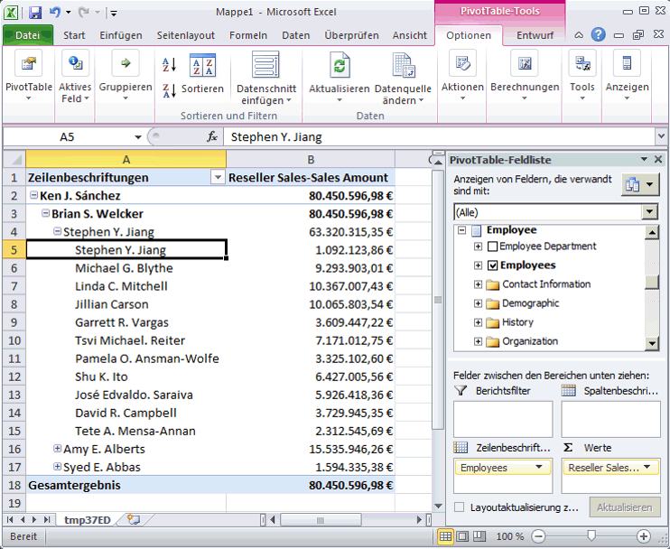
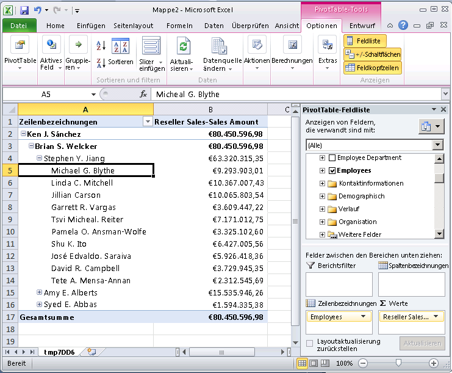

# Lektion 4-2: Definieren von Eigenschaften des übergeordneten Attributs in einer über-/ Unterordnungshierarchie
Eine Hierarchie mit über- und untergeordneten Elementen ist eine Hierarchie in einer Dimension, die auf zwei Tabellenspalten basiert. Zusammen definieren diese Spalten die hierarchischen Beziehungen zwischen den Elementen der Dimension. Die erste Spalte, die so genannte *Elementschlüsselspalte*, identifiziert jedes Dimensionselement. Die zweite Spalte, die so genannte *übergeordnete Spalte*, identifiziert das übergeordnete Element der einzelnen Dimensionselemente. Die **NamingTemplate** -Eigenschaft eines übergeordneten Attributs bestimmt den Namen jeder Ebene in der Über-/Unterordnungshierarchie, und die **MembersWithData** -Eigenschaft bestimmt, ob Daten für übergeordnete Elemente angezeigt werden sollen.  
  
Weitere Informationen finden Sie unter [Über- und untergeordnete Dimensionen](../analysis-services/multidimensional-models/parent-child-dimension.md), [Attribute in über- und untergeordneten Hierarchien](../analysis-services/multidimensional-models/parent-child-dimension-attributes.md)  
  
> [!NOTE]  
> Wenn Sie zum Erstellen einer Dimension den Dimensions-Assistenten verwenden, werden vom Assistenten Tabellen erkannt, die Über-/Unterordnungsbeziehungen enthalten, und die Über-/Unterordnungshierarchie wird automatisch definiert.  
  
In den Aufgaben dieses Themas erstellen Sie eine Benennungsvorlage, durch die der Name für jede Ebene in der Über-/Unterordnungshierarchie in der **Employee** -Dimension definiert wird. Anschließend konfigurieren Sie das übergeordnete Attribut zum Ausblenden aller übergeordneten Daten, sodass nur die Verkäufe für Blattebenenelemente angezeigt werden.  
  
## Durchsuchen der Employee-Dimension  
  
1.  Doppelklicken Sie im Projektmappen-Explorer im Ordner **Dimensionen** auf **Employee.dim** , um den Dimensions-Designer für die Employee-Dimension zu öffnen.  
  
2.  Klicken Sie auf die Registerkarte **Browser** , überprüfen Sie, ob in der Liste **Hierarchie** der Eintrag **Employees** ausgewählt ist, und erweitern Sie anschließend das **All Employees** -Element.  
  
    Beachten Sie, dass **Ken J. Sánchez** der Manager der obersten Ebene in dieser Über-/Unterordnungshierarchie ist.  
  
3.  Wählen Sie das Element **Ken J. Sánchez** aus.  
  
    Beachten Sie, dass der Ebenenname für dieses Element **Level 02** ist. (Der Ebenenname wird nach **Aktuelle Ebene** direkt über dem **All Employees**-Element angezeigt.) In der nächsten Aufgabe definieren Sie mehr beschreibende Namen für jede Ebene.  
  
4.  Erweitern Sie **Ken J. Sánchez**, um die Namen der Angestellten anzuzeigen, die Berichte für diesen Manager verfassen, und wählen Sie anschließend **Brian S. Welcker** aus, um den Namen dieser Ebene anzuzeigen.  
  
    Beachten Sie, dass der Ebenenname für dieses Element **Level 03**ist.  
  
5.  Doppelklicken Sie im Projektmappen-Explorer im Ordner **Cubes** auf **Analysis Services Tutorial.cube** , um den Cube-Designer für den [!INCLUDE[ssASnoversion](../includes/ssasnoversion-md.md)] Tutorial-Cube zu öffnen.  
  
6.  Klicken Sie auf die Registerkarte **Browser** .  
  
7.  Klicken Sie auf das Excel-Symbol und anschließend auf **Aktivieren** , sobald Sie zum Aktivieren von Verbindungen aufgefordert werden.  
  
8.  Erweitern Sie in der PivotTable-Feldliste **Reseller Sales**. Ziehen Sie **Reseller Sales-Sales Amount** in den Bereich Werte.  
  
9. Erweitern Sie in der PivotTable-Feldliste **Employee**, und ziehen Sie anschließend die **Employees** -Hierarchie in den Bereich **Zeilen** .  
  
    Alle Elemente der Employees-Hierarchie werden der Spalte A des PivotTable-Berichts hinzugefügt.  
  
    In der folgenden Abbildung wird die erweiterte Employees-Hierarchie angezeigt.  
  
10.   
  
    Beachten Sie, dass die von jedem Manager in Ebene 03 gemachten Verkäufe auch in Ebene 04 angezeigt werden. Das liegt daran, dass jeder Manager auch ein Mitarbeiter eines anderen Managers ist. In der nächsten Aufgabe blenden Sie diese Verkaufszahlen aus.  
  
## Ändern von Eigenschaften des übergeordneten Attributs in der Employee-Dimension.  
  
1.  Wechseln Sie zum Dimensions-Designer für die **Employee** -Dimension.  
  
2.  Klicken Sie auf die Registerkarte **Dimensionsstruktur** , und wählen Sie anschließend die **Employees** -Attributhierarchie im Bereich **Attribute** aus.  
  
    Beachten Sie das eindeutige Symbol für dieses Attribut. Dieses Symbol gibt an, dass das Attribut der übergeordnete Schlüssel in einer Über-/Unterordnungshierarchie ist. Beachten Sie ebenso, dass im Eigenschaftenfenster die **Verwendung** -Eigenschaft für das Attribut als **Übergeordnet**definiert ist. Diese Eigenschaft wurde vom Dimensions-Assistenten festgelegt, als die Dimension entworfen wurde. Der Assistent hat die Über-/Unterordnungsbeziehung automatisch erkannt.  
  
3.  Klicken Sie im Eigenschaftenfenster auf die Schaltfläche mit den drei Punkten (**...**) in der **NamingTemplate** -Eigenschaftenzelle.  
  
    Im Dialogfeld **Vorlage zur Ebenenbenennung** definieren Sie die Vorlage zur Ebenenbenennung, durch die die Ebenennamen in der Über-/Unterordnungshierarchie bestimmt werden, die Benutzern beim Durchsuchen von Cubes angezeigt werden.  
  
4.  Geben Sie in der zweiten Zeile, der **\***-Zeile, **Employee Level \*** in der Spalte **Name** ein, und klicken Sie anschließend auf die dritte Zeile.  
  
    Beachten Sie unter **Ergebnis**, dass jede Ebene jetzt „Employee Level“ gefolgt von einer zunehmenden Nummer benannt wird.  
  
    Die folgende Abbildung zeigt die Änderungen im Dialogfeld **Vorlage zur Ebenenbenennung** .  
  
    ")  
  
5.  Klicken Sie auf **OK**.  
  
6.  Wählen Sie im Eigenschaftenfenster für das **Employees** -Attribut in der **MembersWithData** -Eigenschaftenzelle **NonLeafDataHidden** aus, um diesen Wert für das **Employees** -Attribut zu ändern.  
  
    Dadurch werden Daten ausgeblendet, die mit Mitgliedern auf einer Nichtblattebene in der Über-/Unterordnungshierarchie verknüpft sind.  
  
## Durchsuchen der Employee-Dimension mit den geänderten Attributen  
  
1.  Klicken Sie im Menü **Erstellen** von [!INCLUDE[ssBIDevStudioFull](../includes/ssbidevstudiofull-md.md)]auf **Analysis Services Tutorial bereitstellen**.  
  
2.  Wechseln Sie nach erfolgreichem Abschluss der Bereitstellung zum Cube-Designer für den [!INCLUDE[ssASnoversion](../includes/ssasnoversion-md.md)] Tutorial-Cube, und klicken Sie auf der Symbolleiste der Registerkarte **Browser** auf **Verbindung wiederherstellen** .  
  
3.  Klicken Sie auf das Excel-Symbol und anschließend auf **Aktivieren**.  
  
4.  Ziehen Sie **Reseller Sales-Sales Amount** in den Bereich Werte.  
  
5.  Ziehen Sie die **Employees** -Hierarchie in den Bereich Zeilenbezeichnungen.  
  
    Die folgende Abbildung zeigt die Änderungen, die Sie an der Employees-Hierarchie vorgenommen haben. Beachten Sie, dass Stephen Y. Jiang nicht mehr als sein eigener Mitarbeiter angezeigt wird.  
  
      
  
## Nächste Aufgabe in der Lektion  
[Automatisches Gruppieren von Attributelementen](../analysis-services/lesson-4-3-automatically-grouping-attribute-members.md)  
  
## Siehe auch  
[Über- und untergeordnete Dimensionen](../analysis-services/multidimensional-models/parent-child-dimension.md)  
[Attribute in über- und untergeordneten Hierarchien](../analysis-services/multidimensional-models/parent-child-dimension-attributes.md)  
  
  
  
