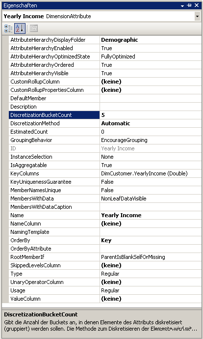
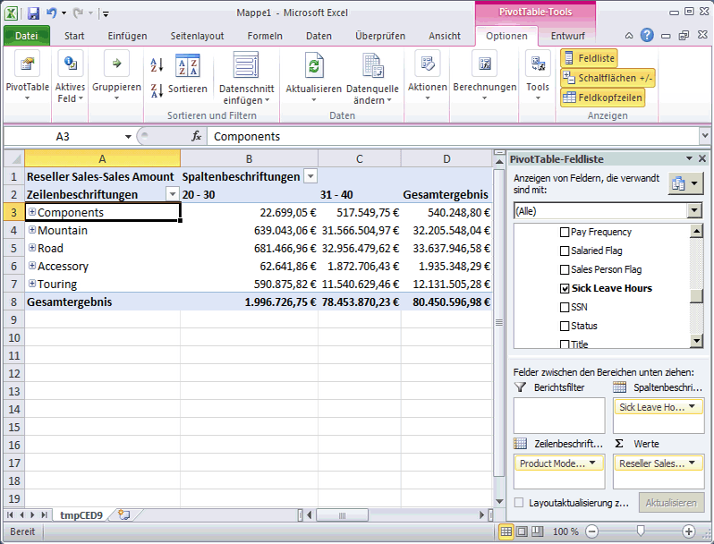

# Lektion 4-3 - automatisch Gruppieren von Attributelementen
[!INCLUDE[ssas-appliesto-sqlas](../includes/ssas-appliesto-sqlas.md)]Wenn Sie einen Cube durchsuchen, dimension, die Sie in der Regel die Elemente einer Attributhierarchie nach den Elementen einer anderen Attributhierarchie. Sie können beispielsweise Kundenverkäufe nach der Stadt, dem erworbenen Produkt oder dem Geschlecht gruppieren. Bei bestimmten Attributtypen ist es allerdings sinnvoll, von [!INCLUDE[msCoName](../includes/msconame-md.md)] [!INCLUDE[ssASnoversion](../includes/ssasnoversion-md.md)] automatisch Gruppierungen von Attributelementen erstellen zu lassen, die auf der Verteilung der Elemente innerhalb einer Attributhierarchie basieren. Sie können beispielsweise von [!INCLUDE[ssASnoversion](../includes/ssasnoversion-md.md)] Gruppen der jährlichen Einkommenswerte für Kunden erstellen lassen. Es werden dann für Benutzer, die die Attributhierarchie durchsuchen, die Namen und Werte der Gruppen anstelle der Elemente selbst angezeigt. Dadurch wird die Anzahl der Ebenen beschränkt, die für Benutzer angezeigt werden, was für die Analyse sinnvoller sein kann.  
  
Von der Eigenschaft **DiscretizationMethod** wird bestimmt, ob von [!INCLUDE[ssASnoversion](../includes/ssasnoversion-md.md)] Gruppierungen erstellt werden, sowie der Typ der Gruppierung, die durchgeführt wird. Standardmäßig werden von [!INCLUDE[ssASnoversion](../includes/ssasnoversion-md.md)] keine Gruppierungen ausgeführt. Es ist beim Aktivieren der automatischen Gruppierungen möglich, von [!INCLUDE[ssASnoversion](../includes/ssasnoversion-md.md)] automatisch die beste Gruppierungsmethode basierend auf der Struktur des Attributs bestimmen zu lassen. Sie können auch einen der Gruppierungsalgorithmen in der folgenden Liste auswählen, um die Gruppierungsmethode anzugeben:  
  
**EqualAreas**  
[!INCLUDE[ssASnoversion](../includes/ssasnoversion-md.md)] erstellt Gruppenbereiche, sodass alle Dimensionselemente gleichmäßig über die Gruppen verteilt werden.  
  
**Clusters**  
[!INCLUDE[ssASnoversion](../includes/ssasnoversion-md.md)] erstellt Gruppen durch eindimensionales Clustering auf den Eingabewerten mithilfe der K-Means-Clusteringmethode mit Gauß'schen Verteilungen. Diese Option ist nur für numerische Spalten gültig.  
  
Nach dem Angeben einer Gruppierungsmethode müssen Sie die Anzahl von Gruppen angeben, indem Sie die **DiscretizationBucketCount** -Eigenschaft verwenden. Weitere Informationen finden Sie unter [Gruppieren von Attributelementen &#40;Diskretisierung&#41;](../analysis-services/multidimensional-models/attribute-properties-group-attribute-members.md)  
  
In den Aufgaben in diesem Thema aktivieren Sie verschiedene Gruppierungstypen für Folgendes: die jährlichen Einkommenswerte in der **Customer** -Dimension, die Anzahl der krankheitsbedingten Ausfallstunden von Angestellten in der **Employees** -Dimension und die Anzahl der Urlaubsstunden der Angestellten in der **Employees** -Dimension. Sie verarbeiten und durchsuchen dann den [!INCLUDE[ssASnoversion](../includes/ssasnoversion-md.md)] Tutorial-Cube, um die Auswirkung der Elementgruppen anzuzeigen. Schließlich ändern Sie die Elementgruppeneigenschaften, um die Auswirkung der Änderung im Gruppierungstyp anzuzeigen.  
  
## Gruppieren von Attributhierarchieelementen in der Customer-Dimension  
  
1.  Doppelklicken Sie im Projektmappen-Explorer im Ordner **Dimensionen** auf **Customer** , um den Dimensions-Designer für die Customer-Dimension zu öffnen.  
  
2.  Klicken Sie in der **Datenquellensicht** mit der rechten Maustaste auf die **Customer** -Tabelle und anschließend auf **Daten durchsuchen**.  
  
    Beachten Sie den Wertebereich der **YearlyIncome** -Spalte. Diese Werte werden zu den Elementen der **Yearly Income** -Attributhierarchie, es sei denn Sie aktivieren die Elementgruppierung.  
  
3.  Schließen Sie die Registerkarte **Customer-Tabelle durchsuchen** .  
  
4.  Wählen Sie im Bereich **Attribute** den Eintrag **Yearly Income**aus.  
  
5.  Ändern Sie im Eigenschaftenfenster den Wert für die **DiscretizationMethod** -Eigenschaft in **Automatisch** , und ändern Sie den Wert für die **DiscretizationBucketCount** -Eigenschaft in **5**.  
  
    Die folgende Abbildung zeigt die geänderten Eigenschaften für **Yearly Income**.  
  
      
  
## Gruppieren von Attributhierarchieelementen in der Employee-Dimension  
  
1.  Wechseln Sie zum Dimensions-Designer für die Employee-Dimension.  
  
2.  Klicken Sie im Bereich **Datenquellensicht** mit der rechten Maustaste auf die **Employee** -Tabelle und anschließend auf **Daten durchsuchen**.  
  
    Beachten Sie die Werte für die **SickLeaveHours** -Spalte und die **VacationHours** -Spalte.  
  
3.  Schließen Sie die Registerkarte **Employee-Tabelle durchsuchen** .  
  
4.  Wählen Sie im Bereich **Attribute** den Eintrag **Sick Leave Hours**aus.  
  
5.  Ändern Sie im Eigenschaftenfenster den Wert für die **DiscretizationMethod** -Eigenschaft in **Clusters** , und ändern Sie den Wert für die **DiscretizationBucketCount** -Eigenschaft in **5**.  
  
6.  Wählen Sie im Bereich **Attribute** den Eintrag **Vacation Hours**aus.  
  
7.  Ändern Sie im Eigenschaftenfenster den Wert für die **DiscretizationMethod** -Eigenschaft in **Equal Areas** , und ändern Sie den Wert für die **DiscretizationBucketCount** -Eigenschaft in **5**.  
  
## Durchsuchen der geänderten Attributhierarchien  
  
1.  Klicken Sie im Menü **Erstellen** von [!INCLUDE[ssBIDevStudioFull](../includes/ssbidevstudiofull-md.md)]auf **Analysis Services Tutorial bereitstellen**.  
  
2.  Wechseln Sie nach erfolgreichem Abschluss der Bereitstellung zum Cube-Designer für den [!INCLUDE[ssASnoversion](../includes/ssasnoversion-md.md)] Tutorial-Cube, und klicken Sie anschließend auf der Registerkarte **Browser** auf **Verbindung wiederherstellen** .  
  
3.  Klicken Sie auf das Excel-Symbol und anschließend auf **Aktivieren**.  
  
4.  Ziehen Sie das **Internet Sales-Sales Amount** -Measure in der PivotTable-Feldliste in den Bereich Werte.  
  
5.  Erweitern Sie in der Feldliste die **Product** -Dimension, und ziehen Sie die **Product Model Lines** -Benutzerhierarchie in der Feldliste in den Bereich **Zeilenbezeichnungen** .  
  
6.  Erweitern Sie in der Feldliste die **Customer** -Dimension und anschließend den Anzeigeordner **Demographic** . Ziehen Sie dann die **Yearly Income** -Attributhierarchie in den Bereich **Spaltenbezeichnungen** .  
  
    Die Elemente der **Yearly Income** -Attributhierarchie sind jetzt in sechs Buckets gruppiert, einschließlich eines Buckets für Verkäufe an Kunden mit unbekanntem jährlichen Einkommen. Nicht alle Buckets werden angezeigt.  
  
7.  Entfernen Sie die **Yearly Income** -Attributhierarchie aus dem Spaltenbereich, und entfernen Sie das **Internet Sales-Sales Amount** Measure aus dem Bereich **Werte** .  
  
8.  Fügen Sie dem Datenbereich das Measure **Reseller Sales-Sales Amount** hinzu.  
  
9. Erweitern Sie in der Feldliste die **Employee** -Dimension, erweitern Sie **Organization**, und ziehen Sie anschließend **Sick Leave Hours** auf **Spaltenbezeichnungen**.  
  
    Beachten Sie, dass alle Verkäufe von Angestellten innerhalb einer von zwei Gruppen vorgenommen werden. Beachten Sie auch, dass die Angestellten mit 32–42 krankheitsbedingten Ausfallstunden wesentlich mehr Verkäufe vorgenommen haben als Angestellte mit 20–31 krankheitsbedingten Ausfallstunden.  
  
    Die folgende Abbildung zeigt Verkäufe dimensioniert nach krankheitsbedingten Ausfallstunden der Angestellten.  
  
      
  
10. Entfernen Sie die **Sick Leave Hours** -Attributhierarchie aus dem Spaltenbereich des Bereichs **Daten** .  
  
11. Fügen Sie **Vacation Hours** zum Spaltenbereich des Bereichs **Daten** hinzu.  
  
    Beachten Sie, dass zwei Gruppen basierend auf der Equal Areas-Gruppierungsmethode angezeigt werden. Drei andere Gruppen sind ausgeblendet, weil sie keine Datenwerte enthalten.  
  
## Ändern von Gruppierungseigenschaften und Überprüfen der Auswirkung der Änderungen  
  
1.  Wechseln Sie zum Dimensions-Designer für die **Employee** -Dimension, und wählen Sie anschließend **Vacation Hours** im Bereich **Attribute** aus.  
  
2.  Ändern Sie im Fenster Eigenschaften den Wert der **DiscretizationBucketCount** -Eigenschaft in **10**.  
  
3.  Klicken Sie im Menü **Erstellen** von [!INCLUDE[ssBIDevStudio](../includes/ssbidevstudio-md.md)]auf **Analysis Services Tutorial bereitstellen**.  
  
4.  Wechseln Sie nach erfolgreichem Abschluss der Bereitstellung zurück zum Cube-Designer für den [!INCLUDE[ssASnoversion](../includes/ssasnoversion-md.md)] Tutorial-Cube.  
  
5.  Klicken Sie auf der Registerkarte **Browser** auf **Verbindung wiederherstellen** , klicken Sie auf das Excel-Symbol, und rekonstruieren Sie anschließend die PivotTable, um die Auswirkung der Änderung auf die Gruppierungsmethode zu sehen:  
  
    1.  Ziehen Sie Reseller Sales-Sales Amount auf Werte.  
  
    2.  Ziehen Sie Vacation Hours (im Ordner Employees Organization) auf Spalten.  
  
    3.  Ziehen Sie Product Model Lines auf Zeilen.  
  
    Beachten Sie, dass jetzt drei Gruppen von Elementen des **Vacation Hours** -Attributs vorhanden sind, die Verkaufswerte für Produkte aufweisen. Die anderen sieben Gruppen enthalten Elemente ohne Verkaufsdaten.  
  
## Nächste Aufgabe in dieser Lektion  
[Ausblenden und Deaktivieren von Attributhierarchien](../analysis-services/lesson-4-4-hiding-and-disabling-attribute-hierarchies.md)  
  
## Weitere Informationen finden Sie unter  
[Gruppieren von Attributelementen &#40;Diskretisierung&#41;](../analysis-services/multidimensional-models/attribute-properties-group-attribute-members.md)  
  
  
  
