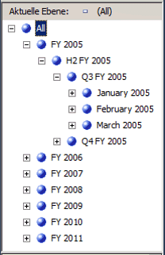
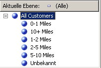
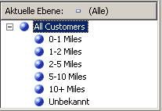

# Lektion 4-5: Sortieren von Attributelementen basierend auf einem sekundären Attribut
In Lektion 3 haben Sie das Sortieren von Attributelementen basierend auf ihrem Namen oder ihrem Schlüsselwert kennen gelernt. Sie haben sich auch mit der Verwendung eines zusammengesetzten Elementschlüssels in Bezug auf Attributelemente und Sortierreihenfolge vertraut gemacht. Weitere Informationen finden Sie unter [Ändern der Date-Dimension](../analysis-services/lesson-3-4-modifying-the-date-dimension.md). Wenn jedoch weder der Name noch der Schlüssel des Attributs die von Ihnen gewünschte Sortierreihenfolge ermöglicht, müssen Sie Attributelemente basierend auf einem sekundären Attribut sortieren, um die gewünschte Sortierreihenfolge zu erhalten. Wenn zwischen den Attributen eine Beziehung definiert wurde, können Sie das zweite Attribut verwenden, um die Elemente des ersten Attributs zu sortieren.  
  
Attributbeziehungen definieren die Beziehungen oder Abhängigkeiten zwischen Attributen. In einer Dimension, die auf einer einzelnen relationalen Tabelle basiert, sind typischerweise alle Attribute durch das Schlüsselattribut miteinander verknüpft. Der Grund hierfür ist, dass alle Attribute für eine Dimension Informationen zu den Elementen bereitstellen, die über das Schlüsselattribut der Dimension mit den Fakten in der Faktentabelle für jede verbundene Measuregruppe verknüpft sind. In einer Dimension, die auf mehreren Tabellen basiert, sind Elemente typischerweise basierend auf dem Joinschlüssel zwischen den Tabellen verknüpft. Verknüpfte Attribute können verwendet werden, um eine Sortierreihenfolge anzugeben, wenn dies durch die zugrunde liegenden Daten unterstützt wird. Sie können z. B. ein neues Attribut erstellen, das die Sortierlogik für ein verknüpftes Attribut bereitstellt.  
  
Mithilfe des Dimensions-Designers können Sie zusätzliche Beziehungen zwischen Attributen definieren oder die Standardbeziehungen ändern, um die Leistung zu verbessern. Die wesentliche Einschränkung beim Erstellen einer Attributbeziehung liegt darin, sicherzustellen, dass das Attribut, auf das verwiesen wird, nicht mehr als einen Wert für jeweils ein Element in dem Attribut aufweist, mit dem es verknüpft ist. Wenn Sie eine Beziehung zwischen zwei Attributen definieren, können Sie die Beziehung fest oder flexibel definieren, basierend darauf, ob sich die Beziehungen zwischen Elementen mit der Zeit ändern. Ein Angestellter kann beispielsweise in eine andere Verkaufsregion ziehen, aber eine Stadt zieht nicht in ein anderes Land bzw. in eine andere Region. Wenn eine Beziehung als fest definiert ist, werden Attributaggregationen nicht jedes Mal neu berechnet, wenn die Dimension inkrementell verarbeitet wird. Allerdings muss die Dimension vollständig verarbeitet werden, wenn sich die Beziehung zwischen Elementen ändert. Weitere Informationen finden Sie unter [Attributbeziehungen](../analysis-services/multidimensional-models-olap-logical-dimension-objects/attribute-relationships.md), [Definieren von Attributbeziehungen](../analysis-services/multidimensional-models/attribute-relationships-define.md), [Konfigurieren von Attributbeziehungseigenschaften](../analysis-services/multidimensional-models/attribute-relationships-configure-attribute-properties.md)und [Angeben von Attributbeziehungen zwischen Attributen in einer benutzerdefinierten Hierarchie](../analysis-services/4-6-specifying-attribute-relationships-in-user-defined-hierarchy.md).  
  
In den Aufgaben in diesem Thema definieren Sie ein neues Attribut in der **Date** -Dimension basierend auf einer vorhandenen Spalte in der zugrunde liegenden Dimensionstabelle. Sie verwenden dieses neue Attribut zum chronologischen statt alphabetischen Sortieren von Kalendermonatselementen. Sie definieren auch ein neues Attribut in der **Customer** -Dimension basierend auf der benannten Berechnung, die Sie zum Sortieren der **Commute Distance** -Attributelemente verwenden werden. In den Aufgaben des nächsten Themas lernen Sie, Attributbeziehungen zum Verbessern der Abfrageleistung zu verwenden.  
  
## Definieren einer Attributbeziehung und Sortierreihenfolge in der Date-Dimension  
  
1.  Öffnen Sie den Dimensions-Designer für die **Date** -Dimension, und überprüfen Sie anschließend die **OrderBy** -Eigenschaft für das **Month Name** -Attribut im Fenster Eigenschaften.  
  
    Beachten Sie, dass die **Month Name** -Attributelemente nach ihren Schlüsselwerten sortiert sind.  
  
2.  Wechseln Sie zur Registerkarte **Browser** , überprüfen Sie, ob **Calendar Date** in der **Hierarchie** -Liste ausgewählt ist, und erweitern Sie anschließend die Ebenen in der benutzerdefinierten Hierarchie, um die Sortierreihenfolge für die Kalendermonate zu überprüfen.  
  
    Beachten Sie, dass die Elemente der Attributhierarchie nach den ASCII-Werten ihrer Elementschlüssel sortiert sind, also Monat und Jahr. In diesem Fall werden Kalendermonate durch das Sortieren nach Attributname oder Schlüssel nicht chronologisch sortiert. Sortieren Sie die Elemente der Attributhierarchie basierend auf einem neuen Attribut, dem **MonthNumberOfYear** -Attribut, um dieses Problem zu lösen. Sie erstellen dieses Attribut basierend auf einer Spalte, die in der **Date** -Dimensionstabelle vorhanden ist.  
  
3.  Wechseln Sie zur Registerkarte **Dimensionsstruktur** für die Date-Dimension, klicken Sie mit der rechten Maustaste auf **MonthNumberOfYear** im Bereich **Datenquellensicht** und anschließend auf **Neues Attribut aus Spalte**.  
  
4.  Wählen Sie im Bereich **Attribute** **Month Number Of Year**aus, und legen Sie anschließend im Eigenschaftenfenster die Eigenschaft **AttributeHierarchyEnabled** auf **False** , die Eigenschaft **AttributeHierarchyOptimizedState** auf **NotOptimized**und die Eigenschaft **AttributeHierarchyOrdered** auf **False**fest.  
  
    Diese Einstellungen blenden das Attribut Benutzern gegenüber aus und verbessern die Verarbeitungszeit. Dieses Attribut wird nicht zum Durchsuchen verwendet. Es wird nur zum Sortieren der Elemente eines anderen Attributs verwendet.  
  
    > [!NOTE]  
    > Diese Aufgabe wird durch alphabetisches Sortieren der Eigenschaften im Eigenschaftenfenster vereinfacht, da diese drei Eigenschaften nebeneinander sortiert werden.  
  
5.  Klicken Sie auf die Registerkarte **Attributbeziehungen** .  
  
    Beachten Sie, dass alle Attribute in der **Date** -Dimension direkt mit dem **Date** -Attribut verknüpft sind, bei dem es sich um den Elementschlüssel handelt, der die Dimensionselemente mit den Fakten in den verbundenen Measuregruppen verknüpft. Zwischen den Attributen **Month Name** und **Month Number Of Year** ist keine Beziehung definiert.  
  
6.  Klicken Sie im Diagramm mit der rechten Maustaste auf das Attribut **Month Name** und wählen Sie **Neue Attributbeziehung**aus.  
  
7.  Im Dialogfeld **Attributbeziehung erstellen** lautet das **Quellattribut** **Month Name**. Legen Sie die Option **Verknüpftes Attribut** auf **Month Number Of Year**fest.  
  
8.  Stellen Sie in der Liste **Beziehungstyp** den Beziehungstyp auf **Fest**ein.  
  
    Die Beziehungen zwischen den Elementen des **Month Name** - und des **Month Number Of Year** -Attributs ändern sich nicht mit der Zeit. Daher löscht Analysis Services während der inkrementellen Verarbeitung keine Aggregationen für diese Beziehung. Wenn eine Änderung vorgenommen wird, kommt es während der inkrementellen Verarbeitung zu einem Verarbeitungsfehler, und Sie müssen eine vollständige Verarbeitung der Dimension ausführen. Sie können nun die Sortierreihenfolge für die Elemente von **Month Name**festlegen.  
  
9. [!INCLUDE[clickOK](../includes/clickok-md.md)]  
  
10. Klicken Sie auf die Registerkarte **Dimensionsstruktur** .  
  
11. Wählen Sie im Bereich **Attribute** **Month Name** aus, und ändern Sie den Wert der **OrderBy** -Eigenschaft im Eigenschaftenfenster zu **AttributeKey** , und den Wert der **OrderByAttribute** -Eigenschaft zu **Month Number Of Year**.  
  
12. Klicken Sie im Menü **Erstellen** auf **Analysis Services Tutorial bereitstellen**.  
  
13. Wechseln Sie nach erfolgreichem Abschluss der Bereitstellung zur Registerkarte **Browser** für die Date-Dimension, klicken Sie auf **Verbindung wiederherstellen**, und durchsuchen Sie anschließend die Benutzerhierarchien **Calendar Date** und **Fiscal Date** , um zu überprüfen, ob die Monate jetzt in chronologischer Reihenfolge sortiert sind.  
  
    Beachten Sie, dass die Monate jetzt in chronologischer Ordnung sortiert sind, wie im folgenden Bild zu sehen.  
  
      
  
## Definieren von Attributbeziehungen und der Sortierreihenfolge in der Customer-Dimension  
  
1.  Wechseln Sie im Dimensions-Designer für die Customer-Dimension zur Registerkarte **Browser** , und durchsuchen Sie anschließend die Elemente der **Commute Distance** -Attributhierarchie.  
  
    Beachten Sie, dass die Elemente dieser Attributhierarchie nach den ASCII-Werten des Elementschlüssels sortiert sind. In diesem Fall werden die Pendlerentfernungen durch das Sortieren nach Attributname oder Schlüssel nicht von der geringsten zur höchsten Entfernung sortiert. In dieser Aufgabe sortieren Sie die Elemente der Attributhierarchie basierend auf der benannten Berechnung **CommuteDistanceSort** , die die entsprechende Sortiernummer jedem eindeutigen Wert in der Spalte zuschreibt. Um Zeit zu sparen, wurde diese benannte Berechnung bereits zur **Customer** -Tabelle in der [!INCLUDE[ssSampleDBCoShort](../includes/sssampledbcoshort-md.md)] DW-Datenquellensicht hinzugefügt. Sie können zu dieser Datenquellensicht wechseln, um das in dieser benannten Berechnung verwendete SQL-Skript anzuzeigen. Weitere Informationen finden Sie unter [Definieren von benannten Berechnungen in einer Datenquellensicht &#40;Analysis Services&#41;](../analysis-services/multidimensional-models/define-named-calculations-in-a-data-source-view-analysis-services.md).  
  
    Die folgende Abbildung zeigt die Elemente der **Commute Distance** -Attributhierarchie sortiert nach den ASCII-Werten des Elementschlüssels.  
  
      
  
2.  Wechseln Sie zur Registerkarte **Dimensionsstruktur** im Dimensions-Designer für die Customer-Dimension, klicken Sie mit der rechten Maustaste auf **CommuteDistanceSort** in der **Customer** -Tabelle im Bereich **Datenquellensicht** und anschließend auf **Neues Attribut aus Spalte**.  
  
3.  Wählen Sie im Bereich **Attribute** **Commute Distance Sort**aus, und legen Sie im Eigenschaftenfenster die Eigenschaft **AttributeHierarchyEnabled** für dieses Attribut auf **False** fest. Legen Sie zusätzlich die Eigenschaft **AttributeHierarchyOptimizedState** auf **NotOptimized**und die Eigenschaft **AttributeHierarchyOrdered** auf **False**fest.  
  
    Diese Einstellungen blenden das Attribut Benutzern gegenüber aus und verbessern die Verarbeitungszeit. Dieses Attribut wird nicht zum Durchsuchen verwendet. Es wird nur zum Sortieren der Elemente eines anderen Attributs verwendet.  
  
4.  Wählen Sie **Geography**aus, und legen Sie die im Fenster Eigenschaften die Eigenschaft **AttributeHierarchyVisible** auf **False** fest. Legen Sie zusätzlich die Eigenschaft **AttributeHierarchyOptimizedState** auf **NotOptimized**und die Eigenschaft **AttributeHierarchyOrdered** auf **False**fest.  
  
    Diese Einstellungen blenden das Attribut Benutzern gegenüber aus und verbessern die Verarbeitungszeit. Dieses Attribut wird nicht zum Durchsuchen verwendet. Es wird nur zum Sortieren der Elemente eines anderen Attributs verwendet. Da **Geography** über Elementeigenschaften verfügt, muss seine **AttributeHierarchyEnabled** -Eigenschaft auf **True**festgelegt werden. Zum Ausblenden des Attributs legen Sie daher die **AttributeHierarchyVisible** -Eigenschaft auf **False**fest.  
  
5.  Klicken Sie auf die Registerkarte **Attributbeziehungen** .  
  
6.  Klicken Sie in der Attributliste mit der rechten Maustaste auf das **Commute Distance** -Attribut, und wählen Sie anschließend **Neue Attributbeziehung**.  
  
7.  Im Dialogfeld **Attributbeziehung erstellen** ist das **Quellattribut** **Commute Distance**. Legen Sie die Option **Verknüpftes Attribut** auf **Commute Distance Sort**fest.  
  
8.  Stellen Sie in der Liste **Beziehungstyp** den Beziehungstyp auf **Fest**ein.  
  
    Die Beziehung zwischen den Elementen der Attribute **Commute Distance** und **Commute Distance Sort** ändern sich nicht mit der Zeit.  
  
9. [!INCLUDE[clickOK](../includes/clickok-md.md)]  
  
    Sie können jetzt die Sortierreihenfolge für das **Commute Distance** -Attribut festlegen.  
  
10. Klicken Sie auf die Registerkarte **Dimensionsstruktur** .  
  
11. Wählen Sie im Bereich **Attribute** **Commute Distance**aus, und ändern Sie anschließend im Eigenschaftenfenster den Wert der Eigenschaft **OrderBy** zu **AttributeKey**und den Wert der Eigenschaft **OrderByAttribute** zu **Commute Distance Sort**.  
  
12. Klicken Sie im Menü **Erstellen** auf **Analysis Services Tutorial bereitstellen**.  
  
13. Wechseln Sie nach erfolgreichem Abschluss der Bereitstellung zur Registerkarte **Browser** des Dimensions-Designers für die Customer-Dimension, klicken Sie auf **Verbindung wiederherstellen**, und durchsuchen Sie anschließend die **Commute Distance** -Attributhierarchie.  
  
    Beachten Sie, dass die Hierarchieelemente jetzt in einer logischen Reihenfolge basierend auf zunehmender Entfernung sortiert sind, wie im folgenden Bild zu sehen.  
  
      
  
## Nächste Aufgabe in der Lektion  
[Angeben von Attributbeziehungen zwischen Attributen in einer benutzerdefinierten Hierarchie](../analysis-services/4-6-specifying-attribute-relationships-in-user-defined-hierarchy.md)  
  
  
  

