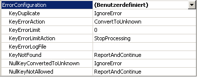
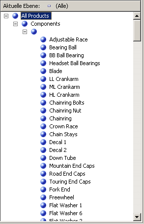
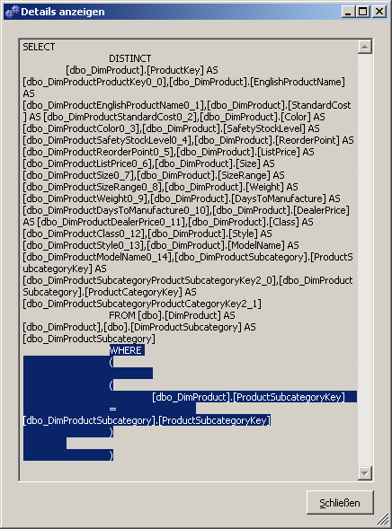
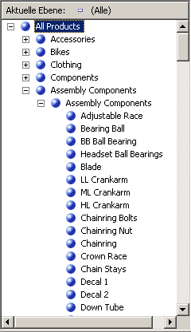

# Lektion 4-7 – the Unknown Member and Null Processing Eigenschaften definieren
Wenn von [!INCLUDE[ssASnoversion](../includes/ssasnoversion-md.md)] eine Dimension verarbeitet wird, werden die Attribute in der Dimension durch alle unterschiedlichen Werte aus den zugrunde liegenden Spalten in den Tabellen oder Ansichten in der Datenquellensicht aufgefüllt. Wenn [!INCLUDE[ssASnoversion](../includes/ssasnoversion-md.md)] bei der Verarbeitung auf einen NULL-Wert stößt, wird dieser standardmäßig für numerische Spalten in einen Nullwert oder für Zeichenfolgenspalten in eine leere Zeichenfolge konvertiert. Sie können diese Standardeinstellungen ändern oder NULL-Werte in Ihrem Extrahierungs-, Transformations- und Ladeprozess (falls vorhanden) des zu Grunde liegenden relationalen Data Warehouse konvertieren. Darüber hinaus können Sie den NULL-Wert auch von [!INCLUDE[ssASnoversion](../includes/ssasnoversion-md.md)] in einen festgelegten Wert konvertieren lassen. Zu diesem Zweck konfigurieren Sie drei Eigenschaften: die **UnknownMember** - und die **UnknownMemberName** -Eigenschaften für die Dimension und die **NullProcessing** -Eigenschaft für das Schlüsselattribut der Dimension.  
  
Der Dimensions-Assistent und der Cube-Assistent aktivieren diese Eigenschaften ordnungsgemäß, je nachdem, ob das Schlüsselattribut einer Dimension NULL-Werte zulässt oder ob das Stammattribut einer Schneeflockendimension auf einer Spalte basiert, die NULL-Werte zulässt. In diesen Fällen wird die **NullProcessing** -Eigenschaft des Schlüsselattributs auf **UnknownMember** und die **UnknownMember** -Eigenschaft auf **Sichtbar**festgelegt.  
  
Wenn Sie jedoch Schneeflockendimensionen inkrementell erstellen, wie es bei der Product-Dimension in diesem Tutorial der Fall ist, oder wenn Sie Dimensionen mithilfe des Dimensions-Designers erstellen und anschließend diese vorhandenen Dimensionen in einen Cube integrieren, müssen die Eigenschaften **UnknownMember** und **NullProcessing** unter Umständen manuell festgelegt werden.  
  
In den Aufgaben in diesem Thema fügen Sie die Produktkategorie- und Produktunterkategorieattribute der Product-Dimension aus der Schneeflockentabelle hinzu, die Sie der [!INCLUDE[ssSampleDBCoShort](../includes/sssampledbcoshort-md.md)] DW-Datenquellensicht hinzufügen werden. Sie aktivieren dann die **UnknownMember** -Eigenschaft für die Product-Dimension, geben **Assembly Components** als Wert für die **UnknownMemberName** -Eigenschaft an, ordnen die **Subcategory** - und **Category** -Attribute dem Produktnamensattribut zu und definieren anschließend eine benutzerdefinierte Fehlerbehandlung für das Elementschlüsselattribut, das die Schneeflockentabellen verknüpft.  
  
> [!NOTE]  
> Wenn Sie die Attribute Subcategory und Category bei der Definition des [!INCLUDE[ssASnoversion](../includes/ssasnoversion-md.md)] Tutorial-Cubes mithilfe des Cube-Assistenten hinzugefügt haben, wurden diese Schritte bereits automatisch ausgeführt.  
  
## Überprüfen der Fehlerbehandlung und der Eigenschaften unbekannter Elemente in der Product-Dimension  
  
1.  Wechseln Sie zum Dimensions-Designer für die **Product** -Dimension, klicken Sie auf die Registerkarte **Dimensionsstruktur** , und wählen Sie anschließend im Bereich **Attribute** den Eintrag **Product** aus.  
  
    Damit können die Eigenschaften der Dimension selbst angezeigt und geändert werden.  
  
2.  Überprüfen Sie im Eigenschaftenfenster den Wert für die Eigenschaften **UnknownMember** und **UnknownMemberName** .  
  
    Beachten Sie, dass die **UnknownMember** -Eigenschaft nicht aktiviert ist, weil ihr Wert auf **Keine** anstatt auf **Sichtbar** oder **Ausgeblendet**festgelegt ist, und dass kein Name für die **UnknownMemberName** -Eigenschaft angegeben ist.  
  
3.  Wählen Sie im Fenster Eigenschaften **(Benutzerdefiniert)** in der Eigenschaftenzelle **ErrorConfiguration** aus, und erweitern Sie anschließend die **ErrorConfiguration** -Eigenschaftssammlung.  
  
    Durch Festlegen der **ErrorConfiguration** -Eigenschaft auf **(Benutzerdefiniert)** können Sie die Standardfehlerkonfigurationseinstellungen anzeigen. Es werden dadurch keine Einstellungen geändert.  
  
4.  Überprüfen Sie dann die Schlüssel- und NULL-Schlüsselkonfigurationseigenschaften. Ändern Sie diese aber nicht.  
  
    Beachten Sie, dass standardmäßig beim Konvertieren von NULL-Schlüsseln in das unbekannte Element der Verarbeitungsfehler im Zusammenhang mit dieser Konvertierung ignoriert wird.  
  
    Die folgende Abbildung zeigt die Eigenschaftseinstellungen für die Eigenschaftssammlung **ErrorConfiguration** .  
  
      
  
5.  Klicken Sie auf die Registerkarte **Browser** , überprüfen Sie, ob **Produktmodellgruppen** in der **Hierarchie** -Liste ausgewählt ist, und erweitern Sie anschließend **All Products**.  
  
    Beachten Sie die fünf Elemente der Produktgruppe-Ebene.  
  
6.  Erweitern Sie **Komponenten**und anschließend das unbeschriftete Element der **Modellname** -Ebene.  
  
    Diese Ebene enthält die Assemblykomponenten, die beim Erstellen anderer Komponenten verwendet werden, beginnend mit dem **Adjustable Race** -Produkt, so wie im folgenden Bild gezeigt.  
  
      
  
## Definieren von Attributen von Schneeflockentabellen und einer benutzerdefinierten Produktkategoriehierarchie  
  
1.  Öffnen Sie den Datenquellensicht-Designer für die [!INCLUDE[ssSampleDBCoShort](../includes/sssampledbcoshort-md.md)] DW-Datenquellensicht, wählen Sie **Reseller Sales** im Bereich **Diagrammplaner** aus, und klicken Sie anschließend im Menü **Datenquellensicht** von **auf Objekte** hinzufügen/entfernen [!INCLUDE[ssBIDevStudioFull](../includes/ssbidevstudiofull-md.md)].  
  
    Das Dialogfeld **Tabellen hinzufügen/entfernen** wird geöffnet.  
  
2.  Wählen Sie in der **Liste Eingeschlossene Objekte** den Eintrag **DimProduct (dbo)**aus, und klicken Sie anschließend auf **Verknüpfte Tabellen hinzufügen**.  
  
    Sowohl **DimProductSubcategory (dbo)** als auch **FactProductInventory (dbo)** werden hinzugefügt. Entfernen Sie **FactProductInventory (dbo)** , damit der Liste **Eingeschlossene Objekte** nur die **DimProductSubcategory (dbo)** -Tabelle hinzugefügt wird.  
  
3.  Die **DimProductSubcategory (dbo)** -Tabelle wird standardmäßig als die zuletzt hinzugefügte Tabelle ausgewählt. Klicken Sie erneut auf **Verknüpfte Tabellen hinzufügen** .  
  
    Die **DimProductCategory (dbo)** -Tabelle wird der Liste **Eingeschlossene Objekte** hinzugefügt.  
  
4.  Klicken Sie auf **OK**.  
  
5.  Zeigen Sie im Menü **Format** von [!INCLUDE[ssBIDevStudio](../includes/ssbidevstudio-md.md)]auf **Automatisches Layout**, und klicken Sie anschließend auf **Diagramm**.  
  
    Beachten Sie, dass die **DimProductSubcategory (dbo)** -Tabelle und die **DimProductCategory (dbo)** -Tabelle miteinander und auch mit der **ResellerSales** -Tabelle durch die **Product** -Tabelle verknüpft sind.  
  
6.  Wechseln Sie zum Dimensions-Designer für die **Product** -Dimension, und klicken Sie anschließend auf die Registerkarte **Dimensionsstruktur** .  
  
7.  Klicken Sie mit der rechten Maustaste auf eine beliebige Stelle im Bereich **Datenquellensicht** und anschließend auf **Alle Tabellen anzeigen**.  
  
8.  Suchen Sie im Bereich **Datenquellensicht** die **DimProductCategory** -Tabelle, klicken Sie mit der rechten Maustaste auf **ProductCategoryKey** in dieser Tabelle und anschließend auf **Neues Attribut aus Spalte**.  
  
9. Ändern Sie im Bereich **Attribute** den Namen dieses neuen Attributs in **Category**.  
  
10. Klicken Sie im Fenster „Eigenschaften“ in das Eigenschaftenfeld **NameColumn** und anschließend auf die Schaltfläche zum Durchsuchen (**…**), um das Dialogfeld **Namensspalte** zu öffnen.  
  
11. Wählen Sie **EnglishProductCategoryName** in der Liste **Quellspalte** aus, und klicken Sie auf **OK**.  
  
12. Suchen Sie im Bereich **Datenquellensicht** die **DimProductSubcategory** -Tabelle, klicken Sie mit der rechten Maustaste auf **ProductSubcategoryKey** in dieser Tabelle und anschließend auf **Neues Attribut aus Spalte**.  
  
13. Ändern Sie im Bereich **Attribute** den Namen dieses neuen Attributs in **Subcategory**.  
  
14. Klicken Sie im Fenster „Eigenschaften“ in das Eigenschaftenfeld **NameColumn** und anschließend auf die Schaltfläche zum Durchsuchen ( **…** ), um das Dialogfeld **Namensspalte** zu öffnen.  
  
15. Wählen Sie **EnglishProductSubcategoryName** in der **Quellspalte** -Liste aus, und klicken Sie auf **OK**.  
  
16. Erstellen Sie eine neue benutzerdefinierte Hierarchie mit dem Namen **Product Categories** mit den folgenden Ebenen (von oben nach unten): **Category**, **Subcategory**und **Product Name**.  
  
17. Geben Sie **All Products** als Wert für die **AllMemberName** -Eigenschaft der benutzerdefinierten Product Categories-Hierarchie an.  
  
## Durchsuchen der benutzerdefinierten Hierarchien in der Product-Dimension  
  
1.  Klicken Sie auf der Symbolleiste der Registerkarte **Dimensionsstruktur** von **Dimensions-Designer** für die **Product** -Dimension auf **Verarbeiten**.  
  
2.  Klicken Sie auf **Ja** , um das Projekt zu erstellen und bereitzustellen und anschließend auf **Ausführen** , um die **Product** -Dimension zu verarbeiten.  
  
3.  Erweitern Sie nach erfolgreicher Verarbeitung im Dialogfeld **Verarbeitungsstatus** den Eintrag **Die Verarbeitung von Dimension 'Product' wurde erfolgreich abgeschlossen** , erweitern Sie **Die Verarbeitung von Dimensionsattribut 'Product Name' wurde erfolgreich abgeschlossen**, und erweitern Sie anschließend **SQL-Abfragen 1**.  
  
4.  Klicken Sie auf die SELECT DISTINCT-Abfrage und anschließend auf **Details anzeigen**.  
  
    Beachten Sie, dass eine WHERE-Klausel der SELECT DISTINCT-Klausel hinzugefügt wurde, durch die diejenigen Produkte entfernt werden, die keinen Wert in der ProductSubcategoryKey-Spalte aufweisen, wie im folgenden Bild zu sehen.  
  
      
  
5.  Klicken Sie dreimal auf **Schließen** um alle Verarbeitungsdialogfelder zu schließen.  
  
6.  Klicken Sie im Dimensions-Designer für die **Product** -Dimension auf die Registerkarte **Browser** und anschließend auf **Verbindung wiederherstellen**.  
  
7.  Überprüfen Sie, ob **Product Model Lines** in der Liste **Hierarchie** angezeigt wird. Erweitern Sie **All Products**und anschließend **Components**.  
  
8.  Wählen Sie in der Liste **Hierarchie** den Eintrag **Product Categories** aus, erweitern Sie **All Products**und anschließend **Components**.  
  
    Beachten Sie, dass keine der Assemblykomponenten angezeigt wird.  
  
Um das in der vorherigen Aufgabe angegebene Verhalten zu ändern, aktivieren Sie die **UnknownMember** -Eigenschaft der Products-Dimension, legen einen Wert für die **UnknownMemberName** -Eigenschaft fest, legen die **NullProcessing** -Eigenschaft für die **Subcategory** - und **Model Name** -Attribute auf **UnknownMember**fest, definieren das **Category** -Attribut als zugehöriges Attribut des **Subcategory** -Attributs und definieren anschließend das **Product Line** -Attribut als zugehöriges Attribut des **Model Name** -Attributs. Durch diese Schritte verwendet [!INCLUDE[ssASnoversion](../includes/ssasnoversion-md.md)] den Namenswert des unbekannten Elements für jedes Produkt, das keinen Wert für die **SubcategoryKey** -Spalte aufweist. Dies wird in der folgenden Aufgabe gezeigt.  
  
## Aktivieren des unbekannten Elements, Definieren von Attributbeziehungen und Angeben von benutzerdefinierten Verarbeitungseigenschaften für NULL-Werte  
  
1.  Klicken Sie im Dimensions-Designer für die **Product** -Dimension auf die Registerkarte **Dimensionsstruktur** , und wählen Sie anschließend im Bereich **Attribute** den Eintrag **Product** aus.  
  
2.  Ändern Sie im Fenster **Eigenschaften** die **UnknownMember** -Eigenschaft in **Sichtbar**und anschließend den Wert für die **UnknownMemberName** -Eigenschaft in **Assembly Components**.  
  
    Durch das Ändern der **UnknownMember** -Eigenschaft in **Sichtbar** oder **Ausgeblendet** wird die **UnknownMember** -Eigenschaft für die Dimension aktiviert.  
  
3.  Klicken Sie auf die Registerkarte **Attributbeziehungen** .  
  
4.  Klicken Sie im Diagramm mit der rechten Maustaste auf das **Subcategory** -Attribut, und wählen Sie anschließend **Neue Attributbeziehung**aus.  
  
5.  Im Dialogfeld **Attributbeziehung erstellen** ist das **Quellattribut** **Subcategory**. Legen Sie den Wert **Verknüpftes Attribut** auf **Category**fest. Lassen Sie den Beziehungstyp auf **Flexibel**eingestellt.  
  
6.  [!INCLUDE[clickOK](../includes/clickok-md.md)]  
  
7.  Wählen Sie im Bereich **Attribute** den Eintrag **Subcategory**aus.  
  
8.  Erweitern Sie im Fenster Eigenschaften die **KeyColumns** -Eigenschaft und anschließend die **DimProductSubcategory.ProductSubcategoryKey (Integer)** -Eigenschaft.  
  
9. Ändern Sie die **NullProcessing** -Eigenschaft in **UnknownMember**.  
  
10. Wählen Sie im Bereich **Attribute** den Eintrag **Model Name**aus.  
  
11. Erweitern Sie im Fenster Eigenschaften die **KeyColumns** -Eigenschaft und anschließend die **Product.ModelName (WChar)** -Eigenschaft.  
  
12. Ändern Sie die **NullProcessing** -Eigenschaft in **UnknownMember**.  
  
    Aufgrund dieser Änderungen werden, wenn während der Verarbeitung in [!INCLUDE[ssASnoversion](../includes/ssasnoversion-md.md)] ein NULL-Wert für das **Subcategory** -Attribut oder das **Model Name** -Attribut festgestellt wird, das unbekannte Element als Schlüsselwert ersetzt und die benutzerdefinierten Hierarchien ordnungsgemäß erstellt.  
  
## Erneutes Durchsuchen der Product-Dimension  
  
1.  Klicken Sie im Menü **Erstellen** auf **Analysis Services Tutorial bereitstellen**.  
  
2.  Klicken Sie nach erfolgreichem Abschluss der Bereitstellung im Dimensions-Designer für die **Product** -Dimension auf die Registerkarte **Browser** und anschließend auf **Verbindung wiederherstellen**.  
  
3.  Überprüfen Sie, ob **Product Categories** in der **Hierarchie** -Liste ausgewählt ist, und erweitern Sie anschließend **All Products**.  
  
    Beachten Sie, dass Assembly Components als neues Element auf der Category-Ebene angezeigt wird.  
  
4.  Erweitern Sie das **Assembly Components** -Element der **Category** -Ebene und anschließend das **Assembly Components** -Element der **Subcategory** -Ebene.  
  
    Beachten Sie, dass die Assemblykomponenten jetzt auf der **Product Name** -Ebene angezeigt werden, so wie in der folgenden Abbildung zu sehen ist.  
  
      
  
## Nächste Lektion  
[Lektion 5: Definieren von Beziehungen zwischen Dimensionen und Measuregruppen](../analysis-services/lesson-5-defining-relationships-between-dimensions-and-measure-groups.md)  
  
  
  

