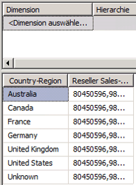

# Lektion 5-1: Definieren einer referenzierten Beziehung
Bis zu diesem Punkt im Lernprogramm basierte jede von Ihnen definierte Cubedimension auf einer Tabelle, die direkt mit der Faktentabelle für eine Measuregruppe durch eine Primärschlüssel/Fremdschlüssel-Beziehung verknüpft war. In den Aufgaben in diesem Thema verknüpfen Sie die **Geography** -Dimension mit der Faktentabelle für Händlerverkäufe über die **Reseller** -Dimension, die als *Referenzdimension*bezeichnet wird. Dadurch können Benutzer Händlerverkäufe nach Geografie dimensionieren. Weitere Informationen finden Sie unter [Definieren einer Beziehung, auf die verwiesen wird, und deren Eigenschaften](../analysis-services/multidimensional-models/define-a-referenced-relationship-and-referenced-relationship-properties.md).  
  
## Dimensionieren von Händlerverkäufen nach Geografie  
  
1.  Klicken Sie im Projektmappen-Explorer mit der rechten Maustaste im Ordner **Cubes** auf **Analysis Services Tutorial** und anschließend auf **Durchsuchen**.  
  
2.  Entfernen Sie alle Hierarchien aus dem Datenbereich, und überprüfen Sie anschließend, ob das **Reseller Sales-Sales Amount** -Measure im Datenbereich angezeigt wird. Fügen Sie das Measure im Bedarfsfall zum Datenbereich hinzu.  
  
3.  Ziehen Sie aus der **Geography** -Dimension im Metadatenbereich die benutzerdefinierte **Geography** -Hierarchie in den **Bereich zum Ablegen von Zeilenfeldern** des Datenbereichs.  
  
    Beachten Sie, dass das **Reseller Sales-Sales Amount** -Measure durch die **Country-Region** -Attributelemente in der **Regions** -Hierarchie nicht richtig dimensioniert ist. Der Wert für **Reseller Sales-Sales Amount** wird für jedes **Country-Region** -Attributelement wiederholt.  
  
      
  
4.  Öffnen Sie den Datenquellensicht-Designer für die **Adventure Works DW 2012** -Datenquellensicht.  
  
5.  Zeigen Sie im Bereich **Diagrammplaner** die Beziehung zwischen der **Geography** -Tabelle und der **ResellerSales** -Tabelle an.  
  
    Beachten Sie, dass es keinen direkten Link zwischen diesen Tabellen gibt. Entweder durch die **Reseller** -Tabelle oder die **SalesTerritory** -Tabelle ist jedoch ein indirekter Link zwischen diesen Tabellen vorhanden.  
  
6.  Doppelklicken Sie auf den Pfeil, der die Beziehung zwischen der **Geography** -Tabelle und der **Reseller** -Tabelle darstellt.  
  
    Beachten Sie im Dialogfeld **Beziehung bearbeiten** , dass die **GeographyKey** -Spalte der Primärschlüssel in der **Geography** -Tabelle und der Fremdschlüssel in der **Reseller** -Tabelle ist.  
  
7.  Klicken Sie auf **Abbrechen**, wechseln Sie zum Cube-Designer für den [!INCLUDE[ssASnoversion](../includes/ssasnoversion-md.md)] Tutorial-Cube, und klicken Sie anschließend auf die Registerkarte **Dimensionsverwendung** .  
  
    Beachten Sie, dass die Cubedimension **Geography** aktuell keine Beziehung zur **Internet Sales** -oder **Reseller Sales** -Measuregruppe aufweist.  
  
8.  Klicken Sie auf die Schaltfläche mit den Auslassungspunkten (**…**) in der Zelle **Full Name** am Schnittpunkt der **Customer** -Dimension und der **Internet Sales** -Measuregruppe.  
  
    Beachten Sie im Dialogfeld **Beziehung definieren** , dass eine Beziehung vom Typ **Regulär** zwischen der **DimCustomer** -Dimensionstabelle und der **FactInternetSales** -Measuregruppentabelle basierend auf der **CustomerKey** -Spalte in jeder dieser Tabellen definiert ist. Alle von Ihnen innerhalb dieses Lernprogramms bis zu diesem Punkt definierten Beziehungen waren reguläre Beziehungen.  
  
    Die folgende Abbildung zeigt das Dialogfeld **Beziehung definieren** mit einer regulären Beziehung zwischen der **DimCustomer** -Dimensionstabelle und der **FactInternetSales** -Measuregruppentabelle.  
  
    ")  
  
9. Klicken Sie auf **Abbrechen**.  
  
10. Klicken Sie auf die Schaltfläche mit den drei Punkten (**…**) in der unbenannten Zelle am Schnittpunkt der **Geography** -Dimension und der **Reseller Sales** -Measuregruppe.  
  
    Beachten Sie im Dialogfeld **Beziehung definieren** , dass aktuell keine Beziehung zwischen der Geography-Cubedimension und der Reseller Sales-Measuregruppe definiert ist. Sie können keine reguläre Beziehung definieren, weil keine direkte Beziehung zwischen der Dimensionstabelle für die Geography-Dimension und der Faktentabelle für die Reseller Sales-Measuregruppe vorhanden ist.  
  
11. Wählen Sie in der Liste **Beziehungstyp auswählen** die Option **Referenziert**.  
  
    Sie definieren eine referenzierte Beziehung, indem Sie eine Dimension angeben, die direkt mit der Measuregruppentabelle verbunden ist (eine so genannte *Zwischendimension*), die von [!INCLUDE[ssASnoversion](../includes/ssasnoversion-md.md)] zum Verknüpfen der Referenzdimension mit der Faktentabelle verwendet werden kann. Sie geben dann das Attribut an, durch das die Referenzdimension mit der Zwischendimension verknüpft wird.  
  
12. Wählen Sie in der **Zwischendimension** -Liste **Reseller**aus.  
  
    Die zugrundeliegende Tabelle für die Geography-Dimension ist mit der Faktentabelle durch die zugrundeliegende Tabelle für die Reseller-Dimension verknüpft.  
  
13. Wählen Sie in der **Bezugsdimensionsattribut** -Liste **Geography Key**aus, und versuchen Sie anschließend, **Geography Key** in der **Zwischendimensionsattribut** -Liste auszuwählen.  
  
    Beachten Sie, dass **Geography Key** nicht in der **Zwischendimensionsattribut** -Liste angezeigt wird. Der Grund dafür ist, dass die **GeographyKey** -Spalte nicht als Attribut in der **Reseller** -Dimension definiert ist.  
  
14. Klicken Sie auf **Abbrechen**.  
  
In der nächsten Aufgabe lösen Sie dieses Problem, indem Sie ein Attribut definieren, das auf der GeographyKey-Spalte in der Reseller-Dimension basiert.  
  
## Definieren des Zwischendimensionsattributs und der referenzierten Dimensionsbeziehung  
  
1.  Öffnen Sie den Dimensions-Designer für die **Reseller** -Dimension, und zeigen Sie die Spalten in der **Reseller** -Tabelle im Bereich **Datenquellensicht** und die definierten Attribute in der **Reseller** -Dimension im Bereich **Attribute** an.  
  
    Beachten Sie, dass trotz der Definition von GeographyKey als Spalte in der Reseller-Tabelle kein Dimensionsattribut in der Reseller-Dimension basierend auf dieser Spalte definiert ist. Geography ist als ein Dimensionsattribut in der Geography-Dimension definiert, weil es sich dabei um die Schlüsselspalte handelt, durch die die zugrundeliegende Tabelle für diese Dimension mit der Faktentabelle verknüpft wird.  
  
2.  Um ein **Geography Key** -Attribut zur **Reseller** -Dimension hinzuzufügen, klicken Sie mit der rechten Maustaste im Bereich **Datenquellensicht** auf **GeographyKey** und anschließend auf **Neues Attribut aus Spalte**.  
  
3.  Wählen Sie im Bereich **Attribute** den Eintrag **Geography Key**aus, und legen Sie im Fenster Eigenschaften die **AttributeHierarchyOptimizedState** -Eigenschaft auf **NotOptimized**, die **AttributeHierarchyOrdered** -Eigenschaft auf **False**und die **AttributeHierarchyVisible** -Eigenschaft auf **False**fest.  
  
    Das Geography Key-Attribut in der Reseller-Dimension wird nur zum Verknüpfen der Geography-Dimension mit der Reseller Sales-Faktentabelle verwendet. Weil es nicht zum Durchsuchen verwendet wird, gibt es keinen Grund dafür, diese Attributhierarchie als sichtbar zu definieren. Zusätzlich wirkt sich das Sortieren und Optimieren der Attributhierarchie nur negativ auf die Verarbeitungsleistung aus. Allerdings muss das Attribut als der Link zwischen den zwei Dimensionen aktiviert sein.  
  
4.  Wechseln Sie zum Cube-Designer für den [!INCLUDE[ssASnoversion](../includes/ssasnoversion-md.md)] Tutorial-Cube, klicken Sie auf die Registerkarte **Dimensionsverwendung** und anschließend auf die Schaltfläche mit den drei Punkten (**…**) am Schnittpunkt der **Reseller Sales** -Measuregruppe und der **Geography** -Cubedimension.  
  
5.  Wählen Sie in der Liste **Beziehungstyp auswählen** die Option **Referenziert**.  
  
6.  Wählen Sie in der **Zwischendimension** -Liste **Reseller**aus.  
  
7.  Wählen Sie in der **Bezugsdimensionsattribut** -Liste **Geography Key**aus, und wählen Sie anschließend **Geography Key** in der **Zwischendimensionsattribut** -Liste aus.  
  
    Beachten Sie, dass das Kontrollkästchen **Materialisieren** aktiviert ist. Dies ist die Standardeinstellung für MOLAP-Dimensionen. Durch das Materialisieren des Dimensionsattributlinks wird der Wert des Links zwischen der Faktentabelle und der Referenzdimension für jede Zeile in der MOLAP-Struktur der Dimension während der Verarbeitung materialisiert bzw. gespeichert. Dies hat eine geringe Auswirkung auf die Verarbeitungsleistung und die Speicheranforderungen, verbessert aber die Abfrageleistung (manchmal sogar deutlich).  
  
8.  Klicken Sie auf **OK**.  
  
    Beachten Sie, dass die **Geography** -Cubedimension jetzt mit der **Reseller Sales** -Measuregruppe verknüpft ist. Das Symbol gibt an, dass es sich bei der Beziehung um eine referenzierte Dimensionsbeziehung handelt.  
  
9. Klicken Sie auf der Registerkarte **Dimensionsverwendung** in der Liste **Dimensionen** mit der rechten Maustaste auf **Geography**und anschließend auf **Umbenennen**.  
  
10. Ändern Sie den Namen dieser Cubedimension in **Reseller Geography**.  
  
    Da diese Cubedimension jetzt mit der **Reseller Sales** -Measuregruppe verknüpft ist, profitieren Benutzer davon, dass deren Verwendung explizit im Cube definiert ist, um mögliche Verwechslungen von Benutzern zu vermeiden.  
  
## Erfolgreiches Dimensionieren von Händlerverkäufen nach Geografie  
  
1.  Klicken Sie im Menü **Erstellen** auf **Analysis Services Tutorial bereitstellen**.  
  
2.  Klicken Sie nach erfolgreichem Abschluss der Bereitstellung im Cube-Designer für den **Tutorial-Cube auf die Registerkarte** Browser [!INCLUDE[ssASnoversion](../includes/ssasnoversion-md.md)] und anschließend auf die Schaltfläche **Verbindung wiederherstellen** .  
  
3.  Erweitern Sie im Metadatenbereich die **Reseller Geography**-Cubedimension, klicken Sie mit der rechten Maustaste auf **Geographies**und anschließend auf **Zu Zeilenbereich hinzufügen**.  
  
    Beachten Sie, dass das **Reseller Sales-Sales Amount** -Measure jetzt durch das **Country-Region** -Attribut in der benutzerdefinierten **Geographies** -Hierarchie richtig dimensioniert ist, wie in der folgenden Abbildung dargestellt.  
  
    ")  
  
## Nächste Aufgabe in der Lektion  
[Definieren einer Faktenbeziehung](../analysis-services/lesson-5-2-defining-a-fact-relationship.md)  
  
## Siehe auch  
[Attributbeziehungen](../analysis-services/multidimensional-models-olap-logical-dimension-objects/attribute-relationships.md)  
[Definieren einer Beziehung, auf die verwiesen wird, und deren Eigenschaften](../analysis-services/multidimensional-models/define-a-referenced-relationship-and-referenced-relationship-properties.md)  
  
  
  
