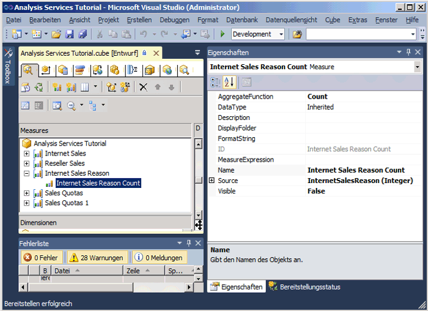
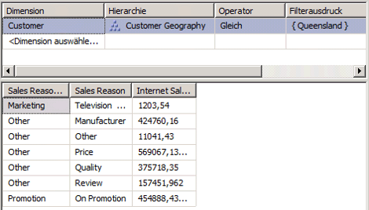

# Lektion 5-3: Definieren einer m: N-Beziehung
Wenn Sie eine Dimension definieren, wird typischerweise jeder einzelne Fakt (fact) mit genau einem Dimensionsmitglied verknüpft, wohingegen ein einzelnes Dimensionselement vielen verschiedenen Fakten zugeordnet sein kann. Beispielsweise können für jeden Kunden mehrere Bestellungen vorliegen, aber jede Bestellung kann nur einem einzelnen Kunden zugeordnet sein. In der Terminologie von relationalen Datenbanken wird dies als *1:n-Beziehung*bezeichnet. Manchmal kann allerdings ein einzelner Fakt mit mehreren Dimensionselementen verknüpft sein. In der Terminologie von relationalen Datenbanken wird dies als *m:n-Beziehung*bezeichnet. Ein Kunde kann beispielsweise mehrere Gründe für einen Kauf haben, und ein Kaufgrund kann mehreren Käufen zugeordnet sein. Eine Jointabelle wird verwendet, um die Kaufgründe zu definieren, die sich auf den jeweiligen Kauf beziehen. Eine mit solchen Beziehungen konstruierte Sales Reason-Dimension würde dann mehrere Elemente aufweisen, die mit einer einzelnen Verkaufstransaktion verknüpft ist. Durch m:n-Beziehungen werden das dimensionale Modell über das klassische Sternschema hinaus erweitert und komplexe Analysen unterstützt, wenn Dimensionen nicht direkt mit einer Faktentabelle verknüpft sind.  
  
In [!INCLUDE[ssASnoversion](../includes/ssasnoversion-md.md)]definieren Sie eine m:n-Beziehung zwischen einer Dimension und einer Measuregruppe, indem Sie eine Zwischenfakttabelle angeben, die mit der Dimensionstabelle verknüpft ist. Eine Zwischenfakttabelle ist wiederum mit einer Zwischendimensionstabelle verknüpft, die mit der Faktentabelle verknüpft ist. Von den m:n-Beziehungen zwischen der Zwischenfakttabelle und der Dimensionstabelle in der Beziehung und der Zwischendimension werden die m:n-Beziehungen zwischen Elementen der primären Dimension und Measures in der Measuregruppe erstellt, die durch die Beziehung angegeben wird. Damit eine m:n-Beziehung zwischen einer Dimension und einer Measuregruppe über eine Zwischenmeasuregruppe definiert werden kann, muss die Zwischenmeasuregruppe eine oder mehrere Dimensionen mit der ursprünglichen Measuregruppe gemeinsam nutzen.  
  
Bei einer m:n-Beziehung werden die Werte getrennt summiert, was bedeutet, dass sie nicht mehr als einmal für das All-Element aggregiert werden.  
  
> [!NOTE]  
> Eine Primärschlüssel-Fremdschlüssel-Beziehung muss in der Datenquellensicht zwischen allen beteiligten Tabellen definiert werden, um eine m:n-Beziehung zu unterstützen. Sie können sonst nicht die entsprechende Zwischenmeasuregruppe auswählen, wenn Sie die Beziehung auf der Registerkarte **Dimensionsverwendung** des Cube-Designers einrichten.  
  
Weitere Informationen finden Sie unter [Dimensionsbeziehungen](../analysis-services/multidimensional-models-olap-logical-cube-objects/dimension-relationships.md)und [Definieren einer m:n-Beziehung und deren Eigenschaften](../analysis-services/multidimensional-models/define-a-many-to-many-relationship-and-many-to-many-relationship-properties.md).  
  
In den Aufgaben in diesem Thema definieren Sie die Sales Reasons-Dimension und die Sales Reasons-Measuregruppe, und Sie definieren eine m:n-Beziehung zwischen der Sales Reason-Dimension und der Sales-Measuregruppe durch die Sales Reasons-Measuregruppe.  
  
## Hinzufügen erforderlicher Tabellen zur Datenquellensicht  
  
1.  Öffnen Sie den Datenquellensicht-Designer für die **Adventure Works DW 2012** -Datenquellensicht.  
  
2.  Klicken Sie mit der rechten Maustaste auf eine beliebige Stelle im Bereich **Diagrammplaner** , klicken Sie auf **Neues Diagramm**, und geben Sie anschließend **Internet Sales Order Reasons** als Namen für dieses neue Diagramm an.  
  
3.  Ziehen Sie die **InternetSales** -Tabelle aus dem Bereich **Tabellen** in den Bereich **Diagramm** .  
  
4.  Klicken Sie mit der rechten Maustaste auf eine beliebige Stelle im Bereich **Diagramm** , und klicken Sie anschließend auf **Tabellen hinzufügen/entfernen**.  
  
5.  Fügen Sie der Liste **Eingeschlossene Objekte** im Dialogfeld **Tabellen hinzufügen/entfernen** die Tabellen **DimSalesReason** und **FactInternetSalesReason** hinzu, und klicken Sie anschließend auf **OK**.  
  
    Beachten Sie, dass die Primärschlüssel-Fremdschlüssel-Beziehungen zwischen den beteiligten Tabellen automatisch eingerichtet werden, weil diese Beziehungen in der zugrunde liegenden relationalen Datenbank definiert werden. Wenn diese Beziehungen nicht in der zugrunde liegenden relationalen Datenbank definiert wären, müssten Sie sie in der Datenquellensicht definieren.  
  
6.  Zeigen Sie im Menü **Format** auf **Automatisches Layout**, und klicken Sie anschließend auf **Diagramm**.  
  
7.  Ändern Sie im Eigenschaftenfenster die **FriendlyName** -Eigenschaft der **DimSalesReason** -Tabelle zu **SalesReason**, und ändern Sie anschließend die **FriendlyName** -Eigenschaft der **FactInternetSalesReason** -Tabelle zu **InternetSalesReason**.  
  
8.  Erweitern Sie **InternetSalesReason (dbo.FactInternetSalesReason)** im Bereich **Tabellen**, klicken Sie auf **SalesOrderNumber**, und überprüfen Sie anschließend die **DataType** -Eigenschaft für diese Datenspalte im Eigenschaftenfenster.  
  
    Beachten Sie, dass der Datentyp für die **SalesOrderNumber** -Spalte ein Zeichenfolgendatentyp ist.  
  
9. Überprüfen Sie die Datentypen für die anderen Spalten in der **InternetSalesReason** -Tabelle.  
  
    Beachten Sie, dass die Datentypen für die anderen zwei Spalten in dieser Tabelle numerische Datentypen sind.  
  
10. Klicken Sie im Bereich **Tabellen** mit der rechten Maustaste auf **InternetSalesReason (dbo.FactInternetSalesReason)**, und klicken Sie anschließend auf **Daten durchsuchen**.  
  
    Beachten Sie, dass für jede Zeilennummer innerhalb jeder Bestellung von einem Schlüsselwert der Verkaufsgrund für den Kauf von diesem Zeilenelement identifiziert wird, wie in der folgenden Abbildung zu sehen.  
  
      
  
## Definieren der Zwischenmeasuregruppe  
  
1.  Wechseln Sie zum Cube-Designer für den [!INCLUDE[ssASnoversion](../includes/ssasnoversion-md.md)] Tutorial-Cube, und klicken Sie anschließend auf die Registerkarte **Cubestruktur** .  
  
2.  Klicken Sie mit der rechten Maustaste auf eine beliebige Stelle im Bereich **Measures** und anschließend auf **Neue Measuregruppe**. Weitere Informationen finden Sie unter [Erstellen von Measures und Measuregruppen in mehrdimensionalen Modellen](../analysis-services/multidimensional-models/create-measures-and-measure-groups-in-multidimensional-models.md).  
  
3.  Wählen Sie **InternetSalesReason** in der Liste **Wählen Sie eine Tabelle aus der Datenquellensicht aus** im Dialogfeld **Neue Measuregruppe** aus, und klicken Sie anschließend auf **OK**.  
  
    Beachten Sie, dass die **Internet Sales Reason** -Measuregruppe jetzt im Bereich **Measures** angezeigt wird.  
  
4.  Erweitern Sie die **Internet Sales Reason** -Measuregruppe.  
  
    Beachten Sie, dass nur ein einzelnes Measure für diese neue Measuregruppe definiert ist, das **Internet Sales Reason Count** -Measure.  
  
5.  Wählen Sie **Internet Sales Reason Count** aus, und überprüfen Sie die Eigenschaften dieses Measures im Eigenschaftenfenster.  
  
    Die **AggregateFunction** -Eigenschaft für dieses Measure wurde als **Count** anstelle von **Sum**definiert. [!INCLUDE[ssASnoversion](../includes/ssasnoversion-md.md)] hat **Count** ausgewählt, da der zugrunde liegende Datentyp ein Zeichenfolgendatentyp ist. Die anderen zwei Spalten in der zugrunde liegenden Faktentabelle wurden nicht als Measures ausgewählt, weil sie von [!INCLUDE[ssASnoversion](../includes/ssasnoversion-md.md)] als numerische Schlüssel statt tatsächliche Measures festgestellt wurden. Weitere Informationen finden Sie unter [Semiadditives Verhalten definieren](../analysis-services/multidimensional-models/define-semiadditive-behavior.md).  
  
6.  Ändern Sie im Eigenschaftenfenster die **Sichtbar** -Eigenschaft des **Internet Sales Reason Count** -Measures in **False**.  
  
    Dieses Measure wird nur verwendet, um die Sales Reason-Dimension zu verknüpfen, die Sie nach der Internet Sales-Measuregruppe definieren werden. Benutzer werden dieses Measure nicht direkt durchsuchen.  
  
    Die folgende Abbildung zeigt die Eigenschaften für das **Internet Sales Reason Count** -Measure.  
  
      
  
## Definieren der m:n-Dimension  
  
1.  Klicken Sie im Projektmappen-Explorer mit der rechten Maustaste auf **Dimensionen**und anschließend auf **Neue Dimension**.  
  
2.  Klicken Sie auf der Seite **Willkommen beim Dimensions-Assistenten** auf **Weiter**.  
  
3.  Überprüfen Sie, ob die Option **Vorhandene Tabelle verwenden** auf der Seite **Erstellungsmethode auswählen** ausgewählt ist, und klicken Sie anschließend auf **Weiter**.  
  
4.  Überprüfen Sie auf der Seite **Quellinformationen angeben** , ob die [!INCLUDE[ssSampleDBCoShort](../includes/sssampledbcoshort-md.md)] DW 2012-Datenquellensicht ausgewählt ist.  
  
5.  Wählen Sie in der Liste **Haupttabelle** den Eintrag **SalesReason**aus.  
  
6.  Überprüfen Sie in der Liste **Schlüsselspalten** , ob **SalesReasonKey** aufgelistet wird.  
  
7.  Wählen Sie in der Liste **Namensspalte** den Eintrag **SalesReasonName**aus.  
  
8.  Klicken Sie auf **Weiter**.  
  
9. Auf der Seite **Dimensionsattribute auswählen** wird das **Sales Reason Key** -Attribut automatisch ausgewählt, da es das Schlüsselattribut ist. Deaktivieren Sie das Kontrollkästchen neben dem **Sales Reason Reason Type** -Attribut, ändern Sie den Namen in **Sales Reason Type**, und klicken Sie anschließend auf **Weiter**.  
  
10. Klicken Sie auf der Seite **Assistenten abschließen** auf **Fertig stellen** , um die Sales Reason-Dimension zu erstellen.  
  
11. Klicken Sie im Menü **Datei** auf **Alle speichern**.  
  
12. Wählen Sie im Bereich **Attribute** des Dimensions-Designers für die **Sales Reason** -Dimension **Sales Reason Key**aus, und ändern Sie die **Name** -Eigenschaft im Fenster Eigenschaften in **Sales Reason.**  
  
13. Erstellen Sie im Bereich **Hierarchien** des Dimensions-Designers eine **Sales Reasons** -Benutzerhierarchie, die die **Sales Reason Type** -Ebene und die **Sales Reason** -Ebene in dieser Reihenfolge enthält.  
  
14. Definieren Sie im Eigenschaftenfenster **All Sales Reasons** als Wert für die **AllMemberName** -Eigenschaft der Sales Reasons-Hierarchie.  
  
15. Definieren Sie **All Sales Reasons** als Wert für die **AttributeAllMemberName** -Eigenschaft der Sales Reason-Dimension.  
  
16. Um die neu erstellte Dimension als Cubedimension zum [!INCLUDE[ssASnoversion](../includes/ssasnoversion-md.md)] Tutorial-Cube hinzuzufügen, wechseln Sie zum **Cube-Designer**. Klicken Sie mit der rechten Maustaste in den Bereich **Dimensionen** der Registerkarte **Cubestruktur** , und wählen Sie die Option **Cubedimension hinzufügen**aus.  
  
17. Wählen Sie im Dialogfeld **Cubedimension hinzufügen** den Eintrag **Sales Reason** aus, und klicken Sie anschließend auf **OK**.  
  
18. Klicken Sie im Menü **Datei** auf **Alle speichern**.  
  
## Definieren der m:n-Beziehung  
  
1.  Wechseln Sie zum Cube-Designer für den [!INCLUDE[ssASnoversion](../includes/ssasnoversion-md.md)] Tutorial-Cube, und klicken Sie anschließend auf die Registerkarte **Dimensionsverwendung** .  
  
    Beachten Sie, dass für die **Sales Reason** -Dimension eine reguläre Beziehung zur **Internet Sales Reason** -Measuregruppe definiert ist, nicht aber eine Beziehung zur **Internet Sales** -Measuregruppe oder zur **Reseller Sales** -Measuregruppe. Außerdem ist für die **Internet Sales Order Details** -Dimension eine reguläre Beziehung zur **Internet Sales Reason** -Dimension definiert, für die wiederum eine **Faktenbeziehung** zur **Internet Sales** -Measuregruppe besteht. Wäre diese Dimension nicht vorhanden (oder wäre eine andere Dimension, für die eine Beziehung sowohl zur **Internet Sales Reason** - als auch zur **Internet Sales** -Measuregruppe besteht, nicht vorhanden), könnten Sie die m:n-Beziehung nicht definieren.  
  
2.  Klicken Sie auf die Zelle am Schnittpunkt der **Internet Sales** -Measuregruppe und der **Sales Reason** -Dimension und anschließend auf die Schaltfläche zum Durchsuchen (**…**).  
  
3.  Wählen Sie im Dialogfeld **Beziehung definieren** **m:n** in der Liste **Beziehungstyp auswählen** aus.  
  
    Sie müssen die Zwischenmeasuregruppe definieren, die die Sales Reason-Dimension mit der Internet Sales-Measuregruppe verbindet.  
  
4.  Wählen Sie in der **Zwischenmeasuregruppe** -Liste **Internet Sales Reason**aus.  
  
    Die folgende Abbildung zeigt die Änderungen im Dialogfeld **Beziehung definieren** .  
  
    ")  
  
5.  Klicken Sie auf **OK**.  
  
    Beachten Sie, dass das m:n-Symbol die Beziehung zwischen der Sales Reason-Dimension und der Internet Sales-Measuregruppe darstellt.  
  
## Durchsuchen des Cubes und der m:n-Dimension  
  
1.  Klicken Sie im Menü **Erstellen** auf **Analysis Services Tutorial bereitstellen**.  
  
2.  Wechseln Sie nach erfolgreichem Abschluss der Bereitstellung im Cube-Designer für den **Tutorial-Cube zur Registerkarte** Browser [!INCLUDE[ssASnoversion](../includes/ssasnoversion-md.md)] , und klicken Sie anschließend auf **Verbindung wiederherstellen**.  
  
3.  Fügen Sie dem Datenbereich des Bereichs Daten das **Internet Sales-Sales Amount** -Measure hinzu.  
  
4.  Fügen Sie die benutzerdefinierte **Sales Reasons** -Hierarchie aus der **Sales Reason** -Dimension dem Zeilenbereich des Datenbereichs hinzu.  
  
5.  Erweitern Sie im Metadatenbereich **Customer**, **Location**, **Customer Geography**, **Members**, **All Customers**, **Australia**, klicken Sie mit der rechten Maustaste auf **Queensland**und anschließend auf **Zu Filter hinzufügen**.  
  
6.  Erweitern Sie jedes Element der **Sales Reason Type** -Ebene, um die Dollarwerte zu überprüfen, die mit jedem Grund verknüpft sind, den ein Kunde in Queensland für den Kauf eines [!INCLUDE[ssSampleDBCoShort](../includes/sssampledbcoshort-md.md)] -Produkts über das Internet angegeben hat.  
  
    Beachten Sie, dass die Gesamtsummen, die mit jedem Verkaufsgrund verknüpft sind, größer als die Gesamtverkäufe sind. Der Grund dafür ist, dass einige Kunden mehrere Gründe für ihren Kauf angegeben haben.  
  
    Die folgende Abbildung zeigt den Bereich **Filter** und den Bereich **Daten** des Cube-Designers.  
  
      
  
## Nächste Aufgabe in der Lektion  
[Definieren von Dimensionsgranularität innerhalb einer Measuregruppe](../analysis-services/lesson-5-4-defining-dimension-granularity-within-a-measure-group.md)  
  
## Siehe auch  
[Verwenden von Diagrammen im Datenquellensicht-Designer &#40;Analysis Services&#41;](../analysis-services/multidimensional-models/work-with-diagrams-in-data-source-view-designer-analysis-services.md)  
[Dimensionsbeziehungen](../analysis-services/multidimensional-models-olap-logical-cube-objects/dimension-relationships.md)  
[Definieren einer m:n-Beziehung und deren Eigenschaften](../analysis-services/multidimensional-models/define-a-many-to-many-relationship-and-many-to-many-relationship-properties.md)  
  
  
  

