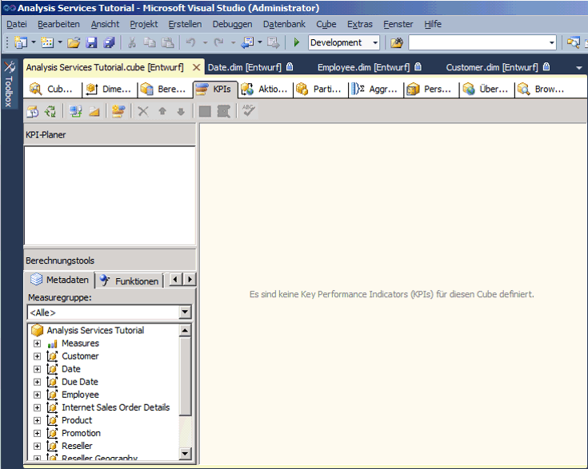
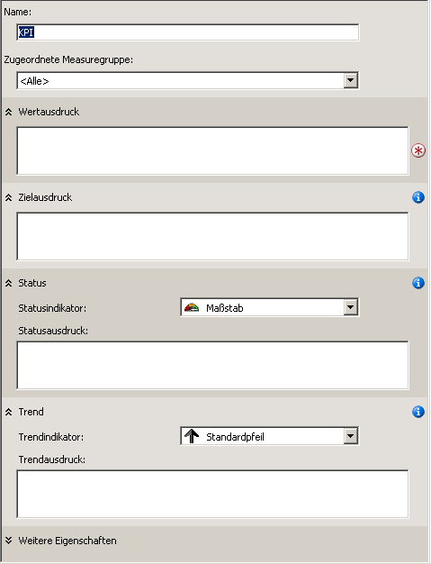

# <a name="lesson-7-1---defining-and-browsing-kpis"></a>Lektion 7-1: definieren und Durchsuchen von KPIs
Zum Definieren von KPIs (Key Performance Indicators) müssen Sie zuerst einen KPI-Namen und die Measuregruppe definieren, der der KPI zugeordnet wird. Ein KPI kann entweder allen Measuregruppen oder einer einzelnen Measuregruppe zugeordnet werden. Anschließend definieren Sie die folgenden Elemente des KPIs:  
  
-   Der Wertausdruck  
  
    Ein Wertausdruck ist ein physisches Measure, wie z. B. Sales, ein berechnetes Measure, wie z. B. Profit, oder eine innerhalb des KPIs mithilfe eines MDX-Ausdrucks (Multidimensional Expressions) definierte Berechnung.  
  
-   Der Zielausdruck  
  
    Ein Zielausdruck ist ein Wert oder MDX-Ausdruck, der zu einem Wert aufgelöst wird, welcher das Ziel für das Measure definiert, das durch den Wertausdruck definiert wird. Ein Zielausdruck könnte beispielsweise der Betrag sein, um den die Geschäftsmanager eines Unternehmens die Verkaufszahlen oder Gewinne steigern möchten.  
  
-   Der Statusausdruck  
  
    Ein Statusausdruck ist ein MDX-Ausdruck, der von [!INCLUDE[ssASnoversion](../includes/ssasnoversion-md.md)] zum Auswerten des aktuellen Status des Wertausdrucks im Vergleich zum Zielausdruck verwendet wird. Ein Zielausdruck ist ein normalisierter Wert zwischen -1 und +1, wobei -1 für sehr schlecht und +1 für sehr gut steht. Der Statusausdruck wird mithilfe einer Grafik dargestellt, damit Sie problemlos den Status des Wertausdrucks im Vergleich zum Zielausdruck bestimmen können.  
  
-   Der Trendausdruck  
  
    Ein Trendausdruck ist ein MDX-Ausdruck, der von [!INCLUDE[ssASnoversion](../includes/ssasnoversion-md.md)] zum Auswerten des aktuellen Trends des Wertausdrucks im Vergleich zum Zielausdruck verwendet wird. Mithilfe des Trendausdrucks kann der Anwender des Produkts im geschäftlichen Bereich rasch erkennen, ob sich der Wertausdruck im Hinblick auf den Zielausdruck verbessert oder verschlechtert. Sie können dem Trendausdruck eine von mehreren Grafiken zuordnen, damit Anwender des Produkts im geschäftlichen Bereich den Trend schnell verstehen.  
  
Zusätzlich zu diesen Elementen, die für ein KPI definiert werden, können auch verschiedene Eigenschaften eines KPIs definiert werden. Zu diesen Eigenschaften gehören ein Anzeigeordner, ein übergeordneter KPI, falls der KPI aus anderen KPIs berechnet wird, ggf. das aktuelle Zeitelement, ggf. die Gewichtung des KPIs sowie eine Beschreibung des KPIs.  
  
> [!NOTE]  
> Weitere Beispiele für KPIs finden Sie auf der Registerkarte Vorlagen im Bereich Berechnungstools oder im Data Warehouse-Beispiel **Adventure Works DW 2012** . Weitere Informationen zum Installieren dieser Datenbank finden Sie unter [Installieren von Beispieldaten und -projekten für das Analysis Services-Tutorial zur mehrdimensionalen Modellierung](../analysis-services/install-sample-data-and-projects.md).  
  
In den Aufgaben in dieser Lektion definieren Sie KPIs im [!INCLUDE[ssASnoversion](../includes/ssasnoversion-md.md)] Tutorial-Projekt und durchsuchen dann den [!INCLUDE[ssASnoversion](../includes/ssasnoversion-md.md)] Tutorial-Cube mithilfe dieser KPIs. Sie definieren folgende KPIs:  
  
-   Reseller Revenue  
  
    Mit diesem KPI wird gemessen, wie sich die tatsächlichen Verkäufe durch Wiederverkäufer im Vergleich zu den Sollvorgaben für den Verkauf verhalten, wie nahe die Verkaufszahlen an das gesetzte Ziel heranreichen und welcher Trend sich hinsichtlich des Zieles abzeichnet.  
  
-   Product Gross Profit Margin  
  
    Mit diesem KPI wird bestimmt, wie stark sich die Bruttorendite für jede Produktkategorie an das angegebene Ziel für jede Produktkategorie annähert und welcher Trend sich im Hinblick auf die Umsetzung dieses Zieles abzeichnet.  
  
## <a name="defining-the-reseller-revenue-kpi"></a>Definieren des Reseller Revenue-KPI  
  
1.  Öffnen Sie den Cube-Designer für den [!INCLUDE[ssASnoversion](../includes/ssasnoversion-md.md)] Tutorial-Cube, und klicken Sie anschließend auf die Registerkarte **KPIs** .  
  
    Die Registerkarte **KPIs** umfasst mehrere Bereiche. Auf der linken Seite der Registerkarte werden die Bereiche **KPI-Planer** und **Berechnungstools** angezeigt. Der Anzeigebereich in der Mitte der Registerkarte enthält die Details des KPIs, der im Bereich **KPI-Planer** ausgewählt ist.  
  
    In der folgenden Abbildung ist die Registerkarte **KPIs** des Cube-Designers dargestellt.  
  
      
  
2.  Klicken Sie auf der Symbolleiste der Registerkarte **KPIs** auf **Neuer KPI** .  
  
    Im Anzeigebereich wird eine leere KPI-Vorlage angezeigt, wie in der folgenden Abbildung dargestellt.  
  
      
  
3.  Geben Sie im Feld **Name** die Bezeichnung **Reseller Revenue**ein, und wählen Sie anschließend in der Liste **Zugeordnete Measuregruppe** den Eintrag **Reseller Sales** aus.  
  
4.  Erweitern Sie auf der Registerkarte **Metadaten** im Bereich **Berechnungstools** die Optionen **Measures**und **Reseller Sales**, und ziehen Sie anschließend das Measure **Reseller Sales-Sales Amount** in das Feld **Wertausdruck** .  
  
5.  Erweitern Sie auf der Registerkarte **Metadaten** im Bereich **Berechnungstools** die Optionen **Measures**und **Sales Quotas**, und ziehen Sie anschließend das Measure **Sales Amount Quota** in das Feld **Zielausdruck** .  
  
6.  Überprüfen Sie, ob in der Liste **Statusindikator** **Maßstab** ausgewählt ist, und geben Sie anschließend den folgenden MDX-Ausdruck in das Feld **Statusausdruck** ein:  
  
    ```  
    Case  
     When   
      KpiValue("Reseller Revenue")/KpiGoal("Reseller Revenue")>=.95  
       Then 1  
     When  
      KpiValue("Reseller Revenue")/KpiGoal("Reseller Revenue")<.95  
       And   
      KpiValue("Reseller Revenue")/KpiGoal("Reseller Revenue")>=.85  
       Then 0  
      Else-1  
    End  
    ```  
  
    Dieser MDX-Ausdruck bildet die Grundlage für das Auswerten der Entwicklung im Hinblick auf das Ziel. In diesem MDX-Ausdruck wird der Wert 0 zum Auffüllen der ausgewählten Grafik verwendet, wenn die tatsächlichen Verkäufe durch Wiederverkäufer 85 % des gesetzten Zieles überschreiten. Da ein Maßstab als Grafik gewählt wurde, steht der Zeiger des Maßstabs auf halber Höhe zwischen leer und voll. Überschreiten die tatsächlichen Verkäufe durch Wiederverkäufer 90 Prozent, steht der Zeiger des Maßstabs bei drei Viertel zwischen leer und voll.  
  
7.  Überprüfen Sie, ob in der Liste **Trendindikator** die Option **Standardpfeil** ausgewählt ist, und geben Sie anschließend den folgenden Ausdruck in das Feld **Trendausdruck** ein:  
  
    ```  
    Case  
     When IsEmpty  
      (ParallelPeriod  
       ([Date].[Calendar Date].[Calendar Year],1,  
           [Date].[Calendar Date].CurrentMember))  
      Then 0    
     When  (  
      KpiValue("Reseller Revenue") -   
       (KpiValue("Reseller Revenue"),   
        ParallelPeriod  
         ([Date].[Calendar Date].[Calendar Year],1,  
           [Date].[Calendar Date].CurrentMember))  
          /  
          (KpiValue ("Reseller Revenue"),  
           ParallelPeriod  
            ([Date].[Calendar Date].[Calendar Year],1,  
             [Date].[Calendar Date].CurrentMember)))  
           >=.02  
      Then 1  
       When(  
        KpiValue("Reseller Revenue") -   
         (KpiValue ( "Reseller Revenue" ),  
          ParallelPeriod  
           ([Date].[Calendar Date].[Calendar Year],1,  
            [Date].[Calendar Date].CurrentMember))  
           /  
            (KpiValue("Reseller Revenue"),  
             ParallelPeriod  
              ([Date].[Calendar Date].[Calendar Year],1,  
                [Date].[Calendar Date].CurrentMember)))  
            <=.02  
      Then -1  
       Else 0  
    End  
    ```  
  
    Dieser MDX-Ausdruck bildet die Grundlage für das Auswerten des Trends im Hinblick auf die Umsetzung des festgelegten Zieles.  
  
## <a name="browsing-the-cube-by-using-the-reseller-revenue-kpi"></a>Durchsuchen des Cubes mithilfe des Reseller Revenue-KPI  
  
1.  Klicken Sie im Menü **Erstellen** von [!INCLUDE[ssBIDevStudioFull](../includes/ssbidevstudiofull-md.md)]auf **Analysis Services Tutorial bereitstellen**.  
  
2.  Klicken Sie nach der erfolgreichen Bereitstellung auf der Symbolleiste der Registerkarte **KPIs** auf **Browseransicht** und anschließend auf **Verbindung wiederherstellen**.  
  
    Die Status- und Trendmaßstäbe werden im Bereich **KPI-Browser** für die Verkäufe durch Wiederverkäufer auf der Grundlage der Werte für das Standardelement der einzelnen Dimensionen zusammen mit dem Wert für den Wert- und den Zielausdruck angezeigt. Das Standardelement aller Dimensionen ist das All-Element auf der All-Ebene, da Sie kein anderes Element einer Dimension als Standardelement definiert haben.  
  
3.  Wählen Sie im Bereich Filter in der Liste **Dimension** die Option **Sales Territory** , in der Liste **Hierarchie** die Option **Sales Territories** , in der Liste **Operator** die Option **Gleich** aus, und aktivieren Sie in der Liste **Filterausdruck** das Kontrollkästchen **North America** . Klicken Sie anschließend auf **OK**.  
  
4.  Wählen Sie in der nächsten Zeile im Bereich **Filter** in der Liste **Dimension** die Option **Date** , in der Liste **Hierarchie** die Option **Calendar Date** , in der Liste **Operator** die Option **Gleich** aus, und aktivieren Sie in der Liste **Filterausdruck** das Kontrollkästchen **Q3 CY 2007** . Klicken Sie anschließend auf **OK**.  
  
5.  Klicken Sie auf eine beliebige Stelle im Bereich **KPI-Browser** , um die Werte für den **Reseller Revenue**-KPI zu aktualisieren.  
  
    Die Abschnitte **Wert**, **Ziel**und **Status** des KPIs spiegeln die Werte für den neuen Zeitraum wider  
  
## <a name="defining-the-product-gross-profit-margin-kpi"></a>Definieren des Product Gross Profit Margin-KPIs  
  
1.  Klicken Sie auf der Symbolleiste der Registerkarte **KPIs** auf **Formularansicht** und anschließend auf die Schaltfläche **Neuer KPI** .  
  
2.  Geben Sie im Feld **Name** die Bezeichnung **Product Gross Profit Margin**ein, und überprüfen Sie anschließend, ob in der Liste **<All>** Zugeordnete Measuregruppe **die Option** angezeigt wird.  
  
3.  Ziehen Sie auf der Registerkarte **Metadaten** im Bereich **Berechnungstools** das **Total GPM** -Measure in das Feld **Wertausdruck** .  
  
4.  Geben Sie im Feld **Zielausdruck** den folgenden Ausdruck ein:  
  
    ```  
    Case  
        When [Product].[Category].CurrentMember Is  
          [Product].[Category].[Accessories]  
        Then .40                   
        When [Product].[Category].CurrentMember   
          Is [Product].[Category].[Bikes]  
        Then .12                  
        When [Product].[Category].CurrentMember Is  
          [Product].[Category].[Clothing]  
        Then .20  
        When [Product].[Category].CurrentMember Is  
          [Product].[Category].[Components]  
        Then .10  
        Else .12              
    End  
    ```  
  
5.  Wählen Sie in der Liste **Statusindikator** die Option **Zylinder**aus.  
  
6.  Geben Sie den folgenden MDX-Ausdruck in das Feld **Statusausdruck** ein:  
  
    ```  
    Case  
        When KpiValue( "Product Gross Profit Margin" ) /   
             KpiGoal ( "Product Gross Profit Margin" ) >= .90  
        Then 1  
        When KpiValue( "Product Gross Profit Margin" ) /   
             KpiGoal ( "Product Gross Profit Margin" ) <  .90  
             And   
             KpiValue( "Product Gross Profit Margin" ) /   
             KpiGoal ( "Product Gross Profit Margin" ) >= .80  
        Then 0  
        Else -1  
    End  
    ```  
  
    Dieser MDX-Ausdruck bildet die Grundlage für das Auswerten der Entwicklung im Hinblick auf das Ziel.  
  
7.  Überprüfen Sie, dass in der Liste **Trendindikator** die Option **Standardpfeil** ausgewählt ist, und geben Sie anschließend den folgenden MDX-Ausdruck in das Feld **Trendausdruck** ein:  
  
    ```  
    Case  
    When IsEmpty  
      (ParallelPeriod  
       ([Date].[Calendar Date].[Calendar Year],1,  
           [Date].[Calendar Date].CurrentMember))  
      Then 0    
       When VBA!Abs  
        (  
          KpiValue( "Product Gross Profit Margin" ) -   
           (  
             KpiValue ( "Product Gross Profit Margin" ),  
              ParallelPeriod  
              (   
                [Date].[ Calendar Date].[ Calendar Year],  
                1,  
                [Date].[ Calendar Date].CurrentMember  
              )  
            ) /  
            (  
              KpiValue ( "Product Gross Profit Margin" ),  
              ParallelPeriod  
              (   
                [Date].[ Calendar Date].[ Calendar Year],  
                1,  
                [Date].[ Calendar Date].CurrentMember  
              )  
            )    
          ) <=.02  
      Then 0  
      When KpiValue( "Product Gross Profit Margin" ) -   
           (  
             KpiValue ( "Product Gross Profit Margin" ),  
             ParallelPeriod  
             (   
               [Date].[ Calendar Date].[ Calendar Year],  
               1,  
               [Date].[ Calendar Date].CurrentMember  
             )  
           ) /  
           (  
             KpiValue ( "Product Gross Profit Margin" ),  
             ParallelPeriod  
             (   
               [Date].[Calendar Date].[Calendar Year],  
               1,  
               [Date].[Calendar Date].CurrentMember  
             )  
           )  >.02  
      Then 1  
      Else -1  
    End  
    ```  
  
    Dieser MDX-Ausdruck bildet die Grundlage für das Auswerten des Trends im Hinblick auf die Umsetzung des festgelegten Zieles.  
  
## <a name="browsing-the-cube-by-using-the-total-gross-profit-margin-kpi"></a>Durchsuchen des Cubes mithilfe des Total Gross Profit Margin-KPI  
  
1.  Klicken Sie im Menü **Erstellen** auf **Analysis Services Tutorial bereitstellen**.  
  
2.  Klicken Sie nach der erfolgreichen Bereitstellung auf der Symbolleiste der Registerkarte **KPIs** auf **Verbindung wiederherstellen** und anschließend auf **Browseransicht**.  
  
    Der **Product Gross Profit Margin** -KPI wird angezeigt, der den KPI-Wert für **Q3 CY 2007** und die Vertriebsregion **North America** anzeigt.  
  
3.  Wählen Sie im Bereich **Filter** in der Liste **Dimension** die Option **Product** , in der Liste **Hierarchy** die Option **Category** , in der Liste **Operator** die Option **Gleich** und in der Liste **Filterausdruck** die Option **Bikes** aus. Klicken Sie anschließend auf **OK**.  
  
    Die Bruttorendite für die von Wiederverkäufern verkauften Fahrräder in Nordamerika wird für das dritte Quartal des Kalenderjahres 2007 angezeigt.  
  
## <a name="next-lesson"></a>Nächste Lektion  
[Lektion 8: Definieren von Aktionen](../analysis-services/lesson-8-defining-actions.md)  
  

