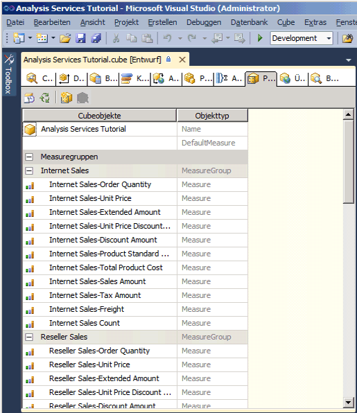
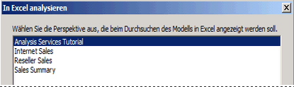
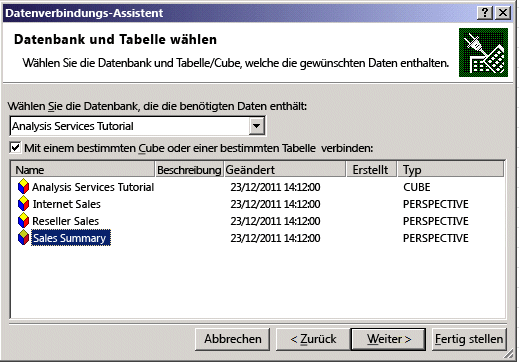
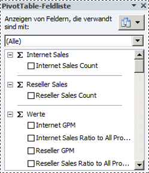

# Lektion 9-1: definieren und Durchsuchen von Perspektiven
Mithilfe von Perspektiven kann die Ansicht eines Cubes für bestimmte Zwecke vereinfacht werden. Standardmäßig können Benutzer alle Elemente in einem Cube sehen, für den sie die entsprechenden Berechtigungen besitzen. Wenn Benutzer einen ganzen [!INCLUDE[ssASnoversion](../includes/ssasnoversion-md.md)] -Cube anzeigen, wird ihnen die Standardperspektive des Cubes angezeigt. Die Ansicht des gesamten Cubes kann auf Benutzer äußerst komplex wirken, vor allem dann, wenn sie nur mit einem kleinen Teil des Cubes arbeiten, um ihre Anforderungen hinsichtlich Business Intelligence und Berichterstellung zu erfüllen.  
  
Zur Reduzierung der offensichtlichen Komplexität eines Cubes können Sie anzeigbare Teilmengen des Cubes (so genannte *Perspektiven*) erstellen, mit denen Benutzern nur ein Teil der Measuregruppen, Measures, Dimensionen, Attribute, Hierarchien, Key Performance Indicators (KPIs), Aktionen und berechneten Elemente im Cube angezeigt wird. Dies kann insbesondere bei der Arbeit mit Clientanwendungen nützlich sein, die für eine frühere Version von [!INCLUDE[ssASnoversion](../includes/ssasnoversion-md.md)]geschrieben wurden. Diese Clients kennen z. B. keine Anzeigeordner oder Perspektiven, aber eine Perspektive wird auf älteren Clients wie ein Cube angezeigt. Weitere Informationen finden Sie unter [Perspektiven](../analysis-services/multidimensional-models-olap-logical-cube-objects/perspectives.md), und [Perspektiven in mehrdimensionalen Modellen](../analysis-services/multidimensional-models/perspectives-in-multidimensional-models.md).  
  
> [!NOTE]  
> Eine Perspektive ist kein Sicherheitsmechanismus, sondern ein Tool zur Verbesserung des Verhaltens der Benutzerumgebung. Die gesamte Sicherheit einer Perspektive erbt diese vom zugrunde liegenden Cube.  
  
Im Rahmen der Tasks in diesem Thema definieren Sie verschiedene Perspektiven und durchsuchen dann den Cube über jede dieser neuen Perspektiven.  
  
## Definieren einer Internet Sales-Perspektive  
  
1.  Öffnen Sie den Cube-Designer für den [!INCLUDE[ssASnoversion](../includes/ssasnoversion-md.md)] Tutorial-Cube, und klicken Sie anschließend auf die Registerkarte **Perspektiven** .  
  
    Alle Objekte und ihre Objekttypen werden im Bereich **Perspektiven** angezeigt, wie in der folgenden Abbildung dargestellt.  
  
      
  
2.  Klicken Sie auf der Symbolleiste der Registerkarte **Perspektiven** auf die Schaltfläche **Neue Perspektive** .  
  
    In der **Perspektivenname** -Spalte wird eine neue Perspektive mit dem Standardnamen **Perspektive**angezeigt, wie in der folgenden Abbildung dargestellt. Die Kontrollkästchen aller Objekte sind so lange aktiviert, bis Sie eines der Kontrollkästchen für ein Objekt deaktivieren. Diese Perspektive entspricht der Standardperspektive dieses Cubes.  
  
      
  
3.  Ändern Sie den Perspektivennamen zu **Internet Sales**.  
  
4.  Legen Sie in der nächsten Zeile **Internet Sales-Sales Amount**als Standardmeasure fest.  
  
    Wenn Benutzer den Cube mithilfe dieser Perspektive durchsuchen, sehen sie dieses Measure, es sei denn, sie geben ein anderes Measure an.  
  
    > [!NOTE]  
    > Sie können auch das Standardmeasure für den gesamten [!INCLUDE[ssASnoversion](../includes/ssasnoversion-md.md)] Tutorial-Cube im Eigenschaftenfenster der Registerkarte **Cubestruktur** für den Cube festlegen.  
  
5.  Deaktivieren Sie die Kontrollkästchen der folgenden Objekte:  
  
    -   **Reseller Sales** -Measuregruppe  
  
    -   **Sales Quotas** -Measuregruppe  
  
    -   **Sales Quotas 1** -Measuregruppe  
  
    -   **Reseller** -Cubedimension  
  
    -   **Reseller Geography** -Cubedimension  
  
    -   **Sales Territory** -Cubedimension  
  
    -   **Employee** -Cubedimension  
  
    -   **Promotion** -Cubedimension  
  
    -   **Reseller Revenue** -KPI  
  
    -   Benannte Menge**Large Resellers**   
  
    -   Berechnetes Element**Total Sales Amount**   
  
    -   Berechnetes Element**Total Product Cost**   
  
    -   Berechnetes Element**Reseller GPM**   
  
    -   Berechnetes Element**Total GPM**   
  
    -   Berechnetes Element**Reseller Sales Ratio to All Products**   
  
    -   Berechnetes Element**Total Sales Ratio to All Products**   
  
    Diese Objekte stehen nicht im Zusammenhang mit Internetverkäufen (Internet Sales).  
  
    > [!NOTE]  
    > Innerhalb der einzelnen Dimensionen können Sie zudem einzeln die benutzerdefinierten Hierarchien und Attribute auswählen, die in einer Perspektive angezeigt werden sollen.  
  
## Definieren der Reseller Sales-Perspektive  
  
1.  Klicken Sie auf der Symbolleiste der Registerkarte **Perspektiven** auf die Schaltfläche **Neue Perspektive** .  
  
2.  Ändern Sie den Namen der neuen Perspektive zu **Reseller Sales**.  
  
3.  Legen Sie **Reseller Sales-Sales Amount** als Standardmeasure fest.  
  
    Wenn Benutzer den Cube mithilfe dieser Perspektive durchsuchen, sehen sie dieses Measure, es sei denn, sie geben ein anderes Measure an.  
  
4.  Deaktivieren Sie die Kontrollkästchen der folgenden Objekte:  
  
    -   **Internet Sales** -Measuregruppe  
  
    -   **Internet Sales Reason** -Measuregruppe  
  
    -   **Customer** -Cubedimension  
  
    -   **Internet Sales Order Details** -Cubedimension  
  
    -   **Sales Reason** -Cubedimension  
  
    -   **Internet Sales Details Drillthrough Action** -Drillthroughaktion  
  
    -   Berechnetes Element**Total Sales Amount**   
  
    -   Berechnetes Element**Total Product Cost**   
  
    -   Berechnetes Element**Internet GPM**   
  
    -   Berechnetes Element**Total GPM**   
  
    -   Berechnetes Element**Internet Sales Ratio to All Products**   
  
    -   Berechnetes Element**Total Sales Ratio to All Products**   
  
    Diese Objekte stehen nicht im Zusammenhang mit Verkäufen durch Wiederverkäufer (Reseller Sales).  
  
## Definieren der Sales Summary-Perspektive  
  
1.  Klicken Sie auf der Symbolleiste der Registerkarte **Perspektiven** auf die Schaltfläche **Neue Perspektive** .  
  
2.  Ändern Sie den Namen der neuen Perspektive zu **Sales Summary**.  
  
    > [!NOTE]  
    > Es kann kein berechnetes Measure als Standardmeasure angegeben werden.  
  
3.  Deaktivieren Sie die Kontrollkästchen der folgenden Objekte:  
  
    -   **Internet Sales** -Measuregruppe  
  
    -   **Reseller Sales** -Measuregruppe  
  
    -   **Internet Sales Reason** -Measuregruppe  
  
    -   **Sales Quotas** -Measuregruppe  
  
    -   **Sales Quotas1** -Measuregruppe  
  
    -   **Internet Sales Order Details** -Cubedimension  
  
    -   **Sales Reason** -Cubedimension  
  
    -   **Internet Sales Details Drillthrough Action** -Drillthroughaktion  
  
4.  Aktivieren Sie die Kontrollkästchen der folgenden Objekte:  
  
    -   **Internet Sales Count** -Measure  
  
    -   **Reseller Sales Count** -Measure  
  
## Durchsuchen des Cubes durch die einzelnen Perspektiven  
  
1.  Klicken Sie im Menü **Erstellen** auf **Analysis Services Tutorial bereitstellen**.  
  
2.  Wechseln Sie nach erfolgreicher Bereitstellung zur Registerkarte **Browser** , und klicken Sie anschließend auf **Verbindung wiederherstellen** .  
  
3.  Starten Sie Excel.  
  
4.  Durch In Excel analysieren werden Sie aufgefordert, die Perspektive auszuwählen, die beim Durchsuchen des Modells in Excel verwendet wird. Siehe dazu die folgende Abbildung.  
  
      
  
5.  Alternativ können Sie Excel vom Windows-Startmenü aus starten, eine Verbindung mit der Analysis Services Tutorial-Datenbank auf localhost definieren und eine Perspektive im Datenverbindungs-Assistenten auswählen, wie in der folgenden Abbildung dargestellt.  
  
      
  
6.  Wählen Sie in der Liste **Perspektive** den Eintrag **Internet Sales** aus, und überprüfen Sie die Measures und Dimensionen im Metadatenbereich.  
  
    Es werden nur die Objekte angezeigt, die für die Internet Sales-Perspektive angegeben wurden.  
  
7.  Erweitern Sie im Bereich Metadaten die Option **Measures**.  
  
    Es wird nur die **Internet Sales** -Measuregruppe zusammen mit den berechneten Elementen **Internet GPM** und **Internet Sales Ratio to All Products** angezeigt.  
  
8.  Wählen Sie im Modell erneut Excel aus. Wählen Sie **Sales Summary**aus.  
  
    In jeder der Measuregruppen wird nur ein einzelnes Measure angezeigt, wie in der folgenden Abbildung dargestellt.  
  
      
  
## Nächste Aufgabe in der Lektion  
[Definieren und Durchsuchen von Übersetzungen](../analysis-services/lesson-9-2-defining-and-browsing-translations.md)  
  
## Siehe auch  
[Perspectives](../analysis-services/multidimensional-models-olap-logical-cube-objects/perspectives.md)  
[Perspektiven in mehrdimensionalen Modellen](../analysis-services/multidimensional-models/perspectives-in-multidimensional-models.md)  
  
  
  

