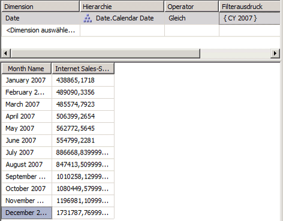

# Lektion 9 – 2: definieren und Durchsuchen von Übersetzungen
Eine Übersetzung ist eine Darstellung der Namen von [!INCLUDE[ssASnoversion](../includes/ssasnoversion-md.md)] -Objekten in einer bestimmten Sprache. Objekte schließen Measuregruppen, Measures, Dimensionen, Attribute, Hierarchien, KPIs, Aktionen und berechnete Elemente ein. Übersetzungen bieten Serverunterstützung für Clientanwendungen, die mehrere Sprachen unterstützen können. Bei Verwendung eines solchen Clients übergibt der Client den Gebietsschemabezeichner (Locale Identifier, LCID) an die Instanz von [!INCLUDE[ssASnoversion](../includes/ssasnoversion-md.md)], die mithilfe des Gebietsschemabezeichners bestimmt, welche Übersetzungen beim Bereitstellen von Metadaten für [!INCLUDE[ssASnoversion](../includes/ssasnoversion-md.md)] -Objekte verwendet werden sollen. Enthält ein [!INCLUDE[ssASnoversion](../includes/ssasnoversion-md.md)] -Objekt keine Übersetzung für diese Sprache oder keine Übersetzung für ein angegebenes Objekt, wird die Standardsprache zur Rückgabe der Objektmetadaten an den Client verwendet. Wenn z. B. ein Anwender des Produkts im geschäftlichen Bereich in Frankreich von einer Arbeitsstation mit einer französischen Gebietsschemaeinstellung auf einen Cube zugreift, sieht er die Elementbeschriftungen und die Werte der Elementeigenschaften auf Französisch, sofern eine französische Übersetzung vorhanden ist. Wenn jedoch ein Anwender des Produkts im geschäftlichen Bereich in Deutschland von einer Arbeitsstation mit einer deutschen Gebietsschemaeinstellung auf denselben Cube zugreift, sieht er die Elementbeschriftungen und die Werte der Elementeigenschaften auf Deutsch. Weitere Informationen finden Sie unter [Dimensionsübersetzungen](../analysis-services/multidimensional-models-olap-logical-dimension-objects/dimension-translations.md), [Cubeübersetzungen](../analysis-services/multidimensional-models-olap-logical-cube-objects/cube-translations.md)und [Unterstützung für Übersetzungen in Analysis Services](../analysis-services/translation-support-in-analysis-services.md).  
  
Im Rahmen der Tasks in diesem Thema definieren Sie Metadatenübersetzungen für eine begrenzte Gruppe von Dimensionsobjekten in den Date-Dimensions- und Cubeobjekten im [!INCLUDE[ssASnoversion](../includes/ssasnoversion-md.md)] Tutorial-Cube. Sie durchsuchen dann diese Dimensions- und Cubeobjekte, um die Metadatenübersetzungen zu überprüfen.  
  
## Angeben von Übersetzungen für die Date-Dimensionsmetadaten  
  
1.  Öffnen Sie den Dimensions-Designer für die **Date** -Dimension, und klicken Sie anschließend auf die Registerkarte **Übersetzungen** .  
  
    Die Metadaten werden in der Standardsprache für jedes Dimensionsobjekt angezeigt. Die Standardsprache im [!INCLUDE[ssASnoversion](../includes/ssasnoversion-md.md)] Tutorial-Cube ist Englisch.  
  
2.  Klicken Sie auf der Symbolleiste der Registerkarte **Übersetzungen** auf **Neue Übersetzung** .  
  
    Im Dialogfeld **Sprache auswählen** wird eine Liste mit Sprachen angezeigt.  
  
3.  Klicken Sie auf **Spanisch (Spanien)**und anschließend auf **OK**.  
  
    Es wird eine neue Spalte angezeigt, in der Sie die spanischen Übersetzungen der zu übersetzenden Metadatenobjekte definieren können. In diesem Lernprogramm wird nur eine begrenzte Anzahl von Objekten zur Veranschaulichung des Prozesses übersetzt.  
  
4.  Klicken Sie auf der Symbolleiste der Registerkarte **Übersetzungen** auf **Neue Übersetzung** , klicken Sie im Dialogfeld **Sprache auswählen** auf **Französisch (Frankreich)** , und klicken Sie anschließend auf **OK**.  
  
    Es wird eine weitere Sprachspalte angezeigt, in der Sie französische Übersetzungen definieren können.  
  
5.  Geben Sie in der Zeile des **Caption** -Objekts der **Date** -Dimension **Fecha** in die Übersetzungsspalte für **Spanisch (Spanien)** und **Temps** in die Übersetzungsspalte für **Französisch (Frankreich)** ein.  
  
6.  Geben Sie in der Zeile des **Caption** -Objekts des **Month Name** -Attributs **Mes del Año** in die Übersetzungsspalte für **Spanisch (Spanien)** und **Mois d'Année** in die Übersetzungsspalte für **Französisch (Frankreich)** ein.  
  
    Beachten Sie, dass beim Eingeben dieser Übersetzungen Auslassungspunkte (**…**) angezeigt werden. Durch Klicken auf dieses Auslassungszeichen können Sie eine Spalte in der zugrunde liegenden Tabelle angeben, die Übersetzungen für jedes Mitglied der Attributhierarchie bereitstellt.  
  
7.  Klicken Sie auf das Auslassungszeichen (**…**) für die **Spanisch (Spanien)** -Übersetzung des **Month Name** -Attributs.  
  
    Das Dialogfeld **Attributdatenübersetzung** wird angezeigt.  
  
8.  Wählen Sie in der Liste **Übersetzungsspalten** die Option **SpanishMonthName**wie in der folgenden Abbildung dargestellt aus.  
  
    ")  
  
9. Klicken Sie auf **OK**und anschließend auf das Auslassungszeichen (**…**) für die **Französisch (Frankreich)** -Übersetzung des **Month Name** -Attributs.  
  
10. Wählen Sie in der Liste **Übersetzungsspalten** die Option **FrenchMonthName**aus, und klicken Sie anschließend auf **OK**.  
  
    Die Schritte in dieser Prozedur veranschaulichen den Prozess der Definition von Metadatenübersetzungen für Dimensionsobjekte und -elemente.  
  
## Angeben von Übersetzungen für die Metadaten des Analysis Services Tutorial-Cubes  
  
1.  Wechseln Sie zum Cube-Designer für den [!INCLUDE[ssASnoversion](../includes/ssasnoversion-md.md)] Tutorial-Cube und anschließend zur Registerkarte **Übersetzungen** .  
  
    Die Metadaten werden in der Standardsprache für jedes Cubeobjekt angezeigt, wie in der folgenden Abbildung dargestellt. Die Standardsprache im [!INCLUDE[ssASnoversion](../includes/ssasnoversion-md.md)] Tutorial-Cube ist Englisch.  
  
      
  
2.  Klicken Sie auf der Symbolleiste der Registerkarte **Übersetzungen** auf **Neue Übersetzung** .  
  
    Im Dialogfeld **Sprache auswählen** wird eine Liste mit Sprachen angezeigt.  
  
3.  Wählen Sie **Spanisch (Spanien)**aus, und klicken Sie anschließend auf **OK**.  
  
    Es wird eine neue Spalte angezeigt, in der Sie die spanischen Übersetzungen der zu übersetzenden Metadatenobjekte definieren können. In diesem Lernprogramm wird nur eine begrenzte Anzahl von Objekten zur Veranschaulichung des Prozesses übersetzt.  
  
4.  Klicken Sie auf der Symbolleiste der Registerkarte **Übersetzungen** auf **Neue Übersetzung** , klicken Sie im Dialogfeld **Sprache auswählen** auf **Französisch (Frankreich)** , und klicken Sie anschließend auf **OK**.  
  
    Es wird eine weitere Sprachspalte angezeigt, in der Sie französische Übersetzungen definieren können.  
  
5.  Geben Sie in der Zeile des **Caption** -Objekts der **Date** -Dimension **Fecha** in die Übersetzungsspalte für **Spanisch (Spanien)** und **Temps** in die Übersetzungsspalte für **Französisch (Frankreich)** ein.  
  
6.  Geben Sie in der Zeile des Objekts **Caption** der **Internet Sales** -Measuregruppe **Ventas del lnternet** in die Übersetzungsspalte für **Spanisch (Spanien)** und **Ventes D'Internet** in die Übersetzungsspalte für **Französisch (Frankreich)** ein.  
  
7.  Geben Sie in der Zeile des Objekts **Caption** des Internet Sales-Sales Amount-Measures **Cantidad de las Ventas del Internet** in die Übersetzungsspalte für **Spanisch (Spanien)** und **Quantité de Ventes d'Internet** in die Übersetzungsspalte für **Französisch (Frankreich)** ein.  
  
    Die Schritte in dieser Prozedur veranschaulichen den Prozess der Definition von Metadatenübersetzungen für Cubeobjekte.  
  
## Durchsuchen des Cubes mithilfe von Übersetzungen  
  
1.  Klicken Sie im Menü **Erstellen** auf **Analysis Services Tutorial bereitstellen**.  
  
2.  Wechseln Sie nach erfolgreichem Abschluss der Bereitstellung zur Registerkarte **Browser** , und klicken Sie anschließend auf **Verbindung wiederherstellen**.  
  
3.  Entfernen Sie alle Hierarchien und Measures aus dem Bereich **Daten** , und wählen Sie in der Liste [!INCLUDE[ssASnoversion](../includes/ssasnoversion-md.md)] Perspektiven **das** -Tutorial aus.  
  
4.  Erweitern Sie im Metadatenbereich zuerst **Measures** und anschließend **Internet Sales**.  
  
    Das **Internet Sales-Sales Amount** -Measure wird in dieser Measuregruppe auf Englisch angezeigt.  
  
5.  Wählen Sie auf der Symbolleiste in der Liste **Sprache** die Option **Spanisch (Spanien)** aus.  
  
    Die Elemente im Metadatenbereich werden erneut aufgefüllt. Nach dem erneuten Auffüllen der Elemente im Metadatenbereich wird das Internet Sales-Sales Amount-Measure nicht mehr im Internet Sales-Anzeigeordner angezeigt. Das Measure wird jetzt in Spanisch in einem neuen Anzeigeordner namens **Ventas del lnternet**wie in der folgenden Abbildung veranschaulicht dargestellt.  
  
    ")  
  
6.  Klicken Sie im Metadatenbereich mit der rechten Maustaste auf **Cantidad de las Ventas del Internet** , und wählen Sie anschließend **Zu Abfrage hinzufügen**aus.  
  
7.  Erweitern Sie im Metadatenbereich die Optionen **Fecha**und **Fecha.Calendar Date**, klicken Sie mit der rechten Maustaste auf **Fecha.Calendar Date**, und wählen Sie anschließend **Zu Filter hinzufügen**aus.  
  
8.  Wählen Sie im Bereich **Filter** den Eintrag **CY 2007** als Filterausdruck aus.  
  
9. Klicken Sie im Metadatenbereich mit der rechten Maustaste auf **Mes del Ano** , und wählen Sie **Zu Abfrage hinzufügen**aus.  
  
    Die Monatsnamen werden, wie in der folgenden Abbildung zu sehen, in Spanisch angezeigt.  
  
      
  
10. Wählen Sie auf der Symbolleiste in der Liste **Sprache** die Option **Französisch (Frankreich)** aus.  
  
    Die Monatsnamen werden jetzt ebenso wie der Measurename in französischer Sprache angezeigt.  
  
## Nächste Lektion  
[Lektion 10: Definieren von Administratorrollen](../analysis-services/lesson-10-defining-administrative-roles.md)  
  
## Siehe auch  
[Dimensionsübersetzungen](../analysis-services/multidimensional-models-olap-logical-dimension-objects/dimension-translations.md)  
[Cubeübersetzungen](../analysis-services/multidimensional-models-olap-logical-cube-objects/cube-translations.md)  
[Unterstützung für Übersetzungen in Analysis Services](../analysis-services/translation-support-in-analysis-services.md)  
  
  
  
