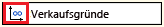
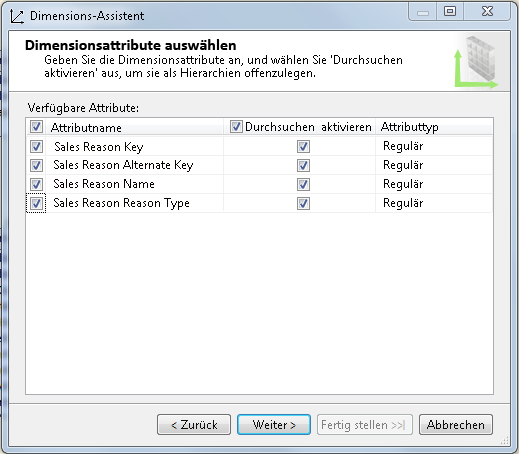
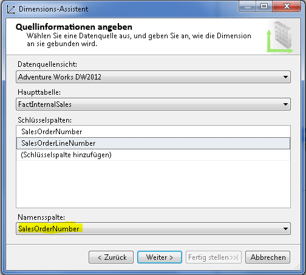
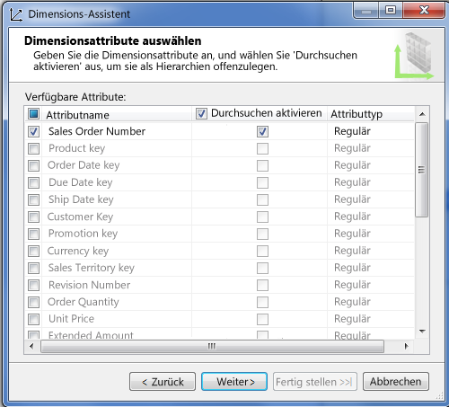
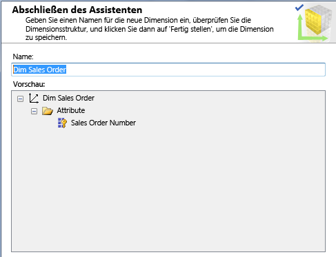
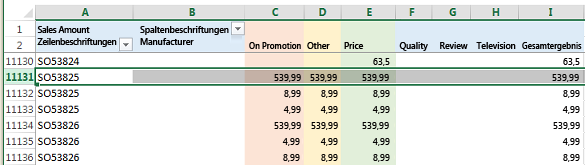
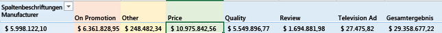

# Definieren einer m:n-Beziehung und deren Eigenschaften
  In diesem Thema werden m:n-Dimensionen in Analysis Services erläutert. Zusätzlich wird beschrieben, in welchen Fällen sie verwendet und wie sie erstellt werden.  
  
## Einführung  
 Analysis Services unterstützt m:n-Dimensionen und ermöglicht so komplexere Analysen als diejenigen, die in einem klassischen Sternschema modelliert werden können. In einem klassischen Sternschema verfügen alle Dimensionen über eine 1:n-Beziehung mit einer Faktentabelle. Jeder Fakt ist mit einem Dimensionselement verknüpft, und ein einzelnes Dimensionselement ist vielen Fakten zugeordnet.  
  
 Durch m:n-Beziehungen wird diese Modellierungsbeschränkung aufgehoben, da ein Fakt (z. B. ein Kontensaldo) mehreren Elementen derselben Dimension zugeordnet werden kann (der Saldo eines Gemeinschaftskontos kann zwei oder mehr Besitzern eines Gemeinschaftskontos zugeordnet werden).  
  
 Grundsätzlich entspricht eine m:n-Dimensionsbeziehung in Analysis Services m:n-Beziehungen in einem relationalen Modell und unterstützt dieselben Szenarien. Typische Beispiele für m:n-Beziehungen:  
  
-   Studenten schreiben sich in viele Kurse ein, und an jedem Kurs nehmen zahlreiche Studenten teil.  
  
-   Ärzte verfügen über viele Patienten, und Patienten verfügen über viele Ärzte.  
  
-   Kunden verfügen über viele Bankkonten, und Bankkonten können sich im Besitz mehrerer Kunden befinden.  
  
-   In Adventure Works haben viele Kunden viele Gründe, ein Produkt zu bestellen, und ein Verkaufsgrund kann vielen Bestellungen zugeordnet werden.  
  
 Aus analytischer Sicht entspricht das Problem, das durch eine m:n-Beziehung aufgelöst wird, einer genauen Darstellung einer Anzahl oder Summe im Verhältnis zur Dimensionsbeziehung (bei der Ausführung von Berechnungen für ein bestimmtes Dimensionselement werden Doppelzählungen normalerweise entfernt). Dieser Zusammenhang wird anhand eines Beispiels deutlich. Angenommen, ein Produkt oder Dienst gehört mehr als einer Kategorie an. Wenn Sie die Anzahl der Dienste nach Kategorie ermitteln, sollte ein Dienst, der beiden Kategorien angehört in jeder Kategorie enthalten sein. Gleichzeitig möchten Sie nicht mehr Dienste angeben, als Sie tatsächlich bereitstellen. Wenn Sie die m:n-Dimensionsbeziehung angeben, erhöht sich die Wahrscheinlichkeit, dass bei der Abfrage nach Kategorie oder nach Dienst die richtigen Ergebnisse zurückgegeben werden. Um sicherzustellen, dass diese Annahme zutrifft, sollten jedoch eingehende Tests durchgeführt werden.  
  
 Aus struktureller Sicht ist das Erstellen einer m:n-Dimensionsbeziehung mit dem Erstellen einer m:n-Beziehung in einem relationalen Datenmodell vergleichbar. Während ein relationales Modell eine *Verknüpfungstabelle* zum Speichern von Zeilenzuordnungen verwendet, nutzt ein mehrdimensionales Modell eine *Zwischenmeasuregruppe*. Als "Zwischenmeasuregruppe" wird eine Tabelle bezeichnet, durch die Elemente aus unterschiedlichen Dimensionen zugeordnet werden.  
  
 Eine m:n-Dimensionsbeziehung wird in einem Cubediagramm nicht visuell dargestellt. Stattdessen sollten Sie die m:n-Beziehungen in einem Modell mithilfe der Registerkarte Dimensionsverwendung identifizieren. Eine m:n-Beziehung wird durch das folgende Symbol gekennzeichnet.  
  
   
  
 Klicken Sie auf die Schaltfläche, um das Dialogfeld Beziehung definieren zu öffnen und zu überprüfen, ob die Beziehung vom Typ m:n ist, und um zu ermitteln, welche Zwischenmeasuregruppe in der Beziehung verwendet wird.  
  
   
  
 In den nachfolgenden Abschnitten erfahren Sie, wie eine m:n-Dimension eingerichtet wird und Verhaltensweisen von Modellen getestet werden. Wenn Sie zusätzliche Informationen benötigen oder zunächst die Tutorials ausführen möchten, finden Sie Hinweise unter **Weitere Informationen** am Ende dieses Artikels.  
  
## Erstellen einer m:n-Dimension  
 Eine einfache m:n-Beziehung umfasst zwei Dimensionen mit einer m:n-Kardinalität, eine Zwischenmeasuregruppe zum Speichern von Elementzuordnungen und eine Faktenmeasuregruppe, die messbare Daten enthält, z. B. den Gesamtumsatz oder den Saldo eines Bankkontos.  
  
 Dimensionen in einer m:n-Beziehung können über entsprechende Tabellen in der DSV verfügen, wobei jede Dimension im Modell auf einer vorhandenen Tabelle in einer Datenquelle basiert. Umgekehrt können die Dimensionen im Modell von weniger bzw. anderen physischen Tabellen in der DSV abgeleitet sein. Der Adventure Works-Beispielcube veranschaulicht anhand von Sales Reasons und Sales Orders eine m:n-Beziehung unter Verwendung von Dimensionen, die als reine Modelldatenstrukturen vorkommen und keine physischen Entsprechungen in der DSV besitzen. Die Sales Order-Dimension basiert auf einer Faktentabelle in der zugrundeliegenden Datenquelle und nicht auf einer Dimensionstabelle.  
  
 Im nächsten Verfahren wird davon ausgegangen, dass Sie bereits wissen, welche Entitäten an der m:n-Beziehung beteiligt sind. Unter **Weitere Informationen** finden Sie weiterführende Inhalte.  
  
 Zur Veranschaulichung der Schritte, die zum Erstellen einer m:n-Beziehung erforderlich sind, wird in diesem Verfahren eine der m:n-Beziehungen im Adventure Works-Beispielcube erneut erstellt. Wenn Sie die Quelldaten (d. h. das Data Warehouse-Beispiel für AdventureWorks) auf der Instanz eines relationalen Datenbankmoduls installiert haben, können Sie diesen Schritten folgen.  
  
#### Schritt 1: Überprüfen der DSV-Beziehungen  
  
1.  Erstellen Sie in SQL Server Data Tools in einem mehrdimensionalen Projekt eine Datenquelle für das relationale Data Warehouse Adventure Works DW 2012, das auf einer SQL Server-Datenbankmodul-Instanz gehostet wird.  
  
2.  Erstellen Sie unter Verwendung der folgenden vorhandenen Tabellen eine Datenquellensicht:  
  
    -   FactInternetSales  
  
    -   FactInternetSalesReason  
  
    -   DimSalesReason  
  
3.  Stellen Sie sicher, dass alle Tabellen, die in den m:n-Beziehungen verwendet werden sollen, in der DSV durch Primärschlüsselbeziehungen zueinander in Beziehung stehen. Dies ist erforderlich, damit in einem nachfolgenden Schritt eine Verknüpfung mit der Zwischenmeasuregruppe erstellt werden kann.  
  
    > [!NOTE]  
    >  Wenn die zugrunde liegende Datenquelle keine Primär- und Fremdschlüsselbeziehungen aufweist, können Sie die Beziehungen in der DSV manuell erstellen. Weitere Informationen finden Sie unter [Definieren von logischen Beziehungen in einer Datenquellensicht &#40;Analysis Services&#41;](../../analysis-services/multidimensional-models/define-logical-relationships-in-a-data-source-view-analysis-services.md).  
  
     Aus dem folgenden Beispiel ist ersichtlich, dass die in diesem Verfahren verwendeten Tabellen mit Primärschlüsseln verknüpft sind.  
  
       
  
#### Schritt 2: Erstellen von Dimensionen und Measuregruppen  
  
1.  Klicken Sie in SQL Server Data Tools in einem mehrdimensionalen Projekt mit der rechten Maustaste auf **Dimensionen** , und wählen Sie **Neue Dimension**aus.  
  
2.  Erstellen Sie basierend auf der vorhandenen **DimSalesReason**-Tabelle eine neue Dimension. Übernehmen Sie bei der Angabe der Quelle alle Standardwerte.  
  
     Wählen Sie alle Attribute aus.  
  
       
  
3.  Erstellen Sie basierend auf der vorhandenen Fact Internet Sales-Tabelle eine zweite Dimension. Obwohl dies eine Faktentabelle ist, enthält sie Sales Order-Informationen. Wir verwenden sie, um eine Sales Order-Dimension zu erstellen.  
  
4.  In Quellinformationen angeben wird eine Warnung mit dem Hinweis angezeigt, dass eine Namensspalte angegeben werden muss. Wählen Sie als Namen **SalesOrderNumber** aus.  
  
       
  
5.  Wählen Sie auf der nächsten Assistentenseite die Attribute aus. In diesem Beispiel reicht es aus, **SalesOrderNumber**auszuwählen.  
  
       
  
6.  Benennen Sie die Dimension in **Dim Sales Orders**um, damit eine konsistente Benennungskonvention für die Dimensionen verwendet wird.  
  
       
  
7.  Klicken Sie mit der rechten Maustaste auf **Cubes** , und wählen Sie **Neuer Cube**aus.  
  
8.  Wählen Sie in den Measuregruppentabellen **FactInternetSales** und **FactInternetSalesReason**aus.  
  
     Sie wählen die **FactInternetSales** -Tabelle aus, da sie die Measures enthält, die Sie im Cube verwenden möchten. Sie wählen die **FactInternetSalesReason** -Tabelle aus, da sie die Zwischenmeasuregruppe darstellt, die die Elementzuordnungsdaten bereitstellt, durch die Bestellungen und Verkaufsgründe zueinander in Beziehung gesetzt werden.  
  
9. Wählen Sie Measures für jede Faktentabelle aus.  
  
     Löschen Sie alle Measures, und wählen Sie nur **Sales Amount** und **Fact Internet Sales Count** unten in der Liste aus, um das Modell zu vereinfachen. Da **FactInternetSalesReason** nur über ein Measure verfügt, wird es automatisch ausgewählt.  
  
10. In der Dimensionsliste sollten **Dim Sales Reason** und **Dim Sales Orders**angezeigt werden.  
  
     Auf der Seite „Neue Dimensionen auswählen“ werden Sie vom Assistenten aufgefordert, eine neue Dimension für **Fact Internet Sales Dimension**zu erstellen. Da Sie diese Dimension nicht benötigen, können Sie sie aus der Liste löschen.  
  
11. Geben Sie dem Cube einen Namen, und klicken Sie auf **Fertig stellen**.  
  
#### Schritt 3: Definieren einer m:n-Beziehung  
  
1.  Klicken Sie im Cube-Designer auf die Registerkarte Dimensionsverwendung. Beachten Sie, dass zwischen **Dim Sales Reason** und **Fact Internet Sales**bereits eine m:n-Beziehung besteht. Wie Sie wissen, kennzeichnet das folgende Symbol eine m:n-Beziehung.  
  
       
  
2.  Klicken Sie auf die Zelle am Schnittpunkt zwischen **Dim Sales Reason** und **Fact Internet Sales**, und klicken Sie dann auf die Schaltfläche, um das Dialogfeld „Beziehung definieren“ zu öffnen.  
  
     Wie Sie sehen, wird dieses Dialogfeld zum Angeben einer m:n-Beziehung verwendet. Wenn Sie stattdessen Dimensionen mit einer regulären Beziehung hinzufügen würden, könnten Sie dieses Dialogfeld verwenden, um sie in eine m:n-Beziehung zu ändern.  
  
       
  
3.  Stellen Sie das Projekt auf einer mehrdimensionalen Analysis Services-Instanz bereit. Im nächsten Schritt durchsuchen Sie den Cube in Excel, um dessen Verhalten zu überprüfen.  
  
## Testen der m:n-Beziehung  
 Wenn Sie eine m:n-Beziehung in einem Cube definieren, sollte dieser unbedingt getestet werden, um sicherzustellen, dass Abfragen die erwarteten Ergebnisse zurückgeben. Der Cube sollte unter Verwendung des Clientanwendungstools getestet werden, das von Endbenutzern verwendet wird. Im nächsten Verfahren verwenden Sie Excel, um eine Verbindung mit dem Cube herzustellen und die Abfrageergebnisse zu überprüfen.  
  
#### Durchsuchen des Cubes in Excel  
  
1.  Stellen Sie das Projekt bereit, und durchsuchen Sie den Cube, um sicherzustellen, dass die Aggregationen gültig sind.  
  
2.  Klicken Sie in Excel auf **Daten** | **Aus anderen Quellen** | **Von Analysis Services**. Geben Sie den Servernamen ein, und wählen Sie die Datenbank und den Cube aus.  
  
3.  Erstellen Sie eine PivotTable mit folgenden Elementen:  
  
    -   **Sales Amount** als Wert  
  
    -   **Sales Reason Name** für Spalten  
  
    -   **Sales Order Number** für Zeilen  
  
4.  Analysieren Sie die Ergebnisse. Da wir Beispieldaten verwenden, entsteht zunächst der Eindruck, dass alle Bestellungen identische Werte aufweisen. Wenn Sie jedoch einen Bildlauf nach unten durchführen, sehen Sie, dass die Daten variieren.  
  
     Etwas weiter unten finden Sie den Verkaufsbetrag und die Verkaufsgründe für die Bestellnummer **SO5382**. Die Gesamtsumme dieser Bestellung beträgt **539,99**, und die dieser Bestellung zugeordneten Verkaufsgründe sind Promotion, Other und Price.  
  
       
  
     Beachten Sie, dass der Verkaufsbetrag für die Bestellung korrekt berechnet wurde. Er beträgt **539,99** für die gesamte Bestellung. Obwohl für jeden Grund **539,99** angegeben ist, wurde dieser Wert nicht für alle drei Gründe summiert, wodurch die Gesamtsumme fälschlicherweise überhöht ist.  
  
     Warum sollte unter jedem Verkaufsgrund unbedingt ein Verkaufsbetrag eingefügt werden? Ganz einfach: Auf diese Weise können wir die Verkäufe quantifizieren, die den einzelnen Gründen zugeordnet sind.  
  
5.  Führen Sie einen Bildlauf zum Ende des Arbeitsblatts durch. Es ist deutlich zu erkennen, dass Price im Verhältnis zu anderen Gründen und der Gesamtsumme der wichtigste Grund für Kundenkäufe ist.  
  
       
  
#### Tipps zum Behandeln unerwarteter Abfrageergebnisse  
  
1.  Measures, die in einer Abfrage keine sinnvollen Ergebnisse zurückgeben, z. B. die Anzahl, sollten in der Zwischenmeasuregruppe ausgeblendet werden. So wird verhindert, dass Benutzer Aggregationen verwenden, die bedeutungslose Daten erzeugen. Um ein Measure auszublenden, legen Sie im Dimensions-Designer **Sichtbarkeit** für das Attribut auf **FALSE** fest.  
  
2.  Erstellen Sie Perspektiven, um eine Teilmenge mit Measures und Dimensionen zu verwenden, die die Analysemöglichkeiten unterstützt, die Sie bereitstellen möchten. Ein Cube kann zahlreiche Measuregruppen und Dimensionen enthalten, die nicht in allen Situationen reibungslos zusammenwirken. Indem Sie die Dimensionen und Measuregruppen, die zusammen verwendet werden sollen, isolieren, ist das Ergebnis besser vorhersagbar.  
  
3.  Achten Sie darauf, ein Modell bereitzustellen und erneut eine Verbindung herzustellen, nachdem Sie es geändert haben. Verwenden Sie in Excel die Schaltfläche Aktualisieren im PivotTable-Menüband Analysieren.  
  
4.  Es sollten keine verknüpften Measuregruppen in mehreren m:n-Beziehungen verwendet werden, insbesondere wenn sich diese Beziehungen in verschiedenen Cubes befinden. Andernfalls können mehrdeutige Aggregationen entstehen. Weitere Informationen finden Sie unter [Falsche Mengen für verknüpfte Measures in Cubes mit m:n-Beziehungen](http://social.technet.microsoft.com/wiki/contents/articles/22911.incorrect-amounts-for-linked-measures-in-cubes-containing-many-to-many-relationships-ssas-troubleshooting.aspx).  
  
##   Learn more  
 Über die folgenden Links erhalten Sie zusätzliche Informationen, mit denen Sie Ihr Wissen vertiefen können.  
  
 [Die m:n-Revolution 2.0](http://go.microsoft.com/fwlink/?LinkId=324760)  
  
 [Lernprogramm: Beispiel einer m:n-Dimension für SQL Server Analysis Services](http://go.microsoft.com/fwlink/?LinkId=324761)  
  
## Siehe auch  
 [Dimensionsbeziehungen](../../analysis-services/multidimensional-models-olap-logical-cube-objects/dimension-relationships.md)   
 [Installieren von Sample Data and Projects für Analysis Services-mehrdimensionale Modellierung-Lernprogramm](../../analysis-services/install-sample-data-and-projects.md)   
 [Bereitstellen von Analysis Services-Projekten &#40; SSDT &#41;](../../analysis-services/multidimensional-models/deploy-analysis-services-projects-ssdt.md)   
 [Perspektiven in mehrdimensionalen Modellen](../../analysis-services/multidimensional-models/perspectives-in-multidimensional-models.md)  
  
  

