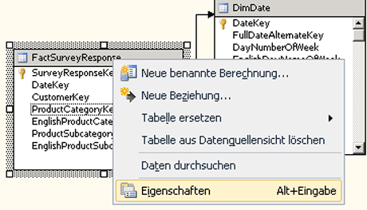

# <a name="define-named-calculations-in-a-data-source-view-analysis-services"></a>Definieren von benannten Berechnungen in einer Datenquellensicht (Analysis Services)
  Eine benannte Berechnung ist ein SQL-Ausdruck, der als berechnete Spalte dargestellt wird. Dieser Ausdruck wird als Spalte in der Tabelle angezeigt und verhält sich auch wie eine Spalte. Mit einer benannten Berechnung können Sie das relationale Schema vorhandener Tabellen oder Sichten in einer Datenquellensicht erweitern, ohne die Tabellen oder Sichten in der zugrunde liegenden Datenquelle zu ändern. Betrachten Sie die folgenden Beispiele:  
  
-   Erstellen Sie eine einzelne benannte Berechnung, die von mehreren Spalten in einer Faktentabelle abgeleitet wird (erstellen Sie z. B. einen Steuerbetrag, indem ein Steuersatz mit einem Verkaufspreis multipliziert wird).  
  
-   Erstellen Sie einen benutzerfreundlichen Namen für ein Dimensionselement.  
  
-   Um die Abfrageleistung zu optimieren, erstellen Sie eine benannte Berechnung in der DSV, anstatt ein berechnetes Element in einem Cube zu erstellen. Benannte Berechnungen werden während der Verarbeitung berechnet, wohingegen berechnete Elemente zur Abfragezeit berechnet werden.  
  
## <a name="creating-named-calculations"></a>Erstellen benannter Berechnungen  
  
> [!NOTE]  
>  Sie können einer benannten Abfrage keine benannte Berechnung hinzufügen. Die benannte Abfrage darf auch nicht auf einer Tabelle basieren, die eine benannte Berechnung enthält.  
  
 Beim Erstellen einer benannten Berechnung geben Sie einen Namen, den SQL-Ausdruck und (optional) eine Beschreibung für die Berechnung an. Der SQL-Ausdruck kann auf andere Tabellen in der Datenquellensicht verweisen. Nachdem Sie die benannte Berechnung definiert haben, wird der in einer benannten Berechnung enthaltene Ausdruck an den Datenquellenanbieter gesendet und als die folgende SQL-Anweisung validiert, in der `<Expression>` den Ausdruck enthält, der die benannte Berechnung definiert.  
  
```  
SELECT   
   <Table Name in Data Source>.*,   
   <Expression> AS <Column Name>   
FROM   
   <Table Name in Data Source> AS <Table Name in Data Source View>  
```  
  
 Der Datentyp der Spalte wird von dem Datentyp des Skalarwertes bestimmt, der von dem Ausdruck zurückgegeben wird. Wenn der Anbieter keine Fehler im Ausdruck findet, wird die Spalte der Tabelle hinzugefügt.  
  
 Spalten, auf die im Ausdruck verwiesen wird, sollten nicht gekennzeichnet oder nur durch den Tabellennamen gekennzeichnet sein. Wenn Sie z. B. auf die SaleAmount-Spalte in einer Tabelle verweisen möchten, ist `SaleAmount` oder `Sales.SaleAmount` gültig, aber `dbo.Sales.SaleAmount` generiert einen Fehler.  
  
 Dieser Ausdruck wird nicht automatisch in Klammern eingeschlossen. Deshalb müssen Sie die Klammern in das Feld **Ausdruck** eingeben, wenn ein Ausdruck, z. B. eine SELECT-Anweisung, Klammern erfordert. Der folgende Ausdruck ist beispielsweise nur gültig, wenn Sie die Klammern eingeben.  
  
```  
(SELECT Description FROM Categories WHERE Categories.CategoryID = CategoryID)  
```  
  
## <a name="add-or-edit-a-named-calculation"></a>Hinzufügen oder Bearbeiten einer benannten Berechnung  
  
1.  Öffnen Sie in [!INCLUDE[ssBIDevStudioFull](../../includes/ssbidevstudiofull-md.md)]das Projekt, oder stellen Sie eine Verbindung mit der Datenbank her, in der die Datenquellensicht enthalten ist, in der Sie eine benannte Berechnung definieren möchten.  
  
2.  Erweitern Sie im Projektmappen-Explorer den Ordner **Datenquellensichten** und doppelklicken Sie anschließend auf die Datenquellensicht.  
  
3.  Klicken Sie im Bereich **Tabellen** oder **Diagramm** mit der rechten Maustaste auf die Tabelle, in der Sie die benannte Berechnung definieren möchten, und klicken Sie anschließend auf **Neue benannte Berechnung**. Stellen Sie sicher, dass Sie mit der rechten Maustaste auf den Tabellennamen klicken und nicht auf ein Attribut. Das Menü sollte wie folgt aussehen:  
  
       
  
    > [!NOTE]  
    >  Um nach einer Tabelle oder Sicht zu suchen, können Sie die Option **Tabelle suchen** verwenden, indem Sie entweder auf das Menü **Datenquellensicht** klicken oder mit der rechten Maustaste auf einen offenen Bereich im Bereich **Tabellen** oder **Diagramm** klicken.  
  
4.  Führen Sie im Dialogfeld **Benannte Berechnung erstellen** folgende Schritte aus:  
  
    -   Geben Sie im Textfeld **Spaltenname** den Namen der neuen Spalte ein.  
  
    -   Geben Sie im Textfeld **Beschreibung** eine Beschreibung für die neue Spalte ein.  
  
    -   Geben Sie im Textfeld **Ausdruck** den Ausdruck ein, der den Inhalt der neuen Spalte ergibt, und verwenden Sie hierbei den SQL-Dialekt, der für den jeweiligen Datenanbieter geeignet ist.  
  
5.  Klicken Sie auf **OK**.  
  
     Die Spalte mit der benannten Berechnung wird als letzte Spalte in der Tabelle für die Datenquellensicht angezeigt. Ein Rechnersymbol weist darauf hin, dass die Spalte eine benannte Berechnung enthält.  
  
## <a name="delete-a-named-calculation"></a>Löschen einer benannten Berechnung  
 Wenn Sie versuchen, eine benannte Berechnung zu löschen, wird eine Liste der im Projekt oder in der Datenbank definierten Objekte angezeigt, die durch den Löschvorgang ungültig werden. Überprüfen Sie die Liste sorgfältig vor dem Löschen der Berechnung.  
  
## <a name="see-also"></a>Siehe auch  
 [Definieren von benannten Abfragen in einer Datenquellensicht &#40;Analysis Services&#41;](../../analysis-services/multidimensional-models/define-named-queries-in-a-data-source-view-analysis-services.md)  
  
  

