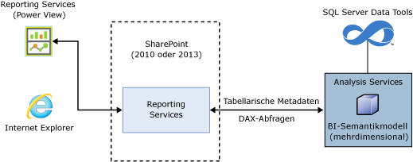
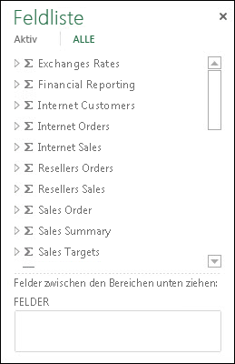
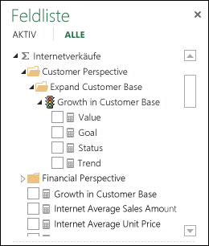
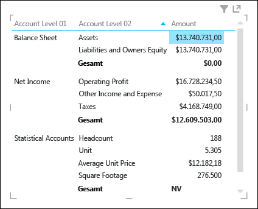
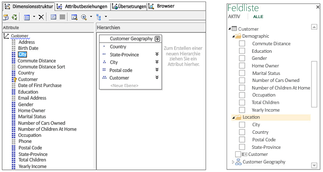
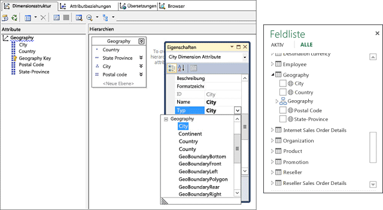
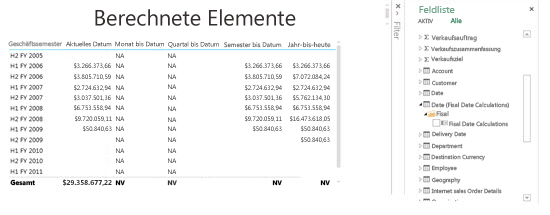
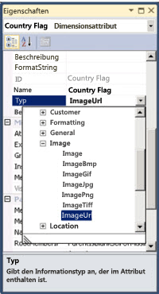
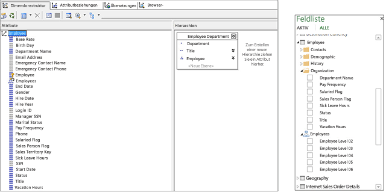
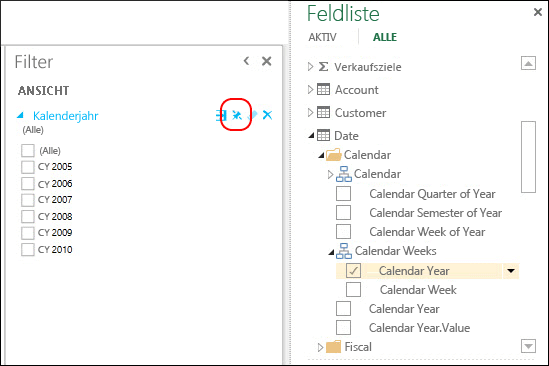

# <a name="understanding-power-view-for-multidimensional-models"></a>Grundlegendes zu Power View für mehrdimensionale Modelle
  In diesem Artikel wird Power View für mehrdimensionale Modelle in SQL Server beschrieben, und es werden wichtige Informationen für BI-Experten und -Administratoren zusammengefasst, die Power View für mehrdimensionale Modelle in ihrem Unternehmen implementieren möchten.  
  
 Mehrdimensionale Modelle bieten branchenführende Modellierungs-, Speicherungs- und Analyselösungen für OLAP-Daten. In Microsoft SQL Server unterstützen mehrdimensionale Modelle das Analysieren, Durchsuchen und Visualisieren von Daten im Ad-hoc-Verfahren unter Verwendung von Microsoft Power View.  
  
 Power View ist ein Thin Web Client, der über eine freigegebene RSDS-Datei (Report Data Source, Berichtsdatenquelle) in einer SharePoint-Bibliothek im Browser gestartet wird. Die Berichtsdatenquelle stellt das Bindeglied zwischen dem Client und der Back-End-Datenquelle dar. Mögliche Back-End-Datenquellen sind: eine [!INCLUDE[ssGemini](../../includes/ssgemini-md.md)] -Arbeitsmappe in SharePoint, ein tabellarisches Modell auf einem Analysis Services-Server, der im tabellarischen Modus ausgeführt wird, oder ein mehrdimensionales Modell auf einem Analysis Services-Server, der im mehrdimensionalen Modus ausgeführt wird. Power View-Berichte können in einer SharePoint-Bibliothek oder einem SharePoint-Katalog gespeichert und mit anderen Mitarbeitern im Unternehmen gemeinsam genutzt werden.  
  
 **Architektur von Power View für mehrdimensionale Modelle**  
  
   
  
## <a name="prerequisites"></a>Erforderliche Komponenten  
 **Serveranforderungen**  
  
-   Microsoft SQL Server 2016 Analysis Services (Ausführung im mehrdimensionalen Modus)  
  
-   Microsoft SQL Server 2016 Reporting Services-Add-In für Microsoft SharePoint Server 2010 oder später Enterprise Edition.  
  
 **Clientanforderungen**  
  
-   Für die Power View-Clientfunktionen ist Microsoft Silverlight 5 erforderlich. Weitere Informationen finden Sie unter [Browserunterstützung für Reporting Services und Power View](../../reporting-services/browser-support-for-reporting-services-and-power-view.md).  
  
## <a name="features"></a>Funktionen  
 **Systemeigene Unterstützung für Power View**  
  
 In dieser Version unterstützen mehrdimensionale Modelle die Analyse und Visualisierung unter Verwendung von Power View im SharePoint-Modus. Es ist keine spezielle Konfiguration für die mehrdimensionalen Modelle erforderlich. Es gibt jedoch Unterschiede zwischen der Anzeige mehrdimensionaler Modellobjekte in Power View und anderen Clienttools wie Microsoft Excel und Microsoft Performance Point. Diese Version bietet keine Unterstützung für die Analyse und Visualisierung mehrdimensionaler Modelle mithilfe von Power View in Excel.  
  
 **Systemeigene Unterstützung für DAX-Abfragen**  
  
 In dieser Version unterstützen mehrdimensionale Modelle neben gängigeren MDX-Abfragen auch DAX-Abfragen und -Funktionen. Einige DAX-Funktionen, wie PATH, sind nicht auf mehrdimensionale Modelle anwendbar. Unter [Data Analysis Expressions und MDX](http://msdn.microsoft.com/library/ff487170\(SQL.105\).aspx)finden Sie weiterführende Informationen zu DAX und eine Gegenüberstellung mit MDX.  
  
## <a name="multidimensional-to-tabular-object-mapping"></a>Zuordnung zwischen mehrdimensionalen und tabellarischen Objekten  
 Analysis Services bietet eine tabellarische Darstellung der Modellmetadaten eines mehrdimensionalen Modells. Objekte in einem mehrdimensionalen Modell werden in Power View als tabellarische Objekte und in "CSDL/out" als tabellarische Objekte mit BI-Anmerkungen dargestellt.  
  
 **Übersicht der Objektzuordnung**  
  
|Mehrdimensionales Objekt|Tabellarisches Objekt|  
|-----------------------------|--------------------|  
|Cube|Model|  
|Cubedimension|Tabelle|  
|Dimensionsattribute (Schlüssel, Name)|Column|  
|Measuregruppe|Tabelle|  
|Measure|Measure|  
|Measure ohne Measuregruppe|In einer Tabelle mit dem Namen "Measures"|  
|Beziehung zwischen Measuregruppe und Cubedimension|Beziehung|  
|Perspective|Perspective|  
|KPI|KPI|  
|Benutzerhierarchien/Über-/Unterordnungshierarchien|Hierarchy|  
|Anzeigeordner|Anzeigeordner|  
  
## <a name="measures-measure-groups-and-kpis"></a>Measures, Measuregruppen und KPIs  
  
> [!NOTE]  
>  Einige in diesem Artikel enthaltene Abbildungen und Texte beziehen sich auf die Beispieldatenbank zu Adventure Works Multidimensional Models SQL Server 2012.  
  
 Measuregruppen in einem mehrdimensionalen Cube werden in der Power View-Feldliste als Tabellen mit dem Sigma-Zeichen (∑) dargestellt.  
  
 **Measuregruppen in der Power View-Feldliste**  
  
   
  
 Measures innerhalb einer Measuregruppe werden als Measures dargestellt. Berechnete Measures, die keiner Measuregruppe zugeordnet sind, werden in einer speziellen Tabelle mit der Bezeichnung "Measures" gruppiert.  
  
 Um komplexere mehrdimensionale Modelle zu vereinfachen, können Modellentwickler einen Satz von Measures oder KPIs in einem Cube definieren, der in einen Anzeigeordner eingefügt wird. Anzeigeordner und die darin enthaltenen Measures und KPIs können von Power View angezeigt werden.  
  
 **Measures und KPIs in einer Measuregruppe**  
  
   
  
### <a name="measures-as-variants"></a>Measures als Varianten  
 Measures in mehrdimensionalen Modellen sind Varianten. Dies bedeutet, dass die Measures nicht stark typisiert sind und über unterschiedliche Datentypen verfügen können. In der folgenden Abbildung verfügt das Amount-Measure im Finanzbericht standardmäßig über den Currency-Datentyp, weist jedoch für das Teilergebnis von "Statistical Accounts" auch den Zeichenfolgenwert "NA" auf, der dem String-Datentyp entspricht. Power View erkennt bestimmte Measures als Varianten und zeigt in den verschiedenen Visualisierungen die richtigen Werte und Formatierungen an.  
  
 **Measure als Variante**  
  
   
  
### <a name="implicit-measures"></a>Implizite Measures  
 Tabellarische Modelle bieten die Möglichkeit, *implizite* Measures wie COUNT, SUM oder AVERAGE für Felder zu erstellen. Da Dimensionsattributdaten bei mehrdimensionalen Modellen auf andere Weise gespeichert werden, kann das Abfragen impliziter Measures einige Zeit in Anspruch nehmen. Aus diesem Grund sind in Power View keine impliziten Measures verfügbar.  
  
## <a name="dimensions-attributes-and-hierarchies"></a>Dimensionen, Attribute und Hierarchien  
 Cubedimensionen werden in tabellarischen Metadaten als Tabellen verfügbar gemacht. In der Power View-Feldliste werden Dimensionsattribute als Spalten in Anzeigeordnern angezeigt.  Dimensionsattribute, deren AttributeHierarchyEnabled-Eigenschaft (vgl. das Birth Date-Attribut in der Customer-Dimension) oder AttributeHierarchyVisible-Eigenschaft auf False festgelegt ist, werden in der Power View-Feldliste nicht angezeigt. Hierarchien mit mehreren Ebenen oder Benutzerhierarchien (z. B. "Customer Geography" in der Customer-Dimension) werden in der Power View-Feldliste als Hierarchien verfügbar gemacht. Auf Hidden festgelegte UnknownMembers eines Dimensionsattributs werden in DAX-Abfragen und in Power View verfügbar gemacht.  
  
 **Dimensionen, Attribute und Hierarchien in SQL Server Data Tools (SSDT) und der Power View-Feldliste**  
  
   
  
### <a name="dimension-attribute-type"></a>Dimensionsattributtyp  
 Mehrdimensionale Modelle unterstützen die Zuordnung spezifischer Dimensionsattributtypen zu Dimensionsattributen. Die folgende Abbildung zeigt die Geography-Dimension mit den Dimensionsattributen City, State-Province, Country und Postal Code, denen geography-Typen zugeordnet sind. Diese werden in den tabellarischen Metadaten verfügbar gemacht. Da die Metadaten von Power View erkannt werden, sind Benutzer in der Lage, Kartenvisualisierungen zu erstellen. Dies ist an dem Kartensymbol erkennbar, das in der Geography-Table der Power View-Feldliste neben den Spalten City, Country, Postal Code und State-Province angezeigt wird.  
  
 **Geography-Typen von Dimensionsattributen in SSDT und Power View-Feldliste**  
  
   
  
### <a name="dimension-calculated-members"></a>Berechnete Dimensionselemente  
 Mehrdimensionale Modelle unterstützen berechnete Elemente für untergeordnete Elemente von Alle mit einem einzelnen realen Element. Beim Verfügbarmachen dieses Typs berechneter Elemente gelten folgende zusätzliche Einschränkungen:  
  
-   Wenn die Dimension über mehrere Attribute verfügt, muss das Element ein einzelnes reales Element sein.  
  
-   Ein Attribut, das berechnete Elemente enthält, darf nur das Schlüsselattribut der Dimension sein, wenn es das einzige Attribut ist.  
  
-   Ein Attribut, das berechnete Elemente enthält, darf kein über- und untergeordnetes Attribut sein.  
  
 Obwohl berechnete Elemente von Benutzerhierarchien in Power View nicht verfügbar gemacht werden, sind Endbenutzer trotzdem in der Lage, eine Verbindung mit einem Cube herzustellen, der berechnete Elemente für Benutzerhierarchien enthält.  
  
 Die folgende Abbildung zeigt einen Power View-Bericht für einen Cube, der berechnete Zeitintelligenzelemente für das Dimensionsattribut "Fiscal Date Calculations" in der Date-Dimension enthält.  
  
 **Power View-Bericht mit berechneten Elementen**  
  
   
  
### <a name="default-members"></a>Standardelemente  
 Mehrdimensionale Modelle unterstützen Standardelemente für Dimensionsattribute. Das Standardelement wird von Analysis Services beim Aggregieren von Daten für eine Abfrage verwendet. Das Standardelement eines Dimensionsattributs wird als Standardwert oder Filter für die entsprechende Spalte in den tabellarischen Metadaten verfügbar gemacht.  
  
 Beim Anwenden von Attributen weist Power View ein ähnliches Verhalten wie Excel-PivotTables auf. Wenn ein Benutzer einer Power View-Visualisierung (Tabelle, Matrix oder Diagramm) eine Spalte hinzufügt, die einen Standardwert enthält, wird der Standardwert nicht angewendet, und stattdessen werden alle verfügbaren Werte angezeigt. Fügt der Benutzer die Spalte zu Filter hinzu, wird der Standardwert angewendet.  
  
### <a name="dimension-security"></a>Dimensionssicherheit  
 Mehrdimensionale Modelle unterstützen Sicherheit auf Dimensions- und Zellenebene mithilfe von Rollen. Ein Benutzer, der über Power View eine Verbindung mit einem Cube herstellt, wird authentifiziert und auf die geeigneten Berechtigungen überprüft. Bei Sicherheit auf Dimensionsebene kann der Benutzer die jeweiligen Dimensionselemente in Power View nicht einsehen. Wurde für einen Benutzer jedoch eine Sicherheitsberechtigung auf Zellenebene definiert, bei der bestimmte Zellen eingeschränkt sind, kann er in Power View keine Verbindung mit dem Cube herstellen. In einigen Fällen können Benutzer Aggregatdaten anzeigen, wenn Teile davon aus gesicherten Daten berechnet werden.  
  
### <a name="non-aggregatable-attributeshierarchies"></a>Nicht aggregierbare Attribute/Hierarchien  
 Für die Attribute einer in einem mehrdimensionalen Modell enthaltenen Dimension kann die IsAggregatable-Eigenschaft auf Falsefestgelegt sein. Dies bedeutet, dass der Modellentwickler festgelegt hat, dass Daten von Clientanwendungen bei der Datenabfrage nicht hierarchieübergreifend (auf Attributebene oder auf mehreren Ebenen) aggregiert werden sollen. In Power View wird dieses Dimensionsattribut als Spalte verfügbar gemacht, für die keine Teilergebnisse verfügbar sind. Die folgende Abbildung enthält ein Beispiel für die nicht aggregierbare Hierarchie "Accounts". Die oberste Ebene der Über-/Unterordnungshierarchie "Accounts" kann im Gegensatz zu den anderen Ebenen nicht aggregiert werden. In einer Matrixvisualisierung der Hierarchie "Accounts" (erste beide Ebenen) werden Teilergebnisse für "Account Level 02", aber nicht für die oberste Ebene "Account Level 01" angezeigt.  
  
 **Nicht aggregierbare Hierarchie in Power View**  
  
   
  
## <a name="images"></a>Bilder  
 Power View ist in der Lage, Bilder zu rendern. Eine Möglichkeit, in mehrdimensionalen Modellen Bilder für Power View bereitzustellen, besteht darin, Spalten mit den URLs (Uniform Resource Locators) der Bilder verfügbar zu machen. In dieser Version unterstützt Analysis Services das Kennzeichnen von Dimensionsattributen mit dem ImageURL-Typ. Dieser Datentyp wird in den tabellarischen Metadaten für Power View bereitgestellt. Auf diesen Weise können die in den URLs angegebenen Bilder von Power View heruntergeladen und in Visualisierungen dargestellt werden.  
  
 **Dimensionsattributtyp "ImageURL" in SSDT**  
  
   
  
## <a name="parent-child-hierarchies"></a>Über-/Unterordnungshierarchien  
 Mehrdimensionale Modelle unterstützen Über-/Unterordnungshierarchien, die in den tabellarischen Metadaten als Hierarchie verfügbar gemacht werden. Jede Ebene der Über-/Unterordnungshierarchie wird als ausgeblendete Spalte verfügbar gemacht. Das Schlüsselattribut der über- und untergeordneten Dimension wird in den tabellarischen Metadaten nicht verfügbar gemacht.  
  
 **Über-/Unterordnungshierarchien in Power View**  
  
   
  
## <a name="perspectives-and-translations"></a>Perspektiven und Übersetzungen  
 Perspektiven sind Cubesichten, bei denen in Clienttools nur bestimmte Dimensionen oder Measuregruppen sichtbar sind. Sie können einen Perspektivennamen als Wert für die Verbindungszeichenfolgen-Eigenschaft Cube angeben. In der folgenden Verbindungszeichenfolge entspricht "Direct Sales" beispielsweise einer Perspektive im mehrdimensionalen Modell:  
  
 `Data Source=localost;Initial Catalog=AdventureWorksDW-MD;Cube='Direct Sales'`  
  
 In Cubes können Metadaten und Übersetzungen für unterschiedliche Sprachen innerhalb des Modells angegeben werden. Damit die Übersetzungen (Daten und Metadaten) angezeigt werden, müssen Sie der Verbindungszeichenfolge in der RSDS-Datei die optionale Locale Identifier-Eigenschaft hinzufügen, wie unten dargestellt.  
  
 `Data Source=localost;Initial Catalog=AdventureWorksDW-MD;Cube='Adventure Works'; Locale Identifier=3084`  
  
 Wenn Power View unter Verwendung einer RSDS-Datei, die Locale Identifier enthält, eine Verbindung mit einem mehrdimensionalen Modell herstellt und im Cube eine entsprechende Übersetzung enthalten ist, werden die Übersetzungen in Power View angezeigt.  
  
 Weitere Informationen finden Sie unter [Erstellen einer Berichtsdatenquelle](../../analysis-services/multidimensional-models/create-a-report-data-source.md).  
  
## <a name="power-view-pinned-filters"></a>Angeheftete Filter in Power View  
 Power View-Berichte können mehrere Sichten umfassen. In dieser Version bietet die Funktion *Filter anheften* sowohl in tabellarischen als auch in mehrdimensionalen Modellen die Möglichkeit, Filter zu erstellen, die für alle Sichten in einem Bericht gelten. Die folgende Abbildung zeigt die Umschaltfläche Filter anheften für einen Ansichtsfilter. Ein Ansichtsfilter ist standardmäßig nicht angeheftet und wird nur auf die jeweilige Sicht angewendet. Durch das Anheften wird ein Ansichtsfilter auf alle Sichten angewendet. Durch das Lösen des Filters wird er aus den anderen Sichten entfernt.  
  
 **Angeheftete Filter**  
  
   
  
## <a name="unsupported-features"></a>Nicht unterstützte Funktionen  
 **Power View in Excel 2013** unterstützt weder Verbindungen mit mehrdimensionalen Modellen noch das Erstellen von Berichten für mehrdimensionale Modelle. **Power View in Excel 2016** unterstützt jedoch Verbindungen mit mehrdimensionalen Modellen und das Erstellen von Berichten für mehrdimensionale Modelle. Weitere Informationen finden Sie unter [Power View und OLAP in Excel 2016](https://support.office.com/en-us/article/power-view-and-olap-in-excel-2016-ea5ff7a5-ea5f-48d4-aeb0-98c89ab738ac).  
  
 **Aktionen** werden in Power View-Berichten oder DAX-Abfragen für mehrdimensionale Modelle nicht unterstützt.  
  
 **Benannte Mengen** in mehrdimensionalen Modellen werden in Power View oder in DAX-Abfragen für mehrdimensionale Modelle nicht unterstützt.  
  
> [!NOTE]  
>  Die fehlende Unterstützung von Aktionen und benannten Mengen hindert Benutzer nicht daran, mithilfe von Power View eine Verbindung mit mehrdimensionalen Modellen herzustellen und diese zu durchsuchen.  
  
 **Sicherheit auf Zellenebene** wird in Power View-Berichten nicht unterstützt.  
  
## <a name="csdlbi-annotations"></a>CSDLBI-Anmerkungen  
 Mehrdimensionale Cubemetadaten werden als EDM (Entity Data Model)-basiertes konzeptionelles Modell durch die konzeptionelle Schemadefinitionssprache mit Business Intelligence-Anmerkungen (CSDLBI) verfügbar gemacht.  
  
 Mehrdimensionale Metadaten werden als Namespace für tabellarische Modelle in einem CSDLBI-Dokument oder in "CSDL/out" dargestellt, wenn eine DISCOVER_CSDL_METADATA-Anforderung an die Analysis Services-Instanz gesendet wird.  
  
 **Beispiel für eine DISCOVER_CSDL_METADATA-Anforderung**  
  
```  
<Envelopexmlns=”http://schemas.xmlsoap.org/soap/envelope/”>  
   <Body>  
      <Discoverxmlns=”urn:schemas-microsoft-com:xml-analysis”>  
         <RequestType>DISCOVER_CSDL_METADATA</RequestType>  
         <Restrictions>  
            <RestrictionList>  
              <CATALOG_NAME>”catalogname”<CATALOG_NAME>  
            </RestrictionList>  
         </Restrictions>  
         <Properties>  
            <PropertyList>  
            </PropertyList>  
         </Properties>  
      </Discover>  
   </Body>  
</Envelope>  
  
```  
  
 Die DISCOVER_CSDL_METADATA-Anforderung weist folgende Einschränkungen auf:  
  
|Name|Required|Description|  
|----------|--------------|-----------------|  
|CATALOG_NAME|Ja|Der Katalog-/Datenbankname.|  
|PERSPECTIVE_NAME|Ja, wenn der Cube mehr als eine Perspektive enthält. Optional, wenn nur ein Cube oder eine Standardperspektive vorhanden ist.|Der Cube- oder Perspektivenname in der mehrdimensionalen Datenbank.|  
|VERSION|Ja|Vom Client angeforderte CSDL-Version. Mehrdimensionale Funktionen und Konstrukte werden in Version 2.0 unterstützt.|  
  
 Im zurückgegebenen "CSDL/out"-Dokument wird das Modell als Namespace mit Entitäten, Zuordnungen und Eigenschaften dargestellt.  
  
 Ausführlichere Informationen zu CSDLBI-Anmerkungen für tabellarische Modelle finden Sie unter [Technische Referenz für BI-Anmerkungen zu CSDL](../../analysis-services/tabular-model-programming-compatibility-levels-1050-1103/conceptual-schema-definition-language-csdl/technical-reference-for-bi-annotations-to-csdl.md) auf MSDN und unter [\[MS-CSDLBI\]: Dateiformat für konzeptionelle Schemadefinitionen mit Business Intelligence-Anmerkungen](http://msdn.microsoft.com/library/jj161299\(SQL.105\).aspx).  
  
## <a name="client-help-on-officecom"></a>Hilfe zu Clienttools auf "Office.com"  
 In den folgenden Artikeln auf Office.com erfahren Benutzer, auf welche Weise mehrdimensionale Modellobjekte in Power View angezeigt werden und wie ein Beispielbericht erstellt wird:  
  
 [Grundlegendes zu mehrdimensionalen Modellobjekten in Power View](http://office.microsoft.com/en-us/excel-help/understanding-multidimensional-model-objects-in-power-view-HA104018589.aspx)  
  
 [Durchsuchen des mehrdimensionalen Adventure Works-Modells mithilfe von Power View](http://office.microsoft.com/excel-help/explore-the-adventure-works-multidimensional-model-by-using-power-view-HA104046830.aspx)  
  
  

