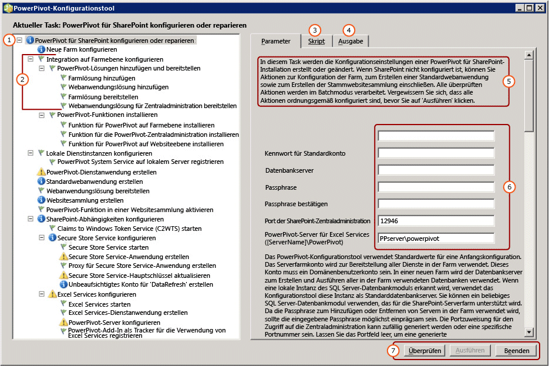

# <a name="configure-or-repair-power-pivot-for-sharepoint-2013"></a>Konfigurieren oder Reparieren von PowerPivot für SharePoint 2013
  Um eine Installation von [!INCLUDE[ssCurrent](../../includes/sscurrent-md.md)][!INCLUDE[ssGemini](../../includes/ssgemini-md.md)] für SharePoint 2013 zu konfigurieren oder zu reparieren, verwenden Sie das [!INCLUDE[ssGemini](../../includes/ssgemini-md.md)] für SharePoint-Konfigurationstool. Das Konfigurationstool durchsucht zunächst das System und gibt dann eine Liste von Aktionen zurück, die notwendig sind, um eine Installation abzuschließen oder zu reparieren. Der Setup-Assistent für [!INCLUDE[ssCurrent](../../includes/sscurrent-md.md)] installiert das [!INCLUDE[ssGemini](../../includes/ssgemini-md.md)] -Konfigurationstool für SharePoint 2010 sowie ein [!INCLUDE[ssGemini](../../includes/ssgemini-md.md)] -Konfigurationstool für SharePoint 2013. In diesem Thema wird das [!INCLUDE[ssGemini](../../includes/ssgemini-md.md)] -Konfigurationstool für SharePoint 2013 beschrieben. Weitere Informationen zu SharePoint 2010 finden Sie unter [Konfigurieren oder Reparieren von PowerPivot für SharePoint 2010 (PowerPivot-Konfigurationstool)](http://msdn.microsoft.com/en-us/d61f49c5-efaa-4455-98f2-8c293fa50046).  
  
 **[!INCLUDE[applies](../../includes/applies-md.md)]**  SharePoint 2013  
  
 **In diesem Thema:**  
  
 [Vorbereitungen](#bkmk_before)  
  
 [So verwenden Sie das PowerPivot für SharePoint 2013-Konfigurationstool](#bkmk_using)  
  
 [Konfigurationsschritte](#bkmk_steps)  
  
 [Eingabewerte für die Serverkonfiguration](#bkmk_input)  
  
 [Nächste Schritte](#bkmk_nextsteps)  
  
##  <a name="bkmk_before"></a> Vorbereitungen  
 Das [!INCLUDE[ssGemini](../../includes/ssgemini-md.md)] für SharePoint 2013-Konfigurationstool sucht nach Programmdateien, Registrierungseinstellungen und verfügbaren Ports. Lesen Sie die folgenden Ausführungen, um die Tools optimal zu nutzen.  
  
-   Allgemeine Anforderungen zum Ausführen des Konfigurationstools unter [PowerPivot-Konfigurationstools](../../analysis-services/power-pivot-sharepoint/power-pivot-configuration-tools.md).  
  
-   [!INCLUDE[ssGemini](../../includes/ssgemini-md.md)] für SharePoint 2013 wird bevorzugt eine für die anspruchsbasierte Authentifizierung konfigurierte Webanwendung verwendet. Wenn die Anwendung vom [!INCLUDE[ssGemini](../../includes/ssgemini-md.md)] für SharePoint 2013-Konfigurationstool für Sie erstellt wird, wird sie für die Verwendung der anspruchsbasierten Windows-Authentifizierung konfiguriert. Weitere Informationen zu Authentifizierungsanforderungen finden Sie unter [PowerPivot-Authentifizierung und -Autorisierung](../../analysis-services/power-pivot-sharepoint/power-pivot-authentication-and-authorization.md).  
  
-   Port 80 muss verfügbar sein, damit das[!INCLUDE[ssGemini](../../includes/ssgemini-md.md)] für SharePoint 2013-Konfigurationstool eine Webanwendung erstellen kann.  
  
##  <a name="bkmk_using"></a> So verwenden Sie das PowerPivot für SharePoint 2013-Konfigurationstool  
 Die erste Seite des Tools enthält eine Zusammenfassung der Eingabewerte, die zum Konfigurieren der SharePoint-Farm verwendet werden. Zusätzlich zu den von Ihnen angegebenen Eingabewerten werden Standardwerte zum Konfigurieren des Systems verwendet. Standardnamen werden für Dienstanwendungen, Dienstanwendungsdatenbanken und Dienstanwendungseigenschaften verwendet.  
  
> [!TIP]  
>  Wenn das Konfigurationstool den Computer durchsucht und im linken Bereich eine leere Aufgabenliste zurückgibt, wurden keine Funktionen oder Einstellungen gefunden, die konfiguriert werden müssen. Um die SharePoint- oder [!INCLUDE[ssGemini](../../includes/ssgemini-md.md)] -Konfiguration zu ändern, verwenden Sie Windows PowerShell oder die Verwaltungsseiten in der SharePoint-Zentraladministration. Weitere Informationen finden Sie unter [PowerPivot-Serververwaltung und -konfiguration in der Zentraladministration](../../analysis-services/power-pivot-sharepoint/power-pivot-server-administration-and-configuration-in-central-administration.md).  
  
 Werte für Dienstkonten werden für mehrere Dienste verwendet. Das Konfigurationstool verwendet z. B. das Standardkonto auf der ersten Seite, um alle Anwendungspoolidentitäten festzulegen. Sie können später diese Konten ändern, indem Sie die Dienstanwendungseigenschaften in der Zentraladministration ändern.  
  
 Das Tool stellt eine Schnittstelle im Registerkartenformat bereit, die Parametereingaben, das Windows PowerShell-Skript und Statusmeldungen umfasst.  
  
 Das Tool konfiguriert den Server mithilfe von Windows PowerShell. Sie können auf die Registerkarte **Skript** klicken, um das Windows PowerShell-Skript zu überprüfen, mit dem das Tool den Server konfiguriert.  
  
   
  
||Description|  
|-|-----------------|  
|**(1)**|Fenster mit Aufgabenliste.|  
|**(2)**|Einzelne Aktionen.|  
|**(3)**|Die vom Konfigurationstool erstellten Windows PowerShell-Skripts.|  
|**(4)**|Protokollmeldungen, die beim Starten der Überprüfung oder Ausführen von Aktionen erstellt werden.|  
|**(5)**|Beschreibung der Seite.|  
|**(6)**|Eingabeparameter|  
|**(7)**|Die Schaltfläche **Ausführen** ist aktiviert, nachdem Sie die Aktionen überprüft haben.|  
  
##  <a name="bkmk_steps"></a> Konfigurationsschritte  
 Der Link zum Konfigurationstool ist nur sichtbar, wenn [!INCLUDE[ssGemini](../../includes/ssgemini-md.md)] für SharePoint 2013 auf dem lokalen Server installiert ist.  
  
1.  Zeigen Sie im **Startmenü** auf **Alle Programme**, und klicken Sie dann auf [!INCLUDE[ssCurrentUI](../../includes/sscurrentui-md.md)], **Konfigurationstools** und auf **[!INCLUDE[ssGemini](../../includes/ssgemini-md.md)] für SharePoint 2013-Konfigurationstool**.  
  
2.  Klicken Sie auf **[!INCLUDE[ssGemini](../../includes/ssgemini-md.md)] für SharePoint konfigurieren oder reparieren**.  
  
3.  Erweitern Sie das Fenster auf Vollbildgröße. Am unteren Rand des Fensters wird eine Schaltflächenleiste angezeigt, die die Befehle **Überprüfen**, **Ausführen**und **Beenden** enthält.  
  
4.  **Standardkonto:** Geben Sie auf der Registerkarte **Parameter**ein Domänenbenutzerkonto für Benutzername für Standardkonto ein. Dieses Konto wird verwendet, um grundlegende Dienste bereitzustellen, einschließlich des [!INCLUDE[ssGemini](../../includes/ssgemini-md.md)] -Dienstanwendungspools. Geben Sie kein integriertes Konto wie Network Service oder Local System an. Das Tool blockiert Konfigurationen, bei denen integrierte Konten angegeben werden.  
  
     **Passphrase:** Geben Sie eine Passphrase ein. Bei einer neuen SharePoint-Farm wird die Passphrase immer dann verwendet, wenn Sie der SharePoint-Farm neue Server oder Anwendungen hinzufügen. Wenn die Farm vorhanden ist, geben Sie die Passphrase ein, die Ihnen ermöglicht, der Farm eine Serveranwendung hinzuzufügen.  
  
5.  **Port:** Geben Sie optional eine Portnummer für die Verbindung mit der Webanwendung für die Zentraladministration an, oder verwenden Sie die bereitgestellte, zufällig generierte Nummer. Das Konfigurationstool überprüft, ob die Nummer verfügbar ist, bevor sie als Option angeboten wird.  
  
6.  Geben Sie auf der Hauptseite den Namen eines [!INCLUDE[ssCurrent](../../includes/sscurrent-md.md)][!INCLUDE[ssGemini](../../includes/ssgemini-md.md)] -Servers ein, der im SharePoint-Modus ausgeführt wird.  
  
7.  Überprüfen Sie optional die verbleibenden Eingabewerte, die zum Abschließen der jeweiligen Aktion verwendet werden. Weitere Informationen über die einzelnen Aktionen finden Sie unter [Eingabewerte für die Serverkonfiguration](#bkmk_input) in diesem Thema.  
  
8.  Entfernen Sie optional alle Aktionen, die Sie nicht verarbeiten möchten. Wenn Sie z. B. Secure Store Service später konfigurieren möchten, klicken Sie auf **Secure Store Service konfigurieren**, und deaktivieren Sie dann das Kontrollkästchen **Diese Aktion in Taskliste einschließen**.  
  
9. Klicken Sie auf **Überprüfen** , um zu überprüfen, ob das Tool genügend Informationen hat, um die Aktionen in der Liste zu verarbeiten.  
  
10. Klicken Sie auf **Ausführen** , um alle Aktionen in der Aufgabenliste zu verarbeiten. Die Schaltfläche **Ausführen** wird verfügbar, nachdem Sie die Aktionen überprüft haben. Wenn **Ausführen** nicht aktiviert ist, klicken Sie zuerst auf **Überprüfen** .  
  
     Wenn eine Fehlermeldung ähnlich der folgenden angezeigt wird, überprüfen Sie, ob die SQL Server-Datenbankinstanz gestartet wurde.  
  
    ```  
    Cannot connect to the database server instance  
    ```  
  
11. [Überprüfen einer PowerPivot für SharePoint-Installation](../../analysis-services/instances/install-windows/verify-a-power-pivot-for-sharepoint-installation.md)  
  
##  <a name="bkmk_input"></a> Eingabewerte für die Serverkonfiguration  
 Das [!INCLUDE[ssGemini](../../includes/ssgemini-md.md)] -Konfigurationstool nutzt eine Kombination aus Eingabewerten, die Sie angeben, und Standardwerten, die vom Tool erkannt oder automatisch verwendet werden.  
  
 Welche Aktionen im Konfigurationstool aufgelistet werden, hängt von der aktuellen Konfiguration der SharePoint-Farmen ab. Wenn die SharePoint-Farm z. B. bereits konfiguriert ist, sehen Sie keine Aktionen, die die Farm konfigurieren oder eine Webanwendung erstellen. Sie können das Tool jederzeit ausführen, um zu konfigurieren, zu reparieren oder Konfigurationsfehler zu erkennen. Wenn erforderliche Dienste wie Excel Services oder Secure Store Service nicht in der Farm ausgeführt werden, erkennt das Tool die fehlenden Dienste und stellt Optionen bereit, um sie zu aktivieren. Wenn keine Aktionen erforderlich sind, ist die Aufgabenliste leer.  
  
 In der folgenden Tabelle werden die Werte beschrieben, die für die Serverkonfiguration verwendet werden.  
  
|Seite|Eingabewert|Quelle|Description|  
|----------|-----------------|------------|-----------------|  
|**[!INCLUDE[ssGemini](../../includes/ssgemini-md.md)] für SharePoint konfigurieren oder reparieren**|Standardkonto|Aktueller Benutzer|Das Standardkonto ist ein Windows-Domänenbenutzerkonto, das verwendet wird, um gemeinsame Dienste in der Farm bereitzustellen. Es wird zur Bereitstellung folgender Dienste verwendet:|  
||||-<br />                    [!INCLUDE[ssGemini](../../includes/ssgemini-md.md)] -Dienstanwendung|  
||||– Secure Store Service|  
||||– Excel Services|  
||||– Identität für Webanwendungspool|  
||||– Websitesammlungsadministrator|  
||||– Das unbeaufsichtigte Datenaktualisierungskonto für [!INCLUDE[ssGemini](../../includes/ssgemini-md.md)] .|  
||||Standardmäßig wird das Domänenkonto des aktuellen Benutzers verwendet.<br /><br /> Hinweis: Es wird empfohlen, den Standardwert zu ersetzen, es sei denn, Sie konfigurieren einen Server zu Evaluierungs- und anderen als Produktionszwecken.<br /><br /> Sie können nach Konfiguration oder Reparatur Dienstidentitäten mit der Zentraladministration ändern.<br /><br /> Optional können Sie im [!INCLUDE[ssGemini](../../includes/ssgemini-md.md)] -Konfigurationstool dedizierte Konten für folgende Komponenten angeben:|  
||||– Webanwendung, anhand der Seite **Standardwebanwendung erstellen** (vorausgesetzt, das Tool erstellt eine Webanwendung für die Farm).|  
||||-<br />                    [!INCLUDE[ssGemini](../../includes/ssgemini-md.md)] . Auf der Seite **Unbeaufsichtigtes Konto für Datenaktualisierung erstellen** in diesem Tool.|  
||Datenbankserver|Lokale benannte [!INCLUDE[ssGemini](../../includes/ssgemini-md.md)] -Instanz, falls verfügbar|Wenn eine Datenbankmodulinstanz als benannte [!INCLUDE[ssGemini](../../includes/ssgemini-md.md)] -Instanz installiert ist, füllt das Tool das Datenbankserverfeld mit dem Namen dieser Instanz auf. Wenn Sie das Datenbankmodul nicht installiert haben, ist dieses Feld leer.<br /><br /> **Datenbankserver**  ist ein erforderlicher Parameter. Es kann irgendeine Version oder eine Ausgabe von SQL Server sein, die für SharePoint-Farmen unterstützt wird.|  
||Passphrase|Benutzereingabe|Wenn Sie eine neue Farm erstellen, wird die von Ihnen eingegebene Passphrase als Passphrase für die Farm verwendet. Wenn Sie [!INCLUDE[ssGemini](../../includes/ssgemini-md.md)] für SharePoint einer vorhandenen Farm hinzufügen, geben Sie die vorhandene Passphrase für die Farm ein.|  
||SharePoint-Zentraladministration-Port|Standard, falls erforderlich|Wenn die Farm nicht konfiguriert ist, stellt das Tool Optionen bereit, um die Farm zu erstellen, einschließlich der Erstellung eines HTTP-Endpunkts zur Zentraladministration. Es wählt eine zufällig generierte Portnummer aus, die nicht in Gebrauch ist.|  
||[!INCLUDE[ssGemini](../../includes/ssgemini-md.md)] für Excel Services ([Servername]\ [!INCLUDE[ssGemini](../../includes/ssgemini-md.md)])|Benutzereingabe|Der [!INCLUDE[ssGemini](../../includes/ssgemini-md.md)]-Server ist erforderlich, damit Excel Services die Hauptfunktionen von [!INCLUDE[ssGemini](../../includes/ssgemini-md.md)] aktivieren kann. Der Servername, den Sie auf dieser Seite eingeben, wird auch der Liste auf der Seite **[!INCLUDE[ssGemini](../../includes/ssgemini-md.md)]-Server konfigurieren** hinzugefügt.|  
|**Neue Farm konfigurieren**|Datenbankserver<br /><br /> Farmkonto<br /><br /> Passphrase<br /><br /> SharePoint-Zentraladministration-Port|Standard, falls erforderlich|Es werden standardmäßig die Einstellungen übernommen, die Sie auf der Hauptseite eingegeben haben.|  
|**Erstellen einer [!INCLUDE[ssGemini](../../includes/ssgemini-md.md)] -Dienstanwendung**|Name der Dienstanwendung|Standardwert|[!INCLUDE[ssGemini](../../includes/ssgemini-md.md)] Dienstanwendungsname: Der Standardname lautet **Standardwert [!INCLUDE[ssGemini](../../includes/ssgemini-md.md)] Service Application**. Sie können einen anderen Wert im Tool ersetzen.|  
||Datenbankserver|Standardwert|Der Datenbankserver, von dem die Datenbank der [!INCLUDE[ssGemini](../../includes/ssgemini-md.md)] -Dienstanwendung gehostet wird. Der Standardservername ist der Name des für die Farm verwendeten Datenbankservers. Sie können einen anderen Wert als Standardservernamen verwenden.|  
||Datenbankname|Standardwert|Der Name der Datenbank, der für die [!INCLUDE[ssGemini](../../includes/ssgemini-md.md)] -Dienstanwendungsdatenbank erstellt werden soll. Der Standarddatenbankname basiert auf dem Dienstanwendungsnamen, gefolgt von einer GUID, um einen eindeutigen Namen sicherzustellen. Sie können einen anderen Wert im Tool ersetzen.|  
|**Standardwebanwendung erstellen**|Name der Webanwendung|Standard, falls erforderlich|Wenn keine Webanwendungen vorhanden sind, erstellt das Tool eine. Die Webanwendung wird für die Authentifizierung im klassischen Modus und das Lauschen an Port 80 konfiguriert. Die maximale Dateiuploadgröße wird auf 2047 festgelegt, das von SharePoint zugelassene Maximum. Die umfangreichere Dateiuploadgröße ist für die großen [!INCLUDE[ssGemini](../../includes/ssgemini-md.md)] -Dateien vorgesehen, die auf den Server hochgeladen werden.|  
||URL|Standard, falls erforderlich|Das Tool erstellt eine URL auf Grundlage des Servernamens und verwendet die gleichen Dateinamenskonventionen wie SharePoint.|  
||Anwendungspool|Standard, falls erforderlich|Das Tool erstellt in IIS einen Standardanwendungspool.|  
||Konto und Kennwort des Anwendungspools|Standard, falls erforderlich|Das Anwendungspoolkonto basiert auf dem Standardkonto, aber Sie können es im Tool überschreiben.|  
||Datenbankserver|Standard, falls erforderlich|Die Standarddatenbankinstanz ist vorausgewählt, um die Anwendungsinhaltsdatenbank zu speichern, aber Sie können im Tool eine andere SQL Server-Instanz angeben.|  
||Datenbankname|Standard, falls erforderlich|Der Name der Anwendungsdatenbank. Der Datenbankname basiert auf den Dateinamenskonventionen von SharePoint, aber Sie können einen anderen Namen auswählen.|  
|**Webanwendungslösung bereitstellen**|URL|Standard, falls erforderlich|Die Standard-URL wird von der Standardwebanwendung übernommen.|  
||Maximale Dateigröße (in MB)|Standard, falls erforderlich|Die Standardeinstellung ist 2.047. SharePoint-Dokumentbibliotheken verfügen ebenfalls über eine maximale Größe, und die Einstellung der Dokumentbibliothek sollte von der [!INCLUDE[ssGemini](../../includes/ssgemini-md.md)] -Einstellung nicht überschritten werden. Weitere Informationen finden Sie unter [Konfigurieren der maximalen Dateiuploadgröße &#40;PowerPivot für SharePoint&#41;](../../analysis-services/power-pivot-sharepoint/configure-maximum-file-upload-size-power-pivot-for-sharepoint.md).|  
|**Websitesammlung erstellen**|Websiteadministrator|Standard, falls erforderlich|Das Tool verwendet das Standardkonto. Sie können es auf der Seite **Websitesammlung erstellen** überschreiben.|  
||Kontakt-E-Mail|Standard, falls erforderlich|Wenn Microsoft Outlook auf dem Server konfiguriert ist, verwendet das Tool die E-Mail-Adresse des aktuellen Benutzers. Andernfalls wird ein Platzhalterwert verwendet.|  
||Website-URL|Standard, falls erforderlich|Das Tool erstellt die Website-URL und verwendet die gleichen URL-Namenskonventionen wie SharePoint.|  
||Websitetitel|Standard, falls erforderlich|Das Tool fügt **[!INCLUDE[ssGemini](../../includes/ssgemini-md.md)] -Website** als Standardtitel hinzu.|  
|**[!INCLUDE[ssGemini](../../includes/ssgemini-md.md)] -Funktion in einer Websitesammlung aktivieren**|Website-URL||Die URL der Websitesammlung, für die Sie [!INCLUDE[ssGemini](../../includes/ssgemini-md.md)] -Funktionen aktivieren.|  
||Premium-Funktion für diese Website aktivieren||Aktivieren Sie die SharePoint-Websitefunktion "PremiumSite".|  
|**Secure Store Service-Anwendung erstellen**|Name der Dienstanwendung|Standard, falls erforderlich|Geben Sie den Namen für die Secure Store Service-Anwendung ein.|  
||Datenbankserver|Benutzereingabe|Geben Sie den Namen des Datenbankservers ein, der für die Secure Store Service-Anwendung verwendet werden soll.|  
|**Proxy für Secure Store Service-Anwendung erstellen**|Name der Dienstanwendung|Standard, falls erforderlich|Geben Sie den Namen für die Secure Store Service-Anwendung ein, den Sie auf der vorherigen Seite eingegeben haben.|  
||Proxy für Dienstanwendung|Standard, falls erforderlich|Geben Sie den Namen für den Proxy der Secure Store Service-Anwendung ein. Der Name wird in der Standardverbindungsgruppe angezeigt, über die Anwendungen den SharePoint-Inhaltswebanwendungen zugeordnet werden.|  
|**Secure Store Service-Hauptschlüssel aktualisieren**|Proxy für Dienstanwendung|Standard, falls erforderlich|Geben Sie den Namen des Secure Store Service-Anwendungsproxys ein, den Sie auf der vorherigen Seite eingegeben haben.|  
||Passphrase|Benutzereingabe|Der Hauptschlüssel, der für die Datenverschlüsselung verwendet wird. Die zum Generieren des Schlüssels verwendete Passphrase entspricht standardmäßig der Passphrase, die zum Bereitstellen neuer Server in der Farm verwendet wird. Sie können die Standardpassphrase durch eine eindeutige Passphrase ersetzen.|  
|**Unbeaufsichtigtes Konto für 'DataRefresh' erstellen**|Zielanwendungs-ID|Standard, falls erforderlich|Erstellen Sie eine Zielanwendung zum Speichern von Anmeldeinformationen für die unbeaufsichtigte [!INCLUDE[ssGemini](../../includes/ssgemini-md.md)] -Datenaktualisierung.<br /><br /> Die Anwendungs-ID kann beschreibender Text sein.|  
||Anzeigename für die Zielanwendung|Standard, falls erforderlich||  
||Benutzername und Kennwort des unbeaufsichtigten Kontos|Standard, falls erforderlich|Geben Sie Anmeldeinformationen eines Windows-Benutzerkontos ein, das von der Zielanwendung zur Ausführung einer unbeaufsichtigten Datenaktualisierung verwendet wird. Weitere Informationen finden Sie unter [Konfigurieren der Excel Services-Datenaktualisierung mithilfe des unbeaufsichtigten Dienstkontos in SharePoint Server 2013](http://technet.microsoft.com/library/hh525344\(office.15\).aspx) (http://technet.microsoft.com/en-us/library/hh525344(office.15).aspx).|  
||Website-URL|Standard, falls erforderlich|Geben Sie die Website-URL der Websitesammlung ein, die der Zielanwendung zugeordnet ist. Um Zuordnungen mit zusätzlichen Websitesammlungen herzustellen, verwenden Sie die SharePoint-Zentraladministration.|  
|**Excel Services-Dienstanwendung erstellen**|Name der Dienstanwendung|Standard, falls erforderlich|Geben Sie einen Namen für die Dienstanwendung ein. Auf dem Datenbankserver der SharePoint-Farm wird für die Dienstanwendung eine Datenbank mit demselben Namen erstellt.|  
|**[!INCLUDE[ssGemini](../../includes/ssgemini-md.md)] -Server konfigurieren**|Name der Dienstanwendung|Standard, falls erforderlich|Dienstanwendungsname, den Sie auf der vorherigen Seite eingegeben haben.|  
||[!INCLUDE[ssGemini](../../includes/ssgemini-md.md)] -Servername||Liste der registrierten [!INCLUDE[ssGemini](../../includes/ssgemini-md.md)] -Server.<br /><br /> Der auf die Hauptseite eingegebene Servername wird dieser Seite automatisch hinzugefügt.|  
|**[!INCLUDE[ssGemini](../../includes/ssgemini-md.md)] -Add-In als Tracker für die Verwendung von Excel Services registrieren**|Name der Dienstanwendung||Dienstanwendungsname, den Sie auf der vorherigen Seite eingegeben haben.|  
|||||  
  
 Wenn das [!INCLUDE[ssGemini](../../includes/ssgemini-md.md)] für SharePoint 2013-Konfigurationstool die Farm erstellt, legt es die erforderlichen Datenbanken auf dem Datenbankserver an und verwendet die gleichen Dateinamenskonventionen wie SharePoint. Sie können den Farmdatenbanknamen nicht ändern.  
  
 Wenn das Tool eine Websitesammlung erstellt, erstellt es eine Inhaltsdatenbank auf dem Datenbankserver und verwendet die gleichen Dateinamenskonventionen wie SharePoint. Sie können den Inhaltsdatenbanknamen nicht ändern.  
  
## <a name="verify-the-configuration"></a>Überprüfen der Konfiguration  
 Weitere Informationen finden Sie unter „Überprüfen der [!INCLUDE[ssGemini](../../includes/ssgemini-md.md)]-Konfiguration“ in [Konfigurieren von PowerPivot und Bereitstellen von Lösungen &#40;SharePoint 2013&#41;](../../analysis-services/instances/install-windows/configure-power-pivot-and-deploy-solutions-sharepoint-2013.md).  
  
##  <a name="bkmk_nextsteps"></a> Nächste Schritte  
 Nach Abschluss der Serverinstallation gibt es einige weitere Schritte, die Sie durchführen sollten:  
  
-   Gewähren Sie Einzelbenutzern und Gruppen SharePoint-Berechtigungen. Dieser Schritt ist notwendig, um den Zugriff auf Websites und Inhalte zu ermöglichen.  
  
-   Ändern Sie die Identitäten des Dienstanwendungspools für die Ausführung unter einem anderen Konto. Das Angeben verschiedener Identitäten für Dienste und Anwendungen ist ein bewährtes Verfahren für die sichere Bereitstellung von SharePoint.  
  
-   Erstellen Sie zusätzliche vertrauenswürdige Websites in Excel Services, damit Sie Berechtigungen und Konfigurationseinstellungen variieren und herausfinden können, welche am besten für den [!INCLUDE[ssGemini](../../includes/ssgemini-md.md)] -Datenzugriff geeignet sind.  
  
-   Installieren Sie häufig verwendete Datenanbieter, um serverseitige Datenaktualisierung zu aktivieren.  
  
### <a name="grant-sharepoint-permissions-to-workbook-users"></a>Gewähren von SharePoint-Berechtigungen für Arbeitsmappenbenutzer  
 Benutzer benötigen SharePoint-Berechtigungen, bevor sie Arbeitsmappen veröffentlichen oder anzeigen können. Erteilen Sie Benutzern, die veröffentlichte Arbeitsmappen anzeigen müssen, Berechtigungen zum **Anzeigen** , und Benutzern, die Arbeitsmappen veröffentlichen oder verwalten, Berechtigungen zum **Beitragen** . Sie müssen Websitesammlungsadministrator sein, um Berechtigungen erteilen zu können.  
  
1.  Klicken Sie in einer SharePoint 2013-Website, auf das Symbol "Einstellungen"  , und klicken Sie dann auf **Standorteinstellungen**.  
  
2.  Klicken Sie auf **Websiteberechtigungen** in der Gruppe **Benutzer und Berechtigungen** .  
  
3.  Erstellen Sie Gruppen nach Bedarf, wenn Sie eine Gruppe von Benutzern mit der Berechtigung **Teilnehmen** und eine andere Gruppe einrichten möchten, in der Benutzer nur über die Berechtigung **Anzeigen** verfügen.  
  
4.  Geben Sie die Windows-Domänenbenutzer- oder -Gruppenkonten ein, die in den Gruppen enthalten sein sollen. Verwenden Sie wie zuvor keine E-Mail-Adressen bzw. keine Verteilergruppe, wenn die Anwendung für die klassische Authentifizierung konfiguriert wurde.  
  
### <a name="install-data-providers-used-in-data-refresh-and-check-user-permissions"></a>Installieren von in der Datenaktualisierung verwendeten Datenanbietern und Überprüfen von Benutzerberechtigungen  
 Die serverseitige Datenaktualisierung ermöglicht Benutzern das erneute Importieren aktualisierter Daten in ihre Arbeitsmappen in unbeaufsichtigtem Modus. Um eine Datenaktualisierung erfolgreich durchzuführen, muss der Server, auf dem Analysis Services im SharePoint-Modus ausführt wird, die gleichen Datenanbieter haben, die beim ursprünglichen Import der Daten verwendet wurden. Darüber hinaus sind für das Benutzerkonto, unter dem die Datenaktualisierung ausgeführt wird, oft Leseberechtigungen für die externen Datenquellen erforderlich. Überprüfen Sie die Anforderungen für das Aktivieren und Konfigurieren der Datenaktualisierung, um ein erfolgreiches Ergebnis sicherzustellen. Weitere Informationen finden Sie unter [PowerPivot-Datenaktualisierung mit SharePoint 2010](http://msdn.microsoft.com/en-us/01b54e6f-66e5-485c-acaa-3f9aa53119c9).  
  
> [!NOTE]  
>  Für [!INCLUDE[ssCurrent](../../includes/sscurrent-md.md)][!INCLUDE[ssGemini](../../includes/ssgemini-md.md)] für SharePoint 2013 werden die Datenanbieter installiert, wenn Sie das Installationsprogramm **spPowerPivot.msi** und das [!INCLUDE[ssGemini](../../includes/ssgemini-md.md)] für SharePoint 2013-Konfigurationstool ausführen. Weitere Informationen finden Sie unter [Installieren oder Deinstallieren des PowerPivot für SharePoint-Add-In &#40;SharePoint 2013&#41;](../../analysis-services/instances/install-windows/install-or-uninstall-the-power-pivot-for-sharepoint-add-in-sharepoint-2013.md).  
  
### <a name="change-application-pool-and-service-identities-in-sharepoint"></a>Ändern des Anwendungspools und der Dienstidentitäten in SharePoint  
 Das [!INCLUDE[ssGemini](../../includes/ssgemini-md.md)] -Konfigurationstool stellt Farmfunktionen, Anwendungen und Dienste zur Ausführung unter einem einzelnen Konto bereit. Dies vereinfacht die Installation, führt aber nicht zu einer Bereitstellung, die die Sicherheitsanforderungen einer SharePoint-Farm erfüllt. Um eine stabilere Bereitstellung zu erzielen, ändern Sie die Anwendungspools und Dienstidentitäten so, dass sie unter anderen Konten ausgeführt werden, nachdem das Setup abgeschlossen ist. Weitere Informationen finden Sie unter [Konfigurieren von PowerPivot-Dienstkonten](../../analysis-services/power-pivot-sharepoint/configure-power-pivot-service-accounts.md).  
  
### <a name="create-additional-trusted-sites-in-excel-services"></a>Erstellen von zusätzlichen vertrauenswürdigen Websites in Excel Services  
 Sie können vertrauenswürdige Websites in Excel Services hinzufügen, um die Berechtigungen und Konfigurationseinstellungen auf Websites zu variieren, die Excel-Arbeitsmappen und [!INCLUDE[ssGemini](../../includes/ssgemini-md.md)] -Daten bereitstellen. Weitere Informationen finden Sie unter [Erstellen eines vertrauenswürdigen Speicherorts für PowerPivot-Websites in der Zentraladministration](../../analysis-services/power-pivot-sharepoint/create-a-trusted-location-for-power-pivot-sites-in-central-administration.md).  
  
### <a name="build-a-includessgeminiincludesssgemini-mdmd-workbook"></a>Erstellen einer [!INCLUDE[ssGemini](../../includes/ssgemini-md.md)] -Arbeitsmappe  
 Nachdem Sie die Serverkomponenten in einer Farm installiert haben, können Sie die erste Excel 2013-Arbeitsmappe erstellen, die eingebettete [!INCLUDE[ssGemini](../../includes/ssgemini-md.md)] -Daten verwendet, und sie dann in einer SharePoint-Bibliothek veröffentlichen. Alternativ können Sie eine [!INCLUDE[ssGemini](../../includes/ssgemini-md.md)] -Beispielarbeitsmappe hochladen oder veröffentlichen, um den [!INCLUDE[ssGemini](../../includes/ssgemini-md.md)] -Datenzugriff in SharePoint zu überprüfen. Weitere Informationen finden Sie unter den folgenden Links:  
  
-   [Power Pivot-Hilfe](https://support.office.com/en-us/article/Power-Pivot-Help-241aac41-92e3-4e46-ae58-2f2cd7dbcf4f) (https://support.office.com/en-us/article/Power-Pivot-Help-241aac41-92e3-4e46-ae58-2f2cd7dbcf4f).  
  
-   [Starten von PowerPivot in Excel 2013-Add-Ins](http://office.microsoft.com/excel-help/start-powerpivot-in-excel-2013-add-in-HA102837097.aspx?CTT=5&origin=HA102837110) (http://office.microsoft.com/excel-help/start-powerpivot-in-excel-2013-add-in-HA102837097.aspx?CTT=5&origin=HA102837110).  
  
### <a name="add-additional-analysis-services-servers-in-sharepoint-mode"></a>Hinzufügen zusätzlicher Analysis Services-Server im SharePoint-Modus  
 Wenn Sie mit der Zeit feststellen, dass zusätzlicher Datenspeicher und zusätzliche Verarbeitungskapazität erforderlich sind, können Sie der Farm zusätzliche Server hinzufügen, auf denen Analysis Services im SharePoint-Modus ausgeführt wird. Für [!INCLUDE[ssCurrent](../../includes/sscurrent-md.md)][!INCLUDE[ssGemini](../../includes/ssgemini-md.md)] für SharePoint 2013 installieren Sie neue [!INCLUDE[ssASnoversion](../../includes/ssasnoversion-md.md)] -Server im SharePoint-Modus und konfigurieren dann Excel Services. Weitere Informationen finden Sie im Abschnitt „Über die Installation auf einem Server hinausgehende Installationen“ unter [Installieren von Analysis Services im PowerPivot-Modus](../../analysis-services/instances/install-windows/install-analysis-services-in-power-pivot-mode.md).  
  
## <a name="additional-resources"></a>Zusätzliche Ressourcen  
  [Submit Feedback und Kontaktinformationen Informationen über Microsoft SQL Server Connect](https://connect.microsoft.com/SQLServer/Feedback) (https://connect.microsoft.com/SQLServer/Feedback).  
  
## <a name="see-also"></a>Siehe auch  
 [Installieren oder Deinstallieren des PowerPivot für SharePoint-Add-In &#40;SharePoint 2013&#41;](../../analysis-services/instances/install-windows/install-or-uninstall-the-power-pivot-for-sharepoint-add-in-sharepoint-2013.md)   
 [PowerPivot-Konfigurationstools](../../analysis-services/power-pivot-sharepoint/power-pivot-configuration-tools.md)   
 [PowerPivot-Serververwaltung und -konfiguration in der Zentraladministration](../../analysis-services/power-pivot-sharepoint/power-pivot-server-administration-and-configuration-in-central-administration.md)   
 [Aktualisieren von Arbeitsmappen und planmäßige Datenaktualisierungen &#40;SharePoint 2013&#41;](../../analysis-services/instances/install-windows/upgrade-workbooks-and-scheduled-data-refresh-sharepoint-2013.md)  
  
  

