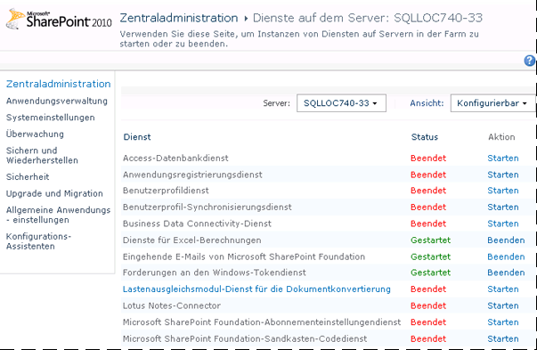

# <a name="configure-power-pivot-health-rules"></a>Konfigurieren von Power Pivot-Integritätsregeln
[!INCLUDE[ssas-appliesto-sqlas](../../includes/ssas-appliesto-sqlas.md)]
[!INCLUDE[ssGemini_md](../../includes/ssgemini-md.md)]für SharePoint enthält SharePoint-Integritätsregeln, mit denen Sie überwachen, und Server serververfügbarkeit sowie Konfigurationsprobleme zu beheben. Die für [!INCLUDE[ssGemini_md](../../includes/ssgemini-md.md)] für SharePoint geltenden Integritätsregeln werden auf der Seite „Regeldefinitionen überprüfen“ angezeigt.  
  
 Integritätsregeln ermöglichen die frühe Erkennung von Serverproblemen, die zu Dienstunterbrechungen führen können. [!INCLUDE[ssGemini_md](../../includes/ssgemini-md.md)] für SharePoint stellt eine Reihe von Regeln bereit, mit denen Sie Probleme identifizieren und beheben können, bevor sie sich auf die Benutzer auswirken. Sie können viele dieser Regeln an die eindeutigen Merkmale der Bereitstellung anpassen. Wenn Sie z. B. mehr Zeit möchten, um auf Warnungen zum Speicherplatz zu reagieren, können Sie den Prozentsatz des verfügbaren Speicherplatzes von 5 % auf 10 % erhöhen, damit Sie die Warnung früher erhalten.  
  
 Die anpassbaren Regeln betreffen Berichte zum Ressourcenverbrauch oder zur Serververfügbarkeit. Die Anpassung ist in diesen Bereichen hilfreich, da die zugrunde liegende Systemkapazität für verschiedene Server und Bereitstellungstopologien sehr stark variiert. Im Gegensatz dazu ist keine Anpassung für Regeln verfügbar, die Serverkonfigurations- oder Sicherheitsprobleme identifizieren. Diese Regeln sollen für alle Installationen gleichermaßen angewendet werden.  
  
||  
|-|  
|**[!INCLUDE[applies](../../includes/applies-md.md)]** SharePoint 2013 &#124; SharePoint 2010|  
  
 **Hinweis:** Integritätsregeleinstellungen werden für die SQL Server Analysis Services-Instanz und die [!INCLUDE[ssGemini_md](../../includes/ssgemini-md.md)]-Dienstanwendung getrennt konfiguriert. Konfigurieren Sie Integritätsregeln für jeden Dienst mithilfe der Anweisungen in diesem Thema. Bei einer SharePoint 2013-Bereitstellung verwendet [!INCLUDE[ssGeminiShort](../../includes/ssgeminishort-md.md)] nur die Dienstanwendung. Daher werden durch [!INCLUDE[ssGeminiShort](../../includes/ssgeminishort-md.md)] verschiedene Sätze von Integritätsregeln für unterschiedliche SharePoint-Versionen installiert. Sie finden die Version der installierten Regeln in der Spalte „Version“ des Themas [Referenz zu Integritätsregeln &#40;Power Pivot für SharePoint&#41;](../../analysis-services/power-pivot-sharepoint/health-rules-reference-power-pivot-for-sharepoint.md) oder indem Sie den folgenden Windows PowerShell-Befehl ausführen.  
  
```  
Get-SPHealthAnalysisRule | select name, enabled, summary | where {$_.summary -like “*power*”}  | format-table -property * -autosize | out-default  
```  
  
 **In diesem Thema:**  
  
 [Anzeigen von Power Pivot-Integritätsregeln](#bkmk_view)  
  
 [Konfigurieren von Integritätsregeln zum Auswerten der Serverstabilität (SQL Server Analysis Services)](#bkmk_HR_SSAS)  
  
 [Konfigurieren von Integritätsregeln zum Auswerten der Anwendungsstabilität (Power Pivot-Dienstanwendung)](#bkmk_evaluate_application_stability)  
  
## <a name="prerequisites"></a>Erforderliche Komponenten  
 Sie müssen Dienstanwendungsadministrator sein, um die Konfigurationseigenschaften der Analysis Services-Instanz und [!INCLUDE[ssGemini_md](../../includes/ssgemini-md.md)] -Dienstanwendung ändern zu können.  
  
##  <a name="bkmk_view"></a> Anzeigen von Power Pivot-Integritätsregeln  
  
1.  Klicken Sie in der SharePoint-Zentraladministration auf **Überwachung**und im Abschnitt **Integritätsanalyse** auf **Regeldefinitionen überprüfen**.  
  
2.  Suchen Sie im Konfigurationsabschnitt nach den Regeln mit dem Präfix **[!INCLUDE[ssGemini_md](../../includes/ssgemini-md.md)]:** . Alle [!INCLUDE[ssGemini_md](../../includes/ssgemini-md.md)]-bezogenen Integritätsregeln haben dieses Präfix, um die Unterscheidung von den integrierten SharePoint-Regeln zu erleichtern.  
  
 Diese Regeln werden auf der Seite **Probleme und Lösungen überprüfen** angezeigt, wenn Probleme erkannt werden.  
  
 Wenn Sie ein Problem vermuten, das Sie sofort überprüfen möchten, können Sie manuell eine Regelüberprüfung ausführen.  
  
 Klicken Sie dazu auf die Regel, um die Regeldefinition zu öffnen, und klicken Sie im Menüband auf **Jetzt ausführen** . Klicken Sie auf **Schließen** , um zur Seite **Probleme und Lösungen überprüfen** zurückzuwechseln und den Bericht anzuzeigen. Wenn die Regel ein Problem erkannt hat, wird eine Warnung oder ein Fehler auf der Seite gemeldet. In einigen Fällen kann es einige Minuten dauern, bis der Fehler oder die Warnung angezeigt wird.  
  
##  <a name="bkmk_HR_SSAS"></a> Konfigurieren von Integritätsregeln zum Auswerten der Serverstabilität (SQL Server Analysis Services)  
 Die Analysis Services-Instanz enthält Integritätsregeln, die Probleme auf der Systemebene erkennen (CPU, Arbeitsspeicher und Speicherplatz für Zwischenspeicherung). Befolgen Sie die nachfolgenden Anweisungen, um Schwellenwerte zu ändern, die bestimmte Integritätsregeln auslösen.  
  
1.  Klicken Sie in der SharePoint-Zentraladministration im Abschnitt **Systemeinstellungen** auf **Dienste auf dem Server verwalten**.  
  
2.  Wählen Sie am oberen Rand der Seite den Server in der SharePoint-Farm aus, der eine Instanz von Analysis Services (in der folgenden Abbildung ist der Servername AW-SRV033) hat. **SQL Server Analysis Services** werden in der Liste der Dienste angezeigt.  
  
       
  
3.  Klicken Sie auf **SQL Server Analysis Services**.  
  
4.  Ändern Sie in den Integritätsregeleinstellungen auf den Seiten für die Diensteigenschaft die folgenden Einstellungen:  
  
     Unzureichende CPU-Ressourcenzuteilung (Standardwert ist 80 %)  
     Diese Integritätsregel wird ausgelöst, wenn die vom Analysis Services-Serverprozess (msmdsrv.exe) verwendeten CPU-Ressourcen bei oder über 80 % für einen Zeitraum von 4 Stunden bleiben (wie durch die Einstellung für das Datensammlungsintervall angegeben).  
  
     Diese Konfigurationseinstellung entspricht der folgenden Regeldefinition auf der Seite **Probleme und Lösungen überprüfen** : **[!INCLUDE[ssGemini_md](../../includes/ssgemini-md.md)]: Analysis Services verfügt nicht über ausreichende CPU-Ressourcen, um die angeforderten Vorgänge auszuführen.**  
  
     Unzureichende CPU-Ressourcen im System (Standardwert ist 90 %)  
     Diese Integritätsregel wird ausgelöst, wenn CPU-Ressourcen für den Server über einen Zeitraum von 4 Stunden bei oder oberhalb 90 % bleiben (wie durch die Einstellung für das Datensammlungsintervall angegeben). Die CPU-Gesamtauslastung wird als Teil des zustandsbasierten Lastenausgleichsalgorithmus gemessen, der die CPU-Auslastung als Measure des Serverzustands überwacht.  
  
     Diese Konfigurationseinstellung entspricht der folgenden Regeldefinition auf der Seite **Probleme und Lösungen überprüfen** : **[!INCLUDE[ssGemini_md](../../includes/ssgemini-md.md)]: Die CPU-Gesamtauslastung ist zu hoch.**  
  
     Schwellenwert für unzureichenden Arbeitsspeicher (Standardwert ist 5 %)  
     Auf einem SharePoint-Anwendungsserver sollte eine SQL Server Analysis Services-Instanz immer über einen kleinen Arbeitsspeicher als Reserve verfügen, der nie verwendet wird. Da der Server für die meisten Vorgänge arbeitsspeichergebunden ist, läuft er am besten, wenn er nicht ganz bis zur oberen Grenze ausgeführt wird. Die 5 % nicht verwendeter Arbeitsspeicher werden als Prozentsatz des Arbeitsspeichers berechnet, der den Analysis Services zugeordnet wird. Wenn der gesamte Speicher z. B. 200 GB beträgt und Analysis Services davon 80 % (oder 160 GB) belegt, dann entsprechen die 5 % nicht verwendeter Speicher 5 % von 160 GB (oder 8 GB).  
  
     Diese Konfigurationseinstellung entspricht der folgenden Regeldefinition auf der Seite **Probleme und Lösungen überprüfen** : **[!INCLUDE[ssGemini_md](../../includes/ssgemini-md.md)]: Analysis Services verfügt nicht über genügend Arbeitsspeicher, um die angeforderten Vorgänge auszuführen.**  
  
     Maximale Anzahl von Verbindungen (Standardwert ist 100)  
     Diese Integritätsregel wird ausgelöst, wenn die Anzahl von Verbindungen zur Analysis Services-Instanz über einen Zeitraum von 4 Stunden bei oder über 100 Verbindungen bleibt (wie durch die Einstellung für das Datensammlungsintervall angegeben). Dieser Standardwert ist ein beliebiger Wert (basiert nicht auf den Hardwarespezifikationen des Servers oder auf der Benutzeraktivität), damit Sie den Wert abhängig von der Serverkapazität und Benutzeraktivität in der Umgebung herauf- oder herabsetzen können.  
  
     Diese Konfigurationseinstellung entspricht der folgenden Regeldefinition auf der Seite **Probleme und Lösungen überprüfen** : **[!INCLUDE[ssGemini_md](../../includes/ssgemini-md.md)]: Die hohe Verbindungsanzahl weist darauf hin, dass weitere Server zur Bewältigung der aktuellen Arbeitslast bereitgestellt werden sollten.**  
  
     Nicht genügend Speicherplatz (Standardwert ist 5 %)  
     Der Speicherplatz wird verwendet, um jedes Mal [!INCLUDE[ssGemini_md](../../includes/ssgemini-md.md)] -Daten zwischenzuspeichern, wenn eine Datenbank angefordert wird. Mit dieser Regel wissen Sie, wann nicht genügend Speicherplatz zur Verfügung steht. Standardmäßig wird diese Integritätsregel ausgelöst, wenn der Speicherplatz auf dem Laufwerk mit dem Sicherungsordner geringer als 5 % ist. Weitere Informationen zur Datenträgernutzung finden Sie unter [Konfigurieren der Speicherplatzverwendung &#40;Power Pivot für SharePoint&#41;](../../analysis-services/power-pivot-sharepoint/configure-disk-space-usage-power-pivot-for-sharepoint.md).  
  
     Diese Konfigurationseinstellung entspricht der folgenden Regeldefinition auf der Seite **Probleme und Lösungen überprüfen** : **[!INCLUDE[ssGemini_md](../../includes/ssgemini-md.md)]: Das Laufwerk, auf dem [!INCLUDE[ssGemini_md](../../includes/ssgemini-md.md)] -Daten zwischengespeichert werden, verfügt über unzureichenden Speicherplatz.**  
  
     Datensammlungsintervall (in Stunden)  
     Sie können den Zeitraum der Datensammlung angeben, der zum Berechnen der Zahlen, die zum Auslösen von Integritätsregeln verwendet werden, genutzt wird. Obwohl das System ständig überwacht wird, werden die zum Auslösen von Integritätsregelwarnungen verwendeten Schwellenwerte anhand von Daten berechnet, die im Verlauf eines vordefinierten Intervalls generiert wurden. Das Standardintervall beträgt 4 Stunden. Der Server ruft System- und Verwendungsdaten ab, die in den vorherigen 4 Stunden erfasst wurden, um die Anzahl von Benutzerverbindungen, die Speicherplatzverwendung und CPU- und Arbeitsspeicherauslastungsraten auszuwerten.  
  
##  <a name="bkmk_evaluate_application_stability"></a> Konfigurieren von Integritätsregeln zum Auswerten der Anwendungsstabilität (Power Pivot-Dienstanwendung)  
  
1.  Klicken Sie in der Zentraladministration unter Anwendungsverwaltung auf **Dienstanwendungen verwalten**.  
  
2.  Klicken Sie auf der Seite „Dienstanwendungen“ auf **Standard-[!INCLUDE[ssGemini_md](../../includes/ssgemini-md.md)]-Dienstanwendung**.  
  
       
  
3.  Das [!INCLUDE[ssGemini_md](../../includes/ssgemini-md.md)] -Management-Dashboard wird angezeigt. Klicken Sie auf **Einstellungen für Dienstanwendung konfigurieren** in der Liste **Aktionen** , um die Seite mit den Einstellungen der Dienstanwendung zu öffnen.  
  
       
  
4.  Ändern Sie in den Integritätsregeleinstellungen die folgenden Einstellungen:  
  
     Verhältnis zwischen Lade- und Verbindungsereignissen (Standardwert ist 20 %)  
     Diese Integritätsregel wird ausgelöst, wenn die Anzahl der Ladeereignisse relativ zur Anzahl der Verbindungsereignisse hoch ist, wodurch angezeigt wird, dass der Server Datenbanken möglicherweise zu schnell entlädt oder dass die Einstellungen für die Cachereduzierung zu umfassend sind.  
  
     Diese Konfigurationseinstellung entspricht der folgenden Regeldefinition auf der Seite **Probleme und Lösungen überprüfen** : **[!INCLUDE[ssGemini_md](../../includes/ssgemini-md.md)]: Das Verhältnis zwischen Ladeereignissen und Verbindungen ist zu hoch.**  
  
     Datensammlungsintervall (Standardwert ist 4 Stunden)  
     Sie können den Zeitraum der Datensammlung angeben, der zum Berechnen der Zahlen, die zum Auslösen von Integritätsregeln verwendet werden, genutzt wird. Obwohl das System ständig überwacht wird, werden die zum Auslösen von Integritätsregelwarnungen verwendeten Schwellenwerte anhand von Daten berechnet, die im Verlauf eines vordefinierten Intervalls generiert wurden. Das Standardintervall beträgt 4 Stunden. Der Server ruft System- und Verwendungsdaten ab, die in den vorherigen 4 Stunden erfasst wurden, um das Verhältnis zwischen Lade- und Verbindungsereignissen auszuwerten.  
  
     Suchen nach Updates für [!INCLUDE[ssGemini_md](../../includes/ssgemini-md.md)] Management Dashboard.xlsx (Standardwert ist 5 Tage)  
     Die Datei [!INCLUDE[ssGemini_md](../../includes/ssgemini-md.md)] Management Dashboard.xlsx ist eine im [!INCLUDE[ssGemini_md](../../includes/ssgemini-md.md)] -Management-Dashboard von Berichten verwendete Datenquelle. In einer Standardserverkonfiguration wird die XLSX-Datei täglich mit von SharePoint und dem [!INCLUDE[ssGemini_md](../../includes/ssgemini-md.md)] -Systemdienst erfassten Verwendungsdaten aktualisiert. Wenn die Datei nicht aktualisiert wird, meldet eine Integritätsregel dies als Problem. Standardmäßig wird die Regel ausgelöst, wenn sich der Zeitstempel der Datei 5 Tage lang nicht geändert hat.  
  
     Weitere Informationen zur Sammlung von Verwendungsdaten finden Sie unter [Konfigurieren der Sammlung von Verwendungsdaten für Power Pivot für SharePoint](../../analysis-services/power-pivot-sharepoint/configure-usage-data-collection-for-power-pivot-for-sharepoint.md).  
  
     Diese Konfigurationseinstellung entspricht der folgenden Regeldefinition auf der Seite **Probleme und Lösungen überprüfen**: **[!INCLUDE[ssGemini_md](../../includes/ssgemini-md.md)]: Verwendungsdaten werden nicht mit der erwarteten Häufigkeit aktualisiert.**  
  
## <a name="see-also"></a>Siehe auch  
 [Konfigurieren der Speicherplatzverwendung &#40;Power Pivot für SharePoint&#41;](../../analysis-services/power-pivot-sharepoint/configure-disk-space-usage-power-pivot-for-sharepoint.md)   
 [PowerPivot-Management-Dashboard und Verwendungsdaten](../../analysis-services/power-pivot-sharepoint/power-pivot-management-dashboard-and-usage-data.md)  
  
  
