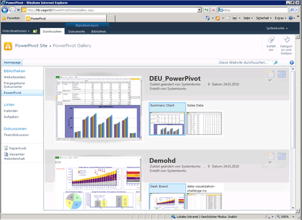

# Erstellen und Anpassen des PowerPivot-Katalogs
  [!INCLUDE[ssGemini](../../includes/ssgemini-md.md)] -Katalog ist eine besondere SharePoint-Dokumentbibliothek, die umfangreiche Vorschau- und Dokumentverwaltungsmöglichkeiten für veröffentlichte Excel-Arbeitsmappen und Reporting Services-Berichte bereitstellt, die [!INCLUDE[ssGemini](../../includes/ssgemini-md.md)]-Daten enthalten.  
  
##   In diesem Thema  
  
-   [Erforderliche Komponenten](#prereq)  
  
-   [Übersicht](#overview)  
  
-   [Erstellen des PowerPivot-Katalogs](#createlib)  
  
-   [Anpassen einer PowerPivot-Katalogbibliothek](#customize)  
  
-   [Deaktivieren oder Ausblenden der Schaltfläche "Aktualisieren"](#bkmk_hide_refresh_button)  
  
-   [Wechseln zur Theatersicht oder Katalogsicht](#switch)  
  
##   Erforderliche Komponenten  
  
-   Sie müssen über Silverlight verfügen. Silverlight kann heruntergeladen und über Microsoft Update installiert werden. Wenn Sie eine [!INCLUDE[ssGemini](../../includes/ssgemini-md.md)] -Katalogbibliothek mithilfe eines Browsers anzeigen, der nicht über Silverlight verfügt, klicken Sie auf den Link auf der Seite, um die Anwendung zu installieren. Nach der Installation müssen Sie den Browser schließen und erneut öffnen.  
  
    > [!NOTE]  
    >  Für den Power Pivot-Katalog ist Microsoft Silverlight erforderlich.  Silverlight wird vom Microsoft Edge-Browser nicht unterstützt.   
    > Um die Bibliotheksinhalte in Edge anzuzeigen, klicken Sie auf die Registerkarte **Bibliothek** im Power Pivot-Katalog, und ändern Sie dann die Ansicht der Dokumentbibliothek in **Alle Dokumente**.    
    > Um die Standardansicht zu ändern, klicken Sie auf die Registerkarte **Bibliothek** und dann auf „Ansicht ändern“. Klicken Sie auf „Zur Standardansicht machen“, und klicken Sie dann auf „OK“, um die Standardansicht zu speichern.  
    >  Weitere Informationen zu den von Edge unterstützten Features finden Sie im Windows-Blog, [A break from the past, part 2: Saying goodbye to ActiveX, VBScript...](http://blogs.windows.com/msedgedev/2015/05/06/a-break-from-the-past-part-2-saying-goodbye-to-activex-vbscript-attachevent/)  
  
-   Sie müssen Websitebesitzer sein, um eine Bibliothek erstellen zu können.  
  
-   Sie müssen über Teilnahmeberechtigungen verfügen, um eine Datei zu veröffentlichen oder hochzuladen.  
  
-   [!INCLUDE[ssGemini](../../includes/ssgemini-md.md)] -Katalog darf sich nicht in einer eingeschränkten Website befinden. Die übergeordnete Site, die den [!INCLUDE[ssGemini](../../includes/ssgemini-md.md)] -Katalog enthält, muss der Zone „Vertrauenswürdige Site“ oder „Lokales Intranet“ hinzugefügt werden.  
  
-   Die [!INCLUDE[ssGemini](../../includes/ssgemini-md.md)] -Webanwendungslösung muss für die Anwendung bereitgestellt sein, und die [!INCLUDE[ssGemini](../../includes/ssgemini-md.md)] -Funktion muss für die Websitesammlung aktiviert sein. Weitere Informationen finden Sie unter [Bereitstellen von PowerPivot-Lösungen in SharePoint](../../analysis-services/power-pivot-sharepoint/deploy-power-pivot-solutions-to-sharepoint.md) und[Aktivieren der PowerPivot-Funktionsintegration für Websitesammlungen in der Zentraladministration](../../analysis-services/power-pivot-sharepoint/activate power pivot integration for site collections in ca.md).  
  
-   Zum Anzeigen oder Erstellen eines Reporting Services-Berichts, der auf einer [!INCLUDE[ssGemini](../../includes/ssgemini-md.md)] -Arbeitsmappe basiert, müssen sowohl die Arbeitsmappe als auch der Bericht im gleichen [!INCLUDE[ssGemini](../../includes/ssgemini-md.md)] -Katalog enthalten sein. Der Bericht muss entweder eine [!INCLUDE[ssGemini](../../includes/ssgemini-md.md)] -Arbeitsmappe verwenden, die eingebettete Daten enthält, oder die Arbeitsmappe muss eine externe Datenquelle enthalten, die eine [!INCLUDE[ssGemini](../../includes/ssgemini-md.md)] -Arbeitsmappe ist.  
  
##   Übersicht  
 [!INCLUDE[ssGemini](../../includes/ssgemini-md.md)] -Katalog ist eine Bibliotheksvorlage, die verfügbar ist, wenn Sie [!INCLUDE[ssGeminiLong](../../includes/ssgeminilong-md.md)] auf einem SharePoint-Server installieren. Der [!INCLUDE[ssGemini](../../includes/ssgemini-md.md)] -Katalog kombiniert eine exakte Vorschau des Dateiinhalts mit Fakten zum Dokumentursprung. Sie können sofort sehen, wer das Dokument erstellt hat und wann es zuletzt geändert wurde. Zur Erstellung von Vorschaubildern verwendet der [!INCLUDE[ssGemini](../../includes/ssgemini-md.md)]-Katalog einen Momentaufnahmedienst, der [!INCLUDE[ssGemini](../../includes/ssgemini-md.md)]-Arbeitsmappen und Reporting Services-Berichte lesen kann, die [!INCLUDE[ssGemini](../../includes/ssgemini-md.md)]-Daten enthalten. Wenn Sie eine Datei veröffentlichen, die der Momentaufnahmedienst nicht lesen kann, ist kein Vorschaubild für diese Datei verfügbar.  
  
 Die Vorschaubilder beruhen auf dem Rendering der Arbeitsmappe in Excel Services. Die Darstellung im [!INCLUDE[ssGemini](../../includes/ssgemini-md.md)] -Katalog sollte mit der Anzeige einer [!INCLUDE[ssGemini](../../includes/ssgemini-md.md)] -Arbeitsmappe in einem Browser übereinstimmen. Die Vorschauoberfläche ist jedoch begrenzt. Teile einer Arbeitsmappe oder eines Berichts werden u. U. in Anpassung an den verfügbaren Platz gekürzt. Sie müssen unter Umständen eine Arbeitsmappe oder einen Bericht öffnen, um das gesamte Dokument anzuzeigen.  
  
 Das Aktualisieren von [!INCLUDE[ssGemini](../../includes/ssgemini-md.md)] -Arbeitsmappendaten aus externen Datenquellen wird im [!INCLUDE[ssGemini](../../includes/ssgemini-md.md)] -Katalog vollständig unterstützt, erfordert jedoch zusätzliche Konfigurationseinstellungen. Ein Farm- oder Dienstadministrator muss den [!INCLUDE[ssGemini](../../includes/ssgemini-md.md)] -Katalog als vertrauenswürdigen Excel Services-Speicherort hinzufügen. Weitere Informationen finden Sie unter [Erstellen eines vertrauenswürdigen Speicherorts für PowerPivot-Websites in der Zentraladministration](../../analysis-services/power-pivot-sharepoint/create-a-trusted-location-for-power-pivot-sites-in-central-administration.md).  
  
##   Erstellen des PowerPivot-Katalogs  
 [!INCLUDE[ssGemini](../../includes/ssgemini-md.md)] -Katalog wird erstellt, wenn Sie [!INCLUDE[ssGeminiLong](../../includes/ssgeminilong-md.md)] mithilfe der Installationsoption Neuer Server installieren. Wenn Sie [!INCLUDE[ssGeminiShort](../../includes/ssgeminishort-md.md)] einer vorhandenen Farm hinzugefügt haben oder eine zusätzliche Bibliothek benötigen, können Sie für Ihre Anwendung oder Website eine neue erstellen.  
  
1.  1.  **SharePoint 2010**: Klicken Sie in der oberen linken Ecke der Homepage Ihrer Website auf **Websiteaktionen** .  
  
    2.  Klicken Sie auf **Weitere Optionen**.  
  
    3.  Klicken Sie unter den Bibliotheken auf den **[!INCLUDE[ssGemini](../../includes/ssgemini-md.md)]-Katalog**.  
  
    1.  **SharePoint 2013:** Klicken Sie auf das Einstellungssymbol . Klicken Sie auf **Websiteinhalt**.  
  
    2.  Klicken Sie auf **App hinzufügen**.  
  
    3.  Klicken Sie auf den **[!INCLUDE[ssGemini](../../includes/ssgemini-md.md)]-Katalog**.  
  
2.  Geben Sie einen Namen für die Bibliothek ein. Fügen Sie beschreibende Informationen hinzu, um Benutzer auf die umfangreichen Vorschaufunktionen, die die Bibliothek für [!INCLUDE[ssGemini](../../includes/ssgemini-md.md)]-Arbeitsmappen und Reporting Services-Berichte bietet, aufmerksam zu machen.  
  
3.  Klicken Sie auf **Erstellen**.  
  
4.  Bitten Sie einen Farm- oder Dienstadministrator, den [!INCLUDE[ssGemini](../../includes/ssgemini-md.md)] -Katalog als vertrauenswürdigen Speicherort für Excel Services hinzuzufügen. Dieser Schritt ist notwendig, um Fehler zu vermeiden, wenn ein Benutzer eine Arbeitsmappe für die [!INCLUDE[ssGemini](../../includes/ssgemini-md.md)] -Datenaktualisierung konfiguriert. Weitere Informationen zu diesem Task finden Sie unter [Erstellen eines vertrauenswürdigen Speicherorts für PowerPivot-Websites in der Zentraladministration](../../analysis-services/power-pivot-sharepoint/create-a-trusted-location-for-power-pivot-sites-in-central-administration.md).  
  
 Im Schnellstart-Navigationsbereich für die aktuelle Website wird ein Link zur [!INCLUDE[ssGemini](../../includes/ssgemini-md.md)] -Katalogbibliothek angezeigt.  
  
 Sie können weitere [!INCLUDE[ssGemini](../../includes/ssgemini-md.md)] -Katalogbibliotheken erstellen, wenn Sie unterschiedliche Berechtigungen für verschiedene Websitesammlungen oder einzelne Websites erzwingen.  
  
##   Anpassen einer PowerPivot-Katalogbibliothek  
 [!INCLUDE[ssGemini](../../includes/ssgemini-md.md)] -Katalog ist eine SharePoint-Dokumentbibliothek. Daher können Sie Standardbibliothekstools in SharePoint verwenden, um Bibliothekseinstellungen zu ändern oder mit einzelnen Dokumenten in der Bibliothek zu arbeiten. Jede erstellte Bibliothek kann für die Verwendung unterschiedlicher Sicht- oder Bibliothekseinstellungen unabhängig angepasst werden.  
  
 Die Sortierreihenfolge und Filter können geändert werden, um die Anzeigeposition der Arbeitsmappen in der Liste zu ändern. Standardmäßig sind Dokumente in der Reihenfolge aufgeführt, in der sie hinzugefügt wurden. Dabei wird das zuletzt veröffentlichte Dokument am Ende der Liste angezeigt. Wenn ein Dokument veröffentlicht wird, behält es seine Position in der Liste bei. Beim Update und der erneuten Veröffentlichung des Dokument wird es direkt in der Liste aktualisiert.  
  
 Sie können die Vorschau für bestimmte Dokumente nicht aktivieren oder deaktivieren. Der Momentaufnahmedienst generiert Vorschaubilder für alle [!INCLUDE[ssGemini](../../includes/ssgemini-md.md)]-Arbeitsmappen und Reporting Services-Berichte, die auf [!INCLUDE[ssGemini](../../includes/ssgemini-md.md)]-Arbeitsmappen basieren, die in der gleichen Bibliothek gespeichert sind. Diese Bilder können von allen Benutzern angezeigt werden, die Anzeigeberechtigungen für das Dokument haben.  
  
 Sie können den [!INCLUDE[ssGemini](../../includes/ssgemini-md.md)] -Katalog nicht so erweitern, dass er eine Vorschau für andere Dokumenttypen bereitstellt. Die Vorschau wird nur für Excel 2010-Arbeitsmappen oder SQL Server 2008 R2-Reporting Services-Berichte unterstützt, die [!INCLUDE[ssGemini](../../includes/ssgemini-md.md)] -Daten enthalten.  
  
 Die Einstellungen, durch die die Informationen zum Dokumentursprung gesteuert werden, können nicht geändert werden. Zu einzelnen Dokumenten angezeigte Fakten, beispielsweise der Benutzer, der die Arbeitsmappe hinzugefügt oder zuletzt geändert hat, werden durch eine feste Gruppe von Spalten bestimmt, die nicht geändert werden können.  
  
#### Ändern der Sortierreihenfolge, Hinzufügen von Filtern oder Einschränken der Anzahl von Dokumenten  
 [!INCLUDE[ssGemini](../../includes/ssgemini-md.md)] -Katalog zeigt immer Werte für 'Zuletzt geändert' und 'Erstellt von' an. Sie können diese Spalten nicht deaktivieren. Sie können keine anderen Spalten für die Bibliothek aktivieren. Verwenden Sie die folgenden Anweisungen, um die Sortierreihenfolge zu ändern, einen Filter hinzuzufügen oder die Anzahl der sichtbaren Dokumente einzuschränken.  
  
1.  Öffnen Sie auf einer SharePoint-Website den [!INCLUDE[ssGemini](../../includes/ssgemini-md.md)] -Katalog.  
  
2.  Klicken Sie im Menüband auf **Bibliothek**.  
  
3.  **SharePoint 2010:** Klicken Sie unter Benutzerdefinierte Ansichten auf **Ansicht ändern**.  
  
     **SharePoint 2013:** Klicken Sie unter **Ansichten verwalten**auf **Ansicht ändern**.  
  
4.  Geben Sie unter Sortieren die Kriterien an, die bestimmen, wie die Arbeitsmappen in der Liste angezeigt werden. Standardmäßig werden Dokumente in der Reihenfolge aufgeführt, in der sie hinzugefügt wurden.  
  
5.  Geben Sie unter Filter Kriterien an, die verwendet werden, um Arbeitsmappen basierend auf bedingten, für Spalten festgelegten Werten anzuzeigen oder auszublenden. Sie können z. B. alle vor einem bestimmten Datum erstellten Arbeitsmappen ausblenden.  
  
6.  Geben Sie unter Eintragsgrenze Optionen an, die nützlich für [!INCLUDE[ssGemini](../../includes/ssgemini-md.md)] -Katalogbibliotheken mit einer sehr hohen Anzahl von Dokumenten sind. Sie können die tatsächliche Anzahl der Elemente einschränken, die in der Liste angezeigt werden, oder Elemente in Gruppen anzeigen.  
  
7.  Klicken Sie auf **OK** , um die Änderungen zu speichern.  
  
####   Deaktivieren oder Ausblenden der Schaltfläche "Aktualisieren"  
 Die Schaltfläche **Datenaktualisierung verwalten** kann nicht ausgeblendet werden. Allerdings wird die Schaltfläche deaktiviert, wenn der Benutzer keine ausreichenden Berechtigungen besitzt.  
  
   
  
 Arbeitsmappenbesitzer oder -autoren benötigen die Berechtigung **Teilnehmen** , um die Datenaktualisierung für eine Arbeitsmappe zu planen. Benutzer mit Mitwirkungsberechtigungen können die Konfigurationsseite der Arbeitsmappe öffnen und bearbeiten, um die zur Datenaktualisierung verwendeten Anmelde- und Zeitplaninformationen anzugeben.  
  
 Daher können Benutzer, die lediglich über die Berechtigungsstufen **Anzeigen** oder **Lesen** verfügen, nicht auf die Schaltfläche Aktualisieren zugreifen. Die Schaltfläche Aktualisieren ist zwar sichtbar, aber deaktiviert. Weitere Informationen finden Sie unter [Benutzerberechtigungen und Berechtigungsstufen in SharePoint 2013](http://technet.microsoft.com/library/cc721640.aspx).  
  
##   Wechseln zur Theatersicht oder Katalogsicht  
 Die Vorschau ändert sich abhängig davon, wie Sie die Sicht für die Bibliothek konfigurieren. In der Katalogsicht können Sie mit der Maus auf einzelne Arbeitsblätter in der Arbeitsmappe zeigen, um ein Blatt in den Vorschaubereich zu bringen.  
  
   
  
 In der folgenden Tabelle werden die verschiedenen Layouts zum Darstellen von Miniaturansichtsskizzen jeder in der Vorschau angezeigten Seite beschrieben:  
  
|Anzeigen|Description|  
|----------|-----------------|  
|Katalogsicht (Standard)|Die Katalogsicht ist die Standardsicht für einen [!INCLUDE[ssGemini](../../includes/ssgemini-md.md)] -Katalog. Die Vorschau wird links angezeigt. Daneben werden kleinere Miniaturansichten der einzelnen Arbeitsblätter in sequenzieller Reihenfolge von links nach rechts angezeigt.|  
|Alle Dokumente|Dies ist das Standardlayout für Dokumentbibliotheken. Sie können diese Sicht auswählen, um einzelne Dokumente zu verwalten oder Bibliotheksinhalte in einem Listenformat anzuzeigen.   Verwenden Sie diese Sicht, um Eigenschaften zu bearbeiten und einzelne Dokumente zu löschen oder zu verschieben.   Wenn Sie die Versionsverwaltung aktiviert haben, müssen Sie Dokumente unter Verwendung dieser Sicht in der Bibliothek einchecken oder auschecken.|  
|Theatersicht und Karussellsicht|Hierbei handelt es sich um spezielle Sichten, die am besten bei der Darstellung einer kleinen Anzahl verwandter Dokumente funktionieren. Die vollständige Drehung von Miniaturansichten beinhaltet sämtliche Seiten in allen Dokumenten in der Bibliothek. Bei einer großen Dokumentanzahl sind diese Sichten für Benutzer, die eine bestimmte [!INCLUDE[ssGemini](../../includes/ssgemini-md.md)] -Arbeitsmappe suchen oder öffnen möchten, weniger geeignet.   Theatersicht: Der Vorschaubereich wird zentriert. Kleinere Miniaturansichten jedes Arbeitsblatts werden beidseitig unten auf der Seite angezeigt.   Karussellsicht: Der Vorschaubereich wird zentriert. Die Miniaturansichten direkt vor und nach der aktuellen Miniaturansicht werden angrenzend an den Vorschaubereich angezeigt.|  
  
### Wechseln zu einer anderen Sicht  
  
1.  Öffnen Sie auf einer SharePoint-Website den [!INCLUDE[ssGemini](../../includes/ssgemini-md.md)] -Katalog.  
  
2.  Klicken Sie im Menüband auf **Bibliothek**.  
  
3.  Wählen Sie unter Ansichten verwalten in Aktuelle Ansicht die zu verwendende Ansicht aus der Liste aus. Zu den vordefinierten Sichten gehören die Katalogsicht, Theatersicht und Karussellsicht. Alternativ können Sie Alle Dokumente auswählen, wenn Sie Dokumente in der Bibliothek verschieben, löschen oder verwalten möchten.  
  
## Siehe auch  
 [Problembehandlung für eine PowerPivot für SharePoint-Installation](../../analysis-services/troubleshoot-a-power-pivot-for-sharepoint-installation.md)   
 [Verwenden des Power Pivot-Katalogs](../../analysis-services/power-pivot-sharepoint/use-power-pivot-gallery.md)   
 [Erstellen eines vertrauenswürdigen Speicherorts für Power Pivot-Websites in der Zentraladministration](../../analysis-services/power-pivot-sharepoint/create-a-trusted-location-for-power-pivot-sites-in-central-administration.md)   
 [Löschen eines Power Pivot-Katalogs](../../analysis-services/power-pivot-sharepoint/delete-power-pivot-gallery.md)  
  
  