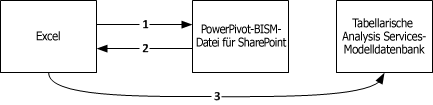

# PowerPivot BI-Semantikmodellverbindung (.bism)
  Eine BI-Semantikmodellverbindung (BISM-Datei) ist eine portierbare Verbindung, durch die Excel- oder Power View-Berichte mit einer Analysis Services-Datenbank für tabellarische Modelle oder einer Analysis Services-Instanz im mehrdimensionalen Modus verbunden werden. Wenn Sie mit Office Data Connection-Dateien (ODC-Dateien) vertraut sind, können Sie feststellen, dass eine BISM-Verbindungsdatei ähnlich definiert und verwendet wird.  
  
 Die Erstellung und der Zugriff auf eine BI-Semantikmodellverbindung erfolgt über SharePoint. Beim Erstellen von BI-Semantikmodellverbindungen werden Schnellstartbefehle für eine BI-Semantikmodellverbindung in einer Bibliothek aktiviert. Schnellstartbefehle öffnen eine neue Excel-Arbeitsmappe oder Optionen zum Bearbeiten der Verbindungsdatei. Wenn Reporting Services installiert ist, sehen Sie auch einen Befehl, um einen [!INCLUDE[ssCrescent](../../includes/sscrescent-md.md)] -Bericht zu erstellen.  
  
   
  
##   Unterstützte Datenbanken  
 Eine BI-Semantikmodellverbindung verweist auf tabellarische Modelldaten. Es gibt drei Quellen für diese Daten:  
  
-   Eine Datenbank für tabellarische Modelle, die auf einer eigenständigen Analysis Services-Instanz im Tabellenservermodus ausgeführt wird. Die Bereitstellung einer eigenständigen Analysis Services-Instanz ist für die Farm extern. Für den Zugriff auf Datenquellen außerhalb der Farm sind zusätzliche Berechtigungen erforderlich, die in folgendem Thema erläutert werden: [Erstellen einer BI-Semantikmodellverbindung mit einer tabellarischen Modelldatenbank](../../analysis-services/power-pivot-sharepoint/create-a-bi-semantic-model-connection-to-a-tabular-model-database.md).  
  
-   [!INCLUDE[ssGemini](../../includes/ssgemini-md.md)] In SharePoint gespeicherte Arbeitsmappen. Eingebettete [!INCLUDE[ssGemini](../../includes/ssgemini-md.md)] -Datenbanken in Excel-Arbeitsmappen entsprechen Datenbanken für tabellarische Modelle, die auf einem eigenständigen Analysis Services-Server im Tabellenmodus ausgeführt werden. Wenn Sie bereits [!INCLUDE[ssGemini](../../includes/ssgemini-md.md)] für Excel und [!INCLUDE[ssGemini](../../includes/ssgemini-md.md)] für SharePoint verwenden, können Sie eine BI-Semantikmodellverbindung definieren, die auf [!INCLUDE[ssGemini](../../includes/ssgemini-md.md)] -Arbeitsmappen in einer SharePoint-Bibliothek verweist, und [!INCLUDE[ssCrescent](../../includes/sscrescent-md.md)] -Berichte anhand vorhandener [!INCLUDE[ssGemini](../../includes/ssgemini-md.md)] -Daten erstellen.  Sie können entweder in der SQL Server 2008 R2-Version oder in [!INCLUDE[ssSQL11](../../includes/sssql11-md.md)] -Versionen von [!INCLUDE[ssGemini](../../includes/ssgemini-md.md)] für Excel erstellte Arbeitsmappen verwenden.  
  
-   Ein mehrdimensionales Datenmodell für eine Analysis Services-Instanz.  
  
 Einen Vergleich der Datenquellen finden Sie in der Community unter [Understanding the SQL Server 2012 BI Semantic Model (BISM)](http://www.mssqltips.com/sqlservertip/2818/understanding-the-sql-server-2012-bi-semantic-model-bism/)(Grundlegendes zum SQL Server-BI-Semantikmodell).  
  
## Grundlegendes zur Verbindungssequenz für BI-Semantikverbindungen  
 In diesem Abschnitt wird das Verbindungsverhalten zwischen verschiedenen Clientanwendungen, z. B. der Excel-Desktopanwendung oder dem Power View-Berichtserstellungsclient in SharePoint, und einer Datenbank für tabellarische Modelle innerhalb oder außerhalb der SharePoint-Farm veranschaulicht.  
  
 Alle Verbindungen mit einer Datenbank für tabellarische Modelle werden mit den Anmeldeinformationen des Benutzers hergestellt, der die Daten anfordert. Der Mechanismus dieser Verbindung richtet sich jedoch danach, ob die Verbindung eine farminterne bzw. eine Einzel- oder Doppelhopverbindung ist und ob Kerberos aktiviert ist. Weitere Informationen zu authentifizierten Verbindungen zwischen SharePoint und Back-End-Datenquellen finden Sie unter [Double-hop authentication: Why NTLM fails and Kerberos works](http://go.microsoft.com/fwlink/?LinkId=237137)(Doppelhopauthentifizierung: Warum Kerberos funktioniert und NTLM nicht).  
  
 **Herstellen einer Verbindung von Excel mit Tabellendaten in einem Netzwerk**  
  
 Wenn ein Excel-Benutzer eine BI-Semantikmodellverbindung als Datenquelle angibt, werden die Verbindungsinformationen in der BISM-Datei in die Clientanwendung heruntergeladen, die dann eine eigene direkte Anforderung für die Datenbank für tabellarische Modelle in Analysis Services ausgibt. Um auf die BISM-Verbindung zuzugreifen, muss der Excel-Benutzer ein SharePoint-Benutzer mit Leseberechtigungen für die BISM-Verbindungsdatei sein. Sobald die Verbindungsinformationen heruntergeladen wurden, wird SharePoint bei allen nachfolgenden Verbindungen umgangen, und die Daten werden direkt zwischen Excel und der Back-End-Datenbank für tabellarische Modelle übertragen.  
  
 In der folgenden Abbildung ist diese Verbindungssequenz dargestellt. Zunächst wird die BISM-Verbindung angefordert, anschließend werden die Verbindungsinformationen auf den Client heruntergeladen, und zuletzt wird die Einzelhopverbindung mit der Datenbank hergestellt. Die Verbindung wird mit den Windows-Anmeldeinformationen des Excel-Benutzers hergestellt, der über Leseberechtigungen für die Analysis Services-Datenbank verfügt. Da in diesem Szenario eine Einzelhopverbindung verwendet wird, ist Kerberos nicht erforderlich, selbst wenn es aktiviert ist.  
  
   
  
 **Herstellen einer Verbindung von Power View mit Tabellendaten in einem Netzwerk**  
  
 Wenn ein SharePoint-Benutzer auf eine BI-Semantikmodellverbindung in einer Dokumentbibliothek klickt, wird Power View (falls installiert) sofort gestartet und eine Verbindung mit der Datenbank für tabellarische Modelle hergestellt.  
  
 Bei Verbindungen zwischen Power View und einer Datenbank für tabellarische Modelle wird eine Doppelhop-Authentifizierungssequenz verwendet, bei der die Benutzeridentität vom Client an SharePoint und dann von SharePoint an eine Analysis Services-Back-End-Datenbank für tabellarische Modelle übertragen wird, die außerhalb der Farm ausgeführt wird. Die ADOMD.NET-Clientbibliothek, von der die Verbindungsanforderung verarbeitet wird, verwendet beim ersten Versuch falls möglich immer Kerberos. Wenn Kerberos konfiguriert ist, erfolgt für die Benutzeridentität für die Verbindung mit der Datenbank für tabellarische Modelle ein Identitätswechsel, und die Verbindung wird erfolgreich hergestellt.  
  
 Wenn Kerberos nicht konfiguriert ist und die Anforderung fehlschlägt, wird von Reporting Services ein zweiter Versuch unternommen. In diesem Szenario stellt die Clientbibliothek unter Verwendung der Reporting Services-Dienstidentität und der NTLM-Authentifizierung eine Verbindung mit Analysis Services her. Die Identität des Power View-Benutzers wird mithilfe des **effectiveusername** -Parameters in der Verbindungszeichenfolge übergeben.  
  
 Nur ein Mitglied der Systemadministratorrolle auf der Analysis Services-Instanz ist berechtigt, eine Verbindung unter Verwendung des **effectiveusername** -Parameters herzustellen und die Identität eines anderen Benutzers auf der Serverinstanz anzunehmen. Aus diesem Grund müssen dem Ausführungskonto des freigegebenen Reporting Services-Diensts Administratorrechte auf der Analysis Services-Instanz erteilt werden.  Anweisungen dazu, wie dem Dienstkonto Administratorberechtigungen erteilt werden, finden Sie im Thema [Erstellen einer BI-Semantikmodellverbindung mit einer tabellarischen Modelldatenbank](../../analysis-services/power-pivot-sharepoint/create-a-bi-semantic-model-connection-to-a-tabular-model-database.md).  
  
 Die folgende Abbildung enthält eine Verbindungssequenz, die die gleiche Windows-Benutzeridentität für alle Verbindungen verwendet. Bei der letzten Verbindung mit Analysis Services wird die Verbindung von der Reporting Services-Dienstanwendungsidentität hergestellt und die Windows-Benutzeridentität unter Verwendung von **effectiveusername**übergeben.  
  
   
  
 **Herstellen einer Verbindung von Power View mit [!INCLUDE[ssGemini](../../includes/ssgemini-md.md)] -Daten in SharePoint**  
  
 Wenn ein SharePoint-Benutzer auf eine BI-Semantikverbindung klickt, die zu einer [!INCLUDE[ssGemini](../../includes/ssgemini-md.md)] -Arbeitsmappe in der gleichen Farm führt, befinden sich die Verbindungen im Kontext der SharePoint-Umgebung. Die Verbindungsanforderung wird von einer [!INCLUDE[ssGemini](../../includes/ssgemini-md.md)] -Dienstanwendung verarbeitet und an die Analysis Services-Instanz auf demselben Computer weitergeleitet. Die [!INCLUDE[ssGemini](../../includes/ssgemini-md.md)] -Daten werden von der Analysis Services-Instanz aus der Arbeitsmappe extrahiert und geladen. Alle nachfolgenden Verbindungen werden von [!INCLUDE[ssGemini](../../includes/ssgemini-md.md)] -Dienstanwendungen in der Farm verwaltet.  
  
 Da alle Verbindungen in diesem Szenario innerhalb der gleichen Farm erfolgen, ist weder eine Kerberos- noch eine eingeschränkte Delegierung erforderlich.  
  
##   Verwandte Aufgaben  
 [Hinzufügen eines BI-Semantikmodell-Verbindungs-Inhaltstyps zu einer Bibliothek &#40;PowerPivot für SharePoint&#41;](../../analysis-services/power-pivot-sharepoint/add-bi-semantic-model-connection-content-type-to-library.md)  
  
 [Erstellen einer BI-Semantikmodellverbindung zu einer PowerPivot-Arbeitsmappe](../../analysis-services/power-pivot-sharepoint/create-a-bi-semantic-model-connection-to-a-power-pivot-workbook.md)  
  
 [Erstellen einer BI-Semantikmodellverbindung mit einer tabellarischen Modelldatenbank](../../analysis-services/power-pivot-sharepoint/create-a-bi-semantic-model-connection-to-a-tabular-model-database.md)  
  
 [Verwenden einer BI-Semantikmodellverbindung in Excel oder Reporting Services](../../analysis-services/power-pivot-sharepoint/use-a-bi-semantic-model-connection-in-excel-or-reporting-services.md)  
  
## Siehe auch  
 [Bestimmen des Servermodus einer Analysis Services-Instanz](../../analysis-services/instances/determine-the-server-mode-of-an-analysis-services-instance.md)   
 [Verbindung mit Analysis Services herstellen](../../analysis-services/instances/connect-to-analysis-services.md)  
  
  

