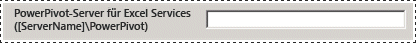
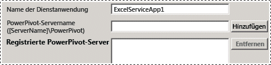
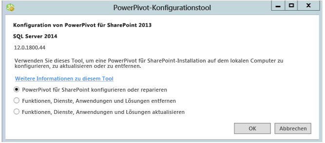

# Power Pivot-Konfigurationstools
  Konfigurieren, reparieren oder entfernen Sie [!INCLUDE[ssCurrent](../../includes/sscurrent-md.md)] [!INCLUDE[ssGeminiShort](../../includes/ssgeminishort-md.md)] mit den [!INCLUDE[ssGemini](../../includes/ssgemini-md.md)] -Konfigurationstools.  
  
 Der Setup-Assistent für [!INCLUDE[ssCurrent](../../includes/sscurrent-md.md)] installiert nicht die [!INCLUDE[ssGemini](../../includes/ssgemini-md.md)] -Konfigurationstools für SharePoint. Die Konfigurationstools werden in einer zukünftigen Version von [!INCLUDE[ssCurrent](../../includes/sscurrent-md.md)]zum Download zur Verfügung stehen.  
  
 In diesem Thema wird auf die allgemeine Verwendung der [!INCLUDE[ssGemini](../../includes/ssgemini-md.md)] -Tools und die Unterschiede zwischen ihnen eingegangen.  
  
 **[!INCLUDE[applies](../../includes/applies-md.md)]**  SharePoint 2013  
  
 **In diesem Thema:**  
  
-   [Anforderungen für die Verwendung der Konfigurationstools](#bkmk_requirements)  
  
-   [Zwei Versionen des Konfigurationstools](#bkmk_twoversions)  
  
-   [Übersicht über die Verwendung eines Power Pivot-Konfigurationstools](#bkmk_overview)  
  
-   [Starten eines der Power Pivot-Konfigurationstools](#bmkm_start_tool)  
  
##   Anforderungen für die Verwendung der Konfigurationstools  
  
-   Sie müssen ein Farmadministrator sein.  
  
-   Sie müssen Serveradministrator für die Analysis Services-Instanz sein (nur SharePoint 2010).  
  
-   Sie müssen db_owner für die Konfigurationsdatenbank der Farm sein.  
  
-   Für die Verwendung der Konfigurationstools bestehen keine TCP/IP-Portanforderungen. Deshalb besteht keine Notwendigkeit, die Firewall in Anpassung an die Konfigurationstools zu konfigurieren. Vom Konfigurationstool wird vorausgesetzt, dass die Webanwendungen und freigegebenen Dienste als Teil der SharePoint-Plattform verfügbar sind. Möglicherweise müssen Sie die Firewall für den [!INCLUDE[ssASnoversion](../../includes/ssasnoversion-md.md)] -Server konfigurieren. Weitere Informationen finden Sie unter [Configure the Windows Firewall to Allow Analysis Services Access](../../analysis-services/instances/configure-the-windows-firewall-to-allow-analysis-services-access.md).  
  
##   Zwei Versionen des Konfigurationstools  
 Der Setup-Assistent für [!INCLUDE[ssCurrent](../../includes/sscurrent-md.md)] installiert das [!INCLUDE[ssGemini](../../includes/ssgemini-md.md)] -Konfigurationstool für SharePoint 2010 sowie ein [!INCLUDE[ssGemini](../../includes/ssgemini-md.md)] -Konfigurationstool für SharePoint 2013.  
  
 Die Tools können nur mit einer [!INCLUDE[ssCurrent](../../includes/sscurrent-md.md)] -Instanz oder [!INCLUDE[ssSQL11SP1](../../includes/sssql11sp1-md.md)] -Instanz von [!INCLUDE[ssGeminiShort](../../includes/ssgeminishort-md.md)]verwendet werden. Verwenden Sie sie nicht mit [!INCLUDE[ssKilimanjaro](../../includes/sskilimanjaro-md.md)] -Installationen.  
  
|Name|Unterstützte SharePoint-Versionen|Konfigurationsdetails|  
|----------|-------------------------------------|----------------------------|  
|[!INCLUDE[ssGemini](../../includes/ssgemini-md.md)] Konfiguration von Power Pivot für SharePoint 2013|SharePoint 2013|[Konfigurieren oder Reparieren von Power Pivot für SharePoint 2013 &#40;Power Pivot-Konfigurationstool&#41;](../../analysis-services/power-pivot-sharepoint/configure-or-repair-power-pivot-for-sharepoint-2013.md)|  
|[!INCLUDE[ssGemini](../../includes/ssgemini-md.md)] Konfigurationstool|SharePoint 2010 mit SharePoint 2010|[Konfigurieren oder Reparieren von Power Pivot für SharePoint 2010 (Power Pivot-Konfigurationstool)](http://msdn.microsoft.com/en-us/d61f49c5-efaa-4455-98f2-8c293fa50046)|  
  
###   Unterschiede zwischen den beiden Konfigurationstools  
 Die beiden Versionen des Konfigurationstools sind ähnlich, unterscheiden sich jedoch hinsichtlich der ausgeführten Konfigurationsschritte. Die Unterschiede resultieren aus den Änderungen zwischen SharePoint 2010 und SharePoint 2013 sowie den Architekturunterschieden zwischen der SQL Server 2012 SP1-Version von [!INCLUDE[ssGemini](../../includes/ssgemini-md.md)] für SharePoint und den Vorgängerversionen von [!INCLUDE[ssGemini](../../includes/ssgemini-md.md)] für SharePoint.  
  
 In der folgenden Tabelle sind die neuen und geänderten Funktionen im Tool für die **[!INCLUDE[ssGemini](../../includes/ssgemini-md.md)] für SharePoint 2013-Konfiguration** beschrieben. Außerdem sind in der Tabelle die Funktionen des **[!INCLUDE[ssGemini](../../includes/ssgemini-md.md)] -Konfigurationstools** beschrieben, die nicht im [!INCLUDE[ssGemini](../../includes/ssgemini-md.md)] für SharePoint 2013-Konfigurationstool enthalten sind. Die Zeilen in der Tabelle weisen die gleiche Reihenfolge auf wie die Registerkarten in den Konfigurationstools.  
  
|[!INCLUDE[ssGemini](../../includes/ssgemini-md.md)] Konfiguration von Power Pivot für SharePoint 2013|[!INCLUDE[ssGemini](../../includes/ssgemini-md.md)] Konfigurationstool|  
|--------------------------------------------------------------|-----------------------------------------------|  
|Die Hauptseite verfügt über eine neue Option für **[!INCLUDE[ssGemini](../../includes/ssgemini-md.md)] -Server für Excel Services**. Die Option unterstützt die neue Architektur, in der [!INCLUDE[ssASnoversion](../../includes/ssasnoversion-md.md)] außerhalb der SharePoint-Farm ausgeführt wird. Sie konfigurieren Excel Services für die Verwendung eines oder mehrerer [!INCLUDE[ssASnoversion](../../includes/ssasnoversion-md.md)] -Server, die im SharePoint-Modus ausgeführt werden.   ||  
||Das Tool für die Version 2010 enthält die Seite **SQL Server Analysis Services ([!INCLUDE[ssGemini](../../includes/ssgemini-md.md)]) auf dem lokalen Server registrieren**, auf der eine lokale Instanz von [!INCLUDE[ssASnoversion](../../includes/ssasnoversion-md.md)] konfiguriert werden kann. Diese Seite ist im Tool für die Version 2013 nicht enthalten, da keine lokale Instanz von [!INCLUDE[ssASnoversion](../../includes/ssasnoversion-md.md)]vorhanden ist.   |  
||Die Seite **[!INCLUDE[ssGemini](../../includes/ssgemini-md.md)]-Dienstanwendung erstellen** verfügt über die zusätzliche Option **Arbeitsmappen aktualisieren, um die Datenaktualisierung zuzulassen**. Diese Option steht im Tool für die Version 2013 nicht zur Verfügung.   |  
|Das Tool für die Version 2013 verfügt über die neue Seite **[!INCLUDE[ssGemini](../../includes/ssgemini-md.md)]-Server konfigurieren**. Diese Seite unterstützt die neue Architektur von [!INCLUDE[ssASnoversion](../../includes/ssasnoversion-md.md)] , die außerhalb der SharePoint-Farm ausgeführt wird. Der Servername, der auf der Hauptseite im Textfeld **[!INCLUDE[ssGemini](../../includes/ssgemini-md.md)]-Server für Excel Services** eingegeben wurde, wird standardmäßig auch unter **[!INCLUDE[ssGemini](../../includes/ssgemini-md.md)]-Server konfigurieren** aufgeführt.   ||  
|Das Tool für die Version 2013 verfügt über die neue Seite **[!INCLUDE[ssGemini](../../includes/ssgemini-md.md)]-Add-In als Tracker für die Verwendung von Excel Services registrieren**. Die [!INCLUDE[ssGemini](../../includes/ssgemini-md.md)]-Verwendungsdaten werden von SharePoint 2010 Excel Services nicht nachverfolgt.||  
||Das Tool für die Version 2010 enthält die Seite **MSOLAP.5 als vertrauenswürdigen Anbieter hinzufügen** , um MSOLAP zu registrieren, damit [!INCLUDE[ssGemini](../../includes/ssgemini-md.md)] -Modelle von Excel Services in SharePoint 2010 geladen werden können. Diese Seite ist im Tool für die Version 2013 nicht enthalten. SharePoint 2013 Excel Services verwendet nicht den MSOLAP-Anbieter, um Modelle zu laden.|  
  
##   Übersicht über die Verwendung eines Power Pivot-Konfigurationstools  
 Wenn Sie eines der [!INCLUDE[ssGemini](../../includes/ssgemini-md.md)] -Konfigurationstools starten, wertet das Tool eine vorhandene Installation aus, um zu ermitteln, welche Vorgänge anwendbar sind. Bei einer neuen Installation ist nur der Konfigurationstask verfügbar. Nach der Serverkonfiguration wird der Task zum Entfernen angezeigt. Wenn Sie mit einer [!INCLUDE[ssKilimanjaro](../../includes/sskilimanjaro-md.md)] -Instanz begonnen haben, wird das Upgrade auch in der Liste der verfügbaren Tasks aktiviert.  
  
 Wenn Sie mit der Zentraladministration oder Windows PowerShell nicht vertraut sind, können Sie alternativ das Konfigurationstool ausführen, um eine [!INCLUDE[ssGeminiShort](../../includes/ssgeminishort-md.md)] -Installation vorzunehmen.  
  
 Darüber hinaus kann das Tool erkennen, ob die Farm konfiguriert ist oder ob erforderliche Funktionen fehlen. Wenn die SharePoint-Programmdateien installiert sind, aber die Farm nicht konfiguriert ist, stellt das Tool Aktionen zum Konfigurieren der Farm sowie der [!INCLUDE[ssGeminiShort](../../includes/ssgeminishort-md.md)] -Installation bereit.  
  
 Sie können die Registerkarte **Skript** überprüfen, um zu erfahren und zu verstehen, wie [!INCLUDE[ssGemini](../../includes/ssgemini-md.md)] und SharePoint mithilfe von Windows PowerShell konfiguriert werden. Weitere Informationen finden Sie unter den folgenden Links:  
  
-   [PowerPivot-Konfiguration mit Windows PowerShell](../../analysis-services/power-pivot-sharepoint/power-pivot-configuration-using-windows-powershell.md)  
  
-   [PowerShell-Referenz für PowerPivot für SharePoint](../../analysis-services/powershell/powershell-reference-for-power-pivot-for-sharepoint.md)  
  
> [!NOTE]  
>  Das Tool konfiguriert nicht Reporting Services. Wenn Sie der SharePoint-Umgebung Reporting Services hinzufügen, müssen Sie Reporting Services separat installieren und konfigurieren. Weitere Informationen finden Sie unter den folgenden Links:  
>   
>  -   [Installieren des ersten Berichtsservers im SharePoint-Modus](../../reporting-services/install-windows/install-the-first-report-server-in-sharepoint-mode.md)  
> -   [Installieren des SharePoint-Modus von Reporting Services für SharePoint 2010](http://msdn.microsoft.com/en-us/47efa72e-1735-4387-8485-f8994fb08c8c).  
  
##   Starten eines der Power Pivot-Konfigurationstools  
  
1.  Geben Sie im Bildschirm **Start**  **powerpivot**ein.  
  
     Geben Sie auf dem **Startbildschirm** **powerpivot** ein, oder klicken Sie im **Startmenü** auf **Alle Programme**, [!INCLUDE[ssCurrentUI](../../includes/sscurrentui-md.md)]und **Konfigurationstools**, und klicken Sie dann auf eine der folgenden Optionen:  
  
    -   **[!INCLUDE[ssGemini](../../includes/ssgemini-md.md)] Konfigurationstool**  
  
    -   **OR**  
  
    -   **[!INCLUDE[ssGemini](../../includes/ssgemini-md.md)] für SharePoint 2013**  
  
       
  
     **Hinweis:** Die Tools sind nur verfügbar, wenn [!INCLUDE[ssGeminiShort](../../includes/ssgeminishort-md.md)] auf dem lokalen Server installiert ist.  
  
2.  Beim Start überprüfen die Konfigurationstools den Status der Installation und stellen Aufgaben bereit, die für die jeweilige Installation gelten.  
  
3.  Abhängig vom aktuellen Status der Installation können eine oder mehrere der folgenden Aufgaben ausgeführt werden:  
  
    1.  Klicken Sie auf **[!INCLUDE[ssGemini](../../includes/ssgemini-md.md)] für SharePoint konfigurieren oder reparieren**, um Tasks zur Installationsnachbereitung abzuschließen oder eine Installation zu reparieren.  
  
    2.  Klicken Sie auf **Funktionen, Dienste, Anwendungen und Lösungen entfernen** , um Funktionen und Lösungen von der Farm zu entfernen.  
  
    3.  Klicken Sie auf **Funktionen, Dienste, Anwendungen und Lösungen aktualisieren** , um Funktionen und Lösungen zu aktualisieren, die mit einer früheren Version von [!INCLUDE[ssGeminiShort](../../includes/ssgeminishort-md.md)]installiert wurden.  
  
     In der Abbildung ist beispielsweise die Startseite des [!INCLUDE[ssGemini](../../includes/ssgemini-md.md)] für SharePoint 2013-Konfigurationstools dargestellt.  
  
       
  
 Jeder Task besteht aus einzelnen Aktionen, die verschiedene Aspekte der Serverkonfiguration behandeln. Die Konfigurationsaufgabe schließt z.B. Aktionen zum Bereitstellen von Lösungen, Erstellen einer [!INCLUDE[ssGemini](../../includes/ssgemini-md.md)] -Dienstanwendung, Aktivieren von Funktionen und Konfigurieren der Datenaktualisierung ein. Die Liste der Aktionen variiert je nach dem aktuellen Status der Installation. Wenn eine Aktion nicht benötigt wird, wird sie vom Tool aus der Taskliste ausgeschlossen.  
  
 Wenn Sie auf Ausführen klicken, verarbeitet das Tool alle Aktionen im Batchmodus. Obwohl jede Aktion in der Aufgabenliste als separates Element angezeigt wird, werden alle im Task enthaltenen Aktionen zusammen verarbeitet. Nur Aktionen, die ein positives Überprüfungsergebnis aufweisen, werden verarbeitet. Sie müssen einige der Eingabewerte möglicherweise hinzufügen oder ändern, damit ein positives Überprüfungsergebnis erzielt wird.  
  
## Verwandte Inhalte  
 [Upgraden von PowerPivot für SharePoint](../../database-engine/install-windows/upgrade-power-pivot-for-sharepoint.md) beschreibt, wie eine vorhandene Installation aktualisiert wird, die sich bereits in einer Farm befindet.  
  
 [Deinstallieren von PowerPivot für SharePoint](../../sql-server/install/uninstall-power-pivot-for-sharepoint.md) beschreibt, wie [!INCLUDE[ssGemini](../../includes/ssgemini-md.md)] für SharePoint-Dienste, -Lösungen und -Anwendungsseiten aus einer Farm entfernt werden.  
  
 [PowerPivot-Konfiguration mit Windows PowerShell](../../analysis-services/power-pivot-sharepoint/power-pivot-configuration-using-windows-powershell.md)  
  
 [PowerPivot-Serververwaltung und -konfiguration in der Zentraladministration](../../analysis-services/power-pivot-sharepoint/power-pivot-server-administration-and-configuration-in-central-administration.md)  
  
  
