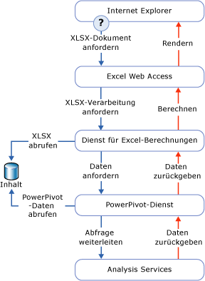

# Datenzugriff in PowerPivot
  In diesem Thema werden die Methoden beschrieben, mit denen Daten aus einer [!INCLUDE[ssGemini](../../includes/ssgemini-md.md)] -Arbeitsmappe abgerufen werden, die in einer SharePoint-Bibliothek veröffentlicht ist.  
  
 [!INCLUDE[ssGemini](../../includes/ssgemini-md.md)] -Daten werden in einer Excel-Arbeitsmappe gespeichert. Die Verbindungszeichenfolge ist eine URL zu einer Arbeitsmappe auf einer SharePoint-Website.  
  
 [!INCLUDE[ssGemini](../../includes/ssgemini-md.md)] -Daten werden am häufigsten von der Arbeitsmappe verwendet, die sie enthält, wie z.B. Daten hinter PivotTables und PivotCharts. [!INCLUDE[ssGemini](../../includes/ssgemini-md.md)] -Daten können auch als externe Datenquelle verwendet werden, wenn eine Arbeitsmappe, ein Dashboard oder ein Bericht eine Verbindung mit einer getrennten Excel-Datei (XLSX-Datei) in SharePoint herstellen und die Daten für die anschließende Nutzung abrufen. Clienttools, die häufig [!INCLUDE[ssGemini](../../includes/ssgemini-md.md)] -Daten verwenden, sind Excel, [!INCLUDE[ssCrescent](../../includes/sscrescent-md.md)], andere Reporting Services-Berichte und PerformancePoint.  
  
 Auf dem Desktop verwendet das [!INCLUDE[ssGemini](../../includes/ssgemini-md.md)] -Add-In AMO und ADOMD.NET, um die [!INCLUDE[ssGemini](../../includes/ssgemini-md.md)] -Daten im Clientarbeitsbereich zu erstellen, zu verarbeiten und abzufragen.  
  
 In einer SharePoint-Farm verwendet Excel Services den lokalen MSOLAP-OLE DB-Anbieter, um eine Verbindung mit [!INCLUDE[ssGemini](../../includes/ssgemini-md.md)] -Daten herzustellen. Der Anbieter sendet die Verbindungsanforderung an einen [!INCLUDE[ssGemini](../../includes/ssgemini-md.md)] für SharePoint-Server in der Farm. Dieser Server lädt die Daten, führt die Abfrage aus, und gibt das Resultset zurück.  
  
##   Abfragen von PowerPivot-Daten in SharePoint  
 Wenn Sie eine [!INCLUDE[ssGemini](../../includes/ssgemini-md.md)] -Arbeitsmappe aus einer SharePoint-Bibliothek anzeigen, werden die [!INCLUDE[ssGemini](../../includes/ssgemini-md.md)] -Daten in der Arbeitsmappe erkannt, extrahiert und getrennt auf Analysis Services-Serverinstanzen innerhalb der Farm verarbeitet, während die Darstellungsschicht von Excel Services gerendert wird. Sie können die vollständig verarbeitete Arbeitsmappe in einem Browserfenster oder in einer Excel 2010-Desktopanwendung anzeigen, die über das [!INCLUDE[ssGemini](../../includes/ssgemini-md.md)] -Add-In verfügt.  
  
 Das folgende Diagramm veranschaulicht, wie eine Anforderung für die Abfrageverarbeitung in der Farm weiterverarbeitet wird. Da [!INCLUDE[ssGemini](../../includes/ssgemini-md.md)] -Daten Bestandteil einer Excel 2010-Arbeitsmappe sind, wird eine Anforderung für die Abfrageverarbeitung ausgegeben, wenn ein Benutzer eine Excel-Arbeitsmappe aus einer SharePoint-Bibliothek öffnet und mit einer PivotTable oder einem PivotChart interagiert, die bzw. das [!INCLUDE[ssGemini](../../includes/ssgemini-md.md)] -Daten enthält.  
  
   
  
 Excel Services und [!INCLUDE[ssGemini](../../includes/ssgemini-md.md)] für SharePoint-Komponenten verarbeiten unterschiedliche Bereiche der gleichen Arbeitsmappendatei (XLSX). Excel Services erkennt [!INCLUDE[ssGemini](../../includes/ssgemini-md.md)] -Daten und fordert die Verarbeitung durch einen [!INCLUDE[ssGemini](../../includes/ssgemini-md.md)] -Server in der Farm an. Der [!INCLUDE[ssGemini](../../includes/ssgemini-md.md)] -Server ordnet die Anforderung einer [!INCLUDE[ssGeminiSrv](../../includes/ssgeminisrv-md.md)] -Instanz zu, die die Daten aus der Arbeitsmappe in der Inhaltsbibliothek extrahiert und lädt. Im Arbeitsspeicher gespeicherte Daten werden wieder mit der gerenderten Arbeitsmappe zusammengeführt und zur Darstellung in einem Browserfenster zurück an Excel Web Access übergeben.  
  
 Nicht alle Daten in einer [!INCLUDE[ssGemini](../../includes/ssgemini-md.md)] -Arbeitsmappe werden von [!INCLUDE[ssGemini](../../includes/ssgemini-md.md)] für SharePoint behandelt. Tabellen und Zellendaten in einem Arbeitsblatt werden durch Excel Services verarbeitet. Nur PivotTables, PivotCharts und Slicer, die auf [!INCLUDE[ssGemini](../../includes/ssgemini-md.md)] -Daten basieren, werden durch den [!INCLUDE[ssGemini](../../includes/ssgemini-md.md)] -Dienst für SharePoint verarbeitet.  
  
## Siehe auch  
 [Verbindung mit Analysis Services herstellen](../../analysis-services/instances/connect-to-analysis-services.md)   
 [Zugriff auf Daten im tabellarischen Modell](../../analysis-services/tabular-models/tabular-model-data-access.md)  
  
  

