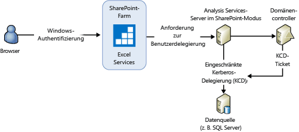
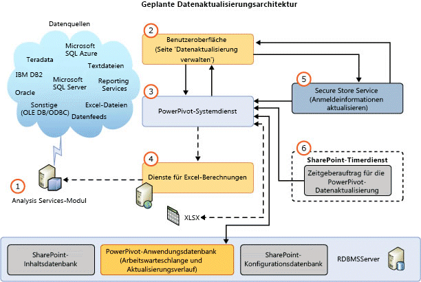

# Power Pivot-Datenaktualisierung mit SharePoint 2013
  Beim Aktualisieren von [!INCLUDE[ssGemini](../../includes/ssgemini-md.md)] -Datenmodellen in SharePoint 2013 wird standardmäßig Excel Services als Hauptkomponente zum Laden und Aktualisieren von Datenmodellen auf einer [!INCLUDE[ssCurrent](../../includes/sscurrent-md.md)] [!INCLUDE[ssASnoversion](../../includes/ssasnoversion-md.md)] -Instanz verwendet, die im SharePoint-Modus ausgeführt wird. Der [!INCLUDE[ssASnoversion](../../includes/ssasnoversion-md.md)] -Server wird außerhalb der SharePoint-Farm ausgeführt. Die Architektur in SharePoint 2013 Excel Services unterstützt sowohl die **interaktive Datenaktualisierung** als auch die **planmäßige Datenaktualisierung**.  
  
 **[!INCLUDE[applies](../../includes/applies-md.md)]**  SharePoint 2013  
  
 **In diesem Thema:**  
  
-   [Interactive Data Refresh](#bkmk_interactive_refresh)  
  
-   [Windows-Authentifizierung mit Arbeitsmappen-Datenverbindungen und interaktiver Datenaktualisierung](#bkmk_windows_auth_interactive_data_refresh)  
  
-   [Scheduled Data Refresh](#bkmk_scheduled_refresh)  
  
-   [Architektur der geplante Datenaktualisierung in SharePoint 2013](#bkmk_refresh_architecture)  
  
-   [Zusätzliche Überlegungen zur Authentifizierung](#datarefresh_additional_authentication)  
  
-   [Weitere Informationen](#bkmk_moreinformation)  
  
## Hintergrund  
 SharePoint Server 2013 Excel Services verwaltet die Datenaktualisierung für Excel 2013-Arbeitsmappen und löst die datenmodellverarbeitung auf einem [!INCLUDE[ssCurrent](../../includes/sscurrent-md.md)] [!INCLUDE[ssASnoversion](../../includes/ssasnoversion-md.md)] -Server, der im SharePoint-Modus ausgeführt wird. Für Excel 2010-Arbeitsmappen verwaltet Excel Services auch das Laden und Speichern von Arbeitsmappen und Datenmodellen. Allerdings verwendet Excel Services den [!INCLUDE[ssGemini](../../includes/ssgemini-md.md)] -Systemdienst, um die Verarbeitungsbefehle an das Datenmodell zu senden. In der folgenden Tabelle werden die Komponenten zusammengefasst, die Verarbeitungsbefehle für die Datenaktualisierung senden, aufgeschlüsselt nach Version der Arbeitsmappe. Als Umgebung wird eine SharePoint 2013-Farm angenommen, die für die Verwendung eines [!INCLUDE[ssCurrent](../../includes/sscurrent-md.md)] Analysis-Servers im SharePoint-Modus konfiguriert ist.  
  
||||  
|-|-|-|  
||Excel 2013-Arbeitsmappen|Excel 2010-Arbeitsmappen|  
|Datenaktualisierung auslösen|**Interaktiv:** Authentifizierter Benutzer   **Geplant:** [!INCLUDE[ssGemini](../../includes/ssgemini-md.md)] -Systemdienst|[!INCLUDE[ssGemini](../../includes/ssgemini-md.md)] -Systemdienst|  
|Arbeitsmappe aus Inhaltsdatenbanken laden|SharePoint 2013 Excel Services|SharePoint 2013 Excel Services|  
|Datenmodell in Analysis Services-Instanz laden|SharePoint 2013 Excel Services|SharePoint 2013 Excel Services|  
|Verarbeitungsbefehle an Analysis Services-Instanz senden|SharePoint 2013 Excel Services|[!INCLUDE[ssGemini](../../includes/ssgemini-md.md)] -Systemdienst|  
|Arbeitsmappendaten aktualisieren|SharePoint 2013 Excel Services|SharePoint 2013 Excel Services|  
|Arbeitsmappe und Datenmodell in Inhaltsdatenbank speichern|**Interaktiv:** N/V   **Geplant:** SharePoint 2013 Excel Services|SharePoint 2013 Excel Services|  
  
 In der folgenden Tabelle werden die unterstützten Aktualisierungsfunktionen in einer SharePoint 2013-Farm zusammengefasst, die für die Verwendung eines [!INCLUDE[ssCurrent](../../includes/sscurrent-md.md)] Analysis-Servers im SharePoint-Modus konfiguriert ist:  
  
|Arbeitsmappe erstellt in|planmäßige Datenaktualisierung|Interaktive Datenaktualisierung|  
|-------------------------|----------------------------|-------------------------|  
|2008 R2 [!INCLUDE[ssGemini](../../includes/ssgemini-md.md)] für Excel|Nicht unterstützt. Arbeitsmappe upgraden **(\*)**|Nicht unterstützt. Arbeitsmappe upgraden **(\*)**|  
|2012 [!INCLUDE[ssGemini](../../includes/ssgemini-md.md)] für Excel|Supported|Nicht unterstützt. Arbeitsmappe upgraden **(\*)**|  
|Excel 2013|Supported|Supported|  
  
 **(\*)** Weitere Informationen zum Upgraden von Arbeitsmappen finden Sie unter [Upgraden von Arbeitsmappen und planmäßige Datenaktualisierungen &#40;SharePoint 2013&#41;](../../analysis-services/instances/install-windows/upgrade-workbooks-and-scheduled-data-refresh-sharepoint-2013.md).  
  
##   Interactive Data Refresh  
 Bei der interaktiven oder manuellen Datenaktualisierung in SharePoint Server 2013 Excel Services können Datenmodelle mit Daten aus der ursprünglichen Datenquelle aktualisiert werden. Die interaktive Datenaktualisierung ist verfügbar, nachdem Sie eine Excel Services-Anwendung konfiguriert haben, indem Sie einen im SharePoint-Modus ausgeführten [!INCLUDE[ssASnoversion](../../includes/ssasnoversion-md.md)] -Server registrieren. Weitere Informationen finden Sie unter [Verwalten von Excel Services-Datenmodelleinstellungen (SharePoint Server 2013)](http://technet.microsoft.com/library/jj219780.aspx) (http://technet.microsoft.com/library/jj219780.aspx).  
  
> [!NOTE]  
>  Die interaktive Datenaktualisierung ist nur für Arbeitsmappen verfügbar, die in Excel 2013 erstellt wurden. Wenn Sie versuchen, eine Excel 2010-Arbeitsmappe zu aktualisieren, zeigt Excel Services eine Fehlermeldung ähnlich der folgenden an: „Fehler beim [!INCLUDE[ssGemini](../../includes/ssgemini-md.md)]-Vorgang: Die Arbeitsmappe wurde mit einer älteren Version von Excel erstellt, und [!INCLUDE[ssGemini](../../includes/ssgemini-md.md)] kann erst aktualisiert werden, nachdem für die Datei ein Upgrade durchgeführt wurde.“ Weitere Informationen zum Upgraden von Arbeitsmappen finden Sie unter [Upgraden von Arbeitsmappen und planmäßige Datenaktualisierungen &#40;SharePoint 2013&#41;](../../analysis-services/instances/install-windows/upgrade-workbooks-and-scheduled-data-refresh-sharepoint-2013.md).  
  
 **Wichtige Punkte zur interaktiven Aktualisierung:**  
  
-   Bei der interaktiven Datenaktualisierung werden nur die Daten in der aktuellen Benutzersitzung aktualisiert. Die Daten werden nicht automatisch wieder im Arbeitsmappenelement in der SharePoint-Inhaltsdatenbank gespeichert.  
  
-   **Anmeldeinformationen:** Die interaktive Datenaktualisierung kann die Identität des aktuell angemeldeten Benutzers als Anmeldeinformationen oder gespeicherte Anmeldeinformationen verwenden, um eine Verbindung mit der Datenquelle herzustellen. Welche Anmeldeinformationen verwendet werden, hängt von den Excel Services-Authentifizierungseinstellungen ab, die für die Verbindung der Arbeitsmappe mit der externen Datenquelle definiert sind.  
  
-   **Unterstützte Arbeitsmappen:**  In Excel 2013 erstellte Arbeitsmappen.  
  
 **So aktualisieren Sie Daten:**  
  
-   Beachten Sie die Abbildung nach den Schritten.  
  
1.  Öffnen Sie in einer SharePoint-Dokumentbibliothek eine [!INCLUDE[ssGemini](../../includes/ssgemini-md.md)] -Arbeitsmappe im Browser.  
  
2.  Klicken Sie im Browserfenster auf das Menü **Daten** und dann auf **Ausgewählte Verbindung aktualisieren** oder **Alle Verbindungen aktualisieren**.  
  
3.  Excel Services lädt die [!INCLUDE[ssGemini](../../includes/ssgemini-md.md)] -Datenbank, verarbeitet sie und fragt sie anschließend ab, um den Excel-Arbeitsmappencache zu aktualisieren.  
  
4.  **Hinweis:** Die aktualisierte Arbeitsmappe wird nicht automatisch wieder in der Dokumentbibliothek gespeichert.  
  
   
  
###   Windows-Authentifizierung mit Arbeitsmappen-Datenverbindungen und interaktiver Datenaktualisierung  
 Excel Services sendet dem Analysis Services-Server einen Verarbeitungsbefehl, der den Server anweist, die Identität eines Benutzerkontos anzunehmen. Um ausreichende Systemrechte zum Delegieren des Benutzeridentitätswechsels zu erhalten, benötigt das Analysis Services-Dienstkonto die Berechtigung **Einsetzen als Teil des Betriebssystems** auf dem lokalen Server. Der Analysis Services-Server muss auch in der Lage sein, die Anmeldeinformationen des Benutzers für Datenquellen zu delegieren. Das Abfrageergebnis wird an Excel Services gesendet.  
  
 Typische Benutzererfahrung: Wenn ein Kunde „Alle Verbindungen aktualisieren“ in einer Excel 2013-Arbeitsmappe auswählt, die ein [!INCLUDE[ssGemini](../../includes/ssgemini-md.md)] -Modell enthält, wird eine Fehlermeldung ähnlich der folgenden angezeigt:  
  
-   **Fehler bei der Aktualisierung der externen Daten:** Beim Arbeiten am Datenmodell in der Arbeitsmappe ist ein Fehler aufgetreten. Wiederholen Sie den Vorgang. Eine oder mehrere Datenverbindungen in dieser Arbeitsmappe können nicht aktualisiert werden.  
  
 Abhängig vom jeweiligen Datenanbieter werden im ULS-Protokoll Meldungen ähnlich den folgenden angezeigt.  
  
 **Bei SQL Native Client:**  
  
-   Fehler beim Erstellen einer externen Verbindung oder beim Ausführen einer Abfrage. Anbietermeldung: Das Out-of-Line-Objekt 'DataSource', das auf die ID(s) '20102481-39c8-4d21-bf63-68f583ad22bb' verweist, wurde angegeben, jedoch nicht verwendet.  OLE DB- oder ODBC-Fehler: Netzwerkbezogener oder instanzspezifischer Fehler beim Herstellen einer Verbindung mit SQL Server. Der Server wurde nicht gefunden, oder auf ihn kann nicht zugegriffen werden. Überprüfen Sie, ob der Instanzname richtig ist und ob SQL Server Remoteverbindungen zulässt. Weitere Informationen finden Sie in der SQL Server-Onlinedokumentation.; 08001; SSL-Anbieter: Das angeforderte Sicherheitspaket ist nicht vorhanden; 08001; Client kann keine Verbindung herstellen; 08001; Verschlüsselung wird auf dem Client nicht unterstützt.; 08001.  , Verbindungsname: ThisWorkbookDataModel, Arbeitsmappe: Mappe1.xlsx.  
  
 **Bei Microsoft OLE DB-Anbieter für SQL Server:**  
  
-   Fehler beim Erstellen einer externen Verbindung oder beim Ausführen einer Abfrage. Anbietermeldung: Das Out-of-Line-Objekt 'DataSource', das auf die ID(s) '6e711bfa-b62f-4879-a177-c5dd61d9c242' verweist, wurde angegeben, jedoch nicht verwendet. OLE DB- oder ODBC-Fehler. , Verbindungsname: ThisWorkbookDataModel, Arbeitsmappe: OLEDB Provider.xlsx.  
  
 **Bei .NET Framework-Datenanbieter für SQL Server:**  
  
-   Fehler beim Erstellen einer externen Verbindung oder beim Ausführen einer Abfrage. Anbietermeldung: Das Out-of-Line-Objekt 'DataSource', das auf die ID(s) 'f5fb916c-3eac-4d07-a542-531524c0d44a' verweist, wurde angegeben, jedoch nicht verwendet.  Fehler im relationalen Modul. Ausnahme bei der Verwendung der verwalteten IDbConnection-Schnittstelle: Die Datei oder Assembly 'System.Transactions, Version=4.0.0.0, Culture=neutral, PublicKeyToken=b77a5c561934e089' oder eine Abhängigkeit davon wurde nicht gefunden. Entweder wurde eine geforderte Identitätswechselebene nicht geliefert, oder die gelieferte Identitätswechselebene ist unzulässig. (Ausnahme von HRESULT: 0x80070542).  , Verbindungsname: ThisWorkbookDataModel, Arbeitsmappe: NETProvider.xlsx.  
  
 **Zusammenfassung der Konfigurationsschritte** zum Konfigurieren der Berechtigung **Einsetzen als Teil des Betriebssystems** auf dem lokalen Server:  
  
1.  Fügen Sie auf dem im SharePoint-Modus ausgeführten Analysis Services-Server das Analysis Services-Dienstkonto der Berechtigung "Einsetzen als Teil des Betriebssystem" hinzu:  
  
    1.  Führen Sie "`secpol.msc`" aus.  
  
    2.  Klicken Sie auf **Lokale Sicherheitsrichtlinie**, klicken Sie dann auf **Lokale Richtlinien**und anschließend auf **Zuweisen von Benutzerrechten**.  
  
    3.  Fügen Sie das Dienstkonto hinzu.  
  
2.  Starten Sie Excel Services neu, und führen Sie einen Neustart des Analysis Services-Servers durch.  
  
3.  Die Delegierung vom Excel Services-Dienstkonto oder vom Claims to Windows Token Service (C2WTS) zur Analyse Services-Instanz ist nicht erforderlich. Daher ist keine Konfiguration für KCD von Excel Services oder C2WTS für den [!INCLUDE[ssGemini](../../includes/ssgemini-md.md)] AS-Dienst erforderlich. Wenn sich die Backend-Datenquelle auf demselben Server wie die [!INCLUDE[ssASnoversion](../../includes/ssasnoversion-md.md)] -Instanz befindet, ist keine eingeschränkte Kerberos-Delegierung erforderlich. Allerdings benötigt das [!INCLUDE[ssASnoversion](../../includes/ssasnoversion-md.md)] -Dienstkonto das Recht, als Teil des Betriebssystems zu agieren.  
  
   
  
 Weitere Informationen finden Sie unter [Einsetzen als Teil des Betriebssystems](http://technet.microsoft.com/library/cc784323\(WS.10\).aspx) (http://technet.microsoft.com/library/cc784323(WS.10).aspx).  
  
##   Scheduled Data Refresh  
 **Wichtige Punkte zur geplanten Datenaktualisierung:**  
  
-   Erfordert die Bereitstellung des [!INCLUDE[ssGemini](../../includes/ssgemini-md.md)] für SharePoint-Add-Ins. Weitere Informationen zur Installation finden Sie unter [Installieren oder Deinstallieren des PowerPivot für SharePoint-Add-Ins &#40;SharePoint 2013&#41;](../../analysis-services/instances/install-windows/install-or-uninstall-the-power-pivot-for-sharepoint-add-in-sharepoint-2013.md).  
  
-   Ein Benutzer konfiguriert einen Aktualisierungszeitplan für eine Arbeitsmappe. Zum geplanten Zeitpunkt sendet der [!INCLUDE[ssGemini](../../includes/ssgemini-md.md)] -Systemdienst eine Anforderung an Excel Services für folgende Aktionen:  
  
    -   Laden und Verarbeiten der [!INCLUDE[ssGemini](../../includes/ssgemini-md.md)] -Datenbank  
  
    -   Aktualisieren der Arbeitsmappe  
  
    -   Erneutes Speichern der Arbeitsmappe in der Inhaltsdatenbank  
  
-   **Anmeldeinformationen:** Verwendet gespeicherte Anmeldeinformationen. Verwendet nicht die Identität des aktuellen Benutzers.  
  
-   **Unterstützte Arbeitsmappen:** Mit dem [!INCLUDE[ssSQL11](../../includes/sssql11-md.md)][!INCLUDE[ssGemini](../../includes/ssgemini-md.md)] -Add-In für Excel 2010 oder mit Excel 2013 erstellte Arbeitsmappen. In Excel 2010 mit dem [!INCLUDE[ssKilimanjaro](../../includes/sskilimanjaro-md.md)][!INCLUDE[ssGemini](../../includes/ssgemini-md.md)] -Add-In erstellte Arbeitsmappen werden nicht unterstützt. Aktualisieren Sie die Arbeitsmappe mindestens auf das [!INCLUDE[ssSQL11](../../includes/sssql11-md.md)][!INCLUDE[ssGemini](../../includes/ssgemini-md.md)] -Format. Weitere Informationen zum Upgraden von Arbeitsmappen finden Sie unter [Upgraden von Arbeitsmappen und planmäßige Datenaktualisierungen &#40;SharePoint 2013&#41;](../../analysis-services/instances/install-windows/upgrade-workbooks-and-scheduled-data-refresh-sharepoint-2013.md).  
  
 So zeigen Sie die Seite **Datenaktualisierung verwalten** an:  
  
-   Beachten Sie die Abbildung nach den Schritten.  
  
1.  Klicken Sie in einer SharePoint-Dokumentbibliothek auf das Menü **Öffnen** (**...**) für eine [!INCLUDE[ssGemini](../../includes/ssgemini-md.md)]-Arbeitsmappe.  
  
2.  Klicken Sie auf das zweite Menü **Öffnen**, und klicken Sie anschließend auf **[!INCLUDE[ssGemini](../../includes/ssgemini-md.md)]-Datenaktualisierung verwalten**.  
  
3.  Klicken Sie auf der Seite **Datenaktualisierung verwalten** auf **Aktivieren** , und konfigurieren Sie dann den Aktualisierungszeitplan.  
  
4.  Zum angegebenen Zeitpunkt sendet der [!INCLUDE[ssGemini](../../includes/ssgemini-md.md)] -Systemdienst eine Anforderung an Excel Services für folgende Aktionen:  
  
    -   Laden und Verarbeiten des [!INCLUDE[ssGemini](../../includes/ssgemini-md.md)] -Datenmodells.  
  
    -   Aktualisieren der Arbeitsmappe  
  
    -   Erneutes Speichern der Arbeitsmappe in der Inhaltsdatenbank  
  
   
  
> [!TIP]  
>  Informationen zum Aktualisieren von Arbeitsmappen aus SharePoint Online finden Sie unter [Aktualisieren von Excel-Arbeitsmappen mit eingebundenen Power Pivot-Modellen aus SharePoint Online (Whitepaper)](http://technet.microsoft.com/library/jj992650.aspx) (http://technet.microsoft.com/library/jj992650.aspx).  
  
##   Architektur der geplante Datenaktualisierung in SharePoint 2013  
 In der folgenden Abbildung wird die Datenaktualisierungsarchitektur in SharePoint 2013 und SQL Server 2012 SP1 zusammengefasst dargestellt.  
  
   
  
||Description||  
|-|-----------------|-|  
|**(1)**|Analysis Services-Modul|Ein [!INCLUDE[ssCurrent](../../includes/sscurrent-md.md)][!INCLUDE[ssASnoversion](../../includes/ssasnoversion-md.md)] -Server, der im SharePoint-Modus ausgeführt wird. Der Server wird außerhalb der SharePoint-Farm ausgeführt.|  
|**(2)**|Benutzeroberfläche|Die Benutzeroberfläche besteht aus zwei Seiten. Auf einer Seite wird der Zeitplan definiert, auf der zweiten Seite wird der Aktualisierungsverlauf angezeigt. Die Seiten greifen nicht direkt auf die [!INCLUDE[ssGemini](../../includes/ssgemini-md.md)] -Dienstanwendungs-Datenbanken zu, sondern über den [!INCLUDE[ssGemini](../../includes/ssgemini-md.md)] -Systemdienst.|  
|**(3)**|[!INCLUDE[ssGemini](../../includes/ssgemini-md.md)] -Systemdienst|Der Dienst wird installiert, wenn Sie das [!INCLUDE[ssGemini](../../includes/ssgemini-md.md)] für SharePoint-Add-In bereitstellen.   Der Dienst wird für Folgendes verwendet:|  
|||Dieser Dienst hostet das Aktualisierungsplanungsmodul, das Excel Services-APIs für die Datenaktualisierung von Excel 2013-Arbeitsmappen aufruft. Für Excel 2010-Arbeitsmappen führt der Dienst die Datenmodellverarbeitung direkt aus, verwendet für das Laden des Datenmodells und das Aktualisieren der Arbeitsmappe jedoch weiterhin Excel Services.|  
|||Dieser Dienst stellt Methoden für Komponenten bereit, wie z. B. die Benutzeroberflächenseiten, um mit dem Systemdienst zu kommunizieren.|  
|||Der Dienst verwaltet Anforderungen für den externen Zugriff auf Arbeitsmappen als Datenquelle, die vom [!INCLUDE[ssGemini](../../includes/ssgemini-md.md)] -Webdienst empfangen werden.|  
|||Verwaltung geplanter Datenaktualisierungsanforderungen für Zeitgeberaufträge und Konfigurationsseiten. Der Dienst verwaltet Anforderungen zum Lesen von Daten in die und aus der Datenbank und zum Auslösen der Datenaktualisierung mit Excel Services.|  
|||Verwendungsanalyse und verwandter Zeitgeberauftrag.|  
|**(4)**|Dienste für Excel-Berechnungen|Zuständig für das Laden der Datenmodelle.|  
|**(5)**|Secure Store Service|Wenn die Authentifizierungseinstellungen in der Arbeitsmappe auf **Das Konto des authentifizierten Benutzers verwenden** oder **Keine**festgelegt sind, werden die Anmeldeinformationen, die in der Zielanwendungs-ID für den Secure Store Service (einmaliges Anmelden) gespeichert sind, für die Datenaktualisierung verwendet. Weitere Informationen finden Sie im Abschnitt [Zusätzliche Überlegungen zur Authentifizierung](#datarefresh_additional_authentication) in diesem Thema.|  
|**(6)**|[!INCLUDE[ssGemini](../../includes/ssgemini-md.md)] Zeitgeberauftrag für die Datenaktualisierung|Weist den [!INCLUDE[ssGemini](../../includes/ssgemini-md.md)] -Systemdienst an, eine Verbindung mit Excel Services herzustellen, um Datenmodelle zu aktualisieren.|  
  
 [!INCLUDE[ssASnoversion](../../includes/ssasnoversion-md.md)] benötigt entsprechende Datenanbieter und Clientbibliotheken, damit der [!INCLUDE[ssASnoversion](../../includes/ssasnoversion-md.md)] -Server im SharePoint-Modus auf Datenquellen zugreifen kann.  
  
> [!NOTE]  
>  Da der [!INCLUDE[ssGemini](../../includes/ssgemini-md.md)] -Systemdienst keine [!INCLUDE[ssGemini](../../includes/ssgemini-md.md)] -Modelle mehr lädt oder speichert, gelten die meisten Einstellungen zum Zwischenspeichern von Modellen auf einem Anwendungsserver nicht für eine SharePoint 2013-Farm.  
  
## Protokolldaten der Datenaktualisierung  
 **Verwendungsdaten:** Sie können Verwendungsdaten zur Datenaktualisierung im [!INCLUDE[ssGemini](../../includes/ssgemini-md.md)] -Management-Dashboard anzeigen. So zeigen Sie die Verwendungsdaten an:  
  
1.  Klicken Sie in der SharePoint-Zentraladministration in der Gruppe **[!INCLUDE[ssGemini](../../includes/ssgemini-md.md)] Allgemeine Anwendungseinstellungen** auf **-Management-Dashboard** .  
  
2.  Am unteren Rand des Dashboards finden Sie Informationen unter **Datenaktualisierung - Letzte Aktivität** und **Datenaktualisierung - Letzte Fehler**.  
  
3.  Weitere Informationen zu Verwendungsdaten und wie Sie diese aktivieren finden Sie unter [PowerPivot-Management-Dashboard und Verwendungsdaten](../../analysis-services/power-pivot-sharepoint/power-pivot-management-dashboard-and-usage-data.md).  
  
 **Diagnoseprotokolldaten:** Sie können SharePoint-Diagnoseprotokolldaten zur Datenaktualisierung anzeigen. Überprüfen Sie zunächst die Konfiguration der Diagnoseprotokollierung für den **[!INCLUDE[ssGemini](../../includes/ssgemini-md.md)] -Dienst** auf der Seite **Überwachung** der SharePoint-Zentraladministration. Möglicherweise müssen Sie die Protokollierungsebene erhöhen, damit das "unwichtigste Ereignis" protokolliert wird. Legen Sie beispielsweise vorübergehend den Wert auf **Ausführlich** fest, und führen Sie dann die Datenaktualisierungsvorgänge erneut aus.  
  
 Die Protokolleinträge enthalten Folgendes:  
  
-   Den **Bereich** des **[!INCLUDE[ssGemini](../../includes/ssgemini-md.md)] -Diensts**.  
  
-   Die Kategorie der **Datenaktualisierung**.  
  
 Überprüfen Sie die **Konfiguration der Diagnoseprotokollierung**. Weitere Informationen finden Sie unter [Konfigurieren und Anzeigen der SharePoint-Protokolldateien und -Diagnoseprotokollierung &#40;Power Pivot für SharePoint&#41;](../../analysis-services/power-pivot-sharepoint/configure-and-view-sharepoint-and-diagnostic-logging.md).
  
##   Zusätzliche Überlegungen zur Authentifizierung  
 Die Einstellungen im Dialogfeld **Excel Services-Authentifizierungseinstellungen** in Excel 2013 bestimmen die Windows-Identität, die Excel Services und [!INCLUDE[ssASnoversion](../../includes/ssasnoversion-md.md)] für die Datenaktualisierung verwenden.  
  
-   **Das Konto des authentifizierten Benutzers verwenden**: Excel Services führt die Datenaktualisierung unter der Identität des gerade angemeldeten Benutzers aus.  
  
-   **Ein gespeichertes Konto verwenden**: Geht von einer SharePoint Secure Store Service-Anwendungs-ID aus, die Excel Services verwendet, um den Benutzernamen und das Kennwort abzurufen, um die Datenaktualisierung zu authentifizieren.  
  
-   **Keine**: Das **unbeaufsichtigte Dienstkonto** von Excel Services wird verwendet. Das Dienstkonto ist einem Secure Store Service-Proxy zugeordnet. Konfigurieren Sie die Einstellungen auf der Seite **Excel Services-Anwendungseinstellungen** im Abschnitt **Externe Daten** .  
  
 So öffnen Sie das Dialogfeld mit Authentifizierungseinstellungen:  
  
1.  Klicken Sie in Excel 2013 auf die Registerkarte **Daten** .  
  
2.  Klicken Sie im Menüband auf **Verbindungen** .  
  
3.  Wählen Sie im Dialogfeld **Arbeitsmappenverbindungen**die Verbindung aus, und klicken Sie auf **Eigenschaften**.  
  
4.  In the **Verbindungseigenschaften** auf **Definition**und dann auf die Schaltfläche **Authentifizierungseinstellungen** aus.  
  
   
  
 Weitere Informationen zur Authentifizierung der Datenaktualisierung und zur Verwendung von Anmeldeinformationen finden Sie im Blogbeitrag [Refreshing Power Pivot Data in SharePoint 2013](http://blogs.msdn.com/b/analysisservices/archive/2012/12/21/refreshing-powerpivot-data-in-sharepoint-2013.aspx)(Aktualisieren von Power Pivot-Daten in SharePoint 2013).  
  
##   Weitere Informationen  
 [Problembehandlung für Power Pivot-Datenaktualisierung](http://social.technet.microsoft.com/wiki/contents/articles/3870.troubleshooting-powerpivot-data-refresh.aspx)  
  
 [Excel Services in SharePoint 2013](http://msdn.microsoft.com/library/sharepoint/jj164076\(v=office.15\))  
  
## Siehe auch  
 [Installieren von Analysis Services im PowerPivot-Modus](../../analysis-services/instances/install-windows/install-analysis-services-in-power-pivot-mode.md)  
  
  

