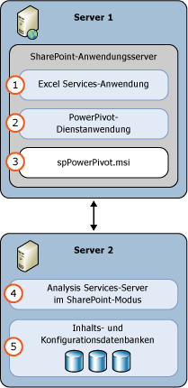

# PowerPivot für SharePoint (SSAS)
  Ein [!INCLUDE[ssASnoversion](../../includes/ssasnoversion-md.md)] -Server im [!INCLUDE[ssGemini](../../includes/ssgemini-md.md)] -Modus stellt Serverhosting von [!INCLUDE[ssGemini](../../includes/ssgemini-md.md)] -Daten in einer SharePoint-Farm bereit. [!INCLUDE[ssGemini](../../includes/ssgemini-md.md)] -Daten sind ein analytisches Datenmodell, das Sie mit einer der folgenden Anwendungen erstellen:  
  
-   [!INCLUDE[ssGemini](../../includes/ssgemini-md.md)] für Excel 2010-Add-In  
  
-   Excel 2013  
  
-   Excel 2016  
  
 **[!INCLUDE[applies](../../includes/applies-md.md)]**  [!INCLUDE[ssGeminiShort](../../includes/ssgeminishort-md.md)] 2016 | [!INCLUDE[ssGeminiShort](../../includes/ssgeminishort-md.md)] 2013  
  
 Für das Serverhosting dieser Daten sind SharePoint, Excel Services und eine Installation von [!INCLUDE[ssGemini](../../includes/ssgemini-md.md)] für SharePoint erforderlich. Die Daten werden auf [!INCLUDE[ssGemini](../../includes/ssgemini-md.md)] für SharePoint-Instanzen geladen, wo sie mit der [!INCLUDE[ssGemini](../../includes/ssgemini-md.md)] -Datenaktualisierungsfunktion nach einem Zeitplan aktualisiert werden können. Diese Funktion stellt der Server für Excel 2010-Arbeitsmappen bzw. die [!INCLUDE[ssGemini](../../includes/ssgemini-md.md)] für Excel 2013- und Excel 2016-Arbeitsmappen bereit.  
  
## Power Pivot für SharePoint 2016  
 [!INCLUDE[ssCurrent](../../includes/sscurrent-md.md)] [!INCLUDE[ssGeminiShort](../../includes/ssgeminishort-md.md)] unterstützt die Verwendung von Excel-Arbeitsmappen mit Datenmodellen und [!INCLUDE[msCoName](../../includes/msconame-md.md)] Power View-Berichten durch [!INCLUDE[offOnlineServer](../../includes/offonlineserver-md.md)] SharePoint 2016 und [!INCLUDE[ssRSnoversion](../../includes/ssrsnoversion-md.md)] .  
  
 Excel Services in [!INCLUDE[offOnlineServer](../../includes/offonlineserver-md.md)] umfasst Funktionen für Datenmodelle, die die Interaktion mit einer [!INCLUDE[ssGemini](../../includes/ssgemini-md.md)] -Arbeitsmappe im Browser ermöglichen. Sie müssen kein [!INCLUDE[ssGemini](../../includes/ssgemini-md.md)] für SharePoint 2016-Add-In für die Farm bereitstellen. Sie müssen nur einen [!INCLUDE[ssASnoversion](../../includes/ssasnoversion-md.md)] -Server im [!INCLUDE[ssGemini](../../includes/ssgemini-md.md)] -Modus installieren und den Server bei [!INCLUDE[offOnlineServer](../../includes/offonlineserver-md.md)]registrieren.  
  
 Die Bereitstellung des [!INCLUDE[ssGemini](../../includes/ssgemini-md.md)] für SharePoint 2016-Add-Ins macht einen zusätzlichen Funktionsumfang in der SharePoint-Farm verfügbar. Zu diesen Funktionen gehören der [!INCLUDE[ssGemini](../../includes/ssgemini-md.md)] -Katalog und die planmäßige Datenaktualisierung.  
  
   
  
## Power Pivot für SharePoint 2013  
 [!INCLUDE[ssCurrent](../../includes/sscurrent-md.md)] [!INCLUDE[ssGeminiShort](../../includes/ssgeminishort-md.md)] unterstützt die Verwendung von Excel-Arbeitsmappen mit Datenmodellen und [!INCLUDE[msCoName](../../includes/msconame-md.md)] Power View-Berichten durch [!INCLUDE[ssRSnoversion](../../includes/ssrsnoversion-md.md)] SharePoint 2013 Excel Services.  
  
 Excel Services in SharePoint 2013 umfasst Funktionen für Datenmodelle, die die Interaktion mit einer [!INCLUDE[ssGemini](../../includes/ssgemini-md.md)] -Arbeitsmappe im Browser ermöglichen. Sie müssen kein [!INCLUDE[ssGemini](../../includes/ssgemini-md.md)] für SharePoint 2013-Add-In für die Farm bereitstellen. Es ist lediglich erforderlich, einen [!INCLUDE[ssASnoversion](../../includes/ssasnoversion-md.md)] -Server im SharePoint-Modus zu installieren und den Server in Excel Services in den Einstellungen unter **Datenmodell** zu registrieren.  
  
 Die Bereitstellung des [!INCLUDE[ssGemini](../../includes/ssgemini-md.md)] für SharePoint 2013-Add-Ins macht einen zusätzlichen Funktionsumfang in der SharePoint-Farm verfügbar. Zu diesen Funktionen gehören der [!INCLUDE[ssGemini](../../includes/ssgemini-md.md)] -Katalog, die planmäßige Datenaktualisierung und das [!INCLUDE[ssGemini](../../includes/ssgemini-md.md)] -Management-Dashboard.  
  
   
  
##   In diesem Abschnitt  
 [PowerPivot-Serververwaltung und -konfiguration in der Zentraladministration](../../analysis-services/power-pivot-sharepoint/power-pivot-server-administration-and-configuration-in-central-administration.md)  
  
 [PowerPivot-Konfiguration mit Windows PowerShell](../../analysis-services/power-pivot-sharepoint/power-pivot-configuration-using-windows-powershell.md)  
  
 [Power Pivot-Konfigurationstools](../../analysis-services/power-pivot-sharepoint/power-pivot-configuration-tools.md)  
  
 [Power Pivot-Authentifizierung und -Autorisierung](../../analysis-services/power-pivot-sharepoint/power-pivot-authentication-and-authorization.md)  
  
 [Konfigurieren von Power Pivot-Integritätsregeln](../../analysis-services/power-pivot-sharepoint/configure-power-pivot-health-rules.md)  
  
 [PowerPivot-Management-Dashboard und Verwendungsdaten](../../analysis-services/power-pivot-sharepoint/power-pivot-management-dashboard-and-usage-data.md)  
  
 [Power Pivot-Katalog](http://msdn.microsoft.com/library/2a0db616-e08e-4062-aac8-979f8cad7794)  
  
 [Datenzugriff in PowerPivot](../../analysis-services/power-pivot-sharepoint/power-pivot-data-access.md)  
  
 [PowerPivot-Datenaktualisierung](../../analysis-services/power-pivot-sharepoint/power-pivot-data-refresh.md)  
  
 [Power Pivot-Datenfeeds](../../analysis-services/power-pivot-sharepoint/power-pivot-data-feeds.md)  
  
 [PowerPivot BI-Semantikmodellverbindung &#40;.bism&#41;](../../analysis-services/power-pivot-sharepoint/power-pivot-bi-semantic-model-connection-bism.md)  
  
 **Weitere Abschnitte**  
  
## Weitere Themen  
 [Upgraden von PowerPivot für SharePoint](../../database-engine/install-windows/upgrade-power-pivot-for-sharepoint.md)  
  
 [Installieren von Analysis Services im PowerPivot-Modus](../../analysis-services/instances/install-windows/install-analysis-services-in-power-pivot-mode.md)  
  
 [PowerShell-Referenz für PowerPivot für SharePoint](../../analysis-services/powershell/powershell-reference-for-power-pivot-for-sharepoint.md)  
  
 [Beispielhafte Lizenztopologien und Kosten für SQL Server 2016 Business Intelligence 2016](http://msdn.microsoft.com/library/682b8711-407a-48d1-9807-415d4c24dad6)  
  
## Siehe auch  
 [PowerPivot-Planung und -Bereitstellung](http://go.microsoft.com/fwlink/?linkID=220972)   
 [Notfallwiederherstellung für PowerPivot für SharePoint](http://go.microsoft.com/fwlink/p/?LinkId=389570)  
  
  

