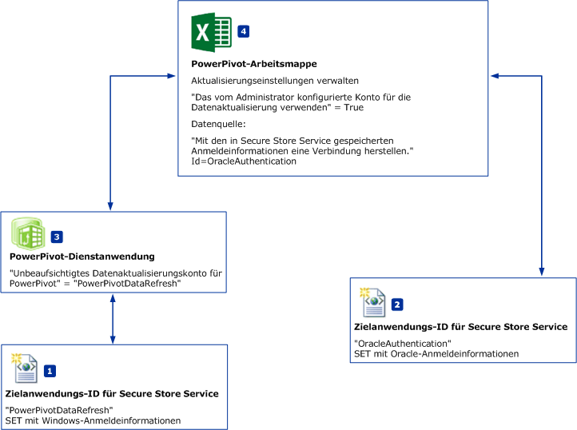
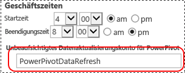

# Planen der Datenaktualisierung mit Datenquellen – keine Windowsauthentifizierung
  In diesem Thema wird ein Workflow für eine planmäßige Datenaktualisierung in [!INCLUDE[ssGemini](../../includes/ssgemini-md.md)] für SharePoint beschrieben. Dabei können Datenquellen verwendet werden, die die Windows-Authentifizierung **NICHT** unterstützen, z. B. Oracle- oder IDM DB2-Datenquellen. Obwohl sich die Abbildungen und Schritte in diesem Thema auf Oracle-Datenquellen beziehen, gilt der gleiche Workflow auch für andere Datenquellen.  
  
||  
|-|  
|**[!INCLUDE[applies](../../includes/applies-md.md)]** SharePoint 2010 &#124; SharePoint 2013|  
  
 **Übersicht:** Erstellen Sie zwei Secure Store-Zielanwendungen. Konfigurieren Sie die erste Zielanwendung (PowerPivotDataRefresh) für die Verwendung von Windows-Anmeldeinformationen. Konfigurieren Sie die zweite Zielanwendung mit den Anmeldeinformationen einer Datenquelle, die keine Windows-Authentifizierung unterstützt, z. B. eine Oracle-Datenbank. Darüber hinaus wird die erste Zielanwendung von der zweiten Zielanwendung für das unbeaufsichtigte Datenaktualisierungskonto verwendet.  
  
   
  
-   **(1) PowerPivotDatarefresh:** Eine Secure Store-Zielanwendungs-ID, für die im SET-Befehl die Windows-Authentifizierung angegeben ist.  
  
-   **(2) OracleAuthentication:** Eine Secure Store-Zielanwendungs-ID, für die im SET-Befehl Oracle-Anmeldeinformationen angegeben sind.  
  
-   **(3)** Die [!INCLUDE[ssGemini](../../includes/ssgemini-md.md)] -Dienstanwendung wird so konfiguriert, dass sie die Zielanwendung „PowerPivotDataRefresh“ für das **Unbeaufsichtigte Datenaktualisierungskonto**verwendet.  
  
-   **(4)** Die PowerPivot-Arbeitsmappe verwendet Oracle-Daten. In den Aktualisierungseinstellungen der Arbeitsmappe ist angegeben, dass die Anmeldeinformationen von Zielanwendung **(2)** für die Datenquellenverbindung verwendet werden.  
  
## Erforderliche Komponenten  
  
-   Eine [!INCLUDE[ssGemini](../../includes/ssgemini-md.md)] -Dienstanwendung ist vorhanden.  
  
-   Eine Secure Store Service-Anwendung ist vorhanden.  
  
-   Eine Excel-Arbeitsmappe mit einem [!INCLUDE[ssGemini](../../includes/ssgemini-md.md)] -Datenmodell ist vorhanden.  
  
## So erstellen Sie eine Zielanwendungs-ID, die die Windows-Authentifizierung verwendet  
  
1.  Klicken Sie in der SharePoint-Zentraladministration auf **Dienstanwendungen verwalten**.  
  
2.  Klicken Sie auf den Namen der Secure Store Service-Anwendung.  
  
3.  Klicken Sie auf der Seite **Verwalten** auf **Neu**.   
  
4.  Konfigurieren Sie auf der Seite **Neue Zielanwendung für einmaliges Anmelden erstellen** die folgenden Werte:  
  
    -   **Zielanwendungs-ID:** PowerPivotDataRefresh  
  
    -   **Anzeigename:** PowerPivotDataRefresh  
  
    -   **Kontakt-E-Mail:** ?  
  
    -   **Zielanwendungstyp:** Gruppe  
  
    -   **Seiten-URL der Zielanwendung:** Keine  
  
5.  Klicken Sie auf **Weiter**.  
  
6.  Übernehmen Sie auf der Seite „Anmeldeinformationen“ die beiden Standardfeldnamen und -typen **Windows-Benutzername** und **Windows-Kennwort**.  
  
7.  Klicken Sie auf **Weiter**.  
  
8.  Fügen Sie auf der Seite **Mitgliedschaftseinstellungen** mindestens einen **Zielanwendungs-Administrator** und anschließend Mitglieder hinzu, die Zugriff auf die Zielanwendung benötigen.  
  
9. Klicken Sie auf **OK**.  
  
10. Die neue Zielanwendungs-ID wird der Liste hinzugefügt. Wählen Sie die Zielanwendungs-ID, und klicken Sie auf **Anmeldeinformationen festlegen**.  
  
11. Geben Sie den Windows-Benutzernamen und das Windows-Kennwort ein, und klicken Sie auf **OK**.  
  
## So erstellen Sie eine Zielanwendungs-ID, die Oracle-Anmeldeinformationen verwendet  
  
1.  Klicken Sie in der SharePoint-Zentraladministration auf **Dienstanwendungen verwalten**.  
  
2.  Klicken Sie auf den Namen der Secure Store Service-Anwendung.  
  
3.  Auf der **verwalten** auf **neu**.  
  
4.  Konfigurieren Sie auf der Seite **Neue Zielanwendung für einmaliges Anmelden erstellen** die folgenden Werte:  
  
    -   **Zielanwendungs-ID:** OracleAuthentication  
  
    -   **Anzeigename:** OracleAuthentication  
  
    -   **Kontakt-E-Mail:** ?  
  
    -   **Zielanwendungstyp:** Gruppe  
  
    -   **Seiten-URL der Zielanwendung:** Keine  
  
5.  Klicken Sie auf **Weiter**.  
  
6.  Ändern Sie auf der Seite **Anmeldeinformationen** den ersten Feldnamen in **Oracle-Benutzer-ID** und **Feldtyp** in **Benutzername**.  
  
     Ändern Sie den zweiten Feldnamen in **Oracle-Kennwort** und den **Feldtyp** in **Kennwort**.  
  
7.  Klicken Sie auf **Weiter**.  
  
8.  Fügen Sie auf der Seite **Mitgliedschaftseinstellungen** mindestens einen **Zielanwendungs-Administrator** und anschließend Mitglieder hinzu, die Zugriff auf die Zielanwendung benötigen.  
  
9. Klicken Sie auf **OK**.  
  
10. Die neue Zielanwendungs-ID wird der Liste hinzugefügt. Wählen Sie die Zielanwendungs-ID, und klicken Sie auf **Anmeldeinformationen festlegen**.  
  
11. Geben Sie die Oracle-Benutzer-ID und das Oracle-Kennwort ein, und klicken Sie auf **OK**.  
  
 Weitere Informationen finden Sie im Abschnitt „So erstellen Sie eine Zielanwendung für die SQL Server-Authentifizierung“ in [Verwenden von Secure Store mit SQL Server-Authentifizierung (SharePoint Server 2013)](http://technet.microsoft.com/library/gg298949.aspx) (http://technet.microsoft.com/library/gg298949.aspx).  
  
## So konfigurieren Sie die PowerPivot-Dienstanwendung  
  
1.  Klicken Sie in der SharePoint-Zentraladministration auf Dienstanwendungen verwalten.  
  
2.  Klicken Sie auf den Namen der [!INCLUDE[ssGemini](../../includes/ssgemini-md.md)] -Dienstanwendung, z.B. „ [!INCLUDE[ssGemini](../../includes/ssgemini-md.md)] -Standarddienstanwendung“.  
  
3.  Klicken Sie im Abschnitt „Aktionen“ auf **Einstellungen für Dienstanwendung konfigurieren**.  
  
4.  Legen Sie die Option **Unbeaufsichtigtes Datenaktualisierungskonto für [!INCLUDE[ssGemini](../../includes/ssgemini-md.md)]**im Abschnitt **Datenaktualisierung** auf **PowerPivotDataRefresh** fest, und klicken Sie auf **OK**.  
  
       
  
## So konfigurieren Sie die Arbeitsmappe  
  
1.  Navigieren Sie zu Ihrer Arbeitsmappe in der [!INCLUDE[ssGemini](../../includes/ssgemini-md.md)] -Katalog, und klicken Sie auf **Datenaktualisierung verwalten**.  
  
2.  Sobald die Seite **Verlauf der Datenaktualisierung** angezeigt wird, klicken Sie auf **Zeitplan konfigurieren**.  
  
3.  Klicken Sie auf **Aktivieren**.  
  
4.  Klicken Sie auf **Außerdem so bald wie möglich aktualisieren**.  
  
5.  Klicken Sie im Abschnitt **Anmeldeinformationen** auf **Das vom Administrator konfigurierte Konto für die Datenaktualisierung verwenden**.  
  
6.  Deaktivieren Sie **Alle Datenquellen**.  
  
7.  Wählen Sie für die Datenquelle, die Oracle-Daten verwendet, die Option **Aktualisieren** aus. Der Name der Datenquelle kann in Microsoft Excel geändert werden, indem Sie auf das Menü **Daten**und dann auf **Verbindungen**und auf **Eigenschaften** klicken.  
  
8.  Wählen Sie unter Ihrer Datenquelle die Option **Standardzeitplan verwenden** aus.  
  
9. Wählen Sie **Stellen Sie mithilfe der in Secure Store Service (SSS) gespeicherten Anmeldeinformationen eine Verbindung her, um sich bei der Datenquelle anzumelden. Geben Sie die ID, mit der die Anmeldeinformationen nachgeschlagen werden, in das Feld „SSS-ID“ ein.**  
  
10. Geben Sie im Feld **ID** den Namen **OracleAuthentication** ein.  
  
11. Klicken Sie auf **OK**.  
  
     Wenn eine Fehlermeldung mit etwa dem Wortlaut `The provided Secure Store target application is either incorrectly configured or does not exist`angezeigt wird,  
  
     gibt es zwei Lösungswege:  
  
    -   Überprüfen Sie, ob die Zielanwendungs-ID richtig ist.  
  
    -   Stellen Sie sicher, dass Sie Anmeldeinformationen für die Zielanwendung festgelegt haben.  
  
## So überprüfen Sie die Datenaktualisierung mit der neuen Authentifizierung  
 Wenn Sie auf **OK**klicken, wird die Seite **Verlauf aktualisieren** angezeigt. Binnen weniger Minuten sollte ein neues Element im Verlauf angezeigt werden, da Sie in den vorangehenden Schritten **Außerdem sobald wie möglich aktualisieren**ausgewählt haben. Der Standardwert für den Zeitgeberauftrag **[!INCLUDE[ssGemini](../../includes/ssgemini-md.md)] -Datenaktualisierung** beträgt 1 Minute. Wenn im Verlauf kein neues Element angezeigt wird, warten Sie einige Minuten, und aktualisieren Sie Ihren Browser. Sollte das neue Element auch dann nicht sichtbar sein, überprüfen Sie den aktuellen Wert des Zeitgeberauftrags.  
  
## Weitere Informationen  
  
-   [Konfigurieren von Secure Store Service in SharePoint 2013](http://technet.microsoft.com/library/ee806866.aspx).  
  
-   Weitere Informationen finden Sie im Abschnitt „Geplante Datenaktualisierung“ unter [PowerPivot-Datenaktualisierung mit SharePoint 2013](http://msdn.microsoft.com/library/jj879294.aspx#bkmk_windows_auth_interactive_data_refresh).  
  
  

