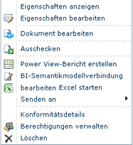

# Verwenden einer BI-Semantikmodellverbindung in Excel oder Reporting Services
  In diesem Thema wird erläutert, wie die BI-Semantikmodellverbindungen verwendet werden, die gemäß den Anweisungen in anderen Themen erstellt wurden. Falls Sie noch kein BI-Semantikmodell erstellt haben, gehen Sie unter [Erstellen einer BI-Semantikmodellverbindung zu einer PowerPivot-Arbeitsmappe](../../analysis-services/power-pivot-sharepoint/create-a-bi-semantic-model-connection-to-a-power-pivot-workbook.md) und [Erstellen einer BI-Semantikmodellverbindung mit einer tabellarischen Modelldatenbank](../../analysis-services/power-pivot-sharepoint/create-a-bi-semantic-model-connection-to-a-tabular-model-database.md).  
  
##   Herstellen einer Verbindung von Excel aus  
 Sie können eine BI-Semantikmodellverbindung als Datenquelle in Excel oder einer beliebigen anderen Geschäftsanwendung angeben, die Analysis Services-Daten im tabellarischen Modell verwendet. Dieser Abschnitt erläutert die zwei Ansätze zum Herstellen einer Verbindung mit BI-Semantikmodelldaten über Excel.  
  
 Bei BI-Semantikmodellverbindungen von Excel ist es erforderlich, dass Sie über Excel 2010 und den auf der Arbeitsstation installierten MSOLAP.5-OLE DB-Anbieter verfügen. Weitere Informationen zu Verbindungsanforderungen erhalten Sie im weiteren Verlauf dieses Abschnitts.  
  
 **Starten mit SharePoint**  
  
-   Klicken Sie mit der rechten Maustaste auf eine BI-Semantikmodellverbindung in einer Bibliothek, und wählen Sie **Excel starten** aus.  
  
   
  
 Klicken Sie auf **Aktivieren** , wenn Sie zur Aktivierung der Datenverbindungen aufgefordert werden. In Excel wird eine Arbeitsmappe geöffnet, die eine mit Feldern aus der zugrunde liegenden Datenquelle gefüllte PivotTable-Feldliste enthält.  
  
 **Starten von Excel aus**  
  
1.  Starten Sie Excel, und öffnen Sie eine Arbeitsmappe. Klicken Sie auf der Registerkarte Daten unter Externe Daten abrufen auf **Aus anderen Quellen**.  
  
2.  Klicken Sie auf **Aus Analysis Services** , und importieren Sie die Daten mithilfe des Datenverbindungs-Assistenten.  
  
3.  Geben Sie die SharePoint-URL der BI-Semantikmodell-Verbindungsdatei ein (z.B. **http://mysharepoint/shared documents/myData.bism**). Nehmen Sie bei der Option der Anmeldeinformationen das Standardprotokoll **Windows-Authentifizierung verwenden**an. Klicken Sie auf **Weiter**.  
  
4.  Klicken Sie auf der nächsten Seite erneut auf **Weiter** . Obwohl Sie aufgefordert werden, eine Datenbank auszuwählen, können Sie nur die eine Datenbank verwenden, die in der BI-Semantikmodellverbindung angegeben wird.  
  
5.  Auf der letzten Seite können Sie einen Anzeigenamen und eine Beschreibung angeben. Klicken Sie auf **Fertig stellen**, und klicken Sie dann im Dialogfeld zum Importieren von Daten auf **OK** , um die Daten zu importieren.  
  
 Damit Verbindungen erfolgreich sind, müssen Excel 2010 und MSOLAP.5.dll auf dem Clientcomputer installiert sein. Sie können den Anbieter erhalten, indem Sie die Version von [!INCLUDE[ssGemini](../../includes/ssgemini-md.md)] für Excel installieren, die für diese Version aktuell ist, oder Sie können nur den OLE DB-Anbieter für Analysis Services auf der [Feature Pack-Downloadseite](http://go.microsoft.com/fwlink/?linkid=214066)herunterladen.  
  
 Um zu überprüfen, ob MSOLAP.5.dll die aktuelle Version ist, überprüfen Sie in der Registrierung **HKEY_CLASSES_ROOT\MSOLAP**. **CurVer** muss auf MSOLAP.5 festgelegt sein.  
  
 Sie müssen auch über Leseberechtigungen für die BI-Semantikmodelldatei in SharePoint verfügen. Leseberechtigungen schließen Downloadrechte ein. Excel lädt die BI-Semantikmodell-Verbindungsinformationen von SharePoint herunter und öffnet über **HTTP Get**eine direkte Verbindung mit der Datenbank. Verbindungsanforderungen werden erst dann für SharePoint übernommen, wenn die BI-Semantikmodell-Verbindungsinformationen lokal gespeichert werden.  
  
 Wenn Sie eine Verbindung mit einer tabellarischen Modelldatenbank herstellen, die auf einem Analysis Services-Server ausgeführt wird, sind SharePoint-Berechtigungen nicht ausreichend. Sie müssen auch über Leseberechtigungen für die Datenbank auf dem Server verfügen. Dieser Schritt sollte ausgeführt werden, wenn Sie die BI-Semantikmodellverbindung herstellen. Weitere Informationen finden Sie unter [Erstellen einer BI-Semantikmodellverbindung mit einer tabellarischen Modelldatenbank](../../analysis-services/power-pivot-sharepoint/create-a-bi-semantic-model-connection-to-a-tabular-model-database.md).  
  
##   Herstellen einer Verbindung von Reporting Services in SharePoint aus  
 Sie können eine BI-Semantikmodellverbindung auf die gleiche Weise wie die meisten Datenquellen verwenden, indem Sie die Datei als Datenquelle im Dokument oder Tool angeben, das die Daten nutzt. Obwohl eine BI-Semantikmodellverbindung auf eine physische Datenbank auf einem anderen Server verweist, verwenden Sie die Verbindungsdatei, als sei sie die Datenquelle. Die SharePoint-URL der BI-Semantikmodellverbindung stellt einen gültigen Datenquellspeicherort für [!INCLUDE[ssCrescent](../../includes/sscrescent-md.md)] -Berichte dar, die BI-Semantikmodelldaten verwenden.  
  
 Für einen Ad-hoc-Berichtsentwurf in SharePoint muss der Benutzer, der den Bericht erstellt, über SharePoint-Berechtigungen für die BI-Semantikmodell-Verbindungsdatei (BISM-Datei) und für die Business Intelligence-Semantikmodelldatenbank verfügen. Der Sicherheitskontext der Verbindung ist der interaktive Benutzer, der den Bericht erstellt.  
  
  