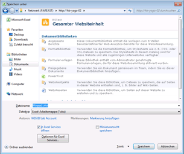

# Verwenden des Power Pivot-Katalogs
  [!INCLUDE[ssGemini](../../includes/ssgemini-md.md)] -Katalog ist eine besondere SharePoint-Dokumentbibliothek, die umfangreiche Vorschau- und Dokumentverwaltungsmöglichkeiten für veröffentlichte Excel-Arbeitsmappen und Reporting Services-Berichte bereitstellt, die [!INCLUDE[ssGemini](../../includes/ssgemini-md.md)]-Daten enthalten.  
  
> [!NOTE]  
>  Abhängig davon wie Ihr Server konfiguriert ist, werden unter Umständen für bestimmte Dokumente Warnungen oder Fehlermeldungen im Vorschaubereich angezeigt. Meldungen werden möglicherweise angezeigt, wenn für eine Excel-Arbeitsmappe festgelegt wurde, dass sie bei jedem Öffnen automatisch aktualisiert wird. Warnmeldungen zur Datenaktualisierung werden als Vorschaubild angezeigt, wenn Excel Services so konfiguriert ist, dass Fehlermeldungen als Warnung bei Datenaktualisierungen angezeigt werden. Farm- oder Dienstadministratoren können Konfigurationseinstellungen ändern, damit eine Vorschau des tatsächlichen Arbeitsblatts angezeigt wird. Weitere Informationen finden Sie unter [Erstellen eines vertrauenswürdigen Speicherorts für PowerPivot-Websites in der Zentraladministration](../../analysis-services/power-pivot-sharepoint/create-a-trusted-location-for-power-pivot-sites-in-central-administration.md).  
  
##   In diesem Thema  
 [Erforderliche Komponenten](#prereq)  
  
 [Symbole im Power Pivot-Katalog](#icons)  
  
 [Speichern einer Excel-Arbeitsmappe im Power Pivot-Katalog](#add)  
  
 [Erstellen neuer Berichte oder Arbeitsmappen auf Grundlage einer veröffentlichten Power Pivot-Arbeitsmappe](#newdocs)  
  
 [Öffnen einer Arbeitsmappe oder eines Berichts im Ganzseitenmodus](#view)  
  
 [Planen der Datenaktualisierung für Power Pivot-Arbeitsmappen im Power Pivot-Katalog](#newdr)  
  
 [Löschen einer Arbeitsmappe oder eines Berichts im Power Pivot-Katalog](#delete)  
  
 [Aktualisieren eines Miniaturbilds](#image)  
  
 [Bekannte Probleme](#bkmk_known_issues)  
  
##   Erforderliche Komponenten  
  
> [!NOTE]  
>  Für den Power Pivot-Katalog ist Microsoft Silverlight erforderlich.  Silverlight wird vom Microsoft Edge-Browser nicht unterstützt.   
> Um die Bibliotheksinhalte in Edge anzuzeigen, klicken Sie auf die Registerkarte **Bibliothek** im Power Pivot-Katalog, und ändern Sie dann die Ansicht der Dokumentbibliothek in **Alle Dokumente**.    
> Um die Standardansicht zu ändern, klicken Sie auf die Registerkarte **Bibliothek** und dann auf „Ansicht ändern“. Klicken Sie auf „Zur Standardansicht machen“, und klicken Sie dann auf „OK“, um die Standardansicht zu speichern.  
>  Weitere Informationen zu den von Edge unterstützten Features finden Sie im Windows-Blog, [A break from the past, part 2: Saying goodbye to ActiveX, VBScript...](http://blogs.windows.com/msedgedev/2015/05/06/a-break-from-the-past-part-2-saying-goodbye-to-activex-vbscript-attachevent/)  
  
 Eine vollständige Liste der Voraussetzungen, finden Sie unter [Erstellen und Anpassen des PowerPivot-Katalogs](../../analysis-services/power-pivot-sharepoint/create-and-customize-power-pivot-gallery.md).  
  
##   Symbole im Power Pivot-Katalog  
 Symbole stellen einen visuellen Indikator zur Inhaltsverfügbarkeit und zum Status bereit.  
  
|Symbol|Description|  
|----------|-----------------|  
||Das Sanduhrsymbol wird angezeigt, wenn ein Miniaturbild jeder Seite im Dokument generiert wird. Aktualisieren Sie die Seite, um das aktualisierte Bild anzuzeigen.|  
||Das Seitensymbol wird angezeigt, wenn eine Arbeitsmappe oder ein Bericht mehr Seiten aufweist, als im [!INCLUDE[ssGemini](../../includes/ssgemini-md.md)]-Katalog angezeigt werden können. Sie können alle Seiten mithilfe einer Clientanwendung anzeigen.|  
||Das Fehlersymbol wird angezeigt, wenn ein Miniaturbild für das Dokument nicht gerendert werden konnte. Das Dokument wird in der Bibliothek veröffentlicht, es kann jedoch nicht in den benutzerdefinierten [!INCLUDE[ssGemini](../../includes/ssgemini-md.md)]-Katalogsichten gerendert werden. Sie sollten in der Lage sein, das Dokument in einer Clientanwendung anzuzeigen, z.B. im [!INCLUDE[ssGemini](../../includes/ssgemini-md.md)]-Add-In für Excel.|  
||Das Symbol für nicht verfügbaren Inhalt wird angezeigt, wenn das Dokument, das Sie hochgeladen haben, nicht im [!INCLUDE[ssGemini](../../includes/ssgemini-md.md)]-Katalog gerendert werden kann. Zu den unterstützten Dokumenttypen gehören [!INCLUDE[ssGemini](../../includes/ssgemini-md.md)]-Arbeitsmappen und Berichte, die im Berichts-Generator von SQL Server 2008 R2 Reporting Services erstellt wurden.   Dieses Symbol wird auch angezeigt, wenn Sie ein Dokument aus dem Papierkorb wiederverwenden.   Wenn dieses Symbol für ein Dokument angezeigt wird, das zuvor ein gültiges Vorschaubild gezeigt hat, können Sie das Bild aktualisieren, indem Sie eine Dokumenteigenschaft bearbeiten und die Änderungen dann speichern.|  
||Das Symbol für gesperrte Inhalte wird angezeigt, wenn Miniaturbilder absichtlich für dieses Dokument deaktiviert werden. [!INCLUDE[ssGemini](../../includes/ssgemini-md.md)] -Katalog generiert keine Miniaturbilder für Excel-Arbeitsmappen, die keine [!INCLUDE[ssGemini](../../includes/ssgemini-md.md)]-Daten enthalten, oder für [!INCLUDE[ssGemini](../../includes/ssgemini-md.md)]-Arbeitsmappen oder Reporting Services-Berichte, die die Anforderungen für die Momentaufnahmegenerierung nicht erfüllen. Weitere Informationen finden Sie im Abschnitt zu Voraussetzungen in diesem Thema.|  
  
##   Speichern einer Excel-Arbeitsmappe im Power Pivot-Katalog  
 Sie können [!INCLUDE[ssGemini](../../includes/ssgemini-md.md)] -Arbeitsmappen in der Bibliothek veröffentlichen, indem Sie alle in Excel 2010 verfügbaren Freigabeverfahren verwenden. In Excel 2010 können Sie mit der Option Speichern unter den gesamten SharePoint-Pfad oder einen Teil davon in einer Bibliothek zu speichern.  
  
1.  Speichern Sie die Datei.  
  
2.  1.  **Excel 2010:** Klicken Sie im Menü „Datei“ auf **Speichern und senden**.  
  
    2.  Klicken Sie auf **Auf SharePoint speichern**.  
  
    3.  Klicken Sie auf **Veröffentlichungsoptionen** , wenn Sie Optionen für Excel Services verwenden möchten, um einzelne Blätter oder Parameter auszuwählen, die Sie veröffentlichen möchten. Auf der Registerkarte Parameter in den Optionen für Excel Services können Sie z. B. auswählen, welche Slicer in der veröffentlichten Arbeitsmappe angezeigt werden.  
  
    1.  **Excel 2013:**  Klicken Sie im Menü Datei auf **Speichern**.  
  
    2.  Klicken Sie auf ** ** Optionen für die Browseransicht, wenn Sie Optionen für Excel Services verwenden möchten, um einzelne Blätter oder Parameter auszuwählen, die veröffentlicht werden sollen. Auf der Registerkarte Parameter in den Optionen für Excel Services können Sie z. B. auswählen, welche Slicer in der veröffentlichten Arbeitsmappe angezeigt werden.  
  
3.  Geben Sie im Dialogfeld Speichern unter im Feld Dateiname eine vollständige oder partielle URL zum [!INCLUDE[ssGemini](../../includes/ssgemini-md.md)] -Katalog ein. Wenn Sie einen Teil der URL-Adresse eingeben, z. B. den Servernamen, können Sie die Website nach dem [!INCLUDE[ssGemini](../../includes/ssgemini-md.md)] -Katalog durchsuchen. Klicken Sie dazu auf **Speichern** , um eine Verbindung mit dem angegebenen Server zu öffnen.  
  
       
  
1.  Wählen Sie im Dialogfeld Speichern unter den [!INCLUDE[ssGemini](../../includes/ssgemini-md.md)] -Katalog auf Ihrer Website aus.  
  
2.  Klicken Sie auf **Öffnen** , um die Bibliothek zu öffnen.  
  
3.  Klicken Sie auf **Speichern** , um die Arbeitsmappe in der Bibliothek zu veröffentlichen.  
  
 Überprüfen Sie in einem Browserfenster, ob das Dokument im [!INCLUDE[ssGemini](../../includes/ssgemini-md.md)] -Katalog angezeigt wird. Neu veröffentlichte Dokumente werden in der Liste angezeigt. Die Bibliothekseinstellungen bestimmen, wo das Dokument ( z. B. in aufsteigender Reihenfolge nach Datum sortiert oder alphabetisch nach Namen) angezeigt wird. Möglicherweise müssen Sie das Browserfenster aktualisieren, um die letzten Hinzufügungen anzuzeigen.  
  
#### Hochladen einer Arbeitsmappe in den Power Pivot-Katalog  
 Sie können auch eine Arbeitsmappe hochladen, wenn Sie von SharePoint aus starten und die zu veröffentlichende Datei auf dem Computer auswählen möchten.  
  
1.  Öffnen Sie auf einer SharePoint-Website den [!INCLUDE[ssGemini](../../includes/ssgemini-md.md)] -Katalog.  
  
2.  Klicken Sie im Bibliotheksmenüband auf **Dokumente**.  
  
3.  Aktivieren Sie unter **Dokument hochladen**eine Uploadoption, und geben Sie dann den Namen und Speicherort der Datei ein, die Sie hochladen möchten. Bibliothekseinstellungen bestimmen, wo das Dokument angezeigt wird. Möglicherweise müssen Sie das Browserfenster aktualisieren, um die letzte Hinzufügung anzuzeigen.  
  
##   Erstellen neuer Berichte oder Arbeitsmappen auf Grundlage einer veröffentlichten Power Pivot-Arbeitsmappe  
 Sie können für [!INCLUDE[ssGemini](../../includes/ssgemini-md.md)] -Arbeitsmappen, die Sie im [!INCLUDE[ssGemini](../../includes/ssgemini-md.md)] -Katalog veröffentlichen, zusätzliche Arbeitsmappen oder Reporting Services-Berichte erstellen, die die veröffentlichte Arbeitsmappe als verbundene Datenquelle verwenden.  
  
|||  
|-|-|  
||Klicken Sie in der Schaltfläche Neuer Bericht auf den Abwärtspfeil, um den Berichts-Generator oder Excel 2010 zu starten. [!INCLUDE[ssGemini](../../includes/ssgemini-md.md)] -Katalog muss eine der vordefinierten Sichten (Theater-, Katalog- oder Karussellsicht) verwenden, damit die Schaltfläche „Neuer Bericht“ verfügbar wird.|  
  
#### Erstellen eines Berichts im Berichts-Generator  
 Das Erstellen eines neuen Berichts auf Grundlage einer vorhandenen [!INCLUDE[ssGemini](../../includes/ssgemini-md.md)]-Arbeitsmappe in der Bibliothek erfordert, dass Reporting Services für die Websites, die den [!INCLUDE[ssGemini](../../includes/ssgemini-md.md)]-Katalog enthalten, für die SharePoint-Integration konfiguriert ist. Wenn Sie die Option zum Erstellen eines Berichts-Generator-Berichts aktivieren, wird der Berichts-Generator vom Berichtsserver heruntergeladen und bei der ersten Verwendung auf der lokalen Arbeitsstation installiert. Eine Platzhalterberichtdatei wird für den neuen Bericht erstellt und im [!INCLUDE[ssGemini](../../includes/ssgemini-md.md)]-Katalog gespeichert. Verbindungsinformationen für die [!INCLUDE[ssGemini](../../includes/ssgemini-md.md)]-Arbeitsmappe werden für Sie als neue Datenquelle im Bericht erstellt. Als nächsten Schritt können Sie die Datasets und das Berichtslayout im Entwurfsarbeitsbereich erstellen. Wie Sie den Bericht mithilfe des Berichts-Generators zusammenstellen, können Sie Ihre Änderungen und das Endergebnis im Berichtsdokument im Katalog speichern. Um spätere Datentrennungen zu vermeiden, stellen Sie sicher, dass der Bericht und die Arbeitsmappendateien sich in der gleichen Bibliothek befinden.  
  
#### Öffnen einer neuen Excel-Arbeitsmappe  
 Um eine neue Excel-Arbeitsmappe aus einer vorhandenen Arbeitsmappe zu erstellen, müssen Excel und [!INCLUDE[ssGeminiClient](../../includes/ssgeminiclient-md.md)] bereits auf dem lokalen Computer installiert sein. Bei Auswahl der Option „Neue Excel-Arbeitsmappe öffnen“ wird eine leere Arbeitsmappendatei (.xlsx) geöffnet, und [!INCLUDE[ssGemini](../../includes/ssgemini-md.md)]-Daten werden im Hintergrund als verbundene Datenquelle geladen. Nur die Daten aus dem [!INCLUDE[ssGemini](../../includes/ssgemini-md.md)]-Fenster in der ursprünglichen Arbeitsmappe werden in der neuen Arbeitsmappe verwendet. PivotTables oder PivotCharts aus der ursprünglichen Arbeitsmappe sind nicht enthalten. Die neue Arbeitsmappe wird mit Daten in der ursprünglichen Arbeitsmappe verknüpft. Die Daten werden nicht in die neue Arbeitsmappe selbst kopiert.  
  
##   Öffnen einer Arbeitsmappe oder eines Berichts im Ganzseitenmodus  
 Klicken Sie auf ein sichtbares Miniaturbild des in der Vorschau angezeigten Dokuments, um es unabhängig von der [!INCLUDE[ssGemini](../../includes/ssgemini-md.md)] -Katalogvorschau im Modus Ganze Seite zu öffnen. [!INCLUDE[ssGemini](../../includes/ssgemini-md.md)] -Arbeitsmappen werden in einem Browser geöffnet. Reporting Services-Berichte werden im ReportViewer-Webpart geöffnet, das Teil der Reporting Services-Bereitstellung auf einem SharePoint-Server ist.  
  
 Eine alternative Möglichkeit zum Anzeigen der Arbeitsmappe in einem Browser besteht darin, sie in Excel auf einer Clientarbeitsstation zu öffnen. Sie benötigen Excel 2013 oder Excel 2010 und das [!INCLUDE[ssGeminiClient](../../includes/ssgeminiclient-md.md)]-Add-In, um die Datei anzuzeigen. Sie können die Datei mit Excel 2007 öffnen, es ist jedoch nicht möglich, die Daten zu pivotieren. Aus diesem Grund wird sowohl zum Anzeigen als auch zum Erstellen von [!INCLUDE[ssGemini](../../includes/ssgemini-md.md)]-Daten Excel 2013 oder Excel 2010 empfohlen. Falls Sie nicht über die erforderlichen Anwendungen verfügen, müssen Sie einen Browser verwenden, um die Arbeitsmappe aus SharePoint anzuzeigen.  
  
##   Planen der Datenaktualisierung für Power Pivot-Arbeitsmappen im Power Pivot-Katalog  
 [!INCLUDE[ssGemini](../../includes/ssgemini-md.md)] -Daten in einer veröffentlichten Excel-Arbeitsmappe können in geplanten Intervallen aktualisiert werden.  
  
|||  
|-|-|  
||Klicken Sie auf die Schaltfläche Datenaktualisierung verwalten, um einen Zeitplan zu erstellen oder anzuzeigen, nach dem aktualisierte Daten aus verbundenen Datenquellen abgerufen werden. Anleitungen zum Erstellen eines Zeitplans finden Sie unter [Planen einer Datenaktualisierung (PowerPivot für SharePoint)](http://msdn.microsoft.com/de-de/8571208f-6aae-4058-83c6-9f916f5e2f9b).|  
  
##   Löschen einer Arbeitsmappe oder eines Berichts im Power Pivot-Katalog  
 Um ein Dokument aus der Bibliothek zu löschen, wechseln Sie zunächst zur Ansicht Alle Dokumente.  
  
1.  Öffnen Sie auf einer SharePoint-Website den [!INCLUDE[ssGemini](../../includes/ssgemini-md.md)] -Katalog.  
  
2.  Klicken Sie im Menüband auf **Bibliothek**.  
  
3.  Klicken Sie unter Ansichten verwalten in der Liste Aktuelle Ansicht auf den Pfeil nach unten, und wählen Sie Alle Dokumente aus.  
  
4.  Wählen Sie die Arbeitsmappe oder den Bericht aus, die oder den Sie löschen möchten.  
  
5.  Klicken Sie in „Dokumente (Dateien)“ unter „Verwalten“ auf die Schaltfläche **Dokument löschen**.  
  
##   Aktualisieren eines Miniaturbilds  
 Generieren Sie mithilfe der folgenden Schritte ein Miniaturbild für ein Dokument im [!INCLUDE[ssGemini](../../includes/ssgemini-md.md)]-Katalog erneut.  
  
1.  Wechseln Sie im [!INCLUDE[ssGemini](../../includes/ssgemini-md.md)]-Katalog zur Sicht „Alle Dokumente“. Klicken Sie hierzu im Menüband auf **Bibliothek** , und ändern Sie **Aktuelle Ansicht** in **Alle Dokumente**.  
  
2.  Wählen Sie die Arbeitsmappe oder den Bericht aus, für die bzw. den Sie das Miniaturbild aktualisieren möchten.  
  
3.  Klicken Sie auf den Abwärtspfeil rechts, und wählen Sie dann **Eigenschaften bearbeiten**.  
  
4.  Klicken Sie auf **Speichern**. Beim Speichern des Dokuments generiert der Momentaufnahmedienst das Vorschaubild erneut.  
  
##   Bekannte Probleme  
  
### Dokumenttyp wird nicht unterstützt  
 Der Inhaltstyp **[!INCLUDE[ssGemini](../../includes/ssgemini-md.md)]-Katalogdokument** wird nicht unterstützt. Wenn Sie den Inhaltstyp **[!INCLUDE[ssGemini](../../includes/ssgemini-md.md)]-Katalogdokument** für eine Dokumentbibliothek aktivieren und versuchen, ein neues Dokument dieses Typs zu erstellen, wird eine Fehlermeldung ähnlich der folgenden angezeigt:  
  
-   "Neues Dokument" erfordert eine Anwendung oder einen Webbrowser, die bzw. der mit Microsoft SharePoint Foundation kompatibel ist. Um der Dokumentbibliothek ein Dokument hinzuzufügen, klicken Sie auf die Schaltfläche Dokument hochladen.  
  
-   "Die Internetadresse 'http://[Servername]/testSite/PowerPivot Gallery/ReportGallery/Forms/Template.xlsx' ist ungültig.""Microsoft Excel kann auf die Datei 'http://[Servername]/testSite/PowerPivot Gallery/ReportGallery/Forms/Template.xlsx' nicht zugreifen." Dies kann mehrere Gründe haben:  
  
 Der Inhaltstyp **[!INCLUDE[ssGemini](../../includes/ssgemini-md.md)]-Katalogdokument** wird Dokumentbibliotheken nicht automatisch hinzugefügt. Dieses Problem tritt nur dann auf, wenn Sie den nicht unterstützten Inhaltstyp manuell aktivieren.  
  
## Siehe auch  
 [Erstellen eines vertrauenswürdigen Speicherorts für Power Pivot-Websites in der Zentraladministration](../../analysis-services/power-pivot-sharepoint/create-a-trusted-location-for-power-pivot-sites-in-central-administration.md)   
 [Löschen eines Power Pivot-Katalogs](../../analysis-services/power-pivot-sharepoint/delete-power-pivot-gallery.md)   
 [Erstellen und Anpassen des PowerPivot-Katalogs](../../analysis-services/power-pivot-sharepoint/create-and-customize-power-pivot-gallery.md)   
 [Planen einer Datenaktualisierung (PowerPivot für SharePoint)](http://msdn.microsoft.com/de-de/8571208f-6aae-4058-83c6-9f916f5e2f9b)  
  
  